# andrieu-pmcmc-2010

<!-- PDF page 1 -->

*J. R. Statist. Soc.* B (2010) **72**, *Part* 3, *pp.* 269–342

# Particle Markov chain Monte Carlo methods

Christophe Andrieu,

*University of Bristol, UK*

Arnaud Doucet

*University of British Columbia, Vancouver, Canada, and Institute of Statistical Mathematics, Tokyo, Japan*

and Roman Holenstein

*University of British Columbia, Vancouver, Canada*

[*Read before* The Royal Statistical Society *at a meeting organized by the* Research Section *on Wednesday, Ocober 14th, 2009,* Professor D. Firth *in the Chair*]

**Summary.** Markov chain Monte Carlo and sequential Monte Carlo methods have emerged as the two main tools to sample from high dimensional probability distributions. Although asymptotic convergence of Markov chain Monte Carlo algorithms is ensured under weak assumptions, the performance of these algorithms is unreliable when the proposal distributions that are used to explore the space are poorly chosen and/or if highly correlated variables are updated independently. We show here how it is possible to build efficient high dimensional proposal distributions by using sequential Monte Carlo methods. This allows us not only to improve over standard Markov chain Monte Carlo schemes but also to make Bayesian inference feasible for a large class of statistical models where this was not previously so. We demonstrate these algorithms on a non-linear state space model and a Lévy-driven stochastic volatility model.

*Keywords*: Bayesian inference; Markov chain Monte Carlo methods; Sequential Monte Carlo methods; State space models

*Address for correspondence*: Arnaud Doucet, Department of Statistics, University of British Columbia, 333–6356 Agricultural Road, Vancouver, British Columbia, V6T 1Z2, Canada. E-mail: Arnaud@stat.ubc.ca

© 2010 Royal Statistical Society

1369–7412/10/72269

## 1. Introduction

Monte Carlo methods have become one of the standard tools of the statistician’s apparatus and among other things have allowed the Bayesian paradigm to be routinely applied to ever more sophisticated models. However, expectations are constantly rising and such methods are now expected to deal with high dimensionality and complex patterns of dependence in statistical models. In this paper we propose a novel addition to the Monte Carlo toolbox named particle Markov chain Monte Carlo (PMCMC) methods. They rely on a non-trivial and non-standard combination of MCMC and sequential Monte Carlo (SMC) methods which takes advantage of the strength of its two components. Several algorithms combining MCMC and SMC approaches have already been proposed in the literature. In particular, MCMC kernels have been used to build proposal distributions for SMC algorithms (Gilks and Berzuini, 2001). Our approach is entirely different as we use SMC algorithms to design efficient high dimensional proposal distributions for MCMC algorithms. As we shall see, our framework is particularly suitable for inference in state space models (SSMs) but extends far beyond this application of choice and

<!-- PDF page 2 -->

allows us to push further the boundaries of the class of problems that can be routinely addressed by using MCMC methods.

To be more specific, the successful design of most practical Monte Carlo algorithms to sample from a target distribution, say $\pi$, in scenarios involving both high dimension and complex patterns of dependence relies on the appropriate choice of proposal distributions. As a rule of thumb, to lead to efficient algorithms, such distributions should both be easy to sample from and capture some of the important characteristics of $\pi$, such as its scale or dependence structure. Whereas the design of such efficient proposal distributions is often feasible in small dimensions, this proves to be much more difficult in larger scenarios. The classical solution that is exploited by both MCMC and SMC methods, albeit in differing ways, consists of breaking up the original sampling problem into smaller and simpler sampling problems by focusing on some of the subcomponents of $\pi$. This results in an easier design of proposal distributions. This relative ease of implementation comes at a price, however, as such local strategies inevitably ignore some of the global features of the target distribution $\pi$, resulting in potentially poor performance. The art of designing Monte Carlo algorithms mainly resides in the adoption of an adequate trade-off between simplicity of implementation and the often difficult incorporation of important characteristics of the target distribution. Our novel approach exploits differing strengths of MCMC and SMC algorithms, which allow us to design efficient and flexible MCMC algorithms for important classes of statistical models, while typically requiring limited design effort on the user’s part. This is illustrated later in the paper (Section 3) where, even using standard off-the-shelf components, our methodology allows us straightforwardly to develop efficient MCMC algorithms for important models for which no satisfactory solution is currently available.

The rest of the paper is organized as follows. Section 2 is entirely dedicated to inference in SSMs. This class of models is ubiquitous in applied science and lends itself particularly well to the exposition of our methodology. We show that PMCMC algorithms can be thought of as natural approximations to standard and ‘idealized’ MCMC algorithms which cannot be implemented in practice. This section is entirely descriptive both for pedagogical purposes and to demonstrate the conceptual and implementational simplicity of the resulting algorithms. In Section 3, we demonstrate the efficiency of our methodology on a non-linear SSM and a Lévy-driven stochastic volatility model. We first show that PMCMC sampling allows us to perform Bayesian inference simply in non-linear non-Gaussian scenarios where standard MCMC methods can fail. Second, we demonstrate that it is an effective method in situations where using the prior distribution of the underlying latent process as the proposal distribution is the only known practical possibility. In Section 4 we provide a simple and complete formal justification for the validity and properties of PMCMC algorithms. Key to our results is the realization that such seemingly approximate algorithms sample from an artificial distribution which admits our initial target distribution of interest as one of its components. The framework that is considered is somewhat more abstract and general than that for SSMs but has the advantage of applicability far beyond this class of models. In Section 5 we discuss connections to previous work and potential extensions.

## 2. Inference in state space models

In this section we first introduce notation and describe the standard inference problems that are associated with SSMs. Given the central role of SMC sampling in the PMCMC methodology, we then focus on their description when applied to inference in SSMs. For pedagogical purposes we consider in this section one of the simplest possible implementations—standard improvements are discussed in Section 2.5. The strengths and limitations of SMC methods are

<!-- PDF page 3 -->

subsequently briefly discussed and we then move on to describe standard MCMC strategies for inference in SSMs. Again we briefly discuss their strengths and weaknesses and then show how our novel methodology can address the same inference problems, albeit in a potentially more efficient way. No justification for the validity of the algorithms presented is provided here—this is postponed to Section 4.

### 2.1. State space models

Further on, we use the standard convention whereby capital letters denote random variables, whereas lower case letters are used for their values. Consider the following SSM, which is also known as a hidden Markov model. In this context, a hidden Markov state process $\{X_n; n \geqslant 1\} \subset \mathcal{X}^{\mathbb{N}}$ is characterized by its initial density $X_1 \sim \mu_\theta(\cdot)$ and transition probability density

$$X_{n+1} \mid (X_n = x) \sim f_\theta(\cdot \mid x), \tag{1}$$

for some static parameter $\theta \in \Theta$ which may be multidimensional. The process $\{X_n\}$ is observed, not directly, but through another process $\{Y_n; n \geqslant 1\} \subset \mathcal{Y}^{\mathbb{N}}$. The observations are assumed to be conditionally independent given $\{X_n\}$, and their common marginal probability density is of the form $g_\theta(y \mid x)$; i.e., for $1 \leqslant n \leqslant m$,

$$Y_n \mid (X_1, \ldots, X_n = x, \ldots, X_m) \sim g_\theta(\cdot \mid x). \tag{2}$$

Hereafter for any generic sequence $\{z_n\}$ we shall use $z_{i:j}$ to denote $(z_i, z_{i+1}, \ldots, z_j)$.

Our aim is to perform Bayesian inference in this context, conditional on some observations $y_{1:T}$ for some $T \geqslant 1$. When $\theta \in \Theta$ is a known parameter, Bayesian inference relies on the posterior density $p_\theta(x_{1:T} \mid y_{1:T}) \propto p_\theta(x_{1:T}, y_{1:T})$ where

$$p_\theta(x_{1:T}, y_{1:T}) = \mu_\theta(x_1) \prod_{n=2}^{T} f_\theta(x_n \mid x_{n-1}) \prod_{n=1}^{T} g_\theta(y_n \mid x_n). \tag{3}$$

If $\theta$ is unknown, we ascribe a prior density $p(\theta)$ to $\theta$ and Bayesian inference relies on the joint density

$$p(\theta, x_{1:T} \mid y_{1:T}) \propto p_\theta(x_{1:T}, y_{1:T})\, p(\theta). \tag{4}$$

For non-linear non-Gaussian models, $p_\theta(x_{1:T} \mid y_{1:T})$ and $p(\theta, x_{1:T} \mid y_{1:T})$ do not usually admit closed form expressions, making inference difficult in practice. It is therefore necessary to resort to approximations. Monte Carlo methods have been shown to provide a flexible framework to carry out inference in such models. It is impossible to provide a thorough review of the area here and instead we briefly review the underlying principles of MCMC and SMC methods for SSM models at a level that is sufficient to understand our novel methodology.

### 2.2. Sequential Monte Carlo algorithm for state space models

In the SSM context, SMC methods are a class of algorithms to approximate sequentially the sequence of posterior densities $\{p_\theta(x_{1:n} \mid y_{1:n}); n \geqslant 1\}$ as well as the sequence of marginal likelihoods $\{p_\theta(y_{1:n}); n \geqslant 1\}$ for a given $\theta \in \Theta$. More precisely such methods aim to approximate first $p_\theta(x_1 \mid y_1)$ and $p_\theta(y_1)$, then $p_\theta(x_{1:2} \mid y_{1:2})$ and $p_\theta(y_{1:2})$ and so on. In the context of SMC methods, the posterior distributions that are associated with such densities are approximated by a set of $N$ weighted random samples called particles, leading for any $n \geqslant 1$ to the approximation

$$\hat{p}_\theta(\mathrm{d}x_{1:n} \mid y_{1:n}) := \sum_{k=1}^{N} W_n^k\, \delta_{X_{1:n}^k}(\mathrm{d}x_{1:n}), \tag{5}$$

<!-- PDF page 4 -->

where $W_n^k$ is a so-called importance weight associated with particle $X_{1:n}^k$. We now briefly describe how such sample-based approximations can be propagated efficiently in time.

#### 2.2.1. A sequential Monte Carlo algorithm

The simplest SMC algorithm propagates the particles $\{X_{1:n}^k\}$ and updates the weights $\{W_{1:n}^k\}$ as follows. At time 1 of the procedure, importance sampling (IS) is used to approximate $p_\theta(x_1 \mid y_1)$ by using an importance density $q_\theta(x_1 \mid y_1)$. In effect, $N$ particles $\{X_1^k\}$ are generated from $q_\theta(x_1 \mid y_1)$ and ascribed importance weights $\{W_1^k\}$ which take into account the discrepancy between the two densities. To produce $N$ particles approximately distributed according to $p_\theta(x_1 \mid y_1)$ we sample $N$ times from the IS approximation $\hat{p}_\theta(\mathrm{d}x_1 \mid y_1)$ of $p_\theta(x_1 \mid y_1)$; this is known as the resampling step. At time 2 we aim to use IS to approximate $p_\theta(x_{1:2} \mid y_{1:2})$. The identity

$$p_\theta(x_{1:2} \mid y_{1:2}) \propto p_\theta(x_1 \mid y_1)\, f_\theta(x_2 \mid x_1)\, g_\theta(y_2 \mid x_2)$$

suggests reusing the samples obtained at time 1 as a source of samples approximately distributed according to $p_\theta(x_1 \mid y_1)$ and extending each such particle through an IS density $q_\theta(x_2 \mid y_2, x_1)$ to produce samples approximately distributed according to $p_\theta(x_1 \mid y_1)\, q_\theta(x_2 \mid y_2, x_1)$. Again importance weights $\{W_2^k\}$ need to be computed since our target is $p_\theta(x_{1:2} \mid y_{1:2})$ and a resampling step produces samples approximately distributed according to $p_\theta(x_{1:2} \mid y_{1:2})$. This procedure is then repeated until time $T$. The resampling procedure of the SMC algorithm prevents an accumulation of errors by eliminating unpromising samples: this can be both demonstrated practically and quantified theoretically (see Section 4.1 for a discussion).

Pseudocode of the SMC algorithm that was outlined above is provided below. To alleviate the notational burden we adopt below the convention that whenever the index $k$ is used we mean ‘for all $k \in \{1, \ldots, N\}$’, and we also omit the dependence of the importance weights on $\theta$—we shall do so in the remainder of the paper when confusion is not possible. We also use the notation $\mathbf{W}_n := (W_n^1, \ldots, W_n^N)$ for the normalized importance weights at time $n$ and $\mathcal{F}(\cdot \mid \mathbf{p})$ for the discrete probability distribution on $\{1, \ldots, m\}$ of parameter $\mathbf{p} = (p_1, \ldots, p_m)$ with $p_k \geqslant 0$ and $\Sigma_{k=1}^{m}\, p_k = 1$, for some $m \in \mathbb{N}$.

*Step 1*: at time $n = 1$,

(a) sample $X_1^k \sim q_\theta(\cdot \mid y_1)$ and

(b) compute and normalize the weights

$$\begin{aligned} w_1(X_1^k) &:= \frac{p_\theta(X_1^k, y_1)}{q_\theta(X_1^k \mid y_1)} = \frac{\mu_\theta(X_1^k)\, g_\theta(y_1 \mid X_1^k)}{q_\theta(X_1^k \mid y_1)}, \\ W_1^k &:= \frac{w_1(X_1^k)}{\sum_{m=1}^{N} w_1(X_1^m)}. \end{aligned} \tag{6}$$

*Step 2*: at times $n = 2, \ldots, T$,

(a) sample $A_{n-1}^k \sim \mathcal{F}(\cdot \mid \mathbf{W}_{n-1})$,

(b) sample $X_n^k \sim q(\cdot \mid y_n, X_{n-1}^{A_{n-1}^k})$ and set $X_{1:n}^k := (X_{1:n-1}^{A_{n-1}^k}, X_n^k)$, and

(c) compute and normalize the weights

$$w_n(X_{1:n}^k) := \frac{p_\theta(X_{1:n}^k, y_{1:n})}{p_\theta(X_{1:n-1}^{A_{n-1}^k}, y_{1:n-1})\, q_\theta(X_n^k \mid y_n, X_{n-1}^{A_{n-1}^k})} \tag{7}$$

<!-- PDF page 5 -->

$$\begin{aligned} &= \frac{f_\theta(X_n^k \mid X_{n-1}^{A_{n-1}^k})\, g_\theta(y_n \mid X_n^k)}{q_\theta(X_n^k \mid y_n, X_{n-1}^{A_{n-1}^k})}, \\ W_n^k &:= \frac{w_n(X_{1:n}^k)}{\sum_{m=1}^{N} w_n(X_{1:n}^m)}. \end{aligned}$$

In this description, the variable $A_{n-1}^k$ represents the index of the ‘parent’ at time $n-1$ of particle $X_{1:n}^k$ for $n = 2, \ldots, T$. The standard multinomial resampling procedure is thus here interpreted as being the operation by which offspring particles at time $n$ choose their ancestor particles at time $n-1$, according to the distribution

$$r(\mathbf{A}_{n-1} \mid \mathbf{W}_{n-1}) := \prod_{k=1}^{N} \mathcal{F}(A_{n-1}^k \mid \mathbf{W}_{n-1}),$$

where, for any $n = 1, \ldots, T-1$, $\mathbf{A}_n := (A_n^1, \ldots, A_n^N)$. The introduction of these variables allows us to keep track of the ‘genealogy’ of particles and is necessary to describe one of the algorithms that is introduced later (see Section 2.4.3). For this purpose, for $k = 1, \ldots, N$ and $n = 1, \ldots, T$ we introduce $B_n^k$, the index which the ancestor particle of $X_{1:T}^k$ at generation $n$ had at that time. More formally for $k = 1, \ldots, N$ we define $B_T^k := k$ and for $n = T-1, \ldots, 1$ we have the backward recursive relation $B_n^k := A_n^{B_{n+1}^k}$. As a result for any $k = 1, \ldots, N$ we have the identity $X_{1:T}^k = (X_1^{B_1^k}, X_2^{B_2^k}, \ldots, X_{T-1}^{B_{T-1}^k}, X_T^{B_T^k})$ and $B_{1:T}^k = (B_1^k, B_2^k, \ldots, B_{T-1}^k, B_T^k = k)$ is the ancestral ‘lineage’ of a particle. This is illustrated in Fig. 1.

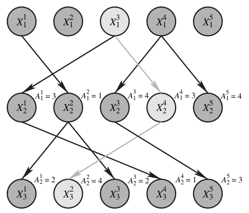

**Fig. 1.** Example of ancestral lineages generated by an SMC algorithm for $N = 5$ and $T = 3$: the lighter path is $X_{1:3}^2 = (X_1^3, X_2^4, X_3^2)$ and its ancestral lineage is $B_{1:3}^2 = (3,4,2)$

This procedure provides us at time $T$ with an approximation of the joint posterior density $p_\theta(x_{1:T} \mid y_{1:T})$ given by

$$\hat{p}_\theta(\mathrm{d}x_{1:T} \mid y_{1:T}) := \sum_{k=1}^{N} W_T^k\, \delta_{X_{1:T}^k}(\mathrm{d}x_{1:T}), \tag{8}$$

from which approximate samples from $p_\theta(x_{1:T} \mid y_{1:T})$ can be obtained by simply drawing an index from the discrete distribution $\mathcal{F}(\cdot \mid \mathbf{W}_T)$. This is one of the key properties exploited by the PMCMC algorithms. In addition we shall also use the fact that this SMC algorithm provides

<!-- PDF page 6 -->

us with an estimate of the marginal likelihood $p_\theta(y_{1:T})$ given by

$$\hat{p}_\theta(y_{1:T}) := \hat{p}_\theta(y_1) \prod_{n=2}^{T} \hat{p}_\theta(y_n \mid y_{1:n-1}) \tag{9}$$

where

$$\hat{p}_\theta(y_n \mid y_{1:n-1}) = \frac{1}{N} \sum_{k=1}^{N} w_n(X_{1:n}^k)$$

is an estimate computed at time $n$ of

$$p_\theta(y_n \mid y_{1:n-1}) = \int w_n(x_{1:n})\, q_\theta(x_n \mid y_n, x_{n-1})\, p_\theta(x_{1:n-1} \mid y_{1:n-1})\, \mathrm{d}x_{1:n}.$$

It follows from equation (7) that $w_n(x_{1:n})$ only depends on $x_{1:n}$ through $x_{n-1:n}$. We have omitted the dependence on $N$ in equations (5), (8) and (9), and will do so in the remainder of this section when confusion is not possible.

#### 2.2.2. Design issues and limitations

This algorithm requires us to specify $q_\theta(x_1 \mid y_1)$ and $\{q_\theta(x_n \mid y_n, x_{n-1}); n = 2, \ldots, T\}$. Guidelines on how best to select $\{q_\theta(x_n \mid y_n, x_{n-1})\}$ are well known. With $p_\theta(x_n \mid y_n, x_{n-1}) \propto f_\theta(x_n \mid x_{n-1})\, g_\theta(y_n \mid x_n)$, it is usually recommended to set $q_\theta(x_n \mid y_n, x_{n-1}) = p_\theta(x_n \mid y_n, x_{n-1})$ whenever possible and to select $q_\theta(x_n \mid y_n, x_{n-1})$ as close as possible to $p_\theta(x_n \mid y_n, x_{n-1})$ otherwise; see for example Carpenter *et al.* (1999), Cappé *et al.* (2005), Doucet and Johansen (2009), Liu (2001) and Pitt and Shephard (1999). It is often much simpler to design these ‘local’ importance densities than to design a global importance density approximating $p_\theta(x_{1:T} \mid y_{1:T})$. An ‘extreme’ case, which was originally suggested in Gordon *et al.* (1993), consists of using the prior density of the latent Markov process $\{X_n; n \geqslant 1\}$ as an importance density; i.e. set $q_\theta(x_1 \mid y_1) = \mu_\theta(x_1)$ and $q_\theta(x_n \mid y_n, x_{n-1}) = f_\theta(x_n \mid x_{n-1})$. In scenarios where the observations are not too informative and the dimension of the latent variable not too large, this default strategy can lead to satisfactory performance. It is in fact the only possible practical choice for models where $f_\theta(x_n \mid x_{n-1})$ is intractable or too expensive to evaluate pointwise, but easy to sample from; see Ionides *et al.* (2006) for many examples.

Note that SMC methods also suffer from well-known drawbacks. Indeed, when $T$ is too large, the SMC approximation to the joint density $p_\theta(x_{1:T} \mid y_{1:T})$ deteriorates as components sampled at any time $n < T$ are not rejuvenated at subsequent time steps. As a result, when $T - n$ is too large the approximation to the marginal $p_\theta(x_n \mid y_{1:T})$ is likely to be rather poor as the successive resampling steps deplete the number of distinct particle co-ordinates $x_n$. This is the main reason behind the well-known difficulty of approximating $p(\theta, x_{1:T} \mid y_{1:T})$ with SMC algorithms; see Andrieu *et al.* (1999), Fearnhead (2002) and Storvik (2002), for example. We shall see in what follows that, in spite of its reliance on SMC methods as one of its components, PMCMC sampling is much more robust and less likely to suffer from this depletion problem. This stems from the fact that PMCMC methods do not require SMC algorithms to provide a reliable approximation of $p_\theta(x_{1:T} \mid y_{1:T})$, but only to return a single sample approximately distributed according to $p_\theta(x_{1:T} \mid y_{1:T})$.

### 2.3. Standard Markov chain Monte Carlo methods

A popular choice to sample from $p(\theta, x_{1:T} \mid y_{1:T})$ with MCMC methods consists of alternately updating the state components $x_{1:T}$ conditional on $\theta$ and $\theta$ conditional on $x_{1:T}$. Sampling

<!-- PDF page 7 -->

from $p(\theta \mid y_{1:T}, x_{1:T})$ is often feasible and we do not discuss this here. Sampling exactly from $p_\theta(x_{1:T} \mid y_{1:T})$ is possible for two scenarios only: linear Gaussian models and finite state space hidden Markov models (Carter and Kohn, 1994; Frühwirth-Schnatter, 1994). Beyond these particular cases the design of proposal densities is required. A standard practice consists of dividing the $T$ components of $x_{1:T}$ in, say, adjacent blocks of length $K$ and updating each of these blocks in turn. For example we can update $x_{n:n+K-1}$ according to an MCMC step of invariant density

$$p_\theta(x_{n:n+K-1} \mid y_{1:T}, x_{1:n-1}, x_{n+K:T}) \propto \prod_{k=n}^{n+K} f_\theta(x_k \mid x_{k-1}) \prod_{k=n}^{n+K-1} g_\theta(y_k \mid x_k). \tag{10}$$

When $K$ is not too large it might be possible to design efficient proposal densities which can be used in a Metropolis–Hastings (MH) update; see Shephard and Pitt (1997) for a generic Gaussian approximation of equation (10) for SSMs with a linear Gaussian prior density $f_\theta(x_k \mid x_{k-1})$ and a log-concave density $g_\theta(y_k \mid x_k)$. However, as $K$ increases building ‘good’ approximations of equation (10) is typically impossible. This limits the size $K$ of the blocks $x_{n:n+K-1}$ of variables which can be simultaneously updated and can be a serious drawback in practice as this will slow down the exploration of the support of $p_\theta(x_{1:T} \mid y_{1:T})$ when its dependence structure is strong.

These difficulties are exacerbated in models where $f_\theta(x_k \mid x_{k-1})$ does not admit an analytical expression but can be sampled from; see for example Ionides *et al.* (2006). In such scenarios updating all the components of $x_{1:T}$ simultaneously by using the joint prior distribution as a proposal is the only known strategy. However, the performance of this approach tends to deteriorate rapidly as $T$ increases since the information that is provided by the observations is completely ignored by the proposal.

### 2.4. Particle Markov chain Monte Carlo methods for state space models

In what follows we shall refer to MCMC algorithms targeting the distribution $p(\theta, x_{1:T} \mid y_{1:T})$ which rely on sampling exactly from $p_\theta(x_{1:T} \mid y_{1:T})$ as ‘idealized’ algorithms. Such algorithms are mostly purely conceptual since they typically cannot be implemented but in many situations are algorithms that we would like to approximate. In the light of Sections 2.2 and 2.3, a natural idea consists of approximating these idealized algorithms by using the output of an SMC algorithm targeting $p_\theta(x_{1:T} \mid y_{1:T})$ using $N \geqslant 1$ particles as a proposal distribution for an MH update. Intuitively this could allow us to approximate with arbitrary precision such idealized algorithms while only requiring the design of low dimensional proposals for the SMC algorithm. A direct implementation of this idea is impossible as the marginal density of a particle that is generated by an SMC algorithm is not available analytically but would be required for the calculation of the MH acceptance ratio. The novel MCMC updates that are presented in this section, PMCMC updates, circumvent this problem by considering target distributions on an extended space which includes all the random variables that are produced by the SMC algorithm; this is detailed in Section 4 and is not required to understand the implementation of such updates.

The key feature of PMCMC algorithms is that they are in fact ‘exact approximations’ to idealized MCMC algorithms targeting either $p_\theta(x_{1:T} \mid y_{1:T})$ or $p(\theta, x_{1:T} \mid y_{1:T})$ in the sense that *for any fixed number* $N \geqslant 1$ *of particles* their transition kernels leave the target density of interest invariant. Further they can be interpreted as standard MCMC updates and will lead to convergent algorithms under mild standard assumptions (see Section 4 for details).

We first introduce in Section 2.4.1 the *particle independent Metropolis–Hastings* (PIMH) update, an exact approximation to a standard independent Metropolis–Hastings (IMH) update targeting $p_\theta(x_{1:T} \mid y_{1:T})$, which uses SMC approximations of $p_\theta(x_{1:T} \mid y_{1:T})$ as a proposal. We

<!-- PDF page 8 -->

emphasize at this point that we do not believe that the resulting PIMH sampler that is presented below is on its own a serious competitor to standard SMC approximations to $p_\theta(x_{1:T} \mid y_{1:T})$. However, as is the case with standard IMH-type updates, the PIMH update might be of interest when used in combination with other MCMC transitions. In Section 2.4.2, we describe the *particle marginal Metropolis–Hastings* (PMMH) algorithm which can be thought of as an exact approximation of a ‘marginal Metropolis–Hastings’ (MMH) update targeting directly the marginal density $p(\theta \mid y_{1:T})$ of $p(\theta, x_{1:T} \mid y_{1:T})$. Finally, in Section 4.5 we present a particle approximation to a Gibbs sampler targeting $p(\theta, x_{1:T} \mid y_{1:T})$, called hereafter the *particle Gibbs* (PG) algorithm.

#### 2.4.1. Particle independent Metropolis–Hastings sampler

A standard IMH update leaving $p_\theta(x_{1:T} \mid y_{1:T})$ invariant requires us to choose a proposal density $q_\theta(x_{1:T} \mid y_{1:T})$ to propose candidates $X_{1:T}^*$ which, given a current state $X_{1:T}$, are accepted with probability

$$1 \wedge \frac{p_\theta(X_{1:T}^* \mid y_{1:T})}{p_\theta(X_{1:T} \mid y_{1:T})}\, \frac{q_\theta(X_{1:T} \mid y_{1:T})}{q_\theta(X_{1:T}^* \mid y_{1:T})},$$

where $a \wedge b := \min\{a, b\}$. The optimal choice for $q_\theta(x_{1:T} \mid y_{1:T})$ is $q_\theta(x_{1:T} \mid y_{1:T}) = p_\theta(x_{1:T} \mid y_{1:T})$, but in practice this ideal choice is impossible in most scenarios. Our discussion of SMC methods suggests exploring the idea of using the SMC approximation of $p_\theta(x_{1:T} \mid y_{1:T})$ as a proposal density, i.e. draw our proposed sample from equation (8). As indicated earlier, sampling $X_{1:T}^*$ from equation (8) is straightforward *given* a realization of the weighted samples $\{W_T^k, X_{1:T}^k; k = 1, \ldots, N\}$, but computing the acceptance probability above requires the expression for the *marginal* distribution of $X_{1:T}^*$, which turns out to be intractable. Indeed this distribution is given by

$$q_\theta(\mathrm{d}x_{1:T} \mid y_{1:T}) = \mathbb{E}\{\hat{p}_\theta(\mathrm{d}x_{1:T} \mid y_{1:T})\},$$

where the expectation is here with respect to all the random variables generated by the SMC algorithm to sample the random probability measure $\hat{p}_\theta(\mathrm{d}x_{1:T} \mid y_{1:T})$ in equation (8). Although this expression for $q_\theta(\mathrm{d}x_{1:T} \mid y_{1:T})$ does not admit a simple analytical expression, it naturally suggests the use of the standard ‘auxiliary variables trick’ by embedding the sampling from $p_\theta(x_{1:T} \mid y_{1:T})$ into that of sampling from an appropriate distribution defined on an extended space including all the random variables underpinning the expectation above. The resulting PIMH sampler can be shown to take the following extremely simple form, with $\hat{p}_\theta(y_{1:T})$ as in equation (9).

*Step 1*: initialization, $i = 0$—run an SMC algorithm targeting $p_\theta(x_{1:T} \mid y_{1:T})$, sample $X_{1:T}(0) \sim \hat{p}_\theta(\cdot \mid y_{1:T})$ and let $\hat{p}_\theta(y_{1:T})(0)$ denote the corresponding marginal likelihood estimate.

*Step 2*: for iteration $i \geqslant 1$,

(a) run an SMC algorithm targeting $p_\theta(x_{1:T} \mid y_{1:T})$, sample $X_{1:T}^* \sim \hat{p}_\theta(\cdot \mid y_{1:T})$ and let $\hat{p}_\theta(y_{1:T})^*$ denote the corresponding marginal likelihood estimate, and

(b) with probability

$$1 \wedge \frac{\hat{p}_\theta(y_{1:T})^*}{\hat{p}_\theta(y_{1:T})(i-1)}, \tag{11}$$

set $X_{1:T}(i) = X_{1:T}^*$ and $\hat{p}_\theta(y_{1:T})(i) = \hat{p}_\theta(y_{1:T})^*$; otherwise set $X_{1:T}(i) = X_{1:T}(i-1)$ and $\hat{p}_\theta(y_{1:T})(i) = \hat{p}_\theta(y_{1:T})(i-1)$.

Theorem 2 in Section 4.2 establishes that the PIMH update leaves $p_\theta(x_{1:T} \mid y_{1:T})$ invariant and theorem 3 establishes that under weak assumptions the PIMH sampler is ergodic. Note

<!-- PDF page 9 -->

in addition that, as expected, the acceptance probability in equation (11) converges to 1 when $N \to \infty$ since both $\hat{p}_\theta(y_{1:T})^*$ and $\hat{p}_\theta(y_{1:T})(i-1)$ are, again under mild assumptions, consistent estimates of $p_\theta(y_{1:T})$.

#### 2.4.2. Particle marginal Metropolis–Hastings sampler

Consider now the scenario where we are interested in sampling from $p(\theta, x_{1:T} \mid y_{1:T})$ defined in equation (4). We focus here on an approach which jointly updates $\theta$ and $x_{1:T}$. Assume for the time being that sampling from the conditional density $p_\theta(x_{1:T} \mid y_{1:T})$ for any $\theta \in \Theta$ is feasible and recall the standard decomposition $p(\theta, x_{1:T} \mid y_{1:T}) = p(\theta \mid y_{1:T})\, p_\theta(x_{1:T} \mid y_{1:T})$. In such situations it is natural to suggest the following form of proposal density for an MH update:

$$q\{(\theta^*, x_{1:T}^*) \mid (\theta, x_{1:T})\} = q(\theta^* \mid \theta)\, p_{\theta^*}(x_{1:T}^* \mid y_{1:T}),$$

for which the proposed $x_{1:T}^*$ is perfectly ‘adapted’ to the proposed $\theta^*$, and the only degree of freedom of the algorithm (which will affect its performance) is $q(\theta^* \mid \theta)$. The resulting MH acceptance ratio is given by

$$\frac{p(\theta^*, x_{1:T}^* \mid y_{1:T})}{p(\theta, x_{1:T} \mid y_{1:T})}\, \frac{q\{(\theta, x_{1:T}) \mid (\theta^*, x_{1:T}^*)\}}{q\{(\theta^*, x_{1:T}^*) \mid (\theta, x_{1:T})\}} = \frac{p_{\theta^*}(y_{1:T})\, p(\theta^*)}{p_\theta(y_{1:T})\, p(\theta)}\, \frac{q(\theta \mid \theta^*)}{q(\theta^* \mid \theta)}. \tag{12}$$

The expression for this ratio suggests that the algorithm effectively targets the marginal density $p(\theta \mid y_{1:T}) \propto p_\theta(y_{1:T})\, p(\theta)$, justifying the MMH terminology. This idea has also been exploited in Andrieu and Roberts (2009) and Beaumont (2003) for example and might be appealing since the difficult problem of sampling from $p(\theta, x_{1:T} \mid y_{1:T})$ is reduced to that of sampling from $p(\theta \mid y_{1:T})$, which is typically defined on a much smaller space. It is natural to propose a particle approximation to the MMH update where, whenever a sample from $p_\theta(x_{1:T} \mid y_{1:T})$ and the expression for the marginal likelihood $p_\theta(y_{1:T})$ are needed, their SMC approximation counterparts are used instead in the PMMH update. The resulting PMMH sampler is as follows (note the change of indexing notation for $\hat{p}_\theta(y_{1:T})$ compared with the PIMH case).

*Step 1*: initialization, $i = 0$,

(a) set $\theta(0)$ arbitrarily and

(b) run an SMC algorithm targeting $p_{\theta(0)}(x_{1:T} \mid y_{1:T})$, sample $X_{1:T}(0) \sim \hat{p}_{\theta(0)}(\cdot \mid y_{1:T})$ and let $\hat{p}_{\theta(0)}(y_{1:T})$ denote the marginal likelihood estimate.

*Step 2*: for iteration $i \geqslant 1$,

(a) sample $\theta^* \sim q\{\cdot \mid \theta(i-1)\}$,

(b) run an SMC algorithm targeting $p_{\theta^*}(x_{1:T} \mid y_{1:T})$, sample $X_{1:T}^* \sim \hat{p}_{\theta^*}(\cdot \mid y_{1:T})$ and let $\hat{p}_{\theta^*}(y_{1:T})$ denote the marginal likelihood estimate, and

(c) with probability

$$1 \wedge \frac{\hat{p}_{\theta^*}(y_{1:T})\, p(\theta^*)}{\hat{p}_{\theta(i-1)}(y_{1:T})\, p\{\theta(i-1)\}}\, \frac{q\{\theta(i-1) \mid \theta^*\}}{q\{\theta^* \mid \theta(i-1)\}} \tag{13}$$

set $\theta(i) = \theta^*$, $X_{1:T}(i) = X_{1:T}^*$ and $\hat{p}_{\theta(i)}(y_{1:T}) = \hat{p}_{\theta^*}(y_{1:T})$; otherwise set $\theta(i) = \theta(i-1)$, $X_{1:T}(i) = X_{1:T}(i-1)$ and $\hat{p}_{\theta(i)}(y_{1:T}) = \hat{p}_{\theta(i-1)}(y_{1:T})$.

Theorem 4 in Section 4.4 establishes that the PMMH update leaves $p(\theta, x_{1:T} \mid y_{1:T})$ invariant and that under weak assumptions the PMMH sampler is ergodic. Also note that under mild assumptions given in Section 4.1 the acceptance probability (13) converges to equation (12) as $N \to \infty$.

<!-- PDF page 10 -->

#### 2.4.3. Particle Gibbs sampler

An alternative to the MMH algorithm to sample from $p(\theta, x_{1:T}|y_{1:T})$ consists of using the Gibbs sampler which samples iteratively from $p(\theta|y_{1:T}, x_{1:T})$ and $p_\theta(x_{1:T}|y_{1:T})$. It is often possible to sample from $p(\theta|y_{1:T}, x_{1:T})$ and thus the potentially tedious design of a proposal density for $\theta$ that is necessary in the MMH update can be bypassed. Again, sampling from $p_\theta(x_{1:T}|y_{1:T})$ is typically impossible and we investigate the possibility of using a particle approximation to this algorithm. Clearly the naive particle approximation to the Gibbs sampler where sampling from $p_\theta(x_{1:T}|y_{1:T})$ is replaced by sampling from an SMC approximation $\hat p_\theta(x_{1:T}|y_{1:T})$ does not admit $p(\theta, x_{1:T}|y_{1:T})$ as invariant density.

A valid particle approximation to the Gibbs sampler requires the use of a special type of PMCMC update called the *conditional SMC* update. This update is similar to a standard SMC algorithm but is such that a prespecified path $X_{1:T}$ with ancestral lineage $B_{1:T}$ is ensured to survive all the resampling steps, whereas the remaining $N-1$ particles are generated as usual. The algorithm is as follows.

*Step 1*: let $X_{1:T} = (X_1^{B_1}, X_2^{B_2}, \ldots, X_{T-1}^{B_{T-1}}, X_T^{B_T})$ be a path that is associated with the ancestral lineage $B_{1:T}$.

*Step 2*: for $n = 1$,

(a) for $k \neq B_1$, sample $X_1^k \sim q_\theta(\cdot|y_1)$ and

(b) compute $w_1(X_1^k)$ by using equation (6) and normalize the weights $W_1^k \propto w_1(X_1^k)$.

*Step 3*: for $n = 2, \ldots, T$,

(a) for $k \neq B_n$, sample $A_{n-1}^k \sim \mathcal{F}(\cdot|\mathbf{W}_{n-1})$,

(b) for $k \neq B_n$, sample $X_n^k \sim q(\cdot|y_n, X_{n-1}^{A_{n-1}^k})$ and

(c) compute $w_n(X_{1:n}^k)$ by using equation (7) and normalize the weights $W_n^k \propto w_n(X_{1:n}^k)$.

For further clarity we illustrate this update on a toy example. Fig. 1 displays ancestral lineages that were generated by a standard SMC method in a situation where $N = 5$ and $T = 3$. Consider $X_{1:3}^2 = (X_1^3, X_2^4, X_3^2)$ whose ancestral lineage is $B_{1:3}^2 = (3, 4, 2)$. A conditional SMC update leaving $X_{1:3}^2$ (the lighter path in Fig. 1) identical generates four new paths consistent with both $X_{1:3}^2$ and $B_{1:3}^2$. One could, for example, obtain the set of new paths that is presented in Fig. 2.

A computationally more efficient way to implement the conditional SMC update is presented in Appendix A—this is, however, not required to present our particle version of the Gibbs sampler, the PG sampler, as follows.

*Step 1*: initialization, $i = 0$—set $\theta(0)$, $X_{1:T}(0)$ and $B_{1:T}(0)$ arbitrarily.

*Step 2*: for iteration $i \geqslant 1$,

(a) sample $\theta(i) \sim p\{\cdot|y_{1:T}, X_{1:T}(i-1)\}$,

(b) run a conditional SMC algorithm targeting $p_{\theta(i)}(x_{1:T}|y_{1:T})$ conditional on $X_{1:T}(i-1)$ and $B_{1:T}(i-1)$, and

(c) sample $X_{1:T}(i) \sim \hat p_{\theta(i)}(\cdot|y_{1:T})$ (and hence $B_{1:T}(i)$ is also implicitly sampled).

In theorem 5 in Section 4.5, it is shown that this algorithm admits $p(\theta, x_{1:T}|y_{1:T})$ as invariant density and is ergodic under mild assumptions.

### 2.5. Improvements and extensions

#### 2.5.1. Advanced particle filtering and sequential Monte Carlo techniques

For ease of presentation, we have limited our discussion in this section to one of the simplest implementations of SMC algorithms. However, over the past 15 years numerous more

<!-- PDF page 11 -->

sophisticated algorithms have been proposed in the literature to improve on such a basic scheme; see Cappé *et al.* (2005) or Doucet and Johansen (2009) for recent reviews. Such techniques essentially fall into two categories:

(a) techniques aiming at reducing the variance that is introduced by the resampling step of the SMC algorithm such as the popular residual and stratified resampling procedures (see Liu (2001), chapter 3, and Kitagawa (1996)) and

(b) techniques aiming at fighting the so-called degeneracy phenomenon which include, among others, the auxiliary particle filter (Pitt and Shephard, 1999) or the resample–move algorithm (Gilks and Berzuini, 2001).

Popular advanced resampling schemes can be used within the PMCMC framework—more details on the technical conditions that are required by such schemes are given in Section 4.1. Roughly speaking these conditions require some form of exchangeability of the particles. Most known advanced SMC techniques falling into category (b) will also lead to valid PMCMC algorithms. Such valid techniques can in fact be easily identified in practice but this requires us to consider the more general PMCMC framework that is developed in Section 4.1.

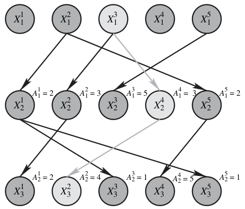

Fig. 2. Example of $N - 1 = 4$ ancestral lineages generated by a conditional SMC algorithm for $N = 5$ and $T = 3$ conditional on $X_{1:3}^2$ and $B_{1:3}^2$

#### 2.5.2. Using all the particles

A possible criticism of the PMCMC updates is that they require the generation of $N$ particles at each iteration of the MCMC algorithm to propose a single sample. It is shown in theorem 6 in Section 4.6 that it is possible to reuse all the particles that are generated in the PIMH, the PMMH and PG samplers to compute estimates of conditional expectations with respect to $p_\theta(x_{1:T}|y_{1:T})$ and $p(\theta, x_{1:T}|y_{1:T})$.

## 3. Applications

We provide here two applications of PMCMC methods. The first model that we consider is a popular toy non-linear SSM (Gordon *et al.*, 1993; Kitagawa, 1996). The second model is a Lévy-driven stochastic volatility model (Barndorff-Nielsen and Shephard, 2001a; Creal, 2008; Gander and Stephens, 2007).

<!-- PDF page 12 -->

### 3.1. A non-linear state space model

Consider the SSM

$$X_n = \frac{X_{n-1}}{2} + 25 \frac{X_{n-1}}{1 + X_{n-1}^2} + 8\cos(1.2n) + V_n, \tag{14}$$

$$Y_n = \frac{X_n^2}{20} + W_n \tag{15}$$

where $X_1 \sim \mathcal{N}(0, 5)$, $V_n \sim^{\text{IID}} \mathcal{N}(0, \sigma_V^2)$ and $W_n \sim^{\text{IID}} \mathcal{N}(0, \sigma_W^2)$; here $\mathcal{N}(m, \sigma^2)$ denotes the Gaussian distribution of mean $m$ and variance $\sigma^2$ and IID stands for independent and identically distributed. We set $\theta = (\sigma_V, \sigma_W)$. This example is often used in the literature to assess the performance of SMC methods. The posterior density $p_\theta(x_{1:T}|y_{1:T})$ for this non-linear model is highly multimodal as there is uncertainty about the sign of the state $X_n$ which is only observed through its square.

We generated two sets of observations $y_{1:100}$ according to model (14)–(15) with $\sigma_V^2 = \sigma_W^2 = 10$, and $\sigma_V^2 = 10$ and $\sigma_W^2 = 1$. We display in Fig. 3 the average acceptance rate of the PIMH algorithm when sampling from $p_\theta(x_{1:T}|y_{1:T})$ as a function of $T$ and $N$. This was computed using 50000 iterations of the PIMH sampler. We used the most basic resampling scheme, i.e. the multinomial resampling that was described in Section 2.2.1. We also used the simplest possible proposal for SMC sampling, i.e. $q_\theta(x_1) = \mu_\theta(x_1)$ and $q_\theta(x_n|y_n, x_{n-1}) = f_\theta(x_n|x_{n-1})$ for $n = 2, \ldots, T$. The acceptance probabilities are higher when $\sigma_V^2 = \sigma_W^2 = 10$ than when $\sigma_V^2 = 10$ and $\sigma_W^2 = 1$. This is to be expected as in this latter scenario the observations are more informative and our SMC algorithm only samples particles from a rather diffuse prior. Better performance could be obtained by using an approximation of $p_\theta(x_n|y_n, x_n)$ based on local linearization as a proposal distribution $q_\theta(x_n|y_n, x_{n-1})$ (Cappé *et al.* (2005), page 230), and a more sophisticated resampling scheme. However, our aim here is to show that even this off-the-shelf choice can provide satisfactory results in difficult scenarios.

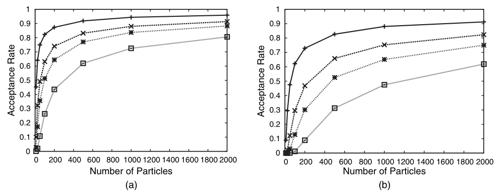

Fig. 3. Average acceptance rate of the PIMH sampler as a function of $N$ and $T$ for (a) $\sigma_V^2 = 10$ and $\sigma_W^2 = 10$ and (b) $\sigma_V^2 = 10$ and $\sigma_W^2 = 1$; $|$, $T = 10$; $\times$, $T = 25$; $\ast$, $T = 50$; $\square$, $T = 100$

Determining a sensible trade-off between the average acceptance rate of the PIMH update and the number of particles seems to be difficult. Indeed, whereas a high expected acceptance probability is theoretically desirable in the present case, this does not take into account the computational complexity. For example, in the scenario where $T = 100$ and $\sigma_V^2 = \sigma_W^2 = 10$, we

<!-- PDF page 13 -->

have an average acceptance rate of 0.80 for $N = 2000$ whereas it is equal to 0.27 for $N = 200$, resulting in a Markov chain which still mixes well. Given that the SMC proposal for $N = 2000$ is approximately 10 times more computationally expensive than for $N = 200$, it might seem appropriate to use $N = 200$ and to run more MCMC iterations.

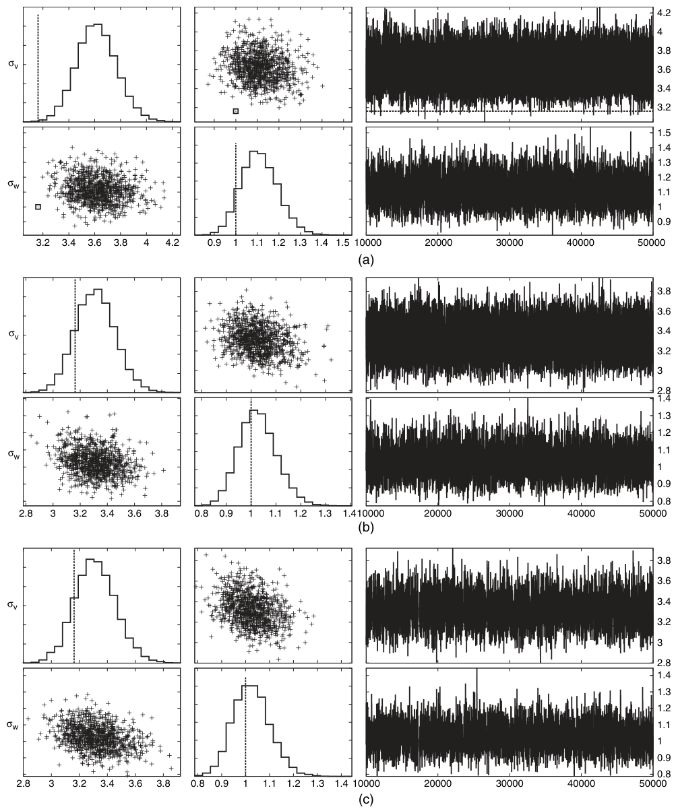

Fig. 4. Approximations of $p(\sigma_V|y_{1:T})$ and $p(\sigma_W|y_{1:T})$, scatter plots and trace plots after burn-in of simulated values for (a) the MH one at a time update, (b) the PG sampler and (c) the PMMH sampler: $\vdots$, true values on the histograms; -------, true values on the trace plots; $\square$, true values on the scatter plots

When $\theta$ is unknown we set the prior $\sigma_V^2 \sim \mathcal{I}G(a, b)$ and $\sigma_W^2 \sim \mathcal{I}G(a, b)$ where $\mathcal{I}G$ is the inverse

<!-- PDF page 14 -->

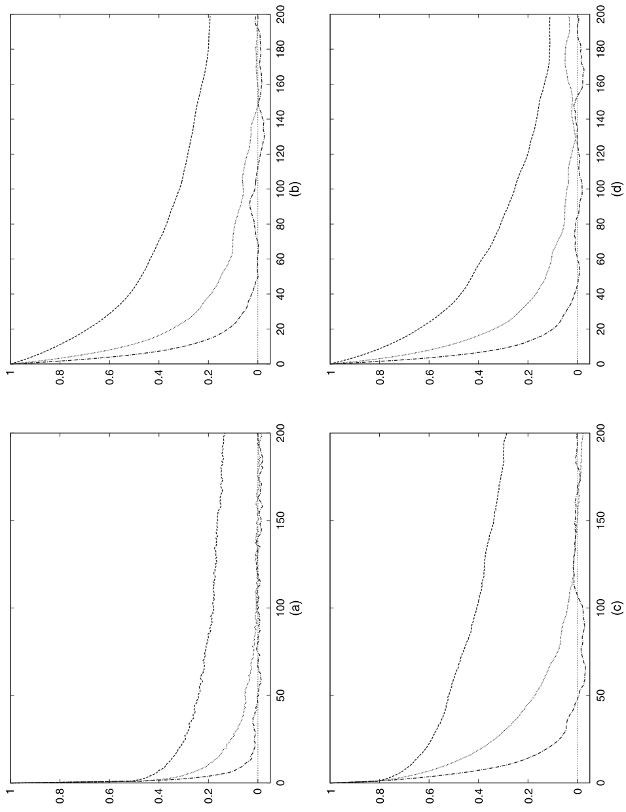

Fig. 5. ACF of the parameters (a), (b) $\sigma_V$ and (c), (d) $\sigma_W$ for (a), (c) the PG sampler and the (b), (d) the PMMH sampler: -------, 1000 particles; ·······, 2000 particles; ·-·-·-, 5000 particles

<!-- PDF page 15 -->

gamma distribution and $a = b = 0.01$. We simulated $T = 500$ observations with $\sigma_V^2 = 10$ and $\sigma_W^2 = 1$. To sample from $p(\theta, x_{1:T}|y_{1:T})$, we used the PMMH sampler and the PG sampler using for the SMC proposal the prior and stratified resampling with $N = 5000$ particles. The PMMH sampler uses a normal random-walk proposal with a diagonal covariance matrix. The standard deviation was equal to 0.15 for $\sigma_V$ and 0.08 for $\sigma_W$. We also compared these algorithms with a standard algorithm where we update the state variables $X_{1:T}$ one at a time by using an MH step of invariant distribution $p_\theta(x_n|y_n, x_{n-1}, x_{n+1})$ and proposal density $f_\theta(x_n|x_{n-1})$. In the one at a time algorithm, we updated the state variables $N$ times at each iteration before updating $\theta$. Hence all the algorithms have approximately the same computational complexity. All the simulations that are presented here are initialized by using $\sigma_V^{(0)} = \sigma_W^{(0)} = 10$. We ran the algorithms for 50000 iterations with a burn-in of 10000 iterations. In Fig. 4, we display the estimates of the marginal posterior densities for $\sigma_V$ and $\sigma_W$, a scatter plot of the sampled values $(\sigma_V^{(i)}, \sigma_W^{(i)})$ and the trace plots that are associated with these two parameters.

For this data set the MH one at a time update appears to mix well as the auto-correlation functions (ACFs) for the parameters $(\sigma_V, \sigma_W)$ (which are not shown here) decrease to zero reasonably fast. However, this algorithm tends to become trapped in a local mode of the multimodal posterior distribution. This occurred on most runs when using initializations from the prior for $X_{1:T}$ and results in an overestimation of the true value of $\sigma_V$. Using the same initial values, the PMMH and the PG samplers never became trapped in this local mode. In practice, we can obviously combine both strategies by only occasionally updating the state variables with a PG update to avoid such traps while using more standard and cheaper updates for a large proportion of the computational time.

We present in Fig. 5 the ACF for $(\sigma_V, \sigma_W)$ for the PG and PMMH samplers and various numbers of particles $N$. Clearly the performance improves as $N$ increases. In this scenario, it appears necessary to use at least 2000 particles to make the ACF drop sharply, whereas increasing $N$ beyond 5000 does not improve performance, i.e. for $N > 5000$ we observe that the ACFs (which are not presented here) are very similar to $N = 5000$ and probably very close to that of the corresponding idealized MMH algorithm.

### 3.2. Lévy-driven stochastic volatility model

The second model that we discuss is a Lévy-driven stochastic volatility model. These models were recently introduced in Barndorff-Nielsen and Shephard (2001a) and have become extremely popular in financial econometrics; see for example Creal (2008), Frühwirth-Schnatter and Sögner (2008), Gander and Stephens (2007) and Roberts *et al.* (2004). However, performing inference for Lévy-driven stochastic volatility models is a challenging task. We demonstrate here that PMCMC methods can be useful in this context. The model can be described as follows. The logarithm of an asset price $y^*(t)$ is assumed to be determined by the stochastic differential equation

$$\mathrm{d}y^*(t) = \mu + \beta\,\sigma^2(t)\,\mathrm{d}t + \sigma(t)\,\mathrm{d}B(t)$$

where $\mu$ is the drift parameter, $\beta$ the risk premium and $B(t)$ is a Brownian motion. The instantaneous latent variance or volatility $\sigma^2(t)$ is assumed to be stationary and independent from $B(t)$. It is modelled by the Lévy-driven Ornstein–Unlenbeck process

$$\mathrm{d}\sigma^2(t) = -\lambda\,\sigma^2(t)\,\mathrm{d}t + \mathrm{d}z(\lambda t) \tag{16}$$

where $\lambda > 0$ and $z(t)$ is a purely non-Gaussian Lévy process with positive increments and $z(0) = 0$. We define the integrated volatility

<!-- PDF page 16 -->

$$\begin{aligned} \sigma^{2*}(t) &= \int_0^t \sigma^2(u)\,\mathrm{d}u \\ &= \lambda^{-1}\{z(\lambda t) - \sigma^2(t) + \sigma^2(0)\}. \end{aligned}$$

Let $\Delta$ denote the length of time between two periods of interest; then the increments of the integrated volatility satisfy

$$\begin{aligned} \sigma_n^2 &= \sigma^{2*}(n\Delta) - \sigma^{2*}\{(n-1)\Delta\} \\ &= \lambda^{-1}[z(\lambda n\Delta) - \sigma^2(n\Delta) - z\{\lambda(n-1)\Delta\} + \sigma^2\{(n-1)\Delta\}] \end{aligned}$$

where

$$(\sigma^2(n\Delta), z(\lambda n\Delta)) = (\exp(-\lambda\Delta)\sigma^2\{(n-1)\Delta\}, z\{\lambda(n-1)\Delta\}) + \eta_n$$

and

$$\eta_n \overset{\mathrm{d}}{=} \left( \exp(-\lambda\Delta) \int_0^\Delta \exp(\lambda u)\,\mathrm{d}z(\lambda u),\ \int_0^\Delta \mathrm{d}z(\lambda u) \right). \tag{17}$$

Here ‘$=^{\mathrm{d}}$’ means ‘equal in distribution’. By aggregating returns over a time interval of length $\Delta$, we have

$$y_n = \int_{(n-1)\Delta}^{n\Delta} \mathrm{d}y^*(t) = y^*(n\Delta) - y^*\{(n-1)\Delta\};$$

thus, conditional on the volatility, we obtain

$$y_n \sim \mathcal{N}(\mu\Delta + \beta\sigma_n^2, \sigma_n^2).$$

Many publications have restricted themselves to the case where $\sigma^2(t)$ follows marginally a gamma distribution, in which cases the stochastic integrals appearing in equation (17) are finite sums. Even in this case, sophisticated MCMC schemes need to be developed to perform Bayesian inference (Frühwirth-Schnatter and Sögner, 2008; Roberts *et al.*, 2004). However, it is argued in Gander and Stephens (2007) that

‘the use of the gamma marginal model appears to be motivated by computational tractability, rather than by any theoretical or empirical reasoning’.

We address here the case where $\sigma^2(t)$ follows a tempered stable marginal distribution $\mathcal{T}S(\kappa, \delta, \gamma)$. This is a flexible class of distributions which includes inverse Gaussian distributions for $\kappa = \frac{1}{2}$. In this case, it is shown in Barndorff-Nielsen and Shephard (2001b) that

$$\sigma^2(0) \overset{\mathrm{d}}{=} \sum_{i=1}^{\infty} \left\{ \left( \frac{a_i \kappa}{A_0} \right)^{-1/\kappa} \wedge e_i v_i^{1/\kappa} \right\} \tag{18}$$

where $A_0 = 2^\kappa \delta\kappa/\Gamma(1-\kappa)$ and $B = \frac{1}{2}\gamma^{1/\kappa}$. In equation (18), $\{a_i\}$, $\{e_i\}$ and $\{v_i\}$ are independent of one another. The $\{e_i\}$ are IID exponential with mean $1/B$ and the $\{v_i\}$ are standard uniform, whereas $a_1 < a_2 < \ldots$ are arrival times of a Poisson process of intensity 1. It is also established in Barndorff-Nielsen and Shephard (2001b) that $z(t)$ is the sum of an infinite activity Lévy process and of a compound Poisson process such that

$$\eta_n \overset{\mathrm{d}}{=} \sum_{i=1}^{\infty} \left\{ \left( \frac{a_i \kappa}{A\lambda\Delta} \right)^{-1/\kappa} \wedge e_i v_i^{1/\kappa} \right\} (\exp(-\lambda\Delta r_i), 1) + \sum_{i=1}^{N(\lambda\Delta)} c_i (\exp(-\lambda\Delta r_i^*), 1) \tag{19}$$

<!-- PDF page 17 -->

where $A = 2^\kappa \delta\kappa^2/\Gamma(1-\kappa)$. In equation (19), $\{a_i\}$, $\{e_i\}$, $\{r_i\}$, $\{r_i^*\}$ and $\{v_i\}$ are independent of one another. The $\{a_i\}$, $\{e_i\}$ and $\{v_i\}$ follow the same distributions as in equation (18), the $\{c_i\}$ are IID $\mathcal{G}(1-\kappa, 1/B)$ where $\mathcal{G}$ is the gamma distribution and $\{r_i\}$ and $\{r_i^*\}$ are standard uniform. Finally $N(\lambda\Delta)$ is a Poisson random variable of mean $\lambda\Delta\delta\gamma\kappa$.

Performing inference in this context is difficult as the transition prior of the latent process $X_n := (\sigma^2(n\Delta), z(\lambda n\Delta))$ cannot be expressed analytically. It is actually not even possible to sample exactly from this prior as equations (18) and (19) involve infinite sums. However, it was shown experimentally in Barndorff-Nielsen and Shephard (2001b) that these sums are dominated by the first few terms, ‘although as $\kappa$ goes to one this becomes less sharp’. Further on, we truncate the infinite sums in equations (18) and (19) to their first 100 terms to obtain a ‘truncated’ prior. We found that increasing the number of terms did not have any effect on our results. In Creal (2008), an SMC method is proposed to sample from $p_\theta(x_{1:T}|y_{1:T})$ which uses the truncated prior as proposal density, all the hyperparameters $\theta$ of the model being assumed known. We propose here to use the PMMH algorithm to sample from $p(\theta, x_{1:T}|y_{1:T})$ where $\theta = (\kappa, \delta, \gamma, \lambda)$ and we set $\mu = \beta = 0$ as in Creal (2008). Our SMC method to sample from $p_\theta(x_{1:T}|y_{1:T})$ is similar to Creal (2008) and simply uses the truncated prior as a proposal. We do not know of any realistic alternative in the present context. Indeed, if the truncated prior was not used, it follows from equation (19) that a proposal density on a space of dimension more than 400 would have to be designed.

We first simulate $T = 400$ data from the model with $\Delta = 1$ and $(\kappa, \delta, \gamma, \lambda) = (0.50, 1.41, 2.83, 0.10)$. We assigned the following independent priors (Gander and Stephens, 2007): $\kappa \sim \mathcal{B}e(10, 10)$, $\delta \sim \mathcal{G}(1, \surd 50)$, $\gamma \sim \mathcal{G}(1, \surd 200)$ and $\lambda \sim \mathcal{G}(1, 0.5)$. Here $\mathcal{B}e$ denotes the beta distribution. We used a normal random-walk MH proposal to update the parameters jointly, the covariance of the proposal being the estimated covariance of the target distribution which was obtained in a preliminary run. It is also possible to use an adaptive MCMC strategy to determine this covariance on the fly (Andrieu and Thoms (2008), section 5.1). The results for $N = 200$ are displayed in Fig. 6. Using $N = 200$ might appear too small for $T = 400$ but it is sufficient in this scenario as the observations are weakly informative. For example, the posterior for $\kappa$ is almost identical to the prior. We checked that indeed the likelihood function for this data set is extremely flat in $\kappa$. We also ran the PMMH algorithm for $N = 50, 100, 200$ to monitor the ACF for the four parameters and to check that the ACFs decrease reasonably fast for $N = 200$.

We now apply our algorithm to the Standard & Poors 500 data from January 12th, 2002 to December 30th, 2005, which have been standardized to have unit variance. We assign the following independent priors (Gander and Stephens, 2007): $\kappa \sim \mathcal{B}e(4, 36)$, $\delta \sim \mathcal{G}(1, \surd 50)$, $\gamma \sim \mathcal{G}(1, \surd 200)$ and $\lambda \sim \mathcal{G}(1, 0.5)$. We have $T = 1000$ and we use $N = 1000$ particles. We also use a normal random-walk MH proposal, the covariance of the proposal being the estimated covariance of the target distribution which was obtained in a preliminary run. In this context, 1000 particles appear sufficient to obtain good performance. The results are presented in Fig. 7.

Gander and Stephens (2007) proposed an MCMC method to sample from the posterior $p\{\theta, \sigma^2(0), \eta_{1:T}|y_{1:T}\}$ which updates one at a time $\sigma^2(0)$ and the terms $\eta_n$ by using the truncated prior as a proposal. The algorithm has a computational complexity of order $O(T^2)$ for updating $\eta_{1:T}$ as it requires recomputing $x_{n:T}$ each time that $\eta_n$ is modified to evaluate the likelihood of the observations appearing in the MH ratio. For the two scenarios that were discussed above, we also designed MCMC algorithms using such a strategy to update $\sigma^2(0)$ and $\eta_{1:T}$. We tried various updating strategies for $\theta$ but they all proved rather inefficient with the ACF of parameters decreasing much more slowly towards zero than for the PMMH update. It appears to us that designing efficient MCMC algorithms for such models requires considerable model-specific expertise. In this respect, we believe that the PMCMC methodology

<!-- PDF page 18 -->

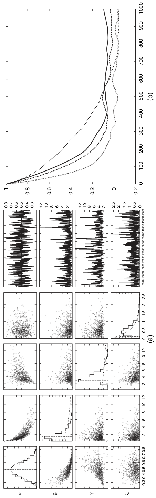

Fig. 6. Lévy-driven stochastic volatility model for synthetic data: (a) histogram approximations of posterior densities $p(\kappa|y_{1:T})$, $p(\delta|y_{1:T})$ and $p(\lambda|y_{1:T})$ (·······, prior) and scatter plots obtained for $N = 200$, and (b) ACFs of the simulated values for various $N$ (-------, $\kappa$; ———, $\delta$; ··········, $\gamma$; ┈┈┈┈, $\lambda$)

<!-- PDF page 19 -->

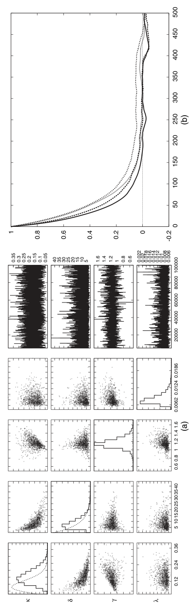

Fig. 7. Lévy-driven stochastic volatility model for Standard & Poors 500 data: (a) histogram approximations of posterior densities $p(\kappa|y_{1:T})$, $p(\delta|y_{1:T})$, $p(\gamma|y_{1:T})$ and $p(\lambda|y_{1:T})$ (·······, prior) and scatter plots, and (b) ACFs of the simulated values obtained for $N=1000$ (-------, $\kappa$; ———, $\delta$; ·······, $\gamma$; ┈┈┈┈, $\lambda$)

<!-- PDF page 20 -->

is less demanding as we could design reasonably fast mixing MCMC algorithms with little user input.

## 4. A generic framework for particle Markov chain Monte Carlo methods

For ease of exposition we have so far considered one of the simplest implementations of the SMC methodology that is used in our PMCMC algorithms (see Section 2). This implementation does not exploit any of the possible standard improvements that were mentioned in Section 2.5 and might additionally suggest that the PMCMC methodology is only applicable to the sole SSM framework. In this section, we consider a more general and abstract framework for PMCMC algorithms which relies on more general SMC algorithms that are not specialized to the SSM scenario. This allows us to consider inference in a much wider class of statistical models but also to consider the use of advanced SMC techniques in a unified framework. This can be understood by the following simple arguments.

First note that the SMC algorithm for SSMs that was described in Section 2.2.1 aims to produce sequentially approximate samples from the family of posterior densities $\{p_\theta(x_{1:n}|y_{1:n}); n=1,\ldots,T\}$ defined on the sequence of spaces $\{\mathcal{X}^n; n=1,\ldots,T\}$. It should be clear that this algorithm can be straightforwardly modified to sample approximately from any sequence of densities $\{\pi_n(x_{1:n}); n=1,\ldots,P\}$ defined on $\{\mathcal{X}^n; n=1,\ldots,P\}$ for any $P\geqslant 1$. This points to the applicability of SMC, and hence PMCMC, methods beyond the sole framework of inference in SSMs to other statistical models. This includes models which naturally have a sequential structure (e.g. Liu (2001)), but also models which do not have such a structure and for which the user induces such a structure (e.g. Chopin (2002) and Del Moral *et al.* (2006)).

Second, as described in Doucet and Johansen (2009), the introduction of advanced SMC techniques for SSMs such as the auxiliary particle filter (Pitt and Shephard, 1999) or the resample–move algorithm (Gilks and Berzuini, 2001) can be naturally interpreted as introducing additional intermediate, and potentially artificial, target densities between, say, $p_\theta(x_{1:n}|y_{1:n})$ and $p_\theta(x_{1:n+1}|y_{1:n+1})$. These additional intermediate densities might not have a physical interpretation but are usually chosen to help to bridge samples from $p_\theta(x_{1:n}|y_{1:n})$ to samples from $p_\theta(x_{1:n+1}|y_{1:n+1})$. Such strategies can therefore be recast into the problem of using SMC methods to sample sequentially from a sequence of densities $\{\pi_n(x_{1:n}); n=1,\ldots,P\}$ for some integer $P\geqslant T$.

### 4.1. A generic sequential Monte Carlo algorithm

Consider the problem of using SMC methods to sample from a sequence of densities $\{\pi_n(x_{1:n}); n=1,\ldots,P\}$ such that for $n=1,\ldots,P$ the density $\pi_n(x_{1:n})$ is defined on $\mathcal{X}^n$. Each density is only assumed known up to a normalizing constant, i.e. for $\pi_n(x_{1:n})=\gamma_n(x_{1:n})/Z_n$ where $\gamma_n:\mathcal{X}^n\to\mathbb{R}^+$ can be evaluated pointwise but the normalizing constant $Z_n$ is unknown. We shall use the notation $Z$ for $Z_P$. For the simple SMC algorithm for SSMs in Section 2, we have $\gamma_n(x_{1:n}) := p_\theta(x_{1:n},y_{1:n})$ and $Z_n := p_\theta(y_{1:n})$. An SMC algorithm also requires us to specify an importance density $M_1(x_1)$ on $\mathcal{X}$ and a family of transition kernels with associated densities $\{M_n(x_n|x_{1:n-1}); n=2,\ldots,P\}$ to extend $x_{1:n-1}\in\mathcal{X}^{n-1}$ by sampling $x_n\in\mathcal{X}$ conditional on $x_{1:n-1}$ at time instants $n=2,\ldots,P$. To describe the resampling step, we introduce a family of probability distributions on $\{1,\ldots,N\}^N$, $\{r(\cdot|\mathbf{w}); \mathbf{w}\in[0,1]^N\}$. In Section 2.2 the sampling distributions are $M_n(x_n|x_{1:n-1}) := q_\theta(x_n|y_n,x_{n-1})$ and $r(\cdot|\mathbf{w}) := \Pi_{i=1}^{N}\mathcal{F}(\cdot|\mathbf{w})$. As in Section 2.2 we use the notation $\mathbf{A}_n := (A_n^1,\ldots,A_n^N)$ where the variable $A_{n-1}^k$ indicates the index of the ‘parent’ at time $n-1$ of particle $X_{1:n}^k$ for $n=2,\ldots,P$. The generic SMC algorithm proceeds as follows.

<!-- PDF page 21 -->

*Step 1*: for $n=1$,

(a) sample $X_1^k\sim M_1(\cdot)$ and

(b) compute and normalize the weights

$$w_1(X_1^k) := \frac{\gamma_1(X_1^k)}{M_1(X_1^k)},$$

$$W_1^k = \frac{w_1(X_1^k)}{\sum_{m=1}^{N} w_1(X_1^m)}.$$

*Step 2*: for $n=2,\ldots,P$,

(a) sample $\mathbf{A}_{n-1}\sim r(\cdot|\mathbf{W}_{n-1})$,

(b) sample $X_n^k\sim M_n(\cdot|X_{1:n-1}^{A_{n-1}^k})$ and set $X_{1:n}^k=(X_{1:n-1}^{A_{n-1}^k},X_n^k)$, and

(c) compute and normalize the weights

$$\begin{aligned} w_n(X_{1:n}^k) &:= \frac{\gamma_n(X_{1:n}^k)}{\gamma_{n-1}(X_{1:n-1}^{A_{n-1}^k})\,M_n(X_n^k|X_{1:n-1}^{A_{n-1}^k})},\\ W_n^k &= \frac{w_n(X_{1:n}^k)}{\sum_{m=1}^{N} w_n(X_{1:n}^m)}. \end{aligned} \tag{20}$$

This algorithm yields an approximation to $\pi(\mathrm{d}x_{1:P})$ and its normalizing constant $Z$ through

$$\begin{aligned} \hat\pi^N(\mathrm{d}x_{1:P}) &:= \sum_{k=1}^{N} W_P^k\,\delta_{X_{1:P}^k}(\mathrm{d}x_{1:P}),\\ \hat Z^N &:= \prod_{n=1}^{P}\left\{\frac{1}{N}\sum_{k=1}^{N} w_n(X_{1:n}^k)\right\}. \end{aligned} \tag{21}$$

Again the role of the vector $\mathbf{A}_n$ is to parameterize a random mapping on $\{1,\ldots,N\}\to\{1,\ldots,N\}^N$, and the standard resampling procedure is hence interpreted here as being the operation by which offspring particles at time $n$ choose their parent particles at time $n-1$ according to a probability distribution $r(\cdot|\mathbf{W}_{n-1})$ parameterized by the parents’ weights $\mathbf{W}_{n-1}$. For any $n\geqslant 1$ we shall hereafter use $O_n^k$ to denote $\Sigma_{m=1}^{N}\mathbb{I}\{A_n^m=k\}$, the number of offspring of particle $k$ at time $n$, and $s(\cdot|\mathbf{W}_n)$ to denote the corresponding probability distribution of $\mathbf{O}_n=(O_n^1,O_n^2,\ldots,O_n^N)$. We shall make extensive use of the notion of ancestral lineage $B_{1:P}^k=(B_1^k,B_2^k,\ldots,B_{P-1}^k,B_P^k=k)$ of a path $X_{1:P}^k=(X_1^{B_1^k},X_2^{B_2^k},\ldots,X_{P-1}^{B_{P-1}^k},X_P^{B_P^k})$ already introduced in Section 2. We recall that $B_P^k := k$ and for $n=P-1,\ldots,1$ we have $B_n^k := A_n^{B_{n+1}^k}$. This notation is necessary to establish the mathematical validity of PMCMC algorithms since it allows us to describe precisely and simply the various probabilistic objects that are involved. For example it will be useful in what follows to describe the probability density $\psi(\bar{\mathbf{x}}_1,\ldots,\bar{\mathbf{x}}_P,\mathbf{a}_1,\ldots,\mathbf{a}_{P-1})$ of all the random variables generated by the generic SMC algorithm above. Letting $\bar{\mathbf{X}}_n$ denote $(X_n^1,\ldots,X_n^N)\in\mathcal{X}^N$, the set of $N$ simulated $\mathcal{X}$-valued random variables at time $n$, for $n=1,\ldots,P$, it is straightforward to establish that the joint density of $\bar{\mathbf{X}}_1,\ldots,\bar{\mathbf{X}}_P,\mathbf{A}_1,\ldots,\mathbf{A}_{P-1}$ defined on $\mathcal{X}^{PN}\times\{1,\ldots,N\}^{(P-1)N}$ is

$$\psi(\bar{\mathbf{x}}_1,\ldots,\bar{\mathbf{x}}_P,\mathbf{a}_1,\ldots,\mathbf{a}_{P-1}) = \left\{\prod_{m=1}^{N} M_1(x_1^m)\right\}\prod_{n=2}^{P}\left\{r(\mathbf{a}_{n-1}|\mathbf{w}_{n-1})\prod_{m=1}^{N} M_n(x_n^m|x_{1:n-1}^{a_{n-1}^m})\right\}. \tag{22}$$

<!-- PDF page 22 -->

We shall make extensive use of this result in the remainder of the paper. Note in particular that a sample $X_{1:P}$ that is drawn from $\hat\pi^N(\mathrm{d}x_{1:P})$ in equation (21) has a distribution $q^N(\mathrm{d}x_{1:P}) := \mathbb{E}_\psi\{\hat\pi^N(\mathrm{d}x_{1:P})\}$ where $\mathbb{E}_\psi(\cdot)$ denotes the expectation with respect to $\psi$.

Not all choices of $\{\pi_n\}$, $\{M_1(x_1), M_n(x_n|x_{1:n-1}); n=2,\ldots,P\}$ and $r(\cdot|\mathbf{w})$ will lead to a consistent SMC algorithm, i.e. to an algorithm such that $\hat\pi^N$ and $\hat Z^N$ respectively converge to $\pi$ and $Z$ in some sense as $N\to\infty$. We shall rely on the following standard minimal assumptions. The following notation will be needed to characterize the support of the target and proposal densities. We define

$$\begin{aligned} \mathcal{S}_n &= \{x_{1:n}\in\mathcal{X}^n : \pi_n(x_{1:n})>0\} &&\text{for } n\geqslant 1,\\ \mathcal{Q}_n &= \{x_{1:n}\in\mathcal{X}^n : \pi_{n-1}(x_{1:n-1})\,M_n(x_n|x_{1:n-1})>0\} &&\text{for } n\geqslant 1, \end{aligned}$$

with the convention $\pi_0(x_{1:0})=1$ and $M_1(x_1|x_{1:0})=M_1(x_1)$. The required set of minimal assumptions is as follows.

**Assumption 1.** For $n=1,\ldots,P$, we have $\mathcal{S}_n\subseteq\mathcal{Q}_n$.

**Assumption 2.** For any $k=1,\ldots,N$ and $n=1,\ldots,P$ the resampling scheme satisfies

$$\mathbb{E}(O_n^k|\mathbf{W}_n) = N W_n^k \tag{23}$$

and

$$r(A_n^k=m|\mathbf{W}_n) = W_n^m. \tag{24}$$

Assumption 1 simply states that it is possible to use the importance density $\pi_{n-1}(x_{1:n-1})\times M_n(x_n|x_{1:n-1})$ to approximate $\pi_n(x_{1:n})$. Assumption 2 is related to the resampling scheme. The ‘unbiasedness’ condition in equation (23) is satisfied by the popular multinomial, residual and stratified resampling procedures. The condition in equation (24) is not usually satisfied as in practice, for computational efficiency, $\mathbf{O}_n$ is usually drawn first according to a probability distribution $s(\cdot|\mathbf{W}_n)$ such that equation (23) holds (i.e. without explicit reference to $\mathbf{A}_n$) and the offspring then matched to their parents. More precisely, once $\mathbf{O}_n$ has been sampled, this is followed by a deterministic allocation procedure of the offspring particles to the parents, which defines indices; for example the $O_n^1$ first-offspring particles are associated with the parent particle number 1, i.e. $A_n^1=1,\ldots,A_n^{O_n^1}=1$, and likewise for the $O_n^2$ following offspring particles and the parent particle number 2, i.e. $A_n^{O_n^1+1}=2,\ldots,A_n^{O_n^1+O_n^2}=2$ etc. However, condition (24) can be easily enforced by the addition of a random permutation of these indices.

We provide here some results concerning the precision of SMC estimates of key quantities that are involved in the implementation of PMCMC algorithms as a function of both $P$ and $N$. We point to the fact that some of these results rely on relatively strong conditions, but their interest is nevertheless twofold. First they provide some quantitative insight into the reasons why using the output of SMC algorithms as proposals might be a good idea and how performance might scale with respect to both $P$ and $N$. Second these results correspond to current understanding of SMC methods and have been empirically observed to extend beyond the scenarios that are detailed below.

**Assumption 3.** There is a sequence of constants $\{C_n; n=1,\ldots,\bar P\}$ for some integer $\bar P$ such that for any $x_{1:n}\in\mathcal{S}_n$

$$w_n(x_{1:n})\leqslant C_n. \tag{25}$$

<!-- PDF page 23 -->

**Assumption 4.** There are $\mu(\cdot)$ a probability density on $\mathcal{X}$ and $0<\underline{w},\bar w,\underline{\varepsilon},\bar\varepsilon<\infty$ such that, for any $n=1,\ldots,\bar P$ and any $x_{1:n}\in\mathcal{S}_n$,

$$\underline{w}\leqslant w_n(x_{1:n})\leqslant\bar w \ \text{ and } \ \underline{\varepsilon}\,\mu(x_n)\leqslant M_n(x_n|x_{1:n-1})\leqslant\bar\varepsilon\,\mu(x_n).$$

**Theorem 1.** Assume assumption 1 for $P=1,\ldots,\bar P$ and some $\bar P>0$, and assumption 3. For the multinomial resampling scheme, for any $P=1,\ldots,\bar P$ there are $C(P)$ and $D(P)$ such that for any $N\geqslant 1$ the variance of $\hat Z^N/Z$ satisfies

$$\mathbb{V}\left(\frac{\hat Z^N}{Z}\right)\leqslant\frac{C(P)}{N}, \tag{26}$$

and such that the distribution of a sample from $q^N(\mathrm{d}x_{1:P}) := \mathbb{E}_\psi\{\hat\pi^N(\mathrm{d}x_{1:P})\}$ satisfies for any $N\geqslant 1$

$$\|q^N(\cdot)-\pi(\cdot)\|\leqslant\frac{D(P)}{N}, \tag{27}$$

where ‘$\|\cdot\|$’ denotes the total variation distance.

If in addition assumption 4 is satisfied then there are constants $C,D>0$, depending on $\underline{w}$, $\bar w$, $\underline{\varepsilon}$, $\bar\varepsilon$ and $\mu$ but not $P$, such that the results above hold with

$$C(P)=CP \ \text{ and } \ D(P)=DP. \tag{28}$$

Assumption 3 is related to the standard boundedness condition for importance weights in classical importance sampling. The results in equations (26) and (27) have been established very early on in the literature; see for example Del Moral (2004). However, these results are rather weak since $C(P)$ and $D(P)$ are typically exponential functions of $P$. Assumption 4 imposes a practically realistic pattern of dependence on the components of $X_{1:P}$, namely a forgetting property, which turns out to be beneficial in that it mitigates the propagation of error in the SMC algorithm. As a result the linear bounds in expression (28) can be established (Cérou *et al.* (2008) and personal communication with Professor Pierre Del Moral). As discussed in more detail in the next sections these results have direct implications on the performance of PMCMC algorithms. In particular expression (28) suggests that approximations of idealized algorithms requiring exact samples from $\pi(\mathrm{d}x_{1:P})$ by algorithms which instead use a particle $X_{1:P}$ drawn from $\hat\pi^N(\mathrm{d}x_{1:P})$ in equation (21) are likely to scale linearly with increasing dimensions under assumption 4. This should be contrasted with the typical exponential deterioration of performance of classical IS approaches.

### 4.2. The particle independent Metropolis–Hastings update

To sample from $\pi(x_{1:P})$, we can suggest a PIMH sampler which is an IMH sampler using an SMC approximation $\hat\pi^N(\mathrm{d}x_{1:P})$ of $\pi(x_{1:P})$ as proposal distribution. The algorithm is similar to the algorithm that was discussed in Section 2.4.1 where $P=T$ and where we substitute $\hat\pi^N(\mathrm{d}x_{1:P})$ and $\hat Z^N$ respectively in place of $\hat p_\theta(\mathrm{d}x_{1:T}|y_{1:T})$ and $\hat p_\theta(y_{1:T})$, with the notation given in equation (21).

Given $(X_{1:P},\hat Z^N)$, the PIMH update consists of running an SMC algorithm targeting $\pi(x_{1:P})$ to obtain an approximation $\hat\pi^{N,*}(\mathrm{d}x_{1:P})$ and $\hat Z^{N,*}$ respectively for $\pi(\mathrm{d}x_{1:P})$ and $Z$, sampling $X_{1:P}^{*}\sim\hat\pi^{N,*}(\cdot)$. We set $(X_{1:P}',\hat Z'^N)=(X_{1:P}^{*},\hat Z^{N,*})$ with probability

$$1\wedge\hat Z^{N,*}/\hat Z^N \tag{29}$$

and $(X_{1:P}',\hat Z'^N)=(X_{1:P},\hat Z^N)$ otherwise.

<!-- PDF page 24 -->

We now prove that a sequence $\{X_{1:P}(i)\}$ generated by a PIMH sampler, i.e. by iterating the PIMH update (initialized with the output $X_{1:P}(0)\sim\hat\pi^N(\cdot)$, $\hat Z^N(0)$ of an SMC algorithm targeting $\pi(x_{1:P})$), has $\pi(x_{1:P})$ as the desired equilibrium density for any $N\geqslant 1$. The key to establishing this result is to reformulate the PIMH update as a standard IMH update defined on an extended state space $\mathbf{X}$ with a suitable invariant density. First we establish the expression for the density of the set of random variables generated to construct $X_{1:P}^{*}$ above. In the light of the discussion of Section 4.1 the SMC algorithm generates the set of random variables $\bar{\mathbf{X}}_1,\ldots,\bar{\mathbf{X}}_P,\mathbf{A}_1,\ldots,\mathbf{A}_{P-1}$ and the selection of $X_{1:P}^{*}$ among the particles $\{X_{1:P}^m; m=1,\ldots,N\}$ involves sampling a random variable $K$ with distribution $\mathcal{F}(\cdot|\mathbf{W}_P)$. From equation (22) we deduce that this density takes the simple form

$$q^N(k,\bar{\mathbf{x}}_1,\ldots,\bar{\mathbf{x}}_P,\mathbf{a}_1,\ldots,\mathbf{a}_{P-1}) := w_P^k\,\psi(\bar{\mathbf{x}}_1,\ldots,\bar{\mathbf{x}}_P,\mathbf{a}_1,\ldots,\mathbf{a}_{P-1}) \tag{30}$$

and is defined on $\mathbf{X}=\mathcal{X}^{PN}\times\{1,\ldots,N\}^{(P-1)N+1}$. Here $w_P^k$ is the realization of the normalized importance weight $W_P^K$. The less obvious point is to identify the density $\tilde\pi^N$ on $\mathbf{X}$ targeted by the PIMH algorithm which is given by

$$\tilde\pi^N(k,\bar{\mathbf{x}}_1,\ldots,\bar{\mathbf{x}}_P,\mathbf{a}_1,\ldots,\mathbf{a}_{P-1}) = \frac{\pi(x_{1:P}^k)}{N^P}\,\frac{\psi(\bar{\mathbf{x}}_1,\ldots,\bar{\mathbf{x}}_P,\mathbf{a}_1,\ldots,\mathbf{a}_{P-1})}{M_1(x_1^{b_1^k})\prod_{n=2}^{P} r(b_{n-1}^k|\mathbf{w}_{n-1})\,M_n(x_n^{b_n^k}|x_{1:n-1}^{b_{n-1}^k})}, \tag{31}$$

where we remind the reader that $x_{1:P}^k=(x_1^{b_1^k},x_2^{b_2^k},\ldots,x_{P-1}^{b_{P-1}^k},x_P^{b_P^k})$ and note that $\pi(x_{1:P}^k)/N^P$ is the marginal probability density $\tilde\pi^N(x_{1:P}^k,b_{1:P}^k)$. Note the important property that, for a sample $K,\bar{\mathbf{X}}_1,\ldots,\bar{\mathbf{X}}_P,\mathbf{A}_1,\ldots,\mathbf{A}_{P-1}$ from this distribution, $X_{1:P}^K$ is distributed according to the distribution of interest $\pi$. For any $i\geqslant 0$, let $\mathcal{L}^N(X_{1:P}(i)\in\cdot)$ denote the distribution of $X_{1:P}(i)$ generated by the PIMH sampler with $N\geqslant 1$ particles. Our main result is the following theorem, which is proved in Appendix B.

**Theorem 2.** Assume assumption 2. Then for any $N\geqslant 1$ the PIMH update is a standard IMH update on the extended space $\mathbf{X}$ with target density $\tilde\pi^N$ defined in equation (31) and proposal density $q^N$ defined in equation (30).

Proving this theorem simply consists of checking that under our assumptions the ratio between the extended target $\tilde\pi^N$ and the extended proposal $q^N$ is, whenever $q^N>0$, equal to $\hat Z^N/Z$, and deduce that the acceptance ratio of an IMH update with target and proposal densities $\tilde\pi^N$ and $q^N$ takes the form in equation (29). Note that, although assumption 1 is not needed to establish this theorem, this condition is, however, required both to ensure that $\hat Z^N$ is a consistent estimator of $Z$ (and hence that the PIMH is a consistent ‘exact approximation’) and that the corresponding sampler is ergodic. This result implies that if $(K,\bar{\mathbf{X}}_1,\ldots,\bar{\mathbf{X}}_P,\mathbf{A}_1,\ldots,\mathbf{A}_{P-1})\sim\tilde\pi^N$, and in particular $X_{1:P}^K\sim\pi$, then after an IMH update the resulting sample $(K',\bar{\mathbf{X}}_1',\ldots,\bar{\mathbf{X}}_P',\mathbf{A}_1',\ldots,\mathbf{A}_{P-1}')\sim\tilde\pi^N$, and in particular $X_{1:P}'^{K'}\sim\pi$. In addition formulating the PIMH sampler as an IMH algorithm in disguise targeting $\tilde\pi^N$ allows us to use standard results concerning the convergence properties of the IMH sampler to characterize those of the PIMH sampler.

**Theorem 3.** Assume assumptions 1 and 2. Then

(a) the PIMH sampler generates a sequence $\{X_{1:P}(i)\}$ whose marginal distributions $\{\mathcal{L}^N\{X_{1:P}(i)\in\cdot\}\}$ satisfy

$$\|\mathcal{L}^N\{X_{1:P}(i)\in\cdot\}-\pi(\cdot)\|\to 0 \qquad \text{as } i\to\infty,$$

<!-- PDF page 25 -->

(b) if additionally assumption 3 holds, then there exists $\rho_P\in[0,1)$ such that for any $i\geqslant 1$ and $x_{1:P}\in\mathcal{X}^P$

$$\|\mathcal{L}^N\{X_{1:P}(i)\in\cdot\,|X_{1:P}(0)=x_{1:P}\}-\pi(\cdot)\|\leqslant\rho_P^i. \tag{32}$$

The first statement is a direct consequence of theorem 2, standard convergence properties of irreducible MCMC algorithms and the fact that $\{X_{1:P}(i)\}=\{X_{1:P}^{K(i)}(i)\}$. The second statement, leading to equation (32), simply exploits the well-known fact that the IMH sampler converges geometrically if and only if the supremum of the ratio of the target density to the proposal density (here $\hat Z^N/Z$) is finite.

This latter result nevertheless calls for some comments since $\rho_P$ is—perhaps surprisingly—independent of $N$, implying the rather negative property that increasing $N$ does not seem to improve convergence of the algorithm. Again the IMH nature of the PIMH sampler sheds some light on this point. In simple terms, the convergence properties of an IMH sampler are governed by the large values of the ratio of the target density to the proposal density. Indeed, leaving a state with such a large ratio is difficult and results in a slowly mixing Markov chain exhibiting a ‘sticky’ behaviour. What the second result above tells us is that the existence of such sticky states is not eliminated by the PIMH strategy when $N$ increases. However, the probability of visiting such unfavourable states can be made arbitrarily small by increasing $N$ by virtue of the results in theorem 1 and the application of Tchebychev’s inequality. In fact, as a particular case of Andrieu and Roberts (2009), it is possible to show that for any $\varepsilon,\eta>0$ there exists an $N_0$ such that for any $N\geqslant N_0$ and any $i\geqslant 1$

$$\|\mathcal{L}_{*}^{N}\{X_{1:P}(i)\in\cdot\}-\pi(\cdot)\|\leqslant\varepsilon$$

with $\psi$-probability larger than $1-\eta$, where $\mathcal{L}_{*}^{N}\{X_{1:P}(i)\in\cdot\}$ denotes the conditional distribution of $X_{1:P}(i)$ given the random variables generated at iteration 0 by the SMC algorithm.

### 4.3. The conditional sequential Monte Carlo update

The expression

$$\frac{\psi(\bar{\mathbf{x}}_1,\ldots,\bar{\mathbf{x}}_P,\mathbf{a}_1,\ldots,\mathbf{a}_{P-1})}{M_1(x_1^{b_1^k})\prod_{n=2}^{P} r(b_{n-1}^k|\mathbf{w}_{n-1})\,M_n(x_n^{b_n^k}|x_{1:n-1}^{b_{n-1}^k})} \tag{33}$$

appearing in $\tilde\pi^N$ given in equation (31) is the density under $\tilde\pi^N$ of all the variables that are generated by the SMC algorithm conditional on $(X_{1:P}^K=x_{1:P}^k, B_{1:P}^K=b_{1:P}^k)$. Although this sheds some light on the structure of $\tilde\pi^N$, sampling from this conditional density can also be of a practical interest. As we shall see, it is a key element of the PG sampler discussed in Sections 2.4.3 and 4.5 and can also be used to update sub-blocks of $x_{1:P}$. Given $(X_{1:P}^K=x_{1:P}^k, B_{1:P}^K=b_{1:P}^k)$ the algorithm to sample from the distribution above proceeds as follows.

*Step 1*: $n=1$,

(a) for $m\neq B_1^K$, sample $X_1^m\sim q_1(\cdot)$ and

(b) compute $w_1(X_1^m)$ and normalize the weights $W_1^m\propto w_1(X_1^m)$.

*Step 2*: for $n=2,\ldots,P$,

(a) sample $\mathbf{A}_{n-1}^{-B_n^K}\sim r(\cdot|\mathbf{W}_{n-1},A_{n-1}^{B_n^K}=B_{n-1}^K)$,

(b) for $m\neq B_n^K$, sample $X_n^m\sim M_n(\cdot|X_{1:n-1}^{A_{n-1}^m})$ and set $X_{1:n}^m=(X_{1:n-1}^{A_{n-1}^m},X_n^m)$, and

(c) compute $w_n(X_{1:n}^m)$ and normalize the weights $W_n^m\propto w_n(X_{1:n}^m)$.

<!-- PDF page 26 -->

Here we have used the notation $\mathbf{A}_{n-1}^{-B_n^K} := \mathbf{A}_{n-1}\backslash\{A_{n-1}^{B_n^K}\}$. We explain in Appendix A how to sample efficiently from $r(\cdot|\mathbf{W}_{n-1},A_{n-1}^{B_n^K})$. Intuitively this update can be understood as updating $N-1$ particles together with their weights while keeping one particle fixed in $\hat\pi^N(\mathrm{d}x_{1:P})$. Going one step further, one can suggest sampling $X_{1:P}'^{K'}$ from this updated empirical distribution $\hat\pi'^N(\mathrm{d}x_{1:P})$. The remarkable property here is that, whenever $(K,X_{1:P}^K,B_{1:P-1}^K)\sim\pi(x_{1:P}^k)/N^P$ (corresponding to the marginal $\tilde\pi^N(k,x_{1:P}^k,b_{1:P-1}^k)$), then $X_{1:P}'^{K'}\sim\pi$. This stems from the fact that the conditional SMC update followed by sampling from $\hat\pi'^N(\mathrm{d}x_{1:P})$ can be interpreted as a standard Gibbs update on the distribution $\tilde\pi^N$. Indeed, as mentioned earlier, the conditional SMC update samples from $\tilde\pi^N(k,\bar{\mathbf{x}}_1,\ldots,\bar{\mathbf{x}}_P,\mathbf{a}_1,\ldots,\mathbf{a}_{P-1})/\tilde\pi^N(k,x_{1:P}^k,b_{1:P-1}^k)$ and it can easily be checked from equation (41) that $\tilde\pi^N(k|\bar{\mathbf{x}}_1,\ldots,\bar{\mathbf{x}}_P,\mathbf{a}_1,\ldots,\mathbf{a}_{P-1})=w_P^k$, which is precisely the probability involved in sampling from $\hat\pi'^N(\mathrm{d}x_{1:P})$. We stress the crucial fact that a single particle $(K,X_{1:P}^K,B_{1:P-1}^K)$ is needed to initialize this Gibbs update.

An important practical application of this property is concerned with the sampling of sub-blocks of $x_{1:P}$ when $P$ is so large that a prohibitive number of particles might be required to lead to an efficient global update. In such situations, we can simply divide the sequence $x_{1:P}$ into large sub-blocks and use a mixture of Gibbs sampler updates as described above. Given a sub-block $X_{c:d}=x_{c:d}$ for $1<c<d<P$ such an update leaving $\pi(x_{c:d}|x_{1:c-1},x_{d+1:P})$ invariant proceeds as follows.

(a) Sample an ancestral lineage $B_{c:d}$ uniformly in $\{1,\ldots,N\}^{d-c+1}$.

(b) Run a conditional SMC algorithm targeting $\pi(x_{c:d}|x_{1:c-1},x_{d+1:P})$ conditional on $X_{c:d}$ and $B_{c:d}$.

(c) Sample $X_{c:d}\sim\hat\pi^N(\cdot|x_{1:c-1},x_{d+1:P})$.

### 4.4. The particle marginal Metropolis–Hastings update

We now consider the case where we are interested in sampling from a density

$$\pi(\theta,x_{1:P})=\gamma(\theta,x_{1:P})/Z \tag{34}$$

with $\gamma:\Theta\times\mathcal{X}^P\to\mathbb{R}^+$ assumed known pointwise and $Z$ a possibly unknown normalizing constant, independent of $\theta\in\Theta$. In the case of the simple SMC algorithm for SSMs that was considered in Section 2.4.2, we have $P=T$, $\pi(\theta,x_{1:P})=p(\theta,x_{1:T}|y_{1:T})$, $\gamma(\theta,x_{1:P})=p(\theta,x_{1:T},y_{1:T})$ given in equation (4) and $Z=p(y_{1:T})$. Following the developments of Section 2.4.2 we can suggest the use of a PMMH sampler which consists of approximating an MMH algorithm with proposal density $q(\theta^{*}|\theta)\,\pi_{\theta^{*}}(x_{1:P}^{*})$ and target density $\pi(\theta,x_{1:P})=\pi(\theta)\,\pi_\theta(x_{1:P})$ where $\pi_\theta(x_{1:P})=\gamma(\theta,x_{1:P})/\gamma(\theta)$ with $\gamma(\theta) := \int_{\mathcal{X}^P}\gamma(\theta,x_{1:P})\,\mathrm{d}x_{1:P}$ and $\pi(\theta)=\gamma(\theta)/Z$; we have $\gamma(\theta)=p_\theta(y_{1:T})\,p(\theta)$ in Section 2.4.2. We use an SMC algorithm to sample approximately from $\pi_\theta(x_{1:P})$ and approximately compute its normalizing constant $\gamma(\theta)$. This requires introducing a family of bridging densities $\{\pi_n^\theta(x_{1:n}); n=1,\ldots,P\}$, each of them known up to a normalizing constant, such that $\pi_P^\theta(x_{1:P})=\pi_\theta(x_{1:P})$ and a family of IS densities $\{M_n^\theta(x_n|x_{1:n-1})\}$. We shall use $\hat\pi_\theta^N(\mathrm{d}x_{1:P})$ and $\hat\gamma^N(\theta)$ respectively to denote the SMC approximation to $\pi_\theta(\mathrm{d}x_{1:P})$ and $\gamma(\theta)$.

The PMMH update consists at iteration $i$ of sampling a candidate $\theta^{*}\sim q\{\cdot|\theta(i-1)\}$, then running an SMC sampler to obtain $\hat\pi_{\theta^{*}}^N(\mathrm{d}x_{1:P})$, $\hat\gamma^N(\theta^{*})$ and sampling $X_{1:P}^{*}\sim\hat\pi_{\theta^{*}}^N(\cdot)$. We set $(\theta(i),X_{1:P}(i),\hat\gamma^N\{\theta(i)\})=(\theta^{*},X_{1:P}^{*},\hat\gamma^N(\theta^{*}))$ with probability

$$1\wedge\frac{\hat\gamma^N(\theta^{*})}{\hat\gamma^N\{\theta(i-1)\}}\,\frac{q\{\theta(i-1)|\theta^{*}\}}{q\{\theta^{*}|\theta(i-1)\}} \tag{35}$$

and $(\theta(i),X_{1:P}(i),\hat\gamma^N\{\theta(i)\})=(\theta(i-1),X_{1:P}(i-1),\hat\gamma^N\{\theta(i-1)\})$ otherwise. We formulate very mild and natural assumptions which will guarantee convergence for any $N\geqslant 1$, i.e. ensure that

<!-- PDF page 27 -->

the sequence $\{\theta(i),X_{1:P}(i)\}$ that is generated by the PMMH sampler will have $\pi(\theta,x_{1:P})$ as asymptotic density. For any $\theta\in\Theta$, we define

$$\begin{aligned} \mathcal{S}_n^\theta &= \{x_{1:n}\in\mathcal{X}^n\in\mathcal{X}^n : \pi_n^\theta(x_{1:n})>0\} &&\text{for } n=1,\ldots,P,\\ \mathcal{Q}_n^\theta &= \{x_{1:n}\in\mathcal{X}^n : \pi_{n-1}^\theta(x_{1:n-1})\,M_n^\theta(x_n|x_{1:n-1})>0\} &&\text{for } n=1,\ldots,P, \end{aligned}$$

with the convention $\pi_0^\theta(x_{1:0}) := 1$ and $M_n^\theta(x_1|x_{1:0}) := M_1^\theta(x_1)$, and $\mathcal{S}=\{\theta\in\Theta : \pi(\theta)>0\}$. We make the following assumptions.

**Assumption 5.** For any $\theta\in\mathcal{S}$, we have $\mathcal{S}_n^\theta\subseteq\mathcal{Q}_n^\theta$ for $n=1,\ldots,P$.

**Assumption 6.** The MH sampler of target density $\pi(\theta)$ and proposal density $q(\theta^{*}|\theta)$ is irreducible and aperiodic (and hence converges for $\pi$ almost all starting points).

Again assumption 5 is needed to ensure that $\pi_{n-1}^\theta(x_{1:n-1})\,M_n^\theta(x_n|x_{1:n-1})$ can be used as an importance density to approximate $\pi_n^\theta(x_{1:n})$ for any $\theta\in\Theta$ such that $\pi(\theta)>0$ whereas assumption 6 ensures that the associated MH algorithm converges. Our main result is the following theorem, which is proved in Appendix B.

**Theorem 4.** Assume assumption 2. Then for any $N\geqslant 1$

(a) the PMMH update is an MH update defined on the extended space $\Theta\times\mathbf{X}$ with target density

$$\tilde\pi^N(\theta,k,\bar{\mathbf{x}}_1,\ldots,\bar{\mathbf{x}}_P,\mathbf{a}_1,\ldots,\mathbf{a}_{P-1}) := \frac{\pi(\theta,x_{1:P}^k)}{N^P}\,\frac{\psi^\theta(\bar{\mathbf{x}}_1,\ldots,\bar{\mathbf{x}}_P,\mathbf{a}_1,\ldots,\mathbf{a}_{P-1})}{M_1^\theta(x_1^{b_1^k})\prod_{n=2}^{P} r(b_{n-1}^k|\mathbf{w}_{n-1})\,M_n^\theta(x_n^{b_n^k}|x_{1:n-1}^{b_{n-1}^k})}, \tag{36}$$

where

$$\psi^\theta(\bar{\mathbf{x}}_1,\ldots,\bar{\mathbf{x}}_P,\mathbf{a}_1,\ldots,\mathbf{a}_{P-1}) := \left\{\prod_{m=1}^{N} M_1^\theta(x_1^m)\right\}\prod_{n=2}^{P}\left\{r(\mathbf{a}_{n-1}|\mathbf{w}_{n-1})\prod_{m=1}^{N} M_n^\theta(x_n^m|x_{1:n-1}^{a_{n-1}^m})\right\}, \tag{37}$$

and proposal density

$$q(\theta^{*}|\theta)\,w_P^{*k}\,\psi^{\theta^{*}}(\bar{\mathbf{x}}_1^{*},\ldots,\bar{\mathbf{x}}_P^{*},\mathbf{a}_1^{*},\ldots,\mathbf{a}_{P-1}^{*})$$

where $w_P^{*k}$ consists of the realization of the normalized importance weights that are associated with the proposed population of particles, and

(b) if additionally assumptions 5 and 6 hold, the PMMH sampler generates a sequence $\{\theta(i),X_{1:P}(i)\}$ whose marginal distributions $\{\mathcal{L}^N\{(\theta(i),X_{1:P}(i))\in\cdot\}\}$ satisfy

$$\|\mathcal{L}^N\{(\theta(i),X_{1:P}(i))\in\cdot\}-\pi(\cdot)\|\to 0 \qquad \text{as } i\to\infty.$$

### 4.5. The particle Gibbs update

The PG sampler aims to solve the same problem as the PMMH algorithm, i.e. sampling from $\pi(\theta,x_{1:P})$ defined on some space $\Theta\times\mathcal{X}^P\to\mathbb{R}^+$ as defined in equation (8) in the situation where an unormalized version $\gamma(\theta,x_{1:P})$ is accessible. A Gibbs sampler for this model would typically consist of alternately sampling from $\pi(\theta|x_{1:P})$ and $\pi_\theta(x_{1:P})$. To simplify our discussion we shall assume here that sampling exactly from $\pi(\theta|x_{1:P})$ is possible. However, sampling from $\pi_\theta(x_{1:P})$ is naturally impossible in most situations of interest, but motivated by the structure and properties of $\tilde\pi^N(\theta,k,\bar{\mathbf{x}}_1,\ldots,\bar{\mathbf{x}}_P,\mathbf{a}_1,\ldots,\mathbf{a}_{P-1})$ defined in equation (36) we can suggest performing a Gibbs sampler targeting precisely this density. We choose the following sweep:

(a) $\theta^{*}|(k,x_{1:P}^k,b_{1:P-1}^k)\sim\tilde\pi^N(\cdot|k,x_{1:P}^k,b_{1:P-1}^k)=\pi(\cdot|x_{1:P}^k)$,

<!-- PDF page 28 -->

(b) $(\bar{\mathbf{X}}_1^{*,-b_1^k},\ldots,\bar{\mathbf{X}}_P^{*,-b_P^k},\mathbf{A}_1^{*,-b_2^k},\ldots,\mathbf{A}_{P-1}^{*,-b_P^k})\sim\tilde\pi^N(\cdot|\theta^*,k,x_{1:P}^k,b_{1:P-1}^k)$,

(c) $\Pr(K^*=l|\theta^*,\bar{\mathbf{x}}_1^{*,-b_1^k},\ldots,\bar{\mathbf{x}}_P^{*,-b_P^k},\mathbf{a}_1^{*,-b_2^k},\ldots,\mathbf{a}_{P-1}^{*,-b_P^k},x_{1:P}^k,b_{1:P-1}^k)=w_P^l$.

Steps (a) and (c) are straightforward to implement. In the light of the discussion of Section 4.3, step (b) can be directly implemented thanks to a conditional SMC algorithm. Note that step (a) might appear unusual but leaves $\tilde\pi^N(\theta,k,\bar{\mathbf{x}}_1,\ldots,\bar{\mathbf{x}}_P,\mathbf{a}_1,\ldots,\mathbf{a}_{P-1})$ invariant and is known in the literature under the name ‘collapsed’ Gibbs sampler (Liu (2001), section 6.7). We remind the reader that a detailed particular implementation of this algorithm in the context of SSMs with multinomial resampling is given in Section 2.4.3. We now state a sufficient condition for the convergence of the PG sampler and provide a simple convergence result which is proved in Appendix B.

**Assumption 7.** The Gibbs sampler that is defined by the conditionals $\pi(\theta|x_{1:P})$ and $\pi_\theta(x_{1:P})$ is irreducible and aperiodic (and hence converges for $\pi$ almost all starting points).

We have the following result.

**Theorem 5.** Assume assumption 2. Then

(a) the PG update defines a transition kernel on the extended space $\Theta\times\mathbf{X}$ of invariant density $\tilde\pi^N$ defined in equation (36) for any $N\geqslant 1$, and

(b) if additionally assumptions 5–7 hold, the PG sampler generates a sequence $\{\theta(i),X_{1:P}(i)\}$ whose marginal distributions $\{\mathcal{L}^N\{(\theta(i),X_{1:P}(i))\in\cdot\}\}$ satisfy for any $N\geqslant 2$

$$\|\mathcal{L}^N\{(\theta(i),X_{1:P}(i))\in\cdot\}-\pi(\cdot)\|\to 0\qquad\text{as } i\to\infty.$$

### 4.6. Reusing all the particles

Standard theory of MCMC algorithms establishes that under our assumptions $(1/L)\Sigma_{i=1}^{L}f\{\theta(i),X_{1:P}(i)\}$ will almost surely converge to $\mathbb{E}_\pi(f)$ whenever $\mathbb{E}_\pi(|f|)<\infty$ as the number $L$ of PMMH or PG iterations goes to $\infty$. We show here that it is possible to use all the particles that are involved in the construction of $\hat\pi^N$ to estimate this expectation, but also rejected sets of particles. The application to the PIMH sampler is straightforward by ignoring $\theta$ in the notation, replacing $\hat\gamma^N(\theta)$ with $\hat Z^N$ and the acceptance ratios below with their counterparts in expression (29).

**Theorem 6.** Assume assumptions 2–5 and let $f:\Theta\times\mathcal{X}^P\to\mathbb{R}$ be such that $\mathbb{E}_\pi(|f|)<\infty$. Then as soon as the PMMH sampler or the PG sampler is ergodic then, for any $N\geqslant 1$ or $N\geqslant 2$ respectively,

(a) the estimate

$$\frac{1}{L}\sum_{i=1}^{L}\left[\sum_{k=1}^{N}W_P^k(i)\,f\{\theta(i),X_{1:P}^k(i)\}\right]\tag{38}$$

converges almost surely towards $\mathbb{E}_\pi(f)$ as $L\to\infty$ where $\{W_P^k(i),X_{1:T}^k(i),\theta(i)\}$ corresponds to the set of normalized weights and particles used to compute $\hat\gamma^N\{\theta(i)\}$,

(b) and for the PMMH sampler, denoting by $\{W_P^{*k}(i),X_{1:P}^{*k}(i),\theta^*(i);k=1,\ldots,N\}$ the set of proposed weighted particles at iteration $i$ (i.e. before deciding whether or not to accept this population) and $\hat\gamma^N\{\theta^*(i)\}$ the associated normalizing constant estimate

$$\frac{1}{L}\sum_{i=1}^{L}\left(\alpha\{\theta(i-1),\theta^*(i)\}\sum_{k=1}^{N}W_P^{*k}(i)\,f\{\theta^*(i),X_{1:P}^{*k}(i)\}+[1-\alpha\{\theta(i-1),\theta^*(i)\}]\sum_{k=1}^{N}W_P^k(i-1)\,f\{\theta(i-1),X_{1:P}^k(i-1)\}\right),\tag{39}$$

<!-- PDF page 29 -->

with for any $\theta,\theta'\in\Theta$

$$\alpha(\theta,\theta'):=1\wedge\frac{\hat\gamma^N(\theta')}{\hat\gamma^N(\theta)}\,\frac{q(\theta|\theta')}{q(\theta'|\theta)},\tag{40}$$

converges almost surely towards $\mathbb{E}_\pi(f)$ as $L\to\infty$.

The proof can be found in Appendix B and relies on ‘Rao–Blackwellization’-type arguments. The estimator in equation (39) is in the spirit of the ideas of Frenkel (2006) and tells us that it is also possible to recycle all the candidate populations that are generated by the PMMH sampler.

## 5. Discussion and extensions

### 5.1. Discussion and connections to previous work

The PIMH algorithm is related to the configurational-biased Monte Carlo (CBMC) method, which is a very popular method in molecular simulation (Siepmann and Frenkel, 1992). However, in contrast with the PIMH algorithm, the CBMC algorithm does not propagate $N$ particles in parallel. Indeed, at each time step $n$, the CBMC algorithm samples $N$ particles but the resampling step is such that a single particle survives, to which a new set of $N$ offspring is then attached. The problem with this approach is that it is somewhat too greedy and that if a ‘wrong’ decision is taken too prematurely then the proposal will most likely be rejected. It can be shown that the acceptance probability of the CBMC algorithm does not converge to 1 for $P>1$ as $N\to\infty$ in contrast with that of the PIMH algorithm. It has been more recently proposed in Combe _et al._ (2003) to improve the CBMC algorithm by propagating several particles simultaneously in the spirit of the PIMH algorithm. Combe _et al._ (2003) proposed to kill or multiply particles by comparing their unnormalized weights $w_n(X_{1:n}^k)$ with respect to some prespecified lower and upper thresholds; i.e. the particles are not interacting and their number is a random variable. In simulations, the performance of this algorithm is very sensitive to the values of these thresholds. Our approach has the great advantage of bypassing the delicate choice of such thresholds. In statistics, a variation of the CBMC algorithm known as the multiple-try method has been introduced in the specific case where $P=1$ in Liu _et al._ (2000). Our methodology differs significantly from the multiple-try method as it aims to build efficient proposals using sequential and interacting mechanisms for cases where $P\gg 1$.

The idea of approximating an MMH algorithm which samples directly from $\pi(\theta)$, by approximately integrating out the latent variables $x_{1:P}$, was proposed in Beaumont (2003) and then generalized and studied theoretically in Andrieu and Roberts (2009). The present work is a simple mechanism which opens up the possibility of making this approach viable in high dimensional problems. Indeed in this context the SMC estimate that is used by the PMMH algorithm is expected to lead to approximations of $\pi(\theta)$ (up to a normalizing constant) with a much lower variance than the IS estimates that were used in Andrieu and Roberts (2009) and Beaumont (2003). The results in Andrieu and Roberts (2009) suggest that this is a property of paramount importance to design efficient marginal MCMC algorithms. Recently it has been brought to our attention by Professor Neil Shephard that a simple version of the PMMH sampler has been proposed independently in the econometrics literature in Fernandez-Villaverde and Rubio-Ramirez (2007). However, their PMMH sampler is suggested as a heuristic approximation to the MMH algorithm and the crucial point that it admits the correct invariant density is not established.

Note finally that it is possible to establish in a few lines that the PMMH sampler admits $\pi(\theta)$ as marginal invariant density. Indeed if equation (23) and assumption 5 hold then $\hat\gamma^N(\theta)$

<!-- PDF page 30 -->

is an unbiased estimate of $\gamma(\theta)$ (Del Moral (2004), proposition 7.4.1). It was established in Andrieu _et al._ (2007) that it is only necessary to have access to an unbiased positive estimate of an unnormalized version of a target density to design an MCMC algorithm admitting this target density as invariant density. The two-line proof given in Andrieu _et al._ (2007) is as follows. Let $U$ denote $(\bar{\mathbf{X}}_1,\ldots,\bar{\mathbf{X}}_P,\mathbf{A}_1,\ldots,\mathbf{A}_{P-1})$, the set of auxiliary variables distributed according to the density $\psi^\theta(u)$ given in equation (37) that is necessary to compute the unbiased estimate $\hat\gamma^N(\theta)$; we write here $\hat\gamma^N(\theta)=\hat\gamma^N(\theta,U)$ to make this dependence explicit. The extended target density $\tilde\pi^N(\theta,u)\propto\hat\gamma^N(\theta,u)\,\psi^\theta(u)$ admits by construction $\pi(\theta)$ as a marginal density in $\theta$. To sample from $\tilde\pi^N(\theta,u)$, we can consider a standard MH algorithm of proposal $q(\theta^*|\theta)\,\psi^{\theta^*}(u^*)$. The resulting acceptance ratio is given by

$$1\wedge\frac{\tilde\pi^N(\theta^*,u^*)}{\tilde\pi^N(\theta,u)}\,\frac{q(\theta|\theta^*)\psi^\theta(u)}{q(\theta^*|\theta)\psi^{\theta^*}(u^*)}=1\wedge\frac{\hat\gamma^N(\theta^*,u^*)}{\hat\gamma^N(\theta,u)}\,\frac{q(\theta|\theta^*)}{q(\theta^*|\theta)},$$

which corresponds to equation (35). The algorithm that was proposed in Møller _et al._ (2006) can also be reinterpreted in the framework of Andrieu _et al._ (2007), the unbiased estimate of the inverse of an intractable normalizing constant being obtained in this context by using IS. However, we emphasize that the PMCMC methodology goes further by introducing an additional random variable $K$ and establishing that the associated extended target density $\tilde\pi^N(k,\theta,u)\propto\hat\gamma^N(\theta,u)\psi^\theta(u)w_P^k$ can be rewritten as in equation (36). For example, identifying this target density shows that we obtain samples not only from the marginal density $\pi(\theta)$ but also from the joint density $\pi(\theta,x_{1:P})$. Moreover this formulation naturally suggests the use of standard MCMC techniques to sample from this extended target distribution. This is a key distinctive feature of our work. This has allowed us, for example, to develop the conditional SMC update of Section 4.3 which leads to a novel MCMC update directly targeting $\pi_\theta(x_{1:P})$ or any of its conditionals $\pi_\theta(x_{c:d}|x_{1:c-1},x_{d+1:P})$.

### 5.2. Extensions

We believe that many problems where SMC methods have already been used successfully could benefit from the PMCMC methodology. These include contingency tables, generalized linear mixed models, graphical models, change-point models, population dynamic models in ecology, volatility models in financial econometrics, partially observed diffusions, population genetics and systems biology. The CBMC method, to which our approach is related, is a very popular method in computational chemistry and physics, and PMCMC algorithms might also prove a useful alternative in these areas. We are already aware of recent successful applications of PMCMC methods in econometrics (Flury and Shephard, 2010) and statistics (Belmonte _et al._, 2008).

From a methodological point of view, there are numerous possible extensions. Given that we know the extended target distributions that the PMCMC algorithms are sampling from, it is possible to design many other sampling strategies. For example, we can sample only a proportion of the particles at each iteration or a part of their paths instead of sampling a whole new population at each iteration. It would be also interesting to investigate the use of dependent proposals to update the latent variables. In practice, the performance of the PIMH and PMMH algorithms is closely related to the variance of the SMC estimates of the normalizing constants. Adaptive strategies to determine the number of particles that is necessary to ensure that the average acceptance rate of the algorithms is reasonable could also be proposed.

From a theoretical point of view, it is possible to study how ‘close’ the PMCMC algorithms are to the idealized MCMC algorithms that they are approximating—corresponding to $N\to\infty$—using and refining the techniques that are developed in Andrieu and Roberts (2009).

<!-- PDF page 31 -->

## Acknowledgements

The authors thank the referees and the Research Section Committee for their valuable comments which have helped to improve the manuscript. We thank Paul Fearnhead for pointing out an error in Appendix A of an earlier version of the manuscript. Christophe Andrieu’s research is supported by an Engineering and Physical Sciences Research Council Advanced Research Fellowship.

## Appendix A: Conditional sequential Monte Carlo implementation

The delicate step in practice to implement the conditional SMC procedure is that of sampling from $r(\cdot|\mathbf{W}_{n-1},B_{n-1}^K)$. As discussed in Section 4.1, the resampling procedure is usually defined in terms of the number of offspring $\mathbf{O}_{n-1}$ of the parent particles from iteration $n$. In this case, a generic algorithm consists of the following two steps.

(a) Sample the numbers of offspring $O_{n-1}\sim s(\cdot|\mathbf{W}_{n-1},B_{n-1}^K)$.

(b) Sample the indices of the $N-1$ ‘free’ offspring uniformly on the set $\{1,\ldots,N\}\backslash\{B_{n-1}^K\}$.

To sample from $s(\cdot|\mathbf{w}_{n-1},b_{n-1}^K)$, we can use the fact that

$$s(o_{n-1}|\mathbf{w}_{n-1},b_{n-1}^k)=s(o_{n-1}^{b_{n-1}^k}|\mathbf{w}_{n-1},b_{n-1}^k)\;s(o_{n-1}^{-b_{n-1}^k}|\mathbf{w}_{n-1},o_{n-1}^{b_{n-1}^k})$$

where

$$s(o_{n-1}^{b_{n-1}^k}|\mathbf{w}_{n-1},b_{n-1}^k)\propto s(b_{n-1}^k|\mathbf{w}_{n-1},o_{n-1}^{b_{n-1}^k})\;s(o_{n-1}^{b_{n-1}^k}|\mathbf{w}_{n-1})$$

with

$$s(b_{n-1}^k|\mathbf{w}_{n-1},o_{n-1}^{b_{n-1}^k})=o_{n-1}^{b_{n-1}^k}/N.$$

In the multinomial resampling case, denoting $\mathcal{M}(a,b)$ the multinomial distribution, this is equivalent to the following procedure.

Sample $\mathbf{O}_{n-1}\sim\mathcal{M}(N-1,\mathbf{W}_{n-1})$; then set $O_{n-1}^{B_{n-1}^K}=O_{n-1}^{B_{n-1}^K}+1$.

## Appendix B: Proofs

### B.1. Proof of theorem 2

We can easily check that equations (30) and (31) sum to 1. Note that the factor $1/N^P$ corresponds to the uniform distribution on the set $\{1,\ldots,N\}^P$ for the random variables $K,A_1^{B_2^K},\ldots,A_{P-1}^{B_P^K}$. Now the acceptance ratio of an IMH algorithm is known to depend on the following importance weight which is well defined because of assumption 1:

$$\begin{aligned}\frac{\tilde\pi^N(k,\bar{\mathbf{x}}_1,\ldots,\bar{\mathbf{x}}_P,\mathbf{a}_1,\ldots,\mathbf{a}_{P-1})}{q^N(k,\bar{\mathbf{x}}_1,\ldots,\bar{\mathbf{x}}_P,\mathbf{a}_1,\ldots,\mathbf{a}_{P-1})}&=\frac{N^{-P}\pi(x_{1:P}^k)}{w_P^k\,M_1(x_1^{b_1^k})\prod_{n=2}^{P}r(b_{n-1}^k|\mathbf{w}_{n-1})\,M_n(x_n^{b_n^k}|x_{1:n-1}^{b_{n-1}^k})}\\&=\frac{N^{-P}\pi(x_{1:P}^k)}{M_1(x_1^{b_1^k})\prod_{n=2}^{P}M_n(x_n^{b_n^k}|x_{1:n-1}^{b_{n-1}^k})\prod_{n=1}^{P}w_n^{b_n^k}}\\&=\frac{\pi(x_{1:P}^k)N^{-P}\prod_{n=1}^{P}\left\{\sum_{m=1}^{N}w_n(x_{1:n}^m)\right\}}{M_1(x_1^{b_1^k})\prod_{n=2}^{P}M_n(x_n^{b_n^k}|x_{1:n-1}^{b_{n-1}^k})\prod_{n=1}^{P}w_n(x_{1:n}^{b_n^k})}\\&=\frac{\hat Z^N}{Z}\end{aligned}\tag{41}$$

where $\hat Z^N$ is given in equation (21). In the manipulations above we have used assumption 2 on the second line whereas the final result is obtained thanks to the definitions of the incremental weights (20) and of

<!-- PDF page 32 -->

the normalizing constant estimate (21). It should now be clear that the PIMH algorithm that is described above corresponds to sampling particles according to $q^N$ defined in equation (30) and that the acceptance probability (29) corresponds to that of an IMH algorithm with target density $\tilde\pi^N$ given by equation (31).

### B.2. Proof of theorem 3

Under the assumptions the PIMH defines an irreducible and aperiodic Markov chain with invariant density $\tilde\pi^N$ from theorem 2. Since $X_{1:P}(i)=X_{1:P}^{K(i)}(i)$ we conclude the proof from the properties of $\tilde\pi^N$. To establish the second statement, we note that under assumption 3

$$\frac{\tilde\pi^N(k,\bar{\mathbf{x}}_1,\ldots,\bar{\mathbf{x}}_P,\mathbf{a}_1,\ldots,\mathbf{a}_{P-1})}{q^N(k,\bar{\mathbf{x}}_1,\ldots,\bar{\mathbf{x}}_P,\mathbf{a}_1,\ldots,\mathbf{a}_{P-1})}=\frac{\hat Z^N}{Z}<Z^{-1}\prod_{n=1}^{P}C_n<\infty$$

for all $\bar{\mathbf{x}}_1,\ldots,\bar{\mathbf{x}}_P,\mathbf{a}_1,\ldots,\mathbf{a}_{P-1}$. For an IMH algorithm this implies uniform geometric ergodicity towards $\tilde\pi^N$, with a rate at least $1-Z/\Pi_{n=1}^{P}C_n$; see for example Mengersen and Tweedie (1996), theorem 2.1. This, together with a reasoning similar to above concerning $X_{1:P}(i)$, allows us to conclude the proof.

### B.3. Proof of theorem 4

The proof of the first part of theorem 4 is similar to the proof of theorem 2 and is not repeated here. The second part of the proof is a direct consequence of theorem 1 in Andrieu and Roberts (2009) and assumptions 5 and 6.

### B.4. Proof of theorem 5

The algorithm is a Gibbs sampler targeting equation (36). We hence focus on establishing irreducibility and aperiodicity of the corresponding transition probability. Let $D\in\mathcal{B}(\Theta)$, $E\in\mathcal{B}(\mathcal{X}^P)$, $F\in\mathcal{B}(\mathcal{X}^{(N-1)P}\times\{1,\ldots,N\}^{(N-1)(P-1)})$, $k\in\{1,\ldots,N\}$ and $i\in\{1,\ldots,N\}^{P-1}$ be such that $\tilde\pi^N(\{k\}\times D\times E\times\{i\}\times F)>0$. From assumption 5 it is possible to show that accessible sets for the Gibbs sampler are also marginally accessible by the PG sampler, i.e. more precisely if $D\times E\in\mathcal{B}(\Theta)\times\mathcal{B}(\mathcal{X}^P)$ is such that $\mathcal{L}_{\mathrm{G}}\{(\theta(j),X_{1:P}(j))\in D\times E\}>0$ for some finite $j>0$ then also $\mathcal{L}_{\mathrm{PG}}\{(K(j),\theta(j),X_{1:P}(j),B(j))\in\{k\}\times D\times E\times\{i\}\}>0$ for all $k\in\{1,\ldots,N\}$ and $i\in\{1,\ldots,N\}^P$. From this and the assumed irreducibility of the Gibbs sampler in assumption 7, we deduce that if $\pi\{(\theta,X_{1:P})\in D\times E\}>0$ then there is a finite $j$ such that $\mathcal{L}_{\mathrm{PG}}\{(K(j),\theta(j),X_{1:P}(j),B(j))\in\{k\}\times D\times E\times\{i\}\}>0$ for all $k\in\{1,\ldots,N\}$ and $i\in\{1,\ldots,N\}^P$. Now, because $\pi\{(\theta,X_{1:P})\in D\times E\}>0$ and step (b) corresponds to sampling from the conditional density of $\tilde\pi^N$, we deduce that

$$\begin{aligned}&\mathcal{L}_{\mathrm{PG}}\{\bar{\mathbf{X}}_1^{-B_1^{K(j+1)}}(j+1),\ldots,\bar{\mathbf{X}}_P^{-B_P^{K(j+1)}}(j+1),K(j+1),\theta(j+1),X_{1:P}(j+1),\\&\qquad B(j+1),\mathbf{A}_1^{-B_2^{K(j+1)}}(j+1),\ldots,\mathbf{A}_{P-1}^{-B_P^{K(j+1)}}(j+1)\in\{K\}\times D\times E\times\{i\}\times F\}>0\end{aligned}$$

and the irreducibility of the PG sampler follows. Aperiodicity can be proved by contradiction. Indeed from assumption 5 we deduce that, if the PG sampler is periodic, then so is the Gibbs sampler, which contradicts assumption 7.

### B.5. Proof of theorem 6

To simplify the presentation, we shall use the notation $\mathbf{v}:=(\theta,\bar{\mathbf{x}}_1,\ldots,\bar{\mathbf{x}}_P,\mathbf{a}_1,\ldots,\mathbf{a}_{P-1})$ and for $f:\Theta\times\mathcal{X}^P\to\mathbb{R}$ we define the function

$$F(k,\mathbf{v}):=\sum_{m=1}^{N}f(\theta,x_{1:P}^m)\,\mathbb{I}\{m=k\}.$$

Note, using two different conditionings, that the following equalities hold:

$$\begin{aligned}\mathbb{E}_{\tilde\pi^N}\{F(K,\mathbf{V})\}&=\mathbb{E}_{\tilde\pi^N}[\mathbb{E}_{\tilde\pi^N}\{F(K,\mathbf{V})|K\}]=\sum_{m=1}^{N}\frac{1}{N}\mathbb{E}_{\tilde\pi^N}\{f(\theta,X_{1:P}^m)|K=m\}\\&=\sum_{m=1}^{N}\frac{1}{N}\mathbb{E}_\pi\{f(\theta,X_{1:P})\}=\mathbb{E}_{\tilde\pi^N}[\mathbb{E}_{\tilde\pi^N}\{F(K,\mathbf{V})|\mathbf{V}\}]\\&=\mathbb{E}_{\tilde\pi^N}\left\{\sum_{m=1}^{N}W_P^m\,f(\theta,X_{1:P}^m)\right\},\end{aligned}\tag{42}$$

<!-- PDF page 33 -->

where we have used that $\tilde\pi^N(k,\theta,x_{1:P}^k)=\pi(\theta,x_{1:P}^k)/N$ and $\tilde\pi^N(k|\mathbf{v})=w_P^k$ by using an identity similar to equation (41). The first statement follows from the ergodicity assumption on both the PMMH and the PG samplers and the resulting law of large numbers involving $\{K(i),\mathbf{V}(i)\}$. To prove the second result in equation (39) we introduce the transition probability $Q$ that is associated with the PMMH update. More precisely, with $\Psi(\mathbf{v},\mathbf{v}'):=q(\theta,\theta')\,\psi^{\theta'}(\bar{\mathbf{x}}_1',\ldots,\bar{\mathbf{x}}_P',\mathbf{a}_1',\ldots,\mathbf{a}_{P-1}')$ and $\alpha(\mathbf{v},\mathbf{v}')$ the acceptance probability of the PMMH update, the conditional expectation of $F$ with respect to the distribution $Q(k,\mathbf{v};\cdot)$ is given by

$$Q(F)(k,\mathbf{v}):=\sum_{k'=1}^{N}w_P^{\prime k'}\int\Psi(\mathbf{v},\mathbf{v}')\,\alpha(\mathbf{v},\mathbf{v}')\,F(k',\mathbf{v}')\,\mathrm{d}\mathbf{v}'+\left[\sum_{m=1}^{N}\int\bar w_P^m\,\Psi(\mathbf{v},\bar{\mathbf{v}})\{1-\alpha(\mathbf{v},\bar{\mathbf{v}})\}\,\mathrm{d}\bar{\mathbf{v}}\right]F(k,\mathbf{v}),\tag{43}$$

where $\bar w_P^m$ denotes the normalized weights that are associated with $\bar{\mathbf{v}}$. By construction $Q$ leaves $\tilde\pi^N$ invariant, which from equation (42) leads to $\mathbb{E}_{\tilde\pi^N}\{Q(F)(K,\mathbf{V})\}=\mathbb{E}_{\tilde\pi^N}\{F(K,\mathbf{V})\}=\mathbb{E}_\pi\{f(X_{1:P})\}$. Now, noting that $\Psi(\mathbf{v},\mathbf{v}')\,\alpha(\mathbf{v},\mathbf{v}')$ does not depend on $k'$ for the PMMH we can rewrite equation (43) as

$$Q(F)(k,\mathbf{v})=\int\Psi(\mathbf{v},\mathbf{v}')\alpha(\mathbf{v},\mathbf{v}')\sum_{k'=1}^{N}w_P^{\prime k'}F(k',\mathbf{v}')\,\mathrm{d}\mathbf{v}'+\left[\int\Psi(\mathbf{v},\bar{\mathbf{v}})\{1-\alpha(\mathbf{v},\bar{\mathbf{v}})\}\,\mathrm{d}\bar{\mathbf{v}}\right]F(k,\mathbf{v}).$$

Using the definition of $F$, the fact that $\Psi(\mathbf{v},\bar{\mathbf{v}})\,\alpha(\mathbf{v},\bar{\mathbf{v}})$ does not depend on $k$ and equation (42) lead to

$$\begin{aligned}\mathbb{E}_{\tilde\pi^N}\{Q(F)(K,\mathbf{V})\}={}&\mathbb{E}_{\tilde\pi^N}\left\{\int\Psi(\mathbf{V},\mathbf{v}')\,\alpha(\mathbf{V},\mathbf{v}')\sum_{m=1}^{N}W_P^{\prime m}\,f(\theta',X_{1:P}^{\prime m})\,\mathrm{d}\mathbf{v}'\right\}\\&+\mathbb{E}_{\tilde\pi^N}\left(\left[\int\Psi(\mathbf{V},\bar{\mathbf{v}})\{1-\alpha(\mathbf{V},\bar{\mathbf{v}})\}\,\mathrm{d}\bar{\mathbf{v}}\right]\sum_{m=1}^{N}W_P^m\,f(\theta,X_{1:P}^m)\right),\end{aligned}$$

and we again conclude the proof from the assumed ergodicity of $\{K(i),\mathbf{V}(i)\}$. Note that the proofs suggest that theorem 6 still holds for a more general version of the PMMH sampler for which the proposal distribution for $\theta'$ is allowed to depend on $\mathbf{v}$ (i.e. all the particles), but on neither $k$ nor $k'$.

## References

Andrieu, C., Berthelesen, K., Doucet, A. and Roberts, G. O. (2007) The expected auxiliary variable method for Monte Carlo simulation. Working Paper. Department of Mathematics, University of Bristol, Bristol.

Andrieu, C., De Freitas, J. F. G. and Doucet, A. (1999) Sequential Markov chain Monte Carlo for Bayesian model selection. In Proc. Wrkshp Higher Order Statistics, Caesarea, pp. 130–134. New York: Institute of Electrical and Electronics Engineers.

Andrieu, C. and Roberts, G. O. (2009) The pseudo-marginal approach for efficient computation. Ann. Statist., 37, 697–725.

Andrieu, C. and Thoms, J. (2008) A tutorial on adaptive MCMC. Statist. Comput., 18, 343–373.

Barndorff-Nielsen, O. E. and Shephard, N. (2001a) Non-Gaussian Ornstein–Uhlenbeck-based models and some of their uses in financial economics (with discussion). J. R. Statist. Soc. B, 63, 167–241.

Barndorff-Nielsen, O. E. and Shephard, N. (2001b) Normal modified stable processes. Theor. Probab. Math. Statist., 65, 1–19.

Beaumont, M. A. (2003) Estimation of population growth or decline in genetically monitored populations. Genetics, 164, 1139–1160.

Belmonte, M. A. G., Papaspiliopoulos, O. and Pitt, M. K. (2008) Particle filter estimation of duration-type models. Technical Report. Department of Statistics, Warwick University, Coventry.

Cappé, O., Moulines, E. and Rydén, T. (2005) Inference in Hidden Markov Models. New York: Springer.

Carpenter, J., Clifford, P. and Fearnhead, P. (1999) An improved particle filter for non-linear problems. IEE Proc. F, 46, 2–7.

Carter, C. K. and Kohn, R. (1994) On Gibbs sampling for state space models. Biometrika, 81, 541–553.

Cérou, F., Del Moral, P. and Guyader, A. (2008) A non asymptotic variance theorem for unnormalized Feynman-Kac particle models. Technical Report RR-6716. Institut National de Recherche en Informatique et Automatique Bordeaux Sud-Ouest, Talence.

Chopin, N. (2002) A sequential particle filter method for static models. Biometrika, 89, 539–552.

Combe, N., Vlugt, T. J. H., Wolde, P. R. and Frenkel, D. (2003) Dynamic pruned-enriched Rosenbluth method. Molec. Phys., 101, 1675–1682.

Creal, D. D. (2008) Analysis of filtering and smoothing algorithms for Lévy-driven stochastic volatility models. Computnl Statist. Data Anal., 52, 2863–2876.

Del Moral, P. (2004) Feynman-Kac Formulae: Genealogical and Interacting Particle Systems with Applications. New York: Springer.

<!-- PDF page 34 -->

Del Moral, P., Doucet, A. and Jasra, A. (2006) Sequential Monte Carlo samplers. J. R. Statist. Soc. B, 68, 411–436.

Doucet, A., de Freitas, J. F. G. and Gordon, N. J. (eds) (2001) Sequential Monte Carlo Methods in Practice. New York: Springer.

Doucet, A. and Johansen, A. M. (2009) A tutorial on particle filtering and smoothing: fifteen years later. In Handbook of Nonlinear Filtering (eds D. Crisan and B. Rozovsky). Cambridge: Cambridge University Press.

Fearnhead, P. (2002) MCMC, sufficient statistics and particle filters. J. Computnl Graph. Statist., 11, 848–862.

Fernandez-Villaverde, J. and Rubio-Ramirez, J. F. (2007) Estimating macroeconomic models: a likelihood approach. Rev. Econ. Stud., 74, 1059–1087.

Flury, T. and Shephard, N. (2010) Bayesian inference based only on simulated likelihood: particle filter analysis of dynamic economic models. Econometr. Theor., to be published.

Frenkel, D. (2006) Waste-recycling Monte Carlo. Lect. Notes Phys., 703, 127–138.

Frühwirth-Schnatter, S. (1994) Data augmentation and dynamic linear models. J. Time Ser. Anal., 15, 183–202.

Frühwirth-Schnatter, S. and Sögner, L. (2008) Bayesian estimation of stochastic volatility models based on OU processes with marginal Gamma law. Ann. Inst. Statist. Math., 61, 159–179.

Gander, M. P. S. and Stephens, D. A. (2007) Stochastic volatility modelling in continuous time with general marginal distributions: inference, prediction and model selection. J. Statist. Planng Inf., 137, 3068–3081.

Gilks, W. R. and Berzuini, C. (2001) Following a moving target—Monte Carlo inference for dynamic Bayesian models. J. R. Statist. Soc. B, 63, 127–146.

Gordon, N. J., Salmond, D. and Smith, A. F. M. (1993) Novel approach to nonlinear non-Gaussian Bayesian state estimation. IEE Proc. F, 40, 107–113.

Kitagawa, G. (1996) Monte Carlo filter and smoother for non-Gaussian nonlinear state space models. J. Computnl Graph. Statist., 5, 1–25.

Ionides, E. L., Breto, C. and King, A. A. (2006) Inference for nonlinear dynamical systems. Proc. Natn. Acad. Sci. USA, 103, 18438–18443.

Liu, J. S. (2001) Monte Carlo Strategies in Scientific Computing. New York: Springer.

Liu, J. S., Liang, F. and Wong, W. H. (2000) The use of multiple-try method and local optimization in Metropolis sampling. J. Am. Statist. Ass., 95, 121–134.

Mengersen, K. L. and Tweedie, R. (1996) Rates of convergence of the Hastings and Metropolis algorithms. Ann. Statist., 24, 101–121.

Møller, J., Pettitt, A. N., Berthelsen, K. K. and Reeves, R. W. (2006) An efficient Markov chain Monte Carlo method for distributions with intractable normalising constants. Biometrika, 93, 451–458.

Pitt, M. K. and Shephard, N. (1999) Filtering via simulation: auxiliary particle filter. J. Am. Statist. Ass., 94, 590–599.

Roberts, G. O., Papaspiliopoulos, O. and Dellaportas, P. (2004) Bayesian inference for non-Gaussian Ornstein–Unhlenbeck stochastic volatility processes. J. R. Statist. Soc. B, 66, 369–393.

Shephard N. and Pitt M. K. (1997) Likelihood analysis of non-Gaussian measurement time series. Biometrika, 84, 653–667.

Siepmann, J. I. and Frenkel, D. (1992) Configurational-bias Monte Carlo: a new sampling scheme for flexible chains. Molec. Phys., 75, 59–70.

Storvik, G. (2002) Particle filters in state space models with the presence of unknown static parameters. IEEE Trans. Signal Process., 50, 281–289.

## Discussion on the paper by Andrieu, Doucet and Holenstein

### Paul Fearnhead (Lancaster University)

I see great potential for particle Markov chain Monte Carlo (MCMC) methods—as the strengths of particle filters and of MCMC sampling are in many ways complementary. For example, in work on mixture models (Fearnhead, 2004), particle filter methods can perform well at finding different modes of the posterior, whereas MCMC methods do well at exploring the posterior within a mode. Similarly particle methods do well for analysing state space models conditional on known parameters and can analyse models which you can simulate from but cannot calculate transition densities, whereas MCMC methods are better suited to mixing over different parameter values. This is the first work to use particle filters within MCMC sampling in a principled and theoretically justified way.

The paper describes several particle MCMC methods, and I shall concentrate the rest of my comments on just one of these: particle Gibbs sampling.

To understand the mixing properties of particle Gibbs sampling it helps to look at the set of paths that can be sampled from at the end of a conditional sequential Monte Carlo (SMC) update: Fig. 8(a) gives an example. The conditional SMC update is an SMC algorithm conditioned on a specific path surviving, which I shall call the conditioned path. The set of paths can be split into those which coalesce with the conditioned path, and those which do not and hence are independent of it. For the particle Gibbs sampler to mix well we want the probability of sampling one of these latter independent paths to be high.

<!-- PDF page 35 -->

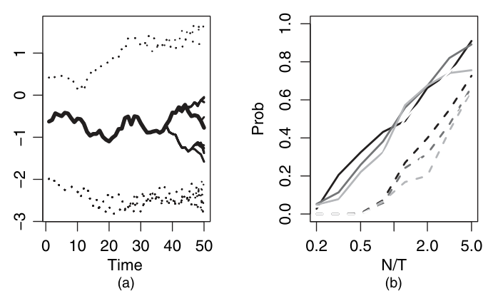

Fig. 8. (a) Example realization of paths of conditional SMC updates (——— [thick full line], conditioned path; ——— [thin full line], paths which coalesce with the conditioned path; · · · · · · ·, independent paths) and (b) probability of sampling an independent path for multinomial (broken curves) and stratified (full curves) sampling, as a function of $N/T$ for various values of $T$ (——— [black full line], – – – [black broken line], $T=50$; ——— [dark grey full line], - - - - [dark grey broken line], $T=200$; ——— [light grey full line], - - - - [light grey broken line], $T=400$)

For this, we would like to minimize the number of times that the particle of the conditioned path is resampled at each iteration. Consider time $n$, and assume that the conditioned path consists of the first particle at both times $n$ and $n+1$ (in the notation of the paper $B_n=1$ and $B_{n+1}=1$). Let $O_n$ be the number of times that the first particle at time $n$ is resampled. Then under the conditional SMC algorithm we are interested in

$$\Pr(O_n=x|A_n^1=1)=\frac{\Pr(O_n=x)\,\Pr(A_n^1=1|O_n=x)}{\Pr(A_n^1=1)}=\frac{\Pr(O_n=x)x/N}{\sum_{x=1}^{N}\Pr(O_n=x)x};$$

thus it is easy to show that $E(O_n|A_n^1=1)=E(O_n)+\mathrm{var}(O_n)/E(O_n)$. Hence we see the importance of choosing a resampling scheme that minimizes the variance of the number of times that each particle is resampled; or of not resampling every time step.

To illustrate this empirically, I considered a simple toy model $X_0\sim\mathcal{N}(0, 100)$,

$$X_n|x_{n-1}=X_{n-1}\sim\begin{cases}\mathcal{N}(x_{n-1},\sigma^2)&\text{with probability }0.99,\\\mathcal{N}(x_{n-1},1)&\text{otherwise,}\end{cases}$$

$$Y_n|X_n=x_n\sim\mathcal{N}(x_n,1).$$

We simulated data for $\sigma=0.1$. Fig. 8(b) shows how the probability of sampling an independent path in the conditional SMC step depends on $T$, $N$ and the type of resampling. Results are given for multinomial resampling and for stratified resampling (Kitagawa, 1996; Carpenter _et al._, 1999), which is known to minimize $\mathrm{var}(O_n)$. We see that stratified sampling requires much smaller values of $N$ to have the same performance as for multinomial sampling. Also, as pointed out in the paper, you want $N$ to increase linearly with $T$ to have a roughly constant performance (this suggests that the central processor unit cost of SMC scales as $O(T^2)$; this sounds competitive with or better than standard MCMC sampling; see Roberts (2009)).

I have two other comments on particle Gibbs sampling. Firstly it seems that how you initialize the conditional SMC update is important. Naive strategies of sampling particles from the prior will lead to many initial particles being sampled in poor areas of the state space. Care needs to be taken even when a better proposal for the initial particles is used, as initially particles in the mode of this proposal will have small weights and resampling may remove many of these particles sampled unless the resampling probabilities are chosen appropriately (Chen _et al._, 2005; Fearnhead, 2008). Also, within particle Gibbs sampling are there extra ways of learning a good proposal for the initial particles: could you learn this from the history of the MCMC run or use the information of the conditioned path?

Secondly, you can use particle Gibbs sampling to update jointly parameters and the states by using a conditional SMC update with particles being both the state of the system and the parameters. Again care

<!-- PDF page 36 -->

needs to be taken in terms of the proposal distribution for the parameters, and how resampling is done. On the above toy example it was possible to use the conditional SMC update to sample jointly new $X_{1:T}$- and $\sigma$-values—with moves where $\sigma$ changed by more than an order of magnitude more than that of a Gibbs sampler which updates $\sigma|X_{1:T}$. For such an implementation, can you use MCMC methods within the conditional SMC update (Fearnhead, 1998, 2002; Gilks and Berzuini, 2001; Storvik, 2002)?

It feels like the theory behind the efficiency of particle Gibbs sampling may be very different from that for the other particle MCMC methods. Whereas the latter seems related to the variance of the SMC estimates of the marginal likelihood, the efficiency of particle Gibbs sampling seems related to rates of coalescences of paths in the conditional SMC update (and reminiscent of Kingman (1982)). Are these related, or is there a fundamental difference between particle Gibbs and other particle MCMC methods?

This has been a fascinating paper, and I look forward to see future developments and application of particle MCMC methods. It gives me great pleasure to propose the vote of thanks.

### Simon Godsill (University of Cambridge)

In seconding the vote of thanks on this paper I congratulate the authors on a fine contribution to Bayesian computational methods. The techniques that they propose allow us to combine, in a principled way, the two most successful tools that we currently have available in this field: the particle filter and the Markov chain Monte Carlo (MCMC) method. Other attempts in this area have focused on incorporating MCMC methods into sequential updating with particle filters. The current contribution, however, introduces the full power of particle filters into batch MCMC schemes. This has been done before, using empirical justifications (see Fernandez-Villaverde and Rubio-Ramirez (2007), which implements precisely the particle marginal Metropolis–Hastings update), but here we have a full theoretical justification for this usage, which will reassure practitioners and should increase the uptake of such methods widely. By adopting a fully principled approach, which identifies an augmented target distribution which is at the heart of the particle marginal Metropolis–Hastings approach, we gain significant extra mileage, notably through the particle Gibbs algorithm, a method that applies Gibbs sampling to the same augmented target distribution. This particle Gibbs algorithm goes significantly beyond what has been applied before and allows inference in intractable models where the only feasible state sampling approach is particle filtering. It should be highlighted, however, that the approach is one of the most computationally demanding methods proposed to date. In its basic form it requires a full particle filtering run for each iteration of the MCMC algorithm, which for a complex model with many static parameters could prove infeasible. The algorithm is also slightly wasteful in that all but one particle and its back-tracking lineage are discarded in each step of the algorithm (even though the discarded samples can be used in the final Monte Carlo estimates, as shown by the authors in Section 4.6). This latter point raises the possibility that one might adapt a parallel chain or population Monte Carlo scheme to the particle MCMC framework, to utilize fully in the MCMC algorithm more than one stream of output from the particle filter.

To conclude, I wonder whether the authors have considered adaptations of their approach which incorporate particle smoothing, both Viterbi style (Godsill _et al._, 2001) and backward sampling (Godsill _et al._, 2004). These could improve the quality of the proposals from the particle filter at relatively small cost (at least in the backward sampling case, which is $O(NT)$ per sample path, as for the basic particle filter). This latter approach typically gives better diversity of backward sample paths than those arising from the standard filter output—hence I wonder also whether we can gain something by including multiple path imputations from the smoother into the particle MCMC approach—see my earlier comment about parallel chain or population MCMC methods.

The vote of thanks was passed by acclamation.

### Nicolas Chopin (Ecole Nationale de la Statistique et de l’Administration Economique, Paris)

Two interesting metrics for the influence of a paper read to the Society are

(a) the number of previous papers that it affects in some way and

(b) the number of interesting theoretical questions that it opens.

In both respects, this paper fares very well.

Regarding (a), in many complicated models the only tractable operations are state filtering and likelihood evaluation; see for example the continuous time model of Chopin and Varini (2007). In such situations, the particle Hastings–Metropolis (PHM) algorithm offers Bayesian estimates ‘for free’, which is very nice.

<!-- PDF page 37 -->

Similarly, Chopin (2007) (see also Fearnhead and Liu (2007)) formulated change-point models as state space models, where the state $x_t=(\theta_t,d_t)$ comprises the current parameter $\theta_t$ and the time since last change $d_t$. Then we may use sequential Monte Carlo (SMC) methods to recover the trajectory $x_{1:T}$, i.e. all the change dates and parameter values. It works well when $x_t$ forgets its past sufficiently quickly, but this forbids hierarchical priors for the durations and the parameters. PHM removes this limitation: Chopin’s (2007) SMC algorithm may be embedded in a PHM algorithm, where each iteration corresponds to different hyperparameters. This comes at a cost, however, as each Markov chain Monte Carlo (MCMC) iteration runs a complete SMC algorithm.

Regarding (b), several questions, which have already been answered in the standard SMC case, may be asked again for particle MCMC methods. Does residual resampling outperform multinomial resampling? Is the algorithm with $N+1$ particles strictly better than that with $N$ particles? What happens about Rao–Blackwellization, or the choice of the proposal distribution? One technical difficulty is that marginalizing out components always reduces the variance in SMC sampling, but not in MCMC sampling. Another difficulty is that particle MCMC methods retains only one particle trajectory $x_{1:T}$; hence the effect of reducing variability between particles is less obvious.

Similarly, obtaining a single trajectory $x_{1:T}$ from a forward filter is certainly much easier than obtaining many of them, but it may still be demanding in some scenarios, i.e. there may be so much degeneracy in $x_1$ that not even one particle contains an $x_1$ in the support of $p(x_1|y_{1:T})$.

### Rong Chen (Rutgers University, Piscataway)

It is a pleasure to congratulate the authors on an impressive, timely and important paper. The problem of parameter estimation for complex dynamic systems by using sequential Monte Carlo methods has been known as a very difficult problem. The authors provide a clean and powerful way to deal with such a problem. The method will certainly become a popular and powerful tool for solving complex problems.

I wish to concentrate my discussion on one aspect—the resampling scheme. The current paper seems to insist on resampling by using the current weights (e.g. assumption 2). We note that the procedure proposed actually works for more flexible resampling schemes. In a way, we can view that a flexible resampling scheme is in effect changing the intermediate distributions. More specifically, in the notation of the paper, a flexible resampling scheme operates as follows. At times $n=2,\ldots,T$, first construct $\boldsymbol{\alpha}_{n-1}=(\alpha(X_{1:n-1}^1),\ldots,\alpha(X_{1:n-1}^k))$. Then

(a) sample $A_{n-1}^k\sim\mathcal{F}(\cdot|\boldsymbol{\alpha}_{n-1})$,

(b) sample $X_n^k\sim M_n(\cdot|X_{n-1}^{A_{n-1}^k})$ and set $X_{1:n}^k:=(X_{1:n-1}^{A_{n-1}^k},X_n^k)$, and

(c) compute and normalize the weights

$$w_n(X_{1:n}^k):=\frac{\gamma_n(X_{1:n}^k)\,W_{n-1}(X_{1:n-1}^{A_{n-1}^k})}{\gamma_{n-1}(X_{1:n-1}^{A_{n-1}^k})\,M_n(X_n^k|X_{1:n-1}^{A_{n-1}^k})\,\alpha_{n-1}(X_{1:n-1}^{A_{n-1}^k})}$$

and

$$W_n^k=w_n(X_{1:n}^k)\bigg/\sum_{m=1}^N w_n(X_{1:n}^m).$$

This is not a new idea. For example, Liu (2001) mentioned the use of $\alpha_{n-1}(X_{1:n-1})=w_{n-1}^{\alpha}(X_{1:n-1})$ for some $\alpha\in(0,1)$ to reduce the sudden impact of large jumps in the system. Shephard (private conversation) suggested the use of an incremental weight spreading technique,

$$\alpha_{n-1}(X_{1:n-1})=\prod_{l=1}^{L}\left\{\frac{\gamma_{n-l}(X_{1:n-l})}{\gamma_{n-l-1}(X_{1:n-l-1})\,M_{n-l}|X_{1:n-l-1}}\right\}^{1/L}.$$

The auxiliary particle filter of Pitt and Shephard (1999) in a way can be thought of as using

$$\alpha_{n-1}(X_{1:n-1})=w_{n-1}(X_{1:n-1})\,\gamma_n(\hat\mu_n|X_{1:n-1})$$

where $\hat\mu_n$ is a prediction of the future state $X_n$. Similarly, we can also use delayed sampling (Chen *et al.*, 2000; Wang *et al.*, 2002) and block sampling (Doucet *et al.*, 2006) ideas to design the resampling schemes, bringing in future information in the resampling scheme. Lin *et al.* (2010) constructed the resampling scores by using backward pilots in generating Monte Carlo samples of diffusion bridges.

The flexible resampling scheme is essentially changing the intermediate distribution $\gamma_{t-1}(\mathbf{x}_t-1)$ (which is defined in Section 4.1) to

<!-- PDF page 38 -->

$$\prod_{i=1}^{n-1}M_i(x_i|x_{1:i-1})\,\alpha_i(x_{1:i-1});$$

hence all the theoretical properties of standard particle filters work. It also works inside the particle Markov chain Monte Carlo algorithm.

### Mark Girolami (University of Glasgow)

This is a potentially very important contribution to Markov chain Monte Carlo (MCMC) methodology. The capabilities of existing MCMC techniques are being severely stretched, because in part of the increasing awareness of the importance of statistical issues surrounding the mathematical modelling of complex stochastic non-linear dynamical systems in areas such as computational finance and biology. The proposed particle Markov chain Monte Carlo (PMCMC) framework of algorithms provides very general and powerful novel methodology which may allow inference to proceed over increasingly complex models in a more efficient manner and as such this is a most welcome addition to the literature.

The use of an approximate posterior to improve proposal efficiency in terms of producing large moves with high probability of acceptance is a strategy that has been demonstrated to great effect in reversible jump MCMC methods where approximate posteriors for model proposals ensure high acceptance of between-model moves (Lopes and West, 2004; Zhong and Girolami, 2009). A similar strategy is to consider a proposal process as the outcome of forward simulation of a stochastic differential equation which has the desired target distribution as its ergodic stationary distribution. Simulating from the stochastic differential equation numerically incurs errors which can then be corrected for, as with PMCMC sampling, by employing the Hastings ratio, e.g. the Metropolis adjusted Langevin algorithm (Roberts and Stramer, 2003). The alternative method is numerically to forward-simulate a deterministic system based on a Hamiltonian and to employ a Metropolis accept–reject step to correct for discrete integration errors, as in the hybrid Monte Carlo methods which have been shown to perform well on high dimensional problems that were similar to those studied in this paper (Neal, 1993; Girolami *et al.*, 2009).

The correctness of the algorithms is established with extensive and detailed proofs; therefore my comments have a practical focus. The strategy that is adopted is to employ an approximate, potentially non-equilibrium sequential Monte Carlo (SMC) procedure to make high dimensional proposals for the Metropolis method. In many ways the issue of designing a proposal mechanism is pushed back to designing importance distributions for the SMC method so that difficulties may yet arise in terms of tuning the SMC parameters to obtain a high rate of acceptance. Sampling from the joint posterior $p(\boldsymbol{\theta},x_{1:T}|y_{1:T})$ within the PMCMC framework may still require the undesirable design of a proposal for the parameters $\boldsymbol{\theta}$ as employed in the particle marginal Metropolis–Hastings sampler although the particle Gibbs sampler employing conditional SMC updates appears a promising though largely untested alternative.

### Nick Whiteley (University of Bristol)

I offer my thanks to the authors for an inspirational paper. Their approach to constructing extended target distributions is powerful and can be exploited further and applied elsewhere. A key ingredient is the elucidation of the probability model underlying a sequential Monte Carlo (SMC) algorithm and the genealogical tree structures that it generates. Two further developments on this theme are described below.

Firstly, at the end of one conditional SMC run in the particle Gibbs algorithm, the authors suggest sampling $K$ from its full conditional under $\tilde\pi^N$, then deterministically tracing back the ancestral lineage of $X_T^K$, to yield

$$X_{1:T}^K:=(X_1^{B_1^K},X_2^{B_2^K},\ldots,X_T^{B_T^K}).\tag{44}$$

There is an alternative. Having sampled $K$, for $n=T-1,\ldots,1$, we could sample from

$$\tilde\pi^N=(b_n^k|\bar{\mathbf{x}}_1,\ldots,\bar{\mathbf{x}}_n,\mathbf{a}_1,\ldots,\mathbf{a}_{n-1},x_{n+1:T}^k,b_{n+1:T}^k,\theta),$$

with $X_{1:T}^K$ defined as before according to expression (44), but with newly sampled ancestor indices.

The advantage of this ‘backward’ sampling is that it enables exploration of all possible ancestral lineages and not only those obtained during the ‘forward’ SMC run. This offers a chance to circumvent the path degeneracy phenomenon and to obtain a faster mixing particle Gibbs kernel, albeit at a slightly increased computational cost.

<!-- PDF page 39 -->

When $p_\theta(x_{1:T},y_{1:T})$ arises from a state space model, it is straightforward to verify that

$$\tilde\pi^N(b_n^k|\bar{\mathbf{x}}_1,\ldots,\bar{\mathbf{x}}_n,\mathbf{a}_1,\ldots,\mathbf{a}_{n-1},x_{n+1:T}^k,b_{n+1:T}^k,\theta)\propto w_n^{b_n^k}\,f(x_{n+1}^{b_{n+1}^k}|x_n^{b_n^k}),$$

which uses the importance weights that are obtained during the forward SMC run. In this case, the above procedure coincides with one draw using the smoothing method of Godsill *et al.* (2004).

Secondly, I believe that the particle Markov chain Monte Carlo framework can be adapted to accommodate the particle filter of Fearnhead and Clifford (2003), which is somewhat different from the SMC algorithm that is considered in the present paper. Owing to constraints on space I provide no specifics here, but I believe that suitable formulation of the probability model underlying the algorithm of Fearnhead and Clifford (2003) allows it to be manipulated as part of a particle Markov chain Monte Carlo algorithm.

### Gareth Roberts (University of Warwick, Coventry)

I add my congratulations to the authors for this path breaking work. In this discussion, I shall expand on comments in the paper linking the methods introduced to a generic framework for Markov chain Monte Carlo (MCMC) methods which can be applied to missing data problems and other situations where the target density is unavailable but can be estimated unbiasedly by using an auxiliary variable construction. This work can be found in Andrieu and Roberts (2009), generalizing an idea that was introduced in Beaumont (2003).

For MCMC sampling, enlargement of state spaces comes at a price. Consider, for instance an ‘optimized’ Metropolis–Hastings algorithm on $\pi(\theta,z)$. Typically this converges slower than its rival counterpart on the marginalized distribution $\pi(\theta)$. This suggests that we might mimic the marginalized algorithm through Monte Carlo sampling. Here I shall describe the simplest version of the *pseudomarginal* approach.

Choose $\mathbf{Z}\in\mathbf{R}^N\sim^{\mathrm{IID}}q_\theta$, and set

$$\tilde\pi^N(\theta)=\frac{1}{N}\sum_{i=1}^{N}\frac{\pi(\theta,Z_i)}{q_\theta(Z_i)}.$$

Consider two options for using $\tilde\pi^N$ within an MCMC framework: *Monte Carlo within Metropolis* and *generalized importance Metropolis–Hastings*.

[Table (unnumbered; Roberts, PDF page 39)](s001-andrieu-pmcmc-2010/table-d-p0039.csv)

The Monte Carlo within Metropolis approach biases the MCMC algorithm so that the marginal stationary distribution of $\theta$ under the scheme is typically not $\pi$ (if it exists at all). However, the generalized importance Metropolis–Hastings approach has the following invariant distribution:

$$\frac{1}{N}\sum_{k=1}^{N}\pi\{\theta,z(k)\}\prod_{l=1;l\neq k}^{N}q_\theta\{z(l)\}.$$

The $\theta$-marginal of this chain is $\pi(\theta)$.

Thus there is no Monte Carlo *bias* in generalized importance Metropolis–Hastings sampling (though of course there is still Monte Carlo error) and, under weak regularity conditions, as $N\to\infty$ the algorithm ‘converges’ to the true marginal algorithm.

Drawing $\mathbf{Z}$ as an independent and identically distributed sample can be significantly improved on, e.g. by letting $\mathbf{Z}$ denote a sample path of a Markov chain with invariant distribution $\pi(z|\theta)$ (or even a particle approximation as in the present paper).

Andrieu and Roberts (2009) applies this idea in simple examples and explores some of the theoretical properties of the method. One important and promising application of the idea involves a substantial

<!-- PDF page 40 -->

generalization of reversible jump MCMC sampling which improves the potentially problematic step of choosing appropriate between-dimension moves.

In modified form, this construction is also an ‘exact’ and efficient computational solution to doubly intractable problems (see Andrieu *et al.* (2008)),

$$f_\theta(x)=\frac{h(\theta,x)}{K(\theta)},$$

for unknown $K(\cdot)$ as well as $\theta$.

### Miguel A. G. Belmonte (University of Warwick, Coventry) and Omiros Papaspiliopoulos (Universitat Pompeu Fabra, Barcelona)

We congratulate the authors for a remarkable paper, which addresses a problem of fundamental practical importance: parameter estimation in state space models by using sequential Monte Carlo (SMC) algorithms. In Belmonte *et al.* (2008) we fit duration state space models to high frequency transaction data and we require a computational methodology that can handle efficiently time series of length $T=\mathcal{O}(10^4$–$10^5)$. We have experimented with particle Markov chain Monte Carlo (PMCMC) methods and with the smooth particle filter (SPF) of Pitt (2002). The latter is also based on the use of SMC algorithms to derive maximum likelihood parameter estimates; it is, however, limited to scalar signals. Therefore, in the context of duration modelling this limitation rules out multifactor or multi-dimensional models, and we believe that PMCMC methods can be very useful in such cases.

Table 1. Comparison of estimates by the SPF, PMMH and PG methods against the KF for various $T$†

[Table 1 (discussion: Belmonte and Papaspiliopoulos)](s001-andrieu-pmcmc-2010/table-d1-p0040.csv)

†The particle algorithms set $N=500$, with $\sigma_\varepsilon^2=0.20$. Exact estimates are reported for the KF. For the particle methods we compute the relative error $(\hat\mu-\hat\mu_{\mathrm{KF}})/\hat\mu_{\mathrm{KF}}$, log-likelihood difference $l(\hat\mu)-l(\hat\mu_{\mathrm{KF}})$ and the ratio of variance $\hat{\mathbb{V}}(\hat\mu)/\hat{\mathbb{V}}(\hat\mu_{\mathrm{KF}})$. $l(\cdot)$ denotes the exact KF log-likelihood. Efficiency for the PMMH and PG methods is measured by the following approximation to the integrated auto-correlation time $1/(1-\hat\rho)$, where $\hat\rho$ is the MCMC sample correlation at lag 1.

In this contribution we present a preliminary simulation study which contrasts particle marginal Metropolis–Hastings (PMMH), particle Gibbs (PG) and the SPF methods on simulated data from a linear single-factor state space model:

<!-- PDF page 41 -->

$$\begin{aligned}X_t&=\mu(1-\phi)+\phi X_{t-1}+\sigma_\eta\eta_t&\qquad&\eta_t,\sim\mathcal{NID}(0,1),\\Y_t&=X_t+\sigma_\varepsilon\varepsilon_t,&\qquad&\varepsilon_t\sim\mathcal{NID}(0,1),\quad t=1,\ldots,T.\end{aligned}\tag{45}$$

Parameter values are set to $\mu=0.75$, $\phi=0.95$ and $\sigma_\eta^2+\sigma_\varepsilon^2=0.35$ and various values for $T$ and the signal-to-noise ratio $\sigma_\varepsilon^2/(\sigma_\varepsilon^2+\sigma_\eta^2)$ are tried. When Bayesian inference with PMCMC sampling is made for $\mu$, an improper flat prior is used. We adopt a pragmatic point of view according to which the practitioner, especially for a small number of parameters, is invariant to maximum likelihood or Bayesian inference but is mostly worried about the comptutational efficiency of the methods. Our simulation and prior specification set-up is such that the posterior mean and precision estimates coincide with the maximum likelihood and observed information estimates respectively, and the exact values are available by using the Kalman filter (KF). The bootstrap filter is used in all the SMC algorithms.

For various values of $T$, Table 1 shows a comparison of parameter estimates by the particle methods and KF. In this problem the SPF and PG methods show remarkable robustness to the length of the series in terms of the accuracy of the estimates. The mixing time of the latter does not show deterioration with $T$ (note that the mixing time of the limiting algorithm with $T=\infty$ does not arbitrarily deteriorate with $T$ either; see Papaspiliopoulos *et al.* (2003) for details). We also varied the signal-to-noise ratio and report our findings in Table 2.

Table 2. Comparison of estimates by the SPF, PMMH and PG methods against the KF for combinations of signal-to-noise ratio†

[Table 2 (discussion: Belmonte and Papaspiliopoulos)](s001-andrieu-pmcmc-2010/table-d2-p0041.csv)

†The total variance $\sigma_\varepsilon^2+\sigma_\eta^2$ is fixed at 0.35. The larger the ratio the larger the observation variance is. $T=1000$ observations and $N=1000$ particles. The non-centred PG algorithm subtracts proposed $\mu$ from the trajectory drawn from the smoothing density $p(x_{0:T}|\mu,y_{0:T})$.

We also consider two different parameterizations under which we applied PG sampling: the so-called centred $(X_1,\ldots,X_T,\theta)$ and non-centred $(X_1-\theta,\ldots,X_T-\theta,\theta)$; see Papaspiliopoulos *et al.* (2003). When

<!-- PDF page 42 -->

the state has so high persistence it is known (Papaspiliopoulos *et al.*, 2003) that the centred Gibbs sampler (for $T=\infty$) has better mixing. The robustness of PG sampling is again very promising. Note that the SPF and PMMH methods have worse performance for small values of the ratio, which is due to the deterioration of the bootstrap filter with decreasing observation error. This deterioration appears to have no effect on PG sampling in this simple setting.

### Krzysztof Łatuszyński (University of Toronto) and Omiros Papaspiliopoulos (Universitat Pompeu Fabra, Barcelona)

We congraulate the authors for a beautiful paper. A fundamental idea is the interplay between unbiased estimation (by means of importance sampling in this paper) and exact simulation. We show how unbiased estimation relates to exact simulation of events of unknown probability $s\in[0,1]$. Details, proofs and an application to the celebrated Bernoulli factory problem (Nacu and Peres, 2005) can be found in Łatuszński *et al.* (2009).

We wish to simulate the binary random variable $C_s$ such that $P[C_s=1]=s$. If $\hat S$ is a realizable unbiased estimator of $s$ taking values in $[0,1]$, we use the following algorithm 1.

*Step 1*: simulate $G_0\sim U(0,1)$.

*Step 2*: obtain $\hat S$.

*Step 3*: if $G_0\leqslant\hat S$ set $C_s:=1$; otherwise set $C_s:=0$.

*Step 4*: output $C_s$.

If $l_1,l_2,\ldots$ and $u_1,u_2,\ldots$ are sequences of lower and upper bounds converging monotonically to $s$ then we can resort to the following algorithm 2.

*Step 1*: simulate $G_0\sim U(0,1)$; set $n=1$.

*Step 2*: compute $l_n$ and $u_n$.

*Step 3*: if $G_0\leqslant l_n$ set $C_s:=1$.

*Step 4*: if $G_0>u_n$ set $C_s:=0$.

*Step 5*: if $l_n<G_0\leqslant u_n$ set $n:=n+1$ and go to step 2.

*Step 6*: output $C_s$.

We can combine these ideas to have unbiased estimators $L_n$ and $U_n$ of $l_n$ and $u_n$. The estimators live on the same probability space and have the following properties:

$$\mathbb{P}(L_n\leqslant U_n)=1\qquad\text{for every }n=1,2,\ldots;\tag{46}$$

$$\mathbb{P}(L_n\in[0,1]=1\quad\text{and}\quad\mathbb{P}(U_n\in[0,1])=1\qquad\text{for every }n=1,2,\ldots;\tag{47}$$

$$\mathbb{E}(L_n)=l_n\nearrow s\quad\text{and}\quad\mathbb{E}(U_n)=u_n\searrow s;\tag{48}$$

$$\mathbb{P}(L_{n-1}\leqslant L_n)=1\quad\text{and}\quad\mathbb{P}(U_{n-1}\geqslant U_n)=1.\tag{49}$$

Let

$$\begin{aligned}\mathcal{F}_0&=\{\emptyset,\Omega\},\\\mathcal{F}_n&=\sigma\{L_n,U_n\},\\\mathcal{F}_{k,n}&=\sigma\{\mathcal{F}_k,\mathcal{F}_{k+1},\ldots,\mathcal{F}_n\}\qquad k\leqslant n.\end{aligned}$$

Under these assumptions we can use the following algorithm 3.

*Step 1*: simulate $G_0\sim U(0,1)$; set $n=1$.

*Step 2*: obtain $L_n$ and $U_n$ given $\mathcal{F}_{0,n-1}$.

*Step 3*: if $G_0\leqslant L_n$ set $C_s:=1$.

*Step 4*: if $G_0>U_n$ set $C_s:=0$.

*Step 5*: if $L_n<G_0\leqslant U_n$ set $n:=n+1$ and go to step 2.

*Step 6*: output $C_s$.

The final step is to weaken condition (49) and to let $L_n$ be a reverse time supermartingale and $U_n$ a reverse time submartingale with respect to $\mathcal{F}_{n,\infty}$. Precisely, assume that for every $n=1,2,\ldots$ we have

$$\mathbb{E}(L_{n-1}|\mathcal{F}_{n,\infty})=\mathbb{E}(L_{n-1}|\mathcal{F}_n)\leqslant L_n\qquad\text{almost surely},\tag{50}$$

$$\mathbb{E}(U_{n-1}|\mathcal{F}_{n,\infty})=\mathbb{E}(U_{n-1}|\mathcal{F}_n)\geqslant U_n\qquad\text{almost surely}.\tag{51}$$

<!-- PDF page 43 -->

Consider the following algorithm 4, which uses auxiliary random sequences $\tilde L_n$ and $\tilde U_n$ constructed on line.

*Step 1*: simulate $G_0\sim U(0,1)$; set $n=1$; set $L_0\equiv\tilde L_0\equiv 0$ and $U_0\equiv\tilde U_0\equiv 1$.

*Step 2*: obtain $L_n$ and $U_n$ given $\mathcal{F}_{0,n-1}$.

*Step 3*: compute $L_n^*=\mathbb{E}(L_{n-1}|\mathcal{F}_n)$ and $U_n^*=\mathbb{E}(U_{n-1}|\mathcal{F}_n)$.

*Step 4*: compute

$$\tilde L_n=\tilde L_{n-1}+\frac{L_n-L_n^*}{U_n^*-L_n^*}(\tilde U_{n-1}-\tilde L_{n-1}),\tag{52}$$

$$\tilde U_n=\tilde U_{n-1}-\frac{U_n^*-U_n}{U_n^*-L_n^*}(U_{n-1}-\tilde L_{n-1}).\tag{53}$$

*Step 5*: if $G_0\leqslant\tilde L_n$ set $C_s:=1$.

*Step 6*: if $G_0>\tilde U_n$ set $C_s:=0$.

*Step 7*: if $\tilde L_n<G_0\leqslant\tilde U_n$ set $n:=n+1$ and go to step 2.

*Step 8*: output $C_s$.

### Thomas Flury and Neil Shephard (University of Oxford)

We congratulate Christophe Andrieu, Arnaud Doucet and Roman Holenstein for this important contribution to the sequential Monte Carlo and Markov chain Monte Carlo (MCMC) literature. At the base of their paper is the deceivingly simple looking idea of combining two powerful and well-known Monte Carlo algorithms to create a truly Herculean tool for statisticians. They use sequential Monte Carlo methods to generate high dimensional proposal distributions for MCMC algorithms.

We focus our discussion on one very specific insight: one can use an unbiased simulation-based estimator of the likelihood inside an MCMC algorithm to perform Bayesian inference. For dynamic models this estimator is obtained from a standard particle filter. Importantly, this means that the particle filter now offers a complete extension of the Kalman filter: it can carry out filtering and now direct parameter estimation.

We are particularly impressed with the minimalistic assumptions that we need to perform likelihood-based inference in dynamic non-linear and non-Gaussian state space models, which is of great interest for microeconometrics, macroeconometrics and financial econometrics. In the particle marginal Metropolis–Hastings algorithm we only need to be able to evaluate the measurement density and to sample from the state transition density. Another advantage is that we do not need an infinite number of simulation draws for consistency: all theoretical results hold from as little as $N\geqslant 1$ particles. Practical implementation is also very easy as one only needs to change very few lines of code to estimate a different model.

In Flury and Shephard (2010) we showed the power of this method on four famous examples in econometrics. Other applications, such as in repeated auctions, will also become important. Our experience is that these methods work, are quite simple to implement, general purpose and highly computationally demanding. The last point is important; they take so long to run that it is tempting to use the phrase ‘computationally brutal’.

### Christian P. Robert and Pierre Jacob (Centre de Recherche en Economie et Statistique and Université Paris Dauphine, Paris), Nicolas Chopin (Ecole Nationale de la Statistique et de l’Administration Economique, Paris) and Håvard Rue (Norwegian University for Science and Technology, Trondheim)

We congratulate the authors for opening a new vista for running Markov chain Monte Carlo (MCMC) algorithms in state space models. Being able to devise a correct Markovian scheme based on a particle approximation of the target distribution is a genuine *tour de force* that deserves enthusiastic recognition! This is all the more impressive when considering that the ratio

$$\hat p_\theta(x_{1:T}^*|y_{1:T})/\hat p_\theta\{x_{1:T}(i-1)|y_{1:T}\}\tag{54}$$

is not unbiased and thus invalidates the usual importance sampling solutions, as demonstrated by Beaumont *et al.* (2009). Thus, the resolution of simulating by conditioning on the lineage truly is an awesome resolution of the problem!

We implemented the particle Hastings–Metropolis algorithm for the (notoriously challenging) stochastic volatility model

$$y_t|x_t\sim\mathcal{N}\{0,\exp(xt)\},\qquad x_t=\mu+\rho(x_{t-1}-\mu)+\sigma\varepsilon_t,$$

based on 500 simulated observations. With parameter moves

<!-- PDF page 44 -->

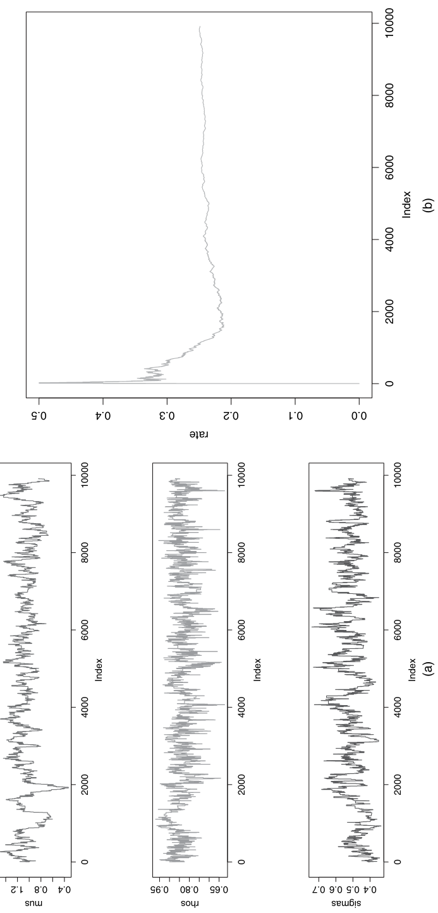

Fig. 9. Evolution of (a) the parameter simulations for $\mu$, $\rho$ and $\sigma$, plotted against iteration indices, and (b) the estimated acceptance rate of the particle MCMC algorithm, with obtained $N=10^2$ particles and $10^4$ Metropolis–Hastings iterations and a simulated sequence of 500 observations with true values $\mu_0=1$, $\rho_0=0.9$ and $\sigma_0=0.5$

<!-- PDF page 45 -->

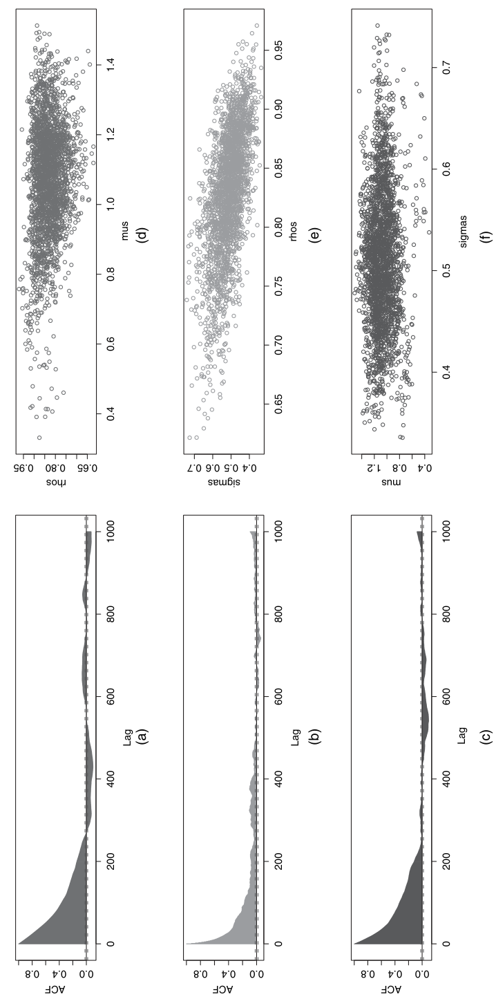

Fig. 10. (a)–(c) Auto-correlation and (d)–(f) corresponding pairwise graphs for the $\mu$-, $\rho$- and $\sigma$-sequences for the same target as in Fig. 9

<!-- PDF page 46 -->

$$\begin{aligned}\mu^*&\sim\mathcal{N}(\mu,20^{-2}),\\\rho^*&\sim\mathcal{N}(\rho,20^{-2}),\\\log(\sigma^*)&\sim\mathcal{N}\{\log(\sigma),20^{-2}\},\end{aligned}$$

and state space moves derived from the auto-regressive AR(l) prior, we obtained good mixing properties with no calibration effort, using $N=10^2$ particles and $10^4$ Metropolis–Hastings iterations, as demonstrated by Figs 9 and 10. Other runs (which are not reproduced here) exhibited multimodal configurations that the particle MCMC algorithm managed to handle satisfactorily within $10^4$ iterations.

Our computer program (which is available at `http://code.google.com/p/py-pmmh/`) may be adapted to any state space model by simply rewriting two lines of codes, which

(a) computes $p(y_t|x_t)$ and

(b) simulates $x_{t+1}|x_t$.

Contemplating a different model does not even require the calculation of full conditionals, in contrast with Gibbs sampling. Another advantage of the particle Hastings–Metropolis algorithm is that it is trivial to parallelize. (Adding a comment before the loop over the particle index is enough, by using the OpenMP technology.)

Finally, we mention possible options for a better recycling of the numerous simulations that are produced by the algorithm. This dimension of the algorithm deserves deeper study, maybe to the extent of allowing for a finite time horizon overcoming the MCMC nature of the algorithm, as in the particle Monte Carlo solution of Cappé *et al.* (2008).

A more straightforward remark is that, owing to the additional noise that is brought by the resampling mechanism, more stable recycling would be produced both in the individual weights $w_n(X_{1:n})$ by Rao–Blackwellization of the denominator in equation (7) as in Iacobucci *et al.* (2009) and over past iterations by a complete reweighting scheme like AMIS (Cornuet *et al.*, 2009). Another obvious question is whether or not the exploitation of the wealth of information that is provided by the population simulations is manageable via adaptive MCMC methods (Andrieu and Robert, 2001; Roberts and Rosenthal, 2009).

Finally, since

$$\hat p_\theta(y_{1:T})=\hat p_\theta(y_1)\prod_{n=2}^{T}\hat p_\theta(y_n|y_{1:n-1})$$

is an unbiased estimator of $p_\theta(y_{1:T})$, there must be direct implications of the method towards deriving better model choice strategies in such models, as exemplified in the population Monte Carlo method of Kilbinger *et al.* (2009) in a cosmology setting.

The following contributions were received in writing after the meeting.

### Anindya Bhadra (University of Michigan, Ann Arbor)

The authors present an elegant theory for novel methodology which makes Bayesian inference practical on implicit models. I shall use their example, a sophisticated financial model involving a continuous time stochastic volatility process driven by Lévy noise, to compare their methodology with a state of the art non-Bayesian approach. I applied iterated filtering (Ionides *et al.*, 2006, 2010) implemented via the `mif` function in the R package `pomp` (King *et al.*, 2008).

Fig. 11 shows some results from applying the iterated filtering algorithm with 1000 particles to the simulation study that is described by the authors in Section 3.2. If $\theta$ denotes the parameter vector of interest, the algorithm generates a sequence of parameter estimates $\hat\theta_1,\hat\theta_2,\ldots$ converging to the maximum likelihood estimate $\hat\theta$. As a diagnostic, the log-likelihood of $\hat\theta_i$ is plotted against $i$ (Fig. 11(a)). We see that the sequence of log-likelihoods rapidly converges. On simulation studies like this, a quick check for successful maximization is to observe that the maximized log-likelihood typically exceeds the log-likelihood at the true parameter value by approximately half the number of estimated parameters (Fig. 11(a)). We can also check for successful local maximization by sliced likelihood plots (Figs 11(b)–11(e)), in which the likelihood surface is explored along one of the parameters, keeping the other parameters fixed at the estimated local maximum. The likelihood surface is seen to be flat as $\lambda$ varies, which is consistent with the authors’ observation that parameter combinations are weakly identified in this model. A profile likelihood analysis could aid the investigation of the identifiability issue. Owing to the quick convergence of iterated filtering with a relatively small number of particles, many profile likelihood plots can be generated at the computational expense of, say, one Markov chain Monte Carlo run of length 50000.

<!-- PDF page 47 -->

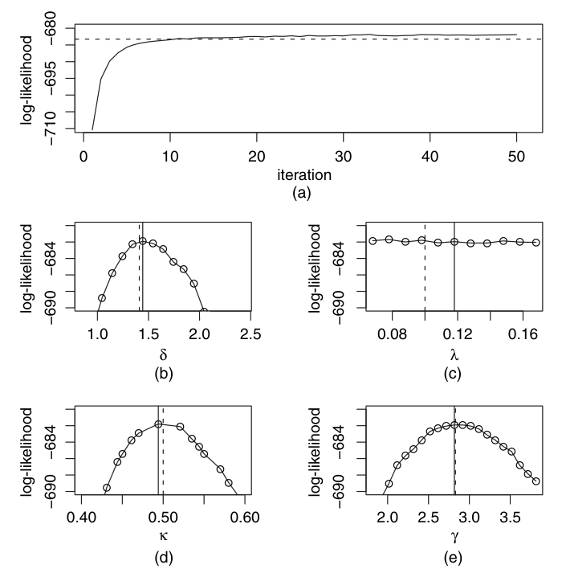

Fig. 11. Diagnostic plots for iterated filtering: (a) likelihood at each iteration, evaluated by sequential Monte Carlo sampling (- - - - - - -, likelihood at the truth); (b)–(e) likelihood surface for each parameter sliced through the maximum (○, parameter values, where the likelihoods were evaluated; |, maximum likelihood estimate; ¦, true parameter value)

The decision about whether one wishes to carry out a Bayesian analysis should depend on whether one wishes to impose a prior distribution on unknown parameters. Here, I have shown that likelihood-based non-Bayesian methodology provides a computationally viable alternative to the authors’ Bayesian approach for complex dynamic models.

### Luke Bornn and Aline Tabet (University of British Columbia, Vancouver)

We congratulate the authors on this very important contribution to stochastic computation in statistics. Whereas the authors have explored and discussed several applications in the paper, we would like to highlight the benefits of using particle Markov chain Monte Carlo (PMCMC) methods as a way to extend sequential Monte Carlo (SMC) methods which employ sequences of distributions of static dimension. Through PMCMC sampling, we can separate the variables of interest into those which may be easily sampled by using traditional MCMC techniques and those which require a more specialized SMC approach. Consider for instance the use of simulated annealing in an SMC framework (Neal, 2001; Del Moral *et al.*, 2006). Rather than finding the posterior maximum *a posteriori* estimate of all parameters, PMCMC sampling now allows practitioners to combine annealing with traditional MCMC methods to maximize over some dimensions simultaneously while exploring the full posterior in others.

When variables are highly correlated, SMC methods may be used as an efficient alternative to MCMC sampling. For instance, SMC samplers (Del Moral *et al.*, 2006) and other population-based methods (Jasra *et al.*, 2007) proceed by working through a sequence of auxiliary distributions until a particle-based approximation to the posterior is reached. In non-identifiable or weakly identifiable models, SMC sampling is used to construct a sequence of tempered distributions allowing particles to explore fully the resulting ridges in the posterior surface of the non-identifiable variables. However, because SMC algorithms often rely on importance sampling, they can suffer in high dimensions owing to increased variability in the importance weights. Many non-identifiable models contain only a small portion of variables with identifiability issues,

<!-- PDF page 48 -->

and hence it may be adding unnecessary complication to build the tempered distributions in all dimensions. In this case, PMCMC sampling gives the option to explore some parameters by using MCMC sampling while exploring others (such as those which are highly correlated or non-identifiable) with SMC sampling, and hence limit variance in the SMC importance weights. There are several options for performing this in the PMCMC framework: both the particle Gibbs and the particle Metropolis–Hastings variants could be used; the choice largely depends on the correlation between the identifiable and non-identifiable subsets of variables. In conclusion, we feel that, as much as PMCMC sampling provides Monte Carlo solutions to a unique class of problems, it also provides a flexible framework allowing practitioners to mix and match Monte Carlo strategies to suit their particular application.

### Olivier Cappé (Telecom ParisTech and Centre National de la Recherche Scientifique, Paris)

I congratulate the authors for this impressive piece of work which, I believe, is a very significant contribution to the toolbox of Markov chain Monte Carlo and sequential Monte Carlo (SMC) methods.

For brevity, I focus on the particle independent Metropolis–Hastings (PIMH) algorithm which is the basic building block for the other samplers that are presented in the paper. Although theorem 2 also covers the more involved case of SMC sampling, the core idea is the auxiliary construction which shows that a proper Markov chain Monte Carlo algorithm may be obtained from sampling–importance resampling (Rubin, 1987), irrespectively of the number $N$ of particles. This idea, however, does seem to be quite different both from the multiple-try (Liu *et al.*, 2000) and the pseudomarginal (Beaumont, 2003) approaches and I encourage the authors to discuss in more detail its connections, if any, with earlier ideas in the literature.

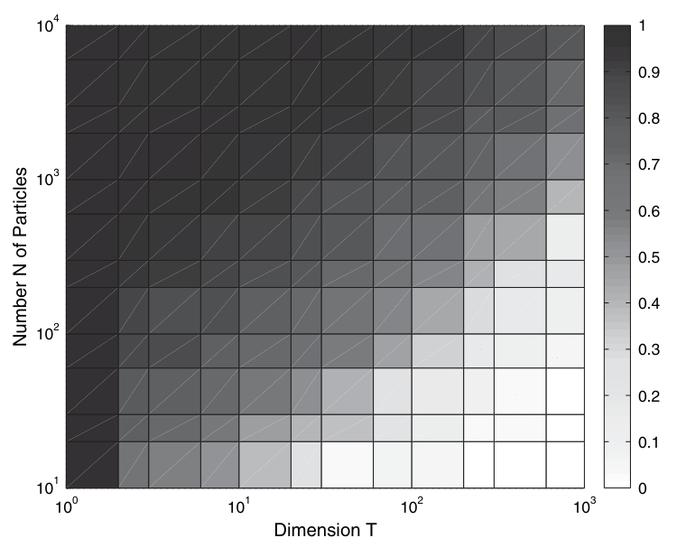

Fig. 12. PIMH acceptance rate as a function of the dimension $T$ of the target and the number $N$ of particles: the target probability density function is $\pi_T(x_1,\ldots,x_T)=\Pi_{t=1}^{T}\,\pi(x_t)$, where $\pi$ is the normal probability density function truncated to the range $[-4, 4]$; the SMC proposal ‘kernel’ $q$ is an independent proposal, uniformly distributed in the range $[-4, 4]$; to assess the difficulty of the simulation task, note that for direct self-normalized importance sampling targeting $\pi_T$ the effective sample size statistic (Kong *et al.*, 1994), normalized by $N$, tends to $2.26^{-T}$ ($2.26=\int_{-4}^{4} 8\,\pi^2(x)\,\mathrm{d}x$) as $N$ increases, which is about $10^{-6}$ for $T=17$

Fig. 3 (in Section 3.1) is very promising as it suggests that the approach is practicable in large dimensional settings for which a ‘causal’ factorization of the likelihood is available. In particular, I wonder whether it is possible to predict the relationship between the dimension $T$ and the number $N$ of particles that is implicit in Fig. 3. In an attempt to answer this question, I conducted a toy numerical experiment in the spirit of the scaling construction (Roberts and Rosenthal, 2001), where the target $\pi_T$ is a product probability density function and SMC sampling is also carried out by using successive independent proposals—clearly, the

<!-- PDF page 49 -->

latter situation is very specific, although it satisfies assumptions 1–4 that were made in the paper. In this example, any method based on direct importance sampling, including the PIMH algorithm using an SMC algorithm without resampling (i.e. sequential importance sampling), is bound to fail for all feasible values of $N$ when $T$ is larger than, say, 17 (see the caption of Fig. 12). In contrast, Fig. 12 shows that the PIMH algorithm using an embedded SMC algorithm with resampling at each step (as described in Section 2.2.1) can cope with dimensions as large as $T=10^3$. In addition, Fig. 12 also suggests that increasing $N$ as $O(T)$ is sufficient to stabilize the acceptance rate. I would be happy to hear the authors’ comments on whether the behaviour of PIMH sampling in this simple scenario can be inferred from known results about SMC methods regarding the rate of convergence of $\hat{Z}^N/Z$ as $N$ increases.

### J. Cornebise (Statistical and Applied Mathematical Sciences Institute, Durham) and G. W. Peters (University of New South Wales, Sydney)

Our comments on adaptive sequential Monte Carlo (SMC) methods relate to particle Metropolis–Hastings (PMH) sampling, which has acceptance probability given in equation (13) of the paper for proposed state $(\theta^*, X^*_{1:T})$, relying on the estimate

$$\hat{p}_{\theta^*}(y_{1:T})=\prod_{n=1}^{T}\frac{1}{N}\sum_{k=1}^{N} w_n(x_{1:n}^{*,k}).$$

Although a small $N$ suffices to approximate the mode of a joint path space distribution, producing a reasonable proposal for $x_{1:T}$, it results in high variance estimates of $\hat{p}_{\theta^*}(y_{1:T})$. We study the population dynamics example from Hayes *et al.* (2010), model 3 excerpt, involving a log-transformed $\theta$-logistic state space model; see Wang (2007), equations 3(a) and 3(b), for parameter settings and Figs 13–15 for an illustration of the algorithm’s behaviour. Particle Markov chain Monte Carlo (PMCMC) performance depends on the trade-off between degeneracy of the filter, $N$, and design of the SMC mutation kernel. Regarding the latter, we note the following.

(a) A Rao–Blackwellized filter (Doucet *et al.*, 2000) can improve acceptance rates; see Nevat *et al.* (2010).

(b) Adaptive mutation kernels, which in PMCMC methods can be considered as adaptive SMC proposals, can reduce degeneracy on the path space, allowing for higher dimensional state vectors $x_n$.

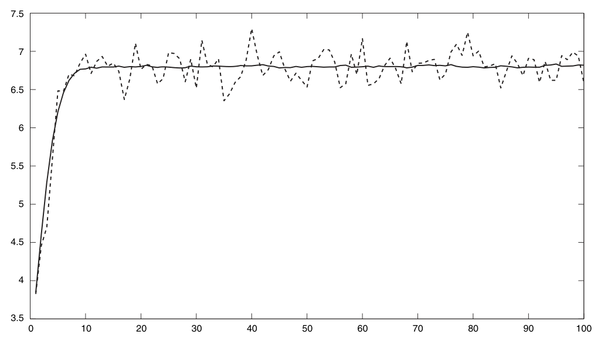

Fig. 13. Sequence of simulated states and observations for the population dynamic log-transformed $\theta$-logistic model from Wang (2007), with static parameter $\theta=(r,\zeta,K)$ under constraints $K>0$, $r<2.69$ and $\zeta\in\mathbb{R}$ (the state transition is $f_\theta(x_n|x_{n-1})=\mathcal{N}(x_n;\,x_{n-1}+r[1-\{\exp(x_{t-1})/K\}^{\zeta}],\,0.01)$, and the local likelihood is $g_\theta(y_n|x_n)=\mathcal{N}(y_n;\,x_n,\,0.04)$, for $T=100$ time steps): ———, generated latent state realizations; - - - - - - -, generated observations

<!-- PDF page 50 -->

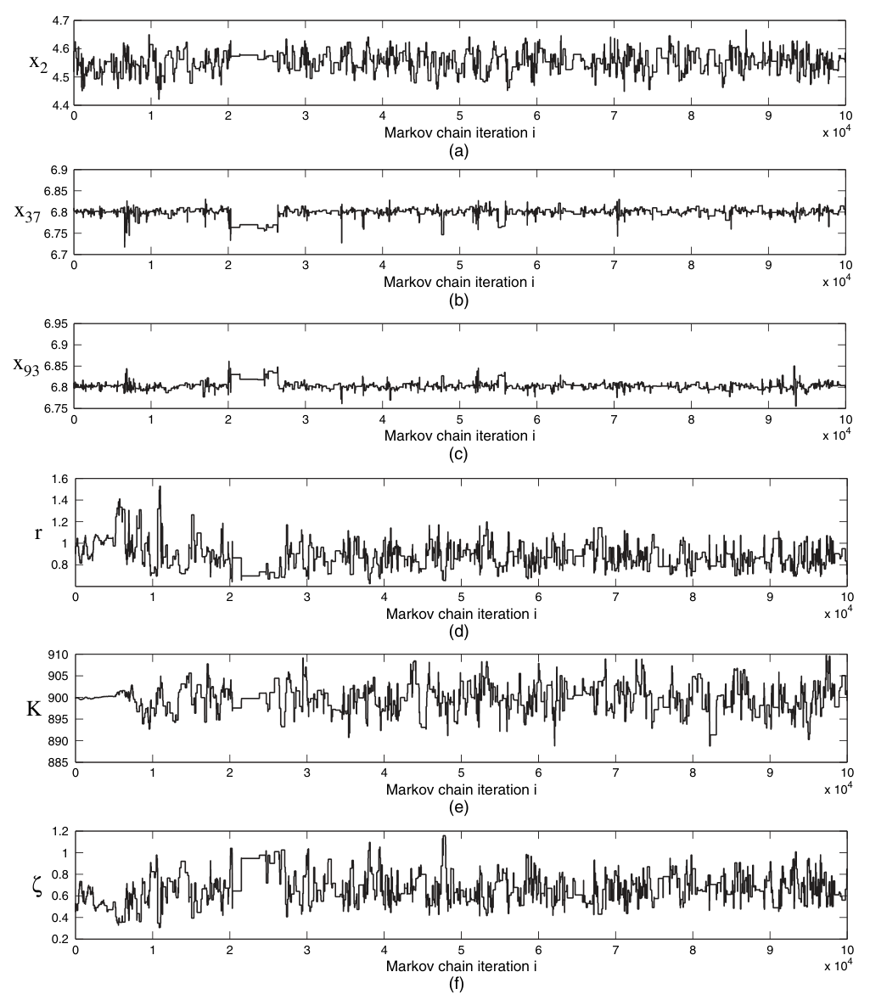

Fig. 14. Path of three sampled latent states (a) $x_2$, (b) $x_{37}$ and (c) $x_{93}$, and of the sampled parameters (d) $r$, (e) $K$ and (f) $\zeta$, over 100000 PMH iterations based on $N=200$ particles by using a simple sampling–importance resampling filter—the one-dimensional state did not call for Rao–Blackwellization: note also the effect of the adaptive MCMC proposal for $\theta=(r,\zeta,K)$, set up to start at iteration 5000, which is particularly visible on the mixing of parameters $K$; the most noticeable property of the algorithm is the remarkable mixing of the chain, in spite of the high total dimension of the sampled state; each iteration involves a proposal of $(X_{1:T},\theta)$ of dimension 103

<!-- PDF page 51 -->

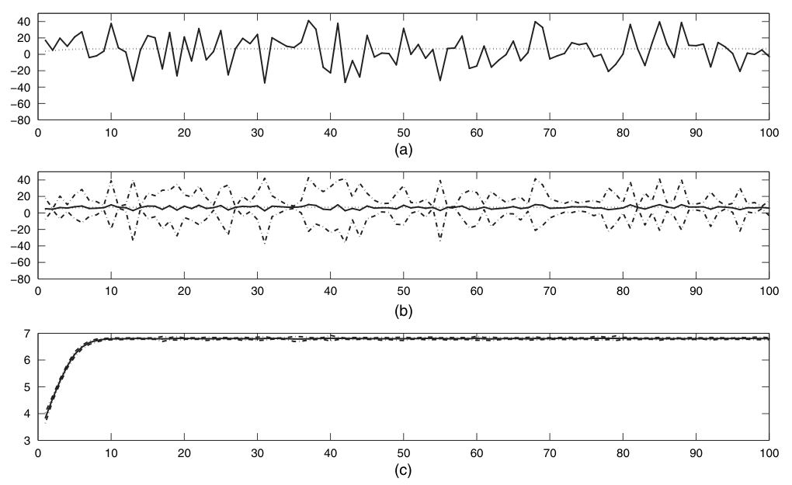

Fig. 15. Convergence of the distribution of the path of latent states $x_{1:T}$ (note the change in vertical scale; initializing PMH sampling on a very unlikely initial path does not prevent the minimum mean-square error estimate of the latent states from converging; as few as 10 PMH iterations already begin to concentrate the sampled paths around the true path (· · · · · · ·), which is assumed here to be close to the mode of the posterior distribution thanks to the small observation noise, with very satisfactory results after 20000 iterations): (a) initialized PMH state for $x_{1:T}$ (———); (b) average posterior mean path estimate for $X_{1:T}$ (———), PMH Markov chain iteration $i=10$ and $N=200$ particles; (c) average posterior mean path estimate for $X_{1:T}$, PMH Markov chain iteration $i=20000$ and $N=200$ particles

Adaption can be local (within filter) or global (sampled Markov chain history). Though currently particularly designed for approximate Bayesian computation methods, the work of Peters *et al.* (2010) incorporates into the mutation kernel of SMC samplers (Del Moral *et al.*, 2006) the partial rejection control (PRC) mechanism of Liu (2001), which is also beneficial for PMCMC sampling. PRC adaption reduces degeneracy by rejecting a particle mutation when its incremental importance weight is below a threshold $c_n$. The PRC mutation kernel

$$q_\theta^*(x_n|y_n,x_{n-1})=r(c_n,x_{n-1})^{-1}\min\left\{1,\,W_{n-1}(x_{n-1})\frac{w_n(x_{n-1},x_n)}{c_n}\right\}q_\theta(x_n|y_n,x_{n-1})$$

can also be used in PMH algorithms, where $q_\theta(x_n|y_n,x_{n-1})$ is the standard SMC proposal, and

$$r(c_n,x_{n-1})=\int\min\left\{1,\,W_{n-1}(x_{n-1})\frac{w_n(x_{n-1},x_n)}{c_n}\right\}q_\theta(x_n|y_n,x_{n-1})\,\mathrm{d}x_n.$$

As presented in Peters *et al.* (2010), algorithmic choices for $q_\theta^*(x_n|y_n,x_{n-1})$ can avoid evaluation of $r(c_n,x_{n-1})$. Cornebise (2010) extends this work, developing PRC for auxiliary SMC samplers, which are also useful in PMH algorithms. Threshold $c_n$ can be set adaptively: locally either at each SMC mutation or Markov chain iteration, or globally based on chain acceptance rates. Additionally, $c_n$ can be set adaptively via quantile estimates of pre-PRC incremental weights; see Peters *et al.* (2010).

Cornebise *et al.* (2008) stated that adaptive SMC proposals can be designed by minimizing function-free risk theoretic criteria such as Kullback–Leibler divergence between a joint proposal in a parametric family and a joint target. Cornebise (2009), chapter 5, and Cornebise *et al.* (2010) use a mixture of experts, adapting kernels of a mixture on distinct regions of the state space separated by a ‘softmax’ partition. These results extend to PMCMC settings.

<!-- PDF page 52 -->

### Drew D. Creal (University of Chicago) and Siem Jan Koopman (Vrije Universiteit Amsterdam)

We congratulate the authors on writing an interesting paper. They demonstrate how arguments from Markov chain Monte Carlo (MCMC) theory can be extended to include algorithms where proposals are made from the path realizations that are produced by sequential Monte Carlo (SMC) algorithms such as the particle filter. As with all good ideas, this basic idea is simple and quite clever at the same time. The implementation requires a particle filter routine, which is generally easy to code. Various MCMC strategies such as Metropolis–Hastings steps can then be adopted to accept–reject paths proposed from the discrete particle approximations that are created by the particle filter. The resulting particle MCMC algorithms widen the applicability of SMC methods. The authors also provide a theoretical justification for why the methods work. In practice for complex models, it may be easier to design an SMC algorithm and to include it within an MCMC algorithm rather than design an alternative, perhaps more intricate MCMC algorithm that is computationally less expensive.

The examples in Section 3 are interesting. The first example concerns a non-linear state space model which is used to compare the new method with a more standard MCMC algorithm. A numerical exercise reveals that the new method outperforms the other slightly. It should be noted that the model is intricate since the corresponding filtering and smoothing distributions are multimodal. The second example is the most interesting since other MCMC algorithms proposed in the literature can be tedious to implement. The difficulty arises because the transition density $p\{x(t)|x(t-1);\theta\}$, with $x(t)=\sigma^2(t)$ as given by equations (16), is not known in closed form, making it difficult to implement a good MCMC algorithm. The authors show convincingly that their methods are effective for filtering and smoothing. A minor comment is that the time series dimensions for the simulated data sets ($T=400$) and for the Standard & Poors 500 data ($T=1000$) are rather short and atypical. It appears to confirm our suspicion that the method is computationally time intensive, which is due to the repeated loops in the algorithm. However, designing and coding the algorithm are easy anyway.

In the conclusion, the authors state that the performance of particle MCMC algorithms will depend on the variance of the SMC estimates of the normalizing constants. Can they provide some discussion on when practitioners may encounter problems such as this? For example, how does the dimension of the state vector (or state space) affect the algorithm? This is particularly of interest in financial time series where we would like to build multivariate volatility models for high dimensional data. Secondly, how does the specification of the transition equation affect the estimates? For example, many economists specify state space models with unobserved random-walk components.

Despite these somewhat critical but constructive questions, we have enjoyed reading the paper and we are impressed by the results.

### Dan Crisan (Imperial College London)

This is an authoritative paper which brings together two of the principal statistical tools for producing samples from high dimensional distributions. The authors propose an array of methods where sequential Monte Carlo (SMC) algorithms are used to design high dimensional proposal distributions for Markov chain Monte Carlo (MCMC) algorithms. The following are some comments that perhaps can suggest future research or improvements in this area.

Firstly the authors present not just the numerical verification of the proposed methodology but also (very laudably) its theoretical justification. They make the point that the theorems that are presented in the paper rely on relatively strong conditions, even though the methods have been empirically observed to apply to scenarios beyond the conditions assumed. In particular, assumption 4 is a very restrictive condition that is rarely satisfied in practice. It amounts (virtually) to the assumption that the state space of the hidden Markov state process is compact. The need for such an assumption is imposed by the preference for a framework where the posterior distribution exhibits stability properties, as discussed in Del Moral and Guionnet (2001). However, in recent years this assumption has been considerably relaxed. Le Gland and Oudjane (2003) have introduced the idea of truncating the posterior distribution, which was further exploited in Oudjane and Rubenthaler (2005) and in Crisan and Heine (2008) to produce stability criteria under quite natural conditions. The theorems in the paper under discussion are likely to hold under the same conditions as those contained, for example, in Crisan and Heine (2008), with proofs that will follow similar steps.

Secondly, the authors concentrate on SMC algorithms where the resampling step is the multinomial step. They make the point that more sophisticated algorithms have been proposed where the multinomial resampling step can be replaced by a stratified resampling procedure and prove the results under conditions that cover other SMC algorithms. However, the *optimal* choice for the resampling step is the tree-based

<!-- PDF page 53 -->

branching algorithm that was introduced by Crisan and Lyons (2002). This algorithm has several optimality properties (see also Künsch (2005) for additional details) and satisfies the conditions (assumptions 1 and 2) that are required by the theoretical results in the paper.

Thirdly, the trade-off between the average acceptance rate for the particle independent Metropolis sampler and the number of particles that is used to produce the SMC proposal warrants further analysis. The numerical results suggest some deterministic relationship between the two quantities, one that perhaps holds only asymptotically. It would be beneficial to find this relationship and to see what it can tell us about the optimal choice for distributing the computational effort between the SMC and the MCMC steps.

### David Draper (University of California, Santa Cruz)

I have two questions on Monte Carlo efficiency for the authors of this interesting paper.

(a) Has the authors’ methodology reached a sufficiently mature state that they can give us general advice on how to use their methods to obtain the greatest amount of information *per central processor unit second* about the posterior distribution under study (because this is of course the real performance measure on which users need to focus), and if so what would that advice be? (The authors made a start on this task in Section 3.1; it would be helpful to potential users of their methodology if they could expand on those remarks.)

(b) People often measure Monte Carlo improvement in Markov chain Monte Carlo samplers by how well a new method can drive positive auto-correlations (in the sampled output for the monitored quantities, viewed as time series) down towards zero, but it is sometimes possible (e.g. Dreesman (2000)) to do even better. Is there any scope in the authors’ work for achieving *negative* auto-correlations in the Markov chain Monte Carlo output?

### Richard Everitt (University of Bristol)

I congratulate the authors on this significant paper. My comments relate to the use of the marginal variant of the algorithm for parameter estimation in undirected graphical models and, more generally, the computational cost of the methods.

Let us consider the following factorization into clique potentials $\phi_{1:M}$ on cliques $C_{1:M}$ of a joint probability density function over variables $X_{1:T}$ given parameters $\theta_{1:M}$:

$$p_{\theta_{1:M}}(X_{1:T})=\frac{1}{Z_{\theta_{1:M}}}\prod_{j=1}^{M}\phi_j(X\in C_j|\theta_j)$$

where

$$Z_{\theta_{1:M}}=\int_{X_{1:T}}\prod_{j=1}^{M}\phi_j(X\in C_j|\theta_j)\,\mathrm{d}X_{1:T}.$$

As in a state space model, the variables $X_{1:T}$ are observed indirectly through observations $y_{1:T}$ of random variables $Y_{1:T}$, which are assumed conditionally independent given $X_{1:T}$ and are identially distributed as $Y_i|X_{1:T}\sim g(\cdot|X_{1:T})$. Our aim is to estimate the unknown $\theta$ given the observations, ascribed prior $p(\theta)$ by simulating from the posterior $p(\theta|y_{1:T})$. It is well known that Gibbs sampling from $p(\theta,X_{1:T}|y_{1:T})$ is not feasible since the intractable normalizing ‘constant’ $Z_{\theta_{1:M}}$ must be evaluated when updating $\theta$ (other standard approaches also fail for the same reason).

As an alternative, consider the direct application of a marginal particle Markov chain Monte Carlo (PMCMC) move where, as in the paper, the proposal $q(\cdot|\theta)$ is used to draw a candidate point $\theta^*$, the latent variables $X_{1:T}$ are sampled using a sequential Monte Carlo (SMC) algorithm targeting $p_{\theta^*_{1:M}}(X_{1:T}|y_{1:T})$ (as, for example, in Hamze and de Freitas (2005)) and the move is accepted with the probability given in equation (35). Note that (owing to the use of the SMC algorithm) this approach has the advantage that at no point does $Z_{\theta_{1:M}}$ need to be evaluated directly. A similar approach may be used in the context of MCMC updates on the space of graphical model structures.

The computational cost of PMCMC methods in general is likely to be high (particularly so in application to the model above). Alleviating this through reusing particles from each run of the SMC algorithm seems intuitively possible. Also, it is worth considering the implementation of PMCMC methods on a graphical processing unit to exploit the parallel nature of the algorithm. The work of Maskell *et al.* (2006) on graphical processing unit implementations of particle filters is directly applicable here (also see recent work by Lee *et al.* (2009)).

<!-- PDF page 54 -->

### Andrew Golightly and Darren J. Wilkinson (Newcastle University)

We thank the authors for a very interesting paper. Consider a $d$-dimensional diffusion process $X_t$ governed by the stochastic differential equation

$$\mathrm{d}X_t=\alpha(X_t,\theta)\,\mathrm{d}t+\surd\beta(X_t,\theta)\,\mathrm{d}W_t$$

where $W_t$ is standard Brownian motion. It is common to work with the Euler–Maruyama approximation with transition density $f_\theta(\cdot|x)$ such that

$$(X_{t+\Delta t}|X_t=x)\sim N\{x+\alpha(x,\theta)\,\Delta t,\ \beta(x,\theta)\,\Delta t\}.$$

For low frequency data, the observed data can be augmented by adding $m-1$ latent values between every pair of observations. For observations on a regular grid, $y_{1:T}=(y_1,\ldots,y_T)'$ that are conditionally independent given $\{X_t\}$ and have marginal probability density $g_\theta(y|x)$, inferences are made via the posterior distribution $\theta,x_{1:T}|y_{1:T}$ by using Bayesian Markov chain Monte Carlo techniques. Owing to high dependence between $x_{1:T}$ and $\theta$, care must be taken in the design of a Markov chain Monte Carlo scheme. A joint update of $\theta$ and $x_{1:T}$ or a carefully chosen reparameterization (Golightly and Wilkinson, 2008) can overcome the problem. The particle marginal Metropolis–Hastings (PMMH) algorithm that is described in the paper allows a joint update of parameters and latent data. Given a proposed $\theta^*$, the algorithm can be implemented by running a sequential Monte Carlo algorithm targeting $p(x_{1:T}|y_{1:T},\theta^*)$ using only the ability to forward-simulate from the Euler–Maruyama approximation.

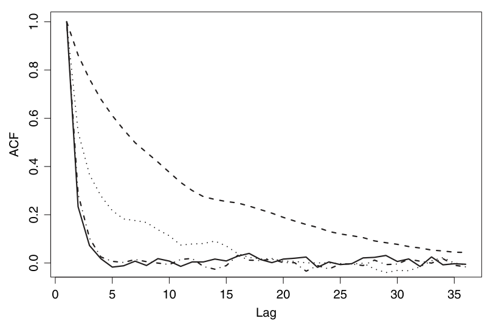

Fig. 16. Auto-correlation function of $\theta_1$ from the output of the GW scheme (———) and PMMH schemes with $N=200$ (- - - - - - -), $N=500$ (· · · · · · ·) and $N=1000$ (· - · - · - ·)

To compare the performance of the PMMH scheme with the method of Golightly and Wilkinson (2008) (henceforth referred to as the GW scheme), consider inference for a stochastic differential equation governing $X_t=(X_{1,t},X_{2,t})'$ with

$$\begin{aligned}\alpha(X_t,\theta)&=\begin{pmatrix}\theta_1X_{1,t}-\theta_2X_{1,t}X_{2,t}\\ \theta_2X_{1,t}X_{2,t}-\theta_3X_{2,t}\end{pmatrix},\\ \beta(X_t,\theta)&=\begin{pmatrix}\theta_1X_{1,t}+\theta_2X_{1,t}X_{2,t}&-\theta_2X_{1,t}X_{2,t}\\ -\theta_2X_{1,t}X_{2,t}&\theta_2X_{1,t}X_{2,t}+\theta_3X_{2,t}\end{pmatrix}.\end{aligned}$$

This is the diffusion approximation of the stochastic Lotka–Volterra model (Boys *et al.*, 2008). We analyse a simulated data set of size 50 with $\theta=(0.5,0.0025,0.3)$, corrupted by adding zero-mean Gaussian noise. Independent uniform $U(-7,2)$ priors were taken for each $\log(\theta_i)$. The GW scheme and the PMMH

<!-- PDF page 55 -->

sampler were implemented for 500000 iterations, using a random-walk update with normal innovations to propose $\log(\theta^*)$, with the variance of the proposal being the estimated variance of the target distribution, obtained from a preliminary run. The PMMH scheme was run for $N=200$, $N=500$ and $N=1000$ particles and, in all cases, discretization was set by taking $m=5$.

Computational cost scales roughly as 1:8:20:40 for GW:PMMH ($N=200{:}500{:}1000$). For $N=1000$ particles, the mixing of the chain under the PMMH scheme is comparable with the GW scheme; Fig. 16. Despite the extra computational cost of the PMMH scheme, unlike the GW scheme the PMMH algorithm is easy to implement and requires only the ability to forward-simulate from the model. This extends the utility of particle Markov chain Monte Carlo methods to a very wide class of models where evaluation of the likelihood is difficult (or even intractable), but forward simulation is possible.

### Edward L. Ionides (University of Michigan, Ann Arbor)

The authors are to be congratulated on an exciting methodological development. An attractive feature of this new methodology is that it has an algorithmic implementation in which the only operation applied to the underlying Markov process model is the generation of draws from $f_\theta(x_n|x_{n-1})$. This property has been called *plug and play* (He *et al.*, 2009; Bretó *et al.*, 2009) since it permits simulation code, which is usually readily available, to be plugged straight into general purpose software. I would like to add some additional comments to the authors’ coverage of this aspect of their work.

The plug-and-play property has been developed in the context of complex system analysis with the terminology *equation free* (Kevrekidis *et al.*, 2004). For optimization methodology, the analogous term *gradient free* is used to describe algorithms which are based solely on function evaluations. Plug-and-play inference methodology has previously been proposed for state space models (including Kendall *et al.* (1999), Liu and West (2001), Ionides *et al.* (2006), Toni *et al.* (2008) and Andrieu and Roberts (2009)). This paper is distinguished by describing the first plug-and-play algorithm giving asymptotically exact Bayesian inference for both model parameters and unobserved states.

We should expect plug-and-play approaches to require additional computational effort compared with rival methods that have access to closed form expressions for model properties such as transition densities or their derivatives. However, advances in computational capabilities and algorithmic developments are making plug-and-play methodology increasingly accessible for state space models. The great flexibility in model development that is permitted by the generality of plug-and-play algorithms is enabling scientists to ask and answer scientific questions that were previously inaccessible (e.g. King *et al.* (2008)). The methodology that is developed here (and other approaches which inherit the plug-and-play property from the basic sequential Monte Carlo algorithm) will benefit from further research into improvements and extensions of sequential Monte Carlo methods that fall within the plug-and-play paradigm: reduced variance resampling schemes are consistent with plug-and-play methods, but most other existing refinements are not.

### Pierre Jacob (Centre de Recherche en Economie et Statistique and Université Paris Dauphine, Paris), Nicolas Chopin (Ecole Nationale de la Statistique et de l’Administration Economique, Paris), Christian Robert (Centre de Recherche en Economie et Statistique and Université Paris Dauphine, Paris) and Håvard Rue (Norwegian University for Science and Technology, Trondheim)

This otherwise fascinating paper does not cover the calculation of the marginal likelihood $p(y)$, which is the central quantity in model choice. However, the particle Markov chain Monte Carlo (PMCMC) approach seems to lend itself naturally to the use of Chib’s (1995) estimate, i.e.

$$p(y)=\frac{p(\theta)\,p(y|\theta)}{p(\theta|y)}$$

for any $\theta$. Provided that the $p(\theta|x,y)$ density admits a closed form expression, the denominator may be estimated by

$$p(\theta|y)=\int p(\theta|x,y)\,p(x|y)\,\mathrm{d}x\approx\frac{1}{M}\sum_{i=1}^{M}p(\theta|x=x_i,y)$$

where the $x_i$s, $i=1,\ldots,M$, are provided by the MCMC output.

The novelty here is that $p(y|\theta)$ in the numerator needs to be evaluated as well. Fortunately, each iteration provides a Monte Carlo estimate of $p(y|\theta=\theta_i)$, where $\theta_i$ is the parameter value at MCMC iteration $i$. Some care may be required when choosing $\theta_i$; for example selecting the $\theta_i$ with largest (evaluated) likelihood may lead to a biased estimator.

<!-- PDF page 56 -->

We did some experiments to compare the approach described above with integrated nested Laplace approximations (Rue *et al.*, 2009) and nested sampling (Skilling (2006); see also Chopin and Robert (2010)), using the stochastic volatility example of Rue *et al.* (2009). Unfortunately, our PMCMC program requires more than 1 day to complete (for a number $N$ of particles and a number $M$ of iterations that are sufficient for reasonable performance), so we cannot include the results in this discussion. A likely explanation is that the cost of PMCMC sampling is at least $O(T^2)$, where $T$ is the sample size ($T=945$ in this example), since, according to the authors, good performance requires that $N=O(T)$, but our implementation may be suboptimal as well.

Interestingly, nested sampling performs reasonably well on this example (reasonable error obtained in 1 h), and, as reported by Rue *et al.* (2009), the integrated nested Laplace approximation is fast (1 s) and very accurate, but more work is required for a more meaningful comparison.

### Michael Johannes (Columbia University, New York) and Nick Polson and Seung M.-Yae (University of Chicago)

We would like to comment on a few aspects of the paper. First, for several years, macroeconomics has used a related algorithm (e.g. Fernandez-Villaverde and Rubio-Ramerez (2005)) to estimate dynamic general equilibrium models by using a random-walk Metropolis algorithm proposing new parameter values and accepting or rejecting the draws via marginal likelihoods from sequential Monte Carlo (SMC) sampling. This now quite large literature encountered a serious problem in models with more than a few parameters. In these cases, Metropolis algorithms often converge very slowly, and the combination of slow convergence and repeated iteration between SMC and Markov chain Monte Carlo (MCMC) sampling often requires that algorithms run for days, even when coded efficiently in C++. This experience provides a cautionary note to those using these algorithms in high dimensions. In the authors’ defence, these problems are extremely difficult, and the computationally expensive SMC–MCMC approach may be the *only* feasible strategy.

Second, the authors consider learning $\sigma$ and $\sigma_x$ in the non-linear state space model

$$\begin{aligned}y_t&=\frac{|x_t|^{\alpha}}{20}+\sigma w_t,\\ x_{t+1}&=\beta_1x_t+\beta_1\frac{x_t}{1+x_t^2}+\beta_3\cos(1.2t)+\sigma_xv_t,\end{aligned}$$

assuming $\alpha=2$, $\beta_1=0.5$, $\beta_2=25$ and $\beta_3=8$. It is disappointing that all these parameters are constrained, as a more realistic test of their algorithm would estimate all the unknown parameters.

The authors compare with an MCMC algorithm using single-state updating. We suggest two more realistic competing algorithms. The first assumes $\alpha=2$ and

(a) generates a full vector of latent states, $x_{1:T}$, by using SMC sampling, accepting or rejecting these draws via Metropolis updates and then

(b) updates the parameters by using $p(\theta|x_{1:T},y_{1:T})$.

This algorithm exploits the fact that the conditional posterior, $p(\theta|x_{1:T},y_{1:T})$, is a known distribution and simple to sample. This algorithm would probably perform better than the current algorithm combining SMC with random-walk Metropolis sampling.

The second algorithm is the approach of Johannes *et al.* (2007) that

(a) solely relies on SMC methods,

(b) uses slice variables to induce sufficient statistics,

(c) estimates all the parameters $(\alpha,\beta_1,\beta_2,\beta_3,\sigma,\sigma_x)$ for similar sized data sets and

(d) solves the sequential problem by approximating $p(\theta,x_t|y_{1:t})$ for each time $t$.

Fig. 17 provides an example of the output.

The algorithm of Johannes *et al.* (2007) relies on similar SMC methods but is computationally simpler. To obtain a sense of the computational demands, the current paper uses 60000 MCMC iterations and 5000 particles whereas we obtain accurate parameter estimates (verified via simulation studies), using one run of 300000 particles, using roughly 1/1000th of the computational cost. We would be interested in a direct horse-race of these competing methods in this specification.

Finally, the approach in the paper can have attractive convergence properties under various assumptions, including assumption 4. We would like to ask the authors whether assumption 4 is satisfied in the

<!-- PDF page 57 -->

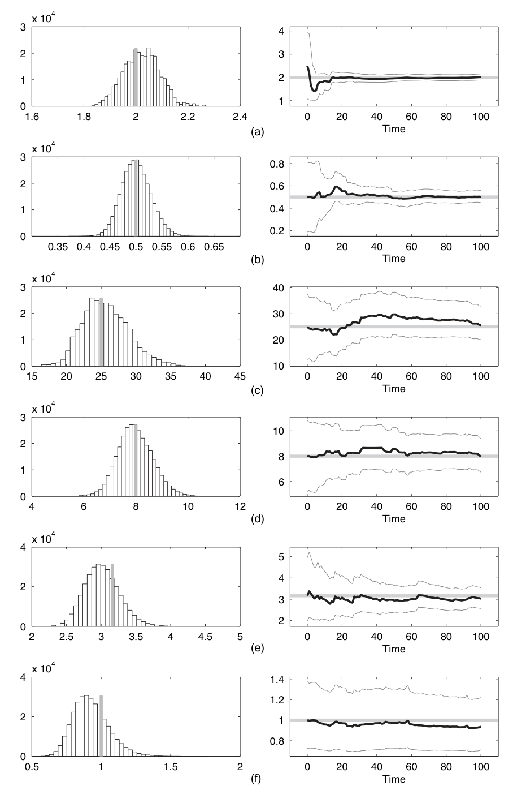

Fig. 17. Posterior distribution and learning of the parameters in the non-stationary growth model (the particle size is 300000): (a) $\alpha$; (b) $\beta_1$; (c) $\beta_2$; (d) $\beta_3$; (e) $\sigma$; (f) $\sigma_x$

<!-- PDF page 58 -->

examples that are considered in the paper. In particular, does it hold for various signal-to-noise ratio combinations of $\sigma$ and $\sigma_x$?

### Adam M. Johansen and John A. D. Aston (University of Warwick, Coventry)

We congratulate the authors on an exciting paper which combines the novel idea of incorporating sequential Monte Carlo proposals within Markov chain Monte Carlo samplers with a synthesis of ideas from disparate areas. It is clear that the paper is a substantial advance in Monte Carlo methodology and is of substantially greater value than a collection of its constituent parts.

However, one constituent which has received little attention in the literature seems to us to be interesting: although it is computationally rather expensive to do so, equations (27)–(28) suggest that it *is* possible to obtain samples which characterize the path space distribution well, at least in the case of mixing dynamic systems when we are interested in marginal distributions of bounded dimension, albeit at the cost of running an independent sequential Monte Carlo algorithm for every sample. In practice some reuse of samples is likely to be possible.

Typically, such a strategy might be dismissed (perhaps correctly) as being of prohibitive computational cost. However, in an era in which Monte Carlo algorithms whose time cost scales superlinearly in the number of samples employed are common, might there be other situations in which this strategy finds a role?

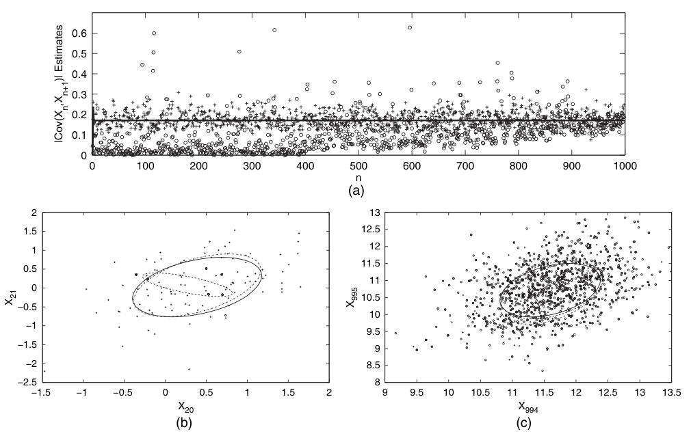

Fig. 18. Covariance of joint smoothing estimates by using a single 10000-sample particle filter (○), an ensemble of 100 100-sample particle filters (+) and the exact Kalman smoother (———): (a) determinant of two-state covariance matrices; (b) covariances at $n=20, 21$ (- - - - - - -, single-particle filter covariance; · - · - · - ·, multiple-particle filter covariance); (c) covariances at $n=994, 995$ (- - - - - - -, single-particle filter covariance; · - · - · - ·, multiple-particle filter covariance)

A rather naive approach to smoothing, for example, would be to employ an ensemble of independent particle filters and to sample one trajectory from each independent filter. For simplicity, consider employing a bootstrap filter in the univariate case, with $f_\theta(x_n|x_{n-1})=\mathcal{N}(x_n;x_{n-1},1)$ and $g_\theta(y_n|x_n)=\mathcal{N}(y_n|x_n,1)$. To assess performance, consider the estimated covariance of $X_{n:n+1}$ (and the determinant of that covariance, to provide a compact summary). Fig. 18 shows covariance estimates obtained by using a 100-filter ensemble, each of 100 particles, a single particle filter of equal cost (using 10000 particles) and the exact solution (Kalman smoothing). This illustrates the degeneracy and consequent failure to represent sample path variability of a single filter adequately and contrasts it with the estimate obtained by using an ensemble

<!-- PDF page 59 -->

of filters. Each of the Monte Carlo algorithms required approximately 30 s over 1000 time steps using SMCTC (Johansen, 2009) and a 1.33-GHz Intel laptop.

Might it be possible to employ such a strategy to provide simple-to-implement algorithms with better path space performance? Can the error $\|\mathcal{L}(X_{n:n+L}\in\cdot\,|y_{1:T})-\pi(\cdot)\|$ be controlled uniformly for bounded $L$?

### Anthony Lee and Chris Holmes (University of Oxford)

We congratulate the authors on a major contribution to practical statistical inference in a variety of models. An important application is approximating the posterior distribution of static parameters in state space models. The particle marginal Metropolis–Hastings (PMMH) algorithm is perhaps the simplest of the algorithms introduced, relying only on the unbiasedness of the marginal likelihood estimator. Denoting by $\mathbf{y}$ the observations, $\mathbf{z}$ the set of *all* auxiliary random variables used in the filter and $\theta$ the static parameters, the likelihood estimator is a joint density $p(\mathbf{y},\mathbf{z}|\theta)$ satisfying

$$
\int_{\mathcal{Z}} p(\mathbf{y},\mathbf{z}|\theta)\,\mathrm{d}\mathbf{z}=p(\mathbf{y}|\theta). \tag{55}
$$

An interesting feature of the sequential Monte Carlo class of methods is that the choice of auxiliary variables $\mathbf{z}$ is flexible. For example, we can perform multinomial resampling in a variety of ways without affecting condition (55). Let $\mathbf{x}_{1:T}$ be the latent variables in the state space model. When $\mathbf{x}_t$ is univariate, sorting the particles before resampling as in Pitt (2002) but without interpolation gives an empirical distribution function for particle indices $\hat{F}(j)=\Sigma_{i=1}^{j}W_t^{(i)}$ that is identical to the empirical distribution function for $\mathbf{x}_t$ itself. We can then construct a Metropolis–Hastings Markov chain targeting $p(\theta,\mathbf{z}|\mathbf{y})$ by proposing moves of the form $(\theta,\mathbf{z})\to(\theta',\mathbf{z})$ and $(\theta,\mathbf{z})\to(\theta,\mathbf{z}')$. For the first type, this amounts to a use of common random variables so that in the acceptance ratio

$$
\alpha=\min\left\{1,\ \frac{p(\mathbf{y},\mathbf{z}|\theta')\,p(\theta')\,q(\theta',\theta)}{p(\mathbf{y},\mathbf{z}|\theta)\,p(\theta)\,q(\theta,\theta')}\right\}
$$

the terms $p(\mathbf{y},\mathbf{z}|\theta')$ and $p(\mathbf{y},\mathbf{z}|\theta)$ are positively correlated. We can therefore expect the resulting Markov transition kernel to be closer to that of the true marginal Metropolis–Hastings algorithm on $\theta$, suggesting superior performance over standard PMMH algorithms.

We ran both a PMMH algorithm and this correlated variant CPMMH on a linear Gaussian state space model with univariate latent variables $\mathbf{x}_t$ and a single unknown parameter. We used an improper prior with $p(\theta)\propto 1$ and a random-walk proposal. Since we can compute $p(\mathbf{y}|\theta)$ for this model, we can also compute the acceptance probabilities of the marginal algorithm and analyse how both algorithms move compared with the marginal algorithm. In a 50000-step chain, the PMMH algorithm differed from the true marginal algorithm 13065 times whereas CPMMH differed only 2333 times in terms of accepting or rejecting a move. Fig. 19 shows the differences between the acceptance probabilities for both the PMMH and the CPMMH algorithms against the marginal algorithm. Although CPMMH does not extend trivially to the multivariate case, tree-based resampling schemes as in Lee (2008) that generalize the methodology in Pitt (2002) give similar improvements.

Finally, many people at the meeting commented on the heavy computational burden of particle Markov chain Monte Carlo methods. However, the emerging use of parallel architectures such as graphics cards can alleviate this burden via parallelization of the particle filtering algorithm itself, as in Lee et al. (2009).

### Simon Maskell (QinetiQ, Malvern)

This paper provides, to the sequential Monte Carlo (SMC) sampling specialist, a mechanism to perform parameter estimation by using Markov chain Monte Carlo (MCMC) sampling. To the MCMC sampling specialist, this paper offers a route to efficient proposals in very high dimensional problems. Both contributions are significant in isolation. To achieve the two simultaneously is a significant achievement.

The paper’s approach is to extend the space of variables of interest to include auxiliary variables that are necessarily involved in the algorithmic process of drawing samples from an SMC sampler. The tactic is to extend the state space such that the problem of interest is expressed as a projection of some larger problem (which is easier to consider) onto a smaller dimensional space. There are a number of such larger problems that project onto the same smaller dimensional space. It is therefore surprising that the authors focus on a relatively restrictive structure for their samplers that target the joint distribution of $x_{1:T}$ and $\theta$: the particle marginal Metropolis–Hastings sampler considers a sampler of the form $q(\theta^*|\theta)\,q(x_{1:T}^*|\theta^*)$

<!-- PDF page 60 -->

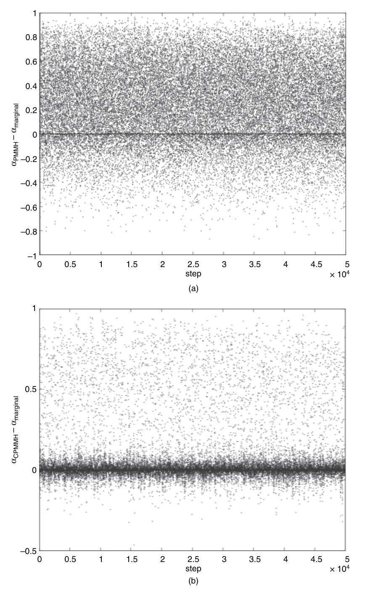

Fig. 19. Scatter plots of the difference between the acceptance probabilities of (a) the PMMH algorithm and (b) the CPMMH algorithm and the acceptance probability of the marginal algorithm at each step

<!-- PDF page 61 -->

and the particle Gibbs sampler considers a sampler that alternates between $q(\theta^*|x_{1:T})$ and $q(x_{1:T}^*|\theta)$. These samplers therefore avoid the possibility of proposals of the form $q(\theta^*|\theta)\,q(x_{1:T}^*|\theta^*,x_{1:T})$.

It is natural to ask what such proposal distributions would offer (apart from more complex variants of the MCMC acceptance ratios). SMC samplers are recursive algorithms, i.e. $x_t$ is sampled conditionally on $x_{1:t-1}$ for each $t$. As touched on in the paper, the statistical efficiency of SMC algorithms is coupled to their ability to generate samples of $x_t$ from a proposal distribution that is a good approximation to the target density. The optimal proposal distribution is only optimal in terms of its ability to exploit previous samples (and data) to generate the current sample $x_t$: the notion of optimality is intricately tied to the recursive application of an SMC sampler. In the context of particle MCMC methods, SMC samplers are still applied recursively, but we also have a previous sample of the entire trajectory, $x_{1:T}$. This trajectory encodes information about ‘future’ target distributions and samples that will turn out to be efficient in hindsight. It therefore seems plausible that a different notion of an optimal proposal distribution is needed for particle MCMC sampling and that this should include dependence on the previous sample of the trajectory.

This paper seems likely to seed a unified research direction that facilitates a combined effort between practitioners and researchers who are associated with both MCMC and SMC methods. Such extensions can therefore be expected.

### Lawrence Murray, Emlyn Jones, John Parslow, Eddy Campbell and Nugzar Margvelashvili (Commonwealth Scientific and Industrial Research Organisation, Canberra)

We thank the authors for their work on what we agree is a very compelling approach to parameter estimation in state space and other models. We have been investigating similar ideas in the context of marine biogeochemistry, with encouraging results for a toy Lotka–Volterra predator–prey model (Jones et al., 2009). Our approach uses random-walk Metropolis–Hastings steps in parameter space, with a particle filter employed to calculate likelihoods for the Metropolis–Hastings acceptance term. It is essentially an instance of the method described here as particle marginal Metropolis–Hastings (PMMH) sampling. The approach does seem computationally expensive, and we observe some potential consistency problems in the use of a particle filter to estimate likelihoods.

Biogeochemical models characterize the interaction of phytoplankton and zooplankton species and the conserved cycle of nutrients such as nitrogen, carbon and oxygen through an ecosytem. They are generally described by using ordinary differential equations, with our own formulation introducing stochasticity via interaction terms at discrete time intervals. They are one specific case of a wide variety of physical–statistical models obtained via the introduction of stochasticity to existing deterministic models in a Bayesian hierarchical framework.

These models fall into a broad class where the transition density $p_\theta(x_n|x_{n-1})$ is not available in closed form. This precludes use of some of the advanced proposal and resampling techniques that are mentioned by the authors, owing to the need to cancel the intractable transition density in the numerator and denominator in expression (7). In particular, the optimal proposal $p_\theta(x_n|y_n,x_{n-1})$ is not available. We find the iteration of a particle filter in the PMMH framework for these models to be very expensive computationally, mostly because of numerical integration of the ordinary differential equations with the limited availability of these advanced techniques confounding the matter further.

We find it necessary to use many more samples for PMMH sampling than we would with the same particle filter used only for state tracking, to deliver consistent likelihood estimates. Although a particle filter may momentarily fail to track the state adequately at a particular time but then recover (e.g. in a form of mild degeneracy where the effective sample size is low) the likelihood contribution at that time will be unreliable. In the worst case, iterating the particle filter with the same parameter configuration but different sample sets from the prior $p_\theta(x_1|y_1)$ can produce wildly different likelihood estimates in the presence of such anomalies.

### G. W. Peters (University of New South Wales, Sydney) and J. Cornebise (Statistical and Applied Mathematical Sciences Institute, Durham)

This paper will clearly have a significant influence on scientific disciplines with a strong interface with computational statistics and non-linear state space models. Our comments are based on practical experience with particle Markov chain Monte Carlo (MCMC) implementation in latent process multifactor stochastic differential equation models for commodities (Peters et al., 2010), wireless communications (Nevat et al., 2010) and population dynamics (Hayes et al., 2010), using Rao–Blackwellized particle filters (Doucet et al., 2000) and adaptive MCMC methods (Roberts and Rosenthal, 2009).

<!-- PDF page 62 -->

(a) From our implementations, ideal use cases consist of highly non-linear dynamic equations for a small dimension $d_x$ of the state space, large dimension $d_\theta$ of the static parameter and potentially large length $T$ of the time series. In our cases $d_x$ was 2 or 3, $d_\theta$ up to 20 and $T$ between 100 and 400.

(b) In particle Metropolis–Hastings (PMH) sampling, non-adaptive MCMC proposals for $\theta$ (e.g. tuned according to presimulation chains or burn-in iterations) would be costly for large $T$ and require that $N$ is kept fixed over the whole run of the Markov chain. Adaptive MCMC proposals such as the adaptive Metropolis sampler (Roberts and Rosenthal, 2009) avoid such issues and proved particularly relevant for large $d_\theta$ and $T$.

(c) For intractable joint likelihood $p_\theta(y_{1:T}|x_{1:T})$, we could design a sequential Monte Carlo (SMC)–approximate Bayesian computation algorithm (see for example Peters et al. (2010) and Ratmann (2010), chapter 1) for a fixed approximate Bayesian computation tolerance $\varepsilon$, using the approximations

$$
\hat{p}_\theta^{\mathrm{ABC}}(y_{1:T})=\frac{1}{N}\sum_{k=1}^{N}\frac{(1/S)\sum_{s=1}^{S}\mathbb{I}[\rho\{y_1^k(s),y_1\}<\varepsilon]\,\mu_\theta(x_1^k)}{q_\theta(x_1^k|y_1)}\prod_{n=2}^{T}\left(\frac{1}{N}\sum_{k=1}^{N}\frac{(1/S)\sum_{s=1}^{S}\mathbb{I}[\rho\{y_n^k(s),y_n\}<\varepsilon]\,f_\theta(x_n^k|x_{n-1}^{A_{n-1}^k})}{q_\theta(x_n^k|y_n,x_{n-1}^{A_{n-1}^k})}\right)
$$

or

$$
\hat{p}_\theta^{\mathrm{ABC}}(y_{1:T})=\frac{1}{N}\sum_{k=1}^{N}\frac{(1/S)\sum_{s=1}^{S}\mathcal{N}\{y_1^k(s);y_1,\varepsilon^2\}\,\mu_\theta(x_1^k)}{q_\theta(x_1^k|y_1)}\prod_{n=2}^{T}\left[\frac{1}{N}\sum_{k=1}^{N}\frac{(1/S)\sum_{s=1}^{S}\mathcal{N}\{y_n^k(s);y_n,\varepsilon^2\}\,f_\theta(x_n^k|x_{n-1}^{A_{n-1}^k})}{q_\theta(x_n^k|y_{n-1},x_{n-1}^{A_{n-1}^k})}\right]
$$

with $\rho$ a distance on the observation space and $y_n^k(S)\sim g_\theta(\cdot|x_n^k)$ simulated observations. Additional degeneracy on the path space induced by the approximate Bayesian computation approximation should be controlled, e.g. with partial rejection control (Peters et al., 2008).

(d) Particle Gibbs (PG) sampling could potentially stay frozen on a state $x_{1:T}(i)$. Consider a state space model with state transition function almost linear in $x_n$ for some range of $\theta$, from which $y_{1:T}$ is considered to result, and strongly non-linear elsewhere. If the PG samples $\theta(i)$ in those regions of strong non-linearity, the particle tree is likely to coalesce on the trajectory preserved by the conditional SMC sampler, leaving it with a high importance weight, maintaining $(\theta(i+1),x_{1:T}(i+1))=(\theta(i),x_{1:T}(i))$ over several iterations. Using a PMH within PG algorithm would help to escape this region, especially using partial rejection control and adaptive SMC kernels, outlined in another comment, to fight the degeneracy of the filter and the high variance of $\hat{p}_\theta(y_{1:T})$.

### Ralph S. Silva and Robert Kohn (University of New South Wales, Sydney), Paolo Giordani (Sveriges Riksbank) and Michael K. Pitt (University of Warwick, Coventry)

We congratulate the authors on their important paper which opens the way for a unified method for Bayesian inference using the particle filter and should allow for inference for models which are difficult to estimate by using other methods. To establish notation and to summarize the result that is relevant to our discussion, let $p(y|\theta)$ be the correct but intractable likelihood with $\hat{p}(y|\theta)=f(y|\theta,u)$ its approximation by the particle filter, where $u$ is a set of latent variables. By Del Moral (2004),

$$
\int f(y|\theta,u)\,f(u)\,\mathrm{d}u=p(y|\theta).
$$

The authors show that this implies that $f(\theta|y)=p(\theta|y)$ so a Markov chain Monte Carlo simulation based on the posterior $f(\theta,u|y)$ gives iterates of $\theta$ from the correct marginal posterior $p(\theta|y)$. Our own research reported in Silva et al. (2009) applies the fundamental insight in the current paper to study the behaviour of adaptive sampling schemes when the particle filter is used to obtain $f(y|\theta,u)$ for state space models. The two adaptive samplers that we consider are a three-component version of the adaptive random-walk proposal of Roberts and Rosenthal (2009) and the adaptive independent Metropolis–Hastings proposal of Giordani and Kohn (2008). Combining the particle filter with adaptive sampling is attractive because $f(y|\theta,u)$ is a stochastic non-smooth function of $\theta$. Our results suggest the following.

(a) It is feasible to use adaptive sampling for the particle Markov chain Monte Carlo and in particular particle marginal Metropolis–Hastings algorithm.

<!-- PDF page 63 -->

(b) It is computationally efficient to obtain a good adaptive proposal because the cost of constructing such a proposal is negligible compared with the cost of evaluating $f(y|\theta,u)$ by the particle filter.

(c) A well-constructed proposal can be much more efficient than an adaptive random-walk proposal.

(d) Independent Metropolis–Hastings proposals are attractive because they can be easily run in parallel, thus significantly reducing the computation time of particle-based Bayesian inference.

(e) When the particle filter is used, the marginal likelihood of any model is obtained in an efficient and unbiased manner, making model comparison straightforward.

### Miika Toivanen and Jouko Lampinen (Helsinki University of Technology, Espoo)

We congratulate the authors for introducing the idea of combining ‘ordinary’ Markov chain Monte Carlo (MCMC) and sequential Monte Carlo (SMC) methodologies in a novel way, namely using SMC algorithms for designing proposal distributions for MCMC algorithms. We wish to share briefly our own experience on using particle Monte Carlo methods on a static problem, related to computer vision.

Consider having a few dozen feature points and a posterior distribution of their locations in a test image, Owing to the combinatorial explosion, approximate methods are needed to compute the integrals that involve the posterior distribution. The multimodality of the posterior distribution complicates the approximation problem. Although MCMC methods can be efficient in exploring a single mode, the probability for them to switch a mode during the sampling is low, especially if the modes are far apart. Although some improvements to overcome this disadvantage exist, the population Monte Carlo (PMC) scheme offers a much more natural approach.

PMC techniques are based on the idea of representing the posterior with a weighted set of particles. Each particle can be considered as a hypothesis about the correct location of the feature set and the weight reveals the goodness of the hypothesis. The particles are sampled from proposal distributions, which are allowed to differ between the particles and iterations. Hence, heuristics can safely be incorporated to guide the sampler towards the modes of the posterior, without jeopardizing the theoretical convergence issues. In our implementation, the proposals are Gaussian distributions, which have the previous estimate as mean value and whose variance decreases for particles with high posterior probability. Owing to the resampling, the weakest hypotheses die, and the resulting particle set gives often a good representation of the posterior distribution (Toivanen and Lampinen, 2009a,b).

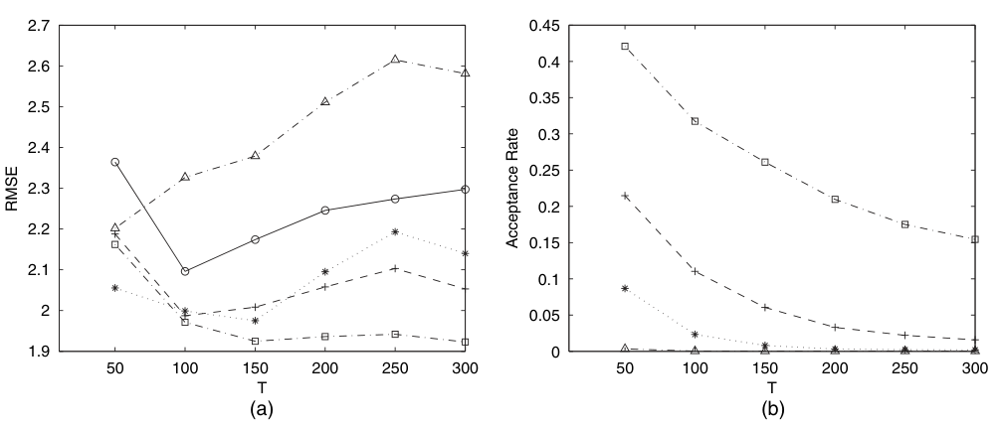

Fig. 20. Comparisons of the standard SMC method with 1 million particles with four PIMH samplers with different combinations of $N$ and $L$ ($N=25$ and $L=40000$ (PIMH1), $N=100$ and $L=10000$ (PIMH2), $N=250$ and $L=4000$ (PIMH3), and $N=1000$ and $L=1000$ (PIMH4)) of (a) average RMSE for all five (○, SMC; △, PIMH1; ∗, PIMH2; +, PIMH3; □, PIMH4) and (b) average acceptance rate for the four PIMH samplers (△, PIMH1; ∗, PIMH2; +, PIMH3; □, PIMH4)

Also SMC methods can be applied to sample the posterior, by updating the parameter vector incrementally (Toivanen and Lampinen, 2009c; Tamminen and Lampinen, 2006). The previously sampled components guide the sampler via the conditional prior distribution and the number of distinct modes decreases as the parameter vector expands. However, because the resampling is not based on the whole parameter vector, unlike in PMC methods, the method is prone to lead to a particle set representing a

<!-- PDF page 64 -->

fallacious minor mode which in a marginal posterior is stronger than the main mode of the full posterior. Thus, it might be interesting to test whether PMC, instead of SMC, methods could be combined with MCMC methods in a fashion suggested by the authors, and whether it would improve the performance in these kinds of problem.

### Jonghyun Yun and Yuguo Chen (University of Illinois at Urbana—Champaign)

We congratulate the authors on successfully combining two popular sampling tools, sequential Monte Carlo (SMC) and Markov chain Monte Carlo (MCMC) methods. We discuss two specific implementation issues of particle MCMC (PMCMC) algorithms.

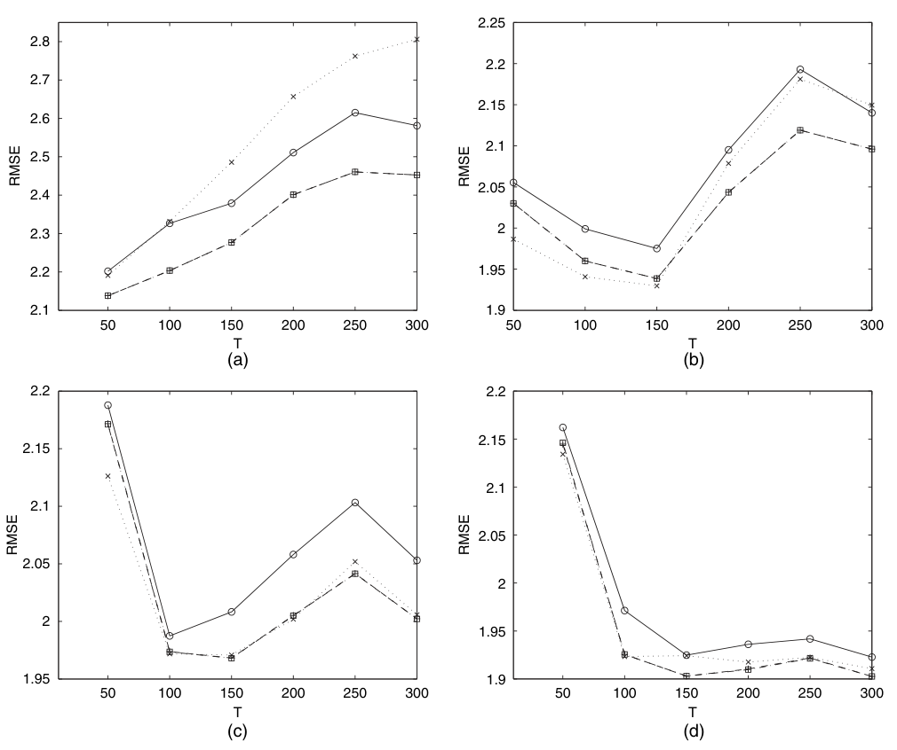

Fig. 21. Comparison of the average RMSE for the PIMH sampler and the three methods that reuse all particles: (a) PIMH1 (○, PIMH1; +, PIMH1-Reuse1; □, PIMH1-Reuse2; ×, PIMH1-Reuse3); (b) PIMH2 (○, PIMH2; +, PIMH2-Reuse1; □, PIMH2-Reuse2; ×, PIMH2-Reuse3); (c) PIMH3 (○, PIMH3; +, PIMH3-Reuse1; □, PIMH3-Reuse2; ×, PIMH3-Reuse3); (d) PIMH4 (○, PIMH4; +, PIMH4-Reuse1; □, PIMH4-Reuse2; ×, PIMH4-Reuse3)

In PMCMC sampling, proposing a single sample at each iteration requires $N$ particles. That means running PMCMC algorithms for $L$ iterations needs $NL$ particles. If we can afford to generate only a fixed number $N^*$ of particles, a practical question is how to balance between $N$ and $L$ under the constraint that $NL=N^*$. We did a simulation study on model (14)–(15) with known parameters $\sigma_V^2=10$ and $\sigma_W^2=1$. Let $N^*=1000000$. We simulated 100 sequences of observations $y_{1:300}$ from the model. For each sequence, four particle independent Metropolis–Hastings (PIMH) samplers with different combinations of $N$ and $L$ were applied to estimate the states $x_{1:300}$. The standard SMC method in Section 2.2.1 with 1000000 particles is also included in the comparison. The performance criterion is the root-mean-squared error RMSE between the true $x_i$ and the estimates:

<!-- PDF page 65 -->

$$
\mathrm{RMSE}=\left\{T^{-1}\sum_{i=1}^{T}(\hat{x}_i-x_i)^2\right\}^{1/2}.
$$

The average RMSE and acceptance rate from 100 simulations are reported in Fig. 20. According to Fig. 20, PIMH sampling with a small $N$ could perform worse than standard SMC sampling. Part of the reason may be the low acceptance rate. Increasing $N$ seems to improve the acceptance rate and the performance, even though $L$ decreases correspondingly, which may affect the convergence of the Markov chain. For each combination of $N$ and $L$, the acceptance rate becomes lower as the dimension $T$ of the state $x_{1:T}$ grows.

Another practical issue is about reusing all particles. Two estimates which use all particles are suggested in Section 4.6. We compared these two estimates with the original PIMH sampler on the same model and the same four settings as before. Denote the two estimates in equations (38) and (39) as PIMH-Reuse1 and PIMH-Reuse2 respectively. We also propose a new estimate, which is denoted by PIMH-Reuse3 (see theorem 6 for the notation):

$$
\sum_{i=1}^{L}\tilde{z}^*(i)\sum_{k=1}^{N}W_T^{*K}(i)\,f\{X_{1:T}^{*k}(i)\},\qquad \tilde{z}^*(i)=\hat{z}^{N,*}(i)\Bigg/\sum_{i=1}^{L}\hat{Z}^{N,*}(i). \tag{56}
$$

This estimate is based on the $N$ weighted particles proposed at each iteration before the accept–reject step. PIMH-Reuse3 can be used when there are no unknown parameters in the model, and its convergence can be proved. The comparison of the average RMSE in Fig. 21 shows that PIMH-Reuse1 has almost the same performance as PIMH-Reuse2, and both outperform the original PIMH sampler. The relationship between PIMH-Reuse3 and the other methods is not so clear.

### The authors replied later, in writing, as follows

We thank the discussants for their very interesting comments.

*What the users say*

Perhaps the most important feedback that we have received is the confirmation by several discussants (Belmonte and Papaspiliopoulos, Bhadra, Flury and Shephard, Cappé, Robert, Jacob and Chopin, and Golightly and Wilkinson) that the approach is not only conceptually simple but also more importantly that it is relatively easy to implement in practice and able to produce satisfactory results. We were particularly interested in the reported simulations and user experience of Golightly and Wilkinson. They indicate that particle Markov chain Monte Carlo (PMCMC) methods can lead to performance that is similar to that obtained with a carefully handcrafted (and possibly complex) algorithm and point to the comparatively little effort that is required by the user in terms of design and implementation. Naturally, except in situations where such implementational simplicity cannot be avoided, this ease comes at the expense of ‘computational brutality’, which might currently deter or prevent some users from using the approach (Chopin, and Flury and Shephard). However, as pointed out by Lee and Holmes, and Everitt, recent advances in the use of cheap graphical processing units and other multicore computing machines (such as game consoles) for scientific computing offer good hope that ever more complex problems can be routinely attacked with PMCMC methods. We naturally realize that the notion of ‘difficult problems’ is not static and do not believe in black boxes and silver bullets: ultimately very difficult problems at the frontier of what current technology can achieve will always require more thinking by the user. In relation to this we are looking forward to seeing applications of PMCMC sampling in the context of approximate Bayesian computations (Cornebise and Peters, and Peters and Cornebise) and general graphical models (Everitt).

*Correctness and sequential Monte Carlo implementations*

For brevity and to ensure simplicity of exposition the algorithms that were presented throughout the paper focus on some of the simplest implementations, and our discussion of general validity was confined to Section 2.5 and the beginning of Section 4. Not surprisingly quite a few comments focus on this aspect.

*Valid sequential Monte Carlo implementations*

Although the design of efficient MCMC algorithms can be facilitated by the use of sequential Monte Carlo (SMC) sampling as proposal mechanisms, the performance of the latter will naturally affect the performance of the former and one might wonder what standard SMC improvement strategies are legitimate? One can complement and summarize the rules of Section 2.5 and the beginning of Section 4 as follows. In broad terms PMCMC algorithms are valid

<!-- PDF page 66 -->

(a) when unbiasedness in the resampling step holds and this includes very general and popular schemes (e.g. Chopin, Fearnhead and Crisan) and

(b) for all enhancement methods involving additional artificial intermediate distributions; examples include the popular auxiliary particle filter approach (Pitt and Shephard, 1999) and resample–move algorithms (Gilks and Berzuini, 2001) (in other words MCMC-within-SMC methods), but, also as pointed out by Chen, the use of flexible resampling strategies.

It is worth mentioning here that the exchangeability property (assumption 2) is not needed for the PMMH algorithm when only inference on $\theta$ is needed. Since writing the paper we have been working on establishing that even more general resampling schemes lead to valid PMCMC algorithms. Of particular interest are adaptive resampling schemes, which usually reduce the number of times that resampling is needed. It has been empirically observed in the literature dedicated to SMC algorithms that such schemes might be beneficial, and we expect this to carry on to the PMCMC framework (see the discussion below on the influence of the variability of $\hat{\gamma}^N(\theta)$ (or $\hat{Z}^N$) on the performance of PMCMC algorithms as well as the discussion of Fearnhead concerning the particle Gibbs (PG) sampler). It is also possible to adapt the number $N$ of particles within the SMC step, which might be for example of interest to moderate the effect of outliers discussed by Murray, Jones, Parslow, Campbell and Margvelashvili.

*Large state spaces*

As pointed out by several discussants (Girolami, and Creal and Koopman) the design of efficient proposal distributions for the importance sampling stage of the SMC algorithm might be difficult in situations where the dimension of $\mathcal{X}$ is large. It can be shown on simple examples that such a penalty will typically be exponential in the dimension (consider for example Cappé’s example). However, it is possible in this case to introduce subsequences of intermediate distributions bridging for example $\pi_n$ and $\pi_{n+1}$, e.g. Del Moral *et al.* (2006) and Godsill and Clapp (2001). This offers the possibility of employing well-known standard MCMC-type strategies that are well suited to high dimensional set-ups to update sub-blocks of the state vector between two particular distributions $\pi_n$ and $\pi_{n+1}$. An alternative strategy consists of updating the state components one at a time by using conditional SMC updates.

*General proposals for particle Metropolis–Hastings algorithms*

Whereas the PG sampler bypasses the need for the design of a proposal distribution for $\theta$ the particle marginal Metropolis–Hastings (PMMH) algorithm requires such a design, which might not always be obvious as pointed out by Girolami, and Silva, Kohn, Giordani and Pitt.

As pointed out by Maskell, and Robert, Jacob, Chopin and Rue the degree of freedom that is offered by the choice of proposal of the PMMH step, or indeed a particle independent Metropolis–Hastings (PIMH) step, might turn out to be an opportunity which needs to be further explored. Dependence of proposals on previous particle populations is definitely an option (Everitt, and Robert, Jacob, Chopin and Rue) and might be beneficial to calibrate proposal distributions, but also to reduce the variability of acceptance probabilities. Note, however, our remark on the validity of recycling strategies in such a scenario at the very end of Appendix B.5. The work of Lee and Holmes offers an alternative variance reduction strategy of the acceptance probability for some situations.

Another natural solution consists of using adaptive MCMC algorithms (Andrieu and Thoms, 2008). Silva, Kohn, Giordani and Pitt report some results in this direction and in particular report better performance of the adaptive independent MH algorithms compared with that of a particular implementation of the AM algorithm (Haario *et al.*, 2001; Roberts and Rosenthal, 2007). A further interesting comparison might involve robust versions of the AM algorithm described in Andrieu amd Thoms (2008). Finally it is worth mentioning the complementary and competitive method of Ionides *et al.* (2006) to compute maximum likelihood estimates of the static parameter $\theta$, which could be used as a useful stepping stone towards Bayesian inference in very difficult situations.

*Smoothing*

The smoothing approaches that were described by Whiteley (and hinted at by Godsill) and Johansen and Aston are very promising developments. The first approach is in the vein of existing ‘particle smoothing’ approaches which allow one to exploit the information that is gathered by all the particles generated by a single SMC procedure within the PMCMC framework. Its interest is intuitively evident in the case of the PG in the light of Fearnhead’s discussion, but we expect such a smoothing procedure also to have a positive effect beyond this special case. This might for example improve the quality of samples $\{X_{1:P}(i)\}$ that are produced by the PMMH algorithm and suggests further improvements to our suggested recycling strategies. The second approach of Johansen and Aston, which was suggested in a non-PMCMC frame

<!-- PDF page 67 -->

work, consists of replacing a single SMC sampler using $KN$ particles with $K$ independent SMC samplers using $N$ particles, which amounts to effectively replacing $\hat{\pi}^{KN}(\mathrm{d}x)$ with

$$\check{\pi}^{KN}(\mathrm{d}x)=\frac{1}{K}\sum_{k=1}^{K}\hat{\pi}_k^N(\mathrm{d}x)$$

and use a stratified sampling strategy to sample $K$ paths. As illustrated by Johansen and Aston, reducing particle interaction might be beneficial when smoothing is of interest. Adaptation of this idea to the PMCMC framework seems possible and raises numerous interesting theoretical and practical questions. This strategy, as well as that described earlier, might address the issue that was raised by Fearnhead concerning the particle depletion phenomenon for initial values.

*Performance and the choice of $N$: from theory to practice*

The choice of the number $N$ of particles is a difficult, but central, issue which is paramount to the good performance of PMCMC algorithms. This question is made even more difficult when considering the optimum trade-off between $N$ and $L$ for fixed computational resources, and a credible and generally valid answer to this question is beyond our current understanding.

Dependence on $N$ of the performance of the PMCMC algorithms that were considered in the paper takes two different forms, at first apparently unrelated. It is first important to recall the fact that current PMCMCs can be thought of as being ‘exact approximations’ of idealized algorithms, which might or might not turn out to be ideal. It is indeed possible to construct examples, which are not unrelated to reality, for which the idealized algorithm is slower than its PMCMC version, suggesting that increasing $N$ might not improve performance indefinitely, if at all. This partly answers Chopin’s questions related to Rao–Blackwellization and the $N$ *versus* $N+1$ issue. Some understanding of the idealized algorithm is therefore necessary, and we shall assume below that this algorithm is a worthy approximation.

For the PMMH or PIMH step the variability of $\hat{\gamma}^N(\theta)$ (or $\hat{Z}^N$) will determine how statistically close its transition probability is to that of the idealized algorithm, and as a result some of its performance measures. In the case of the PG, dependence of the performance on the variability of $\hat{\gamma}^N(\theta)$ is less obvious, but it seems to be governed by the coalescence structure of particle paths, as discussed by Fearnhead and observed by Whiteley.

In relation to this discussion, residual resampling will outperform multinomial resampling (Chopin) when closeness to the marginal algorithm is considered. Closeness to the marginal algorithm, when achieved, also suggests how the proposal distribution of $\theta$ in the PMMH should be adjusted: a random-walk Metropolis step should be tuned such that its acceptance probability is of the order of 0.234 etc. Some results illustrating the effect of $N$ on the performance of the MCMC algorithm can be found in Andrieu and Roberts (2009).

The theoretical results of Section 4 do not unfortunately provide us with precise values but with bounds on rates of convergence as a function of both $N$ and $P$ (or $T$). Although we believe, and agree with Crisan, that such results can be established under weaker assumptions, we doubt that more practical (and sufficiently general) results can be obtained. We hence doubt that we can ever answer Draper’s question, which remains largely unanswered even for standard MCMC algorithms. We find it comforting to see that the experiments of Fearnhead, Cappé and Chen indicate that the main conclusion of the theoretical results, i.e. that $N$ should scale linearly with $P$ for ‘ergodic’ models, seems to hold for quite general scenarios. We were puzzled by the extremely positive results obtained by Belmonte and Papaspiliopoulos for the PG sampler. We note that beyond their explanatory power these results suggest, possibly manual, ways of choosing $N$ by monitoring, for example, the evolution of the variance of normalizing constants as a function of $N$. Naturally such nice ergodicity properties do not hold for numerous situations of interest, such as models for which components of the state evolve in a quasi-deterministic manner. This includes the class of dynamic stochastic equilibrium models; see Fernandez-Villaverde and Rubio-Ramirez (2007) and Flury and Shephard (2010). This lack of ergodicity of the model probably explains the reported slow convergence of the PMMH algorithm in the scenarios that were mentioned by Johannes, Polson and Yae. As acknowledged in Flury and Shephard (2010), any SMC-based method will suffer from this problem and it is expected that $N$ will scale superlinearly with $T$ in such scenarios. Note, however, that, in principle, the PMCMC framework allows for the use of standard off-the-shelf MCMC remedies, e.g. tempering ideas which might alleviate this issue by introducing bridging models with improved ergodicity.

Ideally we would like the choice of $N$ to be ‘automatic’, in particular for the PMMH and PG algorithms. Indeed, as suggested by the theoretical result on the variance, different values of $\theta$ might require different values of $N$ to achieve a set precision. Designing such a scheme which preserves $\pi(\theta,x_{1:P})$ as invariant distribution of the MCMC algorithm proves to be a challenge. However, adaptation within the SMC

<!-- PDF page 68 -->

algorithm can be achieved through look-ahead procedures and by boosting the number of particles locally when necessary. This can help to prevent the problems that were described by Murray, Jones, Parslow, Campbell and Margvelashvili, where a small number of outliers can have a serious effect on the estimate of the normalizing constant or marginal likelihood and hence the PMCMC procedure.

*Unbiasedness versus sampling*

Several authors (Flury and Shephard, Łatuszyński and Papaspiliopoulos, Roberts, and Silva, Kohn, Giordani and Pitt) stress the unbiasedness of $\hat{\gamma}^N(\theta)$ (or $\hat{Z}^N$) that is produced by an SMC algorithm as being the basic principle underpinning the validity of the PMMH algorithm, in the spirit of Beaumont (2003), Andrieu and Roberts (2009) and Andrieu *et al.* (2007). This is indeed one of the two ways in which we came up with the PMMH algorithm initially in the course of working on two separate research projects. The other perspective, favoured in our paper, is that of ‘pseudosampling’, which in our view goes beyond unbiasedness (in the spirit of the ‘pseudomarginal’ approach) and is in our view fertile. Indeed although, in the context of the PMMH algorithm, the pseudomarginal perspective is appropriate when sampling from $\pi(\theta)$ is all that is needed, it is not sufficient to explain that it is possible to sample from $\pi(\theta,x_{1:P})$ using the same output from the SMC step. We do not think that the PG, of which the conditional SMC update is the key element, could have emerged without this perspective. It is in fact rather interesting to re-explain what the conditional SMC update achieves in the simple situation where the target distribution is $\pi(x_{1:P})$ and $P=1$. In this situation, the extended target distribution of the paper takes the particularly simple form (we omit the subscript 1 to simplify the notation)

$$\tilde{\pi}^N(k,x^{1:N})=\frac{1}{N}\pi(x^k)\prod_{j=1,\,j\neq k}^{N}q(x^j).$$

A Gibbs sampler to target this distribution consists, given $x^k$, of sampling according to the two following steps:

(a) $\tilde{\pi}^N(x^{1:N\setminus\{k\}}|k)=\prod_{j=1,\,j\neq k}^{N}q(x^j)$ and

(b) $\tilde{\pi}^N(l|x^{1:N})$,

which by standard arguments leave $\tilde{\pi}^N(k,x^{1:N})$ invariant. Step (a) is a trivial instance of the conditional SMC update whereas step (b) consists of choosing a sample in $x^{1:N}$ according to the empirical distribution

$$\hat{\pi}^N(\mathrm{d}x)=\sum_{i=1}^{N}\frac{\pi(x^i)/q(x^i)}{\sum_{j=1}^{N}\pi(x^j)/q(x^j)}\,\delta_{x^i}(\mathrm{d}x).$$

Note the similarity of this update with the standard importance sampling–resampling procedure. The remarkable feature here is that whenever $x_k\sim\pi$ then so is $x_l\sim\pi$, owing to the aforementioned invariance property. In other words the conditional SMC update followed by resampling can be thought of as being an MCMC update leaving $\pi$ invariant. Unbiasedness seems to be a (happy) by-product of the structure of $\tilde{\pi}^N$ and the proposal distributions used, since it can be easily checked that

$$\tilde{\pi}^N(k,x^{1:N})=q(k,x^{1:N})\sum_{j=1}^{N}\frac{\pi(x^j)}{q(x^j)},$$

for $q(k,x^{1:N})=w^k\prod_{j=1}^{N}q(x^j)$ and $w^k\propto\pi(x^k)/q(x^k)$, $\sum_{k=1}^{N}w^k=1$.

The PIMH and PMMH algorithms take advantage of this unbiasedness property but as illustrated above the structure of $\tilde{\pi}^N(k,x^{1:N})$ offers other useful applications. One interesting application is described in the paper: assume that $P$ is so large that the number $N$ of particles to obtain a reliable SMC step is prohibitive, probably at least of the order of $P$. Then updating large sub-blocks of $x_{1:P}$ is a tempting solution. In the light of the discussion above, the conditional SMC update offers the possibility of targeting $\pi(x_{a:b}|x_{1:P\setminus a:b})$ for $1\leqslant a\leqslant b\leqslant P$. Assuming for notational simplicity here that $b=P$ and $a>1$, if $x_{1:P}\sim\pi$, then $(x_{1:a-1},x'_{a:P})\sim\pi$ once the update above has been applied to $x_{a:P}$. Similarly the conditional SMC algorithm can be used in cases where the dimension, say $m$, of $\mathcal{X}$ is large in order to update, for example, $\pi\{x_{1:P}(l)|x_{1:P}(1:m\setminus\{l\})\}$ for $l=1,\ldots,m$.

*Using sequential Monte Carlo methods with Markov chain Monte Carlo moves*

As mentioned in Section 2.2.2 and by Johannes, Polson and Yae, an alternative to PMCMC methods consists of using SMC methods with MCMC moves (Fearnhead, 1998; Gilks and Berzuini, 2001). These methods are not applicable in complex models such as the stochastic volatility model in Section 3.2, but,

<!-- PDF page 69 -->

when applicable, seem at first appealing. They are particularly elegant in scenarios where $p(\theta|x_{1:T},y_{1:T})$ depends on $x_{1:T},y_{1:T}$ only through a set of fixed dimensional statistics and have received significant attention since their introduction and development over a decade ago; see for example Andrieu *et al.* (1999, 2005), Fearnhead (1998, 2002), Storvik (2002) and Vercauteren *et al.* (2005). Despite their appeal these well-documented methods are widely acknowledged to be rather delicate to use, owing to the so-called path degeneracy phenomenon and the fact that a good initialization distribution for $\theta$ seems paramount because of the lack of ergodicity of the system. In fact such techniques rely implicitly on the approximation of $p(x_{1:T}|y_{1:T})$ and it can be observed empirically that the algorithm might converge to incorrect values and even sometimes drift away from the correct values as the time index $T$ increases; see for example Andrieu *et al.* (1999, 2005).

As a consequence we would recommend extreme caution when using such techniques, whose interest might be to provide a quick initial guess for the inference problem at hand. Assessing path degeneracy is certainly essential to evaluate the credibility of the results. A simple proxy to measure degeneracy consists of monitoring the number of distinct particles representing $p(x_k|y_{1:T})$ for various values of $k\in\{1,\ldots,T\}$ (preferably low values). If this number is below a reasonable number, say 500, then the particle approximation of $p(\theta,x_{1:T}|y_{1:T})$ is most probably unreliable.

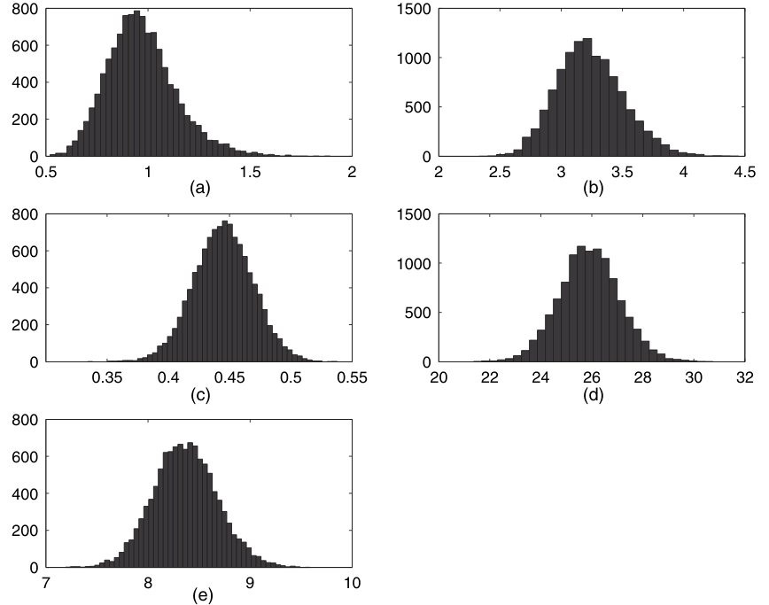

**Fig. 22.** Approximations of the marginal posterior distributions of (a) $\sigma_x$, (b) $\sigma$, (c) $b_1$, (d) $b_2$ and (e) $b_3$ obtained by using 12000 PG iterations with 1000 burn-in

Johannes, Polson and Yae propose to reconsider the example that was discussed in Section 3.1 and to estimate the parameters $(\alpha,\sigma,\beta_1,\beta_2,\beta_3,\sigma_x)$. They use Gibbs steps within a bootstrap particle filter to update $\theta:=(\sigma,\beta_1,\beta_2,\beta_3,\sigma_x)$ and a slice sampler to update $\alpha$. As we do not have the details of their slice sampler, we shall limit ourselves to the estimation of $p(\theta,x_{1:T}|y_{1:T})$ by using the PG sampler. We considered their scenario and simulated $T=100$ data points by using the parameters that Johannes, Polson and Yae used and we set informative priors approximately similar to theirs by checking the width of their posteriors at time $n=0$. In this context, Johannes, Polson and Yae used 300000 particles for the particle filter with Gibbs moves and argue, on the grounds of the simulations that were discussed at the end of Section 3.1, that PMCMC methods would require 1000 times more computation to perform inference in this scenario. We want to reassure them and the readers that this is not so. We used $N=5000$ particles at the end of

<!-- PDF page 70 -->

Section 3.1 because we addressed a much more difficult scenario where $T=500$, $\sigma=1$ and $\sigma_x=\sqrt{10}$, i.e. the data set was five times larger and we used the bootstrap filter in a very unfavourable scenario where the likelihood of the observations is peaked and the noise of the dynamic diffuse. This is in contrast with the scenario that is considered by Johannes, Polson and Yae where $\sigma=\sqrt{10}$ and $\sigma_x=1$, i.e. the likelihood is fairly diffuse and the bootstrap filter and conditional bootstrap filters can provide good proposals for a number of particles as small as 150, which is in agreement with Fig. 3 of the paper. Moreover our PG sampler samples only $(N-1)T$ random variables $X_n$ and one set of parameters $(\sigma,\beta_1,\beta_2,\beta_3,\sigma_x)$ per MCMC iteration whereas the particle filter using Gibbs moves needs to sample $NT$ random variables $(X_n,\sigma,\beta_1,\beta_2,\beta_3,\sigma_x)$. As a result, for the computational complexity of using the bootstrap filter with Gibbs moves for $N=300000$, we can run the PG sampler for 12000 iterations using a conditional SMC sampler using 150 particles, which is more than sufficient in this context. The MATLAB program runs in 7 min on a desktop computer. Fig. 22 displays the results. We ran many realizations initialized with this very informative prior and the algorithm consistently returned virtually identical results. Using vague priors for all parameters, we observed that poorly initialized PG samplers can sometimes become trapped in some modes (and we conjecture that this might be so even for the ‘exact’ Gibbs sampler) but also manages to escape, in which case the results are very similar, and stable.

For the same data set and the same informative prior, we ran 10 runs of the bootstrap filter with Gibbs steps for $N=100000$ particles. For some parameters, the results were quite similar among runs. However, we also observed significant variability in the estimates as illustrated in Fig. 23. As expected this variance increases with time as a result of the path degeneracy phenomenon. Using vague priors for all parameters, the procedure appeared unable to produce sensible approximations of the posterior.

We conjecture that the variance of the approximation error of $p(\theta,x_{1:T}|y_{1:T})$ increases superlinearly with $T$ for such algorithms.

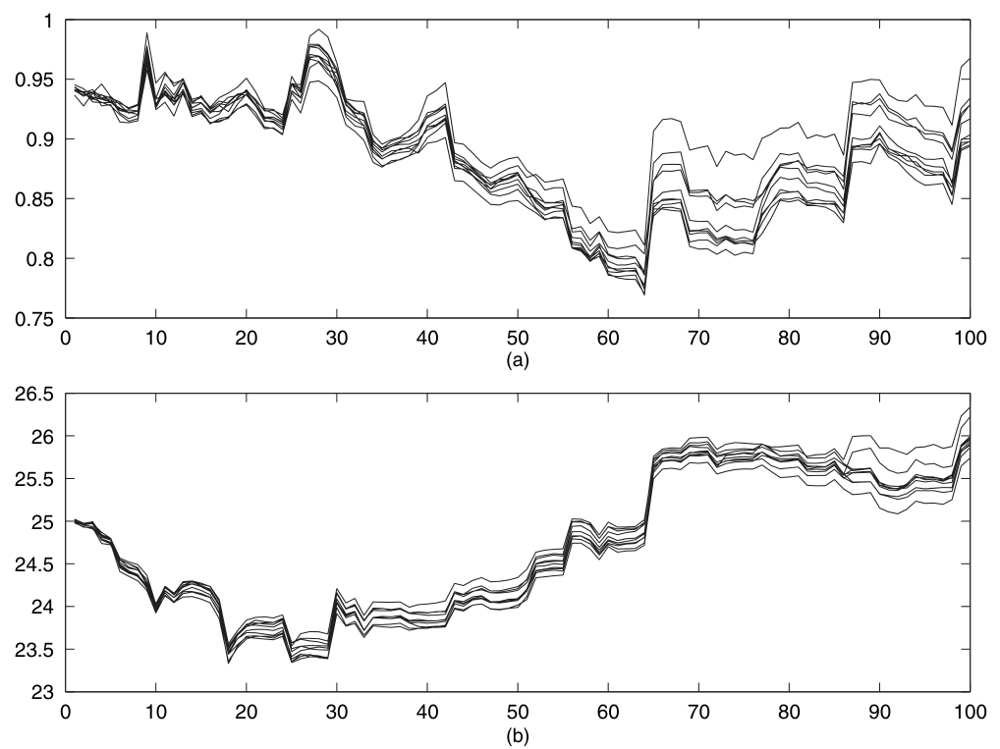

**Fig. 23.** Estimates of (a) $\mathbb{E}(\sigma_x|y_{1:n})$ and (b) $\mathbb{E}(b_2|y_{1:n})$ for $n=1,\ldots,100$ and 10 different runs of the bootstrap filter with Gibbs steps using $N=100000$ particles

<!-- PDF page 71 -->

*Some past and future work*

As mentioned in Section 5.1 of our paper and as recalled by Godsill and Johannes, Polson and Yae, a version of the PMMH algorithm based on the bootstrap filter has been previously proposed as a natural heuristic to sample approximately from $p(\theta|y_{1:T})$ (and not $p(\theta,x_{1:T}|y_{1:T})$) by Fernandez-Villaverde and Rubio-Ramirez (2007). As discussed earlier, beyond the (non-trivial to us) proof that this approach is in fact exact, we hope that we have demonstrated that the PMMH algorithm is only a particular case of a more general and useful framework which goes far beyond the heuristic. As pointed out in Section 5.1, the PMCMC framework encompasses the MTM algorithm of Liu *et al.* (2000) and the configurational-based Monte Carlo update of Siepmann and Frenkel (1992). These connections, which might not be obvious at first sight (Cappé), are detailed in Andrieu *et al.* (2010), where other interesting developments are also presented.

## References in the discussion

Andrieu, C., Berthelesen, K., Doucet, A. and Roberts, G. O. (2007) The expected auxiliary variable method for Monte Carlo simulation. *Working Paper*. Department of Mathematics, University of Bristol, Bristol.

Andrieu, C., Berthelsen, K. K., Doucet, A. and Roberts, G. O. (2008) Posterior sampling in the presence of unknown normalising constants: an adaptive pseudo-marginal approach. To be published.

Andrieu, C., De Freitas, J. F. G. and Doucet, A. (1999) Sequential Markov chain Monte Carlo for Bayesian model selection. In *Proc. IEEE Wrkshp Higher Order Statistics, Caesarea*, pp. 130–134. New York: Institute of Electrical and Electronics Engineers.

Andrieu, C., Doucet, A. and Lee, A. (2010) On the Multiple-Try Metropolis-Hastings algorithm. To be published.

Andrieu, C., Doucet, A. and Tadić, V. B. (2005) On-line parameter estimation in general state-space models. In *Proc. 44th IEEE Conf. Decision and Control*, pp. 332–337. New York: Institute of Electrical and Electronics Engineers.

Andrieu, C. and Robert, C. (2001) Controlled Markov chain Monte Carlo methods for optimal sampling. *Technical Report 0125*. Université Paris Dauphine, Paris.

Andrieu, C. and Roberts, G. O. (2009) The pseudo-marginal approach for efficient computation. *Ann. Statist.*, **37**, 697–725.

Andrieu, C. and Thoms, J. (2008) A tutorial on adaptive MCMC. *Statist. Comput.*, **18**, 343–373.

Beaumont, M. A. (2003) Estimation of population growth or decline in genetically monitored populations. *Genetics*, **164**, 1139–1160.

Beaumont, M., Cornuet, J.-M., Marin, J.-M. and Robert, C. (2009) Adaptive approximate Bayesian computation. *Biometrika*, **96**, 983–990.

Belmonte, M. A. G., Papaspiliopoulos, O. and Pitt, M. K. (2008) Particle filter estimation of duration-type models. *Technical Report*. Department of Statistics, Warwick University, Coventry.

Boys, R. J., Wilkinson, D. J. and Kirkwood, T. B. L. (2008) Bayesian inference for a discretely observed stochastic-kinetic model. *Statist. Comput.*, **18**, 125–135.

Bretó, C., He, D., Ionides, E. L. and King, A. A. (2009) Time series analysis via mechanistic models. *Ann. Appl. Statist.*, **3**, 319–348.

Cappé, O., Douc, R., Guillin, A., Marin, J.-M. and Robert, C. (2008) Adaptive importance sampling in general mixture classes. *Statist. Comput.*, **18**, 447–459.

Carpenter, J., Clifford, P. and Fearnhead, P. (1999) An improved particle filter for non-linear problems. *IEE Proc. Radar Sonar Navign*, **146**, 2–7.

Chen, R., Wang, X. and Liu, J. (2000) Adaptive Joint Detection and Decoding in flat-fading channels via mixture Kalman filtering. *IEEE Trans. Inform. Theor.*, **46**, 2079–2094.

Chen, Y., Xie, J. and Liu, J. S. (2005) Stopping-time resampling for sequential Monte Carlo methods. *J. R. Statist. Soc.* B, **67**, 199–217.

Chib, S. (1995) Marginal likelihood from the Gibbs output. *J. Am. Statist. Ass.*, **90**, 1313–1321.

Chopin, N. (2007) Inference and model choice for sequentially ordered hidden Markov models. *J. R. Statist. Soc.* B, **69**, 269–284.

Chopin, N. and Robert, C. P. (2010) Contemplating Evidence: properties, extensions of, and alternatives to Nested Sampling. *Biometrika*, **97**, in the press.

Chopin, N. and Varini, E. (2007) Particle filtering for continuous-time hidden Markov models. *ESAIM Proc.*, **19**, 12–17.

Cornebise, J. (2009) Adaptive sequential Monte Carlo methods. *PhD Thesis*. Université Pierre et Marie Curie, Paris.

Cornebise, J. (2010) Auxiliary SMC samplers with applications to PRC and ABC. *Working Paper*. Statistical and Applied Mathematical Sciences Institute, Durham.

Cornebise, J., Moulines, E. and Olsson, J. (2008) Adaptive methods for sequential importance sampling with application to state space models. *Statist. Comput.*, **18**, 461–480.

<!-- PDF page 72 -->

Cornebise, J., Moulines, E. and Olsson, J. (2010) Adaptive sequential Monte Carlo by means of mixture of experts. *Working Paper*. Telecom ParisTech, Paris.

Cornuet, J.-M., Marin, J.-M., Mira, A. and Robert, C. (2009) Adaptive multiple importance sampling. *Technical Report*, arXiv.org:0907.1254. Ceremade, Université Paris Dauphine, Paris.

Crisan, D. and Heine, K. (2008) Stability of the discrete time filter in terms of the tails of noise distributions. *J. Lond. Math. Soc.*, **78**, 441–458.

Crisan, D. and Lyons, T. (2002) Minimal entropy approximations and optimal algorithms. *Monte Carlo Meth. Appl.*, **8**, 343–355.

Del Moral, P. (2004) *Feynman-Kac Formulae: Genealogical and Interacting Particle Systems with Applications*. New York: Springer.

Del Moral, P., Doucet, A. and Jasra, A. (2006) Sequential Monte Carlo samplers. *J. R. Statist. Soc.* B, **68**, 411–436.

Del Moral, P. and Guionnet, A. (2000) On the stability of interacting processes with applications to filtering and genetic alogrithms. *Ann. Inst. H. Poincaré Probab. Statist.*, **37**, 155–194.

Doucet, A., Briers, M. and Sénécal, S. (2006) Efficient block sampling strategies for sequential Monte Carlo methods. *J. Computnl Graph. Statist.*, **15**, 693–711.

Doucet, A., de Freitas, N., Murphy, K. and Russell, S. (2000) Rao-Blackwellised particle filtering for dynamic Bayesian networks. In *Proc. 16th Conf. Uncertainty in Artificial Intelligence*, pp. 176–183.

Dreesman, J. M. (2000) Optimization of the antithetic Gibbs sampler for Gaussian Markov random fields. In *Proc. 14th Symp. Computational Statistics, Utrecht* (eds J. G. Bethelehem and P. G. M. van der Heijden), pp. 290–294. New York: Springer.

Fearnhead, P. (1998) Sequential Monte Carlo methods in filter theory. *PhD Thesis*. Oxford University, Oxford. (Available from http://www.maths.lancs.ac.uk/~fearnhea/.)

Fearnhead, P. (2002) MCMC, sufficient statistics and particle filters. *J. Computnl Graph. Statist.*, **14**, 848–862.

Fearnhead, P. (2004) Particle filters for mixture models with an unknown number of components. *Statist. Comput.*, **14**, 11–21.

Fearnhead, P. (2008) Computational methods for complex stochastic systems: a review of some alternatives to MCMC. *Statist. Comput.*, **18**, 151–171.

Fearnhead, P. and Clifford, P. (2003) On-line inference for hidden Markov models via particle filters. *J. R. Statist. Soc.* B, **65**, 887–899.

Fearnhead, P. and Liu, Z. (2007) On-line inference for multiple changepoint problems. *J. R. Statist. Soc.* B, **69**, 589–605.

Fernandez-Villaverde, J. and Rubio-Ramírez, J. F. (2005) Estimating dynamic equilibrium economies: linear versus nonlinear likelihood. *J. Appl. Econometr.*, **20**, 891–910.

Fernandez-Villaverde, J. and Rubio-Ramirez, J. F. (2007) Estimating macroeconomic models: a likelihood approach. *Rev. Econ. Stud.*, **74**, 1059–1087.

Flury, T. and Shephard, N. (2010) Bayesian inference based only on simulated likelihood: particle filter analysis of dynamic economic models. *Econometr. Theor.*, to be published.

Gilks, W. R. and Berzuini, C. (2001) Following a moving target—Monte Carlo inference for dynamic Bayesian models. *J. R. Statist. Soc.* B, **63**, 127–146.

Giordani, P. and Kohn, R. (2008) Adaptive independent Metropolis-Hastings by fast estimation of mixture of normals. *J. Computnl Graph. Statist.*, to be published.

Girolami, M., Calderhead, B. and Chin, S. (2009) Riemannian manifold Hamiltonian Monte Carlo. *Technical Report Series 35*. Department of Computing Science, University of Glasgow, Glasgow.

Godsill, S. J. and Clapp, T. (2001) Improvement strategies for Monte Carlo particle filters. In *Sequential Monte Carlo Methods in Practice* (eds A. Doucet, J. F. G. de Freitas and N. J. Gordon), pp. 139–158. New York: Springer.

Godsill, S. J., Doucet, A. and West, M. (2001) Maximum *a posteriori* sequence estimation using Monte Carlo particle filters. *Ann. Inst. Statist. Math.*, **53**, 82–96.

Godsill, S. J., Doucet, A. and West, M. (2004) Monte Carlo smoothing for non-linear time series. *J. Am. Statist. Ass.*, **99**, 156–168.

Golightly, A. and Wilkinson, D. J. (2008) Bayesian inference for nonlinear multivariate diffusion models observed with error. *Computnl Statist. Data Anal.*, **52**, 1674–1693.

Haario, H., Saksman, E. and Tamminen, J. (2001) An adaptive Metropolis algorithm. *Bernoulli*, **7**, no. 2.

Hamze F. and de Freitas, N. (2005) Hot coupling: a particle approach to inference and normalization on pairwise undirected graph. In *Proc. NIPS*. Cambridge: MIT Press.

Hayes, K., Hosack, G. and Peters, G. (2010) Searching for the allee effect in latent state space models via adaptive particle Markov chain Monte Carlo. *Working Paper*. Department of Mathematics and Statistics, University of New South Wales, Sydney.

He, D., Ionides, E. L. and King, A. A. (2010) Plug-and-play inference for disease dynamics: measles in large and small towns as a case study. *J. R. Soc. Interface*, **7**, 271–283.

Iacobucci, A., Marin, J.-M. and Robert, C. (2009) On variance stabilisation by double Rao-Blackwellisation. *Comput. Statist. Data Anal.*, **54**, 698–710.

<!-- PDF page 73 -->

Ionides, E. L., Bhadra, A. and King, A. A. (2010) Iterated filtering. *Preprint*. (Available from http://arxiv.org/abs/0902.0347.)

Ionides, E. L., Bretó, C. and King, A. A. (2006) Inference for nonlinear dynamical systems. *Proc. Natn. Acad. Sci. USA*, **103**, 18438–18443.

Jasra, A., Stephens, D. A. and Holmes, C. C. (2007) On population-based simulation for static inference. *Statist. Comput.*, **17**, 263–279.

Johannes, M., Polson, N. G. and Yae, S.-M. (2007) Nonlinear filtering and learning. *Working Paper*.

Johansen, A. M. (2009) SMCTC: Sequential Monte Carlo in C++. *J. Statist. Softwr.*, **30**, 1–41.

Jones, E., Parslow, J. and Murray, L. (2009) A Bayesian approach to state and parameter estimation in a phytoplankton-zooplankton model. *Aust. Meteorol. Oceanogr. J.*, to be published.

Kendall, B. E., Briggs, C. J., Murdoch, W. W., Turchin, P., Ellner, S. P., McCauley, E., Nisbet, R. M. and Wood, S. N. (1999) Why do populations cycle?: a synthesis of statistical and mechanistic modeling approaches. *Ecology*, **80**, 1789–1805.

Kevrekidis, I. G., Gear, C. W. and Hummer, G. (2004) Equation-free: the computer-assisted analysis of complex, multiscale systems. *Am. Inst. Chem. Engrs J.*, **50**, 1346–1354.

Kilbinger, M., Wraith, D., Robert, C. and Benabed, K. (2009) Model comparison in cosmology. *Technical Report*. Institut d’Astrophysique de Paris, Paris.

King, A. A., Ionides, E. L. and Bretó, C. M. (2008) pomp: statistical inference for partially observed Markov processes. (Available from http://cran.r-project.org/web/packages/pomp.)

King, A. A., Ionides, E. L., Pascual, M. and Bouma, M. J. (2008) Inapparent infections and cholera dynamics. *Nature*, **454**, 877–880.

Kingman, J. F. C. (1982) The coalescent. *Stochast. Process. Appl.*, **13**, 235–248.

Kitagawa, G. (1996) Monte Carlo filter and smoother for non-Gaussian nonlinear state space models. *J. Computnl Graph. Statist.*, **5**, 1–25.

Kong, A., Liu, J. S. and Wong, W. (1994) Sequential imputation and Bayesian missing data problems. *J. Am. Statist. Ass.*, **89**, 590–599.

Künsch, H. R. (2005) Recursive Monte Carlo filters: algorithms and theoretical analysis. *Ann. Statist.*, **33**, 1983–2021.

Łatuszyński, K., Kosmidis, I., Papaspiliopoulos, O. and Roberts, G. O. (2009) Simulating events of unknown probabilites via reverse time martingales. To be published.

Lee, A. (2008) Towards smooth particle filters for likelihood estimation with multivariate latent variables. *Master’s Thesis*. Department of Computer Science, University of British Columbia, Vancouver.

Lee, A., Yau, C., Giles, M. B., Doucet, A. and Holmes, C. C. (2009) On the utility of graphics cards to perform massively parallel simulation of advanced Monte Carlo methods. *Technical Report*, arXiv:0905.2441v3 [stat.CO]. Oxford–Man Institute, Oxford.

LeGland, F. and Oudjane, N. (2003) A robustification approach to stability and to uniform particle approximation of nonlinear filters: the example of pseudomixing signals. *Stochast. Process. Appl.*, **106**, 279–316.

Lin, M., Chen, R. and Mykland, P. (2010) On generating Monte Carlo samples of continuous diffusion bridges. *J. Am. Statist. Ass.*, to be published.

Liu, J. S. (2001) *Monte Carlo Strategies in Scientific Computing*. New York: Springer.

Liu, J. S., Liang, F. and Wong, W. H. (2000) The use of multiple-try method and local optimization in Metropolis sampling. *J. Am. Statist. Ass.*, **95**, 121–134.

Liu, J. and West, M. (2001) Combining parameter and state estimation in simulation-based filtering. In *Sequential Monte Carlo Methods in Practice* (eds A. Doucet, J. F. G. de Freitas and N. J. Gordon), pp. 197–224. New York: Springer.

Lopes, H. F. and West, M. (2004) Bayesian model assessment in factor analysis. *Statist. Sin.*, **14**, 41–67.

Maskell, S., Alun-Jones, B. and Macleod, M. (2006) A single instruction multiple data particle filter. In *Proc. Non-linear Statistical Signal Processing Wrkshp, Cambridge*.

Nacu, S. and Peres, Y. (2005) Fast simulation of new coins from old. *Ann. Appl. Probab.*, **15**, 93–115.

Neal, R. M. (1993) Bayesian learning via stochastic dynamics. *Adv. Neur. Inform. Process. Syst.*, **5**, 475–482.

Neal, R. M. (2001) Annealed importance sampling. *Statist. Comput.*, **11**, 125–139.

Nevat, I., Peters, G. and Doucet, A. (2010) Channel tracking for relay networks via adaptive particle MCMC. *Working Paper*. University of New South Wales, Sydney.

Oudjane, N. and Rubenthaler, S. (2005) Stability and uniform particle approximation of non-linear filters in case of non ergodic signals. *Stochast. Anal. Appl.*, **23**, 421–448.

Papaspiliopoulos, O., Roberts, G. O. and Sköld, M. (2003) Non-centered parameterisations for hierarchical models and data augmentation (with discussion). In *Bayesian Statistics 7* (eds J. M. Bernardo, M. Bayarri, J. Berger, A. Dawid, D. Heckerman, A. F. M. Smith and M. West), pp. 307–327. Oxford: Oxford University Press.

Peters, G., Briers, M., Shevchenko, P. and Doucet, A. (2010) Online calibration and filtering for multi factor commodity models with seasonality: incorporating futures and options contracts. *Working Paper*. Department of Mathematics and Statistics, University of New South Wales, Sydney.

Peters, G., Fan, Y. and Sisson, S. (2009) Likelihood-free Bayesian inference for $\alpha$-stable models. *Technical Report*. Department of Mathematics and Statistics, University of New South Wales, Sydney.

<!-- PDF page 74 -->

Peters, G., Fan, Y. and Sisson, S. (2010) On sequential Monte Carlo, partial rejection control and approximate Bayesian computation. *Technical Report*. Department of Mathematics and Statistics, University of New South Wales, Sydney.

Pitt, M. K. (2002) Smooth particle filters for likelihood evaluation and maximisation. *Economics Research Paper Series 651*. Department of Economics, Warwick University, Coventry. (Available from http://www2.warwick.ac.uk/fac/soc/economics/staff/faculty/pitt/.)

Pitt, M. K. and Shephard, N. (1999) Filtering via simulation: auxiliary particle filters. *J. Am. Statist. Ass.*, **94**, 590–599.

Ratmann, O. (2010) Approximate Bayesian computation under model uncertainty, with an application to stochastic processes of network evolution. *PhD Thesis*. Imperial College London, London. To be published.

Roberts, G. O. (2009) Discussion on ‘Approximate Bayesian inference for latent Gaussian models by using integrated nested Laplace approximations’ (by H. Rue, S. Martino and N. Chopin). *J. R. Statist. Soc.* B, **71**, 353–355.

Roberts, G. O. and Rosenthal, J. S. (2001) Optimal scaling for various Metropolis-Hastings algorithms. *Statist. Sci.*, **16**, 351–367.

Roberts, G. O. and Rosenthal, J. S. (2007) Coupling and ergodicity of adaptive MCMC. *J. Appl. Probab.*, **44**, 458–475.

Roberts, G. and Rosenthal, J. (2009) Examples of adaptive MCMC. *J. Computnl Graph. Statist.*, **18**, 349–367.

Roberts, G. and Stramer, O. (2003) Langevin diffusions and Metropolis-Hastings algorithms. *Methodol. Comput. Appl. Probab.*, **4**, 337–358.

Rubin, D. B. (1987) A noniterative sampling/importance resampling alternative to the data augmentation algorithm for creating a few imputations when the fraction of missing information is modest: the SIR algorithm (discussion of Tanner and Wong). *J. Am. Statist. Ass.*, **82**, 543–546.

Rue, H., Martino, S. and Chopin, N. (2009) Approximate Bayesian inference for latent Gaussian models by using integrated nested Laplace approximations (with discussion). *J. R. Statist. Soc.* B, **71**, 319–392.

Siepmann, J. I. and Frenkel, D. (1992) Configurational-bias Monte Carlo: a new sampling scheme for flexible chains. *Molec. Phys.*, **75**, 59.

Silva, R. S., Kohn, R., Giordani, P. and Pitt, M. K. (2009) Particle filtering within adaptive Metropolis Hastings sampling. *Preprint*. (Available from http://arxiv.org/PS_cache/arxiv/pdf/0911/0911.0230v1.pdf.)

Skilling, J. (2006) Nested sampling for general Bayesian computation. *Bayesn Anal.*, **4**, 833–860.

Storvik, G. (2002) Particle filters for state-space models with the presence of unknown static parameters. *IEEE Trans. Signal Process.*, **50**, 281–289.

Tamminen, T. and Lampinen, J. (2006) Sequential Monte Carlo for Bayesian matching of objects with occlusions. *IEEE Trans. Pattn Anal. Mach. Intell.*, **28**, 930–941.

Toivanen, M. and Lampinen, J. (2009a) Incremental Bayesian learning of feature points from natural images. In *Proc. Computer Vision and Pattern Recognition Wrkshp, Miami*, pp. 39–46. Washington DC: Institute of Electrical and Electronics Engineers Computer Society.

Toivanen, M. and Lampinen, J. (2009b) Incremental object matching with Bayesian methods and particle filters. In *Proc. Digital Image Computing: Techniques and Applications*, pp. 111–118. Washington DC: Institute of Electrical and Electronics Engineers Computer Society.

Toivanen, M. and Lampinen, J. (2009c) Bayesian online learning of corresponding points of objects with sequential Monte Carlo. *Int. J. Computnl Intell.*, **5**, 318–324.

Toni, T., Welch, D., Strelkowa, N., Ipsen, A. and Stumpf, M. P. (2008) Approximate Bayesian computation scheme for parameter inference and model selection in dynamical systems. *J. R. Soc. Interface*, **6**, 187–202.

Vercauteren, T., Toledo, A. and Wang, X. (2005) On-line Bayesian estimation of hidden Markov models with unknown transition matrix and applications to IEEE 802.11 networks. In *Proc IEEE ICASSP*, vol. IV, pp. 13–16. New York: Institute of Electrical and Electronics Engineers.

Wang, G. (2007) On the latent state estimation of nonlinear population dynamics using Bayesian and non-Bayesian state-space models. *Ecol. Modllng*, **200**, 521–528.

Wang, X., Chen, R. and Guo, D. (2002) Delayed pilot sampling for mixture Kalman filter with application in fading channels. *IEEE Trans. Signal Process.*, **50**, 241–264.

Zhong, M. and Girolami, M. (2009) Reversible Jump MCMC for non-negative matrix factorization. In *Proc. 12th Int. Conf. Artificial Intelligence and Statistics*, vol. 5, pp. 663–670.
