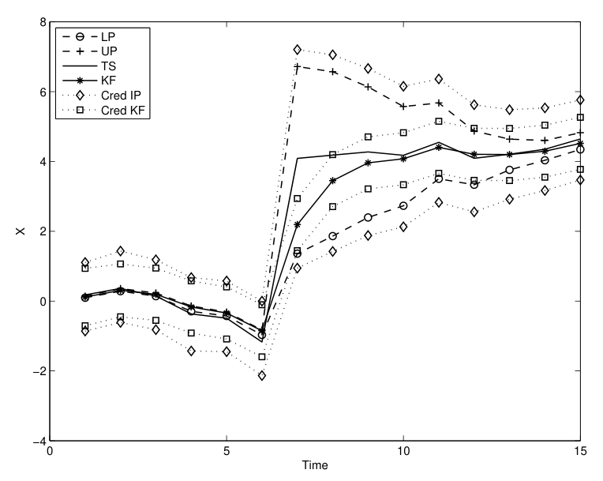
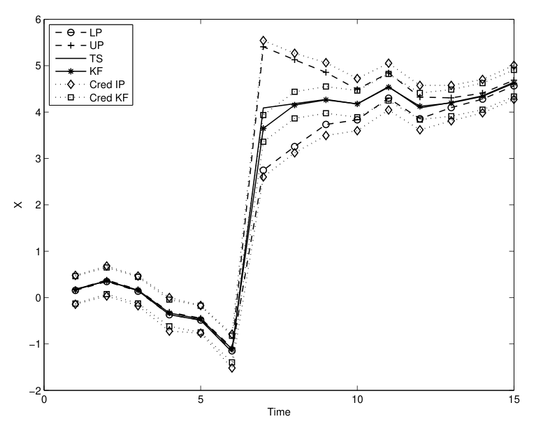
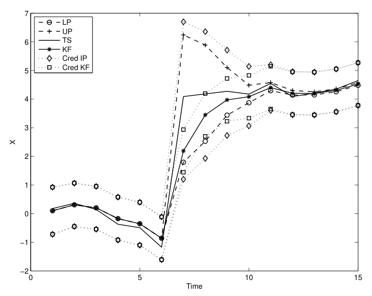
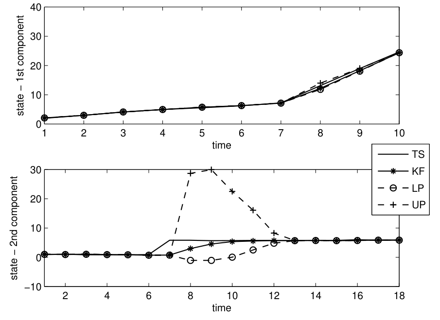

## Conversion notes

- Source: author manuscript dated 28 Oct 2010 (15 pages, two-column IEEE style) from the first author's page (idsia.ch/~alessio). Authors: Alessio Benavoli, Marco Zaffalon, Enrique Miranda. Published version: IEEE Transactions on Automatic Control 56(7):1567-1581 (2011), doi:10.1109/TAC.2010.2090707; numbering and wording may differ slightly from the published article.
- No TeX source exists: all mathematics, equations (1)-(52) and unnumbered displays, was transcribed to LaTeX from high-resolution page crops; lower/upper previsions and expectations use \underline{...} / \overline{...} and every bar and tilde was read from the crops. The authors' inconsistencies are kept as printed (e.g. E_{Z_{O\cup I}} in Example 3, stray comma and open bracket chains in (13), lowercase x_0 / x_k on page 8, y^t without tilde in Theorems 2-4, C' versus C^T in (49)).
- Theorem-like blocks (Definition, Theorem, Corollary, Example, Remark, Proof) carry bold printed labels; statement bodies, printed in italics, are upright here. There is no appendix; proofs are inline. Displays are separate blocks; a sentence continuing after a display starts on a new line.
- Figures 1-4 are image crops. The two unnumbered tables of test cases on page 13 are table-cases-1-4-p0013 and table-case-5-p0013 (plain-Unicode cells). Author portraits on the last page are omitted; biographies are kept. Figs. 2-4 (printed after the 'Software availability' heading) are placed before it, inside Section VII. Footnote markers are written [^n] in the running text and the footnote text follows as a paragraph starting 'Footnote n:'.

<!-- PDF page 1 -->

# Robust filtering through coherent lower previsions

A. Benavoli$^{1}$, M. Zaffalon$^{1}$, E. Miranda$^{2}$

**Authors’ addresses:** $^{1}$Istituto Dalle Molle di Studi sull’Intelligenza Artificiale (IDSIA), Lugano, Switzerland. e-mail: {alessio,zaffalon}@idsia.ch; $^{2}$Universidad de Oviedo, Oviedo, Spain, mirandaenrique@uniovi.es.

***Abstract*—The classical filtering problem is re-examined to take into account imprecision in the knowledge about the probabilistic relationships involved. Imprecision is modeled in this paper by closed convex sets of probabilities. We derive a solution of the state estimation problem under such a framework that is very general: it can deal with any closed convex set of probability distributions used to characterize uncertainty in the prior, likelihood, and state transition models. This is made possible by formulating the theory directly in terms of coherent lower previsions, that is, of the lower envelopes of the expectations obtained from the set of distributions. The general solution is specialized to two particular classes of coherent lower previsions. The first consists of a family of Gaussian distributions whose means are only known to belong to an interval. The second is the so-called linear-vacuous mixture model, which is a family made of convex combinations of a known nominal distribution (e.g., a Gaussian) with arbitrary distributions. For the latter case, we empirically compare the proposed estimator with the Kalman filter. This shows that our solution is more robust to the presence of modelling errors in the system and that, hence, appears to be a more realistic approach than the Kalman filter in such a case.**

***Index Terms*—Coherent lower previsions, epistemic irrelevance, robustness, Kalman filter.**

## I. INTRODUCTION

This paper deals with the problem of estimating the state of a discrete-time stochastic dynamical system on the basis of observations. One way of approaching this problem is to assume that the dynamics, the initial condition, and the observations are corrupted by noise contributors with _known distributions_ and then to find the conditional distribution of the state given the past observations. This is the so-called Bayesian state estimation approach.

If the dynamics and observations are linear functions of the state and the noise contributors are assumed to be Gaussian, it is well known that the optimal solution of the Bayesian state estimation problem is the Kalman filter (KF). In the non-linear/non-Gaussian case, an analytic solution of Bayesian state estimation is in general not available in closed form and a numerical or analytical approximation is required. The extended Kalman filter is the most known analytical approximation of the Bayesian state estimation problem for non-linear systems. Conversely, among the numerical techniques, the ones used most frequently are based on Monte Carlo sampling methods, see for instance [1], [2], [3].

A common trait to these techniques is that they assume that the distributions associated with the prior, state transition, and likelihood functions are perfectly known. However, in

many practical cases, our information about the system to be modeled may not allow us to characterize these functions with single (precise) distributions. For example, in the Gaussian case, we may only be able to determine an interval that contains the mean of the Gaussian distribution or, in more general cases, we may only be able to state that the distribution of the noise belongs to some set of distributions.

One possible solution to deal with a set of distributions is the so-called _Bayesian sensitivity analysis_ or Bayesian robustness [4] approach. Its basic idea is to check the robustness of the estimate by applying Bayes’ rule to each pair of distributions in the set of prior and/or in the set of likelihood distributions in order to form a set of posterior distributions and to check whether all these posteriors lead to the same conclusions (e.g., the same estimate or the same credible interval). When this is the case, we declare that the model (i.e., the sets of distributions) is robust and that the conclusions from any particular pair of distributions are reliable. Conversely, when this is not the case the model is unreliable, and we can devise three possible ways to overcome the problem.

The first consists of narrowing the sets of prior and likelihood functions through additional elicitation or obtaining additional data, hopefully resulting in an increased robustness. This approach is not always possible for several reasons (cost, time, hardness of the problem).

The second alternative consists of replacing the set of prior/likelihood functions by a single element obtained by some kind of criterion such as, for instance, “averaging” over the class as in the hierarchical Bayesian approach. The basic idea is to consider a (finite) sets of priors and/or likelihoods, to use observations to compute the corresponding set of posteriors and, finally, to average them according to some criterion. For a review of various techniques for model averaging see [5], [6], [7]. For instance, in [7] the idea is to estimate the averaging weights from measurements. In this way, robustness is gained also through adaptability. Model averaging has proven to be effective in several practical problems but it also has some robustness problems w.r.t. the choice of model priors and model transition probabilities.

The third path to robustness is based on a negative answer to the following question [4]: When different reasonable priors or likelihoods yield substantially different answers, is it reasonable to state that there is a single answer? The idea is then to deal with all elements of the class of priors/likelihoods. This leads to alternative models of representation of uncertainty based on a set of probability distributions, such as $p$-boxes for instance. A $p$-box [8] is an enclosure of the Cumulative Distribution Function (CDF) of a random variable, $F_l \le F \le F_u$, which is used to model partial ignorance about specifications of the CDF $F$, where $F_l$ is the so-called lower

<!-- PDF page 2 -->

distribution and $F_u$ upper distribution. Also Choquet capacities [9] and belief functions [10] can be included in this set of alternative models, since they can be seen as special cases of closed-convex sets of probability distributions.

These techniques have also been applied successfully in many cases. For instance, in [11] a $p$-box representation of the set of probability distributions is used for robust estimation. In [12], the KF with a diffuse prior is derived in the context of belief functions. Other approaches are the set-valued Kalman filter [13] or the projection-based approach [14] that model the initial state uncertainty as a convex set of probability distributions. On the other hand, in [15], both system and measurement noise are modeled with convex sets of probability density functions by also assuming that these convex sets are polytopes (here polytope means the convex hull of a finite number of distributions). Another possibility to deal with uncertainty is to consider a worst-case approach (i.e., to consider the worst-case distribution in the set), leading to minimax-estimators, as in [16], [17].

We should also like to mention here a slightly different approach to robustness that is presented in [18], [19] for the case of linear state models. The authors assume that the distributions of the noise terms belong to a set of unknown (non-Gaussian) distributions with known finite second moments. The main goal in these papers is not to solve the Bayesian estimation by propagating this set of distributions (and this is one of the reasons the proposed method differs from the aforementioned ones and from the one we present in this paper) but rather to provide a bound for the probability of the KF estimation error exceeding certain threshold values (this probabilistic bound is computed in a manner similar to the Chebyshev inequality). By doing this, a tight outer approximation of the true confidence intervals for the estimate of the state provided by the KF can be computed. This is another reason the proposed method differs from the one we present in this paper which, conversely, aims to compute exact robust confidence intervals. A similar path to [18], [19] is followed in [20]; the method there is based on asymptotic theory that requires that the distributions of the noise terms become asymptotically Gaussian.

In this paper, we follow the third path to robustness using Walley’s theory of _coherent lower previsions_ [21], which is also referred to as _Imprecise Probability_ (IP). In this context, standard probability theory, which models uncertainty by using a single probability distribution, is referred to as _precise probability_. The choice of Walley’s theory is motivated by the fact that the alternative models of representation of uncertainty discussed above can all be regarded as special cases of _coherent lower previsions_ [21]. A _Coherent Lower Prevision_ (CLP) is the lower envelope of expectations with respect to a closed convex set of probability distributions. Thus, CLPs can be easily interpreted in Bayesian sensitivity analysis, i.e., if we specify a family of precise models, they determine CLPs by taking their lower envelopes. However, it is also more general on some aspects [21]. One important difference in the context of this paper is related to the modelling of the notion of independence: with the Bayesian sensitivity analysis interpretation we must require that all the admissible models

one starts from satisfy the standard notion of independence; with CLPs, however, there are a number of less restrictive possibilities [22]. Among these, we shall consider in the sequel the notion of _epistemic irrelevance_. We refer to [21, Sects. 2.10 and 5.9] for a further comparison of the theory of CLPs with the Bayesian sensitivity analysis approach.

Let us summarize the main contributions of this paper. We study the problem of estimating the state of a dynamical system when we do not have enough information to describe the prior, the state transition and the likelihood models with (single) precise probabilities. Instead, we shall model our uncertainty about the variables of interest by means of CLPs, and derive a solution of the state estimation problem for the general case of CLPs. Our approach has the following characteristics. First, we can deal with any closed convex set of probability distributions used to characterize uncertainty in the prior, likelihood and state transition models. This is the main contribution of the paper and generalizes the results in [11], [13], [14], [15], [17], [18], [19] and [20]. Second, our solution allows us to work directly with CLPs, i.e., the lower envelopes of the set of probability distributions. This is an important difference between our paper and the usual approaches in literature for state estimation with a closed convex set of probability distributions [15], which consists of directly processing the distributions in the set. In those approaches, an essential assumption is to require the closed convex set of probability distributions to be a polytope with finite sets of vertices (in this context vertex means an extreme point of the set of distributions). Then a Bayesian estimator is derived by element-wise processing the vertices of the polytopes associated with the prior (or to the previously computed posterior), likelihood and state transition models. A drawback of this approach is that the number of vertices needed to characterize the convex sets increases exponentially over the number of time steps [15]. This problem is overcome in our model by working directly with lower envelopes as we do not need to explicitly compute the vertices. This nevertheless, our approach guarantees that the conclusions drawn are equivalent [21] to those we should obtain by element-wise processing the distributions in the closed convex sets.

Third, we extend the ideas behind Bayesian decision making for state estimation to the CLP framework. Bayesian methodology for decision making provides the estimate which minimizes the expected posterior risk. If in particular we consider a squared error loss risk, the Bayesian estimate is the mean of the posterior distribution. This estimation is provided in general together with its _credibility region_ (also called confidence region), i.e., the region whose probability of including the true value of the state exceeds a certain threshold. By extending these ideas to CLPs, we calculate the lower and upper mean of the state and a robust (CLP-based) version of the credibility region. In particular, the robust credibility region is evaluated by determining the minimum volume region whose _lower probability_ of including the true value of the state exceeds a certain bound. This allows us to derive more reliable inferences. In this respect, the idea of computing a robust credibility region is similar to the approach followed in [18], [19] for decision making. However,

<!-- PDF page 3 -->

as already discussed above in this section, our approach differs from the one in [18], [19] in the way these credibility regions are derived.

Our general solution is then specialized for two particular classes of CLPs. The first consists of a family of Gaussian distributions whose means are only known to lie in an interval. This model can be used to address estimation problems based on measurements that are affected by an unknown but bounded bias but, also, to describe uncertainties in the system parameters as in [17]. The second is the so-called _linear-vacuous mixture_ [21] or $\epsilon$-contamination model [4], which is the family of all convex combinations of a known nominal distribution (e.g., Gaussian) with arbitrary distributions. This family can be used to address estimation problems in which we take into account that our model (nominal distribution) can be inexact and, thus, we perturb (contaminate) it to reflect this modelling uncertainty. For the _linear-vacuous mixture_ model, we empirically compare the proposed estimator with the KF and show that our solution is more robust to modelling errors and that, hence, it outperforms the KF in such a case. Some of the preliminary results of this work can be found in [23], and results on statistical inference with CLPs in finite spaces can be found in [24].

## II. BAYESIAN FILTERING

Let us summarize the basic principles of Bayesian filtering. Its goal is the estimation of the state variables of a discrete-time nonlinear system which is “excited” by a sequence of random vectors. It is assumed that nonlinear combinations of the state variables corrupted by noise are observed. We have thus

$$\left\{\begin{array}{rcl} x_{t+1} &=& f(t,x_t)+w_t \\ y_t &=& h(t,x_t)+v_t, \end{array}\right. \tag{1}$$

where $t$ is the time, $x_t \in \mathbb{R}^n$ is the state vector at time $t$, $w_t \in \mathbb{R}^n$ is the process noise, $y_t \in \mathbb{R}^m$ is the measurement vector, $v_t \in \mathbb{R}^m$ is the measurement noise and $f(\cdot)$ and $h(\cdot)$ are known nonlinear functions. Having observed a finite sequence $y^t = \{y_1, \ldots, y_t\}$ of measurements, we may, in general, seek for an estimate of an entire sequence of states $x^t = \{x_0, \ldots, x_t\}$.

In the Bayesian framework, all relevant information on $x^t = \{x_0, \ldots, x_t\}$ at time $t$ is included in the posterior distribution $p(x^t|y^t)$. In general, a Markov assumption is made to model the system, which implies the following independence conditions:

$$p(x_t|x^{t-1}) = p(x_t|x_{t-1}), \quad p(y^t|x^t) = \prod_{k=1}^{t} p(y_k|x_k).$$

Using these assumptions the probability density function (PDF) over all states can be written simply as:

$$p(x^t|y^t) = \frac{p(x^{t-1}|y^{t-1})\,p(x_t|x_{t-1})\,p(y_t|x_t)}{p(y_t|y^{t-1})}. \tag{2}$$

In many applications, we are interested in estimating $p(x_t|y^t)$, one of the marginals of the above PDF. This is the so-called

_Bayesian filtering problem_. We have

$$\begin{aligned} p(x_t|y^t) &= \frac{p(x_t|y^{t-1})}{p(y_t|y^{t-1})}\,p(y_t|x_t) \\ &= \int\limits_{x_{t-1}} dx_{t-1}\ \frac{p(x_t|x_{t-1})\,p(y_t|x_t)\,p(x_{t-1}|y^{t-1})}{p(y_t|y^{t-1})}. \end{aligned} \tag{3}$$

From (2) and (3), we see that both $p(x^t|y^t)$ and $p(x_t|y^t)$ can be obtained recursively. Once $p(x_t|y^t)$ has been computed, it is possible to compute the expected value $E[g(x_t)|y^t]$ w.r.t. $p(x_t|y^t)$ for any function $g(x_t)$ of interest. A particular case of Eq. (1) is given by

$$\left\{\begin{array}{rcl} x_{t+1} &=& A_t x_t + w_t \\ y_t &=& C_t x_t + v_t, \end{array}\right. \tag{4}$$

with $w_t \sim \mathcal{N}(0,Q_t)$, $v_t \sim \mathcal{N}(0,R_t)$, $x_0 \sim \mathcal{N}(\hat{x}_0,P_0)$, and where the matrices $A_t$, $C_t$, $Q_t$, $R_t$ are assumed to be known at each time step $t$. Then the conditional PDF $p(x_t|y^t)$ is also Gaussian $\mathcal{N}(\hat{x}_t,P_t)$ where $\hat{x}_t = A_t\hat{x}_{t-1} + L_t[y_t - C_tA_t\hat{x}_{t-1}]$, $P_t = A_tP_{t-1}A_t^T + Q_t - L_tS_tL_t^T$, $S_t = C_t[A_tP_{t-1}A_t^T + Q_t]C_t^T + R_t$, $L_t = [A_tP_{t-1}A_t^T + Q_t]C_t^TS_t^{-1}$ and where $T$ denotes the transpose operator. These are the equations of the Kalman filter.

## III. COHERENT LOWER PREVISIONS

In this section we give an overview of the theory of coherent lower previsions. This is a theory of probability generalized to handle imprecisely specified probabilities through sets of distributions. Despite being a theory of probability, its formulation may look unusual to the reader familiar with more traditional ways to present probability, and this can make the theory somewhat uneasy to access. Because of this fact, we shall point out here informally some of the differences in the formulations, in order to help the reader have a smoother start into the theory. In particular, in this section we shall review the main concepts of CLPs that we shall use later in the paper to derive the solution of the filtering problem. We refer the reader to [21] for an in-depth study of coherent lower previsions, and to [25] for a survey of the theory.

Probability theory is most often defined, after Kolmogorov, using a triple made of a _sample space_, a _sigma algebra_, and a _probability function_ $P$. The functions from the sample space into the real numbers that are measurable with respect to the sigma algebra are called _random variables_. The expectation of a random variable is defined on the basis of the probability $P$. Conditional probability is also defined using $P$ but only when the conditioning event is assigned positive probability by $P$.

The theory of CLPs has its focus on expectation rather than probability. We still have the sample space (which is usually referred to as the _possibility space_ $\Omega$). We also have a set of random variables, which are called _gambles_: these are bounded functions from the possibility space to the real numbers. The set of gambles does not need to be concerned with measurability questions, that is, it can be chosen arbitrarily. Finally, a CLP is defined as a functional, from the set of gambles to the real numbers, that satisfies some rationality criteria (self-consistency). This function is conjugate to another that

<!-- PDF page 4 -->

is called a coherent upper prevision. The intuition behind the notions of coherent lower and upper previsions is that of lower and upper expectation functionals.[^1] When a CLP coincides with its conjugate coherent upper prevision, it is called a _linear prevision_, and it corresponds with the expectation functional with respect to a finitely additive probability. In general, a CLP is in a one-to-one correspondence with a set of linear previsions, and can therefore be regarded a set of probability distributions.

When the set of gambles where we apply the CLP are all indicator functions of events, the CLP is called a _coherent lower probability_, and its conjugate is called a coherent _upper_ probability. When these two functionals coincide, we obtain the familiar notion of probability. One important remark is that in the precise case there is no difference between working with events (probabilities) or gambles (expectations), and therefore a linear prevision is always determined by its restriction to events, which is a finitely additive probability. This is no longer the case when imprecision enters the picture: a CLP is not necessarily determined by the coherent lower probability which is given by its restriction to indicators of events, and this is why the theory is formulated in general in terms of gambles [21].

In the conditional framework, the differences between the precise and the imprecise theories are even more marked. For instance, a conditional lower prevision can be defined without any reference to an unconditional one, and it can even be defined when the conditioning event has (lower or upper) probability equal to zero [21, Ch. 6]. In a sense, the notion of conditional lower prevision is the fundamental one, and the unconditional notion can be derived as a special case. This change of perspective originates an issue that is not perceived in the theories that regard conditional probability as a derived notion: that when we specify a set of conditional lower previsions, it is not guaranteed that those conditionals are automatically self-consistent. The theory of CLPs deals with this problem by imposing a notion called _joint_ (or strong) _coherence_. This notion implies the existence of a global model (an unconditional joint lower prevision) which is compatible with all the CLPs. Even more strongly, joint coherence also prevents some inconsistencies to arise when conditioning on sets of zero lower probability [21, Ch. 7], which is not guaranteed by the existence of the global model alone.

### A. Main definitions and results

Consider variables $Z_1, \ldots, Z_n$, taking values in the sets $\mathcal{Z}_1, \ldots, \mathcal{Z}_n$, respectively. For any subset $J \subseteq \{1, \ldots, n\}$ we shall denote by $Z_J$ the (new) variable $Z_J = (Z_j)_{j\in J}$, which takes values in the product space $\mathcal{Z}_J = \times_{j\in J}\mathcal{Z}_j$. We shall also use the notation $\mathcal{Z}^n$ for $\mathcal{Z}_{\{1,\ldots,n\}}$. This will be our possibility space in this paper. Note that, with this notation, we can deal with both sets of variables or sets of vectors.

**Definition 1.** For any subset $J$ of $\{1, \ldots, n\}$, a *gamble* $f$ on $\mathcal{Z}_J$ is a bounded real-valued function $f : \mathcal{Z}_J \to \mathbb{R}$. The set of all gambles on $\mathcal{Z}_J$ is denoted by $\mathcal{L}(\mathcal{Z}_J)$. $\blacksquare$

A gamble represents an uncertain reward which depends on the a priori unknown value $Z_J = z_J$, i.e., if $z_J$ turns out to be the true value of $Z_J$, we receive an amount $f(z_J)$ of utility.[^2]

**Definition 2.** Consider two disjoint subsets $O \neq \emptyset, U$ of $\{1, \ldots, n\}$. We call $E_{Z_O}(\cdot|Z_U)$ a conditional linear prevision on the set of gambles $\mathcal{L}(\mathcal{Z}_{O\cup U})$, if the following conditions hold for all $z_U \in \mathcal{Z}_U$, $f, g \in \mathcal{L}(\mathcal{Z}_{O\cup U})$,[^3] and $\lambda > 0$:

- $E_{Z_O}(f|z_U) \ge \inf_{\mathcal{Z}_O\times\{z_U\}} f$.
- $E_{Z_O}(\lambda f|z_U) = \lambda E_{Z_O}(f|z_U)$.
- $E_{Z_O}(f+g|z_U) = E_{Z_O}(f|z_U) + E_{Z_O}(g|z_U)$.

If $U = \emptyset$, this functional is called an *(unconditional) linear prevision* $E_{Z_O}(\cdot)$.[^4] $\blacksquare$

Note that linear previsions correspond to expectations. Hence, if $E_{Z_O}$ is a linear prevision on $\mathcal{L}(\mathcal{Z}_O)$, then we can define a mass function $p_{Z_O}$ on the power set of $Z_O$ as follows: $p_{Z_O}(A) = E_{Z_O}(I_A)$, where $I_A$ is the _indicator function_ of the subset $A$ of $\mathcal{Z}_O$, given by $I_A(w) = 1$ if $w$ belongs to $A$, and $I_A(w) = 0$ otherwise. It turns out that the functional $p_{Z_O}$ thus defined is a (finitely additive) probability measure, and $E_{Z_O}$ is the expectation with respect to $p_{Z_O}$. For instance, when $\mathcal{Z}_O$ is discrete, we have the equality

$$E_{Z_O}(f) = \sum_{z_O\in\mathcal{Z}_O} f(z_O)\,p_{Z_O}(z_O).$$

We can make a similar comment for conditional linear previsions: if $E_{Z_O}(\cdot|Z_U)$ is a conditional linear prevision on the set of gambles $\mathcal{L}(\mathcal{Z}_{O\cup U})$, then for every $z_U \in \mathcal{Z}_U$ the functional $E_{Z_O}(\cdot|z_U)$ is the conditional expectation with respect to a probability $p_{Z_O}(\cdot|z_U)$.

**Definition 3.** Consider two disjoint subsets $O \neq \emptyset, U$ of $\{1, \ldots, n\}$. We call $\underline{E}_{Z_O}(\cdot|Z_U)$ a *separately coherent conditional lower prevision* on the set of gambles $\mathcal{L}(\mathcal{Z}_{O\cup U})$, if it is the lower envelope of a closed and convex set of conditional linear previsions, which we denote by $\mathcal{M}(\underline{E}_{Z_O}(\cdot|Z_U))$, i.e., if for all $z_U \in \mathcal{Z}_U$ it holds that

$$\underline{E}_{Z_O}(f|z_U) = \inf\left\{ E_{Z_O}(f|z_U) : E_{Z_O}(\cdot|z_U) \in \mathcal{M}(\underline{E}_{Z_O}(\cdot|z_U)) \right\}. \tag{5}$$

$\blacksquare$

Lower previsions can be regarded as _lower expectation_ functionals. Conditional lower previsions can also be given the following axiomatic characterisation:

**Theorem 1.** $\underline{E}_{Z_O}(\cdot|Z_U)$ is a *separately coherent* conditional lower prevision on the set of gambles $\mathcal{L}(\mathcal{Z}_{O\cup U})$ if and only if the following conditions hold for all $z_U \in \mathcal{Z}_U$, $f, g \in \mathcal{L}(\mathcal{Z}_{O\cup U})$ and $\lambda > 0$:

- (SC1) $\underline{E}_{Z_O}(f|z_U) \ge \inf_{\mathcal{Z}_O\times\{z_U\}} f$.
- (SC2) $\underline{E}_{Z_O}(\lambda f|z_U) = \lambda \underline{E}_{Z_O}(f|z_U)$.
- (SC3) $\underline{E}_{Z_O}(f+g|z_U) \ge \underline{E}_{Z_O}(f|z_U) + \underline{E}_{Z_O}(g|z_U)$.

$\blacksquare$

Footnote 1: The reason we use the terms previsions for expectations and gambles for utility functions is because the theory of CLPs is based on the behavioral subjective approach to probability (see Remark 1 later on for more details).

Footnote 2: In the filtering problem, $f$ can be the state variable (to compute the mean), the quadratic-error (to compute the variance), etc.

Footnote 3: Note that in the domain $\mathcal{L}(\mathcal{Z}_{O\cup U})$ we can also include the gambles $f$ on $\mathcal{Z}_O$, by making a correspondence with a gamble $f'$ given by $f'(z_{O\cup U}) := f(z_O)$ for each compatible $z_O \in \mathcal{Z}_O$ and $z_{O\cup U} \in \mathcal{Z}_{O\cup U}$.

Footnote 4: As discussed at the beginning of this section, we can regard the notion of conditional previsions as the fundamental one, and the unconditional notion as a special case.

<!-- PDF page 5 -->

The necessity of the conditions (SC1)–(SC3) in this theorem can easily be established using Expression (5): for instance, in the case of (SC3) we can use the linearity of the expectation operator $E_{Z_O}(\cdot|z_U)$ to see that $E_{Z_O}(f+g|z_U) = E_{Z_O}(f|z_U) + E_{Z_O}(g|z_U)$ for each $f, g \in \mathcal{L}(\mathcal{Z}_{O\cup U})$. Using now Eq. (5) together with the fact that $\inf[E_{Z_O}(f|z_U) + E_{Z_O}(g|z_U)] \ge \inf E_{Z_O}(f|z_U) + \inf E_{Z_O}(g|z_U)$, we deduce (SC3).

The (conditional) lower prevision of a gamble can be regarded as a lower bound for its expectation. Any conditional lower prevision is conjugate to another functional, called conditional _upper_ prevision, and which is given by $\overline{E}_{Z_O}(f|z_U) = -\underline{E}_{Z_O}(-f|z_U)$ for all gambles $f$. A conditional upper prevision is called separately coherent when its conjugate conditional lower prevision is, and in that case it is the upper envelope of the set $\mathcal{M}(\underline{E}_{Z_O}(\cdot|Z_U))$. Upper previsions can be regarded as _upper expectation_ functionals. A conditional linear prevision corresponds to the case where a conditional lower prevision coincides with its conjugate upper prevision, i.e., $\underline{E}_{Z_O}(f|z_U) = \overline{E}_{Z_O}(f|z_U)$. More generally, we have

$$\underline{E}_{Z_O}(f|z_U) \le E_{Z_O}(f|z_U) \le \overline{E}_{Z_O}(f|z_U)$$

for any $E_{Z_O}(\cdot|z_U) \in \mathcal{M}(\underline{E}_{Z_O}(\cdot|z_U))$.

The representation of CLPs in terms of sets of linear previsions allows us to give them a _Bayesian sensitivity analysis_ representation. Assume that, because of lack of knowledge about the probability of the different $f(z_O)$ for all $z_O \in \mathcal{Z}_O$, we are not able to define the expected utility (linear prevision) $E_{Z_O}(\cdot|z_U)$ for $f$, but only to place $E_{Z_O}(\cdot|z_U)$ among a set of possible candidates, $\mathcal{M}(\underline{E}_{Z_O}(\cdot|z_U))$. Then the inferences we can make from $\mathcal{M}(\underline{E}_{Z_O}(\cdot|z_U))$ are equivalent to the ones we can make using the lower envelope $\underline{E}_{Z_O}(\cdot|z_U)$ of this set. This lower envelope is a CLP. Hence, all the developments we make with CLPs can also be made with the set of their associated expectation operators, which are linear previsions. In this sense, there is a strong link between this theory and robust Bayesian analysis [4].

**Remark 1.** Stemming from de Finetti’s [26] work on subjective probability, coherent lower previsions can also be given a behavioural interpretation in terms of buying and selling prices. Let us briefly sketch how this is done.

If we interpret a gamble $f$ on $\mathcal{Z}_J$ as a random reward, which depends on the a priori unknown value $Z_J = z_J$, then the prevision $E_{Z_J}(f)$ represents a subject’s fair price for the gamble $f$. This means that he should be disposed to accept the uncertain rewards $f - E_{Z_J}(f) + \epsilon$ (i.e., to *buy* $f$ at the price $E_{Z_J}(f) - \epsilon$) and $E_{Z_J}(f) - f + \epsilon$ (i.e., to *sell* $f$ at the price $E_{Z_J}(f) + \epsilon$) for every $\epsilon > 0$.

More generally, the supremum acceptable buying price and the infimum acceptable selling prices for a gamble need not coincide, meaning that there may be a range of prices $[a, b]$ for which our subject is neither disposed to buy nor to sell $f$ at a price $k \in [a, b]$. His supremum acceptable buying price for $f$ is then his lower prevision $\underline{E}_{Z_J}(f)$, and it holds that the subject is disposed to accept the uncertain reward $f - \underline{E}_{Z_J}(f) + \epsilon$ for every $\epsilon > 0$; and his infimum acceptable selling price for $f$ is his upper prevision $\overline{E}_{Z_J}(f)$, meaning

that he is disposed to accept the reward $\overline{E}_{Z_J}(f) - f + \epsilon$ for every $\epsilon > 0$. A consequence of this interpretation is that $\underline{E}_{Z_J}(f) = -\overline{E}_{Z_J}(-f)$ for every gamble $f$ on $\mathcal{Z}_J$.

Similarly, given a gamble $f$ on $\mathcal{Z}_{O\cup U}$ and $z_U \in \mathcal{Z}_U$, the conditional lower prevision $\underline{E}_{Z_O}(f|z_U)$ represents the subject’s supremum acceptable buying price for the uncertain reward modelled by $f$, if he comes to know that the variable $Z_U$ has taken the value $z_U$. The conditional upper prevision $\overline{E}_{Z_O}(f|z_U)$ is then the subject’s infimum acceptable selling price for the uncertain reward modelled by $f$, if he comes to know that the variable $Z_U$ has taken the value $z_U$. Again, $\underline{E}_{Z_O}(f|z_U) = -\overline{E}_{Z_O}(-f|z_U)$ for any gamble $f$ on $\mathcal{Z}_{O\cup U}$ and any $z_U \in \mathcal{Z}_U$. $\blacksquare$

As we said before, in the case of linear previsions we have the equality $\underline{E}_{Z_O}(f|z_U) = \overline{E}_{Z_O}(f|z_U)$. This means that the set $\mathcal{M}(\underline{E}_{Z_O}(\cdot|z_U))$ includes a single linear prevision $E_{Z_O}(f|z_U)$. In this sense, we can see the classical expectation operator $E_{Z_O}(f|z_U)$ as the most informative CLP. On the other extreme, the least informative CLP is the so-called _vacuous prevision_:

**Example 1.** Given a subset $\mathcal{K}_O$ of $\mathcal{Z}_O$, the vacuous lower prevision $\underline{E}_{Z_O}$ on $\mathcal{L}(\mathcal{Z}_O)$ is given by

$$\underline{E}_{Z_O}(f|z_U) = \inf_{z_O\in\mathcal{K}_O} f(z_O).$$

It is associated to the set of linear previsions $\mathcal{M}(\underline{E}_{Z_O}) = \{E_{Z_O} : E_{Z_O}(\mathcal{K}_O) = 1\}$. It corresponds to the case where all the information we have is that the probability of $\mathcal{K}_O$ is $1$.

Similarly, we can define *vacuous conditional lower previsions* $\underline{E}_{Z_O}(\cdot|Z_U)$. Here, for each $z_U$ we can let $\underline{E}_{Z_O}(\cdot|z_U)$ be the vacuous CLP relative to some $\mathcal{K}_O^{z_U} \subseteq \mathcal{Z}_O$, given by

$$\underline{E}_{Z_O}(f|z_U) = \inf_{z_O\in\mathcal{K}_O^{z_U}} f(z_O, z_U);$$

note that $\mathcal{K}_O^{z_U} \subseteq \mathcal{Z}_O$ can vary with each $z_U \in \mathcal{Z}_U$. In this case, the set $\mathcal{M}(\underline{E}_{Z_O}(\cdot|z_U))$ would be those linear previsions satisfying $E_{Z_O}(\mathcal{K}_O^{z_U}|z_U) = 1$ for every $z_U \in \mathcal{Z}_U$. $\blacksquare$

Linear and vacuous previsions are two examples of CLPs. It follows from [21, Ch. 2] that we can construct CLPs by making convex combinations of the two. This gives rise to a special class of lower previsions that we introduce in the following example:

**Example 2.** For each $z_U \in \mathcal{Z}_U$, consider a linear prevision $E^*_{Z_O}(\cdot|z_U)$ and a subset $\mathcal{K}_O(z_U) \subseteq \mathcal{Z}_O$ and $0 \le \epsilon \le 1$. Define $\underline{E}_{Z_O}(\cdot|z_U)$ by

$$\underline{E}_{Z_O}(f|z_U) = \epsilon\, E^*_{Z_O}(f|z_U) + (1-\epsilon) \inf_{z_O\in\mathcal{K}_O(z_U)} f(z_O)$$

for any $f \in \mathcal{L}(\mathcal{Z}_{O\cup U})$. The CLP $\underline{E}_{Z_O}(\cdot|Z_U)$ we can define in this way is called a *linear-vacuous mixture*. It is the lower envelope of the so called $\epsilon$-contamination model [4], that is the class of the convex combinations of $E^*_{Z_O}(\cdot|z_U)$ with any linear prevision $E_{Z_O}(\cdot|z_U)$ that is associated to the vacuous model with respect to $\mathcal{K}_O^{z_U}$, or, in other words, such that $E_{Z_O}(\mathcal{K}_O^{z_U}|z_U) = 1$. $\blacksquare$

There are three additional features of the theory of coherent lower previsions that we shall use in our solution to the filtering problem. The first one is called the _generalized Bayes rule_ (GBR) [21, Sect. 6.4].

<!-- PDF page 6 -->

**Definition 4.** Let $\underline{E}_{Z_{O\cup U}}$ be an (unconditional) coherent lower prevision, and let $\underline{E}_{Z_{O\cup U}}(\cdot|Z_U)$ be a separately coherent CLP. It is said to satisfy the generalized Bayes rule with $\underline{E}_{Z_{O\cup U}}$ when for every $z_U \in \mathcal{Z}_U$ and every gamble $f \in \mathcal{L}(\mathcal{Z}_{O\cup U})$ the value $\underline{E}_{Z_O}(f|z_U)$ satisfies

$$\underline{E}_{Z_{O\cup U}}[I_{\{z_U\}}(f - \underline{E}_{Z_O}(f|z_U))] = 0. \tag{6}$$

$\blacksquare$

When $\underline{E}_{Z_{O\cup U}}(I_{\{z_U\}}) = \underline{E}_{Z_{O\cup U}}(I_{\{z_U\times\mathcal{Z}_O\}}) = 0$, Eq. (6) may have an infinite number of possible solutions, the smallest of which is $\inf_{\omega\in\{\{z_U\}\times\mathcal{Z}_O\}} f(\omega)$; however, when $\underline{E}_{Z_{O\cup U}}(I_{\{z_U\}}) > 0$ there is only one value of $\underline{E}_{Z_O}(f|z_U)$ satisfying Eq. (6). Hence, in that case we can use GBR to derive a separately coherent CLP from an unconditional one.

This rule generalizes Bayes’ rule from classical probability theory to CLPs. When it holds that $\underline{E}_{Z_{O\cup U}}(I_{\{z_U\}}) > 0$ and we define $\underline{E}_{Z_O}(f|z_U)$ via the Generalized Bayes Rule, then it is the lower envelope of the conditional linear previsions $E_{Z_O}(f|z_U)$ that we can define using Bayes’ rule on the elements of $\mathcal{M}(\underline{E}_{Z_{O\cup U}})$, as we detail next:

**Example 3.** From Eq. (6), it follows that $0 = \underline{E}_{Z_{O\cup U}}[I_{\{z_U\}}(f-\mu)]$ is equal to

$$\begin{aligned} \inf\ &\left\{ E_{Z_{O\cup U}}[I_{\{z_U\}}(f-\mu)] : E_{Z_{O\cup U}} \in \mathcal{M}(\underline{E}_{Z_{O\cup U}}) \right\} \\ =\ &\inf\left\{ E_{Z_{O\cup U}}(I_{\{z_U\}}f) - \mu E_{Z_{O\cup U}}(I_{\{z_U\}}) \right. \\ &\qquad\quad \left. : E_{Z_{O\cup U}} \in \mathcal{M}(\underline{E}_{Z_{O\cup U}}) \right\}. \end{aligned}$$

Assume now that $\underline{E}_{Z_{O\cup U}}(I_{\{z_U\}}) > 0$ and thus $E_{Z_{O\cup U}}(I_{\{z_U\}}) > 0$ for all $E_{Z_{O\cup I}} \in \mathcal{M}(\underline{E}_{Z_{O\cup U}})$. Then the above infimum is equal to

$$\inf\left\{ E_{Z_{O\cup U}}(I_{\{z_U\}}) \left[ \frac{E_{Z_{O\cup U}}(I_{\{z_U\}}f)}{E_{Z_{O\cup U}}(I_{\{z_U\}})} - \mu \right] : E_{Z_{O\cup U}} \in \mathcal{M}(\underline{E}_{Z_{O\cup U}}) \right\}.$$

Hence, solving w.r.t. $\mu$, it follows that the unique solution is:

$$\begin{aligned} \mu &= \inf\left\{ \frac{E_{Z_{O\cup U}}(I_{\{z_U\}}f)}{E_{Z_{O\cup U}}(I_{\{z_U\}})} : E_{Z_{O\cup U}} \in \mathcal{M}(\underline{E}_{Z_{O\cup U}}) \right\} \\ &= \inf\left\{ E_{Z_O}(f|z_U) : E_{Z_{O\cup U}} \in \mathcal{M}(\underline{E}_{Z_{O\cup U}}) \right\}. \end{aligned} \tag{7}$$

$\blacksquare$

We introduced earlier in this section the notion of separate coherence, which states that the information provided by a CLP is self-consistent. However, when we have more than one CLP we must verify the consistency of all the assessments taken together. This is what we call _joint coherence_, and it is studied in much detail in [21, Ch. 7]. This notion implies the existence of a global model (an unconditional joint lower prevision) which is compatible with all the CLPs. Even more strongly, joint coherence also prevents some inconsistencies to arise when conditioning on sets of zero lower probability, which is not guaranteed by the existence of the global model alone. It turns out that joint coherence becomes GBR when we have one conditional and one unconditional CLP, and when the sample spaces are finite. The intuition of joint coherence in that case is that, according to Eq. (7), each conditional

linear prevision in $\mathcal{M}(\underline{E}_{Z_O}(\cdot|Z_U))$ is obtained by applying the classical Bayes rule on a joint linear prevision in $\mathcal{M}(\underline{E}_{Z_{O\cup U}})$.

When we have hierarchical information, i.e., a finite number of CLPs conditional on a sequence of nested variables, a way to combine them into an unconditional coherent lower prevision while maintaining the property of joint coherence is by means of a procedure called _marginal extension_ [21, Theorem 6.7.2], [27]. It is a generalisation of the law of total probability, or chain rule:

**Definition 5.** Let $\underline{E}_{Z_{O_1}}, \underline{E}_{Z_{O_2}}(\cdot|Z_{U_2}), \ldots, \underline{E}_{Z_{O_m}}(\cdot|Z_{U_m})$ be separately coherent conditional lower previsions with respective domains $\mathcal{L}(\mathcal{Z}_{O_1}), \mathcal{L}(\mathcal{Z}_{O_1\cup U_1}), \ldots, \mathcal{L}(\mathcal{Z}_{O_m\cup U_m})$, where $U_1 = \emptyset$ and $U_j = \cup_{i=1}^{j-1}(U_i \cup O_i) = U_{j-1} \cup O_{j-1}$ for $j = 2, \ldots, m$. Their *marginal extension* to $\mathcal{L}(\mathcal{Z}^n)$ is given by

$$\underline{E}(f) = \underline{E}_{Z_{O_1}}(\underline{E}_{Z_{O_2}}(\ldots(\underline{E}_{Z_{O_m}}(f|Z_{U_m})|\ldots)|Z_{U_2})), \tag{8}$$

and it is CLP. $\blacksquare$

This procedure becomes the law of total probability in the case of linear previsions and finite spaces. But it is applicable in more general situations: for instance, when we are dealing with infinite spaces or when we have lower previsions instead of linear ones [27].

We conclude this section by recalling the notion of _epistemic irrelevance_, which generalizes to CLPs the notion of independence between variables [21, Sec. 9.1.1].[^5]

**Definition 6.** Given the coherent lower prevision $\underline{E}_{Z_i}(\cdot|Z_j, Z_k)$, we say that $Z_j$ is *epistemically irrelevant* to $Z_i$ conditional on $Z_k$ if there is $\underline{E}_{Z_i}(\cdot|Z_k)$ such that $\underline{E}_{Z_i}(\cdot|Z_j, Z_k) = \underline{E}_{Z_i}(\cdot|Z_k)$. $\blacksquare$

In other words, this means that we have the following equality:

$$\begin{aligned} \underline{E}_{Z_i}(f|z_j, z_k) &= \inf\left\{ E_{Z_i}(f(\cdot, z_j, z_k)|z_j, z_k) \right. \\ &\qquad\quad \left. : E_{Z_i}(\cdot|z_j, z_k) \in \mathcal{M}(\underline{E}_{Z_i}(\cdot|z_j, z_k)) \right\} \\ &= \inf\left\{ E_{Z_i}(f(\cdot, z_j, z_k)|z_k) \right. \\ &\qquad\quad \left. : E_{Z_i}(\cdot|z_k) \in \mathcal{M}(\underline{E}_{Z_i}(\cdot|z_k)) \right\} \\ &= \underline{E}_{Z_i}(f|z_k), \end{aligned} \tag{9}$$

for all $f \in \mathcal{L}(\mathcal{Z}_i \times \mathcal{Z}_j \times \mathcal{Z}_k)$, $z_j \in \mathcal{Z}_j$ and $z_k \in \mathcal{Z}_k$. Note that epistemic irrelevance imposes the equality between the infima, but does not make any additional constraints on the corresponding linear previsions in $\mathcal{M}(\underline{E}_{Z_i}(\cdot|z_j, z_k))$ and $\mathcal{M}(\underline{E}_{Z_i}(\cdot|z_k))$.

## IV. GENERALISATION OF BAYESIAN STATE ESTIMATION

In this section, we generalize the Bayesian state estimation discussed in Sec. II to Walley’s theory of coherent lower previsions, and show that Bayesian state estimation is included in our model as a particular case.

Footnote 5: Other possible generalisations of independence for CLPs can be found in [21, Ch. 9]. In this paper we shall restrict our attention to epistemic irrelevance.

The aim of Bayesian state estimation is to compute the conditional linear prevision of $X_t$ given $\{Y_1 = y_1, Y_2 = y_2, \ldots, Y_t = y_t\}$, $E_{X_t}[\cdot|Y^t = y^t]$. Hereafter we assume

<!-- PDF page 7 -->

$X_k \in \mathcal{X}_k$ and $Y_k \in \mathcal{Y}_k$ for each $k$, where $\mathcal{X}_k$ and $\mathcal{Y}_k$ are bounded subsets of $\mathbb{R}^n$ and $\mathbb{R}^m$, respectively. Assume that the available information does not allow us to specify a unique probability measure describing each source of uncertainty in the dynamical system. We can then use CLPs to model the available knowledge. Consider CLPs $\underline{E}_{X_0}$, $\underline{E}_{X_k}[\cdot|X_{k-1}]$ and $\underline{E}_{Y_k}[\cdot|X_k]$ for $k = 1, \ldots, t$, and let us derive from them a separately coherent conditional lower prevision $\underline{E}_{X_t}[\cdot|y^t]$. Let $\underline{E}_{X^t,Y^t}$ be a CLP in $Z_{O\cup U} = X^t \cup Y^t$, $g : \mathcal{X}_t \to \mathbb{R}$ gamble and $y^t \in \mathcal{Y}^t$. According to GBR in Eq. (6),

$$\underline{E}_{X_t}[g|y^t] = \mu \quad \text{s.t.} \quad \underline{E}_{X^t,Y^t}[I_{\{y^t\}}(g-\mu)] = 0 \tag{10}$$

and there is a unique $\mu$ satisfying this equation when $\underline{E}_{X^t,Y^t}\left[I_{\{y^t\}}\right] > 0$. However, in the continuous case the probability that the random variable assumes a particular value is zero, which in our context means that we may have $\underline{E}_{X^t,Y^t}\left[I_{\{y^t\}}\right] = 0$; this would imply that GBR does not define a unique conditional lower prevision. A way to overcome this problem in classical probability is to regard the measurements $y_k$ for any $k = 1, \ldots, t$ as idealisations of discrete events $\tilde{y}_k = B(y_k, \delta)$, where $B(y_k, \delta)$ are nested neighborhoods of $y_k$ with positive probability and which converge to $\{y_k\}$ as their radius $\delta > 0$ decreases to zero. For instance, when $y_k$ is a real variable, the neighborhoods might have the form $B(y_k, \delta(y_k)) = \{z_k : |z_k - y_k| \le \delta(y_k)\}$.[^6] The assumption of discrete measurements also makes sense in practice because of the finite precision of the instruments. Having these ideas in mind, we shall assume that the sets $\mathcal{Y}_k$ we work with are finite ($y_k$ being in fact a representation of $B(y_k, \delta(y_k))$), and that $\underline{E}_{X^t,Y^t}[I_{\{\tilde{y}^t\}}] > 0$; this allows us to apply GBR and thus to solve (10). Furthermore, to make things compatible with Sec. III, we assume that $g$ is a bounded real-valued function.

**Lemma 1.** Consider the state vector $X_k \in \mathcal{X}_k$ and the measurements vector $\tilde{Y}_k \in \tilde{\mathcal{Y}}_k$ for each $k$ and assume that the CLPs $\underline{E}_{X_0}$, $\underline{E}_{X_k}[\cdot|X_{k-1}]$ and $\underline{E}_{\tilde{Y}_k}[\cdot|X_k]$ are known for $k = 1, \ldots, t$. Furthermore, assume that, for each $k = 1, \ldots, t$, $X^{k-2}$ and $\tilde{Y}^{k-1}$ are epistemically irrelevant to $X_k$ given $X_{k-1}$ and that $X^{k-1}$ and $\tilde{Y}^{k-1}$ are irrelevant to $\tilde{Y}_k$ given $X_k$, meaning that

$$\underline{E}_{X_k}[h_1|x^{k-1}, \tilde{y}^{k-1}] = \underline{E}_{X_k}[h_1|x_{k-1}], \tag{11}$$

$$\underline{E}_{\tilde{Y}_k}[h_2|x^{k}, \tilde{y}^{k-1}] = \underline{E}_{\tilde{Y}_k}[h_2|x_k], \tag{12}$$

$\forall h_1 \in \mathcal{L}(\mathcal{X}^k \times \mathcal{Y}^{k-1}), h_2 \in \mathcal{L}(\mathcal{X}^k \times \mathcal{Y}^k), x^k, \tilde{y}^{k-1}$. Then, given the sequence of measurements $\tilde{y}^t = \{\tilde{y}_1, \tilde{y}_2, \ldots, \tilde{y}_t\}$, a gamble $g : \mathcal{X}_t \to \mathbb{R}$, and a constant $\mu \in \mathbb{R}$, it holds that:

$$\begin{aligned} &\underline{E}_{X^t,Y^t}[I_{\{y^t\}}(g-\mu)] = \underline{E}_{X_0}\Big[\underline{E}_{X_1}\Big[\underline{E}_{\tilde{Y}_1}\Big[ \\ &\ldots \underline{E}_{X_t}\Big[\underline{E}_{\tilde{Y}_t}\Big[I_{\{\tilde{y}^t\}}(g-\mu)\Big|X_t,\Big]\Big|X_{t-1}\Big]\ldots\Big|X_1\Big]\Big|X_0\Big]\Big]. \end{aligned} \tag{13}$$

$\blacksquare$

**Proof:** By exploiting the marginal extension defined in Eq. (8),

the joint $\underline{E}_{X^t,Y^t}[I_{\{y^t\}}(g-\mu)]$ can be written as

$$\begin{aligned} &\underline{E}_{X_0}\Big[\underline{E}_{X_1}\Big[\underline{E}_{\tilde{Y}_1}\Big[\ldots \underline{E}_{X_t}\Big[\underline{E}_{\tilde{Y}_t}\Big[I_{\{\tilde{y}^t\}}(g-\mu)\Big|X^t, \tilde{Y}^{t-1}\Big] \\ &\Big|X^{t-1}, \tilde{Y}^{t-1}\Big]\ldots\Big|X_1, X_0\Big]\Big|X_0\Big]. \end{aligned}$$

This can be rewritten as

$$\underline{E}_{X^{t-1},\tilde{Y}^{t-1}}\left[\underline{E}_{X_t}\left[\underline{E}_{\tilde{Y}_t}\left[I_{\{\tilde{y}^t\}}(g-\mu)\Big|X^t\right]\Big|X^{t-1}\right]\right], \tag{14}$$

where $\underline{E}_{X^{t-1},\tilde{Y}^{t-1}}$ is the joint lower prevision on $\mathcal{L}(\mathcal{X}^{t-1} \times \mathcal{Y}^{t-1})$ which can be obtained by applying marginal extension recursively from $\underline{E}_{\tilde{Y}_k}[\cdot|X^k]$ and $\underline{E}_{X_k}[\cdot|X^{k-1}]$ for $k = 1, \ldots, t-1$. By exploiting the fact that $I_{\{\tilde{y}^t\}} = I_{\{\tilde{y}_t\}}I_{\{\tilde{y}^{t-1}\}}$ and that $I_{\{\tilde{y}^{t-1}\}}$ does not depend on $y_t$, we deduce from [21, Prop. 6.2.6($\ell$)] that (14) is equivalent to

$$\underline{E}_{X^{t-1},\tilde{Y}^{t-1}}\left[I_{\{\tilde{y}^{t-1}\}}\underline{E}_{X_t}\left[\underline{E}_{\tilde{Y}_t}\left[I_{\{\tilde{y}_t\}}(g-\mu)\Big|X^t\right]\Big|X^{t-1}\right]\right].$$

Hence, by exploiting conditions (11)–(12) and the fact that the gamble of interest $g$ is a function of $x_t$ only, we obtain that $\underline{E}_{X_t}[\underline{E}_{\tilde{Y}_t}[I_{\{\tilde{y}_t\}}(g-\mu)|X^t]|X^{t-1}]$ is a function of $X_{t-1}$ only. Hence,

$$\begin{aligned} &\underline{E}_{X_t}\left[\underline{E}_{\tilde{Y}_t}\left[I_{\{\tilde{y}_t\}}(g-\mu)\Big|X^t\right]\Big|X^{t-1}\right] \\ &= \underline{E}_{X_t}\left[\underline{E}_{\tilde{Y}_t}\left[I_{\{\tilde{y}_t\}}(g-\mu)\Big|X_t\right]\Big|X_{t-1}\right]. \end{aligned} \tag{15}$$

By applying the above step recursively, (13) follows. $\blacksquare$

Note that the fact that $g$ depends only on $x_t$ is essential for the equivalence between (13) and (14). If for instance $g$ was instead a function of $x_{t-2}$, the lower prevision in the left-hand side member of (15) would be equal to $\underline{E}_{X_t}\Big[\underline{E}_{\tilde{Y}_t}[I_{\{\tilde{y}^t\}}\ (g-\mu)|X_t, X_{t-2}]\Big|X_{t-1}, X_{t-2}\Big]$. An example in this sense can be found in [28, Sec. 7].

Lemma 1 states that we can write the joint CLP $\underline{E}_{X^t,Y^t}[I_{\{y^t\}}(g-\mu)]$ as a “nested function” of the CLPs $\underline{E}_{X_0}$ (prior), $\underline{E}_{X_k}[\cdot|X_{k-1}]$ (state transition) and $\underline{E}_{\tilde{Y}_k}[\cdot|X_k]$ (likelihood). Given the joint, we can compute the target conditional CLP $\underline{E}_{X_t}[g|\tilde{y}^t]$ as discussed in the following theorem.

**Theorem 2.** Consider the same assumptions as in Lemma 1 and assume that $\underline{E}_{X^t,Y^t}[I_{\{\tilde{y}^t\}}] > 0$ for any sequence of measurements $\tilde{y}^t$. Then, given $\tilde{y}^t = \{\tilde{y}_1, \tilde{y}_2, \ldots, \tilde{y}_t\}$ and a gamble $g : \mathcal{X}_t \to \mathbb{R}$, $\underline{E}_{X_t}[g|y^t]$ is the unique value $\mu^*$ such that $\mu^* = \arg_\mu \left(\underline{E}_{X_0}[g_0] = 0\right)$, with

$$\begin{aligned} g_{k-1}(x_{k-1},\mu) &= \underline{E}_{X_k}\Big[g_k\Big(I_{\{g_k\ge 0\}}\underline{E}_{\tilde{Y}_k}[I_{\{\tilde{y}_k\}}|X_k] \\ &\quad + I_{\{g_k<0\}}\overline{E}_{\tilde{Y}_k}[I_{\{\tilde{y}_k\}}|X_k]\Big)\Big|x_{k-1}\Big], \end{aligned} \tag{16}$$

for $k = 1, \ldots, t$, where $I_{\{g_k\ge 0\}}$ is the indicator of the set $\{x_k : g_k(x_k,\mu) \ge 0\}$, $I_{\{g_k<0\}}$ is the indicator of its complement and $g_t(x_t,\mu) = g(x_t) - \mu$. $\blacksquare$

Footnote 6: In general, the precision of the neighborhood, measured here by $\delta(y_k)$ may depend also on $y_k$.

<!-- PDF page 8 -->

**Proof:** From Eqs. (10) and (15), we obtain

$$\begin{aligned} 0 &= \underline{E}_{X^{t-1},\tilde{Y}^{t-1}}\left[I_{\{\tilde{y}^{t-1}\}}\ \underline{E}_{X_t}\Big[\underline{E}_{\tilde{Y}_t}[I_{\{\tilde{y}_t\}}\ g_t|X_t]\Big|X_{t-1}\Big]\right] \\ &= \underline{E}_{X^{t-1},\tilde{Y}^{t-1}}\Big[I_{\{\tilde{y}^{t-1}\}}\ \underline{E}_{X_t}\Big[g_t\Big(I_{\{g_t\ge 0\}}\underline{E}_{\tilde{Y}_t}[I_{\{\tilde{y}_t\}}|X_t] \\ &\quad + I_{\{g_t<0\}}\overline{E}_{\tilde{Y}_t}[I_{\{\tilde{y}_t\}}|X_t]\Big)\Big|X_{t-1}\Big]\Big] \\ &= \underline{E}_{X^{t-1},\tilde{Y}^{t-1}}\Big[I_{\{\tilde{y}^{t-1}\}}\ g_{t-1}\Big], \end{aligned} \tag{17}$$

where $g_{t-1}$ is given by

$$\begin{aligned} g_{t-1} &= \underline{E}_{X_t}\Big[g_t\Big(I_{\{g_t\ge 0\}}\underline{E}_{\tilde{Y}_t}[I_{\{\tilde{y}_t\}}|X_t] \\ &\quad + I_{\{g_t<0\}}\overline{E}_{\tilde{Y}_t}[I_{\{\tilde{y}_t\}}|X_t]\Big)\Big|X_{t-1}\Big]. \end{aligned} \tag{18}$$

Note that the second equality in (17) follows from the fact that $\underline{E}_{\tilde{Y}_t}[I_{\{\tilde{y}_t\}}\ g_t|X_t]$ is equivalent to $\underline{E}_{\tilde{Y}_t}[I_{\{\tilde{y}_t\}}\ g_t(I_{\{g_t\ge 0\}} + I_{\{g_t<0\}})|X_t]$. Since $g_t\ I_{\{g_t\ge 0\}}$ and $-g_t\ I_{\{g_t<0\}}$ are both non-negative and constant w.r.t. $\tilde{y}_t$, we can apply Axiom (SC2) to deduce that

$$\begin{aligned} &\underline{E}_{\tilde{Y}_t}[I_{\{\tilde{y}_t\}}\ g_t(I_{\{g_t\ge 0\}} + I_{\{g_t<0\}})|X_t] \\ &= g_t(I_{\{g_t\ge 0\}})\underline{E}_{\tilde{Y}_t}[I_{\{\tilde{y}_t\}}|X_t] + (-g_t(I_{\{g_t<0\}}))\underline{E}_{\tilde{Y}_t}[-I_{\{\tilde{y}_t\}}|X_t] \\ &= g_t(I_{\{g_t\ge 0\}})\underline{E}_{\tilde{Y}_t}[I_{\{\tilde{y}_t\}}|X_t] + g_t(I_{\{g_t<0\}})\overline{E}_{\tilde{Y}_t}[I_{\{\tilde{y}_t\}}|X_t]. \end{aligned}$$

In fact, $g_t \ge 0$ implies that $g_tI_{\{g_t\ge 0\}} \ge 0$ and $I_{\{g_t<0\}} = 0$, whence $g_tI_{\{g_t\ge 0\}}$ is a positive constant and Axiom (SC2) can be applied to obtain the first term of the above sum. Similarly, when $g_t < 0$ we have that $-g_tI_{\{g_t<0\}} \ge 0$ and $I_{\{g_t\ge 0\}} = 0$, and using the conjugate relationship $\underline{E}[-g] = -\overline{E}[g]$ for CLPs and Axiom (SC2), the second term of the sum follows.

Now, in (18) the only unknown quantities in $g_{t-1}$ are $X_{t-1}$ and $\mu$. If we proceed recursively in this way, from (17) we obtain $\underline{E}_{x_0}[g_0] = 0$, where

$$\begin{aligned} g_0 &= \underline{E}_{X_1}\left[g_1\Big(I_{\{g_1\ge 0\}}\underline{E}_{\tilde{Y}_1}\Big[I_{\{\tilde{y}_1\}}\Big|X_1\Big] \right. \\ &\quad \left. + I_{\{g_1<0\}}\overline{E}_{\tilde{Y}_1}\Big[I_{\{\tilde{y}_1\}}\Big|X_1\Big]\Big)\Big|X_0\right]. \end{aligned} \tag{19}$$

Finally, by solving $\underline{E}_{x_0}[g_0] = 0$ w.r.t. $\mu$ we can derive $\mu^* = \underline{E}_{X_t}[g(x_t)|\tilde{y}^t]$. $\blacksquare$

A nice side feature of the model presented in (16) is that, as it is shown in [23], $\underline{E}_{X^t,\tilde{Y}^t}$ is jointly coherent with all the initial assessments and with $\underline{E}_{X_t}[\cdot|\tilde{y}^t]$. This means that our model is self-consistent.

Let us show that the above derivation includes as a particular case Bayesian state estimation, once we express the elements of the model under the formalism of CLPs. We shall assume thus that our inputs are linear previsions $E_{X_0}$, $E_{X_k}[\cdot|X_{k-1}]$ and $E_{\tilde{Y}_k}[\cdot|X_k]$ and use their linearity to obtain a more compact solution.

**Corollary 1.** Consider the same assumptions as in Theorem 2 and assume moreover that $\underline{E}_{X_0}[\cdot] = \overline{E}_{X_0}[\cdot] = E_{X_0}[\cdot]$, $\underline{E}_{X_k}[\cdot|X_{k-1}] = \overline{E}_{X_k}[\cdot|X_{k-1}] = E_{X_k}[\cdot|X_{k-1}]$ and

$\underline{E}_{\tilde{Y}_k}[\cdot|X_k] = \overline{E}_{\tilde{Y}_k}[\cdot|X_k] = E_{\tilde{Y}_k}[\cdot|X_k]$. Then $\underline{E}_{X_t}[g|\tilde{y}^t] = \overline{E}_{X_t}[g|\tilde{y}^t] = E_{X_t}[g|\tilde{y}^t]$, where:

$$E_{X_t}[g|\tilde{y}^t] = \frac{E_{X_{t-1}}\Big[E_{X_t}\Big[g E_{\tilde{Y}_t}[I_{\{\tilde{y}_t\}}|X_t]\Big|X_{t-1}\Big]\Big|\tilde{y}^{t-1}\Big]}{E_{X_{t-1}}\Big[E_{X_t}\Big[E_{\tilde{Y}_t}[I_{\{\tilde{y}_t\}}|X_t]\Big|X_{t-1}\Big]\Big|\tilde{y}^{t-1}\Big]}. \tag{20}$$

$\blacksquare$

**Proof:** Consider Eq. (17). Since $\underline{E}_{\tilde{Y}_k}[I_{\{\tilde{y}_k\}}|X_k] = \overline{E}_{\tilde{Y}_k}[I_{\{\tilde{y}_k\}}|X_k] = E_{\tilde{Y}_k}[I_{\{\tilde{y}_k\}}|X_k]$, we have

$$I_{\{g_k\ge 0\}}E_{\tilde{Y}_k}\Big[I_{\{\tilde{y}_k\}}\Big|X_k\Big] + I_{\{g_k<0\}}E_{\tilde{Y}_k}\Big[I_{\{\tilde{y}_k\}}\Big|x_k\Big], \tag{21}$$

is equal to $E_{\tilde{Y}_k}[I_{\{\tilde{y}_k\}}|X_k]$ and, replacing CLPs $\underline{E}$ with the corresponding linear previsions $E$ in (17), we obtain

$$\begin{aligned} 0 &= E_{X^{t-1},\tilde{Y}^{t-1}}\left[I_{\{\tilde{y}^{t-1}\}}\ E_{X_t}\Big[g_t E_{\tilde{Y}_t}[I_{\{\tilde{y}_t\}}|X_t]\Big|X_{t-1}\Big]\right] \\ &= E_{X^{t-1},\tilde{Y}^{t-1}}\left[I_{\{\tilde{y}^{t-1}\}} g_{t-1}\right], \end{aligned} \tag{22}$$

where $g_{t-1} = E_{X_t}\Big[g_t E_{\tilde{Y}_t}[I_{\{\tilde{y}_t\}}|X_t]\Big|X_{t-1}\Big]$. If we replace now $g_{t-1}$ with $g_{t-1} - E_{X_{t-1}}[g_{t-1}|\tilde{y}^{t-1}] + E_{X_{t-1}}[g_{t-1}|\tilde{y}^{t-1}]$ in the last equality in (22), we obtain

$$\begin{aligned} & E_{X^{t-1},\tilde{Y}^{t-1}}\Big[I_{\{\tilde{y}^{t-1}\}}\Big(g_{t-1} - E_{X_{t-1}}[g_{t-1}|\tilde{y}^{t-1}] \\ +\ & E_{X_{t-1}}[g_{t-1}|\tilde{y}^{t-1}]\Big)\Big] \\ =\ & E_{X^{t-1},\tilde{Y}^{t-1}}\Big[I_{\{\tilde{y}^{t-1}\}}\Big(g_{t-1} - E_{X_{t-1}}[g_{t-1}|\tilde{y}^{t-1}]\Big)\Big] \\ +\ & E_{X^{t-1},\tilde{Y}^{t-1}}\Big[I_{\{\tilde{y}^{t-1}\}} E_{X_{t-1}}[g_{t-1}|\tilde{y}^{t-1}]\Big] \\ =\ & 0 + E_{X^{t-1},\tilde{Y}^{t-1}}\Big[I_{\{\tilde{y}^{t-1}\}} E_{X_{t-1}}[g_{t-1}|\tilde{y}^{t-1}]\Big] \\ =\ & E_{X^{t-1},\tilde{Y}^{t-1}}[I_{\{\tilde{y}^{t-1}\}}] E_{X_{t-1}}[g_{t-1}|\tilde{y}^{t-1}], \end{aligned} \tag{23}$$

where the first equality follows by the linearity property of linear previsions, the second is a consequence of Bayes’ rule (GBR) and the third follows again from linearity. Hence,

$$\begin{aligned} 0 &= E_{X^{t-1},\tilde{Y}^{t-1}}[I_{\{\tilde{y}^{t-1}\}}] E_{X_{t-1}}[g_{t-1}|\tilde{y}^{t-1}] \\ &= E_{X^{t-1},\tilde{Y}^{t-1}}[I_{\{\tilde{y}^{t-1}\}}] \\ &\quad \cdot\ E_{X_{t-1}}\left[E_{X_t}\Big[g_t E_{\tilde{Y}_t}[I_{\{\tilde{y}_t\}}|X_t]\Big|X_{t-1}\Big]\Big|\tilde{y}^{t-1}\right] \\ &= E_{X^{t-1},\tilde{Y}^{t-1}}[I_{\{\tilde{y}^{t-1}\}}] \\ &\quad \cdot\ E_{X_{t-1}}\left[E_{X_t}\Big[g E_{\tilde{Y}_t}[I_{\{\tilde{y}_t\}}|X_t]\Big|X_{t-1}\Big]\Big|\tilde{y}^{t-1}\right] \\ &\quad - \mu E_{X^{t-1},\tilde{Y}^{t-1}}[I_{\{\tilde{y}^{t-1}\}}] \\ &\quad \cdot\ E_{X_{t-1}}\left[E_{X_t}\Big[E_{\tilde{Y}_t}[I_{\{\tilde{y}_t\}}|X_t]\Big|X_{t-1}\Big]\Big|\tilde{y}^{t-1}\right]. \end{aligned} \tag{24}$$

The term that multiplies $\mu$ is just $E_{X^t,\tilde{Y}^t}[I_{\{\tilde{y}^t\}}]$, which has been assumed positive by hypothesis. Thus we can solve (24) w.r.t. $\mu$ obtaining (20). $\blacksquare$

Assuming some regularity conditions [21, Sec. 6.10.4], as the radius $\delta(y_k)$ of the neighborhoods $\tilde{y}_k = B(y_k, \delta(y_k))$

<!-- PDF page 9 -->

converges to $0$ for $k = 1, \dots, t$, we obtain Bayes’ rule for conditional PDFs, i.e., $E_{X_t}[g|y^t]$ is equal to:

$$
\frac{\int\limits_{x_{t-1}} \int\limits_{x_t} g(x_t)\; p(x_t|x_{t-1})p(x_{t-1}|y^{t-1})p(y_t|x_t)\,dx_t\,dx_{t-1}}{\int\limits_{x_{t-1}} \int\limits_{x_t} p(x_t|x_{t-1})p(x_{t-1}|y^{t-1})p(y_t|x_t)\,dx_t\,dx_{t-1}}. \tag{25}
$$

Hence, $E_{X_t}[g|y^t]$ is a linear functional which is completely determined by the PDFs $p(x_t|x_{t-1})$, $p(x_{t-1}|y^{t-1})$ and $p(y_t|x_t)$.

If we compare Eqs. (17)–(19) with (20)–(23), we see that in the imprecise case we cannot derive an expression for the conditional lower prevision similar to (20). This is due to the fact that CLPs are super-additive (see Axioms (SC2)–(SC3)) instead of linear and therefore we cannot reproduce steps (20)–(23). Hence, in order to compute $\underline{E}_{X_t}[g(x_t)|\tilde{y}^t]$ in the imprecise case, it becomes necessary to go through the joint, i.e., to propagate back in time the functional $g_t$ until the initial state is reached, and then to find the value of $\mu$ which satisfies $\underline{E}_{x_0}[g_0] = 0$. This means that each step can be heavy from a computational point of view. Possible ways to overcome this computational issue are: (i) to find classes of CLPs for which the computation of (16) is feasible; (ii) to truncate the recursion after $N$ steps in the past by finding a CLP which approximates $\underline{E}_{X_{t-N}}[g|\tilde{y}^{t-N}]$. Concerning the first point, examples of lower previsions, for which the solution of (16) is affordable, are discussed in Sects. V–VI. The idea of truncating the recursion after $N$ steps in the past is based on the intuition that the influence of the past on the present decreases at time goes by. According to this intuition, if we are able to find an approximation $\underline{Q}_{X_{t-N}}[g|\tilde{y}^{t-N}]$ of $\underline{E}_{X_{t-N}}[g|\tilde{y}^{t-N}]$ which, for any $g$, is easier to compute than $\underline{E}_{X_{t-N}}[g|\tilde{y}^{t-N}]$ and such that $\underline{Q}_{X_{t-N}}[g|\tilde{y}^{t-N}] \leq \underline{E}_{X_{t-N}}[g|\tilde{y}^{t-N}]$, we could use $\underline{Q}_{X_{t-N}}[g|\tilde{y}^{t-N}]$ as the new prior $\underline{E}_{X_{t-N}}$ from which to start the recursion (16). Note that $\underline{Q}_{X_{t-N}}$ will no longer satisfy joint coherence with the local assessments; however, the adverse effects of this approximation will decrease as we increase $N$.

### A. Decision making and estimation

We conclude this section by discussing briefly the decision making approach to estimation, which will be used later in the paper. The Bayesian methodology provides the estimate which minimizes the expected posterior risk. If in particular we consider a squared error loss risk, the Bayesian estimate is the mean of the posterior distribution. This estimation is provided in general together with its *credibility region*: a $100(1-\alpha)$ credibility region for a scalar random variable $x$ is a region $\chi$ such that $E(I_{\{x\in\chi\}}) = P(x \in \chi) = 1 - \alpha$, where $P(\cdot)$ is the posterior distribution. When we consider sets of probabilities, we deal with lower and upper expectations and, thus, with interval-valued expectations $[\underline{E}(\cdot), \overline{E}(\cdot)]$, leading to the problem of decision making under imprecision [21]. A consequence of imprecision is that, when the lower and upper expectations are substantially different, we must abandon the idea of choosing a unique value for the estimate.

With this in mind, the path followed in this paper is that of extending Bayesian decision making to the IP framework

by calculating the lower $\underline{E}(x_t)$ and upper $\overline{E}(x_t)$ means and an IP version of the credibility region. In particular, the IP credibility region is evaluated by seeking the minimum volume region $\chi$ such that $\underline{E}(I_{\{x\in\chi\}}) > 1 - \alpha$. It is easy to see that, in the precise case, the IP credibility region coincides with the Bayesian one and that $\overline{E}(x_t) = \underline{E}(x_t) = \hat{x}_t$.

## V. BIASED MEASUREMENT NOISE

Let us consider next the linear time-invariant system in (4) but in the scalar case, i.e., $x_y, y_k \in \mathbb{R}$ for each $k$. It is not difficult to generalize the results in this section to the case where $x_t$ and $y_t$ are vectors. We assume all the hypotheses for the KF given in Sec. II apart from those of continuous measurements and zero-mean measurement noise. In particular, we assume that discrete measurements of the state are available and that the uncertainty on the measurement process can be represented with a *linear prevision*

$$
E_{\tilde{Y}_k}(h|x_k, \theta_k) = \sum_{\tilde{y}_k} h(\tilde{y}_k) \int\limits_{z_k} I_{\{\tilde{y}_k\}}(z_k)\,\mathcal{N}(z_k; Cx_k+\theta_k, R)\; dz_k, \tag{26}
$$

where $\theta_k$ is the mean of the measurement noise at time $t$. Hence, the measurement noise has a non-zero bias. We assume that the only knowledge about $\theta_k$, for $k = 1, \dots, t$, is that $\theta^L \leq \theta_k \leq \theta^U$, where the known scalars $\theta^L, \theta^U$ define a bounded interval in $\mathbb{R}$. We model the lack of information about the value $\theta_k$ of the variable $\Theta_k$ by using a vacuous prevision (see Example 1): $\underline{E}_{\Theta_k}(g) = \inf\limits_{\theta_k\in[\theta^L,\theta^U]} g(\theta_k)$, for all gambles $g$. Observe that, for the gamble $g(\theta_k) = \theta_k$, this model implies that $\underline{E}_{\Theta_k}(g) = \theta^L$ and $\overline{E}_{\Theta_k}(g) = \theta^U$ which, thus, describes our prior knowledge on $\Theta_k$. In the derivations in Sec. IV, the measurement process is described by the CLP $\underline{E}_{\tilde{Y}_k}(h|X_k)$. We can obtain this CLP from $E_{\tilde{Y}_k}(\cdot|x_k, \theta_k)$ and $\underline{E}_{\Theta_k}(\cdot)$ by marginalisation of $\theta_k$:

$$
\underline{E}_{\tilde{Y}_k}(h|X_k) = \underline{E}_{\Theta_k}\Big[E_{\tilde{Y}_k}(h|X_k, \Theta_k)\Big],
$$

where $h$ is a gamble in $\mathcal{L}(\mathcal{X}^k \times \mathcal{Y}^k)$. Hence, the main difference w.r.t. Sec. IV is that now we have additional variables $\Theta^k$ for $k \leq t$. Furthermore, in this case, the imprecision is only over $\underline{E}_{\Theta_k}$ while we have a precise model for likelihood $E_{\tilde{Y}_k}(\cdot|X_k, \Theta_k)$, state transition $E_{X_k}(\cdot|X_{k-1})$ and prior $E_{X_0}(\cdot)$. Thus, the target conditional CLP $\underline{E}_{X_t}[g|\tilde{y}^t]$ can be obtained as follows:

**Theorem 3.** Suppose that:

$$
\begin{aligned}
&\underline{E}_{X_0}[g] = \overline{E}_{X_0}[g] = E_{X_0}[g] = \int\limits_{x_0} g(x_0)\,\mathcal{N}(x_0; \hat{x}_0, P_0)\; dx_0,\\
&\underline{E}_{X_k}[g|X_{k-1}] = \overline{E}_{X_k}[g|X_{k-1}] = E_{X_k}[g|X_{k-1}]\\
&\quad = \int\limits_{x_k} g(x_k)\,\mathcal{N}(x_k; x_{k-1}, Q)\; dx_k,
\end{aligned} \tag{27}
$$

$\underline{E}_{\tilde{Y}_k}[h|X_k] = \overline{E}_{\tilde{Y}_k}[h|X_k] = E_{\tilde{Y}_k}[h|X_k]$ is defined as in (26) and $\underline{E}_{\Theta_k}(g) = \inf\limits_{\theta_k\in[\theta^L,\theta^U]} g(\theta_k)$. Assume that variables $X_k$ and $\tilde{Y}_k$ for each $k = 1, \dots, t$ satisfy the epistemic irrelevance assumptions given by Eqs. (11) and (12). Furthermore, suppose that $\Theta^t$ is irrelevant to $X_k$ given $X^{k-1}$ and $\tilde{Y}^{k-1}$ for

<!-- PDF page 10 -->

each $k = 1, \dots, t$, and that $\Theta^j$ is irrelevant to $Y_k$ given $X^k$, $\Theta_k$ and $\tilde{Y}^{k-1}$ for all $j, k \in \{1, \dots, t\}, j \neq k$,[^7] i.e.:

$$
E_{X_k}[h_1|\theta^t, x^{k-1}, \tilde{y}^{k-1}] = E_{X_k}[h_1|x^{k-1}, \tilde{y}^{k-1}], \tag{28}
$$

$$
E_{\tilde{Y}_k}[h_2|\theta^t, x^{k}, \tilde{y}^{k-1}] = E_{\tilde{Y}_k}[h_2|\theta_k, x^{k}, \tilde{y}^{k-1}], \tag{29}
$$

$\forall h_1 \in \mathcal{L}(\mathcal{X}^k \times \mathcal{Y}^{k-1}), h_2 \in \mathcal{L}(\mathcal{X}^k \times \mathcal{Y}^k), \theta^t, \tilde{y}^{k-1}, x^k$. Assume also that $\Theta^j$ is irrelevant to $\Theta_k$ for each $k \leq t$ and $j = 1, \dots, k-1, k+1, \dots, \leq t$, i.e., $\underline{E}_{\Theta_k}(h|\theta^j) = \underline{E}_{\Theta_k}(h)$ for each $\Theta^j = \theta^j$ and $h \in \mathcal{L}(\Theta^t)$.

Then, given the set of observations $\tilde{y}^t = \{\tilde{y}_1, \tilde{y}_2, \dots, \tilde{y}_t\}$ and a gamble $g : \mathcal{X}_t \to \mathbb{R}$, the target conditional CLP $\underline{E}_{X_t}[g|y^t]$ is given by:

$$
\underline{E}_{X_t}[g|\tilde{y}^t] = \min_{\theta_1,\dots,\theta_t\in[\theta^L,\theta^U]} \int\limits_{x_t} g(x_t)\, \mathcal{N}(x_t; \hat{x}_t - M_t[\boldsymbol{\theta}^t], P_t)\; dx_t, \tag{30}
$$

with

$$
M_t[\boldsymbol{\theta}^t] = \sum_{i=1}^{t} \left[ \prod_{j=i+1}^{t} (1 - L_j C)A \right] L_i\theta_i, \tag{31}
$$

and where $\hat{x}_t$, $P_t$ and $L_t$ are given by the standard equations of the KF. ■

**Proof:** Equation (30) can be derived from the results of Sec. IV. First of all, notice that, with the assumptions of Theorem 3, we can regard $\underline{E}_{\Theta_k}$ for each $k \leq t$ as a prior information, i.e., all other CLPs in our model are defined w.r.t. conditions of epistemic irrelevance from $\Theta^t$. Thus, from (28)–(29), it follows that, given $\Theta^t$, the joint in Lemma 1 in this case becomes:

$$
\begin{aligned}
&E_{X^t,Y^t}[I_{\{\tilde{y}^t\}}(g-\mu)|\Theta^t] = E_{X_0}[E_{X_1}[E_{\tilde{Y}_1}[\dots\\
&E_{X_t}[E_{\tilde{Y}_t}[I_{\{\tilde{y}^t\}}(g-\mu)|X_t, \Theta_t]|X_{t-1}] \dots |X_1, \Theta_1]|X_0]].
\end{aligned} \tag{32}
$$

Note that (32) is a linear prevision because (26), (27) and $E_{\tilde{Y}_k}[h|X_k]$ are linear previsions. Since by assumption $\underline{E}_{\Theta_k}(h|\theta^j) = \underline{E}_{\Theta_k}(h)$ for each $\Theta^j = \theta^j$ and $h \in \mathcal{L}(\Theta^t)$, we can obtain the overall joint $\underline{E}_{X^t,Y^t,\Theta^t}[I_{\{\tilde{y}^t\}}(g-\mu)]$ as follows:

$$
\begin{aligned}
&\underline{E}_{X^t,Y^t,\Theta^t}[I_{\{\tilde{y}^t\}}(g-\mu)] =\\
&\underline{E}_{\Theta_1}[\dots \underline{E}_{\Theta_t}[E_{X^t,Y^t}[I_{\{\tilde{y}^t\}}(g-\mu)|\Theta^t]] \dots].
\end{aligned} \tag{33}
$$

Note that we only have imprecision over $\underline{E}_{\Theta_k}$ for each $k$ and that, because the assumptions of epistemic irrelevance among $\Theta^t$, the joint in (33) is invariant if we exchange $\underline{E}_{\Theta_i}$ and $\underline{E}_{\Theta_j}$ for $i, j \leq t$. Thus, since $\underline{E}_{\Theta_k}(g) = \inf\limits_{\theta_k\in[\theta^L,\theta^U]} g(\theta_k)$ for each $k = 1, \dots, t$, (33) becomes:

$$
\begin{aligned}
&\underline{E}_{X^t,Y^t,\Theta^t}[I_{\{y^t\}}(g-\mu)]\\
&= \inf_{\theta_1\in[\theta^L,\theta^U]}\, \inf_{\theta_2\in[\theta^L,\theta^U]} \cdots \inf_{\theta_t\in[\theta^L,\theta^U]} E_{X^t,Y^t}[I_{\{y^t\}}(g-\mu)|\Theta^t]\\
&= \inf_{\theta_1,\dots,\theta_t\in[\theta^L,\theta^U]} E_{X^t,Y^t}[I_{\{y^t\}}(g-\mu)|\Theta^t].
\end{aligned} \tag{34}
$$

Thus, the target conditional CLP $\underline{E}_{X_t}[g|\tilde{y}^t]$ corresponds to the value $\mu$ which solves the equation $\underline{E}_{X^t,Y^t,\Theta^t}[I_{\{\tilde{y}^t\}}(g-\mu)] =$

$0$. From Corollary 1 and, in particular, from (24), we can rewrite $E_{X^t,Y^t}[I_{\{\tilde{y}^t\}}(g-\mu)|\Theta^t]$ as follows:

$$
\begin{aligned}
&E_{X^{t-1},\tilde{Y}^{t-1}}[I_{\{\tilde{y}^{t-1}\}}|\Theta^{t-1}]\,\cdot\\
&E_{X_{t-1}}\Big[E_{X_t}\big[E_{\tilde{Y}_t}[I_{\{\tilde{y}_t\}}|X_t, \Theta_t]\,\big|\,X_{t-1}\big]\,\Big|\,\tilde{y}^{t-1}, \Theta^{t-1}\Big]\,\cdot\\
&\left( \frac{E_{X_{t-1}}\Big[E_{X_t}\big[g\,E_{\tilde{Y}_t}[I_{\{\tilde{y}_t\}}|X_t, \Theta_t]\,\big|\,X_{t-1}\big]\,\Big|\,\tilde{y}^{t-1}, \Theta^{t-1}\Big]}{E_{X_{t-1}}\Big[E_{X_t}\big[E_{\tilde{Y}_t}[I_{\{\tilde{y}_t\}}|X_t, \Theta_t]\,\big|\,X_{t-1}\big]\,\Big|\,\tilde{y}^{t-1}, \Theta^{t-1}\Big]} - \mu \right)
\end{aligned} \tag{35}
$$

where, since the measurements have been assumed to be discrete and using (26), we have that $E_{X^t,\tilde{Y}^t}[I_{\{\tilde{y}^t\}}|\Theta^t] > 0$ and, thus, (35)) is well-defined (i.e., the denominator is positive). Thus, because of the expectations in the first row of (35) are positive, from (34) and (35) it follows that the unique value $\mu$ which solves $\underline{E}_{X^t,Y^t,\Theta^t}[I_{\{\tilde{y}^t\}}(g-\mu)] = 0$ is:

$$
\mu = \underline{E}_{X_t}[g|\tilde{y}^t] = \inf_{\theta_1,\dots,\theta_t\in[\theta^L,\theta^U]} \frac{E_{X_{t-1}}\Big[E_{X_t}\big[g\,E_{\tilde{Y}_t}[I_{\{\tilde{y}_t\}}|X_t, \Theta_t]\,\big|\,X_{t-1}\big]\,\Big|\,\tilde{y}^{t-1}, \Theta^{t-1}\Big]}{E_{X_{t-1}}\Big[E_{X_t}\big[E_{\tilde{Y}_t}[I_{\{\tilde{y}_t\}}|X_t, \Theta_t]\,\big|\,X_{t-1}\big]\,\Big|\,\tilde{y}^{t-1}, \Theta^{t-1}\Big]}. \tag{36}
$$

Finally, we can use (25) to derive (30) from (36). To see this, note first of all that when the discretisation step $\delta(y_k)$ in $\tilde{y}_t = \mathcal{B}(y_t, \delta(y_k))$ is small enough, the integral in (26) can be approximated as $\rho(\delta(y_k))\mathcal{N}(y_t; Cx_t + \theta_t, R)$ where $\rho(\delta(y_k)) > 0$ is the Lebesgue measure of $\mathcal{B}(y_t, \delta(y_k))$, which has been assumed to be independent of $y_t$. Hence,

$$
E_{\tilde{Y}_t}(h|x_t) \approx \rho(\delta(y_k)) \sum_{\tilde{y}'_t} h(\tilde{y}'_t)\; \mathcal{N}(y'_t; Cx_t + \theta_t, R),
$$

where the prime in $\tilde{y}'_k$ is used to denote the summation variable which defines the neighborhoods $\tilde{y}'_t = \mathcal{B}(y'_t, \delta(y_k))$. Thus, for $h = I_{\{\tilde{y}_t\}}$, we have $E_{\tilde{Y}_t}(I_{\{\tilde{y}_t\}}|x_t) \propto \mathcal{N}(y_t; Cx_t + \theta_t, R)$. Then, using (25) and standard results from Kalman filtering, we conclude that

$$
\begin{aligned}
&\frac{E_{X_{t-1}}\Big[E_{X_t}\big[g\,E_{\tilde{Y}_t}[I_{\{\tilde{y}_t\}}|X_t, \Theta_t]\,\big|\,X_{t-1}\big]\,\Big|\,\tilde{y}^{t-1}, \Theta^{t-1}\Big]}{E_{X_{t-1}}\Big[E_{X_t}\big[E_{\tilde{Y}_t}[I_{\{\tilde{y}_t\}}|X_t, \Theta_t]\,\big|\,X_{t-1}\big]\,\Big|\,\tilde{y}^{t-1}, \Theta^{t-1}\Big]}\\
&= \int\limits_{x_t} g(x_t)\,\mathcal{N}(x_t; \hat{x}_t - M_t[\boldsymbol{\theta}^t], P_t)\; dx_t
\end{aligned}
$$

where $M_t[\boldsymbol{\theta}^t]$ is given in (31) and, thus, (30) follows straightforwardly from (36). ■

Footnote 7: The subsequent derivations would hold, in a more complicated form, also if we only assumed that $E_{X_k}[h|\theta^k, x^{k-1}, \tilde{y}^{k-1}] = E_{X_k}[h|x^{k-1}, \tilde{y}^{k-1}]$ and $E_{\tilde{Y}_k}[h|\theta^k, x^k, \tilde{y}^{k-1}] = E_{\tilde{Y}_k}[h|\theta_k, x^k, \tilde{y}^{k-1}]$.

Equation (30) says that if we knew the value of the bias $\theta_k$ for each $k$, i.e., $\theta^L = \theta^U = \theta_k$, we could use the KF to derive the optimal solution of the estimation problem (provided that the shifted observations $y_k - \theta_k$ are used). In fact, in this case, it is well-known that the optimal estimate is $\hat{x}_t - M_t[\boldsymbol{\theta}^t]$ where $\hat{x}_t$ is the standard KF estimate derived from the biased

<!-- PDF page 11 -->

measurements $y^t$, i.e., $E_{X_t}[g|\tilde{y}^t] = \int_{x_t} g(x_t)\mathcal{N}(x_t; \hat{x}_t - M_t[\boldsymbol{\theta}^t], P_t)dx_t$. Conversely, when no other information about $\theta_k$ than $\theta^L \leq \theta_k \leq \theta^U$ is availabile, we can only give a lower (or upper) bound of $E_{X_t}[g|\tilde{y}^t]$; this lower bound is exactly the CLP in (30). From (30), we can thus derive lower and upper bounds for any gamble $g$. For instance, by selecting $g(x_t) = x_t$, we can compute the lower mean

$$
\begin{aligned}
\underline{x}_t &= \min_{\theta_1,\dots,\theta_t\in[\theta^L,\theta^U]}\; \int\limits_{x_t} x_t\; \mathcal{N}(x_t; \hat{x}_t - M_t[\boldsymbol{\theta}^t], P_t)\; dx_t\\
&= \hat{x}_t - \sum_{i=1}^{t} \left[ \prod_{j=i+1}^{t} (1 - L_j C)A \right] L_i\; \max(\theta^L, \theta^U)
\end{aligned}
$$

and the upper mean

$$
\overline{x}_t = \hat{x}_t - \sum_{i=1}^{t} \left[ \prod_{j=i+1}^{t} (1 - L_j C)A \right] L_i\; \min(\theta^L, \theta^U).
$$

The difference $\overline{x}_t - \underline{x}_t$ models the imprecision in the estimate of $x_t$, which is proportional to the width of the interval $\theta^U - \theta^L$ and does not depend on $\hat{x}_t$. Note that in this example the imprecision does not converge to $0$ when $t \to \infty$. This behaviour is due to the fact that the imprecision is pervasive in the measurement process. However, for this example, it can be verified that, assuming that the pair $\{A, C\}$ is observable, this condition yields the existence of a steady-state solution for the KF filter (i.e., for the covariance matrix and the gain) and, thus, also the convergence of $\overline{E}_{X_t}[x_t|\tilde{y}^t] - \underline{E}_{X_t}[x_t|\tilde{y}^t]$ to a finite value. Consider now the gamble $g(x_t) = I_{\{x_t\in[x_a,x_b]\}}$, where $x_a, x_b \in \mathbb{R}$. Its lower prevision is

$$
\begin{aligned}
&\min_{\theta_1,\dots,\theta_t\in[\theta^L,\theta^U]}\; \int\limits_{x_a}^{x_b} \mathcal{N}(x_t; \hat{x}_t - M_t[\boldsymbol{\theta}^t], P_t)\; dx_t\\
&= \min_{\theta_1,\dots,\theta_t\in[\theta^L,\theta^U]}\; 0.5\ erf\left(\frac{x_b - \hat{x}_t + M_t[\boldsymbol{\theta}^t]}{\sqrt{2P_t}}\right)\\
&\quad - 0.5\ erf\left(\frac{x_a - \hat{x}_t + M_t[\boldsymbol{\theta}^t]}{\sqrt{2P_t}}\right),
\end{aligned}
$$

where $erf(x) = (2/\sqrt{\pi})\int_0^x \exp(-t^2)dt$ is the error function. The solution can be found numerically by solving the above minimisation (or maximisation for the upper prevision) problem. Thus, the IP credibility region is computed by seeking the smallest interval $[x_a, x_b]$ such that $\underline{E}(I_{\{x\in[x_a,x_b]\}}) = 1 - \alpha$. Finally, given the gamble $g(x_t) = (x_t - \nu)^2$, its lower prevision is

$$
\begin{aligned}
&\min_{\theta_1,\dots,\theta_t\in[\theta^L,\theta^U]}\; \int\limits_{x_t} (x_t - \nu)^2\; \mathcal{N}(x_t; \hat{x}_t - M_t[\boldsymbol{\theta}^t], P_t)\; dx_t\\
&= \min_{\theta_1,\dots,\theta_t\in[\theta^L,\theta^U]}\; (\hat{x}_t - M_t[\boldsymbol{\theta}^t] - \nu)^2 + P_t.
\end{aligned} \tag{37}
$$

The minimum of (37) w.r.t. $\nu$, which is $P_t$, corresponds to the minimum variance. This is the variance of the KF when the bias of the measurement noise is known. The upper variance is

$$
\left( \sum_{i=1}^{t} \left[ \prod_{j=i+1}^{t} (1 - L_j C)A \right] L_i \left(\frac{\theta^U - \theta^L}{2}\right) \right)^2 + P_t,
$$

which depends on the width of the interval $[\theta^L, \theta^U]$ (see [29] for issues related to the computation of lower and upper covariances).

## VI. LINEAR-VACUOUS MIXTURE MODEL

Assume now that the knowledge on the initial state and state evolution process is modeled by *linear-vacuous mixtures*:

$$
\underline{E}_{X_0}(g) = \epsilon_x \int\limits_{x_0} g(x_0)\; \mathcal{N}(x_0; \hat{x}_0, P_0)\; dx_0 + (1 - \epsilon_x) \inf_{x_0} g(x_0), \tag{38}
$$

$$
\begin{aligned}
\underline{E}_{X_k}(g|x_{k-1}) = {}&\epsilon_w \int\limits_{x_k} g(x_k)\; \mathcal{N}(x_k; Ax_{k-1}, Q)\; dx_k\\
&+ (1 - \epsilon_w) \inf_{x_k} g(x_k),
\end{aligned} \tag{39}
$$

where the scalars $\epsilon_w$ and $\epsilon_x$ belong to $[0, 1]$. Furthermore, assume that discrete measurements of the state are available and that the uncertainty on the measurement process can be represented with a *linear prevision*[^8] $E_{\tilde{Y}_k}(h|x_k)$ as in (26) (but with $\theta_k = 0$). This generalizes the model given in (4) to the linear-vacuous mixtures and can be used for example to model the imprecision of the linear time-invariant system (4) but where the process noise is $w_k^\epsilon = \epsilon_w w_k + (1 - \epsilon_w)n_k$ and $x_0 \sim \epsilon_x \mathcal{N}(\hat{x}_0, P_0) + (1 - \epsilon_x)e_k$, and the noise terms $n_k$ and $e_k$ are assumed to have unknown distributions (not necessarily constant w.r.t time). Note that the model for both $w_k^\epsilon$ and $x_0$ is the so-called *$\epsilon$-contamination* model which has been defined in Sec. III-A. The correspondence between this system and Eqs. (38)–(39) follows from the following statements:

1) The $\epsilon$-contamination model for $w_k^\epsilon$ implies that [21, Sec. 2.9.2]:

$$
\begin{aligned}
\underline{E}_{W_k^\epsilon}[g] &= \inf_{E_{n_k}} \Big[ \int\limits_{w_k} g(w_k)\epsilon_w \mathcal{N}(w_k; 0, Q)\; dw_k\\
&\quad + (1 - \epsilon_w)E_{n_k}[g(n_k)] \Big]\\
&= \epsilon_w \int\limits_{w_k} g(w_k)\; \mathcal{N}(w_k; 0, Q)\; dw_k\\
&\quad + (1 - \epsilon_w) \inf_{w_k} g(w_k),
\end{aligned} \tag{40}
$$

where $E_{n_k}$ denotes the expectation w.r.t. any distribution which characterizes the noise $n_k$.[^9] See also Example 2.

2) Hence, we can exploit a result from [30, Sec. 6] to prove that the knowledge of $\underline{E}_{W_k^\epsilon}$ and the fact $x_{k+1} = Ax_k + w_k^\epsilon$ together imply Eq. (39) when $Ax_k$ is assumed to be known. This can also be derived from the fact that the contamination on $w_k^\epsilon$ induces a contamination in $x_{k+1}$, i.e.,

$$
\begin{aligned}
x_{k+1} &= Ax_k + \epsilon_w w_k + (1 - \epsilon_w)n_k\\
&= \epsilon_w(Ax_k + w_k) + (1 - \epsilon_w)(Ax_k + n_k).
\end{aligned}
$$

Hence, we can apply again Eq. (40) to derive (39). This holds also for $x_0$ and extends to CLPs the well-known “change of variables result” for expectations.

Footnote 8: We are assuming here a precise probabilistic model for the measurement process instead of an imprecise one, such as the ones for the initial state and the state evolution process, in order to simplify the derivations in this section. We remark however that the model presented in Sec. IV is general and allows also for imprecise measurements.

Footnote 9: For the sake of notation, we have used the variable $w_k$ also for the second integral in (40). The correct integration variable would be $n_k$.

Note that, if $\epsilon_x = \epsilon_w = 1$, we obtain the linear Gaussian case in Eq. (4). Furthermore, note that in (38) the epsilons and

<!-- PDF page 12 -->

the covariance matrices of the Gaussians have been assumed to be time-invariant. The generalisation to the time-variant case is straightforward. When the discretisation step $\delta(y_k)$ in $\tilde{y}_k = \mathcal{B}(y_k, \delta(y_k))$ is small enough, the last integral can be approximated as $\rho(\delta(y_k))\mathcal{N}(y_k; Cx_k, R)$ where $\rho(\delta(y_k)) > 0$ is the Lebesgue measure of $\mathcal{B}(y_k, \delta(y_k))$, which has been assumed to be independent of $y_k$. Hence,

$$
E_{\tilde{Y}_k}(h|x_k) \approx \rho(\delta(y_k)) \sum_{\tilde{y}'_k} h(\tilde{y}'_k)\; \mathcal{N}(y'_k; Cx_k, R). \tag{41}
$$

Recall that our aim is to obtain the conditional (updated) prevision, for which we need to solve Eq. (10). Applying the results in Theorem 2, the target conditional CLP can be calculated as follows:

**Theorem 4.** Let $\underline{E}_{X_0}[\cdot]$, $\underline{E}_{X_k}[\cdot|X_{k-1}]$ and $\underline{E}_{\tilde{Y}_k}[\cdot|X_k]$ be given by Eqs. (38), (39) and (41), respectively, and assume they satisfy the epistemic irrelevance assumptions given by Eqs. (11) and (12). Given $\tilde{y}^t = \{\tilde{y}_1, \tilde{y}_2, \dots, \tilde{y}_t\}$ and a gamble $g : \mathcal{X}_t \to \mathbb{R}$, then $\underline{E}_{X_t}[g|y^t]$ is the unique value $\mu$ such that:

$$
\begin{aligned}
&0 = \underline{E}_{x_0}(g_0)\\
&\approx \epsilon_x \int\limits_{x_0} g_0(x_0, \mu)\; \mathcal{N}(x_0; \hat{x}_0, P_0)\; + (1 - \epsilon_x) \inf_{x_0} g_0(x_0, \mu),
\end{aligned} \tag{42}
$$

where $g_0(x_0, \mu)$ can be obtained recursively by

$$
\begin{aligned}
&g_{k-1}(x_{k-1}, \mu)\\
&= \rho(\delta(y_k))\epsilon_w \int\limits_{x_k} \sum_{\tilde{y}'_k} I_{\{\tilde{y}_k\}}(\tilde{y}'_k)\, g_k(x_k, \mu)\,\mathcal{N}(x_k; Ax_{k-1}, Q)\\
&\qquad\qquad \cdot\, \mathcal{N}(y'_k; Cx_k, R)\,dx_k\\
&+ \rho(\delta(y_k))(1 - \epsilon_w) \inf_{x_k} g_k(x_k, \mu) \sum_{\tilde{y}'_k} I_{\{\tilde{y}_k\}}(\tilde{y}'_k)\; \mathcal{N}(y'_k; Cx_k, R)\\
&= \rho(\delta(y_k))\epsilon_w \int\limits_{x_k} g_k(x_k, \mu)\,\mathcal{N}(x_k; Ax_{k-1}, Q)\,\mathcal{N}(y_k; Cx_k, R)\,dx_k\\
&+ \rho(\delta(y_k))(1 - \epsilon_w) \inf_{x_k} g_k(x_k, \mu)\,\mathcal{N}(y_k; Cx_k, R),
\end{aligned} \tag{43}
$$

for $k = 1, \dots, t$, with the final condition $g_t(x_t, \mu) = g(x_t) - \mu$. ■

**Proof:** Eq. (43) follows by applying Theorem 2 to the CLPs (38), (39) and (41). The only difference is that, in (43), it has also been exploited that $\underline{E}_{\tilde{Y}_k}[\cdot|X_k] = E_{\tilde{Y}_k}[\cdot|X_k]$ is a linear prevision and thus satisfies Eq. (21). Moreover, since $\underline{E}_{X_0}[\cdot]$, $\underline{E}_{X_k}[\cdot|X_{k-1}]$ and $\underline{E}_{\tilde{Y}_k}[\cdot|X_k]$ are linear Gaussian - vacuous mixtures and the measurements have been assumed to be discrete (whence $E_{\tilde{Y}_k}[I_{\{\tilde{y}_k\}}|X_k] > 0$), we have that $\underline{E}_{X^t,Y^t}[I_{\{\tilde{y}^t\}}] > 0$ and then it follows from the results mentioned in Section III that the solution $\mu$ of Eq. (42) is unique. ■

By exploiting the properties of the Gaussian PDFs, we can further specialize the result in (42)–(43). We see from Eq. (43) that the value $g_{k-1}(x_{k-1}, \mu)$ is the sum of two terms. The first one is the expected value of $g_k(x_k, \mu)$ w.r.t. a Gaussian and the second is the infimum of $g_k(x_k, \mu)$, also weighted by a Gaussian. The first term can also be regarded as a linear operator $\mathbb{I}_k[\cdot]$ which operates on the function $g_k(x_k, \mu)$ and produces a function of $x_{k-1}$ and $\mu$. The second term can be seen as an operator $\mathbb{M}_k[\cdot]$ on the function $g_k(x_k, \mu)$, but it produces a function of $\mu$ only. Hence, at time $t$, the previous

equation can be rewritten as follows:

$$
g_{t-1}(x_{t-1}, \mu) = \mathbb{I}_t[g_t(x_t, \mu)] + \mathbb{M}_t[g_t(x_t, \mu)], \tag{44}
$$

and, thus, at the time $t - 1$:

$$
\begin{aligned}
g_{t-2}(x_{t-2}, \mu) &= \mathbb{I}_{t-1}\Big[\mathbb{I}_t[g_t(x_t, \mu)] + \mathbb{M}_t[g_t(x_t, \mu)]\Big]\\
&\quad + \mathbb{M}_{t-1}\Big[\mathbb{I}_t[g_t(x_t, \mu)] + \mathbb{M}_t[g_t(x_t, \mu)]\Big]\\
&= \mathbb{I}_{t-1}[\mathbb{I}_t[g_t(x_t, \mu)]] + \mathbb{I}_{t-1}[1]\mathbb{M}_t[g_t(x_t, \mu)]\\
&\quad + \mathbb{M}_{t-1}\Big[\mathbb{I}_t[g_t(x_t, \mu)] + \mathbb{M}_t[g_t(x_t, \mu)]\Big],
\end{aligned} \tag{45}
$$

using the linearity of $\mathbb{I}$ and the fact that $\mathbb{M}_t[g_t(x_t, \mu)]$ is a function of $\mu$ only. Hence, (42) can be decomposed as

$$
\begin{aligned}
0 &= \underline{E}_{x_0}\Big[g_0(x_0, \mu)\Big]\\
&= \mathbb{I}_0[\mathbb{I}_1[\dots \mathbb{I}_t[\cdot]]] + \mathbb{I}_0[1]\mathbb{M}_1[\cdot] + \mathbb{I}_0[\mathbb{I}_1[1]]\mathbb{M}_2[\cdot] +\\
&\quad + \cdots + \mathbb{I}_0[\mathbb{I}_1[\dots \mathbb{I}_{t-1}[1]]]\mathbb{M}_t[\cdot] + \mathbb{M}_0\Big[\mathbb{I}_1[\dots \mathbb{I}_t[\cdot]]\\
&\quad + \mathbb{M}_1[\cdot] + \mathbb{I}_1[1]\mathbb{M}_2[\cdot] + \cdots + \mathbb{I}_1[\dots \mathbb{I}_{t-1}[1]]\mathbb{M}_t[\cdot]\Big],
\end{aligned} \tag{46}
$$

where, for the sake of notation, the arguments of the operators have not been made explicit, but can be recovered from Eqs. (44)–(45). Note that the operators $\mathbb{I}_0$ and $\mathbb{M}_0$ are slightly different from $\mathbb{I}_k$ and $\mathbb{M}_k$, for $k > 0$, as we can see from (42). Let us give some comments on Eq. (46). The term $\mathbb{I}_0[\mathbb{I}_1[\dots \mathbb{I}_t[\cdot]]]$ is equal to

$$
\begin{aligned}
&\rho(\delta(y_k))^t \epsilon_x \epsilon_w^t\; \prod_{k=1}^{t} \mathcal{N}(y_k; CA\hat{x}_{k-1}, S_k)\\
&\cdot \int\limits_{x_t} g_t(x_t, \mu)\; \mathcal{N}(x_t; \hat{x}_t, P_t),
\end{aligned} \tag{47}
$$

where $S_k = R + CP_{k|k-1}C^T$, $\hat{x}_k$, $P_k$ and $P_{k|k-1} = AP_{k-1}A^T + Q$ can be calculated by using the KF from the prior $\mathcal{N}(x_0; \hat{x}_0, P_0)$. This gives the solution of the estimation problem in the precise case, i.e. $\epsilon_x = \epsilon_w = 1$. The product $\prod(\cdot)$ in Eq. (47) represents the marginal w.r.t the measurements. In the precise case, this term vanishes in the normalisation constant. The generic term $\mathbb{I}_i[\mathbb{I}_{i+1}[\dots \mathbb{I}_{j-1}[\mathrm{arg}]]]$ with argument $[\mathrm{arg}]$ equal to $g_t(x_t, \mu)$, for $1 \leq i < j = t$, or to $1$, for $1 \leq i < j < t$, is equal to

$$
\begin{aligned}
&\rho(\delta(y_k))^{j-i} \epsilon_w^{j-i} \int\limits_{x_i} \dots \int\limits_{x_{j-1}} [\mathrm{arg}]\; \mathcal{N}(x_i; Ax_{i-1}, Q)\,\mathcal{N}(y_i; Cx_i, R)\\
&\cdots \mathcal{N}(x_{j-1}; Ax_{j-2}, Q)\,\mathcal{N}(y_{j-1}; Cx_i, R).
\end{aligned} \tag{48}
$$

Note that, by applying the matrix inversion lemma, it follows that

$$
\begin{aligned}
&\mathcal{N}(x_i; Ax_{i-1}, Q)\; \mathcal{N}(y_i; Cx_i, R) = \mathcal{N}(y_i; CAx_{i-1}, W_a)\\
&\cdot\, \mathcal{N}(x_i; W_b Q^{-1}Ax_{i-1} + W_b C'R^{-1}y_i, W_b),
\end{aligned} \tag{49}
$$

where $W_a = R + CQC^T$ and $W_b^{-1} = Q^{-1} + C^T R^{-1}C$. We can see the second factor in the right-hand side of this equation, $\mathcal{N}(x_i; W_b Q^{-1}Ax_{i-1} + W_b C'R^{-1}y_i, W_b)$, as a prior distribution for the subsequent steps $i+1, \dots, j$. Then, we can

<!-- PDF page 13 -->

use KF to simplify Eq. (48) as follows:

$$
\begin{aligned}
&\rho(\delta(y_k))^{j-i} \epsilon_w^{j-i}\, \mathcal{N}(y_i; CAx_{i-1}, W_a) \prod_{k=i+1}^{j-1} \mathcal{N}(y_k; CA\hat{x}^*_{k-1}, S^*_k)\\
&\int\limits_{x_{j-1}} [\mathrm{arg}]\; \mathcal{N}(x_{j-1}; \hat{x}^*_{j-1}, P^*_{j-1})\; dx_{j-1},
\end{aligned} \tag{50}
$$

where $\hat{x}^*_k$, $P^*_k$, $S^*_k$ are calculated by using the KF starting from the prior $\mathcal{N}(x_i; W_b Q^{-1}Ax_{i-1} + W_b C^T R^{-1}y_i, W_b)$. Again, the product $\prod(\cdot)$ in (50) represents the marginal w.r.t the measurements. For $[\mathrm{arg}] = 1$ the integral in (50) marginalises to $1$. The terms $\mathbb{I}_0[\mathbb{I}_1[\dots \mathbb{I}_j[1]]]$, with $0 < j < t$, are equal to

$$
\rho(\delta(y_k))^{j} \epsilon_x \epsilon_w^{j} \prod_{k=1}^{j} \mathcal{N}(y_k; CA\hat{x}^*_{k-1}, S^*_k). \tag{51}
$$

Comparing Eqs. (50) and (51), we remark that the term $\mathcal{N}(y_i; CAx_{i-1}, W_a)$ is absent from (51). In fact, $\mathbb{I}_0$ represents the prior information, i.e. there is no measurement $y_0$. Note that the constants $\rho(\delta(y_k))$ can be dropped out to solve (46). In the sequel, we refer to the algorithm presented in Theorem 4 and implemented as described in Eqs. (44)–(51) as the *Linear Gaussian-Vacuous Mixture* (LGVM) filter.

## VII. NUMERICAL EXAMPLE

We have performed Monte Carlo simulations in order to show the basic features of the LGVM filter presented in the previous section. These simulations compare the performance of the LGVM with the KF, considering non-Gaussian situations. We have considered the following model:

$$
\begin{gathered}
\left\{ \begin{array}{rcl} x_{t+1} &=& Ax_t + w_t^\epsilon\\ y_t &=& Cx_t + v_t \end{array} \right.\\
A = \left[ \begin{array}{cc} 1 & T\\ 0 & 1 \end{array} \right], \quad C = \left[ \begin{array}{cc} 1 & 0 \end{array} \right],
\end{gathered} \tag{52}
$$

where $T = 1$ is the sampling interval; $w_t^\epsilon = \epsilon_w w_t + (1 - \epsilon_w)n_t$, $w_t \sim \mathcal{N}(0, Q)$, $x_0 = \hat{x}_0$ (i.e., $\epsilon_x = 1$), $\hat{x}_0 \sim N(0, P_0)$, $v_t \sim N(0, R)$,

$$
P_0 = \left[ \begin{array}{cc} p_0 & 0\\ 0 & p_0 \end{array} \right], \quad Q = \left[ \begin{array}{cc} q & 0\\ 0 & q \end{array} \right], \quad R = r,
$$

with $p_0, q, r > 0$. It has also been assumed that the two components of the state are constrained to lie in $[-100, 100]$ and, respectively, $[-30, 30]$. Simulations have been performed considering both the system in (52) and its one-dimensional restriction, i.e., $A = 1$, $C = 1$ etc. Note that, in all simulations, both LGVM and KF were designed without assuming the knowledge of the contaminating terms $n_t$. The aim is to investigate the relative sensitivity of the KF and the LGVM to (heavy tailed) disturbances of the nominal Gaussian density. The performance of the filters has been investigated considering different values of epsilon and different distributions for the contaminating term $n_t$. A trajectory of $15$ time steps and a Monte Carlo size of 100 runs are considered. For the one-dimensional system, the following cases have been simulated

[Unnumbered table: simulated cases 1-4 (one-dimensional system), PDF page 13](s001-benavoli-lower-previsions-2011/table-cases-1-4-p0013.csv)

where $\delta_k$ is $1$ when the time $t$ is equal to $k$ and $0$ otherwise and $p_0 = 0.2$. In the cases 1–3, the trajectory undergoes a jump of $5$ units at the time instant $t = 7$. This can be interpreted as an unmodeled manoeuvre. For these cases, the simulation results are shown in Figures 1–3 for a fixed trajectory, i.e., Monte Carlo runs have been performed only w.r.t the measurement’s noise realisations. The figures report the true trajectory (TS), the averaged KF’s estimate (KF) and the relative 99% credibility interval (Cred KF), the averaged lower (LP) and upper (UP) means and the IP version of credibility interval (Cred IP) as defined in Sec. IV-A. From Figure 1, we see that from time $1$ to time $6$ the KF and the LGVM provide more or less the same credibility interval and the upper and lower means are almost equal and coincide with the KF estimate. At the jump’s instant, $t = 7$, the KF estimate is wrong, since the 99% credibility interval does not include the true state. This shows that the KF is not robust to large model errors. On the other hand, the LGVM correctly detects the jump and it is able to enlarge the credibility interval in order to include the true state. The difference $\overline{E}(x_t) - \underline{E}(x_t)$ is related to the imprecision present in the system. From the instant $t = 8$ to the end, the true trajectory enters again inside the KF credibility region, since no more jumps occur. We see also that the LGVM converges towards the true state as can be seen from the reduction of the size of the credibility interval. However, the convergence rate is slower than that of the KF and depends on the variance-ratio $r/q$, as can be seen comparing Figures 1–2, and on the value of $\epsilon_w$, as can be seen comparing 1 and 3. These results thus show that the LGVM filter outperforms the KF performance when a small value (small w.r.t the $r/q$ ratio) of $\epsilon_w$ is selected. In fact, in these cases, LGVM is still robust to unmodeled errors and its convergence rate is fast. Obviously, as we increase $\epsilon_w$ towards $1$ there is a value of $\epsilon_w$ for which LGVM and KF almost coincide. In case 4, the contaminating term is a Gaussian with zero mean and variance $125$. Thus, the noise $w^\epsilon$ is normally distributed with zero mean and variance $Q_w = \epsilon_w^2 Q + (1 - \epsilon_w)^2 125 \approx 0.4$. The width of the IP version of the 99% credibility interval has been compared with the true 99% credibility interval based on $Q_w = 0.4$. The average ratio between the size of the two intervals is $0.8723$ for $t = 1$, $1.008 (t = 2)$, $1.0027 (t = 3)$ and it converges to $1$ after $t > 3$. Thus, although the LGVM does not know the contaminating term, it is able to correctly determine the width of the credibility interval, while the KF can only underestimate its size. For the two-dimensional system, the following case has been simulated:

[Unnumbered table: simulated case 5 (two-dimensional system), PDF page 13](s001-benavoli-lower-previsions-2011/table-case-5-p0013.csv)

This can be interpreted as an unmodeled manoeuvre which acts only on the second component of the state. For these cases, the simulation results are shown in Figure 4. This figure reports the true trajectory (TS), the averaged KF’s estimate (KF) and the averaged lower (LP) and upper (UP) means for both components of the state. From Figure 4, upper plot, it can be noticed that the behaviour of KF and LGVM is similar to that discussed above for the one-dimensional system. In this plot, we have shown only the first $10$ time instants, since after

<!-- PDF page 14 -->

that all filters converge to the same value. The only difference w.r.t. the one-dimensional system is that LGVM filter detects the manoeuvre with a delay of one time instant (i.e., at time $t = 8$); this is because the manoeuvre is made on the second component of the state, which is not directly observable. It is perhaps more interesting to remark the difference between KF and LGVM in the lower plot of Figure 4. We can see there that at time $t = 8$ the upper mean goes to $30$ which is the upper bound for the second component of the state (remember that we have assumed that this component is constrained to lie in $[-30, 30]$). This means that the upper mean is vacuous. This behaviour is due to the lack of observability for the second component of the state. In fact, the manoeuvre is so strong that the second term in the last equation in (43) becomes dominant. Since this term depends only on the measurement equation, the second component of the state is unobservable and, thus, free to vary during the optimisation. In practice, because of the manoeuvre, the information on the second component carried by the prior estimate $\hat{x}_0$ is lost at time $t = 8$, and the LVGM filter has to estimate it again from the measurements. Thus, in one sense, the LGVM filter performs a re-initialisation after the manoeuvre.

Fig. 1. Case 1: $\epsilon_w = 0.95$, $r/q = 1$.

### Software availability

The software implementing the LGVM filter has been realized in Matlab. Sources and documentation are available at http://www.idsia.ch/~alessio/.

Fig. 2. Case 2: $\epsilon_w = 0.95$, $r/q = 0.1$.

Fig. 3. Case 3: $\epsilon_w = 0.9999$, $r/q = 1$.

Fig. 4. Case 5: $\epsilon_w = 0.9999$, $r/q = 1$.

## VIII. CONCLUSIONS

In this paper, we have proposed an extension of the classical filtering problem that allows for imprecision in our knowledge about the elements of the model, and which is arguably more realistic in real situations. We have also shown, in a practical case, that our extension outperforms the Kalman filter when modelling errors are present in the system. With respect to future prospects, we can devise at least three lines of investigation. The first might be concerned with deepening the comparison with the classical results. The second might focus on investigating the extension of LGVM to the case where the contaminating distributions are unimodal and/or symmetric [31], and also how our filter evolves as $t \to \infty$, and which are the conditions for its convergence [32]. We envisage that, under some assumptions similar to those in [21, Sec. 6.10], our results will hold also for continuous observations, which is equivalent to assuming infinite precision for the measurement instruments. Finally, the third line might be an extension of our approach to model the predictive control of constrained linear systems affected by stochastic disturbances which are characterized by $\epsilon$-contaminated distributions.

## ACKNOWLEDGEMENTS

This work has been partially supported by the Swiss NSF grants n. 200020-121785/1 and 200020-116674/1, by the Hasler Foundation grant n. 10030, by the “Hydronet” project, and by the projects

<!-- PDF page 15 -->

TIN2008-06796-C04-01, MTM2010-17844. We should also like to thank the referees for their helpful remarks.

## REFERENCES

[1] G. Kitagawa. Monte Carlo filter and smoother for non-Gaussian nonlinear state space models. *Journal of computational and graphical statistics*, 5(1):1–25, 1996.

[2] M.S. Arulampalam, S. Maskell, N. Gordon, and T. Clapp. A tutorial on particle filters for online nonlinear/non-gaussian bayesian tracking. *IEEE Transactions on Signal Processing*, 50(2):174 –188, 2002.

[3] J.C. Spall. Estimation via Markov chain Monte Carlo. *IEEE Control Systems Magazine*, 23(2):34 – 45, 2003.

[4] J. O. Berger. *Statistical Decision Theory and Bayesian Analysis*. Springer Series in Statistics, New York, 1985.

[5] J.K. Tugnait. Detection and estimation for abruptly changing systems. In *20th IEEE Conference on Decision and Control including the Symposium on Adaptive Processes*, volume 20, 1981.

[6] K.R. Pattipati and N.R. Sandell. A unified view of state estimation in switching environments. In *Control Conference, American*, volume 20, 1982.

[7] H.A.P. Blom and Y. Bar-Shalom. The interacting multiple model algorithm for systems with Markovian switching coefficients. *IEEE Transactions on Automatic Control*, 33(8):780–783, 1988.

[8] S. Ferson, V. Kreinovich, L. Ginzburg, D. S. Myers, and K. Sentz. Constructing probability boxes and Dempster-Shafer structures. Technical Report SAND2002–4015, Sandia National Laboratories, January 2003.

[9] G. Choquet. Theory of capacities. *Annales de l’Institut Fourier*, pages 131–295, 1953–1954.

[10] G. Shafer. *A mathematical theory of evidence*. Princeton University Press, 1976.

[11] W.S. Wang and M. Orshansky. Robust estimation of parametric yield under limited descriptions of uncertainty. In *Proceedings of the 2006 IEEE/ACM international conference on Computer-aided design*, pages 884–890. ACM New York, NY, USA, 2006.

[12] P. Smets and B. Ristic. Kalman filter and joint tracking and classification in the TBM framework. In *Proceedings of the Seventh International Conference on Information Fusion*, volume 1, pages 46–53, 2004.

[13] D. Morrell and W. Stirling. Set-valued filtering and smoothing. In *Twenty-Second Asilomar Conference on Signals, Systems and Computers*, volume 1, 1988.

[14] J. Kenney and W. Stirling. Nonlinear filtering of convex sets of probability distributions. *Journal of Statistical Planning and Inference*, 105(1):123–147, 2002.

[15] B. Noack, V. Klumpp, D. Brunn, and U.D. Hanebeck. Nonlinear Bayesian estimation with convex sets of probability densities. In *11th International Conference on Information Fusion*, pages 1–8, 2008.

[16] C. Masreliez and R. Martin. Robust Bayesian estimation for the linear model and robustifying the Kalman filter. *IEEE Transactions on Automatic Control*, 22(3):361–371, 1977.

[17] F. Wang, V. Balakrishnan, M. Inc, and I.L Arlington Heights. Robust steady-state filtering for systems with deterministic and stochastic uncertainties. *IEEE Transactions on Signal Processing*, 51(10):2550–2558, 2003.

[18] J.C. Spall. The Kantorovich inequality for error analysis of the Kalman filter with unknown noise distributions. *Automatica J. IFAC*, 10:1513–1517, 1995.

[19] J.L. Maryak, J.C. Spall, and B.D. Heydon. Use of the Kalman filter for inference in state-space models with unknown noise distributions. *IEEE Transactions on Automatic Control*, 49(1):87 – 90, 2004.

[20] F. A. Aliev and L. Ozbek. Evaluation of convergence rate in the central limit theorem for the Kalman filter. *IEEE Transactions on Automatic Control*, 44(10):1905–1909, 1999.

[21] P. Walley. *Statistical Reasoning with Imprecise Probabilities*. Chapman and Hall, New York, 1991.

[22] I. Couso, S. Moral, and P. Walley. A survery of concepts of independence for imprecise probability. *Risk, Decision and Policy*, 5:165–181, 2000.

[23] A. Benavoli, M. Zaffalon, and E. Miranda. Reliable hidden markov model filtering through coherent lower previsions. In *Proc. 12th Int. Conf. Information Fusion*, pages 1743–1750, Seattle (USA), 2009.

[24] A. Antonucci, A. Benavoli, M. Zaffalon, G. de Cooman, and F. Hermans. Multiple Model Tracking by Imprecise Markov Trees. In *Proc. 12th Int. Conf. Information Fusion*, pages 1767–1774, Seattle (USA), 2009.

[25] E Miranda. A survey of the theory of coherent lower previsions. *International Journal of Approximate Reasoning*, 48(2):628–658, 2008.

[26] B. de Finetti. *Theory of Probability*. John Wiley & Sons, Chichester, 1974–1975. Two volumes.

[27] E. Miranda and G. de Cooman. Marginal extension in the theory of coherent lower previsions. *International Journal of Approximate Reasoning*, 47(1):188–225, 2007.

[28] G. de Cooman, F. Hermans, A. Antonucci, and M. Zaffalon. Epistemic irrelevance in credal networks: the case of imprecise Markov trees. In *ISIPTA 09 Proceedings of the Sixth International Symposium on Imprecise Probability*, pages 149–158, Durham (UK), 2009.

[29] E. Quaeghebeur. Lower & upper covariance. In *Soft Methods for Handling Variability and Imprecision*, pages 323–330. Springer, 2008.

[30] E. Miranda, G. de Cooman, and I. Couso. Lower previsions induced by multi-valued mappings. *Journal of Statistical Planning and Inference*, 133(1):173–197, 2005.

[31] S. Sivaganesan and J.O. Berger. Ranges of posterior measures for priors with unimodal contaminations. *The Annals of Statistics*, pages 868–889, 1989.

[32] G. de Cooman, F. Hermans, and E. Quaeghebeur. Imprecise markov chains and their limit behaviour. *Probability in the Engineering and Informational Sciences*, 23(4):597–635, 2009.

**Alessio Benavoli** received the MS (2004) and PhD (2008) degrees in Computer and Control Engineering from the University of Firenze, Italy. From April 2007 to May 2008, he worked for SELEX-Sistemi Integrati, Rome, Italy as system analyst. He has collaborated with the Department of Electrical and Electronic Engineering at the University of Melbourne, Australia and with the SYSTeMS Group at Ghent University, Belgium. Currently, he is working as post-doc researcher at IDSIA in Lugano, Switzerland. His research interests are in the areas of imprecise probabilities, decision-making under uncertainty, constrained estimation, filtering, control, multiple-sensor multiple-target tracking and optimal communication strategies in sensor networks.

**Marco Zaffalon** Marco Zaffalon (Graduate in Computer Science, 1991; PhD in Applied Mathematics, 1998) is a Professor at IDSIA (http://www.idsia.ch), in Switzerland, where he leads a research group in imprecise probability. He is Area Editor for imprecise probability of the International Journal of Approximate Reasoning. Formerly, he was Founding Member, Secretary, and later President of the Society for Imprecise Probability: Theories and Applications (http://www.sipta.org). He co-chaired the conferences ISIPTA ’03 and ISIPTA ’07. His research interests are in Bayesian and credal networks, credal classification, incomplete information and missing data, coherent lower previsions and the foundations of imprecise probability.

**Enrique Miranda** (Graduate in Mathematics, 1999; PhD in Mathematics and Statistics, 2003) is currently a Professor at the Department of Statistics and Operations Research at the University of Oviedo (Spain). He previously worked as an Associate Professor at Rey Juan Carlos University in Madrid (Spain). He is currently in the editorial board of the International Journal of Approximate Reasoning and of the Journal on Uncertain Systems, and holds also the position of Treasurer at the Executive Committee of the Society for Imprecise Probability: Theories and Applications (SIPTA). He has collaborated with the SYSTeMS Group at Ghent University (Belgium), the IDSIA Institute in Lugano (Switzerland) and with the Beijing University of Technology (China). His research interests are the modelisation of uncertainty and imprecision, and has worked on models of coherent lower previsions, random sets, possibility measures and belief functions, among others.
