## Conversion notes

- Source: arXiv:1505.01034v2 (12 Apr 2016, 20 pages). Authors: Alessio Benavoli, Dario Piga. Published version: Automatica 70:158-172 (2016), doi:10.1016/j.automatica.2016.03.021; numbering and wording may differ from this preprint.
- Mathematics is taken from the authors' arXiv TeX source (macros expanded) and checked against the PDF; printed equation numbers are \tag{1}-\tag{56}. Kept as printed: '(6)' cited twice on page 6 where the TeX points to the unnumbered set definition in Problem 1; the display of h_1..h_4 carries the number (36) on its h_1 line and a second number (37) on an otherwise empty line below h_4 (given here as two blocks, the second one empty apart from its tag); 'problem (50)' after Algorithm 2; R(x_i) before (45); missing transpose in (50)/(51); 'steps A1.2.1 and A1.2.1'; both squared terms of h_2 using x_1(1); 'Exampe 1' in the Fig. 5 caption; the X_0 box versus initial conditions on page 15. Further typos kept verbatim include a stray ')' in 'y^k)', 'Qr', 'zonotops', 'splitted', 'seeked', 'Algorithms 3', an unclosed '(see, e.g. [50,51].' and typos in references [1], [28], [40], [63]; the list is not exhaustive.
- Algorithm 1, its refinement, Algorithm 2 and Algorithm 3 are image crops followed by full transcriptions (assets algorithm-1, algorithm-1-refinement, algorithm-2, algorithm-3). Theorem-like blocks carry bold printed labels; bodies printed in italics are upright here. Footnote markers are written [^n] in the running text; each footnote follows as a paragraph starting 'Footnote n:' near its printed page position (footnotes 1-4 after the two-item list that spans pages 4-5). The title footnote has no mark on the title line.
- PDF pages 19-20 each contain only an uncaptioned plot (ErrorBC.eps, ErrorIV.eps) that the TeX never includes; arXiv appended them. They are kept as uncaptioned-figure-p0019 and uncaptioned-figure-p0020 after the references, without captions.
- Three references are kept as the PDF prints them where it drops a character of the .bbl ([11], [42], the URL of [64]). Figures are image crops; values inside plots are not transcribed.

<!-- PDF page 1 -->

# A probabilistic interpretation of set-membership filtering: application to polynomial systems through polytopic bounding

Alessio Benavoli$^{\mathrm{a}}$, Dario Piga$^{\mathrm{b}}$,

$^{\mathrm{a}}$ *IDSIA Dalle Molle Institute for Artificial Intelligence SUPSI-USI, Manno, Switzerland.*

$^{\mathrm{b}}$ *IMT Institute for Advanced Studies Lucca, Piazza San Francesco 19, 55100 Lucca, Italy.*

Footnote ⋆ (attached to the paper title): This paper was not presented at any IFAC meeting. Corresponding author Alessio Benavoli. Tel. 0041 58 666 6509

*Email addresses:* alessio@idsia.ch (Alessio Benavoli), dario.piga@imtlucca.it (Dario Piga).

Preprint submitted to Automatica

6 November 2018

## Abstract

Set-membership estimation is usually formulated in the context of set-valued calculus and no probabilistic calculations are necessary. In this paper, we show that set-membership estimation can be equivalently formulated in the probabilistic setting by employing sets of probability measures. Inference in set-membership estimation is thus carried out by computing expectations with respect to the updated set of probability measures $\mathcal{P}$ as in the probabilistic case. In particular, it is shown that inference can be performed by solving a particular semi-infinite linear programming problem, which is a special case of the truncated moment problem in which only the zero-th order moment is known (i.e., the support). By writing the dual of the above semi-infinite linear programming problem, it is shown that, if the nonlinearities in the measurement and process equations are polynomial and if the bounding sets for initial state, process and measurement noises are described by polynomial inequalities, then an approximation of this semi-infinite linear programming problem can efficiently be obtained by using the theory of sum-of-squares polynomial optimization. We then derive a smart greedy procedure to compute a polytopic outer-approximation of the true membership-set, by computing the minimum-volume polytope that outer-bounds the set that includes all the means computed with respect to $\mathcal{P}$.

*Key words:* State estimation; Filtering; Set-membership estimation; set of probability measures; Sum-of-squares polynomials.

## 1 Introduction

Inferring the value of the state of a dynamical system at the various time instants is a classical problem in control and estimation theory. The state is estimated based on noisy signal observations and on a state transition model, which in turn is affected by two sources of uncertainty (namely, process disturbance and uncertainty on the initial state conditions). In the literature, there are two main approaches for dealing with the uncertainties and noises acting on the system:

- the *stochastic (probabilistic) approach* that assumes that the noises and the uncertainties are unknown but they can be described by known probability distributions.

- the *set-membership approach* that assumes that the noises and the uncertainties are unknown but bounded in some compact sets.

The probabilistic approach is grounded on Bayesian filtering, whose aim is to update with the measurements and

propagate up on time the *probability density function* (PDF) of the state. Inferences are then carried out by computing expectations with respect to this PDF, i.e., mean, variance, credible regions. It is well known that, for linear discrete-time dynamical systems corrupted by Gaussian noises, the Bayesian filter reduces to the Kalman filter.

The set-membership approach is instead based on the construction of a compact set which is guaranteed to include the state values of the system that are consistent with the measured output and the assumed bounds on the noises/disturbances [1,2,3,4,5,6]. This compact set is propagated in time and updated recursively with the output observations. In set-membership estimation, computing inferences thus means to determine this compact set. Set-membership estimation was first proposed in [7,8], where an ellipsoidal bounding of the state of linear dynamical systems is computed. The application of ellipsoidal sets to the state estimation problem has also been studied by other authors, for example [9,10], and, independently, in the communications and signal processing community, starting from the works [11,12,13,14]. In order to improve the estimation accuracy, the use of a convex polytope instead of an ellipsoid has been proposed in [15,16]. Unfortunately such a polytope may be extremely complex and the correspond

<!-- PDF page 2 -->

ing polytopic updating algorithms may require an excessive amount of calculations and storage (without any approximations, the number of vertices of the polytope increases exponentially in time). For this reason, it has been suggested to outer approximate the true polytope with a simpler polytope, i.e. possessing a limited number of vertices or, equivalently, faces [17]. In this respect, a parallelotopic approximation of the set-membership set was presented in [18,19]. A parallelotope is the generalisation of the parallelogram to $\mathbb{R}^n$. Minimum-volume bounding parallelotopes are then used to estimate the state of a discrete-linear dynamical system with polynomial complexity. Zonotopes have been proposed to reduce the conservativeness of parallelotopes. Intuitively zonotopes are polytopes with parallel faces, for a more precise definition see [20, Ch. 2]. A parallelotope is thus a special zonotope. Zonotopes are used in [21,22,23] to build a state bounding observer in the context of linear discrete systems.

Zonotopes are also employed to address the problem of set-membership estimation for non-linear discrete-time systems with a bounded description of noise and uncertainties [24]. At each sample time, a guaranteed bound of the uncertain state trajectory of the system is calculated using interval arithmetic applied to the nonlinear functions through the mean interval extension theorem. This outer bound is represented by a zonotope. Similar approaches for set-membership estimation for nonlinear systems are presented in [25,26,27], where ellipsoids are used instead of zonotopes. Recently, randomized methods are used in [28] to approximate, with probabilistic guarantees, the uncertain state trajectory with polynomial sublevel sets.

The aim of this paper is to address the problem of the estimation of the state of a discrete-time non-linear dynamical system (characterized by polynomial non-linearities) in which initial state and noises are unknown but bounded by some compact sets (defined by polynomial inequalities). We are therefore in the context of set-membership estimation, but we will address this problem in a very different way from the approaches presented above. We reformulate set-membership in the probabilistic setting and solve it using the theory of moments and positive polynomials. More precisely the contributions are the following.

First, by exploiting recent results on filtering with sets of probability measures [29,30], we show that set-membership estimation can be equivalently formulated in a probabilistic setting by employing sets of probability measures. In particular, we show that the prediction and updating steps of set-membership estimation can be obtained by applying Chapman-Kolmogorov equation and Bayes’ rule point-wise to the elements of this set of probability measures $\mathcal{P}$ . This unifies the probabilistic approach (Bayes filter) and the set-membership approach to state estimation. This result can have an enormous impact, because it finally can allow us to combine set-membership and classical probabilistic uncertainty in order to obtain hybrid filters, i.e., stochastic (probabilistic) filters that are for instance able to use information

about the bounding region as well as the probabilistic moments (mean and variance) of the noises or that are able to deal with a Gaussian measurement noise and a bounded, with known moments, process noise etc.. Moreover, it can allow us to compute credible regions (Bayesian confidence intervals) that takes into account of both deterministic and probabilistic uncertainty, as well as it allows us to make decisions by choosing the action that minimizes the expectation of some loss function (this is important, for instance, in control design). In the context of this paper a first attempt in combining deterministic and probabilistic uncertainty has been proposed in [29], while [31] has proposed a joint Zonotopic and Gaussian Kalman filter for discrete-time LTV systems simultaneously subject to bounded disturbances and Gaussian noises. The work [32] instead proposes a Bayesian approach to set-membership estimation imposing a uniform distribution on the membership-set similar to the idea proposed in [33,34]. We will show that this approach is different from set-membership estimation, since set-membership estimation cannot be interpreted in the Bayesian framework, but only in the framework of set of probability measures.

Second, under this probabilistic interpretation, inferences in set-membership estimation are carried out by computing expectations with respect to the set $\mathcal{P}$ as in the probabilistic case. In particular, we show that the membership set $\mathcal{X}$ (i.e., the set that includes the state with guarantee) can be obtained by computing the union of the supports of the probability measures in $\mathcal{P}$. Moreover, we prove that a minimum volume convex outer-approximation of $\mathcal{X}$ can simply be obtained by computing the set $\mathcal{M}$ that includes all the means computed with respect to the probabilities in $\mathcal{P}$. The proof is not constructive, hence we do not have a convenient description of $\mathcal{M}$. However we show that we can determine the least conservative half-space $\mathcal{H}$ that includes $M$, by solving a semi-infinite linear programming problem. This problem is a special case of the truncated moment problem [35,36,37] in which only the zero-th order moment is known (i.e., the support).

Third, by writing the dual of the above semi-infinite linear programming problem, we show that, if the nonlinearities in the measurement and process equations are polynomial and if the bounding sets for initial state, process and measurement noises are described by polynomial inequalities, then a feasible solution of the dual can be obtained by simply checking the non-negativity of a polynomial on a compact set described by polynomial inequalities. An approximation of this semi-infinite linear programming problem can be obtained by reformulating it as semidefinite programming by using the theory of *sum-of-squares* (SOS) polynomial optimization. We prove that the approximate solution is robust, in the sense that the computed half-space $\mathcal{H}$ is guaranteed to include $\mathcal{M}$, and so the membership set $\mathcal{X}$.

Fourth, we provide a procedure to determine the minimum-volume polytope $\mathcal{S}$ bounding $\mathcal{M}$. This procedure is based on a refinement of the algorithm originally proposed in [38] to compute an approximation of the minimum-volume polytope containing a given semialgebraic set. In particular, we use a Monte Carlo integration approach to compute an approximation of the volume of a polytope, and a greedy pro

<!-- PDF page 3 -->

cedure to determine an outer-bounding polytope $\mathcal{S}$ as the intersection of a pre-specified number of half-spaces $\mathcal{H}_j$, where each half-space $\mathcal{H}_j$ is added to the description of $\mathcal{S}$ so to minimize the volume of the polytope including $\mathcal{M}$. This allows us to solve the set-membership estimation problem for polynomial non-linear systems very efficiently and through convex optimization.

Finally, by means of a numerical example involving the Lotka Volterra prey-predator model, we show the effectiveness of our approach.

## 2 Problem Description

Consider an uncertain non-linear discrete-time dynamical system described by the difference equations:

$$
\left\{
\begin{array}{rcl}
\mathbf{x}(k) &=& \mathbf{a}_d(\mathbf{x}(k-1),k-1)+\mathbf{w}(k-1),\\
\mathbf{y}(k) &=& \mathbf{c}_d(\mathbf{x}(k),k)+\mathbf{v}(k),
\end{array}\right. \tag{1}
$$

where $\mathbf{x}(k)=[x_1(k),\dots,x_n(k)]^\top\in \mathbb{R}^n$ is the state of the system at the time $k$, $\mathbf{y}(k)\in \mathbb{R}^m$ is the measured output vector, $\mathbf{w}(k-1) \in \mathbb{R}^n$ is the process noise and $\mathbf{v}(k) \in \mathbb{R}^m$ is the measurement noise. In this paper, we consider polynomial non-linearities $\mathbf{a}_d(\mathbf{x}(k),k)$ and $\mathbf{c}_d(\mathbf{x}(k),k)$, i.e.,

$$
\mathbf{a}_d(\mathbf{x}(k-1),k-1)=\mathbf{A}_{k-1} \mathbf{q}_d(\mathbf{x}(k-1)), \tag{2a}
$$

$$
\mathbf{c}_d(\mathbf{x}(k),k)=\mathbf{C}_k \mathbf{q}_d(\mathbf{x}(k)), \tag{2b}
$$

with

$$
\begin{array}{l}
\mathbf{q}_d(\mathbf{x})= \\
~[1,x_1,\dots,x_n,x_1^2,x_1x_2,\dots,x_{n-1}x_{n},x_n^2,\dots,x_1^d,\dots,x_n^d]^\top
\end{array} \tag{3}
$$

being the vector of all monomials of degrees less than or equal to $d$, which has dimension $s(d)=\binom{n+d}{d}$, and $\mathbf{A}_{k-1} \in \mathbb{R}^{n\times s(d)}$, $\mathbf{C}_k \in \mathbb{R}^{m\times s(d)}$ are known time-variant coefficient matrices. The resulting system will be referred in the paper as uncertain time-variant polynomial system of degree $d$.

**Example 1** Let us consider the discrete-time polynomial system:

$$
\begin{aligned}
x_1(k)&= x_1(k-1)\left(2-x_1(k-1)\right)+w_1(k-1),\\
x_2(k)&= x_1(k-1)x_2(k-1)+0.5x_2(k-1)+w_2(k-1),
\end{aligned}
$$

The output equation is given by: $y(k)=x_1(k)+x_2(k)+v(k)$. We can rewrite this system as in (2a)–(2b):

$$
\begin{aligned}
\mathbf{q}_d(\mathbf{x})&=[1,x_1,x_2,x_1^2,x_1x_2,x_2^2]^\top\\
\mathbf{A}_{k-1}&=\left[
\begin{matrix}
 0&2&0&-1&0&0\\
 0&0&0.5&0&1&0
\end{matrix}
\right]\\
\mathbf{C}_{k-1}&=\left[
\begin{matrix}
 0&1&1&0&0&0
\end{matrix}
\right]
\end{aligned}
$$

and therefore $n=2$, $m=1$, $d=2$ and $s(d)=\binom{n+d}{d}=6$.

We further assume that the only available information about the initial state $\mathbf{x}(0)$ and the noises $\mathbf{w}(k),\mathbf{v}(k)$ is:

$$
\mathbf{x}(0)\in \mathcal{X}_0, ~~\mathbf{w}(k)\in \mathcal{W}_k,~~\mathbf{v}(k)\in \mathcal{V}_k, \tag{4}
$$

where $\mathcal{X}_0,\mathcal{W}_k,\mathcal{V}_k$ are compact basic semi-algebraic sets, i.e., compact sets described by the polynomial inequalities:

$$
\mathcal{W}_k=\left\{\mathbf{w}(k)\in \mathbb{R}^n: ~h^w_i(\mathbf{w}(k),k)\leq 0, ~i=1,\dots,t_w\right\}, \tag{5}
$$

where $h^w_i$ (with $i=1,\dots,t_w$, $t_w \in \mathbb{N}$) are polynomial functions in the variable $\mathbf{w}(k)$. The sets $\mathcal{X}_0,\mathcal{V}_k$ are described in a similar manner.

This paper addresses a set-membership filtering problem, which aims at recursively estimating, at each time sample $k=1,2,\ldots,T_{\mathrm{o}}$, (an outer approximation of) the state uncertainty set $\mathcal{X}_k$, defined as the set of all values $\mathbf{x}(k)$ compatible with the available information, namely the system equations (1), the bounds on the initial state and on the noises (4), and the output observations $\mathbf{y}(1),\mathbf{y}(2),\ldots,\mathbf{y}(T_{\mathrm{o}})$. Formally, the set-membership filtering problem is defined as follows.

**Problem 1 [Set-membership filtering]** Given the system equations (1), the observations, the bounding sets for the noises $\mathcal{W}_k,\mathcal{V}_k$ and the initial state uncertainty set $\mathcal{X}_0$, compute recursively the state uncertainty set $\mathcal{X}_k$ defined as:

$$
\begin{array}{ll}
\mathcal{X}_k=\left\{ \right. \mathbf{x}(k) \in \mathbb{R}^n: & \mathbf{x}(k) - \mathbf{a}_d(\mathbf{x}(k-1),k-1) \in \mathcal{W}_{k-1}, \\
 & \mathbf{y}(k)-\mathbf{c}_d(\mathbf{x}(k),k) \in \mathcal{V}_k, \\
 & \mathbf{x}(k-1) \in \mathcal{X}_{k-1} \left. \right\}
\end{array}
$$

for each $k=1,2,\ldots,T_{\mathrm{o}}$. $\blacksquare$

Note that, in general, the sets $\mathcal{X}_k$ might be nonconvex and their representation can become more and more complicated as the time index $k$ increases. Under the assumption that $\mathcal{X}_k$ is bounded, algorithms for computing simple sets (e.g., boxes, parallelotopes, zonotops or ellipsoidal regions) outer-bounding the state uncertainty sets $\mathcal{X}_k$ have been then proposed to reduce this complexity. After formulating the set-membership filtering problem in a probabilistic setting, this paper presents an algorithm for computing (an approximation of) the minimum-volume polytope outer-bounding the sets $\mathcal{X}_k$.

## 3 A probabilistic framework for set-membership estimation

Set-membership estimation is usually formulated in the context of set-valued calculus. We will show in the following

<!-- PDF page 4 -->

paragraph that set-membership estimation can be equivalently formulated in the probabilistic setting by employing sets of probability measures. Consider the set-membership constraint $\mathbf{x}\in \mathcal{X}$ (the time index is dropped for brevity of notation) with $\mathcal{X}\subset \mathbb{R}^n$. This constraint can be translated in a probabilistic setting by saying that the only probabilistic information on the value $\mathbf{x}$ of the variable $\mathbf{X}$ is that it belongs to the set $\mathcal{X}$, or equivalently,

$$
\Pr(X \in \mathcal{X})=\Pr(\mathcal{X})=1,
$$

where $\Pr$ is a probability measure on $\mathcal{X}$.[^1] More precisely $\Pr$ is a nonnegative Borel measure on $\mathcal{X}$.[^2] In other words, this means that we only know the support of the probability measure of the variable $\mathbf{X}$.

The support does not uniquely define a probability measure, as there are an indefinite number of probability measures with support $\mathcal{X}$.[^3] Hence, $\mathbf{x}\in \mathcal{X}$ is equivalent to the constraint that the probability measure of $\mathbf{x}$ belongs to the set $\mathcal{P}_{\mathcal{X}}(\mathbf{X})$, that is the set of all probability measures on the variable $\mathbf{X}$ with support $\mathcal{X}$. Let us define with $P$ the Cumulative Distribution Function (CDF) of the probability measure $\Pr$. For instance on $\mathbb{R}$ we have that $P(x)=\Pr(-\infty,x]$ (this definition can easily be extended to $\mathbb{R}^n$). Then we can easily characterize the set of probability measures $\mathcal{P}_{\mathcal{X}}(\mathbf{X})$ as follows:

$$
\mathcal{P}_{\mathcal{X}}(\mathbf{X})=\left\{P: ~~\int_{\mathcal{X}} dP(\mathbf{x})=1\right\}, \tag{6}
$$

where the integral is a Lebesgue-Stieltjes integral with respect to $P$. Hence, because of the equivalence between Borel probability measures and cumulative distributions, hereafter we will use interchangeably $\Pr$ and $P$.

### 3.1 Inference on the state

In state estimation, we are interested in making inferences about $\mathbf{X}$ or, equivalently, computing expectations of real-valued functions $g$ of $\mathbf{X}$. Since there are an indefinite number of probability measures with support $\mathcal{X}$, we cannot compute a single expectation of $g$. However, we can compute upper and lower bounds for the expectation of $g$ with respect to the probability measures $\Pr$ with support $\mathcal{X}$. For instance, the

upper bound for the expectation of $g$ is given by the solution of the optimization problem:

$$
\begin{array}{l}
\sup\limits_{P} \int_{\mathcal{X}} g(\mathbf{x}) dP(\mathbf{x}),\\
s.t.~~P \in \mathcal{P}_{\mathcal{X}}(\mathbf{X}),
\end{array} \tag{7}
$$

which is a semi-infinite linear program, since it has a finite number constraints and an infinite dimensional variable (the probability measure $\Pr$). Note that we use “*sup*” instead of “*max*” to indicate that an optimal solution might not be attained. The lower bound of the expectation can be obtained by replacing *sup* with *inf*.

Problem (7), i.e., determining an upper bound for the expectation of $g$ with respect to the probability measure $\Pr$ given the knowledge of its support $\mathcal{X}$, is a special case of the truncated moment problem [35,36,37] in which only the zero-th order moment is known (i.e., the support). Hence, we have the following result [39], [40, Lemma 3.1]:

**Proposition 1** The optimum of (7) is obtained by an atomic measure[^4] $\Pr=\delta_{\hat{\mathbf{x}}}$, where $\hat{\mathbf{x}} =\arg\sup_{\mathbf{x} \in \mathcal{X}} g(\mathbf{x})$.

Note in fact that, $\forall \Pr \in \mathcal{P}_{\mathcal{X}}(\mathbf{X})$, with associated CDF $P$,

$$
E[g]=\int_{\mathcal{X}} g(\mathbf{x})dP(\mathbf{x})\leq \int_{\mathcal{X}} g(\mathbf{x})\delta_{\hat{\mathbf{x}}}(d\mathbf{x})=g(\hat{\mathbf{x}}),
$$

where $g(\hat{\mathbf{x}})$, by definition of $\hat{\mathbf{x}}$, is the supremum of $g$ on $\mathcal{X}$. The first integral must be understood as a Lebesgue-Stieltjes integral with respect to the cumulative distribution of an atomic measure on $\mathbb{R}^n$. This means that $dP(\mathbf{x})$ denotes the distributional derivative of the cumulative distribution of an atomic measure, that are in our case Dirac measures $\delta_{\hat{\mathbf{x}}}(d\mathbf{x})$ (hence the second integral). From this result, it follows that the probability measures that gives the lower and upper bounds for the expectation of $g$ are atomic (discrete) measures.

In order to formulate the set-membership filtering problem in a probabilistic framework it is useful to exploit a result derived by Karr in [39], where it is proven that the set of probability measures $\mathcal{P}_{\mathcal{X}}(\mathbf{X})$ which are feasible for the semi-infinite linear program problem (7) is convex and compact with respect to the weak$^*$ topology. As a result, $\mathcal{P}_{\mathcal{X}}(\mathbf{X})$ can be expressed as the convex hull of its extreme points and, according to Proposition 1, these extreme points are atomic measures on $\mathcal{X}$, i.e.:

$$
\mathcal{P}_{\mathcal{X}}(\mathbf{X})\equiv Co\left\{\delta_{\hat{\mathbf{x}}}:~\hat{\mathbf{x}}\in \mathcal{X}\right\}, \tag{8}
$$

where $\equiv$ means equivalent in terms of inferences (expectations). Summing up what we have obtained so far:

Footnote 1: To clarify this aspect, consider the experiment of rolling a dice. Assume that the probability $\Pr$ of the outcomes $x$ of the dice is completely unknown, then the only knowledge about the experiment is that $x \in \mathcal{X}=\{1,2,3,4,5,6\}$, or, equivalently, that $\Pr(\{1,2,3,4,5,6\})=1$. Therefore, the statement $\Pr(\mathcal{X})=1$ is a model for our (epistemic) uncertainty about the probabilities of the dice outcomes. We only know that $x \in \{1,2,3,4,5,6\}$.

Footnote 2: The sample space is $\mathbb{R}^n$ and we are considering the Borel $\sigma$-algebra. $\mathcal{X}$ is assumed to be an element of the $\sigma$-algebra.

Footnote 3: The uniform distribution is one of them, but it is not the only one. So by considering only the uniform distribution as in [32], we loose the full equivalence with set-membership.

Footnote 4: An atomic measure in $\mathbb{R}^n$ is a measure which accepts as an argument a subset $A$ of $\mathbb{R}^n$, and returns $\delta_{\mathbf{x}}(A) = 1$ if $\mathbf{x} \in A$, zero otherwise.

<!-- PDF page 5 -->

(1) the set-membership constraint $\mathbf{x} \in \mathcal{X}$ is equivalent to (6);

(2) for the inferences, $\mathcal{P}_{\mathcal{X}}(\mathbf{X})$ is equivalent to the convex hull of all atomic measures on $\mathcal{X}$, (8).

Hence, we can derive the prediction and updating step for set-membership estimation by applying the Chapman-Kolmogorov equation and Bayes’ rule to the set of probability measures in (8). This means that, by reformulating set-membership constraints in a probabilistic way, we can reformulate set-membership estimation in the realm of stochastic (probabilistic) filtering applied to set of probability measures.

### 3.2 Propagating in time and updating set of distributions

We start by deriving the set-membership filtering prediction step by applying the Chapman-Kolmogorov equation.

**Theorem 1 (Prediction)** Consider the system equation in (1) with $\mathbf{w}(k-1) \in \mathcal{W}_{k-1}$ and assume that the only probabilistic knowledge about $\mathbf{X}(k-1)$ is the support $\mathcal{X}_{k-1}$. Then it follows that the probability measure $\Pr$ on the value $\mathbf{x}(k)$ of the state at time $k$ belongs to the set

$$
\hat{\mathcal{P}}_{\hat{\mathcal{X}}_k}(\mathbf{X}(k))\equiv Co\left\{\delta_{\hat{\mathbf{x}}}:~\hat{\mathbf{x}}\in \hat{\mathcal{X}}_k\right\}, \tag{9}
$$

with

$$
\begin{aligned}
\hat{\mathcal{X}}_k=\Big\{\mathbf{x}(k): \mathbf{x}(k)=\mathbf{a}_d(\mathbf{x}(k-1),k-1)+\mathbf{w}(k-1)\\
~with~ \mathbf{x}(k-1) \in \mathcal{X}_{k-1}, ~\mathbf{w}(k-1) \in \mathcal{W}_{k-1}\Big\},
\end{aligned} \tag{10}
$$

or equivalently:

$$
\begin{aligned}
\hat{\mathcal{X}}_k=\Big\{\mathbf{x}(k): \mathbf{x}(k)-\mathbf{a}_d(\mathbf{x}(k-1),k-1) \in \mathcal{W}_{k-1} \\
~with~ \mathbf{x}(k-1) \in \mathcal{X}_{k-1}\Big\}.
\end{aligned} \tag{11}
$$

**Proof:** Let us consider the time instant $k$. From the system equation in (1), $\mathbf{w}(k-1) \in \mathcal{W}_{k-1}$ and (8), it follows that

$$
\begin{array}{l}
\mathcal{P}(\mathbf{X}(k)|\mathbf{x}(k-1))\\
\equiv Co\left\{\delta_{\mathbf{a}_d(\mathbf{x}(k-1),k-1)+\hat{\mathbf{w}}}:~~\hat{\mathbf{w}} \in \mathcal{W}_{k-1}\right\},
\end{array}
$$

this is the conditional set of probability measures for the variable $\mathbf{X}(k)$ given the value $\mathbf{x}(k-1)$ of the variable $\mathbf{X}(k-1)$ Hence, since $\mathbf{X}(k-1) \in \mathcal{X}_{k-1}$ and so the set of probability measures for the variable $\mathbf{X}(k-1)$ is

$$
\mathcal{P}_{\mathcal{X}_{k-1}}(\mathbf{X}(k-1))\equiv Co\left\{\delta_{\hat{\mathbf{x}}}:~\hat{\mathbf{x}}\in \mathcal{X}_{k-1}\right\},
$$

by applying the Chapman-Kolmogorov equation point-wise to the probability measures $\Pr(\cdot|\mathbf{x}(k-1))$ in $\mathcal{P}(\mathbf{X}(k)|\mathbf{X}(k-1))$ and $\text{Qr}$ in $\mathcal{P}(\mathbf{X}(k-1))$ we obtain

$$
\begin{aligned}
&\Pr(\mathbf{x}(k))=\int_{\mathbb{R}^n} \int_{\mathbb{R}^n} I_{\mathbf{x}(k)}(\mathbf{x}')\, dP(\mathbf{x}'|\mathbf{x}(k-1))\,dQ(\mathbf{x}(k-1))\\
&=\int_{\mathbb{R}^n} \int_{\mathbb{R}^n} I_{\mathbf{x}(k)}(\mathbf{x}')\, \delta_{\mathbf{a}_d(\mathbf{x}(k-1),k-1)+\hat{\mathbf{w}}}(d\mathbf{x}')\, \delta_{\hat{\mathbf{x}}}(d\mathbf{x}(k-1))\\
&=\int_{\mathbb{R}^n} \delta_{\mathbf{a}_d(\mathbf{x}(k-1),k-1)+\hat{\mathbf{w}}}(\mathbf{x}(k))\, \delta_{\hat{\mathbf{x}}}(d\mathbf{x}(k-1))\\
&=\delta_{\mathbf{a}_d(\hat{\mathbf{x}},k-1)+\hat{\mathbf{w}}}(\mathbf{x}(k))
\end{aligned} \tag{12}
$$

where $I_{\mathbf{x}(k)}(\mathbf{x}')$ denotes the indicator function[^5] and with $\hat{\mathbf{x}} \in \mathcal{X}_{k-1}$ and $\hat{\mathbf{w}} \in \mathcal{W}_{k-1}$ and where we have exploited the fact that $\int_{\mathbb{R}^n} I_{\mathbf{x}(k)}(\mathbf{x}')\, \delta_{\mathbf{a}_d(\mathbf{x}(k-1),k-1)+\hat{\mathbf{w}}}(d\mathbf{x}')=I_{\mathbf{x}(k)}(\mathbf{a}_d(\mathbf{x}(k-1),k-1)+\hat{\mathbf{w}})=\delta_{\mathbf{a}_d(\mathbf{x}(k-1),k-1)+\hat{\mathbf{w}}}(\mathbf{x}(k))$. From (8), (12) and the definition of $\hat{\mathcal{X}}_k$, the theorem follows. $\blacksquare$

Theorem 1 shows that, by applying the Chapman-Kolmogorov equation point-wise to the probability measures in $\mathcal{P}(\mathbf{X}(k)|\mathbf{x}(k-1))$ and $\mathcal{P}_{\mathcal{X}_{k-1}}(\mathbf{X}(k-1))$, we can obtain a set of probability measures $\mathcal{P}_{\hat{\mathcal{X}}_k}(\mathbf{X}(k))$, which is completely defined by its support and whose support coincides with the one obtained in set-membership estimation after the prediction step.

We now derive a similar result for the updating step.

**Theorem 2 (Updating)** Consider the measurement equation in (1) with $\mathbf{v}(k) \in \mathcal{V}_k$ and assume that the only probabilistic knowledge about $\mathbf{x}(k)$ is described by (9)–(10). Then it follows that the updated probability measures $P$ on the value $\mathbf{x}(k)$ of the state at time $k$ belongs to the set:

$$
\mathcal{P}_{\mathcal{X}_{k}}(\mathbf{X}(k))\equiv Co\left\{\delta_{\hat{\mathbf{x}}}:~\hat{\mathbf{x}}\in \mathcal{X}_k\right\}, \tag{13}
$$

where

$$
\mathcal{X}_{k}=\hat{\mathcal{X}}_{k} \cap \mathcal{Y}_{k}, \tag{14}
$$

with

$$
\mathcal{Y}_{k}=\{\mathbf{x}(k): \mathbf{y}(k)-\mathbf{c}_d(\mathbf{x}(k),k)\in \mathcal{V}_k\}. \tag{15}
$$

**Proof:** Observe that, at each time $k$,

$$
\mathcal{P}(\mathbf{Y}(k)|\mathbf{x}(k))\equiv Co\left\{\delta_{\mathbf{c}_d(\mathbf{x}(k),k)+\hat{\mathbf{v}}}:~\hat{\mathbf{v}}\in \mathcal{V}_k\right\}.
$$

Footnote 5: $I_{\mathbf{x}(k)}(\mathbf{x}')=1$ when $\mathbf{x}(k)=\mathbf{x}'$ and zero otherwise.

Then, the updating step consists of applying Bayes’rule to the probability measures $\mathcal{P}(\mathbf{Y}(k)|\mathbf{x}(k))$ and to $Q$ in

<!-- PDF page 6 -->

$\hat{\mathcal{P}}_{\hat{\mathcal{X}}_{k}}(\mathbf{X}(k))$:

$$
\begin{aligned}
dP(\mathbf{x}(k)|\mathbf{y}(k))&=\dfrac{\int_{\mathbb{R}^m} I_{\mathbf{y}(k)}(\mathbf{y}')dP(\mathbf{y}'|\mathbf{x}(k))dQ(\mathbf{x}(k)) }{\int_{\mathbb{R}^n} \int_{\mathbb{R}^m} I_{\mathbf{y}(k)}(\mathbf{y}')dP(\mathbf{y}'|\mathbf{x}(k))dQ(\mathbf{x}(k)) }\\
&=\dfrac{\Pr(\mathbf{y}(k)|\mathbf{x}(k))dQ(\mathbf{x}(k)) }{\int_{\mathbb{R}^n} \Pr(\mathbf{y}(k)|\mathbf{x}(k)) dQ(\mathbf{x}(k)) },
\end{aligned}
$$

where we have exploited the fact that

$$
\Pr(\mathbf{y}(k)|\mathbf{x}(k))=\int_{\mathbb{R}^m} I_{\mathbf{y}(k)}(\mathbf{y}')dP(\mathbf{y}'|\mathbf{x}(k)).
$$

Note that the probability of a point on $\mathbb{R}^n$ can be nonzero since $\Pr$ is an atomic measure. In order to apply Bayes’ rule we need to ensure that the denominator is strictly greater than zero:

$$
\begin{array}{l}
\int_{\mathbb{R}^n} \Pr(\mathbf{y}(k)|\mathbf{x}(k))dQ(\mathbf{x}(k))\\
=\int_{\mathbb{R}^n} \delta_{\mathbf{c}_d(\mathbf{x}(k),k)+\hat{\mathbf{v}}}(\mathbf{y}(k))\delta_{\hat{\mathbf{x}}}(d\mathbf{x}(k))>0.
\end{array}
$$

Hence, the above inequality holds if and only if $\hat{\mathbf{x}}$ and $\hat{\mathbf{v}}$ are chosen, at time $k$, such that:

$$
\mathbf{c}_d(\hat{\mathbf{x}},k)+\hat{\mathbf{v}}=\mathbf{y}(k). \tag{16}
$$

Bayes’ rule is only defined for those probability measures for which the denominator is strictly positive, that implies that the above equality must be satisfied.[^6] The equality (16) can be satisfied only if $\hat{\mathbf{x}} \in \mathcal{Y}_{k}$ which, together with the constraint $\hat{\mathbf{x}}\in \hat{\mathcal{X}}_k$, implies that

$$
\hat{\mathbf{x}} \in \hat{\mathcal{X}}_{k} \cap \mathcal{Y}_{k}.
$$

Under the constraint (16), it follows that $\delta_{\mathbf{c}_d(\hat{\mathbf{x}},k)+\hat{\mathbf{v}}}(\mathbf{y}(k))=1$ and, thus, the denominator is equal to one. Hence, we have that

$$
\begin{array}{l}
dP(\mathbf{x}(k)|\mathbf{y}(k))=\int_{\mathbb{R}^m} I_{\mathbf{y}(k)}(\mathbf{y}')dP(\mathbf{y}'|\mathbf{x}(k))dQ(\mathbf{x}(k))\\
=\int_{\mathbb{R}^m} I_{\mathbf{y}(k)}(\mathbf{y}')\delta_{\mathbf{c}_d(\mathbf{x}(k),k)+\hat{\mathbf{v}}}(\mathbf{y}(k))\delta_{\hat{\mathbf{x}}}(d\mathbf{x}(k))\\
=\delta_{\mathbf{c}_d(\mathbf{x}(k),k)+\hat{\mathbf{v}}}(\mathbf{y}(k))\delta_{\hat{\mathbf{x}}}(d\mathbf{x}(k))\\
=\delta_{\mathbf{c}_d(\hat{\mathbf{x}},k)+\hat{\mathbf{v}}}(\mathbf{y}(k))\delta_{\hat{\mathbf{x}}}(d\mathbf{x}(k))\\
=\delta_{\hat{\mathbf{x}}}(d\mathbf{x}(k))
\end{array}
$$

with $\hat{\mathbf{x}} \in \hat{\mathcal{X}}_{k} \cap \mathcal{Y}_{k}$. Hence, the updated probability measure $\Pr(\cdot|\mathbf{y}(k))$ on the values of the state at time $k$ is $\Pr(\cdot|\mathbf{y}(k))= \delta_{\hat{\mathbf{x}}}$, which proves the theorem. $\blacksquare$

From Theorem 2, the support of the updated probability measure $\Pr$ on the value $\mathbf{x}(k)$ of the state at time $k$ is given

by $\mathcal{X}_{k}$, i.e.,

$$
\int_{\mathcal{X}_{k}}dP(\mathbf{x}(k))=1, \tag{17}
$$

where $\mathcal{X}_{k}$ is given by (14), or equivalently by (6). In other words, the support of the probability measure $\Pr$ of the value of the state $\mathbf{x}(k)$ given the output observation $\mathbf{y}(k)$ and the system equations (1) is nothing but $\mathcal{X}_{k}$. This is in accordance with the set-membership formulation, which claims that $\mathbf{x}(k)$ belongs to state uncertainty set $\mathcal{X}_{k}$ defined in (6). Then we can solve set-membership filtering by applying recursively Theorems 1 and 2, as described in Algorithm 1. The

steps A1.2.1 and A1.2.1 are the prediction and the updating steps, respectively. Note that the set of probability measures $\mathcal{P}_{\mathcal{X}_k}(\mathbf{X}(k))$ (or $\hat{\mathcal{P}}_{\hat{\mathcal{X}}_k}(\mathbf{X}(k))$) is computed by taking into account all the observations $\mathbf{y}^{k}=\{\mathbf{y}(1),\mathbf{y}(2),\dots,\mathbf{y}(k)\}$ (respectively $\mathbf{y}^{k-1}$). Hence, it should be more correctly denoted as $\mathcal{P}_{\mathcal{X}_k}(\mathbf{X}(k)|\mathbf{y}^{k})$ (respectively $\mathcal{P}_{\hat{\mathcal{X}}_k}(\mathbf{X}(k)|\mathbf{y}^{k-1})$). We have omitted this notation for brevity.

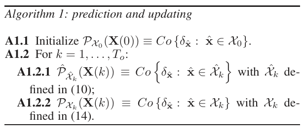

**Algorithm 1: prediction and updating**

**A1.1** Initialize $\mathcal{P}_{\mathcal{X}_0}(\mathbf{X}(0))\equiv Co\left\{\delta_{\hat{\mathbf{x}}}:~\hat{\mathbf{x}}\in \mathcal{X}_0\right\}$.

**A1.2** For $k=1,\dots,T_o$:

- **A1.2.1** $\hat{\mathcal{P}}_{\hat{\mathcal{X}}_k}(\mathbf{X}(k))\equiv Co\left\{\delta_{\hat{\mathbf{x}}}:~\hat{\mathbf{x}}\in \hat{\mathcal{X}}_k\right\}$ with $\hat{\mathcal{X}}_k$ defined in (10);
- **A1.2.2** $\mathcal{P}_{\mathcal{X}_k}(\mathbf{X}(k))\equiv Co\left\{\delta_{\hat{\mathbf{x}}}:~\hat{\mathbf{x}}\in \mathcal{X}_k\right\}$ with $\mathcal{X}_k$ defined in (14).

**Remark 1** Under the assumptions (2a),(2b) and (5), the set $\mathcal{X}_k$ is a semialgebraic set in $\mathbb{R}^{n}$, described by the intersections of the semialgebraic sets $\hat{\mathcal{X}}_k$ (Eq. (11)) and $\mathcal{Y}_{k}$ (Eq. (15)). Formally, $\mathcal{X}_k$ is the projection in the space of $\mathbf{x}(k)$ of the set

$$
\tilde{\mathcal{X}}_k=\left\{\tilde{\mathbf{x}} \in \mathbb{R}^{2n}: h_s(\tilde{\mathbf{x}} (k)) \leq 0, \ s=1,\ldots,m\right\}, \tag{18}
$$

where $\tilde{\mathbf{x}} (k)$ is the augmented state vector $\tilde{\mathbf{x}} (k)=\left[\mathbf{x}^\top(k) \ \ \mathbf{x}^\top(k-1)\right]^\top$ and $h_s(\tilde{\mathbf{x}} (k))$ (with $s=1,\ldots,m$) are the polynomial functions in $\mathbf{x}(k)$ and $\mathbf{x}(k-1)$ (or equivalently in $\tilde{\mathbf{x}} (k)$) defining $\hat{\mathcal{X}}_k$ and $\mathcal{Y}_{k}$. In the rest of the paper, we will use the following notation to describe the set $\mathcal{X}_k$:

$$
\mathcal{X}_k=\left\{\mathbf{x}(k) \in \mathbb{R}^n: h_s(\tilde{\mathbf{x}} (k)) \leq 0, \ s=1,\ldots,m\right\}. \tag{19}
$$

Footnote 6: This way of updating set of probability measures has been proposed by Walley [41, Appendix J] under the name of regular extension.

**Remark 2** The reformulation of set-membership in the probabilistic framework is important for two main reasons. First, it allows us to reinterpret the operations performed in set-membership estimation and justifies them in terms of a probabilistic framework. We have just seen the reinterpretation of prediction and updating in terms of the Chapman-Kolmogorov equation and Bayes’ rule. We will further investigate this interpretation in the next sections. In particular, in Section 4, we will show that the convex membership set computed in set-membership estimation can also be interpreted as the set of posterior means calculated

<!-- PDF page 7 -->

with respect to the posterior set of probability measures $\mathcal{P}_{\mathcal{X}_k}(\mathbf{X}(k))$ (in the Bayesian setting, we know that the posterior mean is the optimal estimate with respect to a quadratic loss function – a similar result holds for the set of posterior means [42, Sec.5]). This result can also now be applied to set-membership estimation because, after this probabilistic interpretation, we are now able to compute expectations. Moreover, in Section 5 we will also highlight the connection between set-membership estimation and the theory of moments (through duality).

Second, we are now potentially able to combine set-membership and classical probabilistic uncertainty in order to obtain hybrid filters, i.e., stochastic (probabilistic) filters that are for instance able to use information about the bounding region as well as the probabilistic moments (mean and variance) of the noises or that are able to deal with a Gaussian measurement noise and a bounded, with known moments, process noise etc.. A first attempt in this direction is described in [29] for scalar systems. We plan to further investigate this direction in future work by using the theory of SOS polynomial optimization, that we also use in the next sections.

## 4 Computing the support as an inference on the set of probability measures

In the probabilistic formulation of filtering, all the available information at time $k$ is encoded in the posterior probability distribution of the state $\mathbf{x}(k)$ given all the observations $\mathbf{y}^k)$. In the set-membership setting, this information is encoded in the updated set of probability measures $\mathcal{P}_{\mathcal{X}_k}(\mathbf{X}(k))$. Inferences can then be expressed in terms of expectations computed with respect to this set. The set-membership estimation problem can, for instance, be reformulated as follows:

$$
\begin{array}{l}
\Omega^*=arg\min\limits_{\Omega \subseteq \mathbb{R}^n} \int\limits_{\Omega} d\mathbf{x}(k) \\
s.t.\\
\int\limits_{\Omega} dP(\mathbf{x}(k))= 1, \ \ \forall P\in \mathcal{P}_{\mathcal{X}_k}(\mathbf{X}(k)).
\end{array} \tag{20}
$$

The solution of (20) is the minimum-volume set $\Omega \subseteq \mathbb{R}^n$, such that $\Pr(\mathbf{x}(k) \in \Omega)=1$ for all probability measures $\Pr$ in $\mathcal{P}_{\mathcal{X}_k}(\mathbf{X}(k))$ (i.e., with support $\mathcal{X}_k$).[^7] Thus, $\Omega^*$ coincides with $\mathcal{X}_k$. Since $\mathcal{X}_k$ may be not convex, the problem (20) is in general difficult to solve. However, the problem can be simplified by restricting $\Omega$ to be convex, thus computing a convex outer-approximation of $\mathcal{X}_k$.

The following theorem shows that computing the minimum-volume convex set $\Omega$ such that $P(\mathbf{x}(k) \in \Omega)=1$ is equivalent to obtain the set that includes all the possible means computed with respect to the probability measure in $\mathcal{P}_{\mathcal{X}_k}(\mathbf{X}(k))$.

**Theorem 3** Assume that $\mathcal{X}_k$ is compact and that $\Omega_1 \subseteq \mathbb{R}^n$ is a convex set defined as follows:

$$
\begin{array}{l}
\Omega_1=arg\inf\limits_{\Omega \subseteq \mathbb{R}^n, \Omega~\text{conv.}} \int\limits_{\Omega} d\mathbf{x}(k) \\
s.t.\\
\int\limits_{\Omega} dP(\mathbf{x}(k))=1, \ \ \forall P \in \mathcal{P}_{\mathcal{X}_k}(\mathbf{X}(k))
\end{array} \tag{21}
$$

Then, it results that $\Omega_1=\mathcal{M}$, with

$$
\mathcal{M}=\left\{\int\limits_{\mathcal{X}_k} \mathbf{x}(k) dP(\mathbf{x}(k)):~~P \in \mathcal{P}_{\mathcal{X}_k}(\mathbf{X}(k))\right\}. \tag{22}
$$

**Proof:** From (21) it follows that $\Omega_1$ is the minimum volume convex set that includes $\mathcal{X}_k$. Thus, if $\mathcal{X}_k$ is convex, then $\Omega_1=\mathcal{X}_k$. Hence, from (8), the equality

$$
\int\limits_{\mathcal{X}_k} \mathbf{x}(k) \delta_{\mathbf{\hat{x}(k)}}(d\mathbf{x}(k)) =\hat{\mathbf{x}}(k),
$$

and (22), it immediately follows that $\mathcal{M}=\Omega_1$. Conversely assume that $\mathcal{X}_k$ is not convex, then $\Omega_1 \supset \mathcal{X}_k$. Since $\Omega_1$ is the minimum volume convex set that includes $\mathcal{X}_k$, then $\Omega_1$ must be equal to the convex-hull of $\mathcal{X}_k$. This means that for each $\hat{\mathbf{x}} \in \Omega_1$, there exist $\mathbf{z}_1,\mathbf{z}_2 \in \mathcal{X}_k$ such that $w\mathbf{z}_1+(1-w)\mathbf{z}_2=\hat{\mathbf{x}}$ for some $w \in [0,1]$ (by definition of convex hull). Then, consider the probability measure

$$
w\delta_{\mathbf{z}_1}+(1-w)\delta_{\mathbf{z}_2}. \tag{23}
$$

Because of (8), it holds:

$$
w\delta_{\mathbf{z}_1}+(1-w)\delta_{\mathbf{z}_2} \in \mathcal{P}_{\mathcal{X}_k}(\mathbf{X}(k)), \tag{24}
$$

and

$$
\int\limits_{\mathcal{X}_k} \mathbf{x}(k) \left(w\delta_{\mathbf{z}_1}(d \mathbf{x}(k))+(1-w)\delta_{\mathbf{z}_2}(d \mathbf{x}(k))\right)=\hat{\mathbf{x}}. \tag{25}
$$

Thus, $\hat{\mathbf{x}}$ belongs to $\mathcal{M}$, and vice versa. $\blacksquare$

Theorem 3 has the following fundamental implications:

- a convex outer-bounding of the set of all the possible means computed with respect to the probability measures in $\mathcal{P}_{\mathcal{X}_k}(\mathbf{X}(k))$ (i.e., the set $\mathcal{M}$) is also a convex outer-bounding of the support $\mathcal{X}_k$ of the set of probability measures $\mathcal{P}_{\mathcal{X}_k}(\mathbf{X}(k))$.

- the tightest convex outer-bounding of the support $\mathcal{X}_k$ of the set of probability distributions $\mathcal{P}_{\mathcal{X}_k}(\mathbf{X}(k))$ is the set of the means computed with respect to the probability measure in $\mathcal{P}_{\mathcal{X}_k}(\mathbf{X}(k))$.

Footnote 7: It is thus the union of all the supports of the probability measures in $\mathcal{P}_{\mathcal{X}_k}(\mathbf{X}(k))$.

<!-- PDF page 8 -->

We can thus use $\mathcal{M}$ as an outer-approximation of $\mathcal{X}_k$. Algorithm 1 is therefore modified to include the following additional steps.

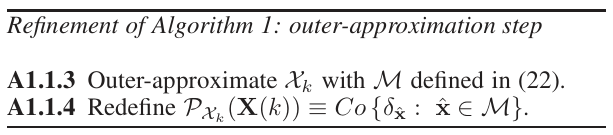

**Refinement of Algorithm 1: outer-approximation step**

**A1.1.3** Outer-approximate $\mathcal{X}_k$ with $\mathcal{M}$ defined in (22).

**A1.1.4** Redefine $\mathcal{P}_{\mathcal{X}_k}(\mathbf{X}(k))\equiv Co\left\{\delta_{\hat{\mathbf{x}}}:~\hat{\mathbf{x}}\in \mathcal{M}\right\}$.

Unfortunately, Theorem 3 does not provide a constructive way to find the set $\mathcal{M}$. However, by restricting the outer-approximation of the support $\mathcal{X}_k$ to have a simple form (e.g., a polytope), Theorem 3 can be still exploited to determine an outer-bounding set of $\mathcal{X}_k$. The following theorem provides results to compute an outer-bounding box of $\mathcal{X}_k$.

**Theorem 4 (Box approximation)** The minimum volume box that includes $\mathcal{X}_k$ can be found by solving the following family of optimization problems

$$
\begin{array}{l}
\underline{\overline{x}}_i^*(k)=\underset{P}{\text{opt}} \int x_i(k) dP(\mathbf{x}(k)) \\
s.t.~ \int\limits_{\mathcal{X}_k} dP(\mathbf{x}(k))= 1.
\end{array} \tag{26}
$$

for $i=1,\dots,n$, where by selecting opt to be min or max we obtain the half-spaces $\int x_i(k) dP(\mathbf{x}(k))\geq \underline{x}_i^*(k)$ and, respectively, $\int x_i(k) dP(\mathbf{x}(k))\leq \overline{x}_i^*(k)$ which define the box.

The proof of Theorem 4 is provided together with the proof of Theorem 5. Based on Theorem 4, by computing the lower and upper means of the components $x_1(k),\ldots,x_n(k)$ of the vector $\mathbf{x}(k)$, the tightest box that outer-approximates $\mathcal{X}_k$ is obtained. In the following we will discuss how to efficiently solve optimization problems similar to (26) and how to find an outer-approximation of $\mathcal{X}_k$ that is less conservative than a box. For simplicity of notation, in the rest of the paper, the dependence of the state $\mathbf{x}(k)$ and of the set $\mathcal{X}_k$ on the time index $k$ will be dropped, and only used when necessary.

## 5 Exploiting duality

In this section we discuss how to efficiently solve optimization problems similar to (26). In particular, we slightly modify (26) in order to be able to determine the more general half-space

$$
\mathcal{H}=\left\{ \rho \in \mathbb{R}^n: \boldsymbol{\omega}^\top \rho \leq \nu \right\}, \tag{27}
$$

where $\boldsymbol{\omega}\in \mathbb{R}^n$, $\nu \in \mathbb{R}$ and $\rho= \int \mathbf{x}\, dP(\mathbf{x})$.[^8]

**Theorem 5** Let us fix the normal vector $\boldsymbol{\omega}$ defining the half-space $\mathcal{H}$ in (27). Then, the tightest half-space $\mathcal{H}$ including

$\mathcal{M}$ (or equivalently, including $\mathcal{X}$), is obtained for $\nu= \nu^*$, with

$$
\begin{array}{l}
\nu^*=\max\limits_{P} \int \boldsymbol{\omega}^\top\mathbf{x}\, dP(\mathbf{x}) \\
s.t.~ \int\limits_{\mathcal{X}} dP(\mathbf{x})= 1.
\end{array} \tag{28}
$$

**Proof:** Let $\rho = \int \mathbf{x}\, dP(\mathbf{x})$ be a point belonging to $\mathcal{M}$. Let us first prove that if $\nu\geq \nu^*$, then $\mathcal{M} \subseteq \mathcal{H}$. First, note that:

$$
\begin{aligned}
\boldsymbol{\omega}^\top \rho \leq \nu^*= & \sup_P \boldsymbol{\omega}^\top \int \mathbf{x}\, dP(\mathbf{x})\\
& s.t. \ \int_{\mathcal{X}}dP(\mathbf{x})=1
\end{aligned}
$$

Therefore, for $\nu\geq \nu^*$, $\boldsymbol{\omega}^\top \rho \leq \nu^* \leq \nu$, which means that $\rho= \int \mathbf{x}\, dP(\mathbf{x})$ also belongs to $\mathcal{H}$ for all $\rho \in \mathcal{M}$. Thus, $\mathcal{H}$ contains $\mathcal{M}$. By choosing $\nu=\nu^*$, we obtain the tightest half-space defined by the normal vector $\boldsymbol{\omega}$ that includes $\mathcal{M}$. $\blacksquare$

It can be observed that (28) reduces to (26) when $\boldsymbol{\omega}=\mathbf{e}_i$ for $i=1,\dots,n$, where $\mathbf{e}_i$ is an element of the natural basis of $\mathbb{R}^n$. Note that, in Problem (28): (i) the optimization variables are the amount of non-negative mass assigned to each point $\mathbf{x}$ in $\mathcal{X}$ (i.e., the measure $Pr(\mathbf{x})$); (ii) the objective function and the constraint are linear in the optimization variables. Therefore, (28) is a semi-infinite linear program (i.e., infinite number of decision variables but finite number of constraints). By exploiting duality of semi-infinite linear program (see for instance [43]), we can write the dual of (28), which is defined as:

$$
\begin{aligned}
\nu^*=& \inf_{\nu} \nu\\
& s.t. \ \nu \geq \boldsymbol{\omega}^{\top} \mathbf{x}, \ \ \forall \mathbf{x} \in \mathcal{X},
\end{aligned} \tag{29}
$$

which is also a semi-infinite linear program (i.e., finite number of decision variables ($\nu$) but infinite number of constraints). A solution $\nu$ is feasible for Problem (29) provided that:

$$
\nu - \boldsymbol{\omega}^{\top} \mathbf{x} \geq 0, ~~\forall \mathbf{x} \in \mathcal{X}.
$$

Hence, checking the feasibility of $\nu$ is equivalent to check the non-negativity of the polynomial $\nu - \boldsymbol{\omega}^{\top} \mathbf{x}$ in the set $\mathcal{X}$.

**Remark 3** The probabilistic formulation of the set-membership estimation described so far is general enough, and it is valid also when the dynamical system in (1) is not a polynomial system and when the uncertainty sets $\mathcal{X}_0,\mathcal{W}_k,\mathcal{V}_k$ in (4) are not semialgebraic, but just compact sets. The assumptions of polynomiality are used in the following to efficiently solve the semi-infinite linear programming problem (29) through convex optimization.

### 5.1 Sum-of-squares polynomials

A sufficient condition for a polynomial to be non-negative over a semialgebraic set is that it can be written in terms of *sum-of-squares* (SOS) polynomials (see, e.g., [44]).

Footnote 8: The half-space $\mathcal{H}$ lies on the space of the means.

<!-- PDF page 9 -->

**Definition 1** A polynomial $\sigma(\tilde{\mathbf{x}})$, with $\tilde{\mathbf{x}} \in \mathbb{R}^{2n}$, of degree $2\mathbf{d}$ is a sum-of-squares polynomial, denoted by $\sigma(\tilde{\mathbf{x}}) \in \Sigma [\tilde{\mathbf{x}}]$, if and only if it can be written as:

$$
\sigma(\tilde{\mathbf{x}})=\mathbf{q}_{\mathbf{d}}(\tilde{\mathbf{x}})^\top \mathbf{Q}\, \mathbf{q}_{\mathbf{d}}(\tilde{\mathbf{x}}), \tag{30}
$$

where $\mathbf{Q}$ is a real symmetric positive semidefinite matrix of dimension $\binom{2n+\mathbf{d}}{\mathbf{d}}$. The vector of monomials $\mathbf{q}_{\mathbf{d}}(\tilde{\mathbf{x}})$ is defined as in (3). The set of SOS polynomials of degree less then or equal to $2\mathbf{d}$ is denoted as $\Sigma_{2\mathbf{d}}[\tilde{\mathbf{x}}]$.

Then, for a given integer $\mathbf{d} \geq 1$, a sufficient condition for $\nu-\boldsymbol{\omega}^\top \mathbf{x}$ to be non-negative in $\mathcal{X}$ is (see for instance [37, Ch. 4]):

$$
\begin{array}{l}
\nu - \boldsymbol{\omega}^\top \mathbf{x} =\sigma_0(\tilde{\mathbf{x}})-\sum\limits_{s=1}^m \sigma_s(\tilde{\mathbf{x}}) h_s(\tilde{\mathbf{x}})~~\forall~\tilde{\mathbf{x}} \in \mathbb{R}^{2n}\\
\sigma_0(\tilde{\mathbf{x}}), \sigma_1(\tilde{\mathbf{x}}), \ldots, \sigma_m(\tilde{\mathbf{x}}) \in \Sigma_{2\mathbf{d}}[\tilde{\mathbf{x}}],
\end{array} \tag{31}
$$

where $h_s(\tilde{\mathbf{x}})$ (with $s=1,\ldots,m$) are the polynomial nonpositive inequality constraints defining the semialgebraic set $\mathcal{X}$. In order to avoid confusion, we would like to stress that also $\nu - \boldsymbol{\omega}^\top \mathbf{x}$ is a polynomial in the variable $\tilde{\mathbf{x}}$. In fact, we remind that the augmented state $\tilde{\mathbf{x}}(k)$ is defined as: $\tilde{\mathbf{x}}(k)=\left[\mathbf{x}^\top(k) \ \ \mathbf{x}^\top(k-1)\right]^\top$.

The following (more conservative) optimization problem can be then solved instead of (29):

$$
\begin{aligned}
\nu^{**}&= \inf_{\nu,\sigma_s} \nu\\
& \nu - \boldsymbol{\omega}^\top \mathbf{x} = \sigma_0(\tilde{\mathbf{x}})-\sum_{s=1}^m \sigma_s(\tilde{\mathbf{x}}) h_s(\tilde{\mathbf{x}}), ~~\forall~\tilde{\mathbf{x}} \in \mathbb{R}^{2n}\\
& \sigma_0(\tilde{\mathbf{x}}), \sigma_1(\tilde{\mathbf{x}}), \ldots, \sigma_m(\tilde{\mathbf{x}}) \in \Sigma_{2\mathbf{d}}[\tilde{\mathbf{x}}].
\end{aligned} \tag{32}
$$

Note that, by rewriting the SOS polynomials $\sigma_s(\tilde{\mathbf{x}})$ (with $s=0,\ldots,m$) as in (30), Problem (32) can be also rewritten as:

$$
\begin{aligned}
\nu^{**}=& \inf_{\nu,\mathbf{Q}_s} \nu\\
\nu - \boldsymbol{\omega}^\top \mathbf{x} = & \mathbf{q}_{\mathbf{d}}(\tilde{\mathbf{x}})^\top \mathbf{Q}_0 \mathbf{q}_{\mathbf{d}}(\tilde{\mathbf{x}})+\\
-& \sum_{s=1}^m \mathbf{q}_{\mathbf{d}}(\tilde{\mathbf{x}})^\top \mathbf{Q}_s \mathbf{q}_{\mathbf{d}}(\tilde{\mathbf{x}}) h_s(\tilde{\mathbf{x}}), ~~\forall~\tilde{\mathbf{x}} \in \mathbb{R}^{2n}\\
&\mathbf{Q}_s \succeq 0, \ \ s=0,\ldots,m.
\end{aligned} \tag{33}
$$

Some remarks:

(1) Problem (33) is a *semidefinite programming* (SDP) problem [44,45], thus convex. In fact, checking if the polynomial $\nu-\boldsymbol{\omega}^T\mathbf{x}$ is equal to $\mathbf{q}_{\mathbf{d}}(\tilde{\mathbf{x}})^\top \mathbf{Q}_0 \mathbf{q}_{\mathbf{d}}(\tilde{\mathbf{x}})-\sum_{s=1}^m \mathbf{q}_{\mathbf{d}}(\tilde{\mathbf{x}})^\top \mathbf{Q}_s \mathbf{q}_{\mathbf{d}}(\tilde{\mathbf{x}}) h_s(\tilde{\mathbf{x}})$ for all $\tilde{\mathbf{x}} \in \mathbb{R}^{2n}$ leads

to linear equalities in $\nu$ and in the matrix coefficients $\mathbf{Q}_s$ (with $s=1,\ldots,m$). Besides, enforcing $\sigma_0(\tilde{\mathbf{x}}), \sigma_1(\tilde{\mathbf{x}}), \ldots, \sigma_m(\tilde{\mathbf{x}})$ to be sum of square polynomials leads to *linear matrix inequality* (LMI) constraints in the coefficients of $\sigma_0(\tilde{\mathbf{x}}), \sigma_1(\tilde{\mathbf{x}}), \ldots, \sigma_m(\tilde{\mathbf{x}})$ (i.e., $\mathbf{Q}_s \succeq 0$).

(2) For $\nu=\nu^{**}$, the robust constraint $\nu^{**} - \boldsymbol{\omega}^{\top} \mathbf{x} \geq 0 \ \ \forall \mathbf{x} \in \mathcal{X}$ appearing in Problem (29) is guaranteed to be satisfied. As matter of fact, for all $\tilde{\mathbf{x}} \in \tilde{\mathcal{X}}$, $h_s(\tilde{\mathbf{x}}) \leq 0$ (with $s=1,\ldots,m$) by definition of $\tilde{\mathcal{X}}$. Furthermore, the SOS polynomials $\sigma_s(\tilde{\mathbf{x}})=\mathbf{q}_{\mathbf{d}}(\tilde{\mathbf{x}})^\top \mathbf{Q}_s \mathbf{q}_{\mathbf{d}}(\tilde{\mathbf{x}})$ (with $s=0,\ldots,m$) are always nonnegative over $\mathbb{R}^{2n}$ as $\mathbf{Q}_s\succeq 0$. Thus, both the left and the right side of the equation in Problem (33) are nonnegative for all $\tilde{\mathbf{x}} \in \tilde{\mathcal{X}}$.

(3) Since the equality constraint in (33) gives only a sufficient condition for the non-negativity of $\nu - \boldsymbol{\omega}^\top \mathbf{x}$ on $\mathcal{X}$, it follows that $\nu^{*}\leq \nu^{**}$. Therefore, conservativeness is introduced in solving (33) instead of (29), as highlighted in Corollary 1.

(4) However, according to the *Putinar’s Positivstellensatz* (see, e.g., [46] and [47, Ch. 3]), a polynomial which is nonnegative over a compact semialgebraic set $\mathcal{X}$ can exactly always be written as a combination of SOS polynomials, provided that the degree of the SOS polynomials $\sigma_0(\tilde{\mathbf{x}}),\ldots,\sigma_m(\tilde{\mathbf{x}})$ is large enough. In other words, we can make $\nu^{**}$ close to $\nu^{*}$ by increasing the degree of the SOS. However, in practice it often happens that the relaxed solution $\nu^{**}$ and the optimal one $\nu^{*}$ coincide with each other for small values of the SOS degree $2\mathbf{d}$.

**Corollary 1** The set $\mathcal{M}$ is guaranteed to belong to the halfspace $\mathcal{H}:\boldsymbol{\omega}^\top \mathbf{x} \leq \nu^{**}$, i.e.

$$
\mathcal{M} \subseteq \mathcal{H}. \tag{34}
$$

**Proof:** The proof straightforwardly follows from Theorem 5 and $\nu^* \leq \nu^{**}$. $\blacksquare$

**Example 2** Let us consider the discrete-time polynomial system described by the difference equations:

$$
\begin{array}{rcl}
x_1(k)&=& x_1(k-1)x_2(k-1)(x_1(k-1)+x_2(k-1)) +w_1(k-1),\\
x_2(k)&=& x_1(k-1)x_2(k-1)(2x_1(k-1)+x_2(k-1)) + w_2(k-1).
\end{array} \tag{35}
$$

The output equation is given by: $\mathbf{y}(k)=x_1(k)+x_2(k)+\mathbf{v}(k)$. The following conditions are assumed: (i) the initial state $\mathbf{x}(0)$ belongs to $\mathcal{X}_0=\left\{\mathbf{x}(0):~\|\mathbf{x}(0)\|_{2} \leq 0.2\right\}$, the process noise $\mathbf{w}(k)=[w_1(k) \ \ w_2(k)]^\top$ is bounded by $\|\mathbf{w}(k)\|_{2} \leq 0.4$, and the measurement noise by $\|\mathbf{v}(k)\|_{\infty} \leq 0.5$. The observed output $\mathbf{y}(k)$ at time $k=1$ is $\mathbf{y}(k)=0$. We are interested in computing an half-space $\mathcal{H}:\boldsymbol{\omega}^\top \rho \leq \nu$ containing the state uncertainty set $\mathcal{X}_k$ (or equivalently $\mathcal{M}$) at time $k=1$. The normal vector $\boldsymbol{\omega}$ characterizing $\mathcal{H}$ is fixed and it is equal to $\boldsymbol{\omega}=[-1 \ \ -0.5]^\top$. In order to compute the constant parameter $\nu$ defining $\mathcal{H}$, the SDP Problem

<!-- PDF page 10 -->

(33) with $\tilde{\mathbf{x}}(1)=[\mathbf{x}^T(1) \ \ \mathbf{x}^T(0)]^T$ and

$$
h_1(\tilde{\mathbf{x}}(1)): \; x_1(0)^2 + x_2(0)^2 - 0.2^2 \leq 0, \tag{36}
$$

$$
\begin{aligned}
h_2(\tilde{\mathbf{x}}(1)):& \underset{w^2_1(0)}{\underbrace{\left(x_1(1)- x_1(0)x_2(0)(x_1(0)+x_2(0))\right)^2}}+ \\
& \underset{w^2_2(0)}{\underbrace{\left(x_1(1)- x_1(0)x_2(0)(2x_1(0)+x_2(0))\right)^2}} -0.4^2 \leq 0, \\
h_3(\tilde{\mathbf{x}}(1)):& \underset{\mathbf{v}(1)}{\underbrace{y(1)-x_1(1)-x_2(1)}}-0.5 \leq 0, \\
h_4(\tilde{\mathbf{x}}(1)):& -\underset{\mathbf{v}(1)}{\left(\underbrace{y(1)-x_1(1)-x_2(1)}\right)}-0.5 \leq 0,
\end{aligned} \tag{37}
$$

is solved for a SOS degree $2\mathbf{d}=4$. The *SOStools* [48] has been used to easily handle the SOS polynomials appearing in (33). The CPU time taken by the solver *SeDuMi* [49] to compute a solution of the SDP Problem (33) on a 2.40-GHz Intel Pentium IV with 3 GB of RAM is 2.1 seconds. The computed half-space $\mathcal{H}$ is plotted in Fig. 1, along with the true state uncertainty set $\mathcal{X}_1$. According to Theorem 5 and Corollary 1, $\mathcal{X}_1$ is included in the half-space $\mathcal{H}$. Note also that, although the original robust optimization problem (29) has been replaced with the SDP problem (33), the computed parameter $\nu^{**}$ defining $\mathcal{H}$ is such that the hyperplane $\boldsymbol{\omega}^\top \mathbf{x} = \nu^{**}$ is “almost” tangent to the set $\mathcal{X}_1$. Thus, only a small level of conservativeness is introduced in using SOS.

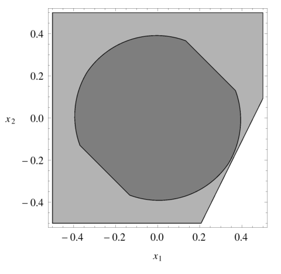

Fig. 1. True state uncertainty set $\mathcal{X}_1$ (dark grey region) and half-space $\mathcal{H}: -\rho_1 - 0.5 \rho_2 \leq 0.45$ (light gray region).

## 6 Computation of the minimum-volume polytope containing $\mathcal{M}$

In the previous section, given the normal vector $\boldsymbol{\omega}$ defining the half-space $\mathcal{H}$ in (27), we have shown how to compute, through convex optimization, the constant parameter $\nu$ such that $\mathcal{M} \subset \mathcal{H}$.

Now consider the following family of half-spaces:

$$
\mathcal{H}_j=\left\{ \rho \in \mathbb{R}^n: \boldsymbol{\omega}_j^\top \rho \leq \nu_j \right\},
$$

for $j=1,\dots,J$ with $J\geq n+1$. Our goal is to choose the normal vectors $\boldsymbol{\omega}_j$, along with the constant parameters $\nu_j$, defining the half-spaces $\mathcal{H}_j$ such that

(1) $\mathcal{M} \subseteq \mathcal{S}=\bigcap_{j=1}^J \mathcal{H}_j$;

(2) the polytope $\mathcal{S}$ has minimum volume.

In other words, now also the normal vectors $\boldsymbol{\omega}_j$ for $j=1,\dots,J$ have to be optimized. Then, we can formulate the problem we aim to solve as:

$$
\inf_{\mathcal{S}}\int_{\mathcal{S}} d\mathbf{x} ~~ \text{s.t. } \mathcal{M} \subseteq \mathcal{S}, \tag{38}
$$

where $\mathcal{S}$ in (38) is constrained to be a polytope. There are two main aspects making (38) a challenging problem, i.e.,

(1) the minimum-volume polytope outer-approximating a generic compact set in $\mathbb{R}^n$ might not exist. For instance, if $\mathcal{M}$ is an ellipsoid, its convex hull is described by an infinite number of half-spaces, namely all the supporting hyperplanes at every boundary point of $\mathcal{M}$.

(2) the problem of computing the exact volume $\int_{\mathcal{S}} d\mathbf{x}$ of a polytope $\mathcal{S}$ in $\mathbb{R}^n$ is $\#P$-hard (see, e.g. [50,51]. The interested reader is also referred to [52] for details on $\#P$-hard problems). Although several algorithms have been proposed in the literature to compute the volume of a polytope $\mathcal{S}$ through triangulation [53,54,55,56], Gram’s relation [57], Laplace transform [58] or randomized methods [59,60,61], all the approaches mentioned above require an exact description of the polytope $\mathcal{S}$ in terms of its half-space or vertex representation. However, in our case, the parameters $\boldsymbol{\omega}_j,\nu_j$ defining the half-spaces $\mathcal{H}_j$ are unknown, as determining $\boldsymbol{\omega}_j,\nu_j$ is part of the problem itself.

In the following paragraph we present a greedy algorithm to evaluate an approximation of the minimum-volume polytope outer-approximating the set $\mathcal{M}$.

### 6.1 Approximation of the objective function

As already pointed out in the previous paragraph, one of the main problems in solving (38) is that an analytical expression for the computation of the volume of a polytope $\mathcal{S}$ in $\mathbb{R}^n$ is not available and the polytope $\mathcal{S}$ is unknown, as computing $\mathcal{S}$ is part of the problem itself. In order to overcome such a problem, a Monte Carlo integration approach [62] is used here to approximate the volume of $\mathcal{S}$. Specifically, given an outer-bounding box $\mathcal{B}$ of the set $\mathcal{M}$ (which can be computed as discussed in Theorem 4) and a sequence of $N$ random points $\{p_i\}_{i=1}^N$ independent and uniformly distributed in $\mathcal{B}$,

<!-- PDF page 11 -->

the integral $\int_{\mathcal{S}} d\mathbf{x}$ can be approximated as:

$$
\int_{\mathcal{S}} d\mathbf{x} \approx Vol(\mathcal{B})\frac{1}{N}\sum_{i=1}^N I_{\{\mathcal{S}\}}(p_i), \tag{39}
$$

where $Vol(\mathcal{B})$ is the volume of the box $\mathcal{B}$ and $I_{\{\mathcal{S}\}}(p_i)$ is the indicator function of the (unknown) polytope $\mathcal{S}$ defined as

$$
I_{\{\mathcal{S}\}}(p_i) = \begin{cases} 1 & \text{if } p_i \in \mathcal{S} \\ 0 & \text{otherwise} \end{cases} \tag{40}
$$

**Remark 4** It is worth remarking that:

$$
\mathbb{E}\left[Vol(\mathcal{B})\frac{1}{N}\sum_{i=1}^N I_{\{\mathcal{S}\}}(p_i)\right] = Vol(\mathcal{S}),
$$

where the expectation is taken with respect to the random variable $p_i$. Furthermore, because of the strong law of large numbers,

$$
\lim_{N \rightarrow \infty} Vol(\mathcal{B})\frac{1}{N}\sum_{i=1}^N I_{\{\mathcal{S}\}}(p_i) = Vol(\mathcal{S}) \ \ \mathrm{w.p.}\ 1, \tag{41}
$$

where w.p. $1$ is for *with probability* $1$. For finite samples $N$, the level of accuracy of the approximation in (39) depends on the shape of the set $\mathcal{S}$ as well as on the volume of the outer box $\mathcal{B}$. The reader is referred to as [62] for details on Monte Carlo integration methods.

On the basis of (39), the volume minimization of problem (38) can be then approximated as

$$
\min_{\mathcal{S} \in \mathbf{S}} \sum_{i=1}^N I_{\{\mathcal{S}\}}(p_i) \quad \text{s.t. } \mathcal{M} \subseteq \mathcal{S} \tag{42}
$$

In the following subsection, we describe a greedy procedure aiming at computing an approximation of the minimization problem (42).

### 6.2 A greedy approach for solving (42)

The key steps of the approach proposed in this section to compute a polytopic outer-approximation $\mathcal{S}$ of the set $\mathcal{M}$ are summarized in Algorithm 2.

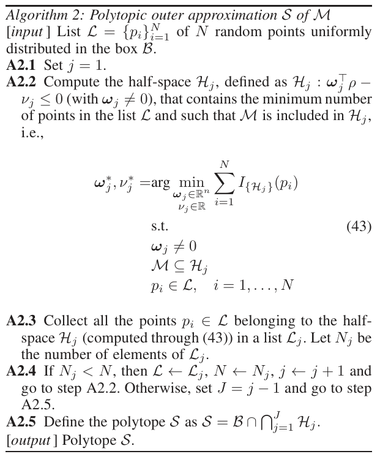

**Algorithm 2: Polytopic outer approximation $\mathcal{S}$ of $\mathcal{M}$**

[*input*] List $\mathcal{L} = \{p_i\}_{i=1}^N$ of $N$ random points uniformly distributed in the box $\mathcal{B}$.

**A2.1** Set $j = 1$.

**A2.2** Compute the half-space $\mathcal{H}_j$, defined as $\mathcal{H}_j : \boldsymbol{\omega}_j^\top \rho - \nu_j \leq 0$ (with $\boldsymbol{\omega}_j \neq 0$), that contains the minimum number of points in the list $\mathcal{L}$ and such that $\mathcal{M}$ is included in $\mathcal{H}_j$, i.e.,

$$
\begin{aligned}
\boldsymbol{\omega}^*_j, \nu^*_j = {} & \arg \min_{\substack{\boldsymbol{\omega}_j \in \mathbb{R}^n \\ \nu_j \in \mathbb{R}}} \sum_{i=1}^N I_{\{\mathcal{H}_j\}}(p_i) \\
& \text{s.t.} \\
& \boldsymbol{\omega}_j \neq 0 \\
& \mathcal{M} \subseteq \mathcal{H}_j \\
& p_i \in \mathcal{L}, \quad i = 1, \ldots, N
\end{aligned} \tag{43}
$$

**A2.3** Collect all the points $p_i \in \mathcal{L}$ belonging to the half-space $\mathcal{H}_j$ (computed through (43)) in a list $\mathcal{L}_j$. Let $N_j$ be the number of elements of $\mathcal{L}_j$.

**A2.4** If $N_j < N$, then $\mathcal{L} \leftarrow \mathcal{L}_j$, $N \leftarrow N_j$, $j \leftarrow j + 1$ and go to step A2.2. Otherwise, set $J = j - 1$ and go to step A2.5.

**A2.5** Define the polytope $\mathcal{S}$ as $\mathcal{S} = \mathcal{B} \cap \bigcap_{j=1}^J \mathcal{H}_j$.

[*output*] Polytope $\mathcal{S}$.

Algorithm 2 generates a sequence of half-spaces $\mathcal{H}_1, \ldots, \mathcal{H}_J$ as follows. First, the half-space $\mathcal{H}_1$ that minimizes an approximation of the volume of the polytope $\mathcal{B} \cap \mathcal{H}_1$ is computed. The approximation is due to the fact that the volume of $\mathcal{B} \cap \mathcal{H}_1$, given by the integral $\int_{\mathcal{B} \cap \mathcal{H}_1} d\mathbf{x}$, is approximated (up to the constant $\tfrac{Vol(\mathcal{B})}{N}$) by $\sum_{i=1}^N I_{\{\mathcal{H}_1\}}(p_i)$

(corresponding to the objective function of problem (43)). Then, the new half-space $\mathcal{H}_2$ that minimizes an approximation of the volume of the polytope $\mathcal{B} \cap \mathcal{H}_1 \cap \mathcal{H}_2$ is generated. In order to approximate the volume of $\mathcal{B} \cap \mathcal{H}_1 \cap \mathcal{H}_2$, all the points $p_i$ of the list $\mathcal{L} = \{p_i\}_{i=1}^N$ that do not belong to the polytope $\mathcal{B} \cap \mathcal{H}_1$ are discarded, and all and only the points belonging to $\mathcal{B} \cap \mathcal{H}_1$ are collected in a new list $\mathcal{L}_1 = \{p_i\}_{i=1}^{N_1}$ (step A2.3). The volume of $\mathcal{B} \cap \mathcal{H}_1 \cap \mathcal{H}_2$ is then approximated by $\sum_{i=1}^{N_1} I_{\{\mathcal{H}_2\}}(p_i)$, with $p_i \in \mathcal{L}_1$. The procedure is repeated until $N_{J+1} = N_J$ (step A2.4), which means that the number of samples $p_i$ belonging to the polytope $\mathcal{B} \cap \mathcal{H}_1 \cap \ldots \cap \mathcal{H}_{J+1}$ is equal to the number of samples $p_i$ belonging to the polytope $\mathcal{B} \cap \mathcal{H}_1 \cap \ldots \cap \mathcal{H}_J$. Note that, because of the constraint $\mathcal{M} \subseteq \mathcal{H}_j$ appearing in optimization problem (50), the half-spaces $\mathcal{H}_1, \ldots, \mathcal{H}_J$ are guaranteed to contain the set $\mathcal{M}$, and thus $\mathcal{S} = \mathcal{B} \cap \bigcap_{j=1}^J \mathcal{H}_j$ is an outer approximation of $\mathcal{M}$. Finally, we would like to remark that, in case we are interested also in bounding the maximum number of half-spaces defining the polytopic outer approximation $\mathcal{S}$, Algorithm 2 can be stopped after an a-priori specified number of iterations.

**Example 3** Let us consider again Example 2. The first steps of Algorithm 2 are visualized in Fig. 2. An outer-bounding box $\mathcal{B}$ of the true state uncertainty set (dark gray region) is first computed (Fig. (a)). A set of $80$ random points (black dots) uniformly distributed in $\mathcal{B}$ is generated (Fig. (b)). The half-space $\mathcal{H}_1$ containing the true state uncertainty set and the minimum number of points is computed. The points which do not belong to $\mathcal{H}_1$ are discarded (gray dots in Fig. (c)). A new half-space $\mathcal{H}_2$ containing the true state uncertainty set

<!-- PDF page 12 -->

and the minimum number of black dots is computed (Fig. (d)). Again, the points that do not belong to $\mathcal{H}_1 \cap \mathcal{H}_2$ are discarded (gray dots in Fig. (d)). The procedure terminates when no more black points can be discarded.

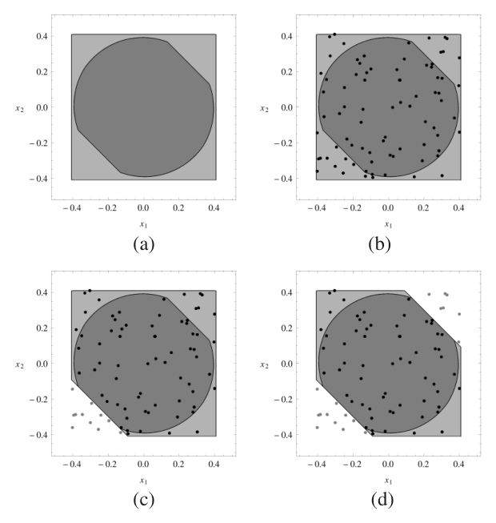

Fig. 2. First steps of Algorithm 2.

Technical details of step A2.2, which is the core of Algorithm 2, are provided in the following sections.

### 6.3 Approximation of the indicator functions

Note that the objective function of problem (43) is noncontinuous and nonconvex since it is the sum of the indicator functions $I_{\{\mathcal{H}_j\}}(p_i)$ defined as

$$
I_{\{\mathcal{H}_j\}}(p_i) = \begin{cases} 1 & \text{if } \boldsymbol{\omega}_j^\top p_i - \nu_j \leq 0, \\ 0 & \text{if } \boldsymbol{\omega}_j^\top p_i - \nu_j > 0. \end{cases} \tag{44}
$$

We then transform it in a convex objective function. Each indicator function $I_{\{\mathcal{H}_j\}}(p_i)$ is here approximated by the convex function $R_{\{\mathcal{H}_j\}}(x_i)$ defined as

$$
R_{\{\mathcal{H}_j\}}(p_i) = \begin{cases} -\boldsymbol{\omega}_j^\top p_i + \nu_j & \text{if } \boldsymbol{\omega}_j^\top p_i - \nu_j \leq 0, \\ 0 & \text{if } \boldsymbol{\omega}_j^\top p_i - \nu_j > 0. \end{cases} \tag{45}
$$

A plot of the functions $I_{\{\mathcal{H}_j\}}(p_i)$ and $R_{\{\mathcal{H}_j\}}(p_i)$ is given in Fig. 3.

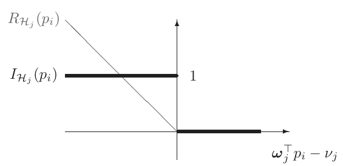

Fig. 3. Indicator function $I_{\mathcal{H}_j}(p_i)$ (black solid line) and approximate function $R_{\{\mathcal{H}_j\}}(p_i)$ (gray thin line). When $\boldsymbol{\omega}_j^\top p_i - \nu_j > 0$, $I_{\{\mathcal{H}_j\}}(p_i)$ and $R_{\{\mathcal{H}_j\}}(p_i)$ are overlapped and they are equal to 0.

Problem (43) is thus relaxed by replacing the indicator functions $I_{\{\mathcal{H}_j\}}(p_i)$ with the convex functions $R_{\{\mathcal{H}_j\}}(p_i)$, i.e.,

$$
\begin{aligned}
\tilde{\boldsymbol{\omega}}^*_j, \tilde{\nu}^*_j = {} & \arg \min_{\substack{\boldsymbol{\omega}_j \in \mathbb{R}^n \\ \nu_j \in \mathbb{R}}} \sum_{i=1}^N R_{\{\mathcal{H}_j\}}(p_i) \\
& \text{s.t.} \\
& \boldsymbol{\omega}_j \neq 0 \\
& \mathcal{M} \subseteq \mathcal{H}_j \\
& p_i \in \mathcal{L}, \quad i = 1, \ldots, N.
\end{aligned} \tag{46}
$$

**Theorem 6** If (i) there exists at least one point $p_i$ in the list $\mathcal{L}$ such that $\tilde{\boldsymbol{\omega}}_j^{*^\top} p_i - \tilde{\nu}^*_j < 0$ and (ii) $\tilde{\boldsymbol{\omega}}^*_j, \tilde{\nu}^*_j$ is the optimal solution of problem (46), then the hyperplane $\tilde{\boldsymbol{\omega}}_j^{*^\top} \rho - \tilde{\nu}^*_j = 0$ is a supporting hyperplane for the set $\mathcal{M}$.

**Proof:** Theorem 6 is proved by contradiction. Let $\tilde{\mathcal{H}}_j^*$ be the half-space defined as $\tilde{\mathcal{H}}_j^* : \tilde{\boldsymbol{\omega}}_j^{*^\top} \rho - \tilde{\nu}^*_j \leq 0$. Let us suppose that $\tilde{\boldsymbol{\omega}}^*_j, \tilde{\nu}^*_j$ is a feasible solution of problem (46) such that $\tilde{\boldsymbol{\omega}}_j^{*^\top} \rho - \tilde{\nu}^*_j = 0$ is not a supporting hyperplane for $\mathcal{M}$, that is, for some $\varepsilon > 0$, $\tilde{\mathcal{H}}_j : \tilde{\boldsymbol{\omega}}_j^{*^\top} \rho - \tilde{\nu}^*_j + \varepsilon \leq 0$ for all $\mathbf{x} \in \mathcal{M}$. Let us define $\tilde{\nu}_j$ as $\tilde{\nu}_j = \tilde{\nu}^*_j - \varepsilon$. Note that $\{\tilde{\boldsymbol{\omega}}^*_j, \tilde{\nu}_j\}$ is still a feasible solution of problem (46) and $\tilde{\mathcal{H}}_j \subseteq \tilde{\mathcal{H}}_j^*$. Let $V^* = \sum_{i=1}^N R_{\{\tilde{\mathcal{H}}_j^*\}}(p_i)$ be the value of the cost function of Problem (46) obtained for $\boldsymbol{\omega} = \tilde{\boldsymbol{\omega}}^*_j$ and $\nu = \tilde{\nu}^*_j$. $R_{\{\tilde{\mathcal{H}}_j^*\}}(p_i)$ is then given by

$$
R_{\{\tilde{\mathcal{H}}_j^*\}}(p_i) = \begin{cases} -\tilde{\boldsymbol{\omega}}_j^{*^\top} p_i + \tilde{\nu}^*_j & \text{if } \tilde{\boldsymbol{\omega}}_j^{*^\top} p_i - \tilde{\nu}^*_j \leq 0 \\ 0 & \text{if } \tilde{\boldsymbol{\omega}}_j^{*^\top} p_i - \tilde{\nu}^*_j > 0 \end{cases} \tag{47}
$$

Similarly, let $\tilde{V} = \sum_{i=1}^N R_{\{\tilde{\mathcal{H}}_j\}}(p_i)$ be the value of the cost function of Problem (46) obtained when $\boldsymbol{\omega} = \tilde{\boldsymbol{\omega}}^*_j$ and $\nu = \tilde{\nu}_j$. The term $R_{\{\tilde{\mathcal{H}}_j\}}(p_i)$ is the given by

$$
R_{\{\tilde{\mathcal{H}}_j\}}(p_i) = \begin{cases} -\tilde{\boldsymbol{\omega}}_j^{*^\top} p_i + \tilde{\nu}_j & \text{if } \tilde{\boldsymbol{\omega}}_j^{*^\top} p_i - \tilde{\nu}_j \leq 0 \\ 0 & \text{if } \tilde{\boldsymbol{\omega}}_j^{*^\top} p_i - \tilde{\nu}_j > 0 \end{cases} \tag{48}
$$

Since $\tilde{\mathcal{H}}_j \subseteq \tilde{\mathcal{H}}_j^*$, then when $R_{\{\tilde{\mathcal{H}}_j^*\}}(p_i) = 0$, also $R_{\{\tilde{\mathcal{H}}_j\}}(p_i)$

<!-- PDF page 13 -->

is equal to zero. On the other hand, when $R_{\{\tilde{\mathcal{H}}_j^*\}}(p_i) = -\tilde{\boldsymbol{\omega}}_j^{*^\top} p_i + \tilde{\nu}^*_j > 0$, then $R_{\{\tilde{\mathcal{H}}_j\}}(p_i)$ can be equal either to zero or to $-\tilde{\boldsymbol{\omega}}_j^{*^\top} p_i + \tilde{\nu}_j = -\tilde{\boldsymbol{\omega}}_j^{*^\top} p_i + \tilde{\nu}^*_j - \varepsilon \leq -\tilde{\boldsymbol{\omega}}_j^{*^\top} p_i + \tilde{\nu}^*_j$. On the basis of the above considerations, it follows:

$$
\begin{cases}
R_{\{\tilde{\mathcal{H}}_j^*\}}(p_i) = R_{\{\tilde{\mathcal{H}}_j\}}(p_i) & \text{if } \tilde{\boldsymbol{\omega}}_j^{*^\top} p_i - \tilde{\nu}^*_j \geq 0 \\
R_{\{\tilde{\mathcal{H}}_j^*\}}(p_i) > R_{\{\tilde{\mathcal{H}}_j\}}(p_i) & \text{if } \tilde{\boldsymbol{\omega}}_j^{*^\top} p_i - \tilde{\nu}^*_j < 0
\end{cases} \tag{49}
$$

Since by hypothesis (i) there exists at least one point $p_i$ in the list $\mathcal{L}$ such that $\tilde{\boldsymbol{\omega}}_j^{*^\top} p_i - \tilde{\nu}^*_j < 0$, it follows that $V^* > \tilde{V}$. Therefore, $\tilde{\boldsymbol{\omega}}_j^{*}, \tilde{\nu}^*_j$ is not the optimal solution of problem (46). This contradicts hypothesis (ii). $\blacksquare$

Theorem 6 has the following interpretation. Among all the half-spaces defined by the normal vector $\tilde{\boldsymbol{\omega}}_j^{*}$ and containing the set $\mathcal{M}$, the optimization problem (46) provides the half-space $\mathcal{H}_j^* : \tilde{\boldsymbol{\omega}}_j^{*^\top} \rho - \tilde{\nu}^*_j \leq 0$ which minimizes the volume of the polytope $\mathcal{B} \cap \mathcal{H}_1^* \cap \ldots \cap \mathcal{H}^*_j$, even if the integral $\int_{\mathcal{B} \cap \mathcal{H}^*_1 \cap \ldots \mathcal{H}^*_j} d\mathbf{x}$ is approximated (up to a constant) by $\sum_{i=1}^N I_{\{\mathcal{H}^*_j\}}(p_i)$ and the indicator functions $I_{\{\mathcal{H}^*_j\}}(p_i)$ are replaced by the convex functions $R_{\{\mathcal{H}^*_j\}}(p_i)$.

### 6.4 Handling the constraint $\mathcal{M} \subseteq \mathcal{H}_j$

The constraints $\mathcal{M} \subseteq \mathcal{H}_j$ can be handled through the SOS-based approach already discussed in Section 5.1. Specifically, by introducing a SOS relaxation, Problem (46) is replaced by:

$$
\begin{aligned}
& \boldsymbol{\omega}^*_j, \nu^*_j = \arg \min_{\substack{\boldsymbol{\omega}_j \in \mathbb{R}^n \\ \nu_j \in \mathbb{R} \\ \mathbf{Q}_s}} \sum_{i=1}^N R_{\{\mathcal{H}_j\}}(p_i) \\
& \text{s.t.} \\
& \boldsymbol{\omega}_j \neq 0 \\
& \nu_j - \boldsymbol{\omega}_j \mathbf{x} = \mathbf{q}_{\mathbf{d}}(\tilde{\mathbf{x}})^\top \mathbf{Q}_0 \mathbf{q}_{\mathbf{d}}(\tilde{\mathbf{x}}) + \\
& \quad - \sum_{s=1}^m \mathbf{q}_{\mathbf{d}}(\tilde{\mathbf{x}})^\top \mathbf{Q}_s \mathbf{q}_{\mathbf{d}}(\tilde{\mathbf{x}}) h_s(\tilde{\mathbf{x}}), \quad \forall\, \tilde{\mathbf{x}} \in \mathbb{R}^{2n} \\
& \mathbf{Q}_s \succeq 0, \quad s = 0, \ldots, m. \\
& p_i \in \mathcal{L}, \quad i = 1, \ldots, N
\end{aligned} \tag{50}
$$

Note that, as already discussed in Section 5.1, the constraint $\nu_j - \boldsymbol{\omega}_j^\top \mathbf{x} \geq 0$ is satisfied for all $\mathbf{x} \in \mathcal{X}$. Therefore, the half-space: $\mathcal{H}_j = \left\{ \rho \in \mathbb{R}^n : \boldsymbol{\omega}_j^\top \rho \leq \nu_j \right\}$ is guaranteed to contain $\mathcal{X}$. Thus, also the set $\mathcal{M}$ is included in $\mathcal{H}_j$. Finally, note that, in order to deal with the nonconvex constraint $\boldsymbol{\omega}_j \neq 0$ in (50), Problem (50) can be splitted into the two

following SDP problems:

$$
\begin{aligned}
& \overline{\boldsymbol{\omega}}^*_j, \overline{\nu}^*_j = \arg \min_{\substack{\boldsymbol{\omega}_j \in \mathbb{R}^n \\ \nu_j \in \mathbb{R} \\ \mathbf{Q}_s}} \sum_{i=1}^N R_{\{\mathcal{H}_j\}}(p_i) \\
& \text{s.t.} \\
& \boldsymbol{\omega}_{j,1} = 1 \\
& \nu_j - \boldsymbol{\omega}_j \mathbf{x} = \mathbf{q}_{\mathbf{d}}(\tilde{\mathbf{x}})^\top \mathbf{Q}_0 \mathbf{q}_{\mathbf{d}}(\tilde{\mathbf{x}}) + \\
& \quad - \sum_{s=1}^m \mathbf{q}_{\mathbf{d}}(\tilde{\mathbf{x}})^\top \mathbf{Q}_s \mathbf{q}_{\mathbf{d}}(\tilde{\mathbf{x}}) h_s(\tilde{\mathbf{x}}), \quad \forall\, \tilde{\mathbf{x}} \in \mathbb{R}^{2n} \\
& \mathbf{Q}_s \succeq 0, \quad s = 0, \ldots, m. \\
& p_i \in \mathcal{L}, \quad i = 1, \ldots, N
\end{aligned} \tag{51a}
$$

$$
\begin{aligned}
& \underline{\boldsymbol{\omega}}^*_j, \underline{\nu}^*_j = \arg \min_{\substack{\boldsymbol{\omega}_j \in \mathbb{R}^n \\ \nu_j \in \mathbb{R} \\ \mathbf{Q}_s}} \sum_{i=1}^N R_{\{\mathcal{H}_j\}}(p_i) \\
& \text{s.t.} \\
& \boldsymbol{\omega}_{j,1} = -1 \\
& \nu_j - \boldsymbol{\omega}_j \mathbf{x} = \mathbf{q}_{\mathbf{d}}(\tilde{\mathbf{x}})^\top \mathbf{Q}_0 \mathbf{q}_{\mathbf{d}}(\tilde{\mathbf{x}}) + \\
& \quad - \sum_{s=1}^m \mathbf{q}_{\mathbf{d}}(\tilde{\mathbf{x}})^\top \mathbf{Q}_s \mathbf{q}_{\mathbf{d}}(\tilde{\mathbf{x}}) h_s(\tilde{\mathbf{x}}), \quad \forall\, \tilde{\mathbf{x}} \in \mathbb{R}^{2n} \\
& \mathbf{Q}_s \succeq 0, \quad s = 0, \ldots, m. \\
& p_i \in \mathcal{L}, \quad i = 1, \ldots, N
\end{aligned} \tag{51b}
$$

with $\boldsymbol{\omega}_{j,1}$ denoting the first component of vector $\boldsymbol{\omega}_j$. The optimizer $\{\boldsymbol{\omega}^*_j, \nu^*_j\}$ of Problem (50) is the given by the pair $\{\overline{\boldsymbol{\omega}}^*_j, \overline{\nu}^*_j\}$ or $\{\underline{\boldsymbol{\omega}}^*_j, \underline{\nu}^*_j\}$ that provides the minimum value of the objective function $\sum_{i=1}^N R_{\{\mathcal{H}_j\}}(p_i)$.

**Remark 5** For a fixed degree $2\mathbf{d}$ of the SOS polynomials, the number of optimization variables of Problems (51) increases polynomially with the state dimension $n$ and linearly with the number $m$ of constraints $h_s(\tilde{\mathbf{x}})$ defining the set $\mathcal{X}$. Specifically, the number of optimization variables of Problem (51) is $O(mn^{2\mathbf{d}})$. In fact, the number of free decision variables in the matrices $\mathbf{Q}_s$ (with $s = 0, \ldots, m$) is $\dfrac{\binom{2n+\mathbf{d}}{\mathbf{d}}\left(1 + \binom{2n+\mathbf{d}}{\mathbf{d}}\right)}{2} = O(n^{2\mathbf{d}})$. On the other hand, for a fixed $n$, the size of the matrices $\mathbf{Q}_s$ increases exponentially with the degree $2\mathbf{d}$ of the SOS polynomials. In order not to obtain too conservative results, practical experience of the authors suggests to take $\mathbf{d} \geq \lceil \frac{d}{2} \rceil + 1$, where $\lceil \cdot \rceil$ denotes the ceiling operator. We remind that $d$ is the degree of the considered polynomial system in (1). Roughly speaking, because of memory requirement issues, the relaxed SDP problems (51) can be solved in commercial workstations and with general purpose SDP solvers like *SeDuMi* in case of polynomial systems with $4$ state variables and of degree $d$ not greater than $6$. Systems with more state variables can be considered in case of smaller values of $d$. Similarly, systems of higher degree can be considered in case of a smaller number of state variables.

<!-- PDF page 14 -->

**Remark 6** As already discussed, Algorithm 2 computes, at each iteration, an half-space $\mathcal{H}_j : \boldsymbol{\omega}_j^{\top} \tilde{\mathbf{x}} - \nu_j \leq 0$ containing the set $\mathcal{X}$ (thus also $\mathcal{M}$), i.e.,

$$
\boldsymbol{\omega}_j^{\top} \tilde{\mathbf{x}} - \nu_j \leq 0 \quad \forall\ \tilde{\mathbf{x}} \in \mathcal{X}. \tag{52}
$$

The parameters $\boldsymbol{\omega}_j$ and $\nu_j$ are then computed by solving Problem (50), and replacing the robust constraint (52) with a SOS constraint (see Problem (50)). Note that the same principles of Algorithm 2 and of the SOS-based relaxation discussed in this section can be used to compute, instead of an half-space $\mathcal{H}_j$, a more complex semialgebraic set (e.g., an ellipsoid) described by the polynomial inequality:

$$
\boldsymbol{\omega}^{\top} \boldsymbol{q}(\tilde{\mathbf{x}}) \leq 0 \quad \forall\ \tilde{\mathbf{x}} \in \mathcal{X}, \tag{53}
$$

with $\boldsymbol{q}(\tilde{\mathbf{x}})$ being a vector of monomials in the variable $\tilde{\mathbf{x}}$. The parameters $\boldsymbol{\omega}$ can be then computed by properly modifying the SOS-relaxed Problem (50). For instance, in case we are interested in computing an ellipsoidal outer approximation of $\mathcal{X}$, the function $\boldsymbol{\omega}^{\top} \boldsymbol{q}(\tilde{\mathbf{x}})$ should have a quadratic form, and its Hessian should be enforced to be positive definite.

**Example 4** Let us continue with Example 2. Fig. 4 shows the polytope obtained by applying Algorithm 2 solving Problems (51) instead of the nonconvex optimization in A2.2. The SDP Problems (51) are solved for a degree of the SOS polynomials equal to $2\mathbf{d} = 4$. The solution is a polytope $\mathcal{S}$ that outer-bounds $\mathcal{X}_1$. It can be observed that because of the approximations introduced (SOS and the approximation of the indicator functions), which are necessary to efficiently solve the optimizations, the half-spaces bounding $\mathcal{X}_1$ are not tangent to it and the computed region $\mathcal{S}$ still include two black points. Therefore, the computed polytope is not the minimum-volume polytope. However, it is already a very good outer-approximation of it. In the next section, we describe a further refinement of Algorithm 2 aiming to computing a tighter polytope $\mathcal{S}$. According to the steps A1.1.3 and A1.1.4 of Algorithm 1, we outer-approximate $\mathcal{M}$ (and so $\mathcal{X}_1$) with $\mathcal{S}$. At the next time step ($k = 2$) of the set-membership filter, we repeat the procedure to compute a new polytope outer-bounding $\mathcal{X}_2$. The difference is now that instead of $h_1(\cdot)$ in (36), we have the $9$ linear inequalities that define the polytope in Fig. 4. This procedure is repeated recursively in time.

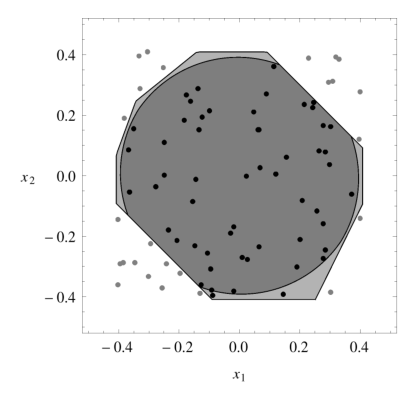

Fig. 4. Final polytope after running Algorithm 2.

### 6.5 Refinement of the polytope $\mathcal{S}$

Summarizing, an approximate solution of the robust optimization problem (43) is computed by solving the convex SDP problems (51), and, on the basis of Algorithm 2, the polytopic-outer approximation $\mathcal{S}$ of the set $\mathcal{M}$ is then defined as $\mathcal{S} = \mathcal{B} \cap \mathcal{H}_1 \cap \ldots \cap \mathcal{H}_J$.

Note that, in solving (51) instead of (43), two different sources of approximation are introduced:

- Approximation of the indicator functions $I_{\{\mathcal{H}_j\}}(p_i)$ with the convex functions $R_{\{\mathcal{H}_j\}}(p_i)$ (see Fig. 3);

- Approximation of the robust constraint $\nu - \boldsymbol{\omega}^{\top}\mathbf{x} \geq 0 \ \ \forall \mathbf{x} \in \mathcal{X}$ with the convex conservative constraint $\nu - \boldsymbol{\omega}^{\top}\mathbf{x} = \sigma_0(\tilde{\mathbf{x}}) - \sum_{s=1}^m \sigma_s(\tilde{\mathbf{x}}) h_s(\tilde{\mathbf{x}})$.

The latter source of approximation can be reduced by increasing the degree $2\mathbf{d}$ of the SOS polynomials. In fact, as already discussed in Section 5.1, according to the *Putinar's Positivstellensatz* each function $\nu - \boldsymbol{\omega}^{\top}\mathbf{x}$ such that $\nu - \boldsymbol{\omega}^{\top}\mathbf{x} \geq 0 \ \forall \mathbf{x} \in \mathcal{X}$ can be written as $\nu - \boldsymbol{\omega}^{\top}\mathbf{x} = \sigma_0(\tilde{\mathbf{x}}) - \sum_{s=1}^m \sigma_s(\tilde{\mathbf{x}}) h_s(\tilde{\mathbf{x}})$ provided that the degree of the SOS polynomials $\sigma_0, \sigma_1, \ldots, \sigma_m$ is large enough. On the other hand, there is no theoretical result concerning the accuracy of the approximation of the indicator functions in Problem (43) with the convex functions $R_{\{\mathcal{H}_j\}}(p_i)$ appearing in Problem (51). Because of that, the polytope $\mathcal{S}$ obtained by solving convex problems (51) (for $j = 1, \ldots, J$) is not guaranteed to minimize the original nonconvex optimization problem (42). Algorithm 3 can then be used to refine the polytopic outer approximation $\mathcal{S}$ provided by Algorithm 2.

The main principle of Algorithm 3 is to process, one by one, all the points belonging to the polytopic outer-approximation $\mathcal{S}$ initially given by Algorithm 2. For each of such points $p_i$, an half-space $\mathcal{H}_i : \boldsymbol{\omega}_i^{*^\top} \tilde{\mathbf{x}} - \nu_i^* \leq 0$ including the set $\mathcal{X}$ (i.e., $\mathcal{X} \subseteq \mathcal{H}_i$) and at the same not containing the point $p_i$ (i.e., $p_i \not\in \mathcal{H}_i$, or equivalently $-\boldsymbol{\omega}_i^{*^\top} p_i + \nu_i^* < 0$) is seeked. In this way, all the points $p_i$ which do not belong to the minimum volume polytopic outer approximation of $\mathcal{X}$ are discarded. Thus, a tighter (but more complex) polytopic outer approximation of $\mathcal{X}$ is obtained.

An important feature enjoyed by the refined polytope $\mathcal{S}^{*}$ is given by the following theorem.

**Theorem 7** The polytope $\mathcal{S}^{*}$ computed with Algorithm 3 is a global minimizer of problem (42).

**Proof:** Let $\tilde{\mathcal{S}}$ be a polytope belonging to the set of feasibility of problem (42) (i.e., $\mathcal{M} \subseteq \tilde{\mathcal{S}}$) which does not minimize (42). This means that there exists a polytope $\tilde{\tilde{\mathcal{S}}}$ such that $\mathcal{M} \subseteq \tilde{\tilde{\mathcal{S}}} \subseteq \tilde{\mathcal{S}}$ and a point $\bar{p}$ given as input of Algorithm 2

<!-- PDF page 15 -->

such that: $\bar{p} \in \tilde{\mathcal{S}}$ and $\bar{p} \not\in \tilde{\tilde{\mathcal{S}}}$. Thus, for $p_i = \bar{p}$, the optimal solution $\{\boldsymbol{\omega}^*_i, \nu^*_i\}$ of Problem (54) is such that $\boldsymbol{\omega}_i^{*^\top} p_i - \nu_i^* > 0$. Let $\mathcal{H}_i$ be the half-space defined as $\mathcal{H}_i : \boldsymbol{\omega}_i^{*^\top} \mathbf{x} - \nu_i^* \leq 0$. Obviously, $\bar{p} \not\in \mathcal{H}_i$. Besides, the output $\mathcal{S}^{*}$ of Algorithm 3 is contained in the hyperspace $\mathcal{H}_i$. Therefore, since $\bar{p} \not\in \mathcal{H}_i$ and $\mathcal{S}^{*} \subseteq \mathcal{H}_i$, it follows that the point $\bar{p} \not\in \mathcal{S}^{*}$. Then, a polytope $\tilde{\mathcal{S}}$ that does not minimize the optimization problem (42) can not be the output of Algorithm 3. $\blacksquare$

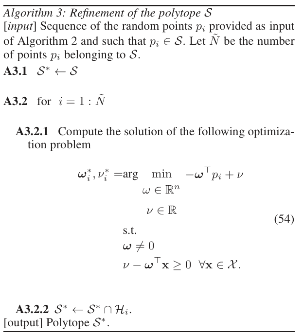

**Algorithm 3: Refinement of the polytope $\mathcal{S}$**

[*input*] Sequence of the random points $p_i$ provided as input of Algorithm 2 and such that $p_i \in \mathcal{S}$. Let $\tilde{N}$ be the number of points $p_i$ belonging to $\mathcal{S}$.

**A3.1** $\mathcal{S}^{*} \leftarrow \mathcal{S}$

**A3.2** for $i = 1 : \tilde{N}$

**A3.2.1** Compute the solution of the following optimization problem

$$
\begin{aligned}
\boldsymbol{\omega}^*_i, \nu^*_i = {} & \arg \min_{\substack{\omega \in \mathbb{R}^n \\ \nu \in \mathbb{R}}} -\boldsymbol{\omega}^{\top} p_i + \nu \\
& \text{s.t.} \\
& \boldsymbol{\omega} \neq 0 \\
& \nu - \boldsymbol{\omega}^{\top} \mathbf{x} \geq 0 \ \ \forall \mathbf{x} \in \mathcal{X}.
\end{aligned} \tag{54}
$$

**A3.2.2** $\mathcal{S}^{*} \leftarrow \mathcal{S}^{*} \cap \mathcal{H}_i$.

[output] Polytope $\mathcal{S}^{*}$.

Theorem 7 mainly says that there exists no polytope including $\mathcal{M}$ and containing less randomly generated points $p_i$ than $\mathcal{S}^{*}$. However, it is worth remarking that only an approximated solution of Problem (54) can be computed, as the robust constraint $\nu - \boldsymbol{\omega}^{\top} \mathbf{x} \geq 0 \ \ \forall \mathbf{x} \in \mathcal{X}$ appearing in (54) has to be handled with the SOS-based techniques described in the previous section. Thus, conservativeness could be added at this step. Therefore, the main interpretation to be given to Theorem 7 is that Algorithm 3 cancels the effect of approximating the indicator function $I_{\{\mathcal{H}_j\}}(p_i)$ with the convex function $R_{\{\mathcal{H}_j\}}(p_i)$.

**Example 5** Let us continue with Example 2. Fig. 5 shows the computed polytope $\mathcal{S}^*_1$, along with the true state uncertainty set $\mathcal{X}_1$. The CPU taken by the proposed algorithm to compute the $54$ hyper-spaces that define the polytope $\mathcal{S}^*_1$ is about $830$ seconds. However, only $80$ out of $830$ seconds are spent by the solver *SeDuMi* to solve $108$ (i.e., $54 \times 2$) SDP problems of the type (51). The other $750$ seconds are required by the *SOStools* interface to formulate, $108$ times, the SDP problems (51) in the format used by SeDuMi. Therefore, the computational time required to compute the polytope $\mathcal{S}^*_1$ can be drastically reduced not only by using more efficient SDP solvers, but also directly formulating the SDP

problems (51) in the format required by the used SDP solver.

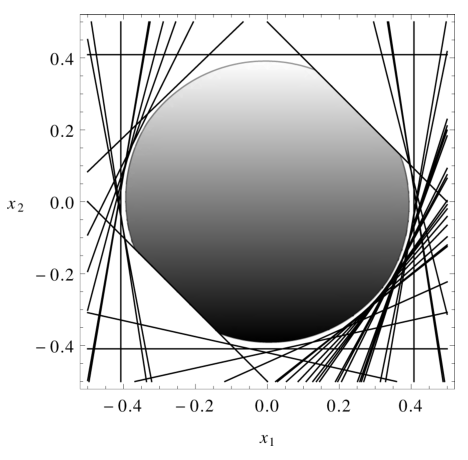

Fig. 5. Exampe 1: hyperplanes defining the polytope $\mathcal{S}^*_1$ (black lines) and true state uncertainty set $\mathcal{X}_1$ (gray region).

## 7 Numerical examples

Let us consider the discrete-time Lotka Volterra prey-predator model [63] described by the difference equations:

$$
\begin{array}{rcl}
x_1(k) &=& x_1(k-1)\left(r+1-rx_1(k-1)-bx_2(k-1)\right)+w_1(k-1),\\
x_2(k) &=& cx_1(k-1)x_2(k-1)+(1-d)x_2(k-1)+w_2(k-1),
\end{array} \tag{55}
$$

where $x_1(k)$ and $x_2(k)$ denote the prey and the predator population size, respectively. In the example, the following values of the parameters are considered: $r = 0.25$, $b = 0.95$, $c = 1.1$ and $d = 0.55$. The observed output is the sum of the population of the prey and predator densities, i.e.,

$$
\mathbf{y}(k) = x_1(k) + x_2(k) + \mathbf{v}(k), \tag{56}
$$

where the measurement noise $\mathbf{v}(k)$ is bounded and such that $\|\mathbf{v}(k)\|_{\infty} \leq 0.05$. The initial prey and predator sizes $\mathbf{x}(0) = \left[ x_1(0) \ \ x_2(0) \right]^{\top}$ are known to belong to the box $\mathcal{X}_0 = \left[ 0.28 \ \ 0.32 \right] \times \left[ 0.78 \ \ 0.82 \right]$ and the noise process $\mathbf{w}(k) = [w_1(k) \ \ w_2(k)]^\top$ is bounded by $\|\mathbf{w}(k)\|_{\infty} \leq 0.001$. The data are obtained by simulating the model with initial conditions $x_1(0) = 0.8$ and $x_2(0) = 0.3$, and by corrupting the output observations with a random noise $\mathbf{v}(k)$ uniformly distributed within the interval $[-0.05 \ \ 0.05]$.

Polytopic outer approximations $\mathcal{S}^*_k$ of the state uncertainty sets $\mathcal{X}_k$ (with $k = 1, \ldots, 40$) are computed through Algorithm 2. $N = 20$ random points are used to approximate the volume of the polytope $\mathcal{S}^*_k$ (as described in Section 6.1). In order to limit the complexity in the description of the polytopes $\mathcal{S}^*_k$, the maximum number of halfspaces describing $\mathcal{S}^*_k$ is set to $8$. This means that Algorithm 2 is stopped after at most $4$ iterations (we remind that the initial outer-bounding box $\mathcal{B}_k$ is already described by $4$ half-spaces). When the

<!-- PDF page 16 -->

output of Algorithm 2 is a polytope $\mathcal{S}^*_k$ described by less than $8$ half-spaces, Algorithms 3 is used to refine the polytopic outer approximation $\mathcal{S}^*_k$. Fig. 6 shows the computed polytopes $\mathcal{S}^*_k$ outer approximating the state uncertainty sets $\mathcal{X}_k$ (with $k = 1, \ldots, 40$), along with the true state trajectory. The *Hybrid toolbox* [64] has been used to plot the polytopes in Fig. 6. The average CPU time required to compute a polytope $\mathcal{S}^*_k$ is $28$ seconds (not including the time required by the *SOStools* interface to formulate the SDP problems (51) in the format used by the solver *SeDuMi*). For the sake of comparison, Fig. 7 shows the outer-bounding approximations of the state uncertainty sets $\mathcal{X}_k$ when boxes, instead of polytopes, are propagated over time. For a better comparison, in Fig. 8 the bounds on the time-trajectory of each state variable obtained by propagating boxes and polytopes are plotted. The obtained results show that, as expected, propagating polytopic uncertainty sets instead of boxes provides a more accurate state estimation. Finally, we would like to remark that a small uncertainty on the noise process is assumed (i.e., $\|\mathbf{w}(k)\|_{\infty} \leq 0.001$) since, for larger bounds on $\|\mathbf{w}(k)\|_{\infty}$, it would not be possible to clearly visualize the uncertainty boxes in Fig. 7.

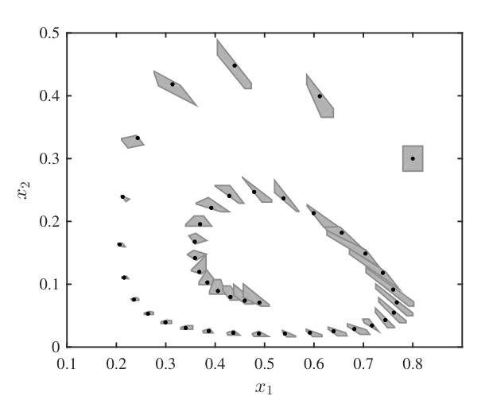

Fig. 6. Example 2: outer-bounding polytopes (gray) and true state trajectory (black dots).

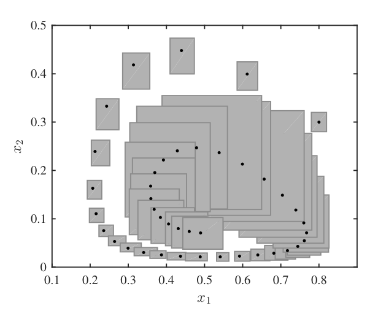

Fig. 7. Example 2: outer-bounding boxes (gray) and true state trajectory (black dots).

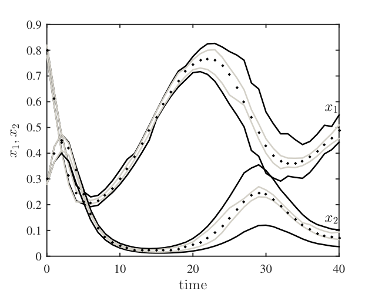

Fig. 8. Example 2: bounds on state trajectories obtained by propagating boxes (black line); bounds on state trajectories obtained by propagating polytopes (gray line); true state trajectory (black dots).

## 8 Conclusions

In this paper we have shown that set-membership estimation can be equivalently formulated in a probabilistic setting by employing sets of probability measures. Inferences in set-membership estimation are thus carried out by computing expectations with respect to the updated set of probability measures $\mathcal{P}$, as in the probabilistic case, and they can be formulated as a semi-infinite linear programming problem. We have further shown that, if the nonlinearities in the measurement and process equations are polynomial and if the bounding sets for initial state, process and measurement noises are described by polynomial inequalities, then an approximation of this semi-infinite linear programming problem can be obtained by using the theory of sum-of-squares polynomial optimization. We have finally derived a procedure to compute a polytopic outer-approximation of the true membership-set, by computing the minimum-volume polytope that outer-bounds the set that includes all the means computed with respect to $\mathcal{P}$. It is worth remarking that the set-membership filtering approach discussed in the paper can be extended to handle noise-corrupted input signal observations and uncertainty in the model parameters, provided that the corresponding state uncertainty set $\mathcal{X}_k$ remains a semi-algebraic set. As future works, we aim first to speed up the proposed state estimation algorithm in order to be able to use it in real-time applications in systems with fast dynamics. To this aim, dedicated numerical algorithms, written in Fortran and C++, for solving the formulated SDP opti

<!-- PDF page 17 -->

mization problems will be developed. Furthermore, the SDP problems will be directly formulated in the format required by the SDP solver, thus avoiding the use of interfaces like *SOStools*. An open source toolbox will be then released. Second, by exploiting the probabilistic interpretation of set-membership estimation, we plan to reformulate it using the theory of moments developed by Lasserre. This will allow us to ground totally set-membership estimation in the realm of the probabilistic setting, which will give us the possibility of combining the two approaches in order to obtain hybrid filters, i.e., filters that include both classical probabilistic uncertainties and set-membership uncertainties.

## References

[1] M. Milanese and A. Vicino, “Optimal estimation theory for dynamic sistems with set membership uncertainty: an overview,” Automatica, vol. 27, no. 6, pp. 997–1009, 1991.

[2] P. L. Combettes, “The foundations of set theoretic estimation,” Proceedings of the IEEE, vol. 81, pp. 182–208, Feb 1993.

[3] M. Milanese, J. Norton, H. Piet-Lahanier, and E. Walter, eds., Bounding approaches to system identification. New York: Plenum Press, 1996.

[4] M. Milanese and C. Novara, “Unified set membership theory for identification, prediction and filtering of nonlinear systems,” Automatica, vol. 47, no. 10, pp. 2141–2151, 2011.

[5] V. Cerone, D. Piga, and D. Regruto, “Set-membership error-in-variables identification through convex relaxation techniques,” IEEE Transactions on Automatic Control, vol. 57, pp. 517–522, 2012.

[6] M. Casini, A. Garulli, and A. Vicino, “Feasible parameter set approximation for linear models with bounded uncertain regressors,” IEEE Transactions on Automatic Control, vol. 50, no. 11, pp. 2910–2920, 2014.

[7] F. C. Schweppe, “Recursive state estimation: Unknown but bounded errors and system inputs,” in Adaptive Processes, Sixth Symposium on, vol. 6, pp. 102 –107, oct. 1967.

[8] D. Bertsekas and I. Rhodes, “Recursive state estimation for a set-membership description of uncertainty,” IEEE Transactions on Automatic Control, vol. 16, pp. 117 – 128, apr 1971.

[9] V. Kuntsevich and M. Lychak, Guaranteed estimates, adaptation and robustness in control systems. Springer-Verlag, 1992.

[10] A. Savkin and I. Petersen, “Robust state estimation and model validation for discrete-time uncertain systems with a deterministic description of noise and uncertainty,” Automatica, vol. 34, no. 2, pp. 271–274, 1998.

[11] E. Fogel and Y. Huang, “On the value of information in system identificationbounded noise case,” Automatica, vol. 18, no. 2, pp. 229 – 238, 1982.

[12] J. R. Deller and S. F. Odeh, “Implementing the optimal bounding ellipsoid algorithm on a fast processor,” in Acoustics, Speech, and Signal Processing, 1989. ICASSP-89., 1989 International Conference on, pp. 1067–1070, IEEE, 1989.

[13] J. R. Deller and T. C. Luk, “Linear prediction analysis of speech based on set-membership theory,” Computer Speech & Language, vol. 3, no. 4, pp. 301 – 327, 1989.

[14] J. R. Deller, M. Nayeri, and M. S. Liu, “Unifying the landmark developments in optimal bounding ellipsoid identification,” International Journal of Adaptive Control and Signal Processing, vol. 8, no. 1, pp. 43–60, 1994.

[15] H. Piet-Lahanier and E. Walter, “Further results on recursive polyhedral description of parameter uncertainty in the bounded-error context,” in Proceedings of the 28th IEEE Conference on Decision and Control, Tampa, Florida, USA, pp. 1964 –1966, 1989.

[16] S. Mo and J. Norton, “Fast and robust algorithm to compute exact polytope parameter bounds,” Mathematics and computers in simulation, vol. 32, no. 5-6, pp. 481–493, 1990.

[17] V. Broman and M. Shensa, “A compact algorithm for the intersection and approximation of N-dimensional polytopes,” Mathematics and computers in simulation, vol. 32, no. 5-6, pp. 469–480, 1990.

[18] L. Chisci, A. Garulli, and G. Zappa, “Recursive state bounding by parallelotopes,” Automatica, vol. 32:7, pp. 1049–1055, 1996.

[19] L. Chisci, A. Garulli, A. Vicino, and G. Zappa, “Block recursive parallelotopic bounding in set membership identification,” Automatica, vol. 34, no. 1, pp. 15–22, 1998.

[20] V. T. H. Le, C. Stoica, T. Alamo, E. F. Camacho, and D. Dumur, Zonotopes: From Guaranteed State-estimation to Control. John Wiley & Sons, 2013.

[21] V. Puig, J. Saludes, and J. Quevedo, “Worst-case simulation of discrete linear time-invariant interval dynamic systems,” Reliable Computing, vol. 9, no. 4, pp. 251–290, 2003.

[22] C. Combastel, “A state bounding observer based on zonotopes,” in European Control Conference, 2003.

[23] V. T. H. Le, T. Alamo, E. F. Camacho, C. Stoica, and D. Dumur, “A new approach for guaranteed state estimation by zonotopes,” in Proceedings of the 18th IFAC World Congress, Milano, Italy, vol. 28, 2011.

[24] T. Alamo, J. Bravo, and E. Camacho, “Guaranteed state estimation by zonotopes,” in Proceedings of the 42nd IEEE Conference on Decision and Control, Maui, Hawaii, USA, pp. 5831 – 5836, dec. 2003.

[25] G. Calafiore, “Reliable localization using set-valued nonlinear filters,” IEEE Transactions on Systems, Man and Cybernetics, Part A: Systems and Humans, vol. 35, no. 2, pp. 189–197, 2005.

[26] L. El Ghaoui and G. Calafiore, “Robust filtering for discrete-time systems with bounded noise and parametric uncertainty,” IEEE Transactions on Automatic Control, vol. 46, no. 7, pp. 1084–1089, 2001.

[27] C. Maier and F. Allgöwer, “A set-valued filter for discrete time polynomial systems using sum of squares programming,” in Proceedings of the 48th IEEE Conference on Decision and Control, Shanghai, China, pp. 223–228, 2009.

[28] F. Dabbene, D. Henrion, C. Lagoa, and P. Shcherbakov, “Randomized approximations of the image set of nonlinear mappings with applications to filtering,” in IFAC Symposium on Robust Control Design (ROCOND 2015), Bratislava (Russia), 2015.

[29] A. Benavoli, “The generalized moment-based filter,” IEEE Transactions on Automatic Control, vol. 58, no. 10, pp. 2642–2647, 2013.

[30] A. Benavoli, M. Zaffalon, and E. Miranda, “Robust filtering through coherent lower previsions,” IEEE Transactions on Automatic Control, 2011.

[31] C. Combastel, “Merging kalman filtering and zonotopic state bounding for robust fault detection under noisy environment,” IFAC-PapersOnLine, vol. 48, no. 21, pp. 289 – 295, 2015. 9th {IFAC} Symposium on Fault Detection, Supervision and Safety for Technical Processes {SAFEPROCESS}, Paris, 2015.

[32] R. Fernandez-Canti, J. Blesa, and V. Puig, “Set-membership identification and fault detection using a bayesian framework,” in Control and Fault-Tolerant Systems (SysTol), 2013 Conference on, pp. 572–577, Oct 2013.

<!-- PDF page 18 -->

[33] A. Gning, L. Mihaylova, and F. Abdallah, “Mixture of uniform probability density functions for non linear state estimation using interval analysis,” in Information Fusion (FUSION), 2010 13th Conference on, pp. 1–8, 2010.

[34] A. Gning, B. Ristic, and L. Mihaylova, “A box particle filter for stochastic and set-theoretic measurements with association uncertainty,” in Information Fusion (FUSION), 2011 Proceedings of the 14th International Conference on, pp. 1–8, 2011.

[35] J. Shohat and J. Tamarkin, The problem of moments. American Mathematical Society, 1950.

[36] M. Krein and A. Nudelḿan, The Markov moment problem and extremal problems, vol. 50. Amer Mathematical Society, 1977.

[37] J. Lasserre, Moments, positive polynomials and their applications, vol. 1 of Imperial College Press Optimization Series. World Scientific, 2009.

[38] V. Cerone, D. Piga, and D. Regruto, “Polytopic outer approximations of semialgebraic sets,” in IEEE 51st Annual Conference on Decision and Control, Maui, Hawaii, USA, pp. 7793–7798, 2012.

[39] A. Karr, “Extreme points of certain sets of probability measures, with applications,” Mathematics of Operations Research, vol. 8, no. 1, pp. 74–85, 1983.

[40] A. Shapiro, “On duality theory of conic linear problems,” in in Semi-Infinite Programming: Nonconvex Optimization and Its Applications, pp. 135–165, 2001.

[41] P. Walley, Statistical Reasoning with Imprecise Probabilities. New York: Chapman and Hall, 1991.

[42] A. Benavoli and M. Zaffalon, “Density-ratio robustness in dynamic state estimation,” Mechanical Systems and Signal Processing, vol. 37, no. 12, pp. 54 – 75, 2013.

[43] J. B. Lasserre, “Global optimization with polynomials and the problem of moments,” SIAM Journal on Optimization, vol. 11, pp. 796–817, 2001.

[44] P. Parrilo, “Semidefinite programming relaxations for semialgebraic problems,” Mathematical Programming, vol. 96, pp. 293–320, 2003.

[45] G. Chesi, A. Garulli, A. Tesi, and A. Vicino, “Solving quadratic distance problems: an LMI-based approach,” IEEE Trans. Automatic Control, vol. 48, no. 2, pp. 200–212, 2003.

[46] M. Putinar, “Positive polynomials on compact semi-algebraic sets,” Indiana University Mathematics Journal, vol. 42, pp. 969–984, 1993.

[47] M. Laurent, “Sums of squares, moment matrices and optimization over polynomials,” Emerging Applications of Algebraic Geometry, Vol. 149 of IMA Volumes in Mathematics and its Applications, M. Putinar and S. Sullivant (eds.), pp. 157–270, 2009.

[48] A. Papachristodoulou, J. Anderson, G. Valmorbida, S. Prajna, P. Seiler, and P. A. Parrilo, SOSTOOLS: Sum of squares optimization toolbox for MATLAB, 2013. url: http://www.eng.ox.ac.uk/control/sostools.

[49] J. F. Sturm, “Using SeDuMi 1.02, a MATLAB Toolbox for optimization over symmetric cones,” Optim. Methods Software, vol. 11, no. 12, pp. 625–653, 1999.

[50] M. Dyer and A. Frieze, “On the complexity of computing the volume of a polyhedron,” SIAM Journal on Computing, vol. 17, pp. 967–974, 1988.

[51] B. Bueler, A. Enge, and K. Fukuda, “Exact volume computation for polytopes: a practical study,” in DMV SEMINAR, vol. 29, pp. 131–154, Springer, 2000.

[52] S. Arora and B. Barak, Computational complexity: a modern approach. Cambridge University Press, 2009.

[53] J. Cohen and T. Hickey, “Two algorithms for determining volumes of convex polyhedra,” Journal of the ACM, vol. 26, no. 3, pp. 401–414, 1979.

[54] E. Allgöwer and P. Schmidt, “Computing volumes of polyhedra.,” Math. Comput., vol. 46, no. 173, pp. 171–174, 1986.

[55] J. B. Lasserre, “An analytical expression and an algorithm for the volume of a convex polyhedron in $R^n$,” Journal of optimization theory and applications, vol. 39, no. 3, pp. 363–377, 1983.

[56] A. Bemporad, C. Filippi, and F. Torrisi, “Inner and outer approximations of polytopes using boxes,” Computational Geometry, vol. 27, no. 2, pp. 151–178, 2004.

[57] J. Lawrence, “Polytope volume computation,” Mathematics of Computation, vol. 57, no. 195, pp. 259–271, 1991.

[58] J. B. Lasserre and E. S. Zeron, “A Laplace transform algorithm for the volume of a convex polytope,” Journal of the ACM, vol. 48, no. 6, pp. 1126–1140, 2001.

[59] R. Smith, “Efficient Monte Carlo procedures for generating points uniformly distributed over bounded regions,” Operations Research, pp. 1296–1308, 1984.

[60] M. Dyer, A. Frieze, and R. Kannan, “A random polynomial-time algorithm for approximating the volume of convex bodies,” Journal of the ACM, vol. 38, no. 1, pp. 1–17, 1991.

[61] S. Wiback, I. Famili, H. Greenberg, and B. Palsson, “Monte Carlo sampling can be used to determine the size and shape of the steady-state flux space,” Journal of theoretical biology, vol. 228, no. 4, pp. 437–447, 2004.

[62] C. Robert and G. Casella, Monte Carlo statistical methods. Springer Science, 2004.

[63] M. R. S. Raj, A. G. M. Selvam, and R. Janagaraj, “Stability in a discrete prey-predator model,” Internation Journal of Latest Research in Science and Technology, vol. 2, no. 1, pp. 482–485, 2013.

[64] A. Bemporad, “Hybrid Toolbox - User’s Guide,” 2004. url: http://cse.lab.imtlucca.it/ bemporad/hybrid/toolbox.

<!-- PDF page 19 -->

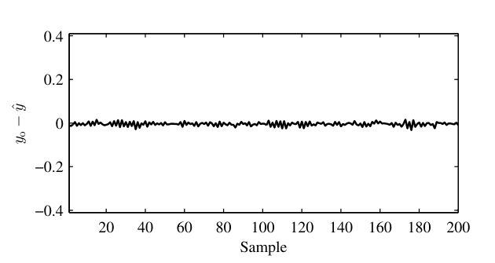

<!-- PDF page 20 -->

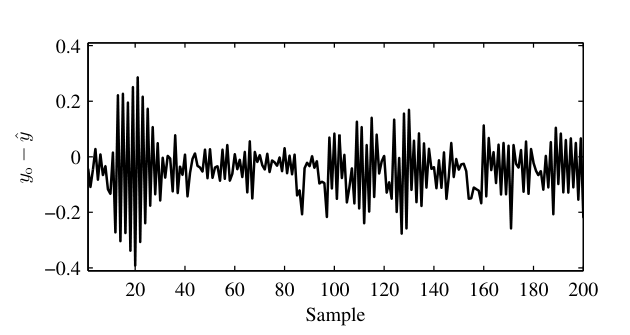
