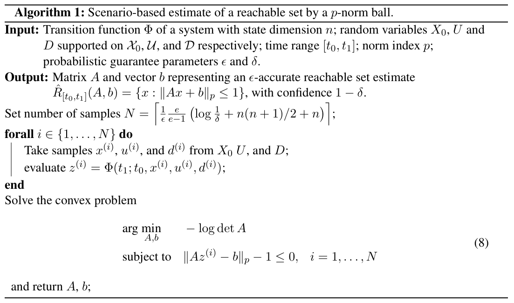
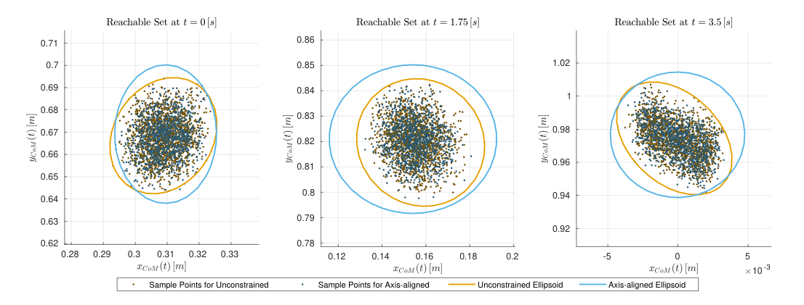

## Conversion notes

- Source: A. Devonport and M. Arcak, "Estimating Reachable Sets with Scenario Optimization", L4DC 2020, Proceedings of Machine Learning Research vol. 120, pp. 75-84; converted from the PDF supplied as the PMLR v120 proceedings version (10 pages, single column, PDF produced 2020-05-01). The PDF pages carry no proceedings banner, running head or printed page number; page numbers mentioned in these notes are PDF pages 1-10.
- The authors' TeX source was not available. All mathematics (inline and displayed, equations (1)-(11), Theorems 1-2, Algorithm 1) was transcribed visually to LaTeX from 170-260 dpi renders of the PDF and cross-checked against the PDF's native text layer. Every formula was fully legible; no formula is kept as an image.
- Algorithm 1 is provided both as an image crop (assets/figure/algorithm-1.jpg) and as a LaTeX transcription; equation (8) is printed inside the Algorithm 1 box (PDF page 6), i.e. after equations (9)-(10) in reading order.
- The paper's own misprints are reproduced verbatim, not corrected: the chance constraint of equation (7) is printed with '\le 1 - \epsilon' (equations (2), (3) and (9) use '\ge 1 - \epsilon'); the Output line of Algorithm 1 prints '\|Ax + b\|_p \le 1' whereas equations (6) and (8) use 'Ax - b'; Section 3 prints '\Theta \in \mathbb{R}^{n_\theta}' (element-of sign, where a subset relation would be expected); Theorem 1 starts with a lower-case 'let'.
- Theorem and proof labels are bold with the printed punctuation, which is none ('**Theorem 1 (Tempo et al. (2012), Corollary 12.1)**', '**Theorem 2**', '**Proof**'). The PDF prints theorem statements in italics; the italics are not reproduced: Theorem 1 runs from 'let' to 'with probability $\ge 1 - \delta$.' and Theorem 2 from 'Let' to equation (10). The norm delimiters are written \| throughout (the PDF typesets them as '||' in the running text and as \| in Algorithm 1).
- Table 1 is transcribed as cells (CSV); its first header cell is empty in the PDF. The paper has no appendix or supplementary material.

<!-- PDF page 1 -->

# Estimating Reachable Sets with Scenario Optimization

**Alex Devonport** ALEX_DEVONPORT@BERKELEY.EDU  
*Department of Electrical Engineering and Computer Sciences*  
*University of California, Berkeley*

**Murat Arcak** ARCAK@BERKELEY.EDU  
*Department of Electrical Engineering and Computer Sciences*  
*University of California, Berkeley*

## Abstract

Many practical systems are not amenable to the reachability methods that give guarantees of correctness, since they have dynamics that are strongly nonlinear, uncertain, and possibly unknown. While reachable sets for these kinds of systems can still be estimated in a *data-driven* way, data-driven methods typically do not guarantee the validity of their results. However, certain data-driven approaches may be given a *probabilistic* guarantee of correctness, by reframing the problem as a chance-constrained optimization problem that is solved with scenario optimization. We apply this approach to the problem of approximating a reachable set by a norm ball from data. The method requires only $O(n^2)$ sample trajectories and the solution of a convex problem. A variant of the method restricted to *axis-aligned* norm balls requires only $O(n)$ samples.

**Keywords:** Reachability analysis; Scenario optimization; Randomized algorithms.

## 1. Introduction

Control systems that manage safety-critical applications must be guaranteed to keep the system safe in the face of uncertainty. An increasingly popular and effective way to provide such a guarantee is *reachability analysis*, a set-based method that characterizes all possible evolutions of the system by computing *reachable sets*. However, reachability analysis poses a significant computational challenge. Even for simple systems, computing exact reachable sets is known to be an unsolvable problem (Fijalkow et al. (2019)), meaning that computing exact reachable sets is not a plausible goal. All practical reachability analysis methods therefore settle for computing approximations to the true reachable set.

Many methods have been developed to compute reachable set approximations. The methods that produce the most accurate approximations are those based on Hamilton-Jacobi equation (Mitchell et al. (2005)) or dynamic programming (Bertsekas and Rhodes (1971)), but their accuracy comes at the cost of scalability. Methods designed for better scalability typically draw approximations from a restricted family of sets, such as ellipsoids (Kurzhanski and Varaiya (2000)), zonotopes (Althoff (2015)), or multidimensional intervals (Chen et al. (2013); CAPD (2019); Meyer et al. (2019)). Many methods also focus on a specific class of system dynamics, such as linear systems or systems with bounded or sign-stable Jacobians, and use these system properties to speed up computations.

However, there are many important cases in which these methods cannot be applied. Some cases arise when the system of interest is high-dimensional and does not satisfy the system assumptions that allow the faster methods to be used. Others arise when the system of interest is only available

<!-- PDF page 2 -->

in a form that is mathematically inaccessible (such as a large SIMULINK model), or is only available through simulations or experiments. For systems such as these, reachable sets can still be computed in a *data-driven* manner, in which the reachable set is estimated using a finite collection of sample trajectories of the system. For example, the samples can be generated by simulating trajectories with initial conditions selected from a uniform grid, and used to approximate a bound on the reachable set. Under suitable system assumptions, this *quasi-Monte Carlo* approach can provide a formal guarantee of correctness (Tempo et al. (2012)). However, the grid-based sampling scheme requires a number of samples that increases exponentially in $n$, so it does not scale well to high-dimensional systems. To combat the exponential complexity of the quasi-Monte Carlo method, another common approach is to simply select a number of initial conditions at random. In practice this *Monte Carlo* approach can be effective, but it is often applied without any formal guarantee of correctness. Without a guarantee, a reachable set loses much of its power, as it cannot provide any assurance that controller specifications have been met.

In this paper, we show that a class of Monte Carlo-type data-driven methods for reachability analysis may be given a probabilistic guarantee of correctness, meaning that the estimated reachable set can be guaranteed to contain a certain measure of the reachable set with high probability. The probabilistic guarantee is established by reframing the problem of estimating a reachable set from trajectory data as a *scenario optimization* problem. Scenario optimization is an approach to solving chance-constrained optimization problems by solving a convex, non-probabilistic relaxation of the problem (Dembo (1991)). Solutions of the relaxed problem, if they exist, are guaranteed to satisfy the original problem with high probability. Furthermore, scenario optimization provides a *sample complexity bound*: for a desired probability of satisfying the original problem, the size of the relaxed problem is known in advance (Calafiore and Campi (2006); Campi and Garatti (2008)). These results hold for a wide range of probabilistic uncertainties, including those that inhabit infinite-dimensional spaces (Esfahani et al. (2014)). Scenario optimization has been used as a randomized approach to solving robust control problems. For example, Margellos et al. (2014) uses scenario optimization to construct axis-aligned hyperrectangles that contain a certain probability mass of a random disturbance. We apply a similar construction, allowing for more general sets, to the problem of reachability analysis.

There is some precedent for using scenario optimization to solve problems related to reachability. Yang et al. (2016) uses scenario optimization to solve a chance-constrained formulation of a multi-aircraft collision avoidance problem with ellipsoidal reachable sets, in which the randomness in the problem arises from unknown wind conditions. Ioli et al. (2017) proposes a benchmark problem for robust control synthesis in which the controller must minimize the size of the reachable set of energy fluctuations for a microgrid modeled as a discrete-time linear time-invariant system, and propose a scenario-based solution to the problem. Sartipizadeh et al. (2019) develops a scenario-based approach for solving reach-avoid problems on discrete-time linear time-invariant systems with additive probabilistic uncertainty. Hewing and Zeilinger (2019) investigates a scenario-based approach to provide prediction error bounds for stochastic model-predictive control of discrete-time, linear time-invariant systems with additive noise. These works focus on controller synthesis for cases in which the system dynamics are known to be of a certain type such as linear time-invariant, and where reachability is used to verify safety of the synthesized controller. They use scenario optimization to mitigate the difficulty of robust synthesis and reach-avoid analysis. However, scenario optimization may also be used to mitigate the issue of model uncertainty when computing reachable sets.

<!-- PDF page 3 -->

Our contribution is to show that scenario optimization may be used to provide guarantees for a range of data-driven reachability analysis methods that are applicable to a general class of systems. Specifically, we investigate a Monte Carlo-type method that provides reachable set estimates in the form of *norm ball* sets, with the optional restriction that the norm balls be *axis-aligned*. For each of these classes of norm ball sets, we provide a sample complexity bound derived from the scenario optimization representation of the problem. The sample complexity turns out to be quadratic with respect to the state dimension for the general norm ball case, and linear in the axis-aligned case.

## 2. Forward Reachable Sets

We consider a general dynamical system with a state transition function $\Phi(t_1; t_0, x_0, u, d)$ that maps an initial state $x_0 \in \mathbb{R}^n$ at time $t_0$ to a unique final state at time $t_1$, under the influence of the system dynamics, an input $u : [t_0, t_1] \to \mathbb{R}^p$, and a disturbance $d : [t_0, t_1] \to \mathbb{R}^w$. For instance, when the system state dynamics $\dot{x}(t) = f(t, x(t), u(t), d(t))$ are known and has unique solutions on the interval $[t_0, t_1]$, then $\Phi(t_1; t_0, x_0, u, d)$ is just the value $\phi(t_1)$, where $\phi$ is the solution satisfying $\phi(t_0) = x_0$.

For the problem of forward reachability analysis, we are also given an *initial set* $\mathcal{X}_0 \subset \mathbb{R}^n$, a set $\mathcal{U}$ of allowed inputs, and a set $\mathcal{D}$ of allowed disturbances. The *forward reachable set* is then defined as

$$
R_{[t_0,t_1]} = \{\Phi(t_1; t_0, x_0, u, d) : x_0 \in \mathcal{X}_0, u \in \mathcal{U}, d \in \mathcal{D}\}, \tag{1}
$$

that is the set of all states to which the system can transition at time $t_1$ if it starts in a state in $\mathcal{X}_0$ at time $t_0$ and is subject to an input in $\mathcal{U}$ and a disturbance in $\mathcal{D}$.

Since the exact reachable set cannot be computed, we must settle for the goal of computing some approximation $\hat{R}_{[t_0,t_1]}$. The approximating set is drawn from a family of sets that is described by a vector parameter $\theta$, so that the task of computing the approximation is reduced to finding a parameter. For instance, if we choose to approximate the reachable set with an *ellipsoid*, that is a set of the form $\hat{R}_{[t_0,t_1]}(A, b) = \{x : \|Ax - b\|_2 \le 1\}$, then the parameter is $\theta = (A, b)$.

Typically, $\hat{R}_{[t_0,t_1]}$ is designed to be either an overapproximation (so that $R_{[t_0,t_1]} \subset \hat{R}_{[t_0,t_1]}$) or an underapproximation (so that $\hat{R}_{[t_0,t_1]} \subset R_{[t_0,t_1]}$). These approximations are useful for making safety guarantees, but reachable sets that are estimated from samples will generally not be either. Since we are focusing on a data-driven approach to reachable set computation, we will instead aim to compute an approximation that is similar to the true reachable set in a probabilistic sense.

Suppose we have a random variable $Z$ whose support is the reachable set, that is such that its probability density function (pdf) $p_Z$ satisfies $p_Z(x) = 0$ for $x$ outside of the reachable set and $p_Z(x) > 0$ for $x$ inside it. In that case, $R_{[t_0,t_1]}$ is by definition an event with probability one, and any set that is disjoint with $R_{[t_0,t_1]}$ has probability zero. Any set that contains part of the reachable set will have some probability in between, with a higher probability indicating that it contains more of the reachable set. We therefore want to compute a reachable set approximation that is guaranteed to have a high probability under such a distribution. If an approximation satisfies $P_Z(\hat{R}_{[t_0,t_1]}) \ge 1 - \epsilon$, where $P_Z$ is the probability measure of $Z$, then we say that this is an *$\epsilon$-accurate* approximation with respect to the distribution $p_Z$.

A reachable set approximation that is $\epsilon$-accurate may still be quite conservative: in addition to the part of the approximation with measure $1 - \epsilon$, it could also contain a large portion of the state space outside of the reachable set with measure zero. For most approximation classes this

<!-- PDF page 4 -->

conservatism cannot be eliminated, but it should be avoided. Therefore, our goal is not just to compute an $\epsilon$-accurate reachable set, but to compute an $\epsilon$-accurate reachable set with as small a volume as possible.

This goal can be stated as a chance-constrained optimization problem:

$$
\begin{aligned}
\underset{\theta}{\text{minimize}} \quad & \mathrm{Vol}(\hat{R}_{[t_0,t_1]}(\theta)) \\
\text{subject to} \quad & P_Z(\hat{R}_{[t_0,t_1]}(\theta)) \ge 1 - \epsilon
\end{aligned} \tag{2}
$$

This optimization problem is intractable in general. However, in certain cases we may approximately solve this problem using *scenario optimization*, arriving at a probabilistically guaranteed Monte Carlo approach to estimating the reachable set.

## 3. Scenario Optimization

Scenario optimization is a technique to approximately solve optimization problems of the form

$$
\begin{aligned}
\underset{\theta}{\text{minimize}} \quad & J(\theta) \\
\text{subject to} \quad & P_Z(g(\theta, Z) \le 0) \ge 1 - \epsilon \\
& \theta \in \Theta,
\end{aligned} \tag{3}
$$

where $J$ and $g$ are convex functions, $\Theta \in \mathbb{R}^{n_\theta}$ is convex and compact, and $P_Z$ is a probability measure with respect to a random variable $Z$. Solving (3) directly is an intractable problem because the probabilistic constraint is difficult to enforce for general random variables, and is not guaranteed to be convex even when $g$ is a convex.

Scenario optimization proceeds by solving a deterministic approximation of the problem:

$$
\begin{aligned}
\underset{\theta}{\text{minimize}} \quad & J(\theta) \\
\text{subject to} \quad & g(\theta, z^{(i)}) \le 0, \quad i = 1, \dots, N \\
& \theta \in \Theta,
\end{aligned} \tag{4}
$$

where $\{z^{(i)}\}_{i=1}^{N}$ are $N$ independently and identically-distributed (iid) samples from $Z$. This problem is a non-probabilistic convex program, and so can be solved efficiently even in the general case by a range of standard solvers.

The Scenario optimization approach proposes that the minimizer of (4), which we can easily find, is also a feasible solution of (3) with high probability. Furthermore, there is a lower bound on this probability with respect to $N$:

**Theorem 1 (Tempo et al. (2012), Corollary 12.1)** let $\delta \in (0, 1)$. If $N$ is selected according to

$$
N \ge \frac{1}{\epsilon} \left( \frac{e}{e-1} \right) \left( \log\frac{1}{\delta} + n_\theta \right), \tag{5}
$$

where $\mathrm{e}$ is the Euler number, then a minimizer of (4), if it exists, is a feasible solution to (3) with probability $\ge 1 - \delta$.

While the convexity requirements on $J$ and $g$ can be restrictive, there is a hidden freedom: the random variable $Z$ in the probabilistic constraint may have arbitrary support. In our case, we will choose a random variable whose support is $R_{[t_0,t_1]}$.

<!-- PDF page 5 -->

## 4. Scenario-Based Reachability with Norm Balls

The method presented here uses trajectory data to approximate the reachable set with a *$p$-norm ball*, that is a set of the form

$$
\hat{R}_{[t_0,t_1]}(A, b) = \{x : \|Ax - b\|_p \le 1\} \tag{6}
$$

where $x, b \in \mathbb{R}^n$, $A \in \mathbb{R}^{n \times n}$, and $p$ may be either any real $\ge 1$ or $\infty$. The class of $p$-norm balls encompasses several types of sets that are popular in reachability analysis. For instance, choosing $p = 2$ leads to the class of ellipsoids, and choosing $p = \infty$ and restricting $A$ to be diagonal leads to the class of multidimensional intervals.

### 4.1. Unconstrained Norm Balls

We first consider the general case, where $A$ may be any symmetric matrix. We use $-\log\det A$ as a proxy for the volume of $\hat{R}_{[t_0,t_1]}(A, b)$. The value $-\log\det(A)$ is directly proportional to the volume of a 2-norm ball; by the equivalence of norms, it is a suitable proxy for the volume of other $p$-norm balls as well. Using this proxy, the minimum-volume $\epsilon$-accurate reachable set problem (2) becomes

$$
\begin{aligned}
\arg\min_{A,b} \quad & -\log\det A \\
\text{s.t.} \quad & P_Z(\|AZ - b\|_p - 1 \le 0) \le 1 - \epsilon,
\end{aligned} \tag{7}
$$

where $Z$ is a random variable whose support is $R_{[t_0,t_1]}$. Since $-\log\det A$ and $\|AZ - b\|_p - 1$ are convex in $A$ and $b$, (7) is a convex chance-constrained optimization problem, meaning that it can be solved using scenario optimization.

We use the transition function $\Phi$ to construct a suitable $Z$. Specifically, let $X_0$, $U$, and $D$ be given random variables whose supports are the initial set, input set, and disturbance set. Then the support of the random variable $Z = \Phi(t_1; t_0, X_0, U, D)$ is exactly the reachable set.

The approach is outlined in Algorithm 1. The output is a matrix $A$ and vector $b$ for a norm ball reachable set estimate that is $\epsilon$-accurate with high probability with respect to $Z$. This is the probabilistic guarantee of correctness, which we formally present with Theorem 2.

**Theorem 2** Let $\epsilon, \delta \in (0, 1)$, and let $X_0$, $U$, and $D$ be random variables over $\mathcal{X}_0$, $\mathcal{U}$, and $\mathcal{D}$ respectively, and let $Z = \Phi(t_1; t_0, X_0, U, D)$. Denote by $P_S$ the probability measure corresponding to the multisample of $N = \left\lceil \frac{1}{\epsilon} \frac{e}{e-1} \left( \log\frac{1}{\delta} + n(n+1)/2 + n \right) \right\rceil$ points taken from $X_0$, $U$, and $D$, and by $P_Z$ the probability measure corresponding to $Z$. Then the output $(A, b)$ of Algorithm 1 satisfies the following probability inequality:

$$
P_S(P_Z(\hat{R}_{[t_0,t_1]}(A, b)) \ge 1 - \epsilon) \ge 1 - \delta; \tag{9}
$$

or, in other words,

$$
P_S(\hat{R}_{[t_0,t_1]}(A, b) \text{ is } \epsilon\text{-accurate with respect to } Z) \ge 1 - \delta. \tag{10}
$$

**Proof** If $(A, b)$ is a feasible solution to (7), then $\hat{R}_{[t_0,t_1]}(A, b)$ is by construction an $\epsilon$-accurate estimate. Algorithm 1 finds a solution to (8), which is the scenario problem corresponding to (7). The decision variables of (7) are a symmetric $n \times n$ real matrix and a real $n$-vector, so $n_\theta = n(n+1)/2 + n$. The $N$ chosen in Algorithm 1 satisfies the sample bound in Theorem 1 for this $n_\theta$. Therefore, the $A$ and $b$ that minimize (8) is a feasible solution to (7) with probability $1 - \delta$. $\blacksquare$

<!-- PDF page 6 -->

**Algorithm 1:** Scenario-based estimate of a reachable set by a $p$-norm ball.

**Input:** Transition function $\Phi$ of a system with state dimension $n$; random variables $X_0$, $U$ and $D$ supported on $\mathcal{X}_0$, $\mathcal{U}$, and $\mathcal{D}$ respectively; time range $[t_0, t_1]$; norm index $p$; probabilistic guarantee parameters $\epsilon$ and $\delta$.

**Output:** Matrix $A$ and vector $b$ representing an $\epsilon$-accurate reachable set estimate $\hat{R}_{[t_0,t_1]}(A, b) = \{x : \|Ax + b\|_p \le 1\}$, with confidence $1 - \delta$.

Set number of samples $N = \left\lceil \frac{1}{\epsilon} \frac{e}{e-1} \left( \log\frac{1}{\delta} + n(n+1)/2 + n \right) \right\rceil$;

**forall** $i \in \{1, \dots, N\}$ **do**

&emsp;&emsp;Take samples $x^{(i)}$, $u^{(i)}$, and $d^{(i)}$ from $X_0$ $U$, and $D$;

&emsp;&emsp;evaluate $z^{(i)} = \Phi(t_1; t_0, x^{(i)}, u^{(i)}, d^{(i)})$;

**end**

Solve the convex problem

$$
\begin{aligned}
\arg\min_{A,b} \quad & -\log\det A \\
\text{subject to} \quad & \|Az^{(i)} - b\|_p - 1 \le 0, \quad i = 1, \dots, N
\end{aligned} \tag{8}
$$

and return $A$, $b$;

While Theorem 2 does not guarantee that the reachable set approximation provided by Algorithm 1 is an over- or under-approximation of the true reachable set, it still asserts that the computed reachable set approximation is accurate in a probabilistic sense with respect to the random variables used to compute it.

The *sample complexity* of a randomized algorithm is the number of samples needed for the algorithm to run such that its output satisfies a guarantee of correctness. For instance, from the sample bound (5), the sample complexity of an algorithm based on scenario optimization with respect to the probabilistic guarantee parameters is $O(\frac{1}{\epsilon})$ and $O(\log\frac{1}{\delta})$. For Algorithm 1, the sample complexity also depends on the state dimension $n$. This dependence can be determined from (5), and depends on how $n$ affects the number $n_\theta$ of decision variables. In Algorithm 1, the $A$ matrix requires $n(n+1)/2$ decision variables and the $b$ vector requires $n$ decision variables. This means that $n_\theta = n(n+1)/2 + n$, so the sample complexity of Algorithm 1 is $O(n^2)$. Note that the sample bound of Theorem 2 depends only on the parameters $\epsilon$ and $\delta$, and the state dimension $n$. The system may therefore have inputs and disturbances of any dimension without affecting the sample complexity.

### 4.2. Axis-aligned Norm Balls

The quadratic sample complexity of the method in the previous section is not scalable to systems of high dimension, or systems for which the transition function takes a long time to evaluate. For these systems, we would like a variant of the method with less than quadratic sample complexity. The source of the quadratic term in the sample complexity is the number of free variables in the $A$ matrix. If we constrain the structure of the $A$ matrix so that it has fewer than $O(n^2)$ free variables, then the sample complexity will be lowered.

<!-- PDF page 7 -->

One such constraint is to require that the $A$ matrix be diagonal. In this case, the $A$ matrix has only $n$ free variables, and the overall sample complexity is reduced from $O(n^2)$ to $O(n)$. Specifically, in the case of diagonal $A$, Algorithm 1 can run with the reduced sample size

$$
N_{diag} = \left\lceil \frac{1}{\epsilon} \frac{e}{e-1} \left( \log\frac{1}{\delta} + 2n \right) \right\rceil, \tag{11}
$$

since the free variables in $A$ and $b$ lead to $n_\theta = 2n$.

However, the constraint on the structure of $A$ also induces a constraint on the types of norm ball sets that are available as reachable set estimates. In the $p = 2$ case, the norm balls with diagonal $A$ are ellipsoids whose principal axes are parallel to the coordinate axis defined by the standard basis for $\mathbb{R}^n$. By analogy with these “axis-aligned” ellipsoids, we call any $p$-norm ball with a diagonal $A$ matrix an axis-aligned norm ball.

The class of axis-aligned $p$-norm balls with $p = \infty$ is identical to the set of axis-aligned hyperrectangles. In this case, the difficulty of the optimization problem is reduced as well as the sample complexity: solving (8) reduces to finding the smallest axis-aligned hyperrectangle containing all of the sample points $z^{(i)}$. This is just the hyperrectangle whose largest and smallest points (with respect to the standard partial order) are the elementwise maximum and minimum of the $z^{(i)}$.

## 5. Example: Safety Verification of a Medical Exoskeleton

We consider a problem posed in Narvaez-Aroche et al. (2018) to evaluate the safety of a control system in a medical application. The system is an exoskeleton: specifically, a brace for the lower limbs, which has actuators to assist with movement. The exoskeleton and its user are modeled as a three-link planar robot, which has six states and 12 parameters that depend on the user’s weight. The controller is a finite-time LQR controller that follows a trajectory that brings the user from a sitting position to a standing position over the course of 3.5 seconds. The problem is to verify that the controller can safely bring the user from sitting to standing over a range of parameters effected by a 5% variation in body weight. The authors of Narvaez-Aroche et al. (2018) solve the problem by computing the forward reachable set at three times and ensuring that no unsafe states (such as a fallen position) are reached.

We perform the same reachability-based safety verification using Algorithm 1, treating the uncertain parameters as constant-valued disturbances with values sampled uniformly from the allowed range. We take $p = 2$, and for the guarantee we take $\epsilon = 0.05$, $\delta = 10^{-9}$. This guarantees that Algorithm 1 will produce an ellipsoid containing at least $0.95$ of the measure of the reachable set distribution, with only a “one in a billion” chance of failure. To assert this guarantee, the sample bound of Algorithm 1 requires $N = 1510$ samples. Using the axis-aligned variant of Algorithm 1 reduces the bound to $N_{diag} = 1036$ samples. Figure 1 shows the reachable sets computed by Algorithm 1 in the unconstrained and axis-aligned cases, projected from the six kinematic states onto the $x$- and $y$- coordinates of the center of mass.

To verify that the computed reachable sets satisfy the *a priori* guarantee that they are $\epsilon$-accurate, we compute an *a posteriori* empirical estimate of their measures with an additional $46,052$ samples. With this number of samples, a one-sided Chernoff bound holds, which ensures that the *a posteriori* estimate of the measure exceeds the true measure by no more than $.01$ with confidence $0.9999$. The results are shown in Table 1, and validate that the sets are indeed $\epsilon$-accurate. Table 1 also shows the details of the computation times. All computations were done on a 3.6 GHz Intel CPU, running MATLAB on one thread.

<!-- PDF page 8 -->

Figure 1: Reachable set estimates for the exoskeleton computed using Algorithm 1, projected from six kinematic states to the $x$- and $y$-positions of the center of mass. The sample points used to compute each ellipsoid are also shown.

[Table 1](s001-devonport2020estimating/table-1.csv)

Table 1: Computation times and empirical measures for the reachable sets shown in Fig. 1.

## 6. Conclusions

The method of scenario optimization offers a partial solution to the lack of correctness guarantees for data-driven approaches to reachability analysis. We have found that several simple Monte Carlo-type approaches to approximating reachable sets can be put on a solid foundation and supplied with probabilistic guarantees of correctness by framing them as scenario optimization problems. In this paper we have focused on two variants of the case of approximation by norm balls, which lead to scalable sample complexities and efficiently-solvable optimization problems.

However, the scenario optimization approach has two limitations. First, the reachable set approximations must be convex sets, since the scenario optimization guarantee will not hold otherwise. Second, the requirement that the scenario optimization problem be constructed from iid samples precludes this approach from providing guarantees for active learning-based approaches, in which case the sample distribution would have correlations.

## Acknowledgments

This work was supported in part by the grants ONR N00014-18-1-2209, AFOSR FA9550-18-1-0253, NSF ECCS-1906164.

<!-- PDF page 9 -->

## References

Matthias Althoff. An introduction to CORA 2015. In *Proc. of the Workshop on Applied Verification for Continuous and Hybrid Systems*, 2015.

D.P. Bertsekas and I.B. Rhodes. On the minimax reachability of target sets and target tubes. *Automatica*, 7(2):233 – 247, 1971. ISSN 0005-1098. doi: https://doi.org/10.1016/0005-1098(71)90066-5. URL http://www.sciencedirect.com/science/article/pii/0005109871900665.

Giuseppe C Calafiore and Marco C Campi. The scenario approach to robust control design. *IEEE Transactions on Automatic Control*, 51(5):742–753, 2006.

Marco C Campi and Simone Garatti. The exact feasibility of randomized solutions of uncertain convex programs. *SIAM Journal on Optimization*, 19(3):1211–1230, 2008.

CAPD. Computer assisted proofs in dynamics group, a c++ package for rigorous numerics, 2019. URL http://capd.ii.uj.edu.pl/.

Xin Chen, Erika Ábrahám, and Sriram Sankaranarayanan. Flow\*: An analyzer for non-linear hybrid systems. In *International Conference on Computer Aided Verification*, pages 258–263. Springer, 2013.

Ron S Dembo. Scenario optimization. *Annals of Operations Research*, 30(1):63–80, 1991.

Peyman Mohajerin Esfahani, Tobias Sutter, and John Lygeros. Performance bounds for the scenario approach and an extension to a class of non-convex programs. *IEEE Transactions on Automatic Control*, 60(1):46–58, 2014.

Nathanaël Fijalkow, Joël Ouaknine, Amaury Pouly, João Sousa-Pinto, and James Worrell. On the decidability of reachability in linear time-invariant systems. In *Proceedings of the 22nd ACM International Conference on Hybrid Systems: Computation and Control*, pages 77–86. ACM, 2019.

Lukas Hewing and Melanie N Zeilinger. Scenario-based probabilistic reachable sets for recursively feasible stochastic model predictive control. *IEEE Control Systems Letters*, 4(2):450–455, 2019.

Daniele Ioli, Alessandro Falsone, Hartung Marianne, Busboom Axel, and Maria Prandini. A smart grid energy management problem for data-driven design with probabilistic reachability guarantees. In *4th International Workshop on Applied Verification of Continuous and Hybrid Systems*, volume 48, pages 2–19, 2017.

Alexander B Kurzhanski and Pravin Varaiya. Ellipsoidal techniques for reachability analysis. In *International Workshop on Hybrid Systems: Computation and Control*, pages 202–214. Springer, 2000.

Kostas Margellos, Paul Goulart, and John Lygeros. On the road between robust optimization and the scenario approach for chance constrained optimization problems. *IEEE Transactions on Automatic Control*, 59(8):2258–2263, 2014.

Pierre-Jean Meyer, Alex Devonport, and Murat Arcak. Tira: toolbox for interval reachability analysis. In *Proceedings of the 22nd ACM International Conference on Hybrid Systems: Computation and Control*, pages 224–229. ACM, 2019.

Ian M Mitchell, Alexandre M Bayen, and Claire J Tomlin. A time-dependent hamilton-jacobi formulation of reachable sets for continuous dynamic games. *IEEE Transactions on automatic control*, 50(7):947–957, 2005.

<!-- PDF page 10 -->

Octavio Narvaez-Aroche, Pierre-Jean Meyer, Murat Arcak, and Andrew Packard. Reachability analysis for robustness evaluation of the sit-to-stand movement for powered lower limb orthoses. In *ASME 2018 Dynamic Systems and Control Conference*, Atlanta, GA, USA, October 2018.

Hossein Sartipizadeh, Abraham P Vinod, Behçet Açikmeşe, and Meeko Oishi. Voronoi partition-based scenario reduction for fast sampling-based stochastic reachability computation of linear systems. In *2019 American Control Conference (ACC)*, pages 37–44. IEEE, 2019.

Roberto Tempo, Giuseppe Calafiore, and Fabrizio Dabbene. *Randomized algorithms for analysis and control of uncertain systems: with applications*. Springer Science & Business Media, 2012.

Yang Yang, Jun Zhang, Kai-Quan Cai, and Maria Prandini. Multi-aircraft conflict detection and resolution based on probabilistic reach sets. *IEEE Transactions on Control Systems Technology*, 25(1):309–316, 2016.
