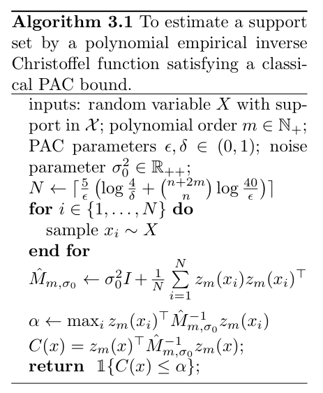
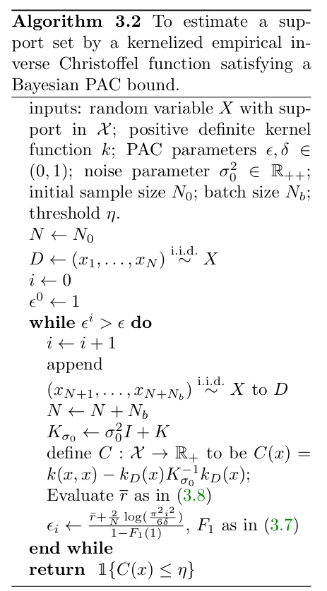
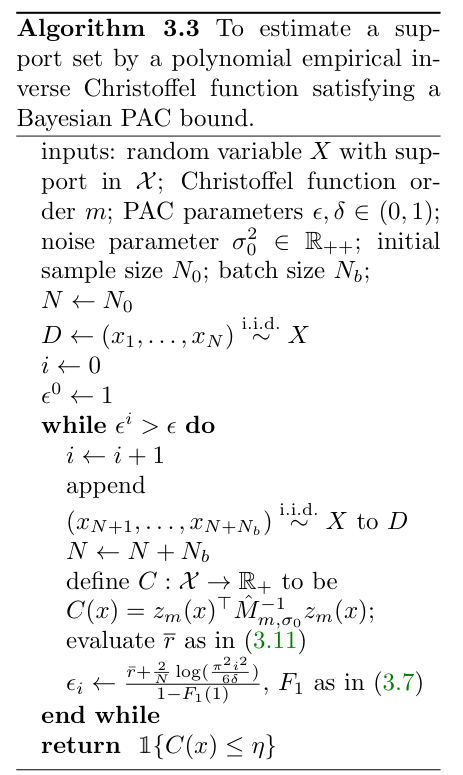
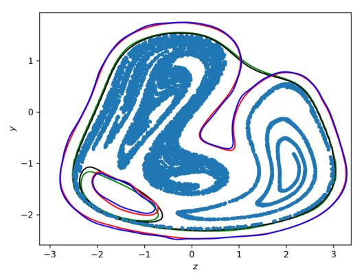
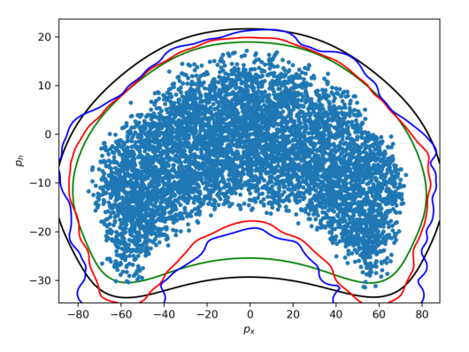
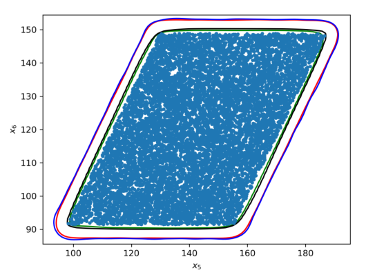

## Conversion notes

- Source version: arXiv:2112.09995v1 [eess.SY], 18 Dec 2021 (20 pages, single column, SIAM article style, 'Submitted to the editors December 17, 2021'); authors A. Devonport, F. Yang, L. El Ghaoui, M. Arcak. The title above is the one printed on this arXiv version. The paper was published as 'Data-Driven Reachability and Support Estimation with Christoffel Functions', IEEE Transactions on Automatic Control 68(9), 2023. This package was made from the arXiv v1 PDF only; the journal version was not compared, so its numbering and any corrections made there are not reflected here.
- Numbering in this version is by section (SIAM style): Algorithms 3.1, 3.2, 3.3; Lemma 3.2, Lemma 3.3, Theorem 3.4, Theorem 3.5, Theorem 3.6, Lemmas 3.7-3.10, Corollary 3.11; Remarks 3.1 and 3.12; Problem 1; equations (2.1)-(2.7), (3.1)-(3.16), (4.1), (A.1)-(A.4), (B.1)-(B.11). The third algorithm of the paper, the polynomial empirical inverse Christoffel function estimator with a Bayesian PAC bound (often cited as 'Algorithm 3'), is Algorithm 3.3 here; its guarantee is Corollary 3.11, which rests on Lemma 3.10 (bound (3.11)), Lemma 3.7 (equations (3.6), (3.7)), Lemma 3.9 and Theorem 3.6. Algorithm 3.1 is the polynomial estimator with the classical (VC) PAC bound (Theorem 3.4, Lemma 3.2 with bound (3.1)); Algorithm 3.2 is the kernelized estimator (Theorem 3.6, Lemma 3.8 with bound (3.8)).
- Mathematics was transcribed to LaTeX from the authors' arXiv TeX source (cfun.tex, cfun_shared.tex, cfun.bbl), with the authors' private macros expanded to standard LaTeX, and every formula was checked against the PDF pages (page renders plus 200-300 dpi crops of the mathematical regions). TeX source and PDF agree; no formula is kept as an image only. \tag{n} is used only for equation numbers that are printed. Displays whose lines each carry a printed number ((A.1)-(A.4), (B.5)-(B.11)) are written as one $$ block per numbered line, so continuation lines begin with '=', '+' or '\ge' as printed.
- The three algorithm boxes are given as image crops (assets/figure/algorithm-3-1.jpg, algorithm-3-2.jpg, algorithm-3-3.jpg), each followed by a text transcription checked line by line against a 300-dpi crop. The boxes have no printed line numbers; loop bodies are shown as nested list items. Figures 1-3 are image crops with verbatim captions (printed prefix 'Fig. n.'). Table 1 is a CSV (assets/table/table-1.csv) whose two printed header rows are combined into single column names. The unnumbered symbol list of Section 1.1 (a ruled two-column tabular) is transcribed as a text list 'symbol — definition'. Algorithms 3.1-3.3 and Figures 1-3 are wrapped floats printed beside the body text; each is placed at a paragraph boundary on its own page. The title/affiliation footnotes of page 1 follow the author line, and Footnote 1 (page 6) follows equation (2.7), so that sentences running across pages are not interrupted.
- IMPORTANT for citing the guarantees: the following items are printed like this in the source PDF (and in the authors' TeX) and are NOT conversion errors. (a) Theorem 3.6: its PAC bound is an unnumbered display; the theorem says 'with confidence $\delta$' where $1-\delta$ is meant. (b) Corollary 3.11 says the function constructed in 'Algorithms 3.3 satisfies the PAC bound (3.6)': in the TeX source this is a reference to the unnumbered display of Theorem 3.6 (label eq:pac_epsi inside an unnumbered environment, so the theorem number 3.6 is printed); the bound meant is $\mathbb{P}(\forall i\geq1,\, P_X(\{x:C^i(x)\leq\eta\})\geq 1-\epsilon^i)\geq 1-\delta$, not equation (3.6), which is the empirical stochastic risk formula. Its proof says 'The argument to verify Algorithm 3.1' where Algorithm 3.3 is meant. (c) Algorithms 3.2 and 3.3 test $\epsilon^i$ (superscript) in the while condition but assign $\epsilon_i$ (subscript) in the update line; Algorithm 3.3 does not list the threshold $\eta$ among its inputs (Algorithm 3.2 does) and has no step computing $\hat{M}_{m,\sigma_0}$. (d) The Gaussian parameters of the polynomial case are printed in three different forms: $W_Q\sim\mathcal{N}(0,\hat{M}_{m,\sigma_0}^{-1})$ after (3.9); $\mathcal{N}(0,(\sigma_0^{2}I+\hat{M}_{m,\sigma_0})^{-1})$ inside the KL divergence of (3.11) and in the definition of $\gamma$ in Appendix B; $\mathcal{N}(0,(\sigma_0^{-2}I+\hat{M}_{m,\sigma_0})^{-1})$ in the text of the proof of Lemma 3.10. (e) The proof of Theorem 3.6 cites 'Lemma 3.7' and 'Lemma 3.8' as plain text where, by content, Lemma 3.8 (PAC-Bayes bound on $r_Q$) and Lemma 3.9 (central concept) are used, and prints the posterior variance with $(\sigma_0^2 I+K^i)$ without inverse. (f) Lemma 3.9 writes $r(\bar{c}_\eta)$ and $r(\bar{c}_Q)$ for the same quantity.
- Further source slips kept as printed: 'Algorithm 3.4' (Section 3.1) and 'Algorithm 3.6' (before the proof of Theorem 3.6) are references to Theorem 3.4 / Theorem 3.6 labels where Algorithms 3.1 / 3.2 are meant; equation (2.4) has $\hat{M}_{m,\sigma}$ on the left where its inverse is meant; $Z=[z_m(x_i)\ \hdots\ z_m(x_N)]$ in Section 2.2; the empirical risk without the factor $1/N$ and a probability statement with unbalanced braces in the proof of Theorem 3.4; 'degree $2k$', 'order $k=10$', '$b=z_k$' where the order is $m$; $\sigma_0^{-1}I$ in the termination remark after Theorem 3.6; $\sigma^2 I_N$ (no subscript 0) in (3.4), (3.5); $D_{KL}(W_P||W_Q)$ in the sentence after (3.2), which has $D_{KL}(W_Q||W_P)$; an unclosed parenthesis in (3.13) and $K_{Nr}$ as last factor of (3.12); the kernel written $\exp(\|x-y\|^2/(2\ell^2))$ in Section 4.1 but $\exp(-\|x-y\|^2/(2\ell)^2)$ elsewhere; Section 4 gives 'an initial sample size of 20,000 and a batch size of 5,000' for Algorithm 3.1 (which has no batches); Nyström rank $r=2000$ in the text versus '1,000 samples' (Fig. 1 caption) and '$m=10,000$' (Fig. 2 and Fig. 3 captions); the captions of Fig. 2 and Fig. 3 describe three contours of 'order $k=10$' while Table 1 gives order 4 for the quadrotor; 'Figure 2' in Section 4.3 where Figure 3 is meant; in (4.1) an extra closing parenthesis, an undefined $\beta$, no value for $c$, and 'The input $u$' in the text where the equation uses $d$; no value for $K$ in the quadrotor dynamics; (A.3) with $\sigma^2BB^\top$ and $By$, (A.4) ending in $b(x)$, '$\mathbb{R}m\times N$'; $\mathbb{1}\{x\in C_Q\}$ in (B.1); unmatched '(' in all '$(g(x)^2$' terms and $r(\hat{c}_\eta)$, $r_{Q_\eta}$ in the proof of Lemma 3.9. The page-level review notes in the external review directory list these page by page.
- Consistency check done during conversion: with $\epsilon=0.1$, $\delta=10^{-9}$, $n=2$, the transcribed sample-size line of Algorithm 3.1, $N=\lceil\frac{5}{\epsilon}(\log\frac{4}{\delta}+\binom{n+2m}{n}\log\frac{40}{\epsilon})\rceil$ (natural logarithm), gives 70307 for $m=10$ and 14587 for $m=4$, the values printed in Table 1.

<!-- PDF page 1 -->

# Data-Driven Reachability Analysis and Support Set Estimation with Christoffel Functions

Alex Devonport†, Forest Yang†, Laurent El Ghaoui†, and Murat Arcak†

Footnote ∗ (attached to the title): Submitted to the editors December 17, 2021. This paper is a revision and extension of a conference paper [10]. **Funding:** This work is funded in part by the Air Force Office of Scientific Research grant FA9550-21-1-0288, National Science Foundation grant ECCS-1906164, and the Office of Naval Research grant N00014-18-1-2209.

Footnote †: University of California, Berkeley, Berkeley, CA ({alex\_devonport,forestyang,elghaoui,arcak}@berkeley.edu)

## Abstract

We present algorithms for estimating the forward reachable set of a dynamical system using only a finite collection of independent and identically distributed samples. The produced estimate is the sublevel set of a function called an empirical inverse Christoffel function: empirical inverse Christoffel functions are known to provide good approximations to the support of probability distributions. In addition to reachability analysis, the same approach can be applied to general problems of estimating the support of a random variable, which has applications in data science towards detection of novelties and outliers in data sets. In applications where safety is a concern, having a guarantee of accuracy that holds on finite data sets is critical. In this paper, we prove such bounds for our algorithms under the Probably Approximately Correct (PAC) framework. In addition to applying classical Vapnik-Chervonenkis (VC) dimension bound arguments, we apply the PAC-Bayes theorem by leveraging a formal connection between kernelized empirical inverse Christoffel functions and Gaussian process regression models. The bound based on PAC-Bayes applies to a more general class of Christoffel functions than the VC dimension argument, and achieves greater sample efficiency in experiments.

**Key words.** Data-driven control, PAC, PAC-Bayes, Christoffel functions

**AMS subject classifications.** 93E10,

## 1. Introduction

Reachability analysis is a popular and effective way to guarantee the safety of a system in the face of uncertainty. The primary object of study is the reachable set, which characterizes all possible evolutions of a system under certain constraints on initial conditions and disturbances. Many algorithms in reachability analysis use detailed system information to compute a sound approximation to the reachable set, that is an approximation guaranteed to completely contain (or be contained in) the reachable set. However, in many important applications, such as complex cyber-physical systems that are only accessible through simulations or experiments, this detailed system information is not available, so these algorithms cannot be applied. Applications such as these motivate *data-driven* reachability analysis, which studies algorithms to estimate reachable sets using the type of data that can be obtained from experiments and simulations. These algorithms have the advantage of being able to estimate the reachable sets of any system whose behavior can be simulated or measured experimentally, without requiring any additional mathematical information about the system. The main disadvantage of data-driven reachability algorithms is that generally they cannot provide the same type of soundness guarantees as traditional reachability analysis algorithms; however, they can still guarantee accuracy of the estimates in a probabilistic sense with high confidence, as this article will show.

Data-driven reachability is a rapidly growing area of research within reachability analysis. Many recent developments focus either on providing probabilistic guaran

<!-- PDF page 2 -->

tees of correctness for data-driven methods that estimate the reachable set directly from data, for instance using results from statistical learning theory [8] or scenario optimization [21, 34, 16, 28, 15, 9]. Others incorporate data-driven elements into more traditional reachability approaches, for instance estimating entities such as discrepancy functions [14] or differential inclusions [11]. Further developments include incorporating data-driven reachability into verification tools for cyber-physical systems [14, 27].

This paper investigates a data-driven reachability algorithm that directly estimates the reachable set from data using the sublevel sets of an empirical inverse Christoffel function, and provides a probabilistic guarantee of accuracy for the method using statistical learning-theoretic methods. Christoffel functions are a class of polynomials defined with respect to measures on $\mathbb{R}^n$: a single measure defines a family of Christoffel function polynomials. When the measure in question is defined by a probability distribution on $\mathbb{R}^n$ the level sets of Christoffel functions are known empirically to provide tight approximations to the support. This support-approximating quality has motivated the use of Christoffel functions in several statistical applications, such as density estimation [19, 20] and outlier detection [2]. Additionally, the level sets have been shown, using the plug-in approach [6], to converge exactly to the support of the distribution (in the sense of Hausdorff measure) when the degree of the polynomial approaches infinity and when the true probability distribution is available [20]. When the true probability distribution is *not* known, as is typically the case in data analysis, the Christoffel function can be empirically estimated using a point cloud of independent and identically distributed (iid) samples from the distribution: this *empirical Christoffel function* still provides accurate estimates for the support, and some convergence results in this case are also known [26].

In contrast to the asymptotic analysis of Christoffel functions reviewed above, our interest is in developing error bounds that hold with a finite number of samples. This paper is an extension of a conference paper [10] that reported our preliminary work on support set estimation with polynomial Christoffel functions in the context of data-driven reachability. In [10], we investigated empirical inverse Christoffel functions constructed from iid trajectory simulation data, and provided a finite-sample guarantee of the probabilistic accuracy of reachable set estimates produced by sublevel sets of this function. The present paper significantly extends the theory of finite-sample error bounds for support set estimators derived from Christoffel functions by applying techniques from Bayesian PAC analysis, a variation of classical PAC analysis that has been successfully applied to Gaussian process classifiers [29], kernel support vector machines [18], and minimum-volume covering ellipsoids [12]. This extension leverages a formal connection between the kernel empirical inverse Christoffel function investigated by Askari *et al.* [2] and the posterior variance of a Gaussian process regression model. In conjunction with the PAC-Bayes theorem, the connection can be used to derive finite-sample bounds for kernelized empirical inverse Christoffel functions.

The application of Bayesian PAC analysis to the theory of Christoffel function support set estimators has two benefits. First, it allows for the construction of finite-sample guarantees for kernelized inverse Christoffel functions, which to our knowledge have not been proved before. Second, when applied to polynomial empirical inverse Christoffel function estimators, Bayesian PAC analysis can provide guarantees of probabilistic accuracy and confidence with much greater sample efficiency than the finite-sample bounds provided by classical VC dimension bound arguments.

### 1.1. List of Acronyms and Symbols

<!-- PDF page 3 -->

**symbol** — **definition**

*Reachability Analysis*

- $\Phi(t_1;t_0,x_0,d)$ — State transition function, evolving a state $x_0$ at time $t_0$ under disturbance $d$ to a state at time $t_1$
- $\mathcal{X}_0$ — Set of initial states
- $\mathcal{D}$ — Set of disturbances
- $t_0,t_1$ — Initial and final times
- $R_{[t_0,t_1]}$ — Forward reachable set
- $\hat{R}_{[t_0,t_1]}$ — Approximation of forward reachable set

*Probability, Statistical Learning Theory*

- $\mathbb{E}\left[\cdot\right]$ — Expected value of a random variable
- $\mathbb{P}\left(\cdot\right)$ — Probability of an event defined in terms of random variables
- $D_{KL}(P||Q)$ — Kullback-Leibler (KL) divergence from $P$ to $Q$
- $D_{ber}(p||q)$ — KL divergence between Bernoulli distributions with parameters $p$ and $q$
- $X$ — Random variable whose support we wish to estimate
- $F_1$ — CDF of the chi-square distribution with 1 degree of freedom
- $\mathcal{X}$ — Domain of $X$
- $P_X$ — Probability measure of the distribution of $X$
- $P_X^N$ — Probability measure of $N$ iid samples from $X$
- PAC — Probably Approximately Correct
- iid — Independent and Identically Distributed
- $\epsilon$,$\delta$ — accuracy and confidence parameters in PAC guarantees
- $\mathcal{C}$ — Concept class
- $\bar{c}_Q$ — “central concept” of the posterior measure $Q$
- $P$,$Q$ — Prior and posterior probability measures on $\mathcal{C}$
- $W_P$, $W_Q$ — Parametric representations of $P$ and $Q$
- $C_P$, $C_Q$ — Stochastic estimators: random variables on $\mathcal{C}$ distributed according to $P$, $Q$
- $\ell(c,x)$ — statistical loss function comparing a concept $c$ and a datum $x$
- $r(c)$ — risk: average of $\ell(c,x)$ for $x\sim X$
- $\hat{r}(c)$ — empirical estimate of $r(c)$ from data $x_1,\dotsc,x_N$
- $r_Q$ — stochastic risk: average of $\ell(c,x)$ for $x\sim X$, $c\sim Q$
- $\hat{r}_Q$ — empirical estimate of $r_Q$ from data $x_1,\dotsc,x_N$

*Christoffel Functions*

- $M_m$, $\hat{M}_m$ — Matrix of moments of degree $\le m$ and its empirical estimate
- $\hat{M}_{m,\sigma_0}$ — Empirical moment matrix with diagonals modified by $\sigma_0$
- $z_m(x)$ — vector of monomials with degree $\le m$ evaluated at point $x$
- $\hat{\kappa}^{-1}(x)$ — Polynomial empirical inverse Christoffel function evaluated at $x$
- $\hat{\kappa}^{-1}(x)$ — kernelized empirical inverse Christoffel function
- $C(x)$ — Christoffel-based support set estimator, output of Algorithms 3.1,3.2, and 3.3

*Gaussian Processes*

- $m$, $k$ — prior mean and covariance functions
- $m_q$, $k_q$ — posterior mean and covariance functions
- $K$ — kernel Gramian matrix, $K_{ij}=k(x_i,x_j)$
- $k_D$ — vector of kernel evaluations on data, $(k_D(x))_i=k(x_i,x)$
- $\mathcal{N}\left(\mu,\Sigma\right)$ — Multivariate normal with mean $\mu$ and covariance $\Sigma$
- $\mathcal{GP}(m,k)$ — Gaussian process with mean and covariance functions $m$, $k$

<!-- PDF page 4 -->

## 2. Preliminaries

### 2.1. Probabilistic Reachability and Estimation of Support

Consider a dynamical system with a state transition function $\Phi(t_1;t_0, x_0, d)$ that maps an initial state $x(t_0)=x_0\in\mathbb{R}^n$ at time $t_0$ to a unique final state at time $t_1$, under a disturbance $d:[t_0,t_1]\to\mathbb{R}^{w}$. For instance, when the system state dynamics $\dot{x}(t) = f(t,x(t),d(t))$ are known and have unique solutions on the interval $[t_0,t_1]$, then $\Phi(t_1;t_0, x_0, d)$ is the solution of the state dynamics equation at time $t_1$ with initial condition $x(t_0)=x_0$. For the problem of forward reachability analysis, we are also given an *initial set* $\mathcal{X}_0\subset\mathbb{R}^n$, a set $\mathcal{D}$ of allowed disturbances and a time range $[t_0,t_1]$. The *forward reachable set* is then defined as the set of all states to which the system can transition in the time range $[t_0,t_1]$ with initial states in $\mathcal{X}_0$ and disturbances in $\mathcal{D}$, that is the set

$$R_{[t_0,t_1]} = \{\Phi(t_1;t_0,x_0, d) : x_0\in\mathcal{X}_0, d\in\mathcal{D}\}. \tag{2.1}$$

To tackle the problem of estimating the forward reachable set by statistical means, we add probabilistic structure to the reachability problem by taking random variables $X_0$ and $D$ supported on $\mathcal{X}_0$ and $\mathcal{D}$ respectively. These random variables then induce a random variable $X=\Phi(t_1;t_0, X_0, D)$, whose support is precisely $R_{[t_0,t_1]}$ and whose probability measure we denote as $P_X$. A measure-theoretic interpretation $P_X(A)$ for a set $A$ is a measure of overlap between $R_{[t_0,t_1]}$ and $A$: $P_X(A)$ is nonzero only if $A$ has nonempty intersection with $R_{[t_0,t_1]}$, and $P_X(A)=1$ only if $R_{[t_0,t_1]}\subseteq A$. A probabilistic interpretation of $P_X(A)$ is that if we take samples $x_0$ and $d$ of the random variables $X_0$ and $D$, then the vector $\Phi(t_1;t_0,x_0,d)$ lies in $A$ with probability $P_X(A)$. These interpretations motivate $P_X(A)$ as a measure of *probabilistic accuracy*: if a set $A\subseteq\mathbb{R}^n$ has a greater measure $P_X(A)$ than a set $B\subseteq\mathbb{R}^n$, then $A$ is a more accurate approximation of the reachable set than $B$, in the sense that it “misses” less of the probability mass than $B$ does. In the probabilistic version of the forward reachability problem, our goal is to find reachable set approximations $\hat{R}_{[t_0,t_1]}$ such that $P_X(\hat{R}_{[t_0,t_1]})$ is close to 1. In addition, we will seek $\hat{R}_{[t_0,t_1]}$ with low volume, in order to preclude trivial estimates such as $\hat{R}_{[t_0,t_1]}=\mathbb{R}^n$ and to generally minimize the conservatism of the approximation.

The probabilistic relaxation of the forward reachability problem is a statistical problem of *support set estimation* based on a finite set of observations. The support of a random variable is the range of values it can assume: for example, if $X$ admits a probability density function $p_X$, then the support of $X$ is the closure of the set $\{x:p_X(x)\ne0\}$. In addition to the control-theoretic application developed above, support set estimation has several applications in statistics and data science, such as outlier and novelty detection [26, 25, 2]. It is therefore useful to consider the problem for general random variables: we will do so for the theoretical developments in this paper, returning to the reachability application in the numerical examples of Section 4. Formally, we address the following problem.

**Problem 1.** Given accuracy and confidence parameters $\epsilon,\delta\in(0,1)$ and a random variable $X$ whose support lies in a compact domain $\mathcal{X}\subseteq \mathbb{R}^n$, collect data $x_1,\dotsc,x_N\overset{\textrm{i.i.d.}}{\sim} X$ and use them to find a set $c(\epsilon,\delta;x_1,\dotsc,x_N)\subset\mathcal{X}$ such that the following bound holds:

$$P_X^N\left(\{x_1,\dotsc,x_N:P_X(c(\epsilon,\delta;x_1,\dotsc,x_N)) \ge 1-\epsilon \}\right) \ge 1-\delta. \tag{2.2}$$

The bound (2.2) is known as a Probably Approximately Correct (PAC) bound, which

<!-- PDF page 5 -->

appears frequently in statistical learning theory. The two probability inequalities in (2.2) are interpreted as assertions of probabilistic accuracy and confidence:

- *accuracy*: the inner inequality $P_X(c(\epsilon,\delta;x_1,\dotsc,x_N)) \ge 1-\epsilon$ asserts that the probabilistic accuracy of the estimator is at least $1-\epsilon$.
- confidence: the outer inequality asserts that the accuracy statement holds with probability $1-\delta$ with respect to $P_X^N$. The probability, and hence the confidence, is with respect to the data: $P_X^N$ is the probability measure corresponding to $N$ iid observations drawn from $X$, so $P_X^N(A)$ for $A\subseteq\mathcal{X}^N$ denotes the probability that $x_1,\dotsc,x_N\in A$. Thus the inequality $P_X^N(\{x_1,\dotsc,x_N: \cdots \}) \ge 1-\delta$ asserts that the observed data set $x_1,\dotsc,x_N$ belongs, with probability at least $1-\delta$, to the class of data sets sufficiently informative to yield an estimator $c$ satisfying the accuracy assertion.

For brevity, we drop the arguments of the estimator $c(\epsilon,\delta;x_1,\dotsc,x_N)$ from the notation, understanding that an estimator $c$ is always constructed using a given set of data $x_1,\dotsc,x_N$, with respect to given parameters $\epsilon$ and $\delta$. The sample size $N$ is a fixed problem parameter: indeed, finding a suitable $N$ is part of solving the problem. In addition to the requirements given in Problem 1, we may also impose that the estimator $c$ be drawn from a pre-specified class of admissible estimators. Such a condition allows us to restrict attention to computationally feasible sets, or sets with certain properties such as compactness for cases when the reachable set is known to be compact. In classical PAC analysis, the structure of the pre-specified class also plays a key role in determining an appropriate $N$.

### 2.2. Christoffel Functions

Given a finite measure $P_X$ on $\mathbb{R}^n$ and a positive integer $m$, the Christoffel function of order $m$ is defined as the ratio $\kappa(x) = 1/z_m(x)^\top M_{m}^{-1}z_m(x)$, where $z_m(x)$ is the vector of monomials of degree $\le m$, and where $M_{m}$ is the matrix of moments $M_m = \int_{\mathcal{X}} z_m(x) z_m(x)^\top dP_X(x)$. We assume throughout that $M_m$ is positive definite, ensuring that $M_m^{-1}$ exists. The Christoffel function has several important applications in approximation theory [24], where its asymptotic properties are used to prove the regularity and consistency of Fourier series of orthogonal polynomials [33]. For our purposes, it is more convenient to use the *inverse Christoffel function* ${\kappa(x)}^{-1} = z_m(x)^\top M_{m}^{-1}z_m(x)$, which is a polynomial of degree $2m$. In Problem 1, and more generally in the problem of estimating a probability distribution from samples, $P_X$ is unknown. In this case, we instead use an empirical estimate for the moment matrix $M_{m}$, namely $\hat{M}_m = \frac{1}{N} \sum_{i=1}^N z_m(x_i) z_m(x_i)^\top$. The matrix $\hat{M}_m$ is positive semidefinite: it is additionally positive definite, and hence nonsingular, if $N \ge \binom{n+m}{n}$ and $x_1,\dotsc,x_N$ do not all belong to the zero set of a single degree $m$ polynomial. It is useful, both numerically and theoretically, to modify this empirical estimate adding a scaled identity perturbation: thus we take $\hat{M}_{m,\sigma} = \sigma^2 I + \frac{1}{N} \sum_{i=1}^N z_m(x_i) z_m(x_i)^\top$, as our empirical moment matrix in the sequel, where $\sigma^2 > 0$ is a term fixing the magnitude of the perturbation. In addition to its role in developing the kernel extension, the $\sigma^2I$ term generally improves the conditioning of the empirical moment matrix and ensures nonsingularity in all cases. The empirical moment matrix $\hat{M}_{m,\sigma}$ itself defines a Christoffel function, whose inverse

$$\hat{\kappa}^{-1}(x)=z_m(x)^\top \hat{M}_{m,\sigma}^{-1}z_m(x) \tag{2.3}$$

is called the *empirical inverse Christoffel function*.

The dyadic sum $\frac{1}{N}\sum_{i=1}^N z_m(x_i)z_m(x_i)^\top$ can be expressed as the matrix product $\frac{1}{N} Z Z^\top$, where $Z\in\mathbb{R}^{\binom{n+m}{n}\times N}$ is the matrix $Z = \begin{bmatrix} z_m(x_i) & \hdots & z_m(x_N) \end{bmatrix}$ of poly

<!-- PDF page 6 -->

nomial features. By expressing the dyadic sum this way, we can apply the matrix inversion lemma to express the inverse of the empirical moment matrix as

$$\hat{M}_{m,\sigma} = \left( \sigma^2 I + \tfrac{1}{N} Z Z^\top \right)^{-1} = \sigma^{-2}\left(I - Z\left(\sigma^2 N I + Z^\top Z\right)^{-1}Z^\top\right). \tag{2.4}$$

This expression for $\hat{M}_{m\sigma}$ allows us to rewrite the empirical inverse Christoffel function as

$$\hat{\kappa}^{-1}(x) = N \sigma_0^{-2} z_m(x)^\top z_m(x) - N \sigma_0^{-2} z_m(x)^\top Z \left(\sigma_0^2 I + Z^\top Z\right)^{-1}Z^\top z_m(x), \tag{2.5}$$

where we have made the change of variables $\sigma^2=\sigma_0^2/N$. The vector $z_m$ enters (2.5) only through the inner products $z_m(x_i)^\top z_m(x_j)$: The matrix $Z^\top Z\in\mathbb{R}^{N\times N}$ has elements $(Z^\top Z)_{ij}=z_m(x_i)^\top z_m(x_j)$, and the matrix-vector product $Z^\top z_m(x)$ has elements $(Z^\top z_m(x))_i=z_m(x_i)^\top z_m(x)$. By replacing the inner product $z_m(x_i)^\top z_m(x_j)$ with an arbitrary positive definite$^1$ function $k:\mathbb{R}^{n}\times\mathbb{R}^{n}\to\mathbb{R}$ and rescaling by a factor of $\sigma_0^{2}/N$, we obtain the kernelized variant of the empirical inverse Christoffel function,

$$\kappa^{-1}(x) = k(x,x) - k_D(x)^\top\left(\sigma_0^2 I + K\right)^{-1}k_D(x), \tag{2.6}$$

where $K\in\mathbb{R}^{N\times N}$ and $k_D(x)\in\mathbb{R}^N$ are defined as

$$K_{ij} = k(x_i,x_j), \qquad (k_D(x))_i = k(x_i,x). \tag{2.7}$$

Footnote 1: Here, and throughout the paper, we mean positive definite in the sense of reproducing kernel Hilbert spaces and kernel machines, which is that a square matrix $K$ with elements $(K)_{ij}=k(x_i,x_j)$ is a positive definite matrix.

## 3. Christoffel Function Estimators of Support

**Algorithm 3.1** To estimate a support set by a polynomial empirical inverse Christoffel function satisfying a classical PAC bound.

- inputs: random variable $X$ with support in $\mathcal{X}$; polynomial order $m\in\mathbb{N}_+$; PAC parameters $\epsilon,\delta\in(0,1)$; noise parameter $\sigma_0^2\in\mathbb{R}_{++}$;
- $N\gets \lceil\frac{5}{\epsilon}\left(\log\frac{4}{\delta}+\binom{n+2m}{n}\log\frac{40}{\epsilon}\right)\rceil$
- **for** $i\in\{1,\dotsc,N\}$ **do**
    - sample $x_i\sim X$
- **end for**
- $\hat{M}_{m,\sigma_0}\gets \sigma_0^2I + \frac{1}{N}\sum\limits_{i=1}^N z_m(x_i)z_m(x_i)^\top$
- $\alpha \gets \max_i z_m(x_i)^\top\hat{M}_{m,\sigma_0}^{-1} z_m(x_i)$
- $C(x)=z_m(x)^\top\hat{M}_{m,\sigma_0}^{-1}z_m(x)$;
- **return** $\mathbb{1}\{C(x)\le\alpha\}$;

Algorithms 3.1 and 3.2 are procedures to estimate the support of a random variable with a sublevel set of an empirical inverse Christoffel function, where the only information needed from the random variable is a collection of iid samples. Algorithm 3.1 is designed to satisfy a classical PAC bound. This has the advantages of providing an *a priori* sample bound, and of admitting a fairly direct proof, which is given in Section 3.1. The essence of the proof is to demonstrate that the sublevel sets of a polynomial empirical inverse Christoffel function of a given order inhabit a concept class of known VC dimension. This argument is valid for polynomial Christoffel functions of any order, but it is generally not valid for kernelized Christoffel functions. Indeed, the classes of sublevel sets of certain kernelized empirical inverse Christoffel functions can have infinite VC dimension, so a classical PAC bound is not possible in general

<!-- PDF page 7 -->

for kernelized empirical inverse Christoffel functions. Algorithm 3.2 is designed to satisfy a Bayesian PAC bound which is developed in Section 3.2. Unlike the classical PAC bound provided for Algorithm 3.1, this Bayesian PAC bound is applicable to all kernelized empirical inverse Christoffel functions, including those whose sublevel sets have infinite VC dimension. When applied to polynomial empirical inverse Christoffel functions as a special case, we find that it is more sample-efficient than the classical PAC bound: in some of the examples in Section 4, the Bayesian PAC bound requires an order of magnitude fewer samples to achieve the same accuracy and confidence as that guaranteed by the classical PAC bound. The disadvantages of the Bayesian PAC approach is that the required number of samples is not known *a priori*, since certain terms in the bound depend on the data. Algorithm 3.2 therefore takes an iterative approach, taking samples in batches and re-evaluating the Bayesian PAC bound after each batch until it reaches the desired level of accuracy.

**Remark 3.1.** In some reachability problems, we are only interested in computing a reachable set for a subset of the state variables. For example, suppose the state is $(x_1,\dotsc,x_n)\in\mathbb{R}^n$, and we wish to verify a safety specification involving only the states $x_1,\dotsc,x_s$, where $s<n$: a reachable set for the states $x_1,\dotsc,x_s$ would suffice for this problem. In cases like this, the algorithms presented in this section can be modified to use only the first $s$ elements of the samples. The output of the algorithm is then an empirical inverse Christoffel function with domain $\mathbb{R}^s$ whose sublevel set $\hat{R}_{[t_0,t_1]}$ estimates the reachable set for the reduced set of states. In the sequel, we refer to this variation of the algorithms in this section as their *reduced-state* variations.

### 3.1. Classical PAC Analysis

PAC bounds originate in study of empirical risk minimization problems in statistical learning theory. Our strategy to prove a PAC bound for Algorithm 3.4 is to express Problem 1 as an empirical risk minimization problem and to then apply the tools of statistical learning theory.

In empirical risk minimization, the objective is to match a concept $c\subseteq\mathcal{X}$ from a pre-specified concept class $\mathcal{C}\subseteq 2^{\mathcal{X}}$ to an unknown random variable $X$ supported on $\mathcal{X}$ using only a finite set of iid observations $x_1,\dotsc,x_N$ of $X$. How well a concept matches $X$ is quantified by the statistical risk $r(c)=\mathbb{E}\left[\ell(c,X)\right]$ defined by a loss function $\ell:\mathcal{C}\times\mathcal{X}\to\mathbb{R}_+$ and the unknown measure $P_X$: a lower risk indicates a better match. Since we do not know $P_X$, we cannot directly evaluate the statistical risk. However, we can use the empirical risk $\hat{r}(c)=\frac{1}{N}\sum_{i=1}^N \ell(c,x_i)$ as a proxy for the true risk, and select a concept to match the data on the basis of minimizing the empirical risk.

Whether empirical risk minimization actually selects a concept with low risk depends on how much $\hat{r}(c)$ differs from $r(c)$. A classical PAC bound provides a bound on the difference $r(c)-\hat{r}(c)$, or the absolute difference, that holds with high probability. We use the following result from [1], which gives a quantitative sample bound that depends on the Vapnik-Chervonenkis (VC) dimension [31] of the concept class. The VC dimension of a concept is a combinatorial measure of its complexity based on the expressiveness of its concepts.

**Lemma 3.2 ([1], Corollary 4).** Let $\mathcal{C}$ be a concept class of sets with VC dimension $\le d$, and let $\ell:\mathcal{C}\times\mathcal{X}\to\{0,1\}$ denote a $\{0,1\}$-valued loss function. If

$$N \ge \frac{5}{\epsilon}\left( \log\frac{4}{\delta} + d \log\frac{40}{\epsilon} \right), \tag{3.1}$$

and if $\hat{r}(c)=0$, then $P_X^N\left(\{x_1,\dotsc,x_N : r(c) \le \epsilon\}\right) \ge 1-\delta$.

<!-- PDF page 8 -->

A concept class with higher VC dimension generally provides greater-fidelity estimates than one with lower VC dimension, but is also more prone to overfitting: informally, this is the reason why a concept class with higher VC dimension requires a larger sample bound for the same accuracy and confidence than one with lower VC dimension.

To apply Lemma 3.2, we must show that the sublevel sets of a polynomial empirical inverse Christoffel function belong to a concept class of bounded VC dimension. One such class is the class of superlevel sets of degree $2k$ polynomials: the following Lemma from [13], provides a bound on the VC dimension.

**Lemma 3.3 ([13], Theorem 7.2).** Let $V$ be a vector space of functions $g:\mathbb{R}^n\to\mathbb{R}$ with dimension $d$. Then the class of sets $\text{Pos}(V) = \left\{\ \{x : g(x)\ge 0\}, g\in V\right\}$ has VC dimension $\le d$.

The PAC bound, and hence the validity of Algorithm 3.1 follows from Lemmas 3.3 and 3.2 by framing the support estimation problem as one of empirical risk minimization.

**Theorem 3.4.** The support set estimate produced by Algorithm 3.1, that is the set $\{x\in\mathcal{X}: C(x) \le \alpha\}$ where $C(x)=z_m(x)^\top\hat{M}_{m,\sigma_0}^{-1}z_m(x)$, $\alpha=\max_i C(x_i)$, satisfies the PAC bound $P_X^N(\{x_1,\dotsc,x_N:P_X(\{x\in\mathcal{X}: C(x) \le \alpha\}) \ge 1-\epsilon\})\ge 1-\delta$, and thereby solves Problem 1 with parameters $\epsilon,\delta$.

**Proof.** Let $\mathcal{C}=\text{Pos}(\mathbb{R}[x]_{2m}^n)$, and $\ell(c,x)=\mathbb{1}\{x\notin c\}$. Note that the set $\{x\in\mathbb{R}^n : C(x) \le \alpha\}$ is a member of $\text{Pos}(\mathbb{R}[x]_{2m}^n)$, since it can be expressed as $c=\{x\in\mathbb{R}^n : \alpha - C(x) \ge 0\}$. Since the dimension of $\mathbb{R}[x]_{2m}^n$ is $\binom{n+2m}{n}$, the VC dimension of $\text{Pos}(\mathbb{R}[x]_{2m}^n)$ is $\le\binom{n+2m}{n}=d$ by Lemma 3.3. For $\ell(c,x)=\mathbb{1}\{x\notin c\}$, the statistical risk is $r(c)=\mathbb{E}\left[\mathbb{1}\{x\notin c\}\right]=1-P_X(c)$, and its empirical counterpart is $\hat{r}(c)=\sum_{i=1}^N \mathbb{1}\{x_i\notin c\}$. The empirical risk is zero for any set $c$ that encloses $x_1,\dotsc,x_N$. The set $\{x\in\mathbb{R}^n : C(x) \le \alpha\}$ encloses $x_1,\dotsc,x_N$ by construction, meaning that $\hat{r}(\{x\in\mathbb{R}^n : C(x) \le \alpha\})=0$. By applying Lemma 3.2 for this choice of $\mathcal{C}$, $\ell$, and $m$, we find that if $N \ge \frac{5}{\epsilon}\left( \log\frac{4}{\delta} + \binom{n+2m}{n} \log\frac{40}{\epsilon} \right)$, then $P_X^N\left(\{x_1,\dotsc,x_N\} : 1-P_X(\{x\in\mathbb{R}^n : C(x) \le \alpha\}) \le \epsilon\}\right) \ge 1-\delta$. Since Algorithm 3.1 selects $N$ to be the smallest integer such that $N \ge \frac{5}{\epsilon}\left( \log\frac{4}{\delta} + \binom{n+2m}{n} \log\frac{40}{\epsilon} \right)$, it follows that the stated PAC bound holds for the output of Algorithm 3.1. $\square$

### 3.2. Bayesian PAC Analysis

Bayesian PAC analysis bounds the deviation of the expected values of the true and empirical risks with respect to a data-dependent probability measure. Given a prior measure $P$ over $\mathcal{C}$ and a posterior measure $Q$ derived from the prior and the observations, we define the expected risk $r_Q = \mathbb{E}\left[\ell(c, X)\right]$ and empirical expected risk $\hat{r}_Q=\mathbb{E}\left[\frac{1}{N}\sum_{i=1}^N \ell(c, x_i)\right]$ where $c\sim Q$. Equivalently, $P$ and $Q$ define random variables $C_P$, $C_Q$ supported on $\mathcal{C}$, called the prior and posterior *stochastic estimators*: $r_Q$ and $\hat{r}_Q$ are the true and empirical risks of $C_Q$. A Bayesian PAC bound is a bound on the deviation between $r_Q$ and $\hat{r}_Q$. Bayesian PAC bounds can be used to provide an error bound for a single classifier which captures the central behavior of $Q$, which we call the *central concept* and denote as $\bar{c}_Q$. To verify that Algorithms 3.2 provides a valid solution to Problem 1, we show that its output is the central concept of a posterior stochastic estimator and use a Bayesian PAC bound to show that a bound of the form (2.2) holds.

The most common tool to construct Bayesian PAC bounds is the PAC-Bayes theorem developed by McAllester [22], Seeger [29] and others [17]. We use the variation

<!-- PDF page 9 -->

due to Seeger. This theorem assumes that the concept class admits a parameterization which can be infinite-dimensional.

**Theorem 3.5 (PAC-Bayes Theorem, adapted from [29, 17]).** Consider a concept class $\mathcal{C}$ admitting a parametrization by $w\in\mathcal{W}$. Let the loss function be zero-one valued, that is $\ell:\mathcal{C}\times\mathcal{X}\to\{0,1\}$. The following bound holds for all measures $P$, $Q$ over the concept class $\mathcal{C}$ defined by measures $W_P$ and $W_Q$ over $\mathcal{W}$ such that $W_Q$ is absolutely continuous with respect to $W_P$:

$$P_X^N\left( \left\{x_1,\dotsc,x_N: D_{ber}(\hat{r}_Q || r_Q) \le \frac{ D_{KL}(W_Q || W_P) + \log\frac{N+1}{\delta} }{N} \right\}\right) \ge 1 - \delta. \tag{3.2}$$

Here, $D_{KL}(W_P||W_Q)$ denotes the Kullback-Leibler (KL) divergence between $W_P$ and $W_Q$, and $D_{ber}(q||p)$ denotes the KL divergence between two Bernoulli distributions with parameters $q$ and $p$, given by the formula $D_{ber}(q||p) = q\log\frac{q}{p} + (1-q)\log\frac{1-q}{1-p}$. For a given set of data $x_1,\dotsc,x_N$, confidence parameter $\delta$, and a prior measure $P$ chosen independently of the data, the inequality (3.2) provides a family of Bayesian PAC bounds, one for each posterior measure $Q$.

**Algorithm 3.2** To estimate a support set by a kernelized empirical inverse Christoffel function satisfying a Bayesian PAC bound.

- inputs: random variable $X$ with support in $\mathcal{X}$; positive definite kernel function $k$; PAC parameters $\epsilon,\delta\in(0,1)$; noise parameter $\sigma_0^2\in\mathbb{R}_{++}$; initial sample size $N_0$; batch size $N_b$; threshold $\eta$.
- $N\gets N_0$
- $D\gets (x_1,\dotsc,x_{N})\overset{\textrm{i.i.d.}}{\sim} X$
- $i\gets0$
- $\epsilon^0\gets 1$
- **while** $\epsilon^i > \epsilon$ **do**
    - $i\gets i + 1$
    - append $(x_{N+1},\dotsc,x_{N+N_b})\overset{\textrm{i.i.d.}}{\sim} X$ to $D$
    - $N\gets N+N_b$
    - $K_{\sigma_0}\gets\sigma_0^2I + K$
    - define $C:\mathcal{X}\to\mathbb{R}_{+}$ to be $C(x)=k(x,x)-k_D(x)K_{\sigma_0}^{-1}k_D(x)$;
    - Evaluate $\overline{r}$ as in (3.8)
    - $\epsilon_i \gets \frac{\bar r + \frac{2}{N}\log (\frac{\pi^2i^2}{6 \delta})}{1-F_1(1)}$, $F_1$ as in (3.7)
- **end while**
- **return** $\mathbb{1}\{C(x)\le\eta\}$

We use the PAC-Bayes theorem in the proof of Theorem 3.6, which asserts the validity of Algorithm 3.2. First, we construct prior and posterior stochastic estimators $C_P$ and $C_Q$, corresponding to measures $P$, $Q$ over a concept class, which admit a sublevel set of the empirical inverse Christoffel function as a central concept; namely $\bar{c}_Q=\{x:\kappa^{-1}(x) \le\eta\}$ for a given positive $\eta$. Next, we express a formula to compute the empirical stochastic risk $\hat{r}_Q$ of $C_Q$ from the data. Then, we establish a bound on the true stochastic $r_Q$ in terms of $\hat{r}_Q$ using the PAC-Bayes theorem. Finally, we prove a bound on the true risk $r(\bar{c}_Q)$ of the central concept in terms of $r_Q$. This sequence of bounds combines to yield a bound of the form (2.2) computable in terms of known data.

**Theorem 3.6.** Denote $C^i$ as the inverse Christoffel function constructed during the $i$th iteration of Algorithm 3.2. We have the following PAC bound on all the inverse Christoffel functions constructed during the algorithm:

$$\begin{aligned} &\mathbb{P}(\forall i\geq1,\, P_X(\{x:C^i(x) \leq\eta\}) \geq 1-\epsilon^i)\\ &\quad \geq 1-\delta. \end{aligned}$$

Thus, with confidence $\delta$, upon the termination condition of Algorithm 3.2, we are left with a support set estimate of probability mass $\geq 1- \epsilon$.

<!-- PDF page 10 -->

In addition to verifying the validity of the terminal output of Algorithm 3.2, Theorem 3.6 justifies the use of Algorithm 3.2 in an “any time algorithm” fashion, that is as an algorithm whose output is verified even if execution is stopped prematurely. The execution of Algorithm 3.2 will terminate as long as the growth of $D_{KL}(\mathcal{N}\left(0, (\sigma_0^{-1}I + K^{-1})^{-1}\right)||\mathcal{N}\left(0,K\right))$ is $o(N)$: determining the conditions under which this growth condition holds is a topic for future research.

We now develop the constructions used in the proof, starting with the prior and posterior stochastic estimators for the kernel case. We take

$$C_{P} = \{x : g_p(x)^2 \le \eta\}, \qquad C_{Q} = \{x : g_q(x)^2 \le \eta\}, \tag{3.3}$$

where $g_p$ and $g_q$ are the prior and posterior of a general Gaussian process regression model with prior kernel $k$, conditioned on the observations $x_1,\dotsc,x_N$, $y_1=\dotso=y_N=0$ with observation noise level $\sigma_0^2$. The corresponding concept class is the class of $\eta$-sublevel sets of functions in the support of $g_p$, which depends on the choice of kernel. According to (A.1), $g_q$ has posterior mean $m_q=0$ and variance

$$\text{Var}_{g_q}\left(x\right)= k(x,x) - k(X,x)^\top{\left(\sigma^2 I_N + K(X,X)\right)}^{-1} k(X,x). \tag{3.4}$$

We take the posterior central concept to be $\bar{c}_Q=\{x : \mathbb{E}\left[g_q(x)^2\right] \le\eta\}$. Since $\mathbb{E}\left[g_q(x)\right]=m_q(x)=0$ for all $x\in\mathcal{X}$, we know $\mathbb{E}\left[g_q(x)^2\right]=\text{Var}_{g_q}\left(x\right)$. This means that the posterior central concept is

$$\bar{c}_{Q} = \{x : k(x,x) - k(X,x)^\top{\left(\sigma^2 I_N + K(X,X)\right)}^{-1} k(X,x) \le \eta \} = \{x : \kappa^{-1}(x) \le \eta\} \tag{3.5}$$

as desired.

Next, we construct the sequence of bounds, starting with the formula for the empirical stochastic risk of $C_Q$ in terms of known data.

**Lemma 3.7.** For the zero-one membership loss $\ell(c,x)=\mathbb{1}\{x\notin c\}$, the empirical stochastic risk of the posterior stochastic estimators $C_Q$ defined in (3.3) is

$$\hat{r}_Q = \frac{1}{N}\sum_{i=1}^N 1-F_1\left(\frac{\eta}{\kappa^{-1}(x_i)}\right), \tag{3.6}$$

where $F_1$ is the CDF of the chi-square distribution with one degree of freedom, that is

$$F_1(x)=\mathbb{P}\left(Z^2 \le x\right) \text{ where } Z\sim\mathcal{N}\left(0,1\right). \tag{3.7}$$

Next, we use the PAC-Bayes theorem to bound the stochastic risk $r_Q$ by the empirical stochastic risk $\hat{r}_Q$.

**Lemma 3.8.** Let $x_1,\dotsc,x_N\overset{\textrm{i.i.d.}}{\sim} X$ denote a set of observations used to construct $C_{Q}$ from $C_{P}$ in (3.3). The stochastic risk $r_Q$ is bounded by $\overline{r}\in(0,1)$, where

$$\overline{r}=\sup \left\{ \beta : D_{\text{ber}}(\hat{r}_Q || \beta) \le \frac{D_{KL}(\mathcal{N}\left(0,(K^{-1}+\sigma_0^{-2}I)^{-1}\right) || \mathcal{N}\left(0,K\right)) + \log\frac{N+1}{\delta} }{N}\right\}, \tag{3.8}$$

with confidence $1-\delta$.

Since $D_{ber}(q||p)$ is convex in $(q,p)$ and equal to zero for $q=p$, the set in (3.8) is an interval containing $\hat{r}_Q$. Once $\hat{r}_Q$ and the right-hand side of the inequality in (3.8) are

<!-- PDF page 11 -->

evaluated, the supremum $\overline{r}$ can be computed using a scalar root-finding procedure to solve $D_{\text{ber}}(\hat{r}_Q || \beta) - (D_{KL}(\mathcal{N}\left(0,(K^{-1}+\sigma_0^{-2}I)^{-1}\right) || \mathcal{N}\left(0,K\right)) + \log\frac{N+1}{\delta} )/N = 0$ over the interval $\beta\in[\hat{r}_Q,1)$.

Finally, we relate the statistical risk of $r(\bar{c}_Q)$ to $r_Q$.

**Lemma 3.9.** The statistical risk $r(\bar{c}_\eta)$ of the posterior central concept and the stochastic risk $r_Q$ of the posterior stochastic estimator satisfy the bound $r(\bar{c}_Q) \le \frac{1}{1-F_1(1)}r_Q\approx 3.15r_Q$.

When combined, the sequence of bounds, the sequence of bounds above provide a bound of the form (2.2) that holds independently for each iteration of Algorithm 3.6. Applying a union bound argument to provide a guarantee that holds uniformly over iterations forms the central argument of the proof of Theorem 3.6.

**Proof (of Theorem 3.6).** The bound is trivially satisfied at the beginning of execution, since $\epsilon^0\gets1$. Next, let $i>0$, and let $C^i_Q$ denote the stochastic classifier $\{g^i_Q(x)^2 \leq \eta\}$, where $g^i_Q(x) \sim \mathcal{N}(0, k(x,x) - k_{D^i}(x)^\top (\sigma_0^2 I + K^i) k_{D^i}(x))$, with the $i$ superscripts signifying using the dataset accumulated so far at iteration $i$. Let $r^i_Q$ denote the risk of $C^i_Q$. By Lemma 3.7, we have $\forall i\geq 1,\; \mathbb{P}(r^i_Q > (1-F_1(1))\epsilon^i) \leq \frac{6\delta}{\pi^2 i^2}$. By a union bound, $\mathbb{P}(\exists i,\, r_Q^i > (1-F_1(1))\epsilon^i) \leq \sum_{i\geq 1} \frac{6\delta}{\pi^2 i^2} = \delta$. Thus, with probability at least $1-\delta$, every $r_Q^i \leq \epsilon^i$. On this event, by Lemma 3.8, we have $\forall i \geq 1,\, P_X(\{x: C^i(x) > \eta\}) \leq \frac{r_Q^i}{1-F_1(1)} = \epsilon^i$ as desired. $\square$

### 3.3. Bayesian PAC Analysis: the Polynomial Case

**Algorithm 3.3** To estimate a support set by a polynomial empirical inverse Christoffel function satisfying a Bayesian PAC bound.

- inputs: random variable $X$ with support in $\mathcal{X}$; Christoffel function order $m$; PAC parameters $\epsilon,\delta\in(0,1)$; noise parameter $\sigma_0^2\in\mathbb{R}_{++}$; initial sample size $N_0$; batch size $N_b$;
- $N\gets N_0$
- $D\gets (x_1,\dotsc,x_{N})\overset{\textrm{i.i.d.}}{\sim} X$
- $i\gets0$
- $\epsilon^0\gets 1$
- **while** $\epsilon^i > \epsilon$ **do**
    - $i\gets i + 1$
    - append $(x_{N+1},\dotsc,x_{N+N_b})\overset{\textrm{i.i.d.}}{\sim} X$ to $D$
    - $N\gets N+N_b$
    - define $C:\mathcal{X}\to\mathbb{R}_{+}$ to be $C(x)=z_m(x)^\top\hat{M}_{m,\sigma_0}^{-1}z_m(x)$;
    - evaluate $\overline{r}$ as in (3.11)
    - $\epsilon_i \gets \frac{\bar r + \frac{2}{N}\log (\frac{\pi^2i^2}{6 \delta})}{1-F_1(1)}$, $F_1$ as in (3.7)
- **end while**
- **return** $\mathbb{1}\{C(x)\le\eta\}$

With the general kernel case settled, we now consider the polynomial case in particular. Since the kernel case reduces to the polynomial case by the kernel $k(x,y)=z_m(x)^\top z_m(y)$, we have in a sense already provided a bound for the polynomial empirical inverse Christoffel function by means of Bayesian PAC analysis. However, we can construct a prior and posterior stochastic estimator for the polynomial case which avoids direct use of the $N\times N$ kernel Gramian, which can be computationally advantageous. The special prior and posterior stochastic estimators are

$$\begin{aligned} C_{P} &= \{x: (W_P^\top z_m(x))^2 \le \eta\}, \\ C_{Q} &= \{x: (W_Q^\top z_m(x))^2 \le \eta\}, \end{aligned} \tag{3.9}$$

where $W_P\sim\mathcal{N}\left(0,\sigma_0^{-2} I\right)$, $W_Q\sim\mathcal{N}\left(0, \hat{M}_{m,\sigma_0}^{-1}\right)$.

Notice that $W_P^\top z_m$ and $W_Q^\top z_m$ are Gaussian processes: indeed, they correspond to the prior and posterior of a general Gaussian process regression model with prior kernel $k(x,y)=z_m(x)^\top z_m(y)$

<!-- PDF page 12 -->

, conditioned on the observations $x_1,\dotsc,x_N$, $y_1=\dotso=y_N=0$ with observation noise level $\sigma_0^2$. We take the central concept $\bar{c}_{Q}$ of $C_{Q}$ to be the $\eta$-sublevel set

$$\bar{c}_{Q} = \{x: \mathbb{E}\left[(W_Q^\top z_m(x))^2\right] \le \eta\} = \{x: z_m(x)^\top \hat{M}_{m,\sigma_0}^{-1} z_m(x) \le\eta\}, \tag{3.10}$$

that is the $\eta$-sublevel set of the polynomial empirical inverse Christoffel function. Applying the PAC-Bayes theorem to this construction yields the following alternative to Lemma 3.8.

**Lemma 3.10.** Let $x_1,\dotsc,x_N\overset{\textrm{i.i.d.}}{\sim} X$ denote a set of observations used to construct $C_{Q}$ from $C_{P}$ in (3.9). The stochastic risk $r_Q$ is bounded by $\overline{r}\in(0,1)$, where

$$\overline{r} = \sup \left\{ \beta : D_{\text{ber}}(\hat{r}_Q || \beta) \le \frac{D_{KL}(\mathcal{N}\left(0,(\sigma_0^{2}I + \hat{M}_{m,\sigma_0})^{-1}\right) || \mathcal{N}\left(0,\sigma_0^{-2}I\right)) + \log\frac{N+1}{\delta} }{N}\right\}. \tag{3.11}$$

Using this alternative lemma, we obtain a validation for Algorithm 3.3.

**Corollary 3.11.** At each stage $i$ of execution, the empirical inverse Christoffel function constructed in Algorithms 3.3 satisfies the PAC bound (3.6).

**Proof.** The argument to verify Algorithm 3.1 is identical to that used in the proof of Theorem 3.6, except that Lemma 3.10 is used instead of Lemma 3.8. $\square$

**Remark 3.12.** Algorithms 3.2 and 3.3 require that a threshold parameter $\eta$ be selected *a priori* based on the kernel. For instance, if a squared exponential kernel $k(x,y)=\exp(-\|x-y\|^2/(2\ell)^2)$ is used in Algorithm 3.2, the resulting empirical inverse Christoffel function will always have values in $[0,1]$, with values generally smaller close to data points: thus choosing a value between $0$ and $1$ is a suitable choice, with smaller values yielding finer approximations of the support set. For Algorithm 3.3, a reasonable heuristic is to select $\eta=\binom{n+2m}{n}/\epsilon$: one can show that the expected value of the true inverse Christoffel function of order $m$ is $\binom{n+2m}{n}$ when the input is distributed according to $X$, so by Markov’s inequality the probability mass of the $\binom{n+2m}{n}/\epsilon$-level subset of the true inverse Christoffel function is at least $1-\epsilon$.

### 3.4. Numerical Considerations for Large Datasets

As the sample size $N$ grows, the calculations in Algorithm 3.2 involving the kernel matrix $K$ can become computation- and memory-intensive. In particular, evaluating $\kappa^{-1}(x)$ to compute the support set estimate and computing the KL divergence that appears in (3.8) both require the construction of an $N\times N$ matrix and an $O(N^3)$ matrix inversion. Computational difficulties related to the size of the $K$ matrix are well known in the field of kernel machines; in response, a wealth of approximation techniques have been developed to reduce compute and memory requirements at the cost of fidelity. These approximation techniques can be used to improve the efficiency of evaluating the kernelized empirical inverse Christoffel function and its construction via Algorithm 3.2.

For example, to reduce the speed and memory requirements of evaluating $\kappa^{-1}(x)$, we can replace the kernel matrix $K$ with its rank-$r$ Nyström approximation [32]. The Nyström approximation is a method to construct low-rank approximations of Gramian matrices, such as the kernel matrix $K$, which has a simple expression in terms of block submatrices of the original matrix. Specifically, the rank-$r$ Nyström approximation of the kernel matrix $K$ has the form

$$\tilde{K} = K_{Nr}K_{rr}^{-1}K_{Nr}, \tag{3.12}$$

<!-- PDF page 13 -->

where $K_{Nr}\in\mathbb{R}^{N\times r}$, $K_{rr}\in\mathbb{R}^{r\times r}$ are submatrices of $K$ whose $i,j$ elements are $k(x_i,x_j)$. Making the substitution $K\mapsto\tilde{K}$ and applying the matrix inversion lemma to $\kappa^{-1}(x)$ yields

$$\begin{aligned} \tilde{\kappa}^{-1}(x) &= k(x,x) - \sigma_0^{-2}\bigg(k_D(x)^\top k_D(x)\\ &\quad - (K_{Nr}k_D(x))^\top (I - K_{Nr}\left(\sigma_0^2 K_{rr} + K_{rN}K_{Nr}\right)^{-1} (K_{rN}k_D(x))\bigg). \end{aligned} \tag{3.13}$$

To numerically compute the final expression, we need only invert an $r\times r$ matrix instead of an $N\times N$ one; indeed, we do not need to explicitly construct an $N\times N$ matrix at all.

Next, we consider a method to over-approximate the KL divergence based on the $r$ largest eigenvalues of $K$. Since the KL divergence $D_{KL}(Z_0||Z_1)$ between $N$-dimensional normal random variables $Z_0\sim\mathcal{N}\left(\mu_0,\Sigma_0\right)$ and $Z_1\sim\mathcal{N}\left(\mu_1,\Sigma_1\right)$ has the expression

$$D_{KL}(Z_0||Z_1) = \tfrac{1}{2}\log\det \Sigma_1\Sigma_0^{-1} + \tfrac{1}{2}\text{tr} \Sigma_1^{-1}\left( (\mu_0-\mu_1)(\mu_0-\mu_1)^\top + \Sigma_0 \right)-\tfrac{N}{2}. \tag{3.14}$$

For $\Sigma_0=(\sigma_0^{-2}I + K^{-1})^{-1}$, $\Sigma_1=K$, $\mu_0=\mu_1=0$, (3.14) reduces to

$$\tfrac{1}{2}\log\det(I+\sigma_0^{-2} K) + \tfrac{1}{2}\text{tr}\left((I+\sigma_0^{-2}K)^{-1}\right) -\tfrac{N}{2}. \tag{3.15}$$

Since $\log(1+\sigma_0^{-2}x)$ and $1/(1+\sigma_0^{-2}x)$ are analytic for $x \ge 0$, we can apply the spectral mapping theorem [4, Sec. 4.7] to (3.15) to obtain an expression for the KL divergence in terms of the eigenvalues $\lambda_1,\dotsc,\lambda_N$ of $K$, namely

$$\quad= \frac{1}{2} \sum_{i=1}^N \left( \log(1+\sigma_0^{-2}\lambda_i) + \frac{1}{1+\sigma_0^{-2}\lambda_i}-1\right). \tag{3.16}$$

Numerically computing the KL divergence with the expression 3.15 requires an explicit construction of the $K$ matrix, and the inverse of an $N\times N$ matrix: this requires $O(N^3)$ operations and $O(N^2)$ memory. Using (3.16) instead of (3.15) to compute the KL divergence with the full set of eigenvalues does not generally yield an improvement, since computing the eigenvalues of $K$ is also $O(N^3)$. However, since $K$ is a symmetric positive definite matrix, the eigenvalues are all positive, and the $m$ largest eigenvalues can be computed in less than $O(N^3)$ time, for instance by a Lanczos-type algorithm [30, ch. 9]. Let $\lambda_p$ denote the $p^{th}$ largest eigenvalue: Since (3.16) is a nondecreasing function in each $\lambda_i$, the approximation $\lambda_i \approx \lambda_p$ for $\lambda_i$ such that $\lambda_i < \lambda_p$ yields an upper bound on the KL divergence that can be computed in less than $O(N^3)$ time.

## 4. Examples

This section demonstrates how Algorithms 3.1, 3.2, and 3.3 can be used to make accurate estimates of forward reachable sets. These examples were run on Savio, a high-performance computing cluster managed by the University of California at Berkeley. Specifically, each experiment used a single `savio2_bigmem` node comprising 20 CPUs running at 2.3 GHz and 128 GB of memory. In all experiments, we use the parameters $\epsilon=0.1$, $\delta=10^{-9}$ for all three algorithms, and in Algorithm 3.2, we use the squared exponential kernel $k(x,y)=\exp(-\|x-y\|^2/(2\ell)^2)$. The values for $m$ and $\ell$ used in experiments is listed in Table 1. To select thresholds in Algorithms 3.2 and 3.3, we follow the advice of Remark 3.12, using $\eta=0.15$ for Algorithm 3.2 and $\eta=\binom{n+2m}{n}/\epsilon$ for Algorithm 3.3. For Algorithm 3.1, we use an initial sample size of 20,000 and a batch size of 5,000 samples. For Algorithm 3.3, we use an initial sample size and batch size of 1,000 samples.

<!-- PDF page 14 -->

[Table 1](s001-devonport2023data/table-1.csv)

**Table 1**

Computation times, sample sizes, and Christoffel function parameters for numerical experiments. All times in seconds. Algorithms 3.1 and 3.3 used polynomial order $m$, and Algorithm 3.2 used $k(x,y)=\exp(-\|x-y\|^2/(2\ell)^2)$, with $m$, $\ell$ as given in the table. All experiments use $\epsilon=0.1$, $\delta=10^{-9}$.

*[Conversion note: the printed table has two header rows. The group headers "Alg. 3.1", "Alg. 3.3", "Alg. 3.2" (printed in this order) each span three columns and are repeated in the combined column names of the CSV; the printed second header row is $m$, time (s), $N$, $m$, time (s), $N$, $\ell$, time (s), $N$.]*

### 4.1. Chaotic Nonlinear Oscillator

The first example is a reachable set estimation problem for the nonlinear, time-varying system with dynamics $\dot{z} = y, \dot{y} = -\alpha y + z - z^3 + \gamma\cos(\omega t)$, with states $x=(z,y)\in\mathbb{R}^2$ and parameters $\alpha, \gamma, \omega\in\mathbb{R}$. This system is known as the *Duffing oscillator*, a nonlinear oscillator which exhibits chaotic behavior for certain values of $\alpha$, $\gamma$, and $\omega$, for instance $\alpha = 0.05$, $\gamma = 0.4$, $\omega = 1.3$. The initial set is the interval such that $z(0)\in[0.95, 1.05]$, $y(0)\in[-0.05,0.05]$, and we take $X_0$ to be uniform over this interval. The time range is $[t_0,t_1]=[0,100]$.

We use Algorithms 3.1 and 3.3 to compute reachable set estimates using an order $k=10$ empirical inverse Christoffel function with accuracy and confidence parameters $\epsilon=0.10$, $\delta=10^{-9}$. Additionally, we use Algorithm 3.2 to compute a kernelized empirical inverse Christoffel function using the squared exponential kernel $k(x,y)=\exp(\|x-y\|^2/(2\ell^2))$ with $\ell=0.25$. Figure 1 shows the reachable set estimate for the Duffing oscillator system with the problem data given above produced by all three algorithms: for Algorithm 3.2, both the full kernelized Christoffel function estimator and its Nyström approximation with $r=2000$. The cloud of points are the 11,000 samples used in Algorithm 3.3. The reachable set estimate is neither convex nor simply connected, closely following the boundaries of the cloud of points and excluding an empty region. In particular, all estimates exhibit a hole in a region of the state space devoid of samples.

Fig. 1. Results of Algorithms 3.1, 3.2 and 3.3 on the Duffing oscillator reachability problem. Black contour: output of Algorithm 3.1. Green contour: output of Algorithm 3.3. Red contour: output of Algorithm 3.2. Blue contour: output of Algorithm 3.2, over-approximated using the Nyström approximation with 1,000 samples. Blue dots: samples used in Algorithm 3.3.

### 4.2. Planar Quadrotor

The next example is a reachable set estimation problem for horizontal position and altitude in a nonlinear model of the planar dynamics of a quadrotor used as an example in [23, 3]. The dynamics for this model are $\ddot{p_x} = u_1 K\sin(\theta), \ddot{p_h} = -g + u_1 L\cos(\theta), \ddot{\theta} = -d_0\theta - d_1\dot{\theta} + n_0 u_2$, where $p_x$ and $p_h$ denote the quadrotor’s horizontal position and altitude in meters, respectively, and $\theta$

<!-- PDF page 15 -->

denotes its angular displacement (so that the quadrotor is level with the ground at $\theta=0$) in radians. The system has 6 states, which we take to be $x$, $h$, $\theta$, and their first derivatives. The two system inputs $u_1$ and $u_2$ (treated as disturbances for this example) represent the motor thrust and the desired angle, respectively. The parameter values used (following [3]) are $g=9.81$, $L=0.64$, $d_0=70$, $d_1=17$, and $n_0=55$. The set of initial states is the interval such that $p_x(0)\in[-1.7, 1.7]$, $\dot{p}_x(0)\in[-0.8, 0.8]$, $p_h(0)\in[0.3, 2.0]$, $\dot{p}_h(0)\in[-1.0, 1.0]$, $\theta(0)\in[-\pi/12, \pi/12]$, $\dot{\theta}(0)\in[-\pi/2, \pi/2]$, the set of inputs is the set of constant functions $u_1(t)=u_1$, $u_2(t)=u_2$ $\forall t\in[t_0,t_1]$, whose values lie in the interval $u_1\in[-1.5+ g/L, 1.5 + g/L], u_2\in[-\pi/4, \pi/4]$, and we take $X_0$ and $D$ to be the uniform random variables defined over these intervals. The time range is $[t_0,t_1]=[0,5]$. We take probabilistic parameters $\epsilon=0.10$, $\delta=10^{-9}$. Since the goal of this example is to estimate a reachable set for the horizontal position and altitude only, we are interested in a reachable set for a subset of the state variables, namely $p_x$ and $p_h$. Following Remark 3.1, we use the reduced-state variations of Algorithms 3.1, 3.2, to compute reachable set estimates using only data for the $(p_x,p_h)$ states, effectively reducing the dimension of the problem from 6 to 2. Figure 2 shows the reachable set estimate for the planar quadrotor system with the problem data given above produced by all three algorithms and the Nyström-approximated Algorithm 3.2 with $r=2000$. The reachable set estimates displayed in Figure 2, and the computation times reported in Table 1, use the reduced-state variation.

Fig. 2. Results of Algorithms 3.1, 3.2, and 3.3 on the planar quadrotor reachability problem, restricting the reachability analysis to the $(p_x,p_h)$ plane. Green contour: polynomial Christoffel function of order $k=10$. Blue contour: kernelized inverse Christoffel function with squared exponential kernel. Red contour: Nyström approximation ($m=10,000$) of the kernelized inverse Christoffel function with squared exponential kernel.

### 4.3. Monotone Traffic

This example is a special case of a continuous-time road traffic analysis problem used as a reachability benchmark in [5]. This problem investigates the density of traffic on a single lane over a time range over four periods of duration $T$ using the Cell Transmission Model [7] that divides the road into $n$ equal segments. The spatially discretized model is an $n$-dimensional dynamical system with states $x_1,\dotsc,x_n$, where $x_i$ represents the density of traffic in the $i^{th}$ segment. Traffic enters segment through $x_1$ and flows through each successive segment before leaving through segment $n$. The system dynamics (4.1) are monotone, i.e. order-preserving: this property allows us to compute an interval containing the reachable set by evaluating the dynamics at the extreme points of the intervals defining the initial set and the set of disturbances. While this interval over-approximation is easy to compute, and is the best possible over-approximation by an interval, it is in general a conservative over-approximation because the reachable set may only occupy a small volume of the interval. Since the empirical Inverse Christoffel function method can accurately detect the geometry of the reachable set, we use this method

<!-- PDF page 16 -->

to compare the shape of the reachable set to the best interval over-approximation.

The state dynamics are

$$\begin{aligned} \dot{x}_1 &= \frac{1}{T}\left(d-\min(c, vx_{1}, w(\overline{x}-x_{2}))\right)\\ \dot{x}_i &= \frac{1}{T}\big( \min(c, vx_{i-1}, w(\overline{x}-x_{i})) \\ &- \min(c, vx_{i}, w(\overline{x}-x_{i+1}))\big), \quad(i=2,\dotsc,n-1)\\ \dot{x}_{n} &= \frac{1}{T}\left(\min(c, vx_{n-1}, w(\overline{x}-x_{n})/\beta) - \min(c, vx_{n}))\right), \end{aligned} \tag{4.1}$$

where $v$ represents the free-flow speed of traffic, $c$ the maximum flow between neighboring segments, $\bar{x}$ the maximum occupancy of a segment, and $w$ the congestion wave speed. The input $u$ represents the influx of traffic into the first node. For the reachable set estimation problem, we use a model with $n=6$ states, and take $T=30$, $v=0.5$, $w=1/6$, and $\bar{x}=320$. The initial set is the interval such that $x_i(0)\in[100,200]$, $i=1,\dotsc,n$, the set of disturbances is the set of constant disturbances with values in the range $d\in[40/T, 60/T]$, and $X_0$ and $D$ are the uniform random variables over these sets. The time range is $[t_0, t_1]=[0, 4T]$.

We use the reduced-state variant of Algorithms 3.1, 3.2, and 3.3 to compute a reachable set for the traffic densities $x_5$ and $x_6$ at the end of the road, using an order $k=10$ empirical inverse Christoffel function with accuracy and confidence parameters $\epsilon=0.10$, $\delta=10^{-9}$. Figure 2 compares the reachable set estimates for the traffic system produced by all three algorithms, and the Nyström-approximated Algorithm 3.2 with $r=2000$, with the projection of the tight interval over-approximation computed using the monotonicity property of the traffic system. The figure indicates that the tight interval over-approximation of the reachable set is a somewhat conservative over-approximation, since the reachable set has approximately the shape of a parallelotope whose sides are not axis-aligned.

Fig. 3. Results of Algorithms 3.1, 3.2, and 3.3 on the six-state monotone traffic reachability problem, restricting the reachability analysis to the $(x_5,x_6)$ plane. Green contour: polynomial Christoffel function of order $k=10$. Blue contour: kernelized inverse Christoffel function with squared exponential kernel. Red contour: Nyström approximation ($m=10,000$) of the kernelized inverse Christoffel function with squared exponential kernel.

## 5. Conclusion

This paper advances the non-asymptotic theory of support set estimation by empirical Christoffel functions by applying the formal connection between Christoffel functions and Gaussian process regression models to a Bayesian PAC analysis of the estimator. The numerical examples demonstrate that the Bayesian PAC give a large improvement in sample efficiency over classical PAC bounds. Additionally, Bayesian PAC arguments endow the kernelized inverse Christoffel function with PAC bounds, a development not possible with classical VC dimension bounds.

<!-- PDF page 17 -->

Improvements to the general theory can advance in step with advances in Bayesian PAC analysis. For instance, there are new results in theory of *derandomizing* Bayesian PAC bounds, which could offer sample efficiency improvements over the argument used in Lemma 3.9 to apply the Bayesian PAC bound to the central concept. Furthermore, domain-specific knowledge could be applied to the GP prior used to construct the Christoffel functions. For instance, in reachability problems and estimate of the system sensitivity matrix could be used to intelligently select length-scales in the kernel, along with other algorithm hyper-parameters such as the initial sample size and batch size.

## References

[1] T. Alamo, R. Tempo, and E. F. Camacho, *Randomized strategies for probabilistic solutions of uncertain feasibility and optimization problems*, IEEE Transactions on Automatic Control, 54 (2009), pp. 2545–2559.

[2] A. Askari, F. Yang, and L. El Ghaoui, *Kernel-based outlier detection using the inverse Christoffel function*, arXiv preprint arXiv:1806.06775, (2018).

[3] P. Bouffard, *On-board model predictive control of a quadrotor helicopter: Design, implementation, and experiments*, (2012), http://www.eecs.berkeley.edu/Pubs/TechRpts/2012/EECS-2012-241.html.

[4] F. M. Callier and C. A. Desoer, *Linear system theory*, Springer Science & Business Media, 1991.

[5] S. Coogan and M. Arcak, *A benchmark problem in transportation networks*, arXiv preprint arXiv:1803.00367, (2018).

[6] A. Cuevas and R. Fraiman, *A plug-in approach to support estimation*, The Annals of Statistics, 25 (1997), pp. 2300–2312.

[7] C. F. Daganzo, *The cell transmission model: A dynamic representation of highway traffic consistent with the hydrodynamic theory*, Transportation Research Part B: Methodological, 28 (1994), pp. 269–287.

[8] A. Devonport and M. Arcak, *Data-driven reachable set computation using adaptive Gaussian process classification and Monte Carlo methods*, in 2020 American Control Conference (ACC), IEEE, 2020, pp. 2629–2634.

[9] A. Devonport and M. Arcak, *Estimating reachable sets with scenario optimization*, vol. 120 of Proceedings of Machine Learning Research, PMLR, 10–11 Jun 2020, pp. 75–84.

[10] A. Devonport, F. Yang, L. El Ghaoui, and M. Arcak, *Data-driven reachability analysis with Christoffel functions*, 2021, https://arxiv.org/abs/2104.13902.

[11] F. Djeumou, A. P. Vinod, E. Goubault, S. Putot, and U. Topcu, *On-the-fly control of unknown smooth systems from limited data*, arXiv preprint arXiv:2009.12733, (2020).

[12] A. N. Dolia, T. De Bie, C. J. Harris, J. Shawe-Taylor, and D. M. Titterington, *The minimum volume covering ellipsoid estimation in kernel-defined feature spaces*, in European Conference on Machine Learning, Springer, 2006, pp. 630–637.

[13] R. M. Dudley, *Central limit theorems for empirical measures*, The Annals of Probability, (1978), pp. 899–929.

[14] C. Fan, B. Qi, S. Mitra, and M. Viswanathan, *DryVR: data-driven verification and compositional reasoning for automotive systems*, in International Conference on Computer Aided Verification, Springer, 2017, pp. 441–461.

[15] L. Hewing and M. N. Zeilinger, *Scenario-based probabilistic reachable sets for recursively feasible stochastic model predictive control*, IEEE Control Systems Letters, 4 (2019), pp. 450–455.

[16] D. Ioli, A. Falsone, H. Marianne, B. Axel, and M. Prandini, *A smart grid energy management problem for data-driven design with probabilistic reachability guarantees*, in 4th International Workshop on Applied Verification of Continuous and Hybrid Systems, vol. 48, 2017, pp. 2–19.

[17] J. Langford and R. Schapire, *Tutorial on practical prediction theory for classification*, Journal of Machine Learning Research, 6 (2005).

[18] J. Langford and J. Shawe-Taylor, *PAC-Bayes & margins*, Advances in Neural Information Processing Systems, (2003), pp. 439–446.

[19] J. B. Lasserre and E. Pauwels, *The empirical Christoffel function in statistics and machine learning*, arXiv preprint arXiv:1701.02886, (2017).

<!-- PDF page 18 -->

[20] J. B. Lasserre and E. Pauwels, *The empirical Christoffel function with applications in data analysis*, Advances in Computational Mathematics, 45 (2019), pp. 1439–1468.

[21] G. R. Marseglia, J. Scott, L. Magni, R. D. Braatz, and D. M. Raimondo, *A hybrid stochastic-deterministic approach for active fault diagnosis using scenario optimization*, IFAC Proceedings Volumes, 47 (2014), pp. 1102–1107.

[22] D. A. McAllester, *Some PAC-Bayesian theorems*, Machine Learning, 37 (1999), pp. 355–363.

[23] I. M. Mitchell, J. Budzis, and A. Bolyachevets, *Invariant, viability and discriminating kernel under-approximation via zonotope scaling*, in Proceedings of the 22nd ACM International Conference on Hybrid Systems: Computation and Control, 2019, pp. 268–269.

[24] P. Nevai, *Géza Freud, orthogonal polynomials and Christoffel functions. a case study*, Journal of approximation theory, 48 (1986), pp. 3–167.

[25] E. Pauwels and J.-B. Lasserre, *Sorting out typicality with the inverse moment matrix SOS polynomial*, Advances in Neural Information Processing Systems, 29 (2016), pp. 190–198.

[26] E. Pauwels, M. Putinar, and J.-B. Lasserre, *Data analysis from empirical moments and the Christoffel function*, Foundations of Computational Mathematics, 21 (2021), pp. 243–273.

[27] B. Qi, C. Fan, M. Jiang, and S. Mitra, *DryVR 2.0: a tool for verification and controller synthesis of black-box cyber-physical systems*, in Proceedings of the 21st International Conference on Hybrid Systems: Computation and Control (part of CPS Week), 2018, pp. 269–270.

[28] H. Sartipizadeh, A. P. Vinod, B. Açikmeşe, and M. Oishi, *Voronoi partition-based scenario reduction for fast sampling-based stochastic reachability computation of linear systems*, in 2019 American Control Conference (ACC), IEEE, 2019, pp. 37–44.

[29] M. Seeger, *PAC-Bayesian generalisation error bounds for Gaussian process classification*, Journal of Machine Learning Research, 3 (2002), pp. 233–269.

[30] C. F. Van Loan and G. Golub, *Matrix computations*, The Johns Hopkins University Press, 1996.

[31] M. Vidyasagar, *Learning and Generalisation: With Applications to Neural Networks*, Springer Science & Business Media, 2002.

[32] C. Williams and M. Seeger, *Using the Nyström method to speed up kernel machines*, in Proceedings of the 14th Annual Conference on Neural Information Processing Systems, 2001, pp. 682–688.

[33] Y. Xu, *Christoffel functions and Fourier series for multivariate orthogonal polynomials*, Journal of Approximation Theory, 82 (1995), pp. 205–239.

[34] Y. Yang, J. Zhang, K.-Q. Cai, and M. Prandini, *Multi-aircraft conflict detection and resolution based on probabilistic reach sets*, IEEE Transactions on Control Systems Technology, 25 (2016), pp. 309–316.

## Appendix A. Background on Gaussian Process Models

A Gaussian process $g$ is a stochastic process such that vectors $(g(x_1),\dotsc,g(x_m))$ of point evaluations are multivariate Gaussian distributions. Similar to how a Gaussian random variable is completely characterized by its mean and variance, a Gaussian process is completely characterized by a mean function $m$, defined pointwise as $m(x)=\mathbb{E}\left[g(x)\right]$, and a positive semidefinite covariance function $k$, defined on all pairs of points $x,y\in\mathcal{X}$ as $k(x,y)=\mathbb{E}\left[g(x)g(y)\right]$.

Gaussian processes can also be defined according to a finite set of basis functions, admitting a direct construction as a finite weighted sum. For an $m$-dimensional space of functions with basis $b_1,\dotsc,b_m:\mathcal{X}\to\mathbb{R}$, we form the stochastic weighted average $\sum_{i=1}^m w_i b_i$, where $w=(w_{1},\dotsc,w_{m})\sim\mathcal{N}\left(0,\Sigma\right)$. This weighted average is a Gaussian process whose support is the span of $b_{1},\dotsc,b_{m}$, with mean $m(x)=0$ and covariance $k(x,y)=\sum_{i=1}^m b(x)^\top \Sigma b(y)$, where $b(\cdot) = (b_1(\cdot),\dotsc,b_m(\cdot))^\top$.

The Gaussian process regression model is Bayesian regression model that uses a Gaussian process as the prior over regression functions. In our case, we take the mean of the prior process to be zero. The data is assumed to be of the form $g(x_i)=h_i+\varepsilon$, where $\varepsilon$ is a Gaussian noise term with variance $\sigma^2$. Under these conditions, the posterior for the unknown function is also a Gaussian process, whose mean and

<!-- PDF page 19 -->

covariance are given by the formulas

$$m_q(x) = k_D(x)^\top{\left(\sigma^2 I_N + K\right)}^{-1}h, \tag{A.1}$$

$$k_q(x,y) = k(x,y) - k_D(x)^\top{\left(\sigma^2 I_N + K\right)}^{-1} k_D(y). \tag{A.2}$$

In the finite-dimensional case, the posterior process has mean and covariance functions

$$m_q(x) = \sigma^{-2}b(x)^\top{\left(\Sigma^{-1} + \sigma^2 BB^\top\right)}^{-1}By \tag{A.3}$$

$$k_q(x,y) = {b(x)}^\top{(\Sigma^{-1} + \sigma^{-2}BB^\top)}^{-1}b(x), \tag{A.4}$$

where $B\in\mathbb{R}{m\times N}$ is the matrix formed by evaluating the basis functions on the data, that is $B=[b(x_1)\quad\cdots\quad b(x_N)]$. Taking $b=z_k$, $\Sigma=\sigma_0^{-2} I$, $\sigma = N^{-1/2}$, yields the posterior variance $\text{Var}_{g_q}\left(x\right) = {z_m(x)}^\top{\left(\sigma_0^2I + \frac{1}{N}\sum_{i=1}^N z_m(x_i)z_m(x_i)\top\right)}^{-1}{z_m(x)}$, which is precisely the polynomial empirical inverse Christoffel function of order $k$ for the data $x_1,\dotsc,x_n$ evaluated at the point $x$.

## Appendix B. Proofs of Some Results in Section 3.2

**Proof of Lemma 3.7.** We consider the kernel case, since the polynomial case follows by the appropriate choice of kernel function. Recall that $\kappa^{-1}(x)$ is the variance of $g_p$ by construction. Evaluating $g_p$ at a single point $x$ yields the normal random variable $g_p(x)\sim\mathcal{N}\left(0, \kappa^{-1}(x)\right)$. It follows that $g_p(x)/\sqrt{\kappa^{-1}(x)}\ \sim\mathcal{N}\left(0,1\right)$, and that $g_p(x)^2/\kappa^{-1}(x)\sim\chi^2_1$, that is that $g_p(x)^2/\kappa^{-1}(x)$, is a chi-square random variable with one degree of freedom. The average loss over $C_P$ for a fixed point $x$ is then

$$\begin{aligned} \mathbb{E}\left[\ell(C_Q,x)\right]&=\mathbb{E}\left[\mathbb{1}\{x\in C_Q\}\right]\\ &= 1-\mathbb{P}\left(g_p(x)^2 \le \eta\right) = 1-\mathbb{P}\left(\frac{g_p(x)^2}{\kappa^{-1}(x)} \le \frac{\eta}{\kappa^{-1}(x)}\right)\\ &= 1 - F_1\left(\frac{\eta}{\kappa^{-1}(x)}\right). \end{aligned} \tag{B.1}$$

Averaging this expression over the data points yields (3.6). $\square$

**Proof of Lemma 3.10.** We apply the Seeger PAC-Bayes Theorem 3.5 to the prior and posterior measures $P$ and $Q$ induced by $C_{P}$ and $C_{Q}$ as defined in (3.9). Recall that these prior and posterior measures are defined by the random vectors $W_P\sim\mathcal{N}\left(0, \sigma_0^{-2}I\right)$, $W_Q\sim\mathcal{N}\left(0, (\sigma_0^{-2}I + \hat{M}_{m,\sigma_0})^{-1}\right)$, which act as parameters. Applying this choice of $W_p$ and $W_q$ to equation (3.2) of Theorem 3.5 yields the inequality

$$P_X^N\left(\left\{ x_1,\dotsc,x_N : D_{\text{ber}}(\hat{r}_Q || r_Q) \le \gamma\right\}\right) \ge 1-\delta, \tag{B.2}$$

where $\gamma=\tfrac{1}{N}(D_{KL}(\mathcal{N}\left(0,(\sigma_0^{2}I + \hat{M}_{m,\sigma_0})^{-1}\right) || \mathcal{N}\left(0,\sigma_0^{-2}I\right)) + \log\frac{N+1}{\delta})$. Suppose the data set $x_1,\dotsc,x_N$ is one such that the inner inequality $D_{\text{ber}}(\hat{r}_Q || r_Q) \le\gamma$ holds: then $r_Q$, the true stochastic risk, lies in the set $\{\beta : D_{ber}(\hat{r}_Q||\beta) \le\gamma\}$. The function $D_{ber}(\hat{r}_Q || \beta)$ is convex in $\beta$ and covers the range $[0,\infty)$, attaining $0$ for $\beta=\hat{r}_Q$ and approaching $\infty$ for $\beta\to 0$ and $\beta\to 1$. By these properties, $\{\beta : D_{ber}(\hat{r}_Q||\beta) \le\gamma\}$ is a closed convex subset of $(0,1)$ for any positive $\gamma$. As such, it attains a supremum, meaning that $\overline{r}$ as defined in (3.11) is well-defined. Thus we have, with confidence $1-\delta$, that $\overline{r}$ is an upper bound on the stochastic risk $r_Q$. $\square$

<!-- PDF page 20 -->

**Proof of Lemma 3.8.** As in the proof of Lemma 3.10 we apply the Seeger PAC-Bayes Theorem 3.5, this time to the prior and posterior measures $P$ and $Q$ induced by $C_{P}$ and $C_{Q}$ as defined in (3.3). These measures are defined by the Gaussian processes $g_p$ and $g_q$ which act as the concept class parameters $W_P$ and $W_Q$ respectively in the statement of Theorem 3.5. To compute the KL divergence between $W_P$ and $W_Q$, we use another result due to Seeger, described in Section 2.2 of [29], which states that the KL divergence between a prior Gaussian process $g_p$ and the posterior Gaussian processes $g_q$ obtained after conditioning on data $x_1,\dotsc,x_N$ is equal to the KL divergence between the restriction of the two Gaussian processes to the data points, that is the KL divergence between the multivariate normal random vectors $(g_p(x_1),\dotsc,g_p(x_N))$ and $(g_q(x_1),\dotsc,g_q(x_N))$. The mean and covariance of these random variables are simply the restrictions of the mean and covariance functions of their defining processes to $(x_1,\dotsc,x_N)$. Both random vectors have mean zero. The covariance matrix of the prior random vector $(g_p(x_1),\dotsc,g_p(x_N))$ is $K_p(X,X)=K(X,X)$ as discussed in Section A. By (A.1) and an application of the matrix inversion lemma, the covariance of the posterior random vector $(g_q(x_1),\dotsc,g_q(x_N))$ is

$$\begin{aligned} K_q(X,X) &= K(X,X) - K(X,X)\left(\sigma_0^2 I + K(X,X)\right)^{-1}K(X,X)\\ &= \left(K(X,X)^{-1} + \sigma_0^{-2} I\right)^{-1}. \end{aligned} \tag{B.3}$$

$\square$

**Proof of Lemma 3.9.** Consider a point $x\in\mathcal{X}$ outside of the central concept, that is such that $\bar{c}_\eta(x) = \mathbb{E}\left[(g(x)^2\right] > \eta$. The probability that $W_Q^\top z_m(x)$ also exceeds $\eta$ is bounded as

$$\mathbb{P}\left((g(x)^2 \ge \eta\right) \le \mathbb{P}\left((g(x)^2 \ge \mathbb{E}\left[(g(x)^2\right]\right) =\mathbb{P}\left(\frac{(g(x)^2}{\mathbb{E}\left[(g(x)^2\right]} > 1\right) =1-F_1(1). \tag{B.4}$$

Next, let us consider the risk of the stochastic estimator, that is $r_Q=\mathbb{P}\left((g(X)^2 > \eta\right)$. Applying the law of total probability with respect to the random variable $X$, we divide $r_Q$ into two integrals according to whether the central concept exceeds $\eta$:

$$\mathbb{P}\left((g(X)^2 > \eta\right) = \int_{\mathcal{X}} \mathbb{P}\left((g(x)^2 > \eta\right) dP_x(x) \tag{B.5}$$

$$= \int_{\mathcal{X}} \mathbb{P}\left((g(x)^2 > \eta\right) \mathbb{1}\{\mathbb{E}\left[(g(x)^2\right] > \eta\} dP_x(x) \tag{B.6}$$

$$+ \int_{\mathcal{X}} \mathbb{P}\left((g(x)^2 > \eta\right) \mathbb{1}\{\mathbb{E}\left[(g(x)^2\right] \le \eta\} dP_x(x). \tag{B.7}$$

We have that $\mathbb{P}\left((g(X)^2 > \eta\right) \ge \int_{\mathcal{X}} \mathbb{P}\left((g(x)^2 > \eta\right) \mathbb{1}\{\mathbb{E}\left[(g(x)^2\right] > \eta\} dP_x(x)$, since all three integrands are nonnegative. To find an upper bound on this probability in terms of the empirical classifier, we combine the two inequalities above to find

$$\mathbb{P}\left((g(X)^2 > \eta\right) = \int_{\mathcal{X}} \mathbb{P}\left((g(x)^2 > \eta\right) dP_x(x) \tag{B.8}$$

$$\ge \int_{\mathcal{X}} \mathbb{P}\left((g(x)^2 > \eta\right) \mathbb{1}\{\mathbb{E}\left[(g(x)^2\right] > \eta\} dP_x(x) \tag{B.9}$$

$$\ge (1-F_1(1)) \int_{\mathcal{X}} \mathbb{1}\{\mathbb{E}\left[(g(x)^2\right] > \eta\} dP_x(x) \tag{B.10}$$

$$= (1-F_1(1))\mathbb{P}\left(\mathbb{E}\left[(g(x)^2\right] > \eta\right) = (1-F_1(1)) r(\hat{c}_\eta), \tag{B.11}$$

which we rearrange to yield $r(\bar{c}_\eta) \le \frac{1}{1-F_1(1)}r_{Q_\eta}$. $\square$
