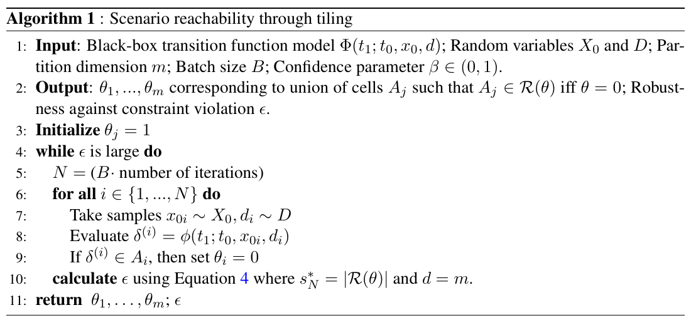
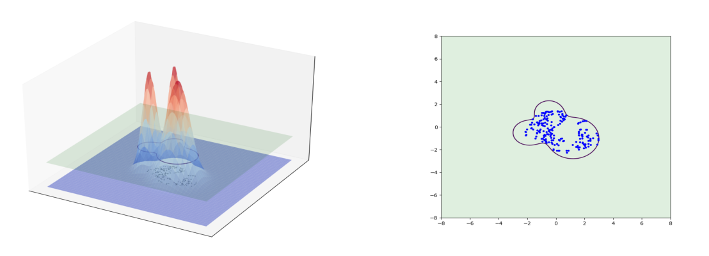
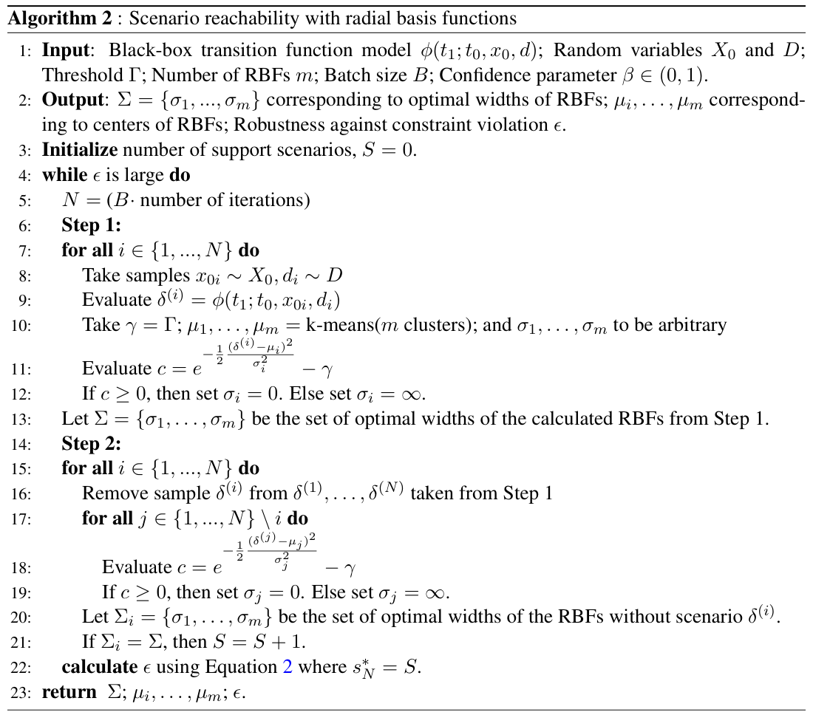
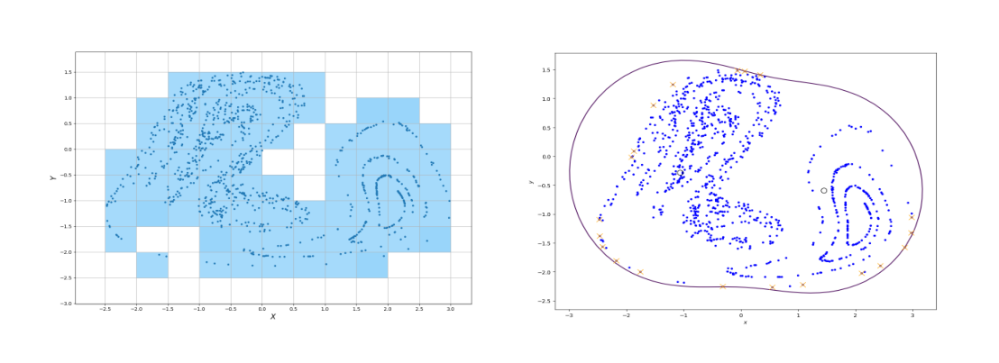
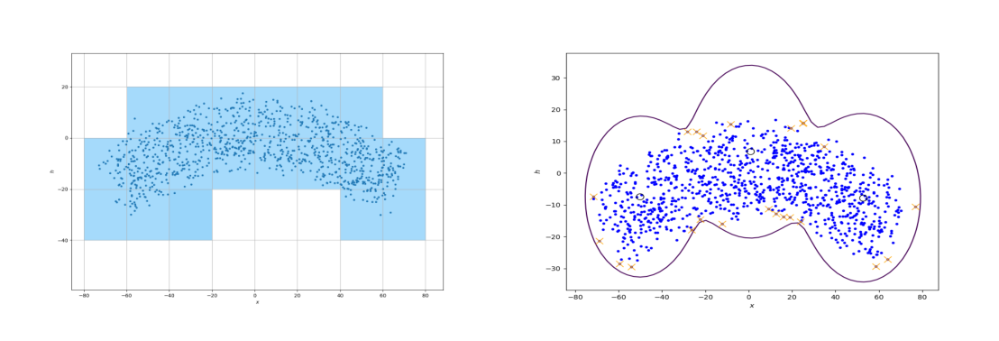

## Conversion notes

- Source version: the published proceedings PDF, Proceedings of Machine Learning Research vol 242:514–527, 2024 (L4DC 2024); 14 PDF pages, single column; authors Elizabeth Dietrich, Rosalyn Alex Devonport, Murat Arcak. The first-page banner ('Proceedings of Machine Learning Research vol 242:514–527, 2024'), the running headers ('DIETRICH DEVONPORT ARCAK' / 'NONCONVEX SCENARIO REACHABILITY') and the page numbers are omitted from the text. The paper has no appendix and no footnotes.
- Mathematics: the authors' TeX source was not available, so all inline and display mathematics was transcribed visually to LaTeX from 240-600 dpi renders of the PDF pages and then compiled with pdflatex and compared with the pages again. No formula is kept as an image. The paper prints fourteen numbered displays, (1)-(14); each is written as a display block carrying its printed number as `\tag{n}`. Bold P is written $\mathbf{P}$, the upright 'Vol' $\mathrm{Vol}$, the double-struck indicator $\mathbb{1}_{A_i}$. Where the authors typed three periods ('{0, 1, ..., N}', '$A_1, ..., A_m$') the periods are kept; spaced dots are written `\ldots`. The e-mail addresses are printed in small capitals and are written in lower case.
- Reading order: floats that the PDF prints in the middle of a sentence were moved so that the prose is continuous. Figure 1 (top of PDF page 6) is placed in Section 3.2 before the paragraph that introduces it; Algorithm 2 (top of PDF page 7, inside Section 4) is placed at the end of Section 3.2, after the sentence that refers to it; Figure 2 (top of PDF page 8) follows the first paragraph of Section 4.1.1; Table 1 (top of PDF page 9, inside Section 4.2) is placed at the end of Section 4.1.2. The copyright line printed at the foot of the first page is placed directly after the author block.
- Algorithms 1 and 2 are given as image crops (assets/figure/algorithm-1.jpg, algorithm-2.jpg) followed by a text transcription: one paragraph per printed line with the printed line numbers, nesting shown by '&emsp;&emsp;' per level as read from the printed indentation. The boxes print no 'end' lines.
- Tables 1 and 2 are transcribed as cells (CSV in assets/table/). In both tables the first header cell is empty, and the row-group label (first column) and the value in the 'Estimate' column are printed once per group of three rows, on the first row of the group; the other cells of those columns are empty in the print and are left empty. The header symbol of the fourth column is written as the character ϵ; it is the $\epsilon$ of the text. In the header 'Run Time of (1)/(2)' the numbers are printed as hyperlinks and refer to Algorithms 1 and 2.
- Theorem 1 is printed in upright type and the PDF shows no visible end of the statement. It is taken to end with display (3); the sentence that follows ('If we apply this general scenario theory to convex problems ...') and display (4) are the authors' refinement for the convex case and refer to Theorem 1 from outside.
- The text and formulas are kept as printed. The following are in the source and are not conversion errors: '$\delta^{(1)}, ...\delta^{(N)}$' without a comma and '(i.i.d)' in Section 2; 'We know $s_N^* < d$' before display (4), whose first case is '$s_N^* \ge d$'; the upright 'd' in 'with d optimization variables'; $\mathcal{R}$ used both for the reachable set and for its approximation, and 'from state $\mathcal{X}_0$' in Section 3; the subscript $i$ on $\theta_i$ inside the set of display (6); '$A_i \cap A_j = \emptyset\ \forall i$' and $\mathbb{R}^D$ with capital $D$ in Section 3.1; in display (10) the left-hand side is $f(x, \mu, \sigma)$ while the exponent has $\mu_i$ and $\sigma_i$; display (9) ends with a comma and display (12) has a comma after $N$; in Algorithm 1, $\Phi$ in line 1 but $\phi$ in line 8, '$\theta = 0$' without index in line 2, and the same index $i$ for sample and cell in line 9; in Algorithm 2, '$\mu_i, \ldots, \mu_m$' in lines 2 and 23, a single exponential (no sum over the $m$ RBFs) in lines 11 and 18, and line 21 'If $\Sigma_i = \Sigma$, then $S = S + 1$' with an equals sign; 'Equation 4' / 'Equation 2' without parentheses in the algorithms; 'a Apple M2 Pro'; the Duffing dynamics written as one second-order equation $\ddot{x} = -\alpha y + x - x^3 + \gamma \cos(\omega t)$ with states $x, y$; '$[-5, 5]$ x $[-5, 5]$' and '20x20' with the letter x; $sin$ and $cos$ in math italic in display (13); the closing quotation marks on both sides of ”one in a billion”; 'a-posterior' in the captions of Tables 1 and 2; 'positon' in the caption of Figure 3; 'Systems Control Letters' (no ampersand) and lower-case 'Hamilton-jacobi', 'christoffel', 'gaussian', 'monte carlo' in the references.
- Number formats: '46, 052' (printed in math mode with a space after the comma) is written $46,052$; the percentages 74.91%, 88.82%, 88.75% and 87.47% are printed in math type and are written as plain text; '.01', '.999966' etc. are printed without a leading zero. In the bibliography, URLs and 'volume(issue):pages' strings that the PDF breaks across lines are closed up.
- Reviewer's check of the transcription (not part of the paper): evaluating the transcribed formulas with $N = 1000$ and $\beta = 10^{-9}$ gives 0.2509 from (4) with $s_N^* = 67$, $d = 400$ (Section 4.1.1) and 0.1253 from (2) with $s_N^* = 22$ (Section 4.2.2), as printed. The printed 0.1125 of Section 4.2.1 ($s_N^* = 19$) is obtained from (4) with $d = 100$, and the printed 0.1182 of Section 4.1.2 is obtained from (2) with $s_N^* = 20$, whereas the text states $s_N^* = 19$ (which gives 0.1146); these values were re-read on the page and are transcribed as printed.

<!-- PDF page 1 -->

# Nonconvex Scenario Optimization for Data-Driven Reachability

**Elizabeth Dietrich** eadietri@berkeley.edu  
**Rosalyn Alex Devonport** alex_devonport@berkeley.edu  
**Murat Arcak** arcak@berkeley.edu  
*Department of Electrical Engineering and Computer Sciences*  
*University of California, Berkeley*

## Abstract

Many of the popular reachability analysis methods rely on the existence of system models. When system dynamics are uncertain or unknown, data-driven techniques must be utilized instead. In this paper, we propose an approach to data-driven reachability that provides a *probabilistic* guarantee of correctness for these systems through nonconvex scenario optimization. We pose the problem of finding reachable sets directly from data as a chance-constrained optimization problem, and present two algorithms for estimating nonconvex reachable sets: (1) through the union of partition cells and (2) through the sum of radial basis functions. Additionally, we investigate numerical examples to demonstrate the capability and applicability of the introduced methods to provide nonconvex reachable set approximations.

**Keywords:** Reachability analysis, scenario optimization, data-driven methods

## 1. Introduction

To guarantee the safety of dynamical systems, *reachability analysis* is often used to determine the set of states that a system could possibly visit. However, in practice, computing exact reachable sets is an undecidable problem. For this reason, approximation methods are often used to reason about these systems and present guarantees. For example, over-approximated reachable sets guarantee safety when they do not overlap with unsafe regions of the state space.

There are many approaches that have been developed for this type of reachability analysis for systems with known dynamics. The most common of these include utilization of Hamilton-Jacobi differential equations (Mitchell et al., 2005; Bansal et al., 2017; Chen and Tomlin, 2018) or barrier certificates (Prajna, 2003; Prajna and Jadbabaie, 2004). While these techniques handle complex nonlinear dynamics well, their computational cost increases sharply with state dimensions. Set propagation techniques (Althoff, 2010; Althoff et al., 2021) iteratively compute a sequence of sets and achieve better scalability with state dimension. The most commonly used families of sets are ellipsoids (Kurzhanski and Varaiya, 2000; Botchkarev and Tripakis, 2000), hyperrectangles (Meyer et al., 2021), zonotopes (Girard, 2005), polytopes (Althoff et al., 2010), and support functions (Althoff and Frehse, 2016).

However, when the exact dynamics of a system are not known or only partially known, none of the techniques above can be used. Instead, we must estimate reachable sets in a data-driven manner. Several methods attempt to provide probabilistic guarantees of correctness for reachable sets directly from data. These methods include results from simulation and trajectory sensitivity analysis (Donzé and Maler, 2007; Girard and Pappas, 2006; Fan et al., 2017) or Gaussian processes (Devonport and Arcak, 2020a) and utilize simulation-based data to learn reachable sets. Other simulation-based and data-driven reachability methods include (Duggirala et al., 2013; Maidens

© 2024 E. Dietrich, R.A. Devonport & M. Arcak.

<!-- PDF page 2 -->

and Arcak, 2015; Arcak and Maidens, 2018; Lew and Pavone, 2020; Alanwar et al., 2021; Sun and Mitra, 2022; Qi et al., 2018).

Another data-driven approach to estimating reachable sets utilizes results from scenario optimization (Yang et al., 2017; Sartipizadeh et al., 2019; Devonport and Arcak, 2020b). This approach reduces the assumptions imposed on a system and can be applied to any system which admits simulation. Scenario optimization is an approach to solving chance-constrained optimization problems by solving a non-probabilistic relaxation of the original problem (Dembo, 1991). Scenario optimization has been used in solving robust control problems (Marseglia et al., 2014) and specifically problems related to reachability (Hewing and Zeilinger, 2020; Xue et al., 2020).

In this paper, we generalize the scenario-based reachability method of (Devonport and Arcak, 2020b). The scenario formalism therein is restricted to the convex case, which features critically in the construction of the probabilistic safety guarantees. However, this formalism places certain formal restrictions, such as convex parameterization, that preclude many popular classes of estimators. We generalize to a nonconvex formalism that allows for a broader class of sets. In particular, both the parametric representation of the minimal reachable set estimator and the reachable set itself can be nonconvex. Additionally, the existing work of (Devonport and Arcak, 2020b) yields a-priori complexity bounds for a desired probability of a problem. Our presented approach does not require a-priori bounds, as we calculate the probability of the original problem after solving the relaxed optimization problem. This allows us to solve a problem given any number of samples and significantly decreases the computational cost in finding reachable sets through scenario optimization.

We present two approaches in Section 3, both of which allow nonconvex reachable set approximations. In the first approach we examine the union of partition cells, and in the second approach we examine the sum of radial basis functions, and use sublevel sets as reachable set estimates.

## 2. Nonconvex Scenario Optimization

Take $\Delta$ to be a probability space with a $\sigma$-algebra and a probability measure $\mathbf{P}$, and let a *scenario*, $\delta$, be a random outcome from this probability space. Since probability $\mathbf{P}$ is not known, it is not possible to directly compute the probability that an unseen scenario will violate a given set of constraints. Instead we use these scenarios, $\delta^{(i)}$, to construct a scenario optimization problem. Nonconvex scenario optimization (Campi et al., 2018; Garatti and Campi, 2024) is a technique to a-posteriori evaluate the robustness level of a scenario solution. Consider any constrained optimization problem of the form

$$
\begin{aligned}
\underset{x \in \mathcal{X}}{\text{minimize}} \quad & f(x) \\
\text{subject to} \quad & x \in \bigcap_{i=1,\ldots,N} \mathcal{X}_{\delta^{(i)}}
\end{aligned} \tag{1}
$$

where $x \in \mathcal{X} \subseteq \mathbb{R}^d$ is the decision variable, $\mathcal{X}_{\delta^{(i)}}$ are constraints, and $\delta^{(1)}, ...\delta^{(N)}$ are $N$ independently and identically-distributed (i.i.d) scenarios. There are no other restrictions on $f$ and $\mathcal{X}_\delta$.

In solving (1), we aim to find a solution that is robust against constraint violation. The violation probability of a given $x \in \mathcal{X}$ is defined as $V(x) = \mathbf{P}\{\delta \in \Delta : x \notin \mathcal{X}_\delta\}$. Let $x_N^*$ be the solution to (1) and define the violation of (1) to be $V(x_N^*)$. This is the probability that a new, randomly selected scenario, $\delta$, will violate the constraints of (1). If $V(x_N^*) \le \epsilon$, then (1) is robust against constraint violation at level $\epsilon$. If the value of $\epsilon$ we achieve in our a-posteriori evaluation is not at the intended level, we iteratively increase $N$ and recalculate $\epsilon$. Therefore, this approach takes on a *wait-and-judge* perspective (Campi and Garatti, 2018).

<!-- PDF page 3 -->

We determine $\epsilon$ a-posteriori as a function of *support scenarios*. A scenario, $\delta$, is a *support scenario* if its removal changes the solution of (1). We evaluate the number of support scenarios, $s_N^*$, by re-solving (1) upon individual removal of each scenario. If removing an individual scenario changes the solution to (1), then it is a support scenario. Through this process, we obtain an irreducible set of support scenarios with cardinality $s_N^*$. To calculate an estimate of $\epsilon$ based on $s_N^*$, $\epsilon(s_N^*)$, we first choose a confidence parameter, $\beta$, then calculate $\epsilon(s_N^*)$ through Theorem 1.

**Theorem 1 ((Campi et al., 2018), Theorem 1)** Given $\beta \in (0, 1)$, for any $s_N^* \in \{0, 1, ..., N\}$, where $N$ is the number of scenario samples, let

$$
\epsilon(s_N^*) := \begin{cases} 1 & \text{if } s_N^* = N, \\ 1 - \sqrt[N - s_N^*]{\dfrac{\beta}{N \binom{N}{s_N^*}}} & \text{otherwise.} \end{cases} \tag{2}
$$

Then, the following probability bound holds:

$$
\mathbf{P}\{V(x_N^*) > \epsilon(s_N^*)\} \le \beta. \tag{3}
$$

If we apply this general scenario theory to convex problems in which we restrict $\mathcal{X}_\delta$ from (1) to be a family of convex constraints, we can bound the number of support scenarios. We know $s_N^* < d$ where $d$ is the number of optimization variables. It is known that a convex optimization problem with d optimization variables will never have more than $d$ support scenarios. Therefore, we refine the definition of $\epsilon$ in Theorem 1 as follows:

$$
\epsilon(s_N^*) := \begin{cases} 1 & \text{if } s_N^* \ge d, \\ 1 - \sqrt[N - s_N^*]{\dfrac{\beta}{d \binom{N}{s_N^*}}} & \text{otherwise.} \end{cases} \tag{4}
$$

## 3. Nonconvex Scenario-Based Reachability

We define a forward reachable set as $\mathcal{R} = \{\Phi(t_1; t_0, x_0, d) : x_0 \in \mathcal{X}_0, d \in \mathcal{D}\}$ where $\mathcal{X}_0 \subseteq \mathbb{R}^{n_x}$ is the set of initial states, $\mathcal{D}$ is the set of disturbance signals $d : [t_0, t_1] \to \mathbb{R}^{n_d}$, and $\Phi : \mathcal{X}_0 \times \mathcal{D} \to \mathbb{R}^{n_x}$ is the state transition function. This is the set of all states to which the system can transition to at time $t_1$ from state $\mathcal{X}_0$ at time $t_0$ subject to disturbances in $\mathcal{D}$. Since we cannot compute exact reachable sets, we aim to compute an approximation, $\mathcal{R}$, that is close to the true reachable set in a probabilistic sense.

Let $X_0 \in \mathcal{X}_0$ and $D \in \mathcal{D}$ be random variables, define $R = \Phi(t_1; t_0, X_0, D)$, and take accuracy parameter $\epsilon \in (0, 1)$ and confidence parameter $\beta \in (0, 1)$. Given a set of samples $\delta^{(i)} = \Phi(t_1; t_0, x_{0i}, d_i), i = 1, \ldots, N$ where $x_{01}, \ldots, x_{0N} \overset{i.i.d}{\sim} X_0$, $d_1, \ldots, d_N \overset{i.i.d}{\sim} D$. We will explore reachable set estimates of the form

$$
\mathcal{R}(\theta) = \{x \in \mathbb{R}^{n_x} : g(x, \theta) \le 0\} \tag{5}
$$

where $g : \mathbb{R}^{n_x} \times \mathbb{R}^{n_\theta} \to \mathbb{R}$. In (5), $\theta$ represents a parameterization of the class of admissible reachable set estimators: to fix a value of $\theta$ is to choose an estimator.

<!-- PDF page 4 -->

We next fix a functional $\mathrm{Vol} : \mathbb{R}^{n_\theta} \to \mathbb{R}$ that represents the volume of $\mathcal{R}(\theta)$. This motivates the following scenario program:

$$
\begin{aligned}
\underset{\theta}{\text{minimize}} \quad & \mathrm{Vol}(\theta) \\
\text{subject to} \quad & \theta \in \bigcap_{i=1,\ldots,N} \{\theta_i : g(\delta^{(i)}, \theta_i) \le 0\}
\end{aligned} \tag{6}
$$

The violation probability, $V(\mathcal{R}(\theta))$, of (6) may be interpreted as the probability that an unseen scenario will violate the bounds of the reachable set estimate. Our goal is to select $\theta$ such that the probability of $V(\mathcal{R}(\theta)) > \epsilon$ is less than or equal to $\beta$ while minimizing $\mathrm{Vol}(\theta)$.

The proposed problem (6) can be equivalently expressed in the functional form

$$
\begin{aligned}
\underset{\theta}{\text{minimize}} \quad & \mathrm{Vol}(\theta) \\
\text{subject to} \quad & g(\delta^{(i)}, \theta) \le 0, i = 1, \ldots, N \\
& \theta \in \mathbb{R}^{n_\theta}.
\end{aligned} \tag{7}
$$

The solution to (7) is the minimum-volume set that contains sample points $\delta^{(1)}, \ldots, \delta^{(N)}$, and guarantees $\mathbf{P}\{V(\mathcal{R}(\theta)) > \epsilon\} \le \beta$. The algorithms we present in this section solve (7) given arbitrary values of $\epsilon, \beta \in (0, 1)$ and $N$ samples.

### 3.1. Tiling with Basis Functions

We first present a method to construct a sublevel set function $g(x, \theta)$ that is convex in $\theta$ but nonconvex in $x$, as was done in (Devonport, 2023). While convex scenario optimization methods can be used to analyze this approach, they require large sample sizes and are not computationally efficient. We show that by utilizing the nonconvex scenario optimization tools introduced in Section 2, we can significantly improve upon these limitations. To construct $g(x, \theta)$, select a finite set of basis functions $f_1(x), ..., f_m(x) : \mathbb{R}^D \to \mathbb{R}$ and take $g$ to be

$$
g(x, \theta) = \sum_{i=1}^{m} \theta_i f_i(x) \tag{8}
$$

In this section, we will use this approach to construct a *tiling* of the state space and estimate the reachable set of a given problem. To create this *tiling*, assume that the reachable set, $\mathcal{R}$, is contained in a subset $A \subseteq \mathbb{R}^D$. We then partition A into $m$ cells, creating a collection of sets $A_1, ..., A_m$ such that $\cup_{i=1}^{m} A_i = A$ and $A_i \cap A_j = \emptyset\ \forall i$. This approach can produce arbitrarily fine estimates of the reachable set, depending on how refined the partition is. The accuracy of the partition increases as $m$ increases. Further, we define $\mathbb{1}_{A_i}$ to be the zero-one indicator function for the set $A_i$, so that $\mathbb{1}_{A_i}(x) = 1$ if $x \in A_i$ and $\mathbb{1}_{A_i}(x) = 0$ otherwise. Therefore, the reachable set estimate is a union of the partitioned cells. We write this as a constrained optimization problem:

$$
\begin{aligned}
\underset{\theta}{\text{minimize}} \quad & -\sum_{i=1}^{m} \theta_i \\
\text{subject to} \quad & \sum_{i=1}^{m} \theta_i \mathbb{1}_{A_i}(\delta^{(j)}) \le 0, \quad j = 1, \ldots, N \\
& \theta \in [0, 1]^m,
\end{aligned} \tag{9}
$$

<!-- PDF page 5 -->

To satisfy the scenario constraints, we set $\theta_i = 0\ \forall i$ such that scenario $\delta^{(j)} \in A_i$ for at least one $j \in \{1, ..., N\}$. To minimize the objective while respecting $\theta \in [0, 1]^m$ we set $\theta_i = 1$ for all other $A_i$. Therefore, $\mathcal{R}(\theta)$ is the solution to (9), the union of cells $A_i$ that contain one or more scenarios $\delta^{(j)}$. This is the minimum volume union of cells that contains all scenarios, $\delta^{(1)}, \ldots, \delta^{(N)}$.

We define a support scenario to be the first scenario, $\delta^{(j)}$, in any cell $A_i$. While this set of support scenarios is not unique, it is irreducible. These scenarios represent the smallest set of reachable states that is possible without changing the solution to (9). This satisfies the conditions needed to obtain the number of support scenarios, $s_N^*$. We calculate $\epsilon$ a-posteriori using (4) with $s_N^*$ and the number of optimization variables, $d$ (the number of cells in our partition). If the obtained $\epsilon$ does not satisfy the necessary bounds, we iteratively increase the number of samples, $N$, and repeat the process. This reachability algorithm based on partition $A_1, ..., A_m$ is described in Algorithm 1.

**Algorithm 1** : Scenario reachability through tiling

1: **Input**: Black-box transition function model $\Phi(t_1; t_0, x_0, d)$; Random variables $X_0$ and $D$; Partition dimension $m$; Batch size $B$; Confidence parameter $\beta \in (0, 1)$.

2: **Output**: $\theta_1, ..., \theta_m$ corresponding to union of cells $A_j$ such that $A_j \in \mathcal{R}(\theta)$ iff $\theta = 0$; Robustness against constraint violation $\epsilon$.

3: **Initialize** $\theta_j = 1$

4: **while** $\epsilon$ is large **do**

5: &emsp;&emsp;$N = (B \cdot \text{number of iterations})$

6: &emsp;&emsp;**for all** $i \in \{1, ..., N\}$ **do**

7: &emsp;&emsp;&emsp;&emsp;Take samples $x_{0i} \sim X_0, d_i \sim D$

8: &emsp;&emsp;&emsp;&emsp;Evaluate $\delta^{(i)} = \phi(t_1; t_0, x_{0i}, d_i)$

9: &emsp;&emsp;&emsp;&emsp;If $\delta^{(i)} \in A_i$, then set $\theta_i = 0$

10: &emsp;&emsp;**calculate** $\epsilon$ using Equation 4 where $s_N^* = |\mathcal{R}(\theta)|$ and $d = m$.

11: **return** $\theta_1, \ldots, \theta_m$; $\epsilon$

### 3.2. Radial Basis Functions (RBFs)

We now turn to a method that allows nonconvexity in both parameters, $\theta$ and $x$. Unlike the method proposed in Section 3.1, this method is not amenable to existing approaches, such as those presented in (Devonport and Arcak, 2020b; Devonport, 2023). In this approach, we construct $g(x, \theta)$ from a finite set of RBFs. We define a RBF, $f(x, \mu, \sigma)$, to be a Gaussian function of $x, \mu, \sigma,$ such that

$$
f(x, \mu, \sigma) = e^{-\frac{1}{2} \frac{(x - \mu_i)^2}{\sigma_i^2}} \tag{10}
$$

where $\mu$ is the center of a RBF and $\sigma$ is the width of a RBF. We take $g$ to be

$$
g(x, \theta) = \sum_{i=1}^{m} f(x, \mu_i, \sigma_i) - \gamma \tag{11}
$$

Therefore, $\theta = (\mu_1, \ldots, \mu_m; \sigma_1, \ldots, \sigma_m; \gamma)$.

Figure 1 demonstrates that RBFs are particularly well-suited for constructing reachable sets due to the tail interactions that allow multiple RBFs to connect into shapes more complicated than unions of ellipsoids. This approach allows the number of RBFs, $m$, to be arbitrarily set. If $m$ is larger than

<!-- PDF page 6 -->

Figure 1: (Left) Radial basis function generated by a set of data with the plane defined by the threshold value, $\gamma$, (Right) the contour line (black), created by the intersection of the threshold plane with the RBF, and the set of data (dark blue).

needed, Algorithm 2 will produce disconnected sets. However, the unnecessary RBFs will only contain their initial center. This approach further allows us to produce disconnected reachable sets for systems that exhibit these dynamics. We write this as a constrained optimization problem:

$$
\begin{aligned}
\underset{\mu, \sigma}{\text{minimize}} \quad & \sum_{i=1}^{m} \sigma_i^2 \\
\text{subject to} \quad & \sum_{i=1}^{m} e^{-\frac{1}{2} \frac{(\delta^{(j)} - \mu_i)^2}{\sigma_i^2}} - \gamma \ge 0, \quad j = 1, \ldots, N, \\
& \sigma \in [0, \infty)^m
\end{aligned} \tag{12}
$$

We define a support scenario as any scenario, $\delta^{(j)}$, that changes the solution to Equation (12) when removed from the set of all scenarios, $\delta^{(1)}, \ldots, \delta^{(N)}$. In other words, the removal of $\delta^{(j)}$ results in different optimal widths, $\sigma$, of the calculated RBFs. It is worth noting that the process of finding these support scenarios can be parallelized. By definition, this satisfies the conditions needed to obtain the number of support scenarios, $s_N^*$. Due to the nonconvex nature of this problem, we calculate $\epsilon$ a-posteriori using (2) with $s_N^*$. If the obtained value of $\epsilon$ does not satisfy the necessary bounds, we iteratively increase the number of samples, $N$, and repeat the process. This description is summarized in Algorithm 2.

## 4. Examples

This section demonstrates the ability of the presented data-driven approaches to accurately estimate the forward reachable sets of two numerical examples posed in (Devonport et al., 2021). We evaluate Algorithms 1 and 2, to expose extensions of scenario optimization, but we do not attempt to compare these methods. All computations were done on a Apple M2 Pro, 12-core CPU. One Python thread was run to compute all tiling problems, while ten Python threads were used in computing the radial basis functions.

To verify that the computed reachable sets in the following examples satisfy the guarantee that they are $\epsilon$-accurate, we compute an a-posteriori empirical estimate of the reachable set using a

<!-- PDF page 7 -->

**Algorithm 2** : Scenario reachability with radial basis functions

1: **Input**: Black-box transition function model $\phi(t_1; t_0, x_0, d)$; Random variables $X_0$ and $D$; Threshold $\Gamma$; Number of RBFs $m$; Batch size $B$; Confidence parameter $\beta \in (0, 1)$.

2: **Output**: $\Sigma = \{\sigma_1, ..., \sigma_m\}$ corresponding to optimal widths of RBFs; $\mu_i, \ldots, \mu_m$ corresponding to centers of RBFs; Robustness against constraint violation $\epsilon$.

3: **Initialize** number of support scenarios, $S = 0$.

4: **while** $\epsilon$ is large **do**

5: &emsp;&emsp;$N = (B \cdot \text{number of iterations})$

6: &emsp;&emsp;**Step 1:**

7: &emsp;&emsp;**for all** $i \in \{1, ..., N\}$ **do**

8: &emsp;&emsp;&emsp;&emsp;Take samples $x_{0i} \sim X_0, d_i \sim D$

9: &emsp;&emsp;&emsp;&emsp;Evaluate $\delta^{(i)} = \phi(t_1; t_0, x_{0i}, d_i)$

10: &emsp;&emsp;&emsp;&emsp;Take $\gamma = \Gamma$; $\mu_1, \ldots, \mu_m =$ k-means($m$ clusters); and $\sigma_1, \ldots, \sigma_m$ to be arbitrary

11: &emsp;&emsp;&emsp;&emsp;Evaluate $c = e^{-\frac{1}{2} \frac{(\delta^{(i)} - \mu_i)^2}{\sigma_i^2}} - \gamma$

12: &emsp;&emsp;&emsp;&emsp;If $c \ge 0$, then set $\sigma_i = 0$. Else set $\sigma_i = \infty$.

13: &emsp;&emsp;Let $\Sigma = \{\sigma_1, \ldots, \sigma_m\}$ be the set of optimal widths of the calculated RBFs from Step 1.

14: &emsp;&emsp;**Step 2:**

15: &emsp;&emsp;**for all** $i \in \{1, ..., N\}$ **do**

16: &emsp;&emsp;&emsp;&emsp;Remove sample $\delta^{(i)}$ from $\delta^{(1)}, \ldots, \delta^{(N)}$ taken from Step 1

17: &emsp;&emsp;&emsp;&emsp;**for all** $j \in \{1, ..., N\} \setminus i$ **do**

18: &emsp;&emsp;&emsp;&emsp;&emsp;&emsp;Evaluate $c = e^{-\frac{1}{2} \frac{(\delta^{(j)} - \mu_j)^2}{\sigma_j^2}} - \gamma$

19: &emsp;&emsp;&emsp;&emsp;&emsp;&emsp;If $c \ge 0$, then set $\sigma_j = 0$. Else set $\sigma_j = \infty$.

20: &emsp;&emsp;&emsp;&emsp;Let $\Sigma_i = \{\sigma_1, \ldots, \sigma_m\}$ be the set of optimal widths of the RBFs without scenario $\delta^{(i)}$.

21: &emsp;&emsp;&emsp;&emsp;If $\Sigma_i = \Sigma$, then $S = S + 1$.

22: &emsp;&emsp;**calculate** $\epsilon$ using Equation 2 where $s_N^* = S$.

23: **return** $\Sigma$; $\mu_i, \ldots, \mu_m$; $\epsilon$.

one-sided Chernoff bound (Tempo et al., 2012). This ensures that the a-posteriori estimate of the reachable set given an additional $46,052$ samples exceeds the true measure by no more than $.01$ with confidence $0.9999$. The results are shown in Tables 1 and 2 and validate that the reachable sets are indeed $\epsilon$-accurate.

### 4.1. Duffing Oscillator

The first example is a reachable set estimation problem for the nonlinear, time-varying system with dynamics: $\ddot{x} = -\alpha y + x - x^3 + \gamma \cos(\omega t)$, with states $x, y \in \mathbb{R}$ and parameters $\alpha, \gamma, \omega \in \mathbb{R}$. This system is known as the Duffing oscillator, a nonlinear oscillator which exhibits chaotic behavior for certain values of $\alpha, \gamma$ and $\omega$, for instance $\alpha = 0.05, \gamma = 0.4, \omega = 1.3$. The set of initial states is the interval such that $x(0) \in [0.95, 1.05]$, $y(0) \in [-0.05, 0.05]$, and we take $X_0$ to be the uniform random variable over this interval. The time range is $[t_0, t_1] = [0, 100]$.

#### 4.1.1. Tiling with Basis Functions

We take A to be the hyperrectangle $A = [-5, 5]$ x $[-5, 5]$ and partition A into a 20x20 grid. We take $N = 1000$ samples and $\beta = 10^{-9}$. The output of Algorithm 1 for this problem, which took 1.70

<!-- PDF page 8 -->

Figure 2: Duffing Oscillator problem in $\mathbb{R}^2$: (Left) Enlarged view of reachable set (light blue) using a grid-based partition and N=1000 samples (dark blue). (Right) Reachable set (purple) and support scenarios (orange) using two radial basis functions and N=1000 samples (dark blue).

seconds to compute, is shown on the left in Figure 2. We calculate the number of support scenarios, $s_N^* = 67$, and $\epsilon = 0.2509$ a-posteriori to get the probability that our tiling contains at least 74.91% of the reachable set distribution, with a ”one in a billion” chance of failure. We performed 100 trials of the same experiment and the number of support scenarios was always between 63 and 72. On average, the probabilistic volume outside the reachable set did not exceed 25.09% under the convexity refined nonconvex approach. Additionally, we utilize the wait-and-judge perspective to investigate the effect of a larger $N$ on $\epsilon$. The results are shown in Table 1.

#### 4.1.2. Radial Basis Functions

We take $m = 2$, such that we will calculate two radial basis functions. We set the initial centers of the RBFs to be close to optimal using a k-means clustering algorithm and allow the widths of our RBF to be chosen arbitrarily. We take $\gamma = 0.25$ to be the threshold of our RBF, $N = 1000$ samples, and $\beta = 10^{-9}$. The output of Algorithm 2 for this problem, which took approximately 7 minutes to compute, is shown on the right in Figure 2. We calculate the number of support scenarios, $s_N^* = 19$, and $\epsilon = 0.1182$ a-posteriori to get the probability that our radial basis functions contain at least 88.82% of the reachable set distribution, with a ”one in a billion” chance of failure. We performed 100 trials of the same experiment and the number of support scenarios was always between 5 and 24. On average, the probabilistic volume outside the reachable set did not exceed 10.34% under the nonconvex approach. Additionally, we utilize the wait-and-judge perspective to investigate the effect of a larger $N$ on $\epsilon$. The results are shown in Table 1.

### 4.2. Quadrotor Model

The next example is a reachable set estimation problem for a nonlinear model of a quadrotor used as an example in (Mitchell et al., 2019) and (Bouffard, 2012). The dynamics for this system are

$$
\ddot{x} = u_1 K sin(\theta), \quad \ddot{h} = -g + u_1 K cos(\theta), \quad \ddot{\theta} = -d_0 \theta - d_1 \dot{\theta} + n_0 u_2 \tag{13}
$$

where $x$ and $h$ denote the quadrotor’s horizontal position and altitude in meters, respectively, and $\theta$ denotes its angular displacement. The system has 6 states, which we take to be $x, h, \theta$, and their first derivatives. The two system inputs $u_1$ and $u_2$ represent the motor thrust and the desired

<!-- PDF page 9 -->

[Table 1](s001-dietrich2024nonconvex/table-1.csv)

Table 1: Computation times and a-posterior calculation of $\epsilon$ for reachable sets of $N$ samples of Duffing Oscillator, and empirical estimates of the reachable sets (in Figure 2) using a one-sided Chernoff bound.

angle, respectively. The parameter values used (following (Bouffard, 2012)) are $g = 9.81, K = 0.89/1.4, d_0 = 70, d_1 = 17, n_0 = 55$. The set of initial states is the interval such that

$$
\begin{aligned}
x(0) &\in [-1.7, 1.7], & h(0) &\in [0.3, 2.0], & \theta(0) &\in [-\pi/12, \pi/12], \\
\dot{x}(0) &\in [-0.8, 0.8], & \dot{h}(0) &\in [-1.0, 1.0], & \dot{\theta}(0) &\in [-\pi/2, \pi/2],
\end{aligned} \tag{14}
$$

the set of inputs is the set of constant functions $u_1(t) = u_1$, $u_2(t) = u_2\ \forall t \in [t_0, t_1]$, whose values lie in the interval $u_1 \in [-1.5 + g/K, 1.5 + g/K], u_2 \in [-\pi/4, \pi/4]$, and we take $X_0$ and $D$ to be the uniform random variables defined over these intervals. The time range is $[t_0, t_1] = [0, 5]$.

Figure 3: Reachable set estimates for the horizontal positon and altitude of the planar quadrotor model: (Left) Enlarged view of reachable set (light blue) using a grid-based partition and N=1000 samples (dark blue). (Right) Reachable set (purple) and support scenarios (orange) using three radial basis functions and N=1000 samples (dark blue).

#### 4.2.1. Tiling with Basis Functions

We take A to be the hyperrectangle $A = [-100, 100]^6$ and partition A to be the grid with 10 sides along each dimension. We take $N = 1000$ samples and $\beta = 10^{-9}$. The output of Algorithm 1 for this problem, which took 6.28 seconds to compute, is shown on the left in Figure 3. We calculate the number of support scenarios, $s_N^* = 19$, and $\epsilon = 0.1125$ a-posteriori to get the probability that our tiling contains at least 88.75% of the reachable set distribution, with a ”one in a billion” chance

<!-- PDF page 10 -->

of failure. We performed 100 trials of the same experiment and the number of support scenarios remained between 18 and 22. On average, the probabilistic volume outside the reachable set did not exceed 11.6% under the convexity refined nonconvex approach. Additionally, we investigate the effect of a larger $N$ on $\epsilon$. The results are shown in Table 2.

[Table 2](s001-dietrich2024nonconvex/table-2.csv)

Table 2: Computation times and a-posterior calculation of $\epsilon$ for reachable sets of $N$ samples of Quadrotor, and empirical estimates of the reachable sets (in Figure 3) using a one-sided Chernoff bound.

#### 4.2.2. Radial Basis Functions

We take $m = 3$, such that we will calculate three radial basis functions. We set the initial centers of the RBFs to be close to optimal using a k-means clustering algorithm and allow the widths of our RBF to be chosen arbitrarily. We take $\gamma = 0.25$ to be the threshold of our RBF, $N = 1000$ samples, and $\beta = 10^{-9}$. The output of Algorithm 2 for this problem, which took approximately 30 minutes to compute, is shown on the right in Figure 3. We calculate the number of support scenarios, $s_N^* = 22$, and $\epsilon = 0.1253$ a-posteriori to get the probability that our radial basis functions contain at least 87.47% of the reachable set distribution, with a ”one in a billion” chance of failure. We performed 100 trials of the same experiment and the number of support scenarios was always between 14 and 31. On average, the probabilistic volume outside the reachable set did not exceed 11.8% under the nonconvex approach. Additionally, we utilize the wait-and-judge perspective to investigate the effect of a larger $N$ on $\epsilon$. The results are shown in Table 2.

## 5. Conclusion

We presented a method of nonconvex scenario optimization for reachability analysis. This approach does not require a-priori sample complexity bounds and significantly decreases the computational cost in finding reachable sets. We first provided a partition-based instance of scenario reachability that is computationally efficient and scales well to higher state dimensions. We then provided an estimation of reachable sets using radial basis functions.

## Acknowledgments

This work was supported in part by the National Science Foundation grant CNS-2111688, Air Force Office of Scientific Research grants FA5590-21-1-0529 and FA9550-21-1-0288, and by a National Science Foundation Graduate Research Fellowship.

<!-- PDF page 11 -->

## References

Amr Alanwar, Anne Koch, Frank Allgöwer, and Karl Henrik Johansson. Data-driven reachability analysis using matrix zonotopes. In *Proceedings of the 3rd Conference on Learning for Dynamics and Control*, volume 144 of *Proceedings of Machine Learning Research*, pages 163–175. PMLR, 07 – 08 June 2021. URL https://proceedings.mlr.press/v144/alanwar21a.html.

Matthias Althoff. *Reachability analysis and its application to the safety assessment of autonomous cars*. PhD thesis, Technische Universität München, 2010.

Matthias Althoff and Goran Frehse. Combining zonotopes and support functions for efficient reachability analysis of linear systems. In *2016 IEEE 55th Conference on Decision and Control (CDC)*, pages 7439–7446, 2016. doi: 10.1109/CDC.2016.7799418.

Matthias Althoff, Olaf Stursberg, and Martin Buss. Computing reachable sets of hybrid systems using a combination of zonotopes and polytopes. *Nonlinear Analysis: Hybrid Systems*, 4(2):233–249, 2010. ISSN 1751-570X. doi: https://doi.org/10.1016/j.nahs.2009.03.009. URL https://www.sciencedirect.com/science/article/pii/S1751570X09000442. IFAC World Congress 2008.

Matthias Althoff, Goran Frehse, and Antoine Girard. Set propagation techniques for reachability analysis. *Annual Review of Control, Robotics, and Autonomous Systems*, 4(1):369–395, 2021. doi: 10.1146/annurev-control-071420-081941. URL https://doi.org/10.1146/annurev-control-071420-081941.

Murat Arcak and John Maidens. *Simulation-Based Reachability Analysis for Nonlinear Systems Using Componentwise Contraction Properties*, pages 61–76. Springer International Publishing, Cham, 2018. ISBN 978-3-319-95246-8. doi: 10.1007/978-3-319-95246-8_4. URL https://doi.org/10.1007/978-3-319-95246-8_4.

Somil Bansal, Mo Chen, Sylvia Herbert, and Claire J. Tomlin. Hamilton-jacobi reachability: A brief overview and recent advances. In *2017 IEEE 56th Annual Conference on Decision and Control (CDC)*, pages 2242–2253, 2017. doi: 10.1109/CDC.2017.8263977.

Oleg Botchkarev and Stavros Tripakis. Verification of hybrid systems with linear differential inclusions using ellipsoidal approximations. In Nancy Lynch and Bruce H. Krogh, editors, *Hybrid Systems: Computation and Control*, pages 73–88, Berlin, Heidelberg, 2000. Springer Berlin Heidelberg.

Patrick Bouffard. On-board model predictive control of a quadrotor helicopter: Design, implementation, and experiments. Master’s thesis, EECS Department, University of California, Berkeley, Dec 2012. URL http://www2.eecs.berkeley.edu/Pubs/TechRpts/2012/EECS-2012-241.html.

M. C. Campi and S. Garatti. Wait-and-judge scenario optimization. *Math. Program.*, 167(1):155–189, jan 2018. ISSN 0025-5610. doi: 10.1007/s10107-016-1056-9. URL https://doi.org/10.1007/s10107-016-1056-9.

<!-- PDF page 12 -->

Marco Claudio Campi, Simone Garatti, and Federico Alessandro Ramponi. A general scenario theory for nonconvex optimization and decision making. *IEEE Transactions on Automatic Control*, 63(12):4067–4078, 2018. doi: 10.1109/TAC.2018.2808446.

Mo Chen and Claire J. Tomlin. Hamilton–jacobi reachability: Some recent theoretical advances and applications in unmanned airspace management. *Annual Review of Control, Robotics, and Autonomous Systems*, 1(1):333–358, 2018. doi: 10.1146/annurev-control-060117-104941. URL https://doi.org/10.1146/annurev-control-060117-104941.

Ron S Dembo. Scenario optimization. *Annals of Operations Research*, 30:63–80, 1991.

Alex Devonport. *Contributions to the Statistical Foundation of Data-Driven Control*. PhD thesis, EECS Department, University of California, Berkeley, Aug 2023. URL http://www2.eecs.berkeley.edu/Pubs/TechRpts/2023/EECS-2023-207.html.

Alex Devonport and Murat Arcak. Data-driven reachable set computation using adaptive gaussian process classification and monte carlo methods. In *2020 American Control Conference (ACC)*, pages 2629–2634, 2020a. doi: 10.23919/ACC45564.2020.9147918.

Alex Devonport and Murat Arcak. Estimating reachable sets with scenario optimization. In *Proceedings of the 2nd Conference on Learning for Dynamics and Control*, volume 120 of *Proceedings of Machine Learning Research*, pages 75–84. PMLR, 10–11 Jun 2020b. URL https://proceedings.mlr.press/v120/devonport20a.html.

Alex Devonport, Forest Yang, Laurent El Ghaoui, and Murat Arcak. Data-driven reachability analysis with christoffel functions. In *2021 60th IEEE Conference on Decision and Control (CDC)*, page 5067–5072. IEEE Press, 2021. doi: 10.1109/CDC45484.2021.9682860. URL https://doi.org/10.1109/CDC45484.2021.9682860.

Alexandre Donzé and Oded Maler. Systematic simulation using sensitivity analysis. In *Proceedings of the 10th International Conference on Hybrid Systems: Computation and Control*, HSCC’07, page 174–189, Berlin, Heidelberg, 2007. Springer-Verlag. ISBN 9783540714927.

Parasara Sridhar Duggirala, Sayan Mitra, and Mahesh Viswanathan. Verification of annotated models from executions. In *2013 Proceedings of the International Conference on Embedded Software (EMSOFT)*, pages 1–10, 2013. doi: 10.1109/EMSOFT.2013.6658604.

Chuchu Fan, Bolun Qi, Sayan Mitra, and Mahesh Viswanathan. Dryvr: Data-driven verification and compositional reasoning for automotive systems. In Rupak Majumdar and Viktor Kunčak, editors, *Computer Aided Verification*, pages 441–461, Cham, 2017. Springer International Publishing. ISBN 978-3-319-63387-9.

Simone Garatti and Marco C. Campi. Non-convex scenario optimization. *Mathematical Programming*, 2024. doi: 10.1007/s10107-024-02074-3. URL https://doi.org/10.1007/s10107-024-02074-3.

Antoine Girard. Reachability of uncertain linear systems using zonotopes. In Manfred Morari and Lothar Thiele, editors, *Hybrid Systems: Computation and Control*, pages 291–305, Berlin, Heidelberg, 2005. Springer Berlin Heidelberg.

<!-- PDF page 13 -->

Antoine Girard and George J. Pappas. Verification using simulation. In João P. Hespanha and Ashish Tiwari, editors, *Hybrid Systems: Computation and Control*, pages 272–286, Berlin, Heidelberg, 2006. Springer Berlin Heidelberg.

Lukas Hewing and Melanie N. Zeilinger. Scenario-based probabilistic reachable sets for recursively feasible stochastic model predictive control. *IEEE Control Systems Letters*, 4(2):450–455, 2020. doi: 10.1109/LCSYS.2019.2949194.

A.B. Kurzhanski and P. Varaiya. Ellipsoidal techniques for reachability analysis: internal approximation. *Systems Control Letters*, 41(3):201–211, 2000. ISSN 0167-6911. doi: https://doi.org/10.1016/S0167-6911(00)00059-1. URL https://www.sciencedirect.com/science/article/pii/S0167691100000591.

Thomas Lew and Marco Pavone. Sampling-based reachability analysis: A random set theory approach with adversarial sampling. *ArXiv*, abs/2008.10180, 2020. URL https://api.semanticscholar.org/CorpusID:221266413.

John Maidens and Murat Arcak. Reachability analysis of nonlinear systems using matrix measures. *IEEE Transactions on Automatic Control*, 60(1):265 – 270, 2015.

G.R. Marseglia, J.K. Scott, L. Magni, R.D. Braatz, and D.M. Raimondo. A hybrid stochastic-deterministic approach for active fault diagnosis using scenario optimization. *IFAC Proceedings Volumes*, 47(3):1102–1107, 2014. ISSN 1474-6670. doi: https://doi.org/10.3182/20140824-6-ZA-1003.02590. URL https://www.sciencedirect.com/science/article/pii/S1474667016417611. 19th IFAC World Congress.

P.-J. Meyer, A. Devonport, and M. Arcak. *Interval Reachability Analysis: Bounding Trajectories of Uncertain Systems with Boxes for Control and Verification*. SpringerBriefs in Control, Automation and Robotics. Springer, 2021. doi: 10.1007/978-3-030-65110-7.

Ian M. Mitchell, Jacob Budzis, and Andriy Bolyachevets. Invariant, viability and discriminating kernel under-approximation via zonotope scaling: Poster abstract. In *Proceedings of the 22nd ACM International Conference on Hybrid Systems: Computation and Control*, HSCC ’19, page 268–269, New York, NY, USA, 2019. Association for Computing Machinery. ISBN 9781450362825. doi: 10.1145/3302504.3313354. URL https://doi.org/10.1145/3302504.3313354.

I.M. Mitchell, A.M. Bayen, and C.J. Tomlin. A time-dependent hamilton-jacobi formulation of reachable sets for continuous dynamic games. *IEEE Transactions on Automatic Control*, 50(7):947–957, 2005. doi: 10.1109/TAC.2005.851439.

S. Prajna. Barrier certificates for nonlinear model validation. In *42nd IEEE International Conference on Decision and Control (IEEE Cat. No.03CH37475)*, volume 3, pages 2884–2889 Vol.3, 2003. doi: 10.1109/CDC.2003.1273063.

Stephen Prajna and Ali Jadbabaie. Safety verification of hybrid systems using barrier certificates. In Rajeev Alur and George J. Pappas, editors, *Hybrid Systems: Computation and Control*, pages 477–492, Berlin, Heidelberg, 2004. Springer Berlin Heidelberg. ISBN 978-3-540-24743-2.

<!-- PDF page 14 -->

Bolun Qi, Chuchu Fan, Minghao Jiang, and Sayan Mitra. Dryvr 2.0: A tool for verification and controller synthesis of black-box cyber-physical systems. In *Proceedings of the 21st International Conference on Hybrid Systems: Computation and Control (Part of CPS Week)*, HSCC ’18, page 269–270, New York, NY, USA, 2018. Association for Computing Machinery. ISBN 9781450356428. doi: 10.1145/3178126.3187008. URL https://doi.org/10.1145/3178126.3187008.

Hossein Sartipizadeh, Abraham P. Vinod, Behçet Açikmeşe, and Meeko Oishi. Voronoi partition-based scenario reduction for fast sampling-based stochastic reachability computation of linear systems. In *2019 American Control Conference (ACC)*, pages 37–44, 2019. doi: 10.23919/ACC.2019.8814354.

Dawei Sun and Sayan Mitra. Neureach: Learning reachability functions from simulations. In Dana Fisman and Grigore Rosu, editors, *Tools and Algorithms for the Construction and Analysis of Systems*, pages 322–337, Cham, 2022. Springer International Publishing.

Roberto Tempo, Giuseppe Calafiore, and Fabrizio Dabbene. *Randomized Algorithms for Analysis and Control of Uncertain Systems: With Applications*. Springer Publishing Company, Incorporated, 2nd edition, 2012. ISBN 1447146093.

Bai Xue, Miaomiao Zhang, Arvind Easwaran, and Qin Li. Pac model checking of black-box continuous-time dynamical systems. *IEEE Transactions on Computer-Aided Design of Integrated Circuits and Systems*, 39(11):3944–3955, 2020. doi: 10.1109/TCAD.2020.3012251.

Yang Yang, Jun Zhang, Kai-Quan Cai, and Maria Prandini. Multi-aircraft conflict detection and resolution based on probabilistic reach sets. *IEEE Transactions on Control Systems Technology*, 25(1):309–316, 2017. doi: 10.1109/TCST.2016.2542046.
