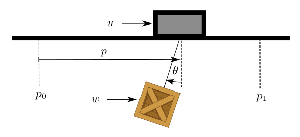
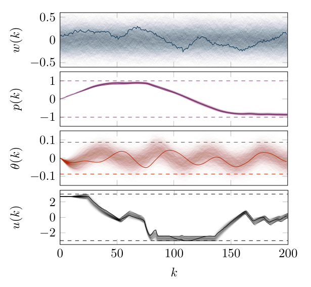

# Scenario-based Probabilistic Reachable Sets for Recursively Feasible Stochastic Model Predictive Control

## Conversion notes

- Source version: accepted version from the ETH Research Collection, doi:10.3929/ethz-b-000389523 (7 PDF pages: page 1 is an ETH Library cover sheet, the paper itself is the remaining 6 pages in IEEE two-column format). Authors: Lukas Hewing, Melanie N. Zeilinger. Originally published in IEEE Control Systems Letters 4(2), 2020, doi:10.1109/lcsys.2019.2949194 (published online 2019). This package was made from the accepted version, not from the IEEE-typeset article; the accepted version carries no page numbers or running headers. The paper's own title page prints 'Scenario-based' (lower-case b); the cover sheet and the IEEE record print 'Scenario-Based'.
- No TeX source of the authors was available. All mathematics (inline and displayed) was transcribed visually to LaTeX from 200 dpi page renders, 300 dpi column crops and 500 dpi zooms of the densest formulas, and every transcribed formula was compiled with pdflatex as a syntax check. Every symbol was legible; no formula is kept as an image. Equation tags (1)-(17b) are the printed numbers; displays without a \tag are unnumbered in the paper. The sans-serif transpose mark of the paper is written $\mathsf{T}$.
- Layout decisions. The ETH cover sheet (PDF page 1) is reproduced as plain text under the added heading 'Repository cover sheet (ETH Research Collection)', placed after the title, the author line and the first-page footnote and before the abstract; only the ETH logo was omitted. The unnumbered first-page footnote (funding, affiliation, e-mail) is printed at the foot of the first column and is placed directly after the author line. Figure 1 is printed at the top of the page that carries Sections IV-C and V and is placed at the end of the Section V introduction; Figure 2 and Table I are printed inside the last paragraph of Section V-A and are placed directly after that paragraph, before 'B. Results'. Theorem, corollary and proof labels are set in bold; the paper prints theorem and corollary statements in italics, which is not reproduced. The statement of Theorem 1 consists of the sentence 'Let $N_s$ and $N_k$ satisfy', display (6), and the sentence 'The optimal solution $x^*$ of (5) is a feasible solution for optimization problem (4) with probability $1-\beta$.'
- Table I is given as CSV/Markdown cells; its Constraint column contains small formulas that are stored in plain characters, with the printed LaTeX forms in a labelled conversion note below the table. The paper has no algorithm boxes and no numbered footnotes. The appendix (crane model and disturbance covariance) is part of this version and is included.
- The text and formulas are kept as printed. The following are in the source and are not conversion errors: in (2a) the index set '$\{1, \ldots n_c\}$' and in the proof of Theorem 2 '$\{v_0^*, \ldots v_{N-1}^*\}$' without a comma after the dots; '(see [9].' with an unclosed parenthesis before (8); in the proof of Theorem 2 '$v_i^* \in \mathcal{V}$ for all $1 \le i \le N$'; Assumption 4 defines $\mathcal{Z}_\infty$ as an intersection from $k=1$ while Remark 3 speaks of $k = 0, \ldots, \bar{N}$; in Section IV the sampled sequences are written $W^{(i)} \sim \mathcal{W}$ although Section II writes $W \sim \mathcal{Q}$, and $W^{(i)}$ runs to index $\bar{N}-1$ while $E^{(i)}$ runs to $\bar{N}$; 'Assumption (1)' and 'Figure (1)' with parentheses; Remark 5 and Section V-A use '$k$ samples' / '$k = 820$' for the number of discarded samples that is otherwise called $N_k$; (15a) writes '$P > 0$' and Corollary 3 writes '$P^{*-1}$' although (15b) uses $P$; Remark 7 uses an index set $\mathcal{I}_{\text{dis}}$ that is not defined elsewhere; 'the sliders position'; the Fig. 2 caption writes $p_{ref}$; Section V-A names the sets $\mathcal{R}_k^{\theta_{\max}}$ and $\mathcal{R}_k^{\theta_{\min}}$ while Table I uses $\pm\theta_{\max}$; the appendix equation uses $d_p$ for the slider damping while the text below it defines $d_m = 10$; the grant number in the first-page footnote is printed 'PP00P2 157601 / 1'; the cover sheet prints the permanent link with a doubled 'https://doi.org/' prefix.

<!-- PDF page 1 -->

## Repository cover sheet (ETH Research Collection)

ETH Library

Scenario-Based Probabilistic Reachable Sets for Recursively Feasible Stochastic Model Predictive Control

**Journal Article**

**Author(s):** Hewing, Lukas; Zeilinger, Melanie N.

**Publication date:** 2020-04

**Permanent link:** https://doi.org/https://doi.org/10.3929/ethz-b-000389523

**Rights / license:** In Copyright - Non-Commercial Use Permitted

**Originally published in:** IEEE Control Systems Letters 4(2), https://doi.org/10.1109/lcsys.2019.2949194

**Funding acknowledgement:** - Safety and Performance for Human in the Loop Control ()

This page was generated automatically upon download from the ETH Zurich Research Collection. For more information, please consult the Terms of use.

Conversion note (not printed text): hyperlink targets of the underlined cover-sheet entries, read from the PDF link annotations: "Hewing, Lukas" → https://orcid.org/0000-0002-2770-4687 ; "In Copyright - Non-Commercial Use Permitted" → http://rightsstatements.org/page/InC-NC/1.0/ ; "ETH Zurich Research Collection" → https://www.research-collection.ethz.ch ; "Terms of use" → https://www.research-collection.ethz.ch/terms-of-use

<!-- PDF page 2 -->

# Scenario-based Probabilistic Reachable Sets for Recursively Feasible Stochastic Model Predictive Control

Lukas Hewing, Melanie N. Zeilinger

Footnote (unnumbered, first page): This work was supported by the Swiss National Science Foundation under grant no. PP00P2 157601 / 1.

Footnote (unnumbered, first page): The authors are members of the Institute for Dynamic Systems and Control, ETH Zurich. `[lhewing|mzeilinger]@ethz.ch`

## Abstract

*Abstract*—This paper presents a stochastic model predictive control approach (MPC) for linear discrete-time systems subject to unbounded and correlated additive disturbance sequences, which makes use of the *scenario approach* for offline computation of probabilistic reachable sets. These sets are used in a tube-based MPC formulation, resulting in low computational requirements. Using a recently proposed MPC initialization scheme and nonlinear tube controllers, we provide recursive feasibility and closed-loop chance constraint satisfaction, as well as *hard* input constraint guarantees, which are typically challenging in tube-based formulations with unbounded noise. The approach is demonstrated in simulation for the control of an overhead crane system.

*Index Terms*—Predictive control for linear systems; Constrained control; Stochastic optimal control

## I. Introduction

Stochastic MPC techniques can be broadly classified into *analytic approximation*, and *randomized* formulations [1]. *Analytic approximation* formulations rely on distributional information, e.g. disturbance mean and variance, to formulate a (conservative) approximation of the chance constrained optimal control problem. Many closed-loop properties such as convergence, recursive feasibility and closed-loop chance constraint satisfaction can be established with these approaches for linear systems, both for bounded (e.g. [2], [3], [4]) and unbounded additive disturbances (e.g. [5], [6], [7]). They typically rely on specific disturbance distributions, in particular the Gaussian distribution, or are subject to considerable conservatism, e.g. by making use of Chebyshev-type bounds. The treatment of *hard* input constraints presents a challenge under unbounded noise, since the methods usually rely on linear tube controllers to reduce uncertainty in the prediction. *Randomized* approaches, on the other hand, rely on disturbance samples or *scenarios* and make use of guarantees from scenario optimization [8], [9]. This offers great flexibility and applicability to a wide class of problems, with the additional benefit that no disturbance distribution has to be known, provided that samples can be obtained. The approaches are, however, typically computationally intensive and closed-loop properties are not well-established. In particular, recursive feasibility guarantees are often not provided [10], [11], [12], or established for soft constraints [13], compromising closed-loop chance constraint satisfaction guarantees.

This paper presents a stochastic MPC scheme that combines properties of both *analytic approximation* and *randomized* approaches, by using scenarios for offline computation of probabilistic reachable sets (PRS). These take a similar role to error tubes in tube-based MPC, keeping the online computational complexity of the approach comparable to nominal MPC. For the case of bounded independent and identically distributed (i.i.d.) multiplicative uncertainty, a related approach was presented in [14], which similarly samples scenarios offline and guarantees feasibility through a first step constraint and computation of a control invariant set. In contrast, we guarantee recursive feasibility and closed-loop chance constraint satisfaction based on an MPC initialization introduced in [7], enabling the treatment of unbounded non-i.i.d. additive disturbances. Compared to *analytic approximation* methods, the proposed approach facilitates handling a wide variety of disturbance classes by requiring only access to samples of the disturbance sequence. In addition, the scenario-based tube computation allows for the use of nonlinear tube controllers, in particular controllers with limited control authority, enabling the treatment of hard input constraints also under unbounded disturbances.

The paper is organized as follows: In Section II we present the problem formulation and state definitions for PRS, as well as results from scenario optimization. Using the PRS definitions, we present the resulting recursively feasible stochastic MPC approach in Section III. The specific scenario-based computation of PRS is shown in Section IV, enabling the treatment of hard input constraints. We demonstrate the approach in simulation on an overhead crane in Section V and conclude in Section VI.

## II. Preliminaries

### A. Problem Formulation

We consider a linear time-invariant system

$$x(k+1) = Ax(k) + Bu(k) + \bar{w}(k) + w(k) \tag{1}$$

with state $x(k) \in \mathbb{R}^n$ and input $u(k) \in \mathbb{R}^{n_u}$. The system is subject to additive disturbances taking values in $\mathbb{R}^n$, which we split into a known part in a compact set $\bar{w}(k) \in \bar{\mathcal{W}}$ (e.g. a known mean) and a stochastic component $w(k)$. Introducing this distinction facilitates the design of tube controllers, which can be carried out with respect to $w(k)$.

The goal is to control this system for large, but finite, run times $\bar{N}$, where we assume the stochastic disturbance sequence to be distributed according to $W = [w(0)^{\mathsf{T}}, \ldots, w(\bar{N})^{\mathsf{T}}]^{\mathsf{T}} \sim \mathcal{Q}$. We consider general non-i.i.d. disturbance sequences with potentially unbounded support, such that at each time step $w(k)$ can take values in all of $\mathbb{R}^n$. While the distribution does not need to be known, we assume access to samples of the (conditional) disturbance sequence. The system is subject to

<!-- PDF page 3 -->

a collection of $n_c$ chance constraints on the states and hard constraints on the inputs

$$\Pr(x(k) \in \mathcal{X}^j \mid x(0)) \ge p_j\,,\ \ j \in \{1, \ldots n_c\}, \tag{2a}$$

$$u(k) \in \mathcal{U}, \tag{2b}$$

where $\mathcal{X}^j \subseteq \mathbb{R}^n$ and $\mathcal{U} \subseteq \mathbb{R}^{n_u}$ and the probabilities are with respect to a known initial state $x(0)$. We consider the objective of minimizing the expected value of a general time-varying cost function $l_k(x(k), u(k))$ resulting in a finite-time stochastic optimal control problem.

**Remark 1.** The assumption of finite $\bar{N}$ is particularly relevant for open-loop unstable systems in the context of constraint (2a), which cannot be satisfied under unbounded disturbances with *any* bounded control law as $\bar{N} \to \infty$ [15]. In practice, $\mathcal{U}$ is often large w.r.t. likely disturbance realizations, and the problem is well defined with finite $\bar{N}$ also for unstable systems.

In this paper, we present an MPC approach to approximate the solution of the optimal control problem by repeatedly solving a simplified problem over a smaller horizon $N \ll \bar{N}$ in such a way that the closed-loop system satisfies constraints (2). To this end, we split the system dynamics (1) into a nominal part $z(k)$ and error $e(k)$ such that $x(k) = z(k) + e(k)$. Correspondingly, the input is divided into a nominal input $v(k)$ and a tube controller $\pi_{\text{tube}}$ with $u(k) = v(k) + \pi_{\text{tube}}(e(k))$, resulting in the decoupled dynamics

$$z(k+1) = Az(k) + Bv(k) + \bar{w}(k), \tag{3a}$$

$$e(k+1) = Ae(k) + B\pi_{\text{tube}}(e(k)) + w(k) \tag{3b}$$

with initial condition $z(0) = x(0)$, $e(0) = 0$. Differently to many other tube-based methods, we formulate the MPC problem such that (3) remains valid also in closed-loop under the MPC control law, as detailed in Section III. For constraint tightening, we therefore make use of the concept of probabilistic reachable sets (PRS) for the error system (3b), as outlined in the following.

### B. Probabilistic Reachable Sets

We recall the definitions of PRS as given in [7].

**Definition 1 ($k$-step PRS).** A set $\mathcal{R}_k$ with $0 \le k \le \bar{N}$ is a $k$-step probabilistic reachable set ($k$-step PRS) of probability level $p$ for system (3b) initialized at $e(0)$ if

$$\Pr(e(k) \in \mathcal{R}_k \mid e(0)) \ge p.$$

**Definition 2 (PRS).** A set $\mathcal{R}$ is a probabilistic reachable set (PRS) of probability level $p$ for system (3b) initialized at $e(0)$ if

$$\Pr(e(k) \in \mathcal{R} \mid e(0)) \ge p \quad \forall\, 0 \le k \le \bar{N}.$$

Note that the probability bound in the definition of a PRS holds at all time steps individually, i.e. it guarantees $e(k)$ to lie in $\mathcal{R}$ with probability $p$ at each time step $k$, but makes no statement about the probability of being contained in $\mathcal{R}$ for all time steps jointly, which would require much more restrictive sets. Assuming knowledge of the distribution of the disturbance sequence $W$, or at least the first two moments, techniques for analytically computing PRS for (3b) have been presented in [6], [7]. In this paper, we instead compute PRS relying on samples of $W$ and simulation of the error system (see Section IV), by making use of results from scenario optimization, which are outlined in the following section.

### C. Scenario Optimization

Scenario optimization [8], [9] considers chance constrained optimization problems of the form

$$\min_{x \in \mathcal{X} \subseteq \mathbb{R}^d} \quad c^{\mathsf{T}} x \tag{4a}$$

$$\text{s.t.} \quad \Pr(x \in \mathcal{X}_\delta) \ge p, \tag{4b}$$

where $\mathcal{X}_\delta$ are convex and closed sets for each realization of a random variable $\delta$, and $d$ is the dimension of the decision variable $x$. Problem (4) is approximated by considering $N_s$ samples of the random variable $\delta$, and enforcing the constraint for a selection of these samples $i \in \mathcal{I}_s$. The sampled optimization problem results in

$$\min_{x \in \mathcal{X} \subseteq \mathbb{R}^d} \quad c^{\mathsf{T}} x \tag{5a}$$

$$\text{s.t.} \quad x \in \mathcal{X}_{\delta^{(i)}},\ i \in \mathcal{I}_s, \tag{5b}$$

in which $\delta^{(i)}$ denotes a sample of $\delta$, and the considered subset of samples has cardinality $|\mathcal{I}_s| = N_s - N_k$, which is found by discarding $N_k$ samples from the original set.

**Assumption 1 ([9]).** Constraints are discarded such that the optimal solution $x^*$ of (5) violates all the discarded constraints $\mathcal{X}_{\delta^{(j)}}$ with $j \in \{1, \ldots, N_s\} \setminus \mathcal{I}_s$.

This technical assumption is required to make use of established results from scenario optimization and can in general be satisfied, e.g. by successive optimization while greedily removing samples [9]. By discarding samples it is therefore possible to improve the objective function in (5), while maintaining probabilistic guarantees of the solution with regard to the chance constraint optimization problem (4), which is formalized in the following theorem.

**Theorem 1 ([9]).** Let $N_s$ and $N_k$ satisfy

$$\binom{N_k + d - 1}{N_k} \sum_{i=0}^{N_k + d - 1} \binom{N_s}{i} (1 - p)^i p^{N_s - i} \le \beta. \tag{6}$$

The optimal solution $x^*$ of (5) is a feasible solution for optimization problem (4) with probability $1 - \beta$.

The bound in Theorem 1 is often unwieldy for practical computations and can be approximated. For instance, a sufficient condition for (6) is given by

$$N_k \le (1-p) N_s - d + 1 - \sqrt{2 (1-p) N_s \ln\left( \frac{((1-p) N_s)^{d-1}}{\beta} \right)} \tag{7}$$

and provides a practical way of assessing how many samples $N_k$ to discard while providing guarantees with respect to $p$ and $\beta$ given a number of sampled scenarios $N_s$ (see [9]. Without removing constraint samples, i.e. for $N_k = 0$, one can obtain

$$N_s \ge \frac{2}{1-p} \left( (d-1) \ln(2) - \ln(\beta) \right), \tag{8}$$

<!-- PDF page 4 -->

to estimate the required number of samples to guarantee probability level $p$ with probability $1 - \beta$ (see [8]).

## III. Stochastic MPC using Probabilistic Reachable Sets

In the following, we recount a recursively feasible stochastic MPC approach recently proposed in [7] and show how it can be modified to be wholly reliant on samples, before discussing the scenario-based computation of PRS in Section IV. In order to differentiate quantities in prediction from the closed-loop system (1), we make use of the index $i$ for an $i$-step ahead prediction. The predictive dynamics are

$$x_{i+1} = A x_i + B u_i + \bar{w}_i + w_i, \tag{9a}$$

$$z_{i+1} = A z_i + B v_i + \bar{w}_i, \tag{9b}$$

$$e_{i+1} = A e_i + B \pi_{\text{tube}}(e_i) + w_i, \tag{9c}$$

which are initialized at every time step at the currently measured state $x_0 = x(k)$, $z_0 = z(k)$, $e_0 = e(k)$, and the known disturbance part is $\bar{w}_i = \bar{w}(k+i)$. The *predictive* disturbance sequence $W_k$, i.e. $w_i$ and resulting *predictive* error $e_i$ are exclusively used to optimize the MPC cost, making use of all information about the disturbance sequence available at that time. The sequence $W_k = [w_0, \ldots, w_N]$ is therefore obtained by conditioning $W$ on all past disturbances, such that $p(W_k) = p\Big( [w(k)^{\mathsf{T}}, \ldots, w(k+N)^{\mathsf{T}}]^{\mathsf{T}} \,\Big|\, [w(0)^{\mathsf{T}}, \ldots, w(k-1)^{\mathsf{T}}]^{\mathsf{T}} \Big)$, where we assume for notational convenience that the distributions allow a density, as well as access to samples of $W_k$. Closed-loop constraint satisfaction, on the other hand, is established with regard to the *closed-loop* error $e(k)$ and disturbance sequence $W$.

### A. Constraint Tightening

In order to guarantee satisfaction of constraints (2) on state $x$ and input $u$ we consider tightened constraints on the nominal state $z$ and input $v$. Hard input constraints are realized by imposing a limited control authority on $\pi_{\text{tube}}$.

**Assumption 2.** The tube controller $\pi_{\text{tube}}$ is such that

$$\pi_{\text{tube}}(e) \in \mathcal{E}_u \subset \mathcal{U}\,,\ \forall e \in \mathbb{R}^n.$$

This can be ensured by designing $\pi_{\text{tube}}$ e.g. as an input constrained (explicit) MPC, or a saturated linear controller [16]. Each chance constraint $j$ in (2a) is treated based on the idea of keeping the error $e(k)$ within a respective time-varying PRS $\mathcal{R}^j_k$, the scenario-based computation of which we discuss in Section IV. This results in the following tightened constraints on the nominal system (9b)

$$z_i \in \mathcal{Z}_i = \bigcap_{j=1}^{n_c} \left( \mathcal{X}^j \ominus \mathcal{R}^j_{k+i} \right), \tag{10a}$$

$$v_i \in \mathcal{V} = \mathcal{U} \ominus \mathcal{E}_u. \tag{10b}$$

**Assumption 3.** The tightening set $\mathcal{R}^j_{k+i}$ in (10a) is chosen as a $k+i$-step PRS of probability $p_j$ for system (3b) initialized at $e(0) = 0$.

### B. Stochastic MPC with Indirect Feedback

In the MPC problem, we introduce a terminal constraint $\mathcal{Z}_f$ and terminal cost $l_f$ to approximate the remainder of the horizon, resulting in the cost function

$$\mathbb{E}_{W_k} \left( l_f(x_N) + \sum_{i=0}^{N-1} l_{k+i}(x_i, u_i) \right).$$

We follow a sampling-based approach to approximate this cost based on $N_s^{\text{MPC}}$ samples of the predicted disturbance sequence $W_k$ and formulate the MPC problem as

$$\min_{\{v_i\}} \quad \sum_{l=1}^{N_s^{\text{MPC}}} \left( l_f(x_N^{(l)}) + \sum_{i=0}^{N-1} l_{k+i}(x_i^{(l)}, u_i^{(l)}) \right) \tag{11a}$$

$$\text{s.t.} \quad x_{i+1}^{(l)} = z_{i+1} + e_{i+1}^{(l)} \tag{11b}$$

$$u_i^{(l)} = v_i + \pi_{\text{tube}}(e_i^{(l)}) \tag{11c}$$

$$e_{i+1}^{(l)} = A e_i^{(l)} + B \pi_{\text{tube}}(e_i^{(l)}) + w_i^{(l)} \tag{11d}$$

$$z_{i+1} = A z_i + B v_i + \bar{w}_i \tag{11e}$$

$$v_i \in \mathcal{V},\ z_i \in \mathcal{Z}_i,\ z_N \in \mathcal{Z}_f \tag{11f}$$

$$z_0 = z(k),\ x_0^{(l)} = x(k),\ e_0^{(l)} = e(k), \tag{11g}$$

for all $i \in \{0, \ldots, N-1\}$. Note that $e_i^{(l)}$, $\pi_{\text{tube}}(e_i^{(l)})$ are not affected by the decision variables $\{v_i\}$ and can therefore be precomputed. The resulting control input applied to system (1) is obtained by setting $v(k) = v_0^*$, where $v_0^*$ is the first element of the minimizer in (11), i.e.

$$u(k) = v_0^* + \pi_{\text{tube}}(e(k)). \tag{12}$$

**Remark 2.** Since $z_0 = z(k)$ at each time-step, the closed-loop error $e(k)$ evolves autonomously according to (3b). Feedback from $x(k)$ on the nominal trajectory $z(k)$ is nevertheless introduced through the cost in (11), see also [7].

### C. Recursive Feasibility and Constraint Satisfaction

In order to ensure recursive feasibility, we require an invariance assumption on the terminal set $\mathcal{Z}_f$, taking into account the known disturbance $\bar{w} \in \bar{\mathcal{W}}$.

**Assumption 4.** The terminal set $\mathcal{Z}_f$ is robust invariant with respect to $\bar{w} \in \bar{\mathcal{W}}$ under the local controller $\pi_f(z) \in \mathcal{V}\ \forall z \in \mathcal{Z}_f$, i.e.

$$z \in \mathcal{Z}_f \Rightarrow Az + B\pi_f(z) + \bar{w} \in \mathcal{Z}_f$$

and $\mathcal{Z}_f \subseteq \mathcal{Z}_\infty$, where $\mathcal{Z}_\infty = \bigcap_{k=1}^{\bar{N}} \mathcal{Z}_k$.

**Remark 3.** For the choice of $\bar{\mathcal{W}} = \{0\}$ and time-invariant $\mathcal{R}_k = \mathcal{R}$, for $0 \le k \le \bar{N}$, Assumption 4 requires a nominal invariant set within the tightened constraints, which is a standard assumption in robust tube MPC. Here we allow more flexibility to deal with correlated time-varying disturbances, requiring that in the terminal set a control input exists which keeps the nominal state within *every* tightened constraint set $\mathcal{Z}_k$ from $k = 0, \ldots, \bar{N}$.

**Theorem 2.** Consider system (1) under control law (12) resulting from (11) satisfying Assumptions 2 & 4. If optimization

<!-- PDF page 5 -->

problem (11) is feasible for $x(0) = z(0)$, then it is feasible for all times $0 \le k \le \bar{N} - N$, i.e. it is recursively feasible.

**Proof.** The proof follows from standard arguments in MPC by showing feasibility of a candidate solution. Let $V^* = \{v_0^*, \ldots v_{N-1}^*\}$ be the minimizer of (11) at time step $k$ with resulting $Z^* = \{z_0^*, \ldots, z_N^*\}$. Applying control input (12) results in state $x(k+1)$ and $z(k+1) = z_1^*$, for which we consider the candidate solution $\bar{V} = \{v_1^*, \ldots, v_{N-1}^*, \pi_f(z_N^*)\}$ resulting in $\bar{Z} = \{z_1^*, \ldots, z_N^*, A z_N^* + B\pi_f(z_N^*) + \bar{w}(k+N+1)\}$. Since $v_i^* \in \mathcal{V}$ for all $1 \le i \le N$ and $\pi_f(z_N^*) \in \mathcal{V}$ we have that $\bar{V}$ satisfies input constraints (11f). Similarly, we have that $z_i^* \in \mathcal{Z}_i(k) = \mathcal{Z}_{i-1}(k+1)$ defined in (10a) for all $1 \le i \le N$, where we use notation $\mathcal{Z}_i(k)$ to indicate the state constraint at $i$-th prediction step for optimization problem (11) at time step $k$. We finally have $A z_N^* + B\pi_f(z_N^*) + \bar{w}(k+N+1) \in \mathcal{Z}_f$ due to Assumption 4. $\square$

Recursive feasibility and Definition 1 of the PRS used in constraint tightening (10a) can directly be used to establish satisfaction of hard constraints on the inputs (2b) and chance constraints on the state (2a) for the closed-loop system.

**Theorem 3.** Consider system (1) under control law (12) resulting from (11) satisfying Assumptions 2, 3 & 4. The resulting state $x(k)$ and input $u(k)$ satisfy constraints (2a) and (2b), respectively.

**Proof.** From recursive feasibility, control law (12) and definition of the input constraint tightening (10b) we immediately have $u(k) \in \mathcal{U}$, since $\pi_{\text{tube}}(e) \in \mathcal{E}_u$ for all $e \in \mathbb{R}^n$ from Assumption 2. From Assumption 3 we furthermore have that $\Pr(e(k) \in \mathcal{R}^j_k) \ge p_j$. Given that $z(k) \in \mathcal{Z}_0(k)$ due to recursive feasibility and $\mathcal{Z}_0(k) = \bigcap_{j=1}^{n_c} \left( \mathcal{X}^j \ominus \mathcal{R}^j_k \right)$ according to (10a), we therefore have $\Pr(x(k) \in \mathcal{X}^j) \ge p_j$ for all $j = 1, \ldots, n_c$. $\square$

## IV. Probabilistic Reachable Sets using Scenario Optimization

In the following, we describe a sampling-based design procedure for $k$-step PRS computation. The inputs to this procedure are a number of disturbance scenarios over the run-time sampled from $W$, i.e. $W^{(i)} = [w_0^{(i)}, \ldots, w_{\bar{N}-1}^{(i)}]^{\mathsf{T}} \sim \mathcal{W}$, $i \in \{1, \ldots, N_s\}$, resulting in trajectories of the error system (3b) $E^{(i)} = [e_0^{(i)}, \ldots, e_{\bar{N}}^{(i)}]^{\mathsf{T}}$, initialized at $e_0^{(i)} = e(0) = 0$.

The general idea is to generate sets that cover given error state realizations, i.e. $e_k^{(i)} \in \mathcal{R}_k$, $i \in \mathcal{I}_s$ and apply the result of Theorem 1 to establish that $\mathcal{R}_k$ is a $k$-step PRS with high probability. For this, we formulate chance constraint optimization problems similar to (4) to find sets $\mathcal{R}_k$, which are used to tighten constraints (10a). In general, it is desirable to generate sets $\mathcal{R}_k$ which result in the smallest possible tightening, for instance by aligning the PRS with the considered constraint $\mathcal{X}^j$, e.g. for half-spaces or simple polytopic constraints. For general constraint sets, a useful heuristic is to minimize the size of $\mathcal{R}_k$, e.g. by finding the minimum volume ellipsoid covering the required number of samples. We discuss selected options in the following sections.

**Remark 4.** Scenario-based guarantees along Theorem 1 are given with confidence $1 - \beta$. For the MPC, this implies that Assumption 3 and the resulting closed-loop constraint satisfaction property (Theorem 3) hold with probability $1 - \beta$ when using a scenario-based construction of the PRS.

### A. Scaling of Convex Set

We first consider the scaling of an arbitrary closed convex set $\tilde{\mathcal{R}}$ containing the origin such that $\mathcal{R} = \alpha\tilde{\mathcal{R}}$ is a $k$-step PRS for random variable $e(k)$ with given probability $p$. This can be stated as the following chance constrained optimization problem:

$$\begin{aligned} \min_{\alpha > 0} \quad & \alpha \\ \text{s.t.} \quad & \Pr(e(k) \in \alpha\tilde{\mathcal{R}}) \ge p. \end{aligned}$$

The relation to (4) is obtained by noting that $\alpha$ corresponds to $x$ and $\mathcal{X}_\delta := \{\alpha \mid e(k) \in \alpha\tilde{\mathcal{R}}\}$. This set is convex in $\alpha$ and closed for each realization of $e(k)$ since $\tilde{\mathcal{R}}$ is convex and closed. The sampled version is

$$\min_{\alpha > 0} \quad \alpha \tag{13a}$$

$$\text{s.t.} \quad e_k^{(i)} \in \alpha\tilde{\mathcal{R}}\,,\ i \in \mathcal{I}_s, \tag{13b}$$

where $e_k^{(i)}$ stem from the $N_s$ sampled realizations of the random disturbance sequence $W$. From this set of samples, $N_k$ scenarios are discarded resulting in the index set $\mathcal{I}_s$. Note that in this case the index set $\mathcal{I}_s$ satisfying Assumption (1) can be obtained by repeatedly solving (13) starting with all samples and successively removing samples corresponding to active constraints. The PRS property of the resulting set is directly obtained from Theorem 1.

**Corollary 1.** Let $\alpha^*$ be the solution to optimization problem (13) and let $N_s$, $N_k$ satisfy (6) with $d = 1$. With probability $1 - \beta$ the set $\alpha^*\tilde{\mathcal{R}}$ is a $k$-step PRS of probability $p$ for process (3b) initialized at $e(0) = 0$.

**Remark 5 (Half-space PRS).** An important special case is given by a half-space $\tilde{\mathcal{R}} = \{ e \mid h^{\mathsf{T}} e \le 1 \}$. We can discard the $k$ samples of $e_k^{(i)}$ with highest value $h^{\mathsf{T}} e_k^{(i)}$ and then find $\alpha^* = \max_{i \in \mathcal{I}_s} h^{\mathsf{T}} e_k^{(i)}$.

### B. Polytopic PRS

Next we address the case of polytopic PRS containing the origin, with a predefined shape $\tilde{\mathcal{R}} = \{ e \mid He \le \mathbf{1} \}$ in which $H \in \mathbb{R}^{n_{hs} \times n}$ and $\mathbf{1} \in \mathbb{R}^{n_{hs}}$ is the one-vector. The goal is to optimize the level of each half-space constraint, which is formulated as the scenario problem

$$\min_{b > 0} \quad \|b\|_1 \tag{14a}$$

$$\text{s.t.} \quad H e_k^{(i)} \le b,\ i \in \mathcal{I}_s. \tag{14b}$$

Similar to half-space constraints (Remark 5) constraint removal can easily be carried out greedily by successively removing $N_k$ samples of $e_k^{(i)}$ with the largest violation $\|H e_k^{(i)}\|_\infty$. Note that through the choice of matrix $H$ an

<!-- PDF page 6 -->

importance weighting can be carried out for each individual half space defining the polytope.

**Corollary 2.** Let $b^*$ be the solution to optimization problem (14) and let $N_s$, $N_k$ satisfy (6) with $d = n_{hs}$. With probability $1 - \beta$ the set $\{ e \mid He \le b^* \}$ is a $k$-step PRS of probability $p$ for process (3b) initialized at $e(0) = 0$.

### C. Ellipsoidal PRS

As a third possibility consider the minimum volume ellipsoidal set covering the error $e(k)$ with specified probability $p$. The sampled version can be expressed as

$$\min_{P > 0,\, e_c} \quad -\log\det P \tag{15a}$$

$$\text{s.t.} \quad (e_k^{(i)} - e_c)^{\mathsf{T}} P (e_k^{(i)} - e_c) \le 1\,,\ i \in \mathcal{I}_s, \tag{15b}$$

where $d = \frac{n^2+n}{2} + n$ is given by the number of unique entries in the symmetric shape matrix $P$ and vector $e_c$. Ensuring Assumption 1 in the construction of $\mathcal{I}_s$ is again possible by sequential removal of active constraint samples. Additional information on suitable constraint removal strategies can be found in [9].

**Corollary 3.** Let $P^*$, $e_c^*$ be the solution to optimization problem (15) and let $N_s$, $N_k$ satisfy (6) with $d = \frac{n^2+n}{2} + n$. With probability $1 - \beta$ the set $\{ e \mid (e - e_c^*)^{\mathsf{T}} P^{*-1} (e - e_c^*) \le 1 \}$ is a $k$-step PRS of probability $p$ for process (3b) initialized at $e(0) = 0$.

**Remark 6.** When fixing the ellipsoid center, e.g. $e_c = 0$, Corollary 3 holds with $d = \frac{n^2+n}{2}$.

**Remark 7.** It is possible to speed up constraint removal by initializing $\mathcal{I}_{\text{dis}}$ heuristically, e.g. by discarding samples based on the empirical variance of the sample set.

## V. Simulation Example: Overhead Crane

As an illustrative example we consider an overhead crane maneuvering a load in windy conditions. The system is depicted in Figure (1) with states $x = [p, v, \theta, r]^{\mathsf{T}}$, where $p$, $v$ are the position and velocity of the slider, and $\theta$, $r$ the load angle and angular velocity, respectively. The system equations are given in the appendix. The input to the system is a force applied to the slider $u$ and the run-time is $\bar{N} = 200$. The load is subject to a disturbance force $w$, representing heavy winds, distributed according to $W \sim \mathcal{N}(0, \Sigma^w)$, which is zero mean and strongly correlated in time. The system is subject to a number of physical and safety constraints. First, the input is restricted to $|u| \le u_{\max} = 4$ and we consider the sliders position and velocity to be subject to physical limitations

$$[|p|, |v|]^{\mathsf{T}} \le [p_{\max}, v_{\max}]^{\mathsf{T}} = [1, 0.4]^{\mathsf{T}}, \tag{16}$$

which we want to enforce with highest possible probability. We additionally consider chance constraints on the load angle for safety reasons

$$\Pr(\theta(k) \ge -0.08) \ge 90\%, \tag{17a}$$

$$\Pr(\theta(k) \le 0.08) \ge 90\%. \tag{17b}$$

Starting from $x(0) = 0$, the goal is to track the reference

$$x_k^{\text{ref}} = \begin{cases} [1, 0, 0, 0]^{\mathsf{T}}, & k \le 100 \\ [-1, 0, 0, 0]^{\mathsf{T}}, & k > 100 \end{cases}$$

as closely as possible, given the constraints.

Fig. 1. Illustration of the overhead crane system.

### A. Simulation Setup

Using the cost function $(x_i - x^{\text{ref}}_{k+i})^{\mathsf{T}} Q (x_i - x^{\text{ref}}_{k+i}) + u^{\mathsf{T}} R u$ with $Q = I$, $R = 10^{-4}$, we compute the expected cost (11a) based on $N_s^{\text{MPC}} = 10$ samples and consider a prediction horizon of $N = 30$. We design the tube controller $\pi_{\text{tube}}$ as an LQR controller with the same weights, which we saturate at $\pm 0.4$ to enable hard input constraints. We compute suitable half-space and box constraints aligned with the respective state constraints in order to obtain a constraint tightening with little conservatism. Using $N_s = 10000$ scenario samples, we compute PRS $\mathcal{R}_k^{|p|,|v|}$ as minimum-size boxes containing all sampled error positions and velocities in each time step according to Corollary 2. To enforce the constraint with maximum probability, we remove no constraint samples, and find according to (8) that the probability of satisfying (16) in each time step is at least $p_1 = 99.6\%$ with probability $1 - \beta \approx 1 - 10^{-7}$. For chance constraints (17) we use

Fig. 2. Overhead crane system with reference $p_{ref} = 1$ for $k \le 100$ and $p_{ref} = -1$ for $k > 100$. The plot depicts 10000 simulations, highlighting one realization. Dashed lines show chance and hard input constraints.

<!-- PDF page 7 -->

Corollary 1 with Remark 5 and find using (7) that we can remove $k = 820$ samples to determine $\mathcal{R}_k^{\theta_{\max}}$ and $\mathcal{R}_k^{\theta_{\min}}$ satisfying the probability level $p_2 = 90\%$ with $\beta = 10^{-7}$. This results in $n_c = 3$ time-varying PRS used for tightening in (10a). All offline computations, consisting of sampling, simulations and PRS computations were carried out within a few seconds on standard hardware. Note that the use of half-space and box PRS are computationally cheap, whereas the use of e.g. ellipsoidal constraints (Section IV-C) can require increased offline computation. The MPC optimization problem (11) results in a quadratic program, which is reliably solved in around 20 ms in each time step.

TABLE I. Closed-loop Chance Constraint Evaluation

[Table I](s001-hewing2019scenario/table-1.csv)

Table I conversion note (not printed text): the table cells hold the constraints in plain characters. As printed, the three entries of the Constraint column are $\begin{bmatrix} |p| \\ |v| \end{bmatrix} \le \begin{bmatrix} p_{\max} \\ v_{\max} \end{bmatrix}$ (stacked column vectors), $\theta \le \theta_{\max}$ and $\theta \ge -\theta_{\max}$.

### B. Results

We carried out 10000 simulations of the system with different noise realizations, the results of which are shown in Figure 2 and Table I. It can be seen that the system approaches the reference position, keeping a safety distance to enable satisfaction of constraint (16) which is achieved for almost all of the 10000 realizations. The minimum empirical constraint satisfaction rate over all time steps of 91.2% is close to the one specified in the case of the maximum load angle, and somewhat conservative with 94.33% for the minimum load angle. This conservatism is likely due to the fact that in the latter case constraints on $z$ are not simultaneously active for all simulated noise realizations in the same time-step. Finally, it can be observed in Figure 2 that the applied input satisfies the given hard input constraints while dealing with Gaussian, and therefore possibly unbounded disturbance sequences.

## VI. Conclusion

This paper presented a stochastic model predictive control approach for additive correlated disturbance sequences making use of the scenario approach for offline computation of probabilistic reachable sets for constraint tightening. This enabled us to show recursive feasibility and closed-loop chance satisfaction for systems under unbounded noise and hard input constraints. The effectiveness of the approach was demonstrated in a simulation example of an overhead crane.

## Acknowledgments

The authors would like to thank Simone Garatti and Marco Campi for the helpful discussion of the scenario approach.

## Appendix

We consider a damped cart-pole system given by

$$\begin{bmatrix} \cos\theta & l \\ m + M & M l \cos\theta \end{bmatrix} \begin{bmatrix} \ddot{p} \\ \ddot{\theta} \end{bmatrix} = \begin{bmatrix} -g \sin\theta - d_M \frac{\dot{\theta}}{M} + \frac{w}{M} \cos\theta \\ u - d_p \dot{p} - d_M (\dot{p} + l \dot{\theta} \cos\theta) + M l \dot{\theta}^2 \sin\theta + w \end{bmatrix}$$

with slider mass $m = 1$ and damping $d_m = 10$, payload mass $M = 1$ and damping $d_M = 1$ and $l = 1$, $g = 9.81$. Linearization around the origin and discretization with sampling time $T_s = 0.1$ yields the employed linear system with eigenvalues $\lambda = [1, 0.3672, 0.8617 \pm 0.2788i]^{\mathsf{T}}$. The distribution of the disturbance is zero mean Gaussian $W \sim \mathcal{N}(0, K)$ with $K_{i,j} = 0.02^2 + 0.2^2 \exp(-\frac{1}{2}(i-j)^2/10^2)$, $i, j \in \{1, \ldots, \bar{N}\}$.

## References

[1] M. Farina, L. Giulioni, and R. Scattolini, “Stochastic Linear Model Predictive Control with Chance Constraints - A Review,” *J. Process Control*, vol. 44, pp. 53–67, 2016.

[2] M. Cannon, B. Kouvaritakis, and X. Wu, “Model Predictive Control for Systems with Stochastic Multiplicative Uncertainty and Probabilistic Constraints,” *Automatica*, vol. 45, no. 1, pp. 167–172, 2009.

[3] M. Cannon, B. Kouvaritakis, and D. Ng, “Probabilistic Tubes in Linear Stochastic Model Predictive Control,” *Systems & Control Letters*, vol. 58, no. 10-11, pp. 747–753, 2009.

[4] M. Lorenzen, F. Dabbene, R. Tempo, and F. Allgöwer, “Constraint-Tightening and Stability in Stochastic Model Predictive Control,” *IEEE Transactions on Automatic Control*, vol. 62, no. 7, pp. 3165–3177, 2017.

[5] M. Farina, L. Giulioni, L. Magni, and R. Scattolini, “A Probabilistic Approach to Model Predictive Control,” *Conf. Decision and Control*, pp. 7734–7739, 2013.

[6] L. Hewing and M. N. Zeilinger, “Stochastic Model Predictive Control for Linear Systems using Probabilistic Reachable Sets,” *Conf. Decision and Control*, 2018.

[7] L. Hewing, K. P. Wabersich, and M. N. Zeilinger, “Recursively Feasible Stochastic Model Predictive Control using Indirect Feedback,” *arXiv:1812.06860*, 2018.

[8] G. Calafiore and M. C. Campi, “Uncertain Convex Programs: Randomized Solutions and Confidence Levels,” *Mathematical Programming*, vol. 102, no. 1, pp. 25–46, Jan 2005.

[9] M. C. Campi and S. Garatti, “A Sampling-and-discarding Approach to Chance-constrained Optimization: Feasibility and Optimality,” *Journal of Optimization Theory and Applications*, vol. 148, no. 2, pp. 257–280, Feb 2011.

[10] M. Prandini, S. Garatti, and J. Lygeros, “A randomized approach to Stochastic Model Predictive Control,” in *Conf. Decision and Control*, Dec 2012, pp. 7315–7320.

[11] X. Zhang, K. Margellos, P. Goulart, and J. Lygeros, “Stochastic Model Predictive Control Using a Combination of Randomized and Robust Optimization,” in *Conf. Decision and Control*, Dec 2013, pp. 7740–7745.

[12] G. Schildbach, L. Fagiano, C. Frei, and M. Morari, “The Scenario Approach for Stochastic Model Predictive Control with Bounds on Closed-loop Constraint Violations,” *Automatica*, vol. 50, no. 12, pp. 3009 – 3018, 2014.

[13] G. C. Calafiore and L. Fagiano, “Stochastic Model Predictive Control of LPV Systems Via Scenario Optimization,” *Automatica*, vol. 49, no. 6, pp. 1861 – 1866, 2013.

[14] M. Lorenzen, F. Dabbene, R. Tempo, and F. Allgöwer, “Stochastic MPC with Offline Uncertainty Sampling,” *Automatica*, vol. 81, pp. 176 – 183, 2017.

[15] A. Stoorvogel, S. Weiland, and A. Saberi, “On stabilization of linear systems with stochastic disturbances and input saturation,” in *Conf. Decision and Control*, vol. 3, 2004, pp. 3007–3012 Vol.3.

[16] T. Hu, Z. Lin, and B. M. Chen, “Analysis and Design for Discrete-time Linear Systems Subject to Actuator Saturation,” *Systems & Control Letters*, vol. 45, no. 2, pp. 97 – 112, 2002.
