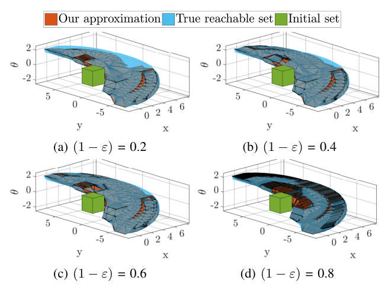
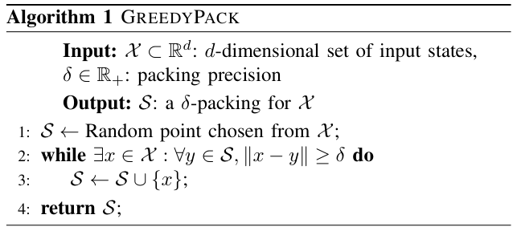
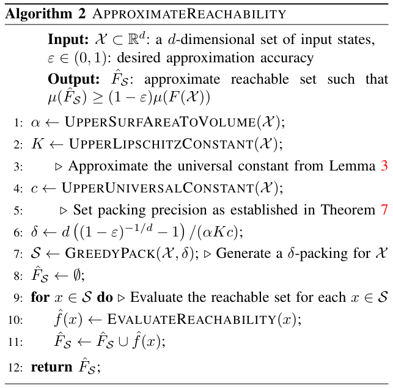
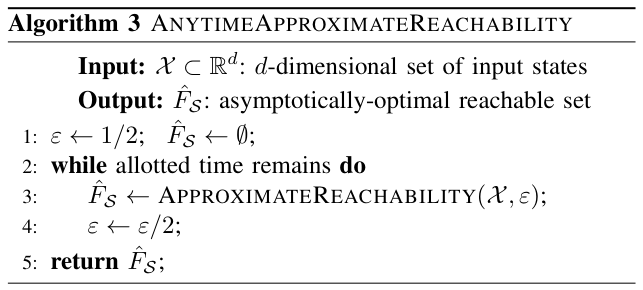
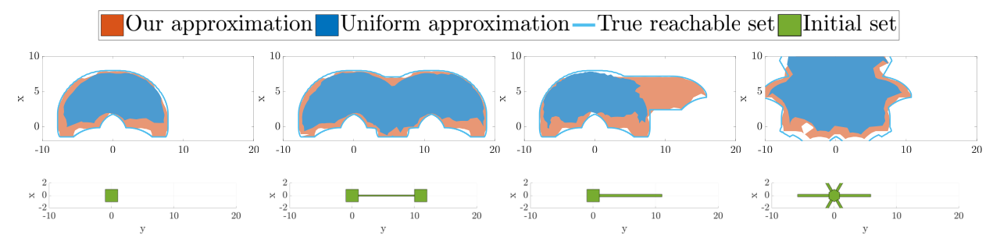
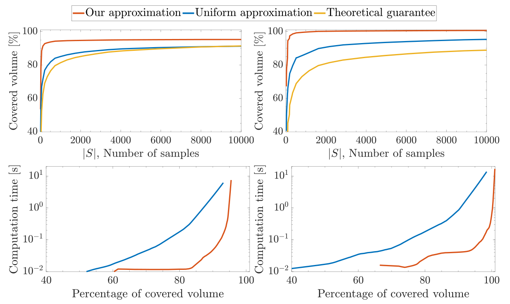
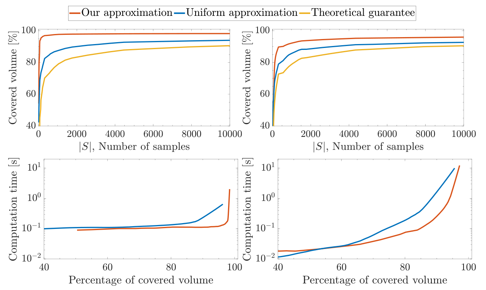

## Conversion notes

- Source version: Liebenwein, Baykal, Gilitschenski, Karaman, Rus, "Sampling-Based Approximation Algorithms for Reachability Analysis with Provable Guarantees", Robotics: Science and Systems (RSS) 2018 proceedings PDF, 10 pages, two-column.
- The authors' TeX source was not available. All mathematics (inline and displayed) was transcribed visually to LaTeX from 200-900 dpi renders of the PDF pages and checked symbol by symbol against those renders; no displayed formula had to be kept as an image. Printed equation numbers (1)-(7) are given as \tag.
- Theorem-like statements keep the printed numbering and are labelled in bold (Problem 1, Assumptions 1-3, Theorem 1, Lemmas 2-6, Theorem 7, Corollaries 8-9, Theorem 10, Proposition 11); their italic typography was dropped. Small-caps algorithm names are written in CamelCase (GreedyPack, ApproximateReachability, AnytimeApproximateReachability).
- Algorithms 1-3 are given both as image crops and as line-by-line transcriptions with the printed line numbers. Figures 1-4 are image crops; their plot contents (curves, tick values) are not transcribed. The paper has no tables.
- This proceedings version prints proofs only for Lemmas 2, 4, 5 and 6; it states that some proofs are omitted, and no proof is printed for Lemma 3, Theorem 7, Corollaries 8-9, Theorem 10 or Proposition 11. There is no appendix.
- Authors' wording and apparent misprints are transcribed as printed, not corrected. Notable cases: Corollary 8 and Theorem 10 state the bound with mu(F(S)) on the right-hand side whereas Theorem 7 and the Output line of Algorithm 2 use mu(F(X)); Algorithm 1 line 2 prints the loop condition with '>= delta' whereas the proof of Lemma 2 negates a statement with '> delta'; Section III prints 'f(x) subseteq 2^Y'; Assumption 2 prints d_H with an italic H (upright H elsewhere); the definition of m-rectifiable prints 'onto Y'; the proof of Lemma 6 prints an equality where (6) has an inclusion.
- Floats are placed next to the text that discusses them, never inside a sentence: Algorithm 1 after Section IV-A, Algorithm 2 after Section IV-B, Algorithm 3 after Section IV-C (it is printed below the first paragraphs of Section V), and Figures 2 and 3 (printed at the top of page 7, above the heading of Section VI-B) inside Section VI-B. The sub-captions (a)-(d) of Figure 1 are printed inside the figure and are repeated as text above its caption.
- In the reference list the number(s) printed after each entry are the paper's back-references to the page(s) on which the entry is cited.

<!-- PDF page 1 -->

# Sampling-Based Approximation Algorithms for Reachability Analysis with Provable Guarantees

Lucas Liebenwein$^{*}$, Cenk Baykal$^{*}$, Igor Gilitschenski, Sertac Karaman, Daniela Rus

Massachusetts Institute of Technology, USA

Emails: {lucasl, baykal, igilitschenski, sertac, rus}@mit.edu

$^{*}$These authors contributed equally to this work

## Abstract

The successful deployment of many autonomous systems in part hinges on providing rigorous guarantees on their performance and safety through a formal verification method, such as reachability analysis. In this work, we present a simple-to-implement, sampling-based algorithm for reachability analysis that is provably optimal up to any desired approximation accuracy. Our method achieves computational efficiency by judiciously sampling a finite subset of the state space and generating an approximate reachable set by conducting reachability analysis on this finite set of states. We prove that the reachable set generated by our algorithm approximates the ground-truth reachable set for any user-specified approximation accuracy. As a corollary to our main method, we introduce an asymptotically-optimal, anytime algorithm for reachability analysis. We present simulation results that reaffirm the theoretical properties of our algorithm and demonstrate its effectiveness in real-world inspired scenarios.

## I. Introduction

Autonomous and highly automated systems inherently depend on effectively incorporating rigorous guarantees on the performance and safety through formal verification and validation methods. For instance, in order to ensure collision-free paths, advanced driver-assistance systems need to be capable of anticipating all potential actions of the driver without overly conservative assumptions. This requires performing on-line reachability analysis, i.e., computation of states that these vehicles can reach within a given time interval. It can also serve as a supervisory mechanism for any motion planner that incorporates deep learning. Going beyond the realm of autonomous driving, reachability analysis has shown promise as a tool for formal verification of a wide variety of systems. Applications of reachability analysis include safety, correctness, and controller synthesis problems involving intricate specifications or robotic systems such as autonomous aircraft and cars, medical robots, and personal-assistance robots.

Typically the state of a system is not fully observable, e.g., a car might not have precise knowledge about its position. Thus, conducting accurate reachability analysis by definition requires reasoning about *all* possible trajectories from *every* possible state. Reasoning about all possible behaviors of a system renders reachability analysis computationally intractable in practice [3]. This computational challenge is further compounded by the generally large size and high complexity of the system in consideration, and the practical need to obtain verification results in a reasonably short time (i.e., seconds or minutes, not days) for the sake of, for example, real-time motion planning. These computational challenges in conjunction with the need to obtain provably valid results motivate the development of approximation schemes *with provable guarantees* for reachability analysis.

(a) $(1 - \varepsilon) = 0.2$ (b) $(1 - \varepsilon) = 0.4$ (c) $(1 - \varepsilon) = 0.6$ (d) $(1 - \varepsilon) = 0.8$

Fig. 1: (a)-(d): A $0.2$, $0.4$, $0.6$, and $0.8$-approximation respectively, of the reachable set of a unicycle car. The set of initial conditions is taken to be the unit cube around the origin.

In this paper, we consider the problem of efficiently computing the approximate forward reachable set of a continuous system, i.e., the set of states that can be reached by a safe trajectory from any of the specified initial states. Motivated by scenarios where *under*-approximations of the reachable set are desired, e.g., in the case of checking feasibility of prospective motion plans, our problem formulation considers generating provably accurate under-approximations, see Fig. 1 for an example. In particular, our work imposes minimal assumptions and is capable of handling any type of nonlinear dynamics as well as arbitrarily non-convex regions of states. In this regard, our work aims to close the research gap between the vast prior work in reachability analysis that has primarily focused on generating over-approximations.

This paper contributes the following:

1) A unified problem formulation that imposes minimal system-specific assumptions, for the provable *under-approximation* of the reachable set of a continuous set,

<!-- PDF page 2 -->

2) A simple-to-implement, sampling-based algorithm to sample sufficiently diverse initial states in order to generate a provably-accurate approximation of the target reachable set, up to any desired accuracy. Additionally, an anytime variant of our approximation algorithm that is asymptotically optimal,

3) An analysis of the proposed algorithms and their theoretical properties, including approximation accuracy and computational complexity, as a function of the desired approximation error $\varepsilon$ and system-specific variables,

4) Empirical results demonstrating the broad applicability and practical effectiveness of our algorithm on a set of real-world inspired, simulated scenarios.

## II. Related Work

Our approach to reachability analysis integrates prior work in verification, validation, and theoretical computer science. A large body of literature has been devoted to formal analysis of reachability for finite [13], continuous [6, 11], and hybrid systems [4, 28, 5, 10] with applications ranging from ensuring the safety of mobile robots in human environments to flight maneuver verification [27, 7, 22, 32, 36, 33, 24, 17, 21, 28]. Accurate reachability analysis necessitates the computation of the reachable set for every single state in an uncountable state space, which is computationally intractable in practice [34]. Therefore, a vast collection of prior work has focused on developing approximation algorithms such as finite abstractions, for the computation of approximate reachable sets.

To this end, an approach using zonotopes is presented in [2] and implemented as the CORA toolbox. Taylor flow tubes were used in Flow$^{\star}$ tool [9]. Other tools such as HyTech [23] and [12] consider only linear dynamics. In [20, 28] reachability is cast as Partial Differential Equations (PDEs) and standard tools for solving PDEs are used. However, virtually all of these tools compute over-approximations and cast the generally (highly) non-linear system dynamics as polynomials or even linear functions, which results in potentially unbounded error terms. Moreover, they are highly sensitive to the dimensionality of the input space and suffer to a great extent from the curse of dimensionality [28]. Although our algorithm also scales exponentially with dimension, it exhibits provable guarantees with respect to the generated approximate set and enables the user to specify the trade-off between accuracy and computation time allowing for near real-time computations if desired.

To overcome the computational tractability issues, the simplified version of the problem has been addressed in the context of safety, namely *falsification* [31, 11, 6]. In this case, an invariant set is fixed and the procedure generates some trajectory that exists in the set. This approach culminated in the development of frameworks such as counter-example guided abstraction refinement methods [14, 25] for safety verification and synthesis. Another falsification method for continuous and hybrid systems based on the Rapidly-exploring Random Tree (RRT) algorithm (and its variants) was proposed in [6]. Other approaches to overcome the inherit tractability issues of verification include decoupling the dynamics of the system [8], which, however, poses a strong assumption on the types of the systems that can be considered.

Previous work has also investigated verification for autonomous cars and other agents. In [3], planned driving maneuvers are verified before execution via zonotope-based approximations of the reachable set. Similarly, [18] considered safe envelopes for shared steering of a vehicle, however, the approach does not consider vehicle dynamics, but its performance heavily depends on the geometry of the environment. The work in [26] introduces a compositional verification framework for a large array of driving scenarios to verify planner constraints on a city-level scale. In [1], the coupled dynamics of vehicle platooning is investigated and verified offline. However, literally all previous works do not provide theoretical guarantee on the performance of the method.

In contrast to prior work, this paper addresses the problem of generating accurate under-approximations of reachable sets and closes the research gap in approximate reachability analysis, which has predominantly focused on computing over-approximations. Unlike prior approaches that lack theoretical guarantees on performance or impose strong assumptions on the problem, our sampling-based algorithm is simple-to-implement, imposes minimal assumptions, and is provably-optimal up to any desired approximation accuracy.

## III. Problem Definition

Consider a robot described by the dynamic system: $\dot{x} = h(x, u)$, where $x \in \mathbb{R}^d$ is the state, $u \in \mathcal{U}$ is the control signal, the set of controls $\mathcal{U} \subset \mathbb{R}^m$ is a compact set, and $h$ is a continuously differentiable function. Let $\mathbf{x}(x_0, t, u(\cdot))$ denote the robot’s state at time $t$ starting from the initial state $x_0$ and evolving under input control signal $u(t)$. Denote the set $H(x_0, T) = \{\mathbf{x}(x_0, T, u(\cdot)) \mid u(t) \in \mathcal{U}, \forall t \in [0, T]\}$.

Let $\mathcal{X} \subset \mathbb{R}^d$ denote the $d$-dimensional compact set of initial states and let $\mathcal{Y}$ denote the $d$-dimensional compact set of all reachable states. The *reachability function* $f : \mathbb{R}^d \to 2^{\mathcal{Y}}$ maps each state $x \in \mathcal{X}$ to a compact set of reachable states, $f(x) \subseteq 2^{\mathcal{Y}}$. Let $T > 0$ be the terminal time, the reachability function is $f(x) = H(x, T)$. The domain of $f$ is defined to be the entire $d$-dimensional space for convenience in our analysis, however, without loss of generality we assume that $f(z) = \emptyset \; \forall z \notin \mathcal{X}$. For any subset $\mathcal{X}' \subseteq \mathcal{X}$, define the function that represents the union of all reachable sets in $\mathcal{X}'$, $F(\mathcal{X}') = \cup_{x \in \mathcal{X}'} f(x)$ for notational brevity. Note that $F$ is monotonous, i.e., for any subset $\mathcal{X}' \subseteq \mathcal{X}$, $F(\mathcal{X}') \subseteq F(\mathcal{X})$ and that the *ground truth reachable set* is $F(\mathcal{X})$. We assume that both the state space, $\mathcal{X}$, and the ground truth reachable set, $F(\mathcal{X})$, are compact.

Our objective is to generate an approximation to $F(\mathcal{X})$ via the union of the reachable sets of a finite set $\mathcal{S} \subset \mathcal{X}$ such that $|\mathcal{S}| = n \in \mathbb{N}_+$. That is, our goal is to judiciously construct a finite set $\mathcal{S} \subset \mathcal{X}$ such that $F(\mathcal{S}) \approx F(\mathcal{X})$. We will quantify the accuracy of our approximation by comparing the volume of $F(\mathcal{S})$ to that of $F(\mathcal{X})$. More formally, let $\mu(\cdot)$ denote the Lebesgue measure, i.e., volume, of any measurable set and let $\mu(F(\mathcal{X}))$ denote the volume of the ground truth reachable set.

We formalize the reachability problem as follows.

<!-- PDF page 3 -->

**Problem 1 (Approximate Reachability Problem).** For any given $\varepsilon \in (0, 1)$, generate a finite subset $\mathcal{S} \subset \mathcal{X}$ such that

$$(1 - \varepsilon)\mu(F(\mathcal{X})) \le \mu(F(\mathcal{S})) \le \mu(F(\mathcal{X})). \tag{1}$$

## IV. Method

In this section, we present our algorithm for generating reachable sets that are provably competitive with the ground-truth reachable set to any desired accuracy. We show that our main method (Alg. 2) can easily be used as a sub-procedure to obtain an anytime, asymptotically-optimal algorithm (Alg. 3) for reachability analysis.

### A. Overview

Accurate construction of the ground-truth reachable set $F(\mathcal{X})$ requires the evaluation of the reachable set $f(x)$ for all initial states $x \in \mathcal{X}$ in the worst case. However, the set of initial states $\mathcal{X}$ is uncountably infinite, which renders straightforward evaluation of $F(\mathcal{X})$ computationally intractable. To address this challenge, we take a sampling-based approach to reachability analysis.

Our method is based on the premise that evaluating the reachability of a carefully constructed finite subset $\mathcal{S} \subset \mathcal{X}$ of the initial states can serve as an accurate approximation of the ground-truth reachable set. The crux of our approach lies in generating a set $\mathcal{S}$ containing points that are sufficiently diverse, i.e., far-apart from one another, to ensure that that the union of the reachable sets $F(\mathcal{S})$ covers as much of $F(\mathcal{X})$ as possible. To this end, we use the GreedyPack [35] algorithm (Alg. 1) to construct a $\delta$-packing for $\mathcal{X}$, i.e., a subset $\mathcal{S} \subset \mathcal{X}$ such that the minimum pairwise distances between the points in $\mathcal{S}$ is greater than $\delta$ (see Sec. V), for an appropriate $\delta > 0$.

**Algorithm 1** GreedyPack  
**Input:** $\mathcal{X} \subset \mathbb{R}^d$: $d$-dimensional set of input states, $\delta \in \mathbb{R}_+$: packing precision  
**Output:** $\mathcal{S}$: a $\delta$-packing for $\mathcal{X}$  
1: $\mathcal{S} \leftarrow$ Random point chosen from $\mathcal{X}$;  
2: **while** $\exists x \in \mathcal{X} : \forall y \in \mathcal{S}, \|x - y\| \ge \delta$ **do**  
3:     $\mathcal{S} \leftarrow \mathcal{S} \cup \{x\}$;  
4: **return** $\mathcal{S}$;

### B. Approximately-optimal Algorithm

Our algorithm for approximately-optimal reachability analysis is shown as ApproximateReachability (Alg. 2). We give an overview of our method, which follows directly from the constructive proofs presented in Sec. V. In particular, for any desired approximation accuracy $\varepsilon \in (0, 1)$, our analysis establishes an appropriate value of $\delta$ to be used in constructing the $\delta$-packing for $\mathcal{X}$. Lines 1-4 of Alg. 2 generate upper bounds on the system-specific constraints, which are then used, along with $\varepsilon$, to set the appropriate $\delta$ parameter for the packing (Line 6). The $\delta$-packing, $\mathcal{S}$, is then constructed (Line 7) and the reachability of $\mathcal{S}$ is computed and returned (Lines 8-12).

**Algorithm 2** ApproximateReachability  
**Input:** $\mathcal{X} \subset \mathbb{R}^d$: a $d$-dimensional set of input states, $\varepsilon \in (0, 1)$: desired approximation accuracy  
**Output:** $\hat{F}_{\mathcal{S}}$: approximate reachable set such that $\mu(\hat{F}_{\mathcal{S}}) \ge (1 - \varepsilon)\mu(F(\mathcal{X}))$  
1: $\alpha \leftarrow$ UpperSurfAreaToVolume$(\mathcal{X})$;  
2: $K \leftarrow$ UpperLipschitzConstant$(\mathcal{X})$;  
3:     $\triangleright$ Approximate the universal constant from Lemma 3  
4: $c \leftarrow$ UpperUniversalConstant$(\mathcal{X})$;  
5:     $\triangleright$ Set packing precision as established in Theorem 7  
6: $\delta \leftarrow d\left((1 - \varepsilon)^{-1/d} - 1\right)/(\alpha K c)$;  
7: $\mathcal{S} \leftarrow$ GreedyPack$(\mathcal{X}, \delta)$; $\triangleright$ Generate a $\delta$-packing for $\mathcal{X}$  
8: $\hat{F}_{\mathcal{S}} \leftarrow \emptyset$;  
9: **for** $x \in \mathcal{S}$ **do** $\triangleright$ Evaluate the reachable set for each $x \in \mathcal{S}$  
10:     $\hat{f}(x) \leftarrow$ EvaluateReachability$(x)$;  
11:     $\hat{F}_{\mathcal{S}} \leftarrow \hat{F}_{\mathcal{S}} \cup \hat{f}(x)$;  
12: **return** $\hat{F}_{\mathcal{S}}$;

### C. Anytime, Asymptotically-optimal Algorithm

Our anytime, asymptotically-optimal algorithm is shown as AnytimeApproximateReachability (Alg. 3). The main idea behind our algorithm is that if Alg. 2 is iteratively invoked with increasingly small values of $\varepsilon$ as input, then the generated reachable sets will converge to the ground-truth reachable set as the number of iterations $i$ tends to infinity.

**Algorithm 3** AnytimeApproximateReachability  
**Input:** $\mathcal{X} \subset \mathbb{R}^d$: $d$-dimensional set of input states  
**Output:** $\hat{F}_{\mathcal{S}}$: asymptotically-optimal reachable set  
1: $\varepsilon \leftarrow 1/2$; $\hat{F}_{\mathcal{S}} \leftarrow \emptyset$;  
2: **while** allotted time remains **do**  
3:     $\hat{F}_{\mathcal{S}} \leftarrow$ ApproximateReachability$(\mathcal{X}, \varepsilon)$;  
4:     $\varepsilon \leftarrow \varepsilon/2$;  
5: **return** $\hat{F}_{\mathcal{S}}$;

## V. Analysis

We prove under mild assumptions that for any specified error $\varepsilon \in (0, 1)$, Alg. 2 generates an approximately optimal reachable set by computing the reachable sets of only finitely many initial states. As a corollary, we prove that the anytime variant of our approximation algorithm, Alg. 3, is asymptotically optimal. For brevity, some of the proofs have been omitted from this manuscript.

The intuition behind our analysis is as follows. Assuming that the reachability function is Lipschitz continuous, we expect similar states to map to similar reachable sets.

<!-- PDF page 4 -->

Therefore, to establish a bound on the quality of our finite set generated by Alg. 1, we show that the total overlap between the reachable sets of $x \in \mathcal{S}$ and the neighboring states of $x$ is high (Lemmas 3, 4). This implies that $f(x)$ serves as a good approximation of the reachable sets of all neighboring states. By generalizing and applying this argument to all points in $\mathcal{S}$, we establish that $F(\mathcal{S})$ serves as a good approximation for the entire reachable set, given that the points are sampled sufficiently far apart from one another (Lemmas 5, 6). We conclude by establishing sufficient conditions on the constructed set $\mathcal{S}$ to ensure a $(1 - \varepsilon)$-approximation of the reachable set and analyzing the computational complexity of our algorithm (Theorems 7, 10).

### A. Preliminaries

For any measurable two sets $A, B$, let $d_{\mathrm{H}}(A, B)$ denote the Hausdorff distance [29] between $A$ and $B$, i.e.,

$$d_{\mathrm{H}}(A, B) = \max\Big\{ \sup_{a \in A} \inf_{b \in B} \|a - b\|, \ \sup_{b \in B} \inf_{a \in A} \|a - b\| \Big\},$$

where $\|\cdot\|$ denotes the Euclidean norm. Intuitively, the Hausdorff distance is the maximum length of the path from a point in one of the sets to the closest point belonging to the other set. An equivalent way to define the Hausdorff distance between compact sets $A, B$ is via a $\delta$-fattening:

$$d_{\mathrm{H}}(A, B) = \inf\{\delta \ge 0 : A \subseteq B_\delta \text{ and } B \subseteq A_\delta\},$$

where $A_\delta \subseteq \mathbb{R}^d$ denotes the $\delta$-fattening of the set $A$: $A_\delta = \cup_{a \in A} \mathcal{B}_\delta(a)$, where $\mathcal{B}_\delta(a)$ denotes the closed ball of radius $\delta$ centered at $a$ [29].

**Assumption 1 (Measure Properties of $f$).** For all states $x \in \mathcal{X}$, $f(x)$ is measurable and has non-zero measure, i.e., $\forall x \in \mathcal{X} \ \mu(f(x)) > 0$.

**Assumption 2 (Lipschitz Continuity of $f$).** There exists a Lipschitz constant $K > 0$ such that for any two states $x, y \in \mathcal{X}$, $d_H(f(x), f(y)) \le K\|x - y\|$.

A reachable set $A \subseteq \mathcal{Y}$ is said to be *$m$-rectifiable* if there exists a Lipschitz map $g : \mathbb{R}^m \to \mathcal{Y}$ onto $\mathcal{Y}$ [19, Definition 3.2.14]. Less formally, rectifiability of $A$ implies that $A$ enjoys many of the properties shared by smooth manifolds and that $A$ is in a sense a piece-wise smooth set.

**Assumption 3 (Properties of $F$).** For all subsets $\mathcal{X}' \subseteq \mathcal{X} \subseteq \mathbb{R}^d$, $F(\mathcal{X}')$ is compact and for any $\delta \ge 0$, the $\delta$-fattening of $F(\mathcal{X}')$, $F(\mathcal{X}')_\delta$, is a $(d - 1)$-rectifiable set.

Assumption 1 ensures that $f$ maps to reachable sets that have strictly positive volume. Assumption 2 guarantees that similar initial states have similar reachable sets. Finally, Assumption 3 rules out pathological problem instances, where the reachable sets may have arbitrarily large surface areas, e.g., fractals. We note that these assumptions generally hold in practical settings. In particular, dynamical systems in real-world scenarios often exhibit these kind of properties.

We will leverage properties of coverings and packings with respect to the Euclidean norm in our analysis. For $\delta > 0$, a $d$-dimensional space $A$ defining the metric space $(A, \|\cdot\|)$, a set $C = \{c_1, \ldots, c_N\} \subset B$ is said to be a $\delta$-covering of $B \subset A$ if for all $b \in B$, there exists $c \in C$ such that $\|b - c\| \le \delta$. The *covering number* of $B$, $N(B, \delta)$, is defined as the minimum cardinality of a $\delta$-covering of $B$ [35]. Under the same setting as before, $D = \{d_1, \ldots, d_M\} \subset B$ is a $\delta$-packing for $B$ if $\min_{i,j \in [M] : i \ne j} \|d_i - d_j\| > \delta$. The *packing number* of $B$, $M(B, \delta)$ is defined as the maximum cardinality of a $\delta$-packing of $B$ [35]. We present the following standard results in covering and packing numbers for completeness.

**Theorem 1 ([35, Theorem 14.2]).** For $\delta > 0$, $\mathcal{X} \subset \mathbb{R}^d$, and $C = \frac{\pi^{d/2}}{\Gamma(d/2+1)}$ the following holds:

$$\left(\frac{1}{\delta}\right)^{d} \frac{\mu(\mathcal{X})}{C} \le N(\mathcal{X}, \delta) \le M(\mathcal{X}, \delta) \le \left(\frac{2\Delta(\mathcal{X})}{\delta} + 1\right)^{d},$$

where $\Delta(\mathcal{X}) = \max_{x,y \in \mathcal{X}} \|x - y\|$ and $\Gamma(\cdot)$ is the Euler gamma function [15].

Note that in order for a $\delta$-packing for the set $\mathcal{X} \subseteq \mathbb{R}^d$ to be non-trivial, i.e., contain at least 2 points, it must be the case that $\delta \le \Delta(\mathcal{X})$. Since, if $\delta > \Delta(\mathcal{X})$, there cannot exist more than one point in the packing by definition of $\Delta(\mathcal{X}) = \max_{x,y \in \mathcal{X}} \|x - y\|$. Therefore, we henceforth will assume that we are interested in generating non-trivial packings with parameter $\delta \in (0, \Delta(\mathcal{X})]$. Our first lemma bounds the size of the points generated by GreedyPack (Alg. 1).

**Lemma 2.** Given a compact set $\mathcal{X} \subset \mathbb{R}^d$ and $\delta \in (0, \Delta(\mathcal{X})]$, GreedyPack (Alg. 1) generates a packing for $\mathcal{X}$, $\mathcal{S}$, such that

$$\left(\frac{1}{\delta}\right)^{d} \frac{\mu(\mathcal{X})}{C} \le |\mathcal{S}| \le \left(\frac{3\Delta(\mathcal{X})}{\delta}\right)^{d},$$

where $\Delta(\mathcal{X})$ and $C$ are defined as in Theorem 1.

**Proof:** By the termination condition of GreedyPack, we have the negation of the following statement $\exists x \in \mathcal{X} \ \forall y \in \mathcal{S} \ \|x - y\| > \delta$, which is $\forall x \in \mathcal{X} \ \exists y \in \mathcal{S} \ \|x - y\| \le \delta$, which implies that upon termination of the algorithm, $\mathcal{S}$ is an $\delta$-covering of $\mathcal{X}$ and thus $|\mathcal{S}| \ge N(\mathcal{X}, \delta)$. Invoking Theorem 1, we have

$$|\mathcal{S}| \ge N(\mathcal{X}, \delta) \ge \left(\frac{1}{\delta}\right)^{d} \frac{\mu(\mathcal{X})}{C}.$$

The upper bound follows by the upper bound on $M(\mathcal{X}, \delta)$ from Theorem 1 and the inequality $\delta \le \Delta(\mathcal{X})$. $\blacksquare$

### B. Analysis of Algorithms 2 and 3

For a non-empty, compact set $A \subseteq \mathbb{R}^d$, the Minkowski Content of $A$, denoted by $\lambda(\partial A)$, is defined by the Minkowski-Steiner formula [19]:

$$\lambda(\partial A) = \liminf_{\delta \to 0} \frac{\mu(A_\delta) - \mu(A)}{\delta}. \tag{2}$$

We note that for sufficiently regular sets $A$, $\lambda(\partial A)$ corresponds to the surface area of $A$ [19]. In the subsequent lemma, we establish a technical inequality that will later be used to establish the relationship between the volume of $\delta$-fattenings.

<!-- PDF page 5 -->

**Lemma 3.** Let $A \subset \mathbb{R}^d$ be a non-empty compact set with finite diameter and let $\delta \in (0, \Delta(\mathcal{X})]$. If $\mu(A) > 0$ and the $\delta$-fattening of $A$, $A_\delta$, is $(d - 1)$-rectifiable for all $\delta \in (0, \Delta(\mathcal{X})]$, then there exists a finite universal constant $c \ge 1$:

$$c = \max\{M/(d\mu(\mathcal{B}_1(\cdot))^{1/d}), 1\} < \infty,$$

where $M > 0$ is a finite constant independent of $\delta$ and $A$, such that

$$\frac{\lambda(\partial A_\delta)}{\mu(A_\delta)^{(d-1)/d}} \le \frac{c\,\lambda(\partial A)}{\mu(A)^{(d-1)/d}},$$

where $c$ is independent of $\delta$ and $A$, and $\lambda(\partial A)$ is the Minkowski Content as defined in (2).

The following Lemma quantifies the relationship between $\mu(A)$ and $\mu(A_\delta)$.

**Lemma 4.** Consider any finite, strictly positive $\delta$ and a non-empty, compact set $A \subset \mathbb{R}^d$ such that $\mu(A) > 0$ and its $\delta$-fattening, $A_\delta$, is a $(d - 1)$-rectifiable set for all $\delta \ge 0$. Then,

$$\mu(A_\delta) \le \left(1 + \frac{c\,\delta\lambda(\partial A)}{\mu(A)d}\right)^{d} \mu(A), \tag{3}$$

where $c \ge 1$ is the universal constant from Lemma 3, and $\lambda(\partial A)$ is the Minkowski Content as defined in (2).

**Proof:** Define the function $g : \mathbb{R}_{\ge 0} \to \mathbb{R}_{\ge 0}$ such that $g(x) = (\mu(A_x)/\mu(A))^{1/d}$, and let $h(\delta) : \mathbb{R}_{\ge 0} \to \mathbb{R}_{\ge 0}$ be the function defining the Minkowski Content $h(\delta) = \frac{\mu(A_\delta) - \mu(A)}{\delta}$. Observe that since $A_\delta$ is a $(d - 1)$-rectifiable set we have that the limit inferior of the expression in (2) is equivalent to its limit superior [19, Theorem 3.2.39], and thus the traditional limit exists:

$$\begin{aligned} \lambda(\partial A) &= \liminf_{\delta \to 0} \frac{\mu(A_\delta) - \mu(A)}{\delta} = \liminf_{\delta \to 0} h(\delta) \\ &= \limsup_{\delta \to 0} h(\delta) = \lim_{\delta \to 0} h(\delta). \end{aligned}$$

Let $\varepsilon > 0$ and define $\lambda' = \lambda(\partial A) + \varepsilon > \lambda(\partial A)$. By definition of $\lim_{\delta \to 0} h(\delta) = \lambda(\partial A)$, there exists an open interval defined by a constant (as a function of $\varepsilon$), $\xi(\varepsilon) > 0$ such that for all $\delta' \in (0, \xi(\varepsilon))$, $|h(\delta') - \lambda(\partial A)| < \varepsilon$. This implies that $h(\delta') < \lambda(\partial A) + \varepsilon$ and thus by definition of $h(\delta')$, we have for all $\delta' \in (0, \xi(\varepsilon))$

$$\mu(A_{\delta'}) < \mu(A) + \delta'\,(\lambda(\partial A) + \varepsilon) = \mu(A) + \delta'\,\lambda'.$$

Thus, for all $\delta' \in (0, \xi(\varepsilon))$, we have

$$\begin{aligned} g(\delta') &= \left(\frac{\mu(A_{\delta'})}{\mu(A)}\right)^{1/d} < \left(1 + \frac{\delta'\lambda'}{\mu(A)}\right)^{1/d} \le 1 + \frac{\delta'\lambda'}{\mu(A)d} \\ &\le 1 + \frac{c\delta'\lambda'}{\mu(A)d}, \end{aligned} \tag{4}$$

where the second to last inequality follows by Bernoulli’s inequality and the last inequality follows by the fact that $c \ge 1$. The inequality (4) implies that if $\delta \in (0, \xi(\varepsilon))$, then the inequality trivially holds and we are done. Therefore, we next consider the case where $\delta \in [\xi(\varepsilon), \Delta(\mathcal{X})]$.

Differentiating $g(\delta')$ with respect to $\delta'$ yields:

$$\begin{aligned} \frac{\mathrm{d}\,g(\delta')}{\mathrm{d}\delta'} &= \frac{1}{\mu(A)^{1/d}} \cdot \frac{\mathrm{d}\mu(A_{\delta'})^{1/d}}{\mathrm{d}\delta'} \\ &= \frac{\lambda(\partial A_{\delta'})}{\mu(A)^{1/d}\,\mu(A_{\delta'})^{(d-1)/d}\,d}, \end{aligned}$$

where we used the $(d - 1)$-rectifiability of $A_{\delta'}$ to replace the limit with the Minkowski Content, since the limit is ensured to exist. Moreover, note that

$$\begin{aligned} \frac{\mathrm{d}}{\mathrm{d}\delta'}\left(1 + \frac{c\delta'\lambda'}{\mu(A)d}\right) &= \frac{c\lambda'}{\mu(A)d} > \frac{c\lambda(\partial A)}{\mu(A)d} \\ &\ge \frac{1}{d\mu(A)^{1/d}} \cdot \frac{\lambda(\partial A_{\delta'})}{\mu(A_{\delta'})^{(d-1)/d}} = \frac{\mathrm{d}\,g(\delta')}{\mathrm{d}\delta'}, \end{aligned}$$

where the inequality follows from Lemma 3.

Thus, we have that for all $\delta' \in (0, \Delta(\mathcal{X})]$, $g(\delta')$ grows not faster than does the expression on the right-hand side of the inequality in (4). This observation combined with the fact that the inequality holds for all values of $\delta' \in (0, \xi(\varepsilon))$ implies that for all $\delta' \in (0, \Delta(\mathcal{X})]$, inequality (4) holds and thus we have also have for the originally specified $\delta$ that $g(\delta) \le 1 + \frac{c\delta\lambda'}{\mu(A)d}$. Finally, taking the limit of both sides of this inequality yields

$$\begin{aligned} g(\delta) = \lim_{\lambda' \to \lambda(\partial A)} g(\delta) &\le \lim_{\lambda' \to \lambda(\partial A)} \left(1 + \frac{c\,\lambda(\partial A)\delta}{\mu(A)d}\right) \\ &= 1 + \frac{c\,\delta\lambda(\partial A)}{\mu(A)d}, \end{aligned}$$

and the lemma follows by definition of $g(\delta)$. $\blacksquare$

For our subsequent results, we assume that a $\delta$-packing for $\mathcal{X}$, $\mathcal{S} \subset \mathcal{X}$, is generated by GreedyPack (Alg. 1) for a predefined constant $\delta \in (0, \Delta(\mathcal{X})]$. We now employ Lemma 4 to establish the amount of overlap.

**Lemma 5.** For all $x \in \mathcal{S}$, it follows that

$$f(x) \subseteq F(\mathcal{B}_\delta(x)) \subseteq f(x)_{\delta K}, \tag{5}$$

where $f(x)_{\delta K}$ is the $(\delta K)$-fattening of $f(x)$, $\delta > 0$ is the constant used to construct $\mathcal{S}$, and $K$ is the Lipschitz constant from Assumption 2.

**Proof:** By definition of $\mathcal{B}_\delta(x)$ and by Assumption 2, it follows that for all $y \in \mathcal{B}_\delta(x)$,

$$d_{\mathrm{H}}(f(x), f(y)) \le K\|x - y\| \le K\delta.$$

We have that $x \in \mathcal{B}_\delta(x)$, $f(x) \subseteq F(\mathcal{B}_\delta(x))$, and $f(x)$ is compact. Moreover for all $f(y)$, $y \in \mathcal{B}_\delta(x)$, $f(y)$ is also compact. Thus, it follows by definition of Hausdorff distance that the $(\delta K)$-fattening of $f(x)$, $f(x)_{\delta K}$ fully contains $f(y)$, i.e., $f(y) \subseteq f(x)_{\delta K}$. Since this holds for all $y \in \mathcal{B}_\delta(x)$, we have by definition of Hausdorff distance

$$d_{\mathrm{H}}(f(x), \cup_{y \in \mathcal{B}_\delta(x)} f(y)) = d_{\mathrm{H}}(f(x), F(\mathcal{B}_\delta(x))) \le \delta K.$$

The lemma then follows by definition of Hausdorff distance in terms of $(\delta K)$-fattenings. $\blacksquare$

<!-- PDF page 6 -->

**Lemma 6.** Suppose that the set $\mathcal{S} \subset \mathcal{X} \subseteq \mathbb{R}^d$ is constructed as previously described. Then, it follows that for all $x \in \mathcal{S}$

$$F(\mathcal{X}) = \cup_{x \in \mathcal{S}} F(\mathcal{B}_\delta(x)) \subseteq \cup_{x \in \mathcal{S}} f(x)_{\delta K} = F(\mathcal{S})_{\delta K}, \tag{6}$$

where $f(x)_{\delta K}$ is the $(\delta K)$-fattening of $f(x)$, $F(\mathcal{S})_{\delta K}$ is the $(\delta K)$-fattening of $F(\mathcal{S})$, $\delta > 0$ is the constant used to construct $\mathcal{S}$, and $K$ is the Lipschitz constant from Assumption 2.

**Proof:** Observe that since $\mathcal{S}$ is a $\delta$-covering of $\mathcal{X}$, it follows that union of $|\mathcal{S}|$ balls of radius $\delta$ centered at each of points of $x \in \mathcal{S}$ forms a superset of $\mathcal{X}$. Recall by definition of the reachability function, $\forall x \notin \mathcal{X}, f(x) = \emptyset$. This enables us to conveniently deal with evaluation of points outside the domain of initial states, $\mathcal{X}$.

Now, consider $F(\mathcal{X})$ and note that by definition of $f$ on input outside the domain of $\mathcal{X}$, we have

$$F(\mathcal{X}) = F\left(\cup_{x \in \mathcal{S}} \cup_{y \in \mathcal{B}_\delta(x)} y\right) = \cup_{x \in \mathcal{S}} F(\mathcal{B}_\delta(x)).$$

By Lemma 5, it follows that for any arbitrary $x \in \mathcal{S}$, $F(\mathcal{B}_\delta(x)) \subseteq f(x)_{\delta K}$. Taking the union over all $x \in \mathcal{S}$ on both sides, we obtain $\cup_{x \in \mathcal{S}} F(\mathcal{B}_\delta(x)) = \cup_{x \in \mathcal{S}} f(x)_{\delta K}$, and the lemma follows from the fact that $\cup_{x \in \mathcal{S}} f(x)_{\delta K} = F(\mathcal{S})_{\delta K}$. $\blacksquare$

**Theorem 7.** Given any $\varepsilon \in (0, 1)$ consider the $\delta$-packing of $\mathcal{X}$, $\mathcal{S} \subset \mathcal{X} \subseteq \mathbb{R}^d$, generated by GreedyPack (Alg. 1) with parameter $\delta > 0$ satisfying

$$\delta \le \frac{d((1 - \varepsilon)^{-1/d} - 1)}{\alpha K c},$$

where $\alpha = \sup_{\mathcal{X}' \subseteq \mathcal{X}} \frac{\lambda(\partial F(\mathcal{X}'))}{\mu(F(\mathcal{X}'))} < \infty$, and $c$ is the universal constant from Lemma 3: $c = \max\{M/(d\mu(\mathcal{B}_1(\cdot))^{1/d}), 1\}$. Then, $\mathcal{S}$ solves the approximate reachability problem defined by (1), i.e., $(1 - \varepsilon)\mu(F(\mathcal{X})) \le \mu(F(\mathcal{S})) \le \mu(F(\mathcal{X}))$.

The following corollary follows immediately from the theorem established above.

**Corollary 8.** Given a set of initial states $\mathcal{X} \subseteq \mathbb{R}^d$ and $\varepsilon \in (0, 1)$, ApproximateReachability (Alg. 2) generates a reachable set $\hat{F}_{\mathcal{S}}$ such that $\mu(\hat{F}_{\mathcal{S}}) \ge (1 - \varepsilon)\mu(F(\mathcal{S}))$.

**Corollary 9.** For all $\varepsilon \in (0, 1)$, the reachability problem defined by (1) can be solved by a $\delta$-packing, $\mathcal{S} \subset \mathcal{X}$ of size at most $|\mathcal{S}| \le (3\alpha K\Delta(\mathcal{X})c/\varepsilon)^{d}$.

Let $\mathcal{C}_\alpha$, $\mathcal{C}_K$, and $\mathcal{C}_c$ denote the computational complexity of approximating the system-specific constants $\alpha$ (ratio of surface area to volume), $K$ (Lipschitz constant), and $c$ (universal constant from Lemma 3) respectively. Also let $\mathcal{C}_{\mathcal{S}}$ and $\mathcal{C}_f$ be upper bounds on the computational complexity of generating the $\delta$-packing $\mathcal{S}$ and evaluating $f(x)$ for any $x \in \mathcal{X}$, respectively. Application of Corollary 9 yields the following theorem.

**Theorem 10.** Given a set of initial states $\mathcal{X} \subseteq \mathbb{R}^d$ and $\varepsilon \in (0, 1)$, ApproximateReachability (Alg. 2) generates a reachable set $\hat{F}_{\mathcal{S}}$ such that $\mu(\hat{F}_{\mathcal{S}}) \ge (1 - \varepsilon)\mu(F(\mathcal{S}))$, in $\mathcal{O}\left(\mathcal{C}_\alpha + \mathcal{C}_K + \mathcal{C}_c + \mathcal{C}_{\mathcal{S}} + (\alpha K\Delta(\mathcal{X})c/\varepsilon)^{d}\,\mathcal{C}_f\right)$ time.

Define the sequence $(\mathcal{F}_i)_{i \in \mathbb{N}_+}$ such that for each $i \in \mathbb{N}_+$, $\mathcal{F}_i$ denotes the approximate reachable set $\hat{F}_{\mathcal{S}_i}$ generated at iteration $i$ of Alg. 3, i.e., $\mathcal{F}_i = \hat{F}_{\mathcal{S}_i}$, where, $\mathcal{S}_i \subset \mathcal{X}$ is the packing generated at iteration $i$.

**Proposition 11.** The AnytimeApproximateReachability algorithm (Alg. 3) is asymptotically-optimal, i.e., $\lim_{i \to \infty} \mu(\mathcal{F}_i) = \lim_{i \to \infty} \mu(\hat{F}_{\mathcal{S}_i}) = \mu(F(\mathcal{X}))$.

## VI. Results

We apply our approximation algorithm to simulated scenarios with a diverse set of initial states (see Fig. 2), where the objective is to generate the reachable set of a unicycle model. We evaluate the performance of our algorithm and compare the generated reachable sets to the ground truth reachable set, which can be readily computed for a unicycle model [16]. We show that the theoretical guarantees hold and compare the performance of our algorithm with that of uniform sampling. We implemented our reachability algorithm in MATLAB. The simulations were conducted on a PC with a 2.60 GHz Intel i9-7980XE processor (single core) and 128 GB RAM.

### A. Experimental Setup

We consider the reachable set $F(\cdot)$ of a mobile robot described by the unicycle dynamics:

$$\frac{\mathrm{d}}{\mathrm{dt}} \begin{pmatrix} x \\ y \\ \theta \end{pmatrix} = \begin{pmatrix} u_v \cos\theta \\ u_v \sin\theta \\ u_\omega \end{pmatrix}, \tag{7}$$

where $x, y \in \mathbb{R}$ denote the position of the robot and $\theta \in \mathbb{R}$ the orientation, and the control inputs $(u_v, u_\omega) \in \mathcal{U} \subset \mathbb{R}^2$ of the system are given by the speed and angular velocity, respectively. We are interested in the reachable set $F(\mathcal{X})$, where $\mathcal{X} \in \mathbb{R}^3$ denotes the set of initial conditions for which we want to approximate the reachable set at a given time $T$.

We note that the reachable set for a unicycle model with minimal turning radius $\rho$ and velocity $u_v$ is known [16, 30] and that the boundary of the set can be described by a set of curves consisting of straight segments (S) as well as left turns (L) and right turns (R) at the maximum turning radius. In particular, the reachable set consists of the curves RLR, LRL, RSR, LSL, RSL, and LSR. As an exemplary parametrization for these curves, we give the parametrization for the curve RSL:

$$\begin{pmatrix} x_{RSL} \\ y_{RSL} \\ \theta_{RSL} \end{pmatrix} = \rho \begin{pmatrix} 2\sin(\theta_1) + \theta_2\cos(\theta_1) - \sin(\theta_1 - \theta_3) \\ -1 + 2\cos(\theta_1) - \theta_2\sin(\theta_1) - \cos(\theta_1 - \theta_3) \\ \theta_1/\rho - \theta_2/\rho \end{pmatrix},$$

where $\theta_i = \frac{u_v t_i}{\rho}, \forall i \in \{1, 2, 3\}$ and $t_1$ denotes the time in segment R, $t_2$ in segment S, and $t_3$ in segment L, respectively. Note that $t_1 + t_2 + t_3 \le T$, where $T$ is the given time as before, and this solution can be shown to be extended for a range of velocities $u_v \in [v_{min}, v_{max}]$, [30].

Using the unicycle model allows us to compare the algorithm to the ground truth reachable set in an exact manner.

<!-- PDF page 7 -->

### B. Evaluation of Computed Reachable Sets

We evaluated the performance of our algorithm and uniform sampling against a set of diverse initial states: (i) unit cube, (ii) dumbbell, (iii) lollipop, and (iv) hedgehog. To increase the efficiency of our implementation, we replaced the random construction of a $\delta$-covering by a grid construction. The terminal time $T$ was taken to be $1$ second.

Fig. 2: Left-to-right: Set of initial conditions and the resulting reachable set for the unit cube, dumbbell, lollipop, and hedgehog scenarios. We compare the reachable sets of uniform sampling, our algorithm, and the ground truth. The visualizations show that uniform sampling initial states performs poorly when the set of initial states has an uneven distribution of volume.

Fig. 3: Comparisons of the performance of our algorithm with that of uniform sampling for the unit cube scenario (first column) and the dumbbell scenario (second column). The corresponding scenarios are depicted in the first and second column of Fig. 2, respectively.

Fig. 2 depicts the projections onto $(x, y)$ of the four sets of considered initial conditions, the respective reachable sets computed by uniform sampling and our algorithm, and the ground truth sets. The visualizations of the computed reachable sets show that uniform sampling may be a reasonable approximation for convex sets such as the unit cube, but its performance suffers significantly when non-convex sets, with non-uniformly distributed volumes are considered, such as the dumbbell or lollipop. Unlike uniform sampling, our algorithm still generates highly accurate reachable sets when evaluated against scenarios with non-uniform and/or non-convex initial states, which underlines the significance of judiciously generating a structured set of points as is done by our algorithm. Similar scenarios might arise in real-world situations, where dynamic obstacles are present that constrain the reachable space to non-convex, irregular regions.

<!-- PDF page 8 -->

Fig. 4: The performance of the evaluated reachability analysis methods for the lollipop scenario (first column) and the hedgehog scenario (second column). The evaluated scenarios are shown in the third and fourth column of Fig. 2, respectively.

To quantify the quality of the generated reachable sets, we ran our algorithm and uniform sampling against each scenario and averaged the results over 10 trials. Fig. 3 depicts the performance of uniform sampling and our algorithm in computing approximate reachable sets for the unit cube and dumbbell scenarios. Our results indicate that our algorithm is capable of generating higher quality approximations of the reachable set with a fewer amount of samples when compared to uniform sampling. Fig. 4 shows the results of evaluation against the lollipop and hedgehog scenarios with respect to volumetric coverage of the reachable set and the computation time. Since the sets of initial states exhibit highly non-uniform distribution of volume and are non-convex, we once again observe the significant gap in performance of uniform sampling when compared to the quality of approximations generated by our algorithm.

We note that across all experiments, our theoretical bounds of volumetric coverage hold and that the computation time required by our algorithm is significantly less than that required by uniform sampling for the same approximation accuracy. In particular, we note that the computation time required to generate the reachable set of the sampled subset ($\delta$-packing) is near real-time. Our algorithm’s favorable performance with respect to both approximation quality and computational efficiency on a wide variety of scenarios and non-convex initial states highlights its applicability to real-world motion planning and decision-making problems of autonomous systems.

## VII. Conclusion

We presented a sampling-based approach to reachability analysis that imposes minimal assumptions and can be applied to a wide variety of systems. Our algorithm enables computational efficiency by computing the reachable set of a carefully constructed finite subset of initial states that provides a covering of the entire state space. We proved that our algorithm generates an approximation to the ground-truth reachable set that is approximately optimal up to any desired approximation accuracy.

Our favorable results in real-world inspired scenarios validate the favorable theoretical properties of our algorithm and demonstrate its applicability to a diverse set of reachability problems. We envision that our method can be used to conduct reachability analysis to facilitate decision-making and trajectory planning for autonomous agents in a wide variety of application including autonomous driving, parallel autonomy, and supervision of deep learning-based planning systems. In future work, we plan to extend our algorithm and analysis to obtain both under- and over-approximations of reachable sets with provable guarantees.

## Acknowledgments

This research was supported in part by the Toyota Research Institute (TRI) and National Science Foundation award IIS-1723943. This article solely reflects the opinions and conclusions of its authors, and not TRI or any other Toyota entity.

<!-- PDF page 9 -->

## References

[1] A. Alam, A. Gattami, K. H. Johansson, and C. J. Tomlin. Guaranteeing safety for heavy duty vehicle platooning: Safe set computations and experimental evaluations. *Control Engineering Practice*, 24:33–41, 2014. 2

[2] M. Althoff. An introduction to CORA 2015. In *Workshop on Applied Verification for Continuous and Hybrid Systems*, 2015. 2

[3] M. Althoff and J. M. Dolan. Online Verification of Automated Road Vehicles Using Reachability Analysis. *IEEE Transactions on Robotics*, 30(4):903–918, 2014. 1, 2

[4] R. Alur, C. Courcoubetis, N. Halbwachs, T.A. Henzinger, P.-H. Ho, X. Nicollin, A. Olivero, J. Sifakis, and S. Yovine. The Algorithmic Analysis of Hybrid Systems. *Theoretical Computer Science*, 138(1):3–34, 1995. 2

[5] R. Alur, T. Dang, and F. Ivančić. Predicate Abstraction for Reachability Analysis of Hybrid Systems. *ACM Transactions on Embedded Computing Systems (TECS)*, 5(1):152–199, 2006. 2

[6] A. Bhatia and E. Frazzoli. Incremental Search Methods for Reachability Analysis of Continuous and Hybrid Systems. In *International Workshop on Hybrid Systems: Computation and Control*, 2004. 2

[7] D. Bresolin, L. Geretti, R. Muradore, P. Fiorini, and T. Villa. Verification of Robotic Surgery Tasks by Reachability Analysis: A Comparison of Tools. In *Euromicro Conference on Digital System Design*, 2014. 2

[8] M. Chen and C. J. Tomlin. Exact and efficient hamilton-jacobi reachability for decoupled systems. In *Decision and Control (CDC), 2015 IEEE 54th Annual Conference on*, pages 1297–1303. IEEE, 2015. 2

[9] X. Chen, E. Ábrahám, and S. Sankaranarayanan. Flow*: An Analyzer for Non-Linear Hybrid Systems. In *International Conference on Computer Aided Verification*, 2013. 2

[10] X. Chen, S. Schupp, I.B. Makhlouf, E. Ábrahám, G. Frehse, and S. Kowalewski. A Benchmark Suite for Hybrid Systems Reachability Analysis. In *NASA Formal Methods Symposium*, 2015. 2

[11] P. Cheng and V. Kumar. Sampling-based Falsification and Verification of Controllers for Continuous Dynamic Systems. *The International Journal of Robotics Research*, 27(11-12):1232–1245, 2008. 2

[12] A. Chutinan and B.H. Krogh. Verification of Polyhedral-Invariant Hybrid Automata Using Polygonal Flow Pipe Approximations. In *International workshop on hybrid systems: computation and control*, 1999. 2

[13] E. Clarke, O. Grumberg, and D. Long. Verification Tools for Finite-State Concurrent Systems. In *Workshop/School/Symposium of the REX Project (Research and Education in Concurrent Systems)*, 1993. 2

[14] E. Clarke, O. Grumberg, S. Jha, Y. Lu, and H. Veith. Counterexample-Guided Abstraction Refinement. In *International Conference on Computer Aided Verification*, 2000. 2

[15] P.J. Davis. Leonhard Euler’s Integral: A Historical Profile of the Gamma Function. *The American Mathematical Monthly*, 66(10):849–869, 1959. 4

[16] L. E. Dubins. On Curves of Minimal Length with a Constraint on Average Curvature, and with Prescribed Initial and Terminal Positions and Tangents. *American Journal of Mathematics*, 79(3):497–516, 1957. 6

[17] K. Edelberg, D. Wai, J. Reid, E. Kulczycki, and P. Backes. Workspace and Reachability Analysis of a Robotic Arm for Sample Cache Retrieval from a Mars Rover. In *AIAA SPACE Conference and Exposition*, 2015. 2

[18] S. M. Erlien, S. Fujita, and J. C. Gerdes. Shared steering control using safe envelopes for obstacle avoidance and vehicle stability. *IEEE Transactions on Intelligent Transportation Systems*, 17(2):441–451, 2016. 2

[19] H. Federer. *Geometric Measure Theory*. Springer, 1969. 4, 5

[20] J. F. Fisac, M. Chen, C. J. Tomlin, and S. S. Sastry. Reach-avoid problems with time-varying dynamics, targets and constraints. In *Proceedings of the 18th international conference on hybrid systems: computation and control*, pages 11–20. ACM, 2015. 2

[21] R. Geraerts and M.H. Overmars. Reachability Analysis of Sampling Based Planners. In *Robotics and Automation (ICRA)*, 2005. 2

[22] J.H. Gillula, G.M. Hoffmann, H. Huang, M.P. Vitus, and C.J. Tomlin. Applications of Hybrid Reachability Analysis to Robotic Aerial Vehicles. *The International Journal of Robotics Research*, 30(3):335–354, 2011. 2

[23] T.A. Henzinger, P.-H. Ho, and H. Wong-Toi. HyTech: A Model Checker for Hybrid Systems. *International Journal on Software Tools for Technology Transfer*, 1(1-2):110–122, 1997. 2

[24] F. Immler. Verified Reachability Analysis of Continuous Systems. In *International Conference on Tools and Algorithms for the Construction and Analysis of Systems (TACAS)*, 2015. 2

[25] J. Kapinski, J.V. Deshmukh, S. Sankaranarayanan, and N. Arechiga. Simulation-guided Lyapunov Analysis for Hybrid Dynamical Systems. In *Proceedings of the International Conference on Hybrid Systems: Computation and Control*, 2014. 2

[26] L. Liebenwein, W. Schwarting, C.-I. Vasile, J. DeCastro, J. Alonso-Mora, S. Karaman, and D. Rus. Compositional and contract-based verification for autonomous driving on road networks. 2017. 2

[27] S.B. Liu, H. Roehm, C. Heinzemann, I. Lütkebohle, J. Oehlerking, and M. Althoff. Provably Safe Motion of Mobile Robots in Human Environments. In *IEEE/RSJ International Conference on Intelligent Robots and Systems*, 2017. 2

[28] I. M. Mitchell, A. M. Bayen, and C. J. Tomlin. A Time-Dependent Hamilton-Jacobi Formulation of Reachable Sets for Continuous Dynamic Games. *Transactions on

<!-- PDF page 10 -->

Automatic Control*, 50(7):947–957, 2005. 2

[29] J. Munkres. *Topology*. Pearson Education, 2014. 4

[30] V. S. Patsko, S. G. Pyatko, and A. A. Fedotov. Three-dimensional reachability set for a nonlinear control system. *Journal of Computer and Systems Sciences International*, 42(3):320–328, 2003. 6

[31] E. Plaku, L.E. Kavraki, and M.Y. Vardi. Falsification of LTL Safety Properties in Hybrid Systems. In *International Conference on Tools and Algorithms for the Construction and Analysis of Systems*, 2009. 2

[32] O. Porges, R. Lampariello, J. Artigas, A. Wedler, C. Borst, and M. A. Roa. Reachability and Dexterity: Analysis and Applications for Space Robotics. In *Workshop on Advanced Space Technologies for Robotics and Automation (ASTRA)*, 2015. 2

[33] H. Seraji. Reachability Analysis for Base Placement in Mobile Manipulators. *Journal of Field Robotics*, 12(1):29–43, 1995. 2

[34] P. Tabuada. *Verification and control of hybrid systems: a symbolic approach*. Springer Science & Business Media, 2009. 2

[35] Y. Wu. Yale ECE598, Lecture Notes: Information-Theoretic Methods in High-Dimensional Statistics, March 2016. URL http://www.stat.yale.edu/~yw562/teaching/598/lec14.pdf. 3, 4

[36] Z. Xue and R. Dillmann. Efficient Grasp Planning with Reachability Analysis. In *International Conference on Intelligent Robotics and Applications*, 2010. 2
