## Conversion notes

- Source version: the PMLR proceedings PDF. A. Tebjou, G. Frehse, F. Chamroukhi, 'Data-driven Reachability using Christoffel Functions and Conformal Prediction', Proceedings of Machine Learning Research vol. 204, Conformal and Probabilistic Prediction with Applications (COPA 2023), editors H. Papadopoulos, K. A. Nguyen, H. Boström and L. Carlsson. 20 pages, single column. The page banner prints 'Proceedings of Machine Learning Research 204:1–20, 2023' and the pages are numbered 1-20; the paper is cited with the volume pagination 194-213, which is not printed in the PDF. The banner, the running headers and the page numbers are omitted from the text.
- Mathematics was transcribed to LaTeX from the authors' TeX source of the arXiv version (arXiv:2309.08976v1, main.tex), with the jmlr class macros expanded to standard LaTeX, and every formula was checked against the PMLR PDF on 170 dpi page renders and 230-260 dpi crops. The arXiv TeX is not the source of the PMLR PDF; where they differ the PDF is followed. Differences found: (i) the PDF prints the transition function as a displayed formula, f : R^n -> R^n, at the start of Section 2; the arXiv TeX has no formula for f at that place (it reads 'by a transition function which maps a state ...'); (ii) the PDF prints theorem-like headers in bold without a colon and theorem/example bodies in italics, whereas the preamble of the arXiv TeX asks for small-caps headers with a colon and upright bodies; (iii) floats are placed differently. No other difference in the wording or in any formula was found. No formula is kept as an image.
- Printed equation numbers are (1) to (14) and are given with `\tag{n}`; all other displays are unnumbered in the paper. Bold italic symbols (vectors x, y, alpha, and v_d in Section 2.1 and in the moment-matrix integral) are written with `\boldsymbol`, upright bold symbols (M, and v_d from equation (1) on) with `\mathbf`, as printed. Slanted fractions are written with a slash: the interval (0, 1/2) in Theorem 4 and the exponent 1/N in the output line of Algorithm 1. Percentages are written outside math mode. 'N = 10 000' in Example 1 is printed with a thin space and written 10000.
- The PDF underlines emphasised terms (the authors load the ulem package); they are written in italics, as are the venue titles in the references. Theorem-like blocks: the label is given in bold exactly as printed (no punctuation after it); the italic type of the bodies is not reproduced. Where each block ends: Conjecture 1 ends with the sentence 'If N >= ... then P(mu(S-hat) >= 1 - epsilon) >= 1 - delta.'; Example 1 ends directly before the heading of Section 3; Theorem 2 ends with display (8); Theorem 3 with display (9); Theorem 4 with display (12); Example 2 ends with '... is greater than 99%.' directly before the heading of Section 3.2; Example 3 ends directly before the heading of Section 4; Theorem 5 ends with display (14) (the sentence 'This bound is tight ...' is outside the theorem); Example 4 ends with '... 98.9% confidence.'. Each of the three proofs ends with a filled square.
- Reading order differs from the page order of the PDF in the following places, so that floats do not interrupt sentences: Figure 1 (printed at the top of PDF page 7, inside Section 3) follows Example 1 in Section 2.3; Algorithm 1 (PDF page 10) follows the proof of Theorem 4 and precedes Example 2, as in the TeX source; the text of Example 2 (PDF pages 9 and 11) is joined and Figures 2 and 3 (PDF pages 10 and 11) follow it; Figure 4 follows Example 3; Table 1 follows the paragraph that introduces it and Figure 5 follows Example 4; Algorithm 2 (printed at the top of PDF page 15, after the heading of Section 5) is at the end of Section 4; Table 2 and Figure 6 (PDF page 16) follow the third paragraph of Section 5.1; Figures 7 and 8 (PDF page 17) are at the end of Section 5.1; Figure 9 (PDF page 18) is at the end of Section 5.2. Footnote 1 (printed at the foot of PDF page 4) is placed directly after equation (1). The copyright line from the foot of the first page is placed after the editor line.
- Algorithms 1 and 2 are given as image crops (assets/figure/algorithm-1.jpg, algorithm-2.jpg) followed by text transcriptions, one paragraph per step. Figures 1-9 are image crops; the sub-captions printed under the panels ('(a) d = 3, epsilon = 0.085', ...) are inside the crops and are repeated as the first line of each caption. Tables 1 and 2 are CSV files with a Markdown copy in the text. Table 1: the printed header 'confidence in %' spans the four epsilon columns and is repeated as a prefix in each of these column names. Table 2: the columns |D|, |D_train|, |D_cal| (printed with a calligraphic D) are filled only in the first row of each block and in the last row; the cells below are printed empty or with vertical dots and are transcribed as printed, not forward-filled; they mean the values of the first row of the block (10000 / 8000 / 2000 for the first seven rows, 1000 / 800 / 200 for the next seven).
- The text and formulas are kept as printed. The following are in the source and are not conversion errors: 'Table 4' in the paragraph after the proof of Theorem 5 refers to the table printed as Table 1; 'Figure 9 illustrates how ...' in Section 5.1 describes what Figures 7 and 8 show (Figure 9 is the Duffing figure); 'For fixed d and n -> infinity' (twice) in Section 2.3, where the sample size N is evidently meant; 'in these sense of'; the thresholds 'b_1, ..., b_n' and the event 'U_(N) <= b_n' in and before Theorem 2 next to b_N; the region with subscript D instead of D_cal in the conditional probability before Theorem 2 and in step 2(c) of Algorithm 2; 'U_N' without parentheses in the proofs of Theorems 3 and 4; the product written with a capital Pi; 'Combing (10) and (11)'; 'The reduces the cost'; the subscripts 'inlier', 'oulier', 'outlier', 'inliers' and the variables 'V_i, ..., V_{N-p}' in the proof of Theorem 5; 'otherwise. .' in Algorithm 2; 'provides ... and proposed' and 'compared that the most relevant approaches' in the Conclusion; plain italic S and S-hat (instead of calligraphic) in Example 1 and in the note under Table 2; epsilon printed in two shapes (`\epsilon` in the text, `\varepsilon` in figure sub-captions, in the captions of Figures 1 and 9 and once in Example 1).
- Reviewer's numerical checks (not part of the paper), made by recomputing printed numbers from the transcribed formulas. Algorithm 1 / Theorem 4 with delta = 0.01: 1 - delta^(1/N) is 0.0023 for N = 2000, 0.0228 for N = 200 and 0.0046 for N = 1000; the paper prints 0.002, 0.02 and 0.45% in the examples and 0.2, 2.2 and 0.5 (in %) in Table 2. Example 4: equation (14) as printed with N = 500, p = 50, epsilon = 0.15 gives 0.9897, matching the printed 98.9%. Table 1: equation (14) as printed (sum from i = p+1) with p = 0.05 N gives 18.1 / 33.9 / 50.9 / 92.2 for N = 100, 6.9 / 34.6 / 71.2 / 99.99 for N = 500, 2.3 / 32.1 / 81.2 / 100.0 for N = 1000 and 0.3 / 27.8 / 90.6 / 100.0 for N = 2000, which are not the printed entries; the printed entries coincide, after truncation, with the same sum started at i = p (33.1 / 51.8 / 68.1 / 96.7, 10.2 / 42.5 / 77.7 / 99.99, 3.2 / 37.5 / 84.8 / 100.0, 0.41 / 31.4 / 92.2 / 100.0). Figure 1: with N = 10000, delta = 0.01 and n = 2 the bound of Conjecture 1 requires about 10488, 10335, 9938 and 10489 samples for the printed pairs (d, epsilon) = (3, 0.085), (6, 0.23), (10, 0.51), (15, 0.9), consistent with epsilon rounded to two digits.

<!-- PDF page 1 -->

# Data-driven Reachability using Christoffel Functions and Conformal Prediction

**Abdelmouaiz Tebjou** (abdelmouaiz.tebjou@irt-systemx.fr)
IRT SystemX, 2 boulevard Thomas Gobert, 91120 Palaiseau, France.
U2IS, ENSTA Paris, Institut Polytechnique de Paris, Palaiseau, France.

**Goran Frehse** (goran.frehse@ensta-paris.fr)
U2IS, ENSTA Paris, Institut Polytechnique de Paris, Palaiseau, France.

**Faïcel Chamroukhi** (faicel.chamroukhi@irt-systemx.fr)
IRT SystemX, 2 boulevard Thomas Gobert, 91120 Palaiseau, France.

**Editor:** Harris Papadopoulos, Khuong An Nguyen, Henrik Boström and Lars Carlsson

© 2023 A. Tebjou, G. Frehse & F. Chamroukhi.

## Abstract

An important mathematical tool in the analysis of dynamical systems is the approximation of the reach set, i.e., the set of states reachable after a given time from a given initial state. This set is difficult to compute for complex systems even if the system dynamics are known and given by a system of ordinary differential equations with known coefficients. In practice, parameters are often unknown and mathematical models difficult to obtain. Data-based approaches are promised to avoid these difficulties by estimating the reach set based on a sample of states. If a model is available, this training set can be obtained through numerical simulation. In the absence of a model, real-life observations can be used instead. A recently proposed approach for data-based reach set approximation uses Christoffel functions to approximate the reach set. Under certain assumptions, the approximation is guaranteed to converge to the true solution. In this paper, we improve upon these results by notably improving the sample efficiency and relaxing some of the assumptions by exploiting statistical guarantees from conformal prediction with training and calibration sets. In addition, we exploit an incremental way to compute the Christoffel function to avoid the calibration set while maintaining the statistical convergence guarantees. Furthermore, our approach is robust to outliers in the training and calibration set.

**Keywords:** data-driven reachability, Christoffel functions, conformal prediction, probably approximately correct analysis, statistical learning

## 1. Introduction

The problem of reach set approximation arises in different branches of applied mathematics and computer science, and in particular in control theory. In mathematics, the study of initial value problems and their guaranteed solution raises the question of which states can be reached under different configurations; see, for instance the work of Berz and Makino (1998). In computer science, the computation of reach sets is a fundamental operation in formal methods, which establish the correctness of a system with mathematical rigor. Initially, it was applied to program analysis, e.g., by Halbwachs et al. (1994). Later, the approach was extended to cyber-physical systems, which can involve interacting physical components, software, and communication channels, see Alur (2015). Reach set approximations may take different forms based on whether the focus is on scalability, tightness,

<!-- PDF page 2 -->

or efficient computability. Examples include polyhedra, ellipsoids, polynomial zonotopes, and others; see the overview by Althoff et al. (2021). In this paper, we establish reach set approximations that are sublevel sets of polynomials, more precisely, sum-of-squares (SOS) polynomials, which are computationally advantageous. Once established, these can readily be used to investigate properties of regions of attraction, stability, and safety or to solve optimization problems. To achieve this, polynomial reach set approximations have been used as barrier certificates, inductive invariants, or Lyapunov functions; see the survey by Doyen et al. (2018).

Traditionally, reach set approximations are established from first principles, starting from a mathematical model of the dynamics. This approach is limited to cases where sufficiently simple models are available and precise enough. More recently, data-based approaches have been used to deal with systems whose dynamics are too complex or where a model is not available and only observations are at hand. In the following, we provide a brief overview of such approaches.

**Related Work** The traditional approach to go from data to reach set approximations is to first identify a model of the system dynamics and then analyse the model. To give an example, a linear model can be identified efficiently by subspace identification as proposed by Van Overschee and De Moor (2012) and then one of the set-based techniques in the survey by Althoff et al. (2021) can be applied to approximate the reach set at a given time in the future. This can be extended to uncertain linear models and nonlinear systems based on linearization, as pursued by Alanwar et al. (2023). More recently, it has been proposed to derive reach set approximations more directly from data, e.g., the approach of Djeumou et al. (2021) uses Taylor series expansions and Lipschitz bounds to derive reach sets for nonlinear systems. These approaches can, in principle, bound the reach set over an arbitrary time horizon, but the approximation error may increase very rapidly with time. Furthermore, these approaches struggle with complex dynamics.

Our goal in this paper is different and more modest: We establish an SOS polynomial whose sublevel set contains the reachable set in the sense of a *probably approximately correct* (PAC) property. In particular, we consider the approximation of a single time step. This is sufficient for many of the applications considered above (as a first step in constructing barrier certificates, inductive invariants etc.), but in contrast to the approaches cited in the beginning of this section, it does not readily extend to extrapolating the reach set over longer time horizons (it would involve costly quantifier elimination).

One of the earliest data-driven approaches involving SOS polynomials was the construction of barrier certificates by Prajna (2006), e.g., to show that obstacles are avoided by a control system. The scalability was later improved by Han et al. (2015), but the optimisation problem remains somewhat challenging. Approximating the reach set is related to approximating the support of a probability measure, as observed by Devonport et al. (2021). Recent work by Lasserre and Pauwels (2019); Lasserre (2022) suggests that Christoffel functions are particularly useful for approximating the support. Our work is heavily inspired by Devonport et al. (2021), who proposed to approximate the one-step reach set with an SOS polynomial that is the superlevel set of the Christoffel function. The PAC guarantees provided by Devonport et al. (2021) are derived from measure theory and are, in practise, somewhat conservative. Based on conformal prediction, we propose significant improve

<!-- PDF page 3 -->

ments that we outline below. Further work on conformal prediction will be cited in the text.

**Contributions** In this paper, we make the following contributions:

- We use conformal prediction to provide stronger and more sample-efficient guarantees on reach set approximation than those given by Devonport et al. (2021).

- We propose a version of reach set approximation that is robust to outliers, in contrast to the approach of Devonport et al. (2021).

- We exploit an incremental form of the Christoffel function for transductive conformal prediction, thanks to which we don’t need to split the data set into training and calibration sets.

- To the best of our knowledge, this is the first use of the Christoffel function in conformal prediction. The particular properties of the Christoffel function in set and density approximation make it an excellent candidate for a nonconformity function.

**Structure of the paper** The paper is organized as follows. Section 2 presents the data-driven framework for reachability analysis using Christoffel functions. It describes the theoretical developments related to the reach set approximation and to Christoffel functions. In Section 3, we introduce our proposed approach to the reach set approximation with conformal prediction, whose statistical guarantees are presented in Section 3.1. Section 3.2 presents a technique to avoid the calibration set by using transductive conformal prediction and an incremental version of the Christoffel function. In Section 4, we discuss the robustness of our methodology to outliers. Section 5 provides numerical experiments on simulated data to support our theoretical results, and to highlight the effectiveness and potential of the proposed approach.

## 2. Data-driven Reach Set Approximation with Christoffel Functions

Reachability analysis aims to determine the possible future states of a dynamical system starting from a given initial state. For our purposes, we consider the system to be defined (explicitly or implicitly) by a transition function

$$
f : \mathbb{R}^n \rightarrow \mathbb{R}^n,
$$

which maps a state $\boldsymbol{x} \in \mathbb{R}^{n}$ to its successor state. We forego extending the notation to nondeterministic or stochastic systems, since our focus is on estimating the image of $f$ applied to a set of initial states; in the case of a stochastic system we are interested in approximating the support of the image distribution. Beginning with a given initial set of states $\mathcal{I}$, we are interested in computing the *reachable set*

$$
\mathcal{S} = \{ f(\boldsymbol{x}) : \boldsymbol{x} \in \mathcal{I} \}.
$$

When $f$ is not precisely known or complex, obtaining the exact solution may not be possible or economical. Instead, we compute an approximation $\hat{\mathcal{S}}$ that covers most of $\mathcal{S}$. Every set $S$ can be represented by a probability measure $\mu$ such as $S$ is the support of $\mu$. This motivated Devonport et al. (2021) to use the Christoffel function to approximate the set $\mathcal{S}$. In the following subsection, we introduce the Christoffel function, its empirical counterpart, and discuss how to compute it.

<!-- PDF page 4 -->

### 2.1. Preliminaries

We start by introducing some mathematical notation. Given a vector $\boldsymbol{x} \in \mathbb{R}^n$, we denote its elements as $\boldsymbol{x} = (x_1,...,x_n)$. An integer coefficient vector $\boldsymbol{\alpha} = (\alpha_1,...,\alpha_n) \in \mathbb{N}^n$ defines the monomial $\boldsymbol{x}^{\boldsymbol{\alpha}} = x_1^{\alpha_1} \times x_2^{\alpha_2} ... \times x_n^{\alpha_n}$. For $d \in \mathbb{N}$, we consider $\mathbb{R}[\boldsymbol{X}]_d^n$ to be the vector space of n-variate polynomials whose degree is less or equal to $d$. With each coefficient vector $\boldsymbol{\alpha} \in \mathbb{N}^n$, we associate the monomial $\boldsymbol{x}^{\boldsymbol{\alpha}}$ whose degree is equal to $\| \boldsymbol{\alpha} \| = \sum_{i=1}^{n} \boldsymbol{\alpha}_i$. The monomials $\boldsymbol{x}^{\boldsymbol{\alpha}}$ with $\| \boldsymbol{\alpha} \| \leq d$ form a canonical basis of $\mathbb{R}[\boldsymbol{X}]_d^n$. We denote the number of monomials of degree less or equal to $d$ with

$$
s(d) = \binom{n+d}{n}.
$$

Let $\boldsymbol{v}_d(\boldsymbol{x}) \in \mathbb{R}^{s(d)}$ be the vector of monomials of degree less or equal to d evaluated at $\boldsymbol{x}$. For example, if $d = 2$ and $n = 2$, then $\boldsymbol{v}_{d}(\boldsymbol{x}) = [ 1 \ x_1 \ x_2 \ x_{1}x_{2} \ x_{1}^2 \ x_{2}^2 ]$.

### 2.2. Christoffel Functions

Christoffel functions are a class of functions associated with a finite measure and a parameter degree $d \in \mathbb{N}$. They have a strong connection to approximation theory and in this section we briefly summarize some results by Lasserre and Pauwels (2019). For a finite measure $\mu$ on $\mathbb{R}^{n}$ and an integer degree $d$, the *Christoffel function* $\Lambda_{\mu, d}(\boldsymbol{x}) : \mathbb{R}^n \mapsto \mathbb{R}$ is defined in terms of the *moment matrix* of the measure $\mu$:

$$
\mathbf{M}_d = \int_{\mathbb{R}^{n}} \boldsymbol{v}_{d}(\boldsymbol{x}) \boldsymbol{v}_{d}(\boldsymbol{x})^{\top} d\mu(\boldsymbol{x}).
$$

The moment matrix is semi-definite positive for all $d \in \mathbb{N}$. We furthermore assume that the matrix is positive definite, which ensures the invertibility of $M_d$.$^{1}$ With the help of the moment matrix, the Christoffel function is defined as :

$$
\Lambda_{\mu, d}(\boldsymbol{x}) = \Bigl( \mathbf{v}_{d}(\boldsymbol{x})^{T} \mathbf{M}_{d}^{-1} \mathbf{v}_{d}(\boldsymbol{x}) \Bigr)^{-1}. \tag{1}
$$

Footnote 1: In fact, the moment matrix of any finite measure $\mu$ is definite positive unless the support of $\mu$ is contained in the zeros of a polynomial; for a closer look at the moment matrix, we refer the reader to Lasserre and Pauwels (2019).

The following alternative formulation of the Christoffel function can be useful when the moment matrix is large. It can be computed by solving a convex quadratic programming problem, which can be done efficiently using numerical techniques, even for high degrees $d$:

$$
\Lambda_{\mu, d}(\boldsymbol{x}) = \inf_{P \in \mathbb{R}[\boldsymbol{X}]_d^n} \left\{ \int_{\mathbb{R}^{n}} P(\mathbf{z})^{2} d\mu(\mathbf{z}), \quad \text{s.t.} \quad P(\mathbf{x}) = 1 \right\}
$$

In a data-driven setting, the exact measure $\mu$ is unknown. One way to obtain information about $\mu$ is by sampling a set of points independently drawn from its distribution. For every $N \in \mathbb{N}$, when disposing of $N$ i.i.d samples $\{ \boldsymbol{x}^{1}, \ldots, \boldsymbol{x}^{N} \}$ from $\mu$, we approximate $\mu$ with the *empirical measure*

$$
\hat{\mu} = \tfrac{1}{N} {\sum}_{i=1}^{N} \delta_{\boldsymbol{x}^i},
$$

<!-- PDF page 5 -->

where $\delta_{\boldsymbol{x}}$ is the Dirac measure. The moment matrix $\widehat{\mathbf{M}}_d$ associated with the empirical measure $\hat{\mu}$ is

$$
\widehat{\mathbf{M}}_d = \tfrac{1}{N} {\sum}_{i=1}^{N} \mathbf{v}_{d}(\mathbf{x^{i}}) \mathbf{v}_{d}(\mathbf{x^{i}})^{T} \tag{2}
$$

Therefore, the empirical measure $\hat{\mu}$ defines an empirical Christoffel function. Since we are only interested in superlevel sets of the Christoffel function, we can forego the inversion and instead work with sublevel sets of what we call the empirical *Christoffel polynomial*:

$$
\Lambda^{-1}_{\hat{\mu}, d}(\boldsymbol{x}) = \mathbf{v}_{d}(\boldsymbol{x})^{T} \widehat{\mathbf{M}_{d}}^{-1} \mathbf{v}_{d}(\boldsymbol{x}) \tag{3}
$$

Note that the moment matrix $\widehat{\mathbf{M}}_d$ is almost surely invertible if the number of samples $N \geq s(d)$. The Christoffel polynomial is a sum-of-squares polynomial of degree $2d$. Consequently, it is nonnegative, and if $N > s(d)$, the empirical Christoffel polynomial is strictly positive. Note that, for increasing sample size $N$, the empirical Christoffel function converges uniformly to the Christoffel function of the exact measure.

### 2.3. Set Approximation with Christoffel Functions

Lasserre and Pauwels (2019) proposed various thresholding schemes for approximating the support of a probability measure using the Christoffel function or, more precisely, its empirical counterpart. This idea was applied by Devonport et al. (2021) to approximate the reachable set $\mathcal{S}$ with the superlevel sets of the Christoffel function. In this section, we will briefly summarize the approach.

Let $\mu$ be the probability measure of the reachable set $\mathcal{S}$. For a given degree $d \in \mathbb{N}$, the reachable set can be approximated with the sublevel set

$$
\hat{\mathcal{S}} = \{ \boldsymbol{x} \in \mathbb{R}^{n} \mid \Lambda^{-1}_{\mu, d}(\boldsymbol{x}) \leq \alpha \} \tag{4}
$$

for some $\alpha \in \mathbb{R}$. However, since the exactly reachable set $\mathcal{S}$ is unknown, $\mu$ is unknown. Instead, the Christoffel function $\Lambda_{\mu, d}$ is approximated by an empirical Christoffel function using i.i.d generated samples $\boldsymbol{x^{i}}$ from $\mathcal{S}$. We can obtain a conservative threshold $\alpha$ such that $\boldsymbol{x^{i}} \subseteq \hat{\mathcal{S}}$ by letting

$$
\alpha = \max_i \Lambda^{-1}_{\hat{\mu}, d}(\boldsymbol{x}^{i}). \tag{5}
$$

Using methods from statistical learning theory, Devonport et al. (2021) proposed the following PAC guarantees:

**Conjecture 1 (Thm. 1 in Devonport et al. (2021))** Given a training set of i.i.d samples $\mathcal{D} = \{ \boldsymbol{x}^1, \ldots, \boldsymbol{x}^N \}$ from $\mathcal{S}$, let

$$
\hat{\mathcal{S}} = \{ \boldsymbol{x} \in \mathbb{R}^{n} \mid \Lambda^{-1}_{\hat{\mu}, d}(\boldsymbol{x}) \leq \max_i \Lambda^{-1}_{\hat{\mu}, d}(\boldsymbol{x}^{i}) \}. \tag{6}
$$

If $N \geq \frac{5}{\epsilon} \left( \log \frac{4}{\delta} + \binom{n+2d}{n} \log \frac{40}{\epsilon} \right)$, then $\mathbb{P}\Bigl( \mu\bigl( \hat{\mathcal{S}} \bigr) \geq 1-\epsilon \Bigr) \geq 1-\delta.$

In other words, if $N, \delta, \epsilon$ satisfy the condition in Conjecture 1, then with probability bigger than $1-\delta$ we are sure that $\hat{\mathcal{S}}$ contains more than $1-\epsilon$ of the mass of $\mathcal{S}$. However, we believe this result neglects the dependencies between the empirical Christoffel polynomial and the

<!-- PDF page 6 -->

points used to construct the threshold $\alpha$. As will be discussed in more detail in Section 3, different samples should be used for constructing the empirical Christoffel polynomial and for constructing the threshold $\alpha$ to ensure independence.

We informally note convergence results by Lasserre and Pauwels (2019), which hold for uniform probability measures (and some generalizations):

- As $d \rightarrow \infty$ and with an appropriately chosen threshold, the sublevel set of the (non-empirical) Christoffel polynomial converges to the support of the measure, i.e., to the exact reach set in these sense of a Hausdorff distance.

- For fixed $d$ and $n \rightarrow \infty$, the empirical Christoffel function converges uniformly to the Christoffel function.

- For fixed $d$ and $n \rightarrow \infty$, the border of the empirical Christoffel polynomial converges to the border of the Christoffel polynomial in these sense of a Hausdorff distance.

In consequence, we can informally expect that for a large enough degree $d$ and large enough sample size $N$, the sublevel sets of the Christoffel polynomial are close enough to the reachable set.

We will use the following running example throughout the paper to illustrate the different concepts.

**Example 1 (Four squares)** Let the transition function $f : \mathbb{R}^2 \rightarrow \mathbb{R}^2$ be

$$
f(x,y) = (1 + sign(x) \cdot x^2, 1 + sign(y) \cdot y^2)
$$

and let the initial set be $\mathcal{I} = [-1,1]^2$. The reachable set consists of four squares, i.e.,

$$
\mathcal{S} = [-3,-1]^2 \cup [-3,-1] \times [1,3] \cup [1,3] \times [-3,-1] \cup [1,3]^2.
$$

Figure 1 shows the reach set approximation given by (6), for a sample of size $N = 10000$ and different degrees $d$. The caption includes the corresponding uncertainty bound $\varepsilon$ for confidence $1-\delta = 0.99$ obtained by Conjecture 1.

We observe that, as intended by construction, all samples are included in $\hat{S}$. For increasing degrees, $\hat{S}$ becomes more precise. However, the uncertainty in the covered probability mass $\epsilon$, increases substantially. Indeed, the bound $\epsilon$ seems rather conservative since, in all instances, $\hat{S}$ covers nearly 100% of $S$.

## 3. Reach Set Approximation with Conformal Prediction

Following the reasoning of Section 2, we can expect a sublevel of the Christoffel polynomial to converge to the support of the distribution. Intuitively, the Christoffel polynomial takes high values where the density is low and low values where the density is high, which makes it a good candidate for a nonconformity function.

In this section, we briefly recall relevant results from conformal prediction and instantiate them to the special case of estimating the support of distribution, which in our setting is equivalent to approximating the reach set $\mathcal{S}$.

<!-- PDF page 7 -->

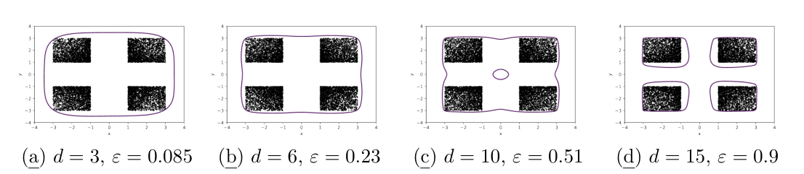

(a) $d = 3$, $\varepsilon = 0.085$ (b) $d = 6$, $\varepsilon = 0.23$ (c) $d = 10$, $\varepsilon = 0.51$ (d) $d = 15$, $\varepsilon = 0.9$

Figure 1: Reach set approximation $\hat{S}$ for Example 1, using the sublevel set of the empirical Christoffel polynomial in (6) (purple outline) on a sample of size $N = 10000$ (black dots), for different degrees $d$ and corresponding uncertainty bound $\varepsilon$, according to Conjecture 1.

Let $r : \mathbb{R}^n \rightarrow \mathbb{R}$ be a non-conformity function. Given a sample $\mathcal{D} = \bigl\{ \boldsymbol{x}^{1}, \ldots, \boldsymbol{x}^{N} \bigr\}$, the $p$-value at $\boldsymbol{x}$ is

$$
p_{value}(\boldsymbol{x}) = \tfrac{1}{N} \Bigl| \bigl\{\ i \bigm| r(\boldsymbol{x}^i) \geq r(\boldsymbol{x}) \;\bigr\} \Bigr|
$$

For $i \in \{0, ..., N\}$, the conformal region is defined as

$$
C_{\mathcal{D}}^{\frac{i}{N}} = \Bigl\{ \boldsymbol{x} \in \mathbb{R}^n \Bigm| p_{value}(\boldsymbol{x}) \geq \tfrac{i}{N} \Bigr\}
$$

According to conformal prediction theory, see Shafer and Vovk (2008); Angelopoulos and Bates (2021), a new i.i.d sample $\boldsymbol{x}^{N+1}$ satisfies

$$
\mathbb{P}\left( \boldsymbol{x}^{N+1} \in C_{\mathcal{D}}^{\frac{i}{N}} \right) \geq 1 - \tfrac{i+1}{N+1}. \tag{7}
$$

Note that in (7), the set $\mathcal{D}$ is also subject to randomness. In other words, (7) stands on average only if the set $\mathcal{D}$ is re-sampled for each $\boldsymbol{x}^{N+1}$. However, in reachability analysis and data-driven applications more generally, we may be restricted to a single, fixed data set $\mathcal{D}$. Therefore, we need to take into account the probability on the left hand side of (7), conditioned on the sample $\mathcal{D}$.

### 3.1. Statistical Guarantees

In this section, we ensure statistical independence between the nonconformity function $r$ and the set $\mathcal{D}$ by splitting it into a training set $\mathcal{D}_{\mathrm{train}}$ and a calibration set $\mathcal{D}_{\mathrm{cal}}$. The use of distinct sets of samples from the same measurement (i.e., a training set and a calibration set) is essential to ensure the independence of the samples used for computing the p-values and conformal regions from the nonconformity function, which is computed based on the training set, see Angelopoulos and Bates (2021) and Bates et al. (2023). This is a special case of conformal prediction called split conformal prediction or inductive conformal prediction. The computational advantage of this method lies in its requirement to fit the model only once. However, this comes at the cost of statistical efficiency as the method necessitates the division of the data into separate, and therefore smaller, training and calibration data sets.

<!-- PDF page 8 -->

A smaller calibration set increases the coverage error, while a smaller training set reduces the tightness of the approximation. An alternative to this trade-off will be examined in section 3.2. Here, we use the training set for computing the empirical Christoffel polynomial, while the calibration set is used to compute the conformal region. This will lead to bounds on the conditional probability

$$
\mathbb{P}\Bigl( \boldsymbol{x}^{N+1} \in C_{\mathcal{D}}^{\frac{i}{N}}\ \Bigm| \mathcal{D}_{\mathrm{cal}} \Bigr).
$$

Note that the theorems in this section apply to any choice of nonconformity function. The following theorem provides PAC guarantees for conformal regions that are defined with suitably chosen probability thresholds $b_1, \ldots, b_n$. We will afterwards propose values for $b_1, \ldots, b_n$ that correspond to the special case of set approximation.

**Theorem 2 (Thm. 4 from Bates et al. (2023))** Consider $N$ uniform random samples $U_1, \ldots, U_N \stackrel{\text{i.i.d.}}{\sim} \operatorname{Unif}\bigl([0,1]\bigr)$, with order statistics $U_{(1)} \leq U_{(2)} \leq \ldots \leq U_{(N)}$, and fix any $\delta \in (0,1)$. Suppose $0 \leq b_1 \leq b_2 \leq \ldots \leq b_N \leq 1$ are reals such that

$$
\mathbb{P}\left[ U_{(1)} \leq b_1, \ldots, U_{(N)} \leq b_n \right] \geq 1-\delta.
$$

Let also $b_0 = 0$. Then for any i.i.d vector $\boldsymbol{x}$ sampled from $\mu$:

$$
\mathbb{P}\left[ \mathbb{P}\Bigl( \boldsymbol{x} \in C_{\mathcal{D}_{\mathrm{cal}}}^{\frac{i}{N}} \Bigm| \mathcal{D}_{\mathrm{cal}} \Bigr) \geq 1 - b_i \right] \geq 1-\delta \tag{8}
$$

We propose an analogous, theorem to bound the conditional probability from above.

**Theorem 3** Under the assumptions of Thm. 2, suppose further that the nonconformity function $r(\boldsymbol{x})$ is continuous, the measure $\mu$ is continuous, and that $\alpha$ is a real such that

$$
\mathbb{P}\bigl( U_{(N)} \leq \alpha \bigr) \geq 1-\delta.
$$

Then for any i.i.d vector $\boldsymbol{x}$ sampled from $\mu$:

$$
\mathbb{P}\left[ \mathbb{P}\Bigl( \boldsymbol{x} \in C_{\mathcal{D}_{\mathrm{cal}}}^{\frac{1}{N}} \Bigm| \mathcal{D}_{\mathrm{cal}} \Bigr) \leq \alpha \right] \geq 1-\delta \tag{9}
$$

**Proof** Under the assumptions, $r(\boldsymbol{x})$ has a continuous distribution. Let $F_{\mu}$ be the cumulative distribution function of $r(\boldsymbol{x})$. Since $r(\boldsymbol{x})$ has a continuous distribution, $F_{\mu}(r(\boldsymbol{x}))$ follows $\operatorname{Unif}([0,1])$ and $F_{\mu}(r(\boldsymbol{x}^1)), F_{\mu}(r(\boldsymbol{x}^2)), ..., F_{\mu}(r(\boldsymbol{x}^N))$ all follow $\operatorname{Unif}([0,1])$. Without loss of generality, we assume $r(\boldsymbol{x}^1) \leq r(\boldsymbol{x}^2) \leq ... \leq r(\boldsymbol{x}^N)$. Letting $U_N = F_{\mu}(r(\boldsymbol{x}^N))$, we obtain

$$
\mathbb{P}\Bigl[ F_{\mu}(r(\boldsymbol{x}^N)) \leq \alpha \Bigr] \geq 1-\delta.
$$

Considering $\boldsymbol{x}$ sampled i.i.d from $\mu$, we get

$$
\mathbb{P}\Bigl( \boldsymbol{x} \in C_{\mathcal{D}_{\mathrm{cal}}}^{\frac{1}{N}} \Bigm| \mathcal{D}_{\mathrm{cal}} \Bigr) = \mathbb{P}\Bigl( r(\boldsymbol{x}) \leq r(\boldsymbol{x}^N) \Bigm| \mathcal{D}_{\mathrm{cal}} \Bigr) = F_{\mu}\Bigl( r(\boldsymbol{x}^N) \Bigr)
$$

Combining the latter two results, we obtain (9). $\blacksquare$

We now use the results of Thm. 2 and Thm. 3 to provide a guarantee on the accuracy of approximated reachable set $\hat{\mathcal{S}}$ in Algorithm 1. Note that Thm. 3 requires the nonconformity function to be continuous, which is the case for the empirical Christoffel polynomial.

<!-- PDF page 9 -->

**Theorem 4** Suppose that the nonconformity function $r(\boldsymbol{x})$ is continuous. $\forall \delta \in (0,1),$

$$
\mathbb{P}\left[ \mu\left( C_{\mathcal{D}_{\mathrm{cal}}}^{\frac{1}{N}} \right) \geq \exp\left( \frac{\log(\delta)}{N} \right) \right] \geq 1-\delta, \tag{10}
$$

If the measure $\mu$ is continuous, then

$$
\mathbb{P}\left[ \exp\left( \frac{\log(1-\delta)}{N} \right) \geq \mu\left( C_{\mathcal{D}_{\mathrm{cal}}}^{\frac{1}{N}} \right) \right] \geq 1-\delta, \tag{11}
$$

Combining these results, we obtain $\forall \delta \in (0, 1/2)$:

$$
\mathbb{P}\left[ \exp\left( \frac{\log(1-\delta)}{N} \right) \geq \mu\left( C_{\mathcal{D}_{\mathrm{cal}}}^{\frac{1}{N}} \right) \geq \exp\left( \frac{\log(\delta)}{N} \right) \right] \geq 1-2\delta. \tag{12}
$$

**Proof** We instantiate Theorem 2 for a particular choice of $b_1 \ldots, b_N$. Since we are interested in the support of the measure, we take $b_1$ as the smallest possible value and set the other values $b_2 \ldots, b_N = 1$. To satisfy the conditions of Theorem 2, we first show the following intermediate result: Let $U_1, \ldots, U_N \stackrel{\text{i.i.d.}}{\sim} \operatorname{Unif}([0,1])$, with order statistics $U_{(1)} \leq U_{(2)} \leq \ldots \leq U_{(N)}$. Fixing $b_1 = 1 - \delta^{\frac{1}{N}}$ and $b_2 = .... = b_N = 1$, it is straightforward that

$$
\mathbb{P}\left( U_{(1)} \leq b_1, \ldots, U_{N} \leq b_N \right) = \mathbb{P}\left( U_{(1)} \leq b_1 \right) = 1 - \mathbb{P}\left( U_{(1)} \geq b_1 \right).
$$

Since $U_{(1)}$ is the smallest of the random variables, $U_1, \ldots, U_N$, $\mathbb{P}\left( U_{(1)} \geq b_1 \right)$ is equivalent to all of the $U_i$ being greater or equal to $b_1$:

$$
1 - \mathbb{P}\left( U_{(1)} \geq b_1 \right) = 1 - \Pi_{i=1}^N \mathbb{P}\left( U_{i} \geq b_1 \right) = 1 - (1 - b_1)^N = 1-\delta.
$$

Applying the above in Theorem 2, we obtain

$$
\mathbb{P}\left[ \mathbb{P}\Bigl( \boldsymbol{x} \in C_{\mathcal{D}_{\mathrm{cal}}}^{\frac{1}{N}} \Bigm| \mathcal{D}_{\mathrm{cal}} \Bigr) \geq \exp\left( \frac{\log(\delta)}{N} \right) \right] \geq 1-\delta.
$$

As $\mu\left( C_{\mathcal{D}_{\mathrm{cal}}}^{\frac{1}{N}} \right) = \mathbb{P}\left[ \boldsymbol{x} \in C_{\mathcal{D}_{\mathrm{cal}}}^{\frac{1}{N}} \mid \mathcal{D}_{\mathrm{cal}} \right]$ we obtain the result in (10).

Fixing $\alpha = \exp\left( \frac{\log(1-\delta)}{N} \right)$, we have $\mathbb{P}\left[ U_{N} \leq \alpha \right] = \alpha^N = 1-\delta$, since $U_{(N)} \leq \alpha$ means all $U_{i}$ have to be lower than $\alpha$. Substituting the above value of $\alpha$ in Theorem 3, we obtain the result in (11). Combing (10) and (11), we obtain the result in (12). $\blacksquare$

**Example 2** We illustrate Algorithm 1 on the running Example 1. We take $M = 10000$ i.i.d samples from the reachable set $\mathcal{S}$ by sampling uniformly $M$ i.i.d samples in $\mathcal{I}$, which we then split into a calibration set of size $N = 2000$ and a training set of size $M-N$. Figure 2 shows the approximated reachable set produced by Algorithm 1 for various degrees $d$. Theorem 4 guarantees that with confidence $1-\delta =$ 99%, the coverage error $\epsilon$ is lower than $\epsilon \leq 0.002$. Notably, in contrast to the algorithm presented in Devonport et al. (2021), this guarantee is independent of the dimension of the samples $n$ and the degree of the empirical

<!-- PDF page 10 -->

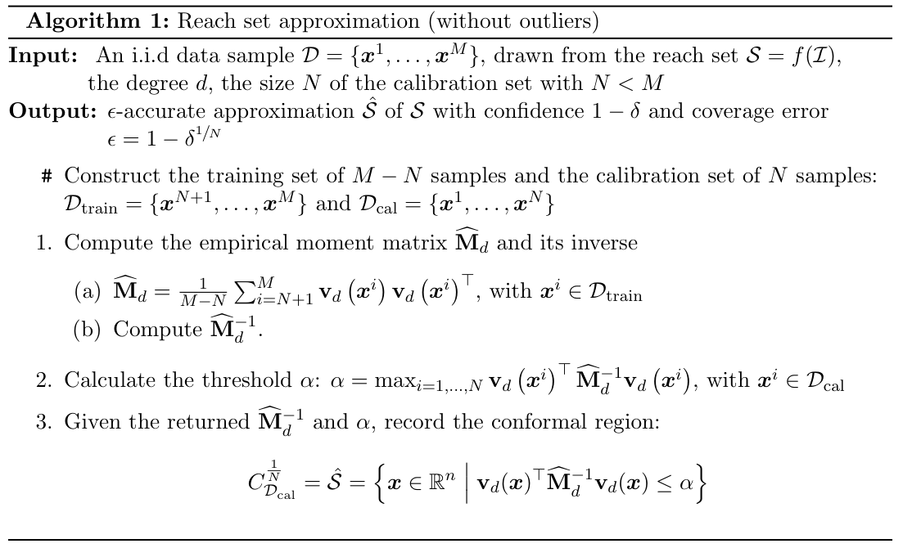

**Algorithm 1:** Reach set approximation (without outliers)

**Input:** An i.i.d data sample $\mathcal{D} = \{\boldsymbol{x}^{1}, \ldots, \boldsymbol{x}^{M}\}$, drawn from the reach set $\mathcal{S} = f(\mathcal{I})$, the degree $d$, the size $N$ of the calibration set with $N < M$

**Output:** $\epsilon$-accurate approximation $\hat{\mathcal{S}}$ of $\mathcal{S}$ with confidence $1-\delta$ and coverage error $\epsilon = 1 - \delta^{1/N}$

`#` Construct the training set of $M-N$ samples and the calibration set of $N$ samples: $\mathcal{D}_{\mathrm{train}} = \{\boldsymbol{x}^{N+1}, \ldots, \boldsymbol{x}^{M}\}$ and $\mathcal{D}_{\mathrm{cal}} = \{\boldsymbol{x}^{1}, \ldots, \boldsymbol{x}^{N}\}$

1. Compute the empirical moment matrix $\widehat{\mathbf{M}}_d$ and its inverse

&emsp;&emsp;(a) $\widehat{\mathbf{M}}_d = \frac{1}{M-N} \sum_{i=N+1}^{M} \mathbf{v}_{d}\left(\boldsymbol{x}^{i}\right) \mathbf{v}_{d}\left(\boldsymbol{x}^{i}\right)^{\top}$, with $\boldsymbol{x}^{i} \in \mathcal{D}_{\mathrm{train}}$

&emsp;&emsp;(b) Compute $\widehat{\mathbf{M}}^{-1}_d$.

2. Calculate the threshold $\alpha$: $\alpha = \max_{i=1,\ldots,N} \mathbf{v}_{d}\left(\boldsymbol{x}^{i}\right)^{\top} \widehat{\mathbf{M}}^{-1}_d \mathbf{v}_{d}\left(\boldsymbol{x}^{i}\right)$, with $\boldsymbol{x}^{i} \in \mathcal{D}_{\mathrm{cal}}$

3. Given the returned $\widehat{\mathbf{M}}^{-1}_d$ and $\alpha$, record the conformal region:

$$
C_{\mathcal{D}_{\mathrm{cal}}}^{\frac{1}{N}} = \hat{\mathcal{S}} = \Bigl\{ \boldsymbol{x} \in \mathbb{R}^{n} \Bigm| \mathbf{v}_{d}(\boldsymbol{x})^{\top} \widehat{\mathbf{M}}^{-1}_d \mathbf{v}_{d}(\boldsymbol{x}) \leq \alpha \Bigr\}
$$

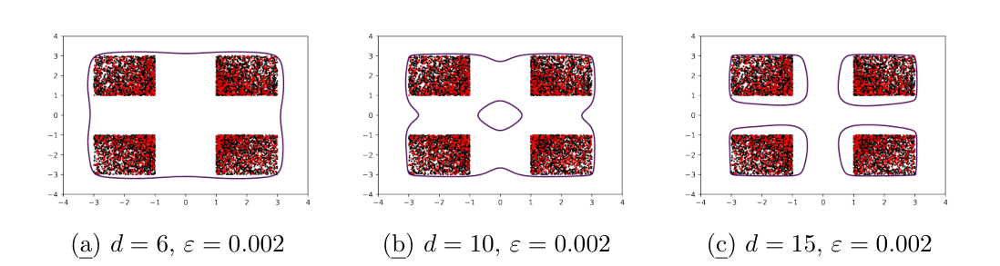

(a) $d = 6$, $\varepsilon = 0.002$ (b) $d = 10$, $\varepsilon = 0.002$ (c) $d = 15$, $\varepsilon = 0.002$

Figure 2: Reach set approximations (outlined in purple) from Example 2, obtained with Algorithm 1, which uses the Christoffel polynomial as a nonconformity function, for $M = 10000$ samples, of which $N = 2000$ are the calibration set (red dots) and the remainder the training set (black dots). Higher degrees $d$ lead to tighter approximation.

<!-- PDF page 11 -->

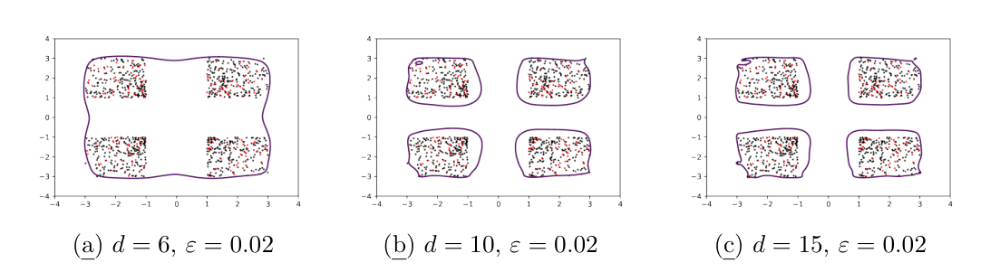

(a) $d = 6$, $\varepsilon = 0.02$ (b) $d = 10$, $\varepsilon = 0.02$ (c) $d = 15$, $\varepsilon = 0.02$

Figure 3: Reach set approximations (outlined in purple) from Example 2, with a reduced sample size of $M = 1000$, of which $N = 200$ are used as a calibration set.

Christoffel polynomial $d$. It only depends on the confidence parameter $\delta$ and the size $N$ of the calibration set. Figure 3 shows the same result for $M = 1000$ samples, of which $N = 200$ samples were utilized as a calibration set. Here, the coverage error $\epsilon$ will be lower than $\epsilon \leq 0.02$. To empirically verify the theoretical guarantees obtained in Theorem 4, we repeated this experiment 1000 times. The empirical error was computed by checking how many of these 10000 samples were not contained in the approximated reachable set. In only $6$ experiments, the coverage error exceeded $\epsilon = 0.02$, confirming that the confidence $1-\delta$ is greater than 99%.

### 3.2. Avoiding the Calibration Set

In this section, we circumvent split between training and calibration sets by using *transductive conformal prediction* Vovk (2013). Transductive conformal prediction is a method used to construct prediction regions for a new data point without relying on a separate training set or calibration set. The calibration set is taken to be the entire training set plus the point at which the function is evaluated, in other words a new non conformity is modulated by the data point. The statistical guarantees of the previous section, and in particular of Theorem 4, hold also for this choice of nonconformity function, with $\mathcal{D}_{\mathrm{cal}} := \mathcal{D}$. This approach allows us to use all the available sample points from the measure $\mu$ to train the Christoffel function and compute the conformal region, but at the price of higher computational cost, as will be discussed below.

Let the training set be $\mathcal{D} = \{ \boldsymbol{x}^1, \boldsymbol{x}^2, ..., \boldsymbol{x}^N \}$ be $N$ i.i.d samples from the probability distribution $\mu$. To compute the p-value at any point $\boldsymbol{x} \in \mathbb{R}^n$, we add $\boldsymbol{x}$ to the set $\mathcal{D}$ before computing the empirical Christoffel polynomial. Let $\mathcal{D}_x = \mathcal{D} \cup \{ \boldsymbol{x} \}$, let the empirical measure for $\mathcal{D}_x$ be $\hat{\mu}_x$, and let $\widehat{\mathbf{M}}_x$ be its moment matrix. Using $\mathcal{D}_x$ in the empirical Christoffel polynomial, we get the nonconformity function

$$
r(\boldsymbol{x}) = \Lambda^{-1}_{\hat{\mu}_x, d}(\boldsymbol{x}) = \mathbf{v}_{d}(\boldsymbol{x})^T \widehat{\mathbf{M}}_x^{-1} \mathbf{v}_{d}(\boldsymbol{x}).
$$

We now have to evaluate a different empirical Christoffel polynomial each time we evaluate the p-value

$$
p_{value}(\boldsymbol{x}) = \tfrac{1}{N} \left| \bigl\{ i \bigm| \Lambda^{-1}_{\hat{\mu}_x, d}(\boldsymbol{x}^{i}) \geq \Lambda^{-1}_{\hat{\mu}_x, d}(\boldsymbol{x}) \bigr\} \right|
$$

<!-- PDF page 12 -->

In particular, we need to compute a new moment matrix and invert it for each evaluation. This is computationally expensive, on the order of $\mathcal{O}(s(d)^3)$. To avoid this, we compute the inverse moment matrix of the set $\mathcal{D}_x$ incrementally using the Sherman-Morrison formula, as proposed by Ducharlet et al. (2022). This allows us to replace the evaluation of $\Lambda^{-1}_{\hat{\mu}_x, d}(\boldsymbol{x})$, which depends on $\boldsymbol{x}$, with evaluations of the original Christoffel polynomial $\Lambda^{-1}_{\hat{\mu}, d}(\boldsymbol{x})$, plus one additional product:

$$
\Lambda^{-1}_{\hat{\mu}_x, d}(\boldsymbol{x}) = \frac{\Lambda^{-1}_{\hat{\mu}, d}(\boldsymbol{x})}{1 + \Lambda^{-1}_{\hat{\mu}, d}(\boldsymbol{x})}, \quad \Lambda^{-1}_{\hat{\mu}_x, d}(\boldsymbol{x}^{i}) = \Lambda^{-1}_{\hat{\mu}, d}(\boldsymbol{x}^{i}) - \frac{\bigl( \mathbf{v}_{d}(\boldsymbol{x})^{\intercal} \boldsymbol{y}^{i} \bigr)^2}{1 + \Lambda^{-1}_{\hat{\mu}, d}(\boldsymbol{x})}, \tag{13}
$$

where $\boldsymbol{y}^{i} = \widehat{\mathbf{M}}_d^{-1} \mathbf{v}_{d}(\boldsymbol{x}^{i})$ are vectors that can be precomputed. The cost of precomputing $\Lambda^{-1}_{\hat{\mu}, d}(\boldsymbol{x}^{i})$ and the vectors $\boldsymbol{y}^{i}$ is $\mathcal{O}(N s(d)^2)$, with storage requirements $\mathcal{O}(N s(d))$. The reduces the cost of evaluating $\Lambda^{-1}_{\hat{\mu}_x, d}(\boldsymbol{x}^{i})$ for a given $\boldsymbol{x}$ to $\mathcal{O}(s(d))$. The resulting cost of evaluating $p_{value}(\boldsymbol{x})$ is $\mathcal{O}(N s(d) + s(d)^2)$.

**Example 3** Building on example 1, Figure 4 shows the reachable set approximation obtained using transductive conformal prediction with a Christoffel function of degree 15. In this case, we use the same $M = N = 1000$ sample points to train the Christoffel function and compute the set approximation. The guarantees provided by Theorem 4 assert that, using a training set of 1000 samples, the coverage error is below 0.45% with confidence $1-\delta = 0.99$.

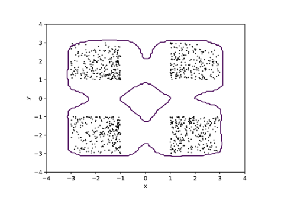

Figure 4: Reach set approximation of example 1 using the transductive conformal prediction and a Christoffel polynomial of degree $d = 15$, which avoids the split into training and calibration sets.

## 4. Robustness to Outliers

In this section, we address the presence of outliers in the data set. As data may not be very abundant in real-life applications, one may have to work with a calibration set containing outliers without knowing which data point is an outlier and which one isn’t. The presence of outliers in the training set does not affect the theoretical guarantees obtained

<!-- PDF page 13 -->

using conformal prediction theory, though it will affect the tightness of the approximated reachable set. On the other hand, the presence of outliers in the calibration set will impact those guarantees.

The following theorem provides PAC guarantees on the reach set approximation even with outliers in the calibration set. Under the assumption that no more than $p$ outliers are in the calibration set $\mathcal{D}$, the confidence in the result depends on $\epsilon$, $p$, and the size of the calibration set $N$.

**Theorem 5** Consider a set of points $\mathcal{D} = \{ \boldsymbol{x}^1, \boldsymbol{x}^2, ..., \boldsymbol{x}^N \}$ containing no more than $p$ outliers, with $2p+1 < N$, and where the rest of samples are i.i.d from a probability measure $\mu$. Then for any i.i.d vector $\boldsymbol{x}$ sampled from $\mu$ and $\epsilon \in (0,1)$,

$$
\mathbb{P}\biggl( \mu\Bigl( C_{\mathcal{D}}^{\frac{p+1}{N}} \Bigr) \geq 1-\epsilon \biggr) \geq \sum_{i=p+1}^{N-p} \binom{N-p}{i} \epsilon^i (1-\epsilon)^{N-p-i} \tag{14}
$$

This bound is tight in the sense that for $p = 0$, (14) is identical to the case without outliers, i.e., we obtain (10).

**Proof** Let $\mathcal{D} = \mathcal{D}_{inlier} \cup \mathcal{D}_{oulier}$, with $m \leq p$ being the unknown real size of $\mathcal{D}_{outlier}$. Let $U_1, \ldots, U_{N-m} \stackrel{\text{i.i.d.}}{\sim} \operatorname{Unif}([0,1])$, with order statistics $U_{(1)} \leq U_{(2)} \leq \ldots \leq U_{(N-m)}$.

For $\epsilon \in (0,1)$ let $b_1 = ... = b_{p+1} = \epsilon$ and $b_{p+2} = ... = b_{N-p} = ... = b_{N-m} = 1$. Then $\forall m \leq p$:

$$
\begin{aligned}
\mathbb{P}\left[ U_{(1)} \leq b_1, \ldots, U_{(N-m)} \leq b_{N-m} \right] & \geq \mathbb{P}\left[ U_{(1)} \leq b_1, \ldots, U_{(N-p)} \leq b_{N-p} \right] \\
& \geq \sum_{i=p+1}^{N-p} \binom{N-p}{i} \epsilon^i (1-\epsilon)^{N-p-i}.
\end{aligned}
$$

The above result is obtained by the following reasoning: let $0 < i \leq N-p$, if we have $N-p$ random variable $V_i, \ldots, V_{N-p} \stackrel{\text{i.i.d.}}{\sim} \operatorname{Unif}([0,1])$ the probability to have exactly $i$ of them below $\epsilon$ is equal to $\binom{N-p}{i} \epsilon^i (1-\epsilon)^{N-p-i}$, therefore, the probability of having at least $p+1$ of them below $\epsilon$ is equal to $\sum_{i=p+1}^{N-p} \binom{N-p}{i} \epsilon^i (1-\epsilon)^{N-p-i}.$

Let $\boldsymbol{x}$ be an i.i.d vector sampled from $\mu$. By definition,

$$
\mu\Bigl( C_{\mathcal{D}_{inliers}}^{\frac{p+1}{N-m}} \Bigr) = \mathbb{P}\Bigl( \boldsymbol{x} \in C_{\mathcal{D}_{inliers}}^{\frac{p+1}{N-m}} \Bigm| \mathcal{D}_{inliers} \Bigr).
$$

Using Theorem 2, we get :

$$
\mathbb{P}\biggl( \mu\Bigl( C_{\mathcal{D}_{inliers}}^{\frac{p+1}{N-m}} \Bigr) \geq 1-\epsilon \biggr) \geq \sum_{i=p+1}^{N-p} \binom{N-p}{i} \epsilon^i (1-\epsilon)^{N-p-i}
$$

Since $C_{\mathcal{D}_{inliers}}^{\frac{p+1}{N-m}} \subseteq C_{\mathcal{D}}^{\frac{p+1}{N}}$, we have $\mu\Bigl( C_{\mathcal{D}}^{\frac{p+1}{N}} \Bigr) \geq \mu\Bigl( C_{\mathcal{D}_{inliers}}^{\frac{p+1}{N-m}} \Bigr)$, which leads us to (14). $\blacksquare$

Note that the bound in Theorem 5 (14) is tight in the sense that for $p = 0$ we obtain the same lower bound as in Theorem 4 (10). Table 4 shows the confidence bound of (14) for different values of the calibration set size and the approximation uncertainty $\epsilon$ under the assumption that no more than 5% of the calibration set are outliers. We observe that the confidence rapidly approaches 100% when the admissible coverage error is above the ratio of outliers; it rapidly drops to 0% when it is below.

<!-- PDF page 14 -->

Table 1: The confidence bound of (14) for different sizes $N$ of the calibration set and the desired coverage error $\epsilon$ for a calibration set with 5% outliers or less

[Table 1](s001-tebjou2023data/table-1.csv)

**Example 4** To evaluate the performance of Algorithm 2 on example 1, we construct a data set from $M = 1500$ samples of the reach set and substitute 10% with outliers, i.e., i.i.d. samples outside the reachable set. We use a calibration set of size $N = 500$, and the rest of the samples are used as a training set to compute the empirical Christoffel polynomial. Figure 5 shows the resulting approximation. With Theorem 5, the coverage error $\epsilon = 0.15$ with a confidence = 98.9%. To empirically confirm these bounds, as in Example 2, we repeat the experiment 1000 times with different samples. For each experiment, we take 10000 samples of the reach set in order to compute the empirical coverage error. None of the experiments resulted in an empirical coverage error above 15%, which is consistent with the theoretical guarantee of 98.9% confidence.

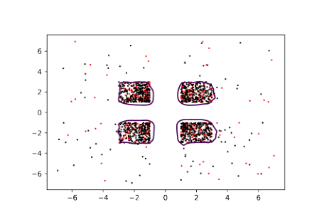

Figure 5: An approximation of the reach set of example 1 (purple outline) obtained with Algorithm 2 using a Christoffel polynomial of degree 15, on a data set with 10% outliers. The training set is shown in black, the calibration set in red.

## 5. Experiments

We now turn our focus to the suitability of the empirical Christoffel polynomial as a non-conformity function.

<!-- PDF page 15 -->

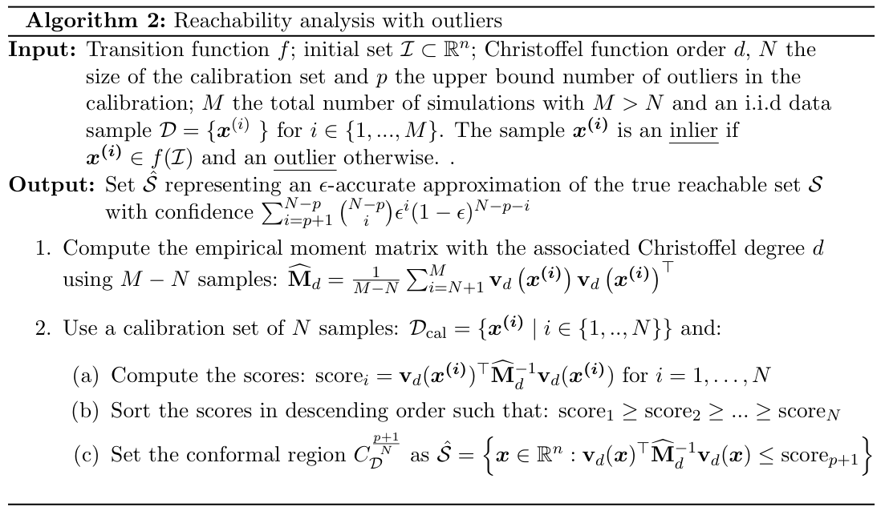

**Algorithm 2:** Reachability analysis with outliers

**Input:** Transition function $f$; initial set $\mathcal{I} \subset \mathbb{R}^n$; Christoffel function order $d$, $N$ the size of the calibration set and $p$ the upper bound number of outliers in the calibration; $M$ the total number of simulations with $M > N$ and an i.i.d data sample $\mathcal{D} = \{\boldsymbol{x}^{(i)} \ \}$ for $i \in \{1,...,M\}$. The sample $\boldsymbol{x^{(i)}}$ is an *inlier* if $\boldsymbol{x^{(i)}} \in f(\mathcal{I})$ and an *outlier* otherwise. .

**Output:** Set $\hat{\mathcal{S}}$ representing an $\epsilon$-accurate approximation of the true reachable set $\mathcal{S}$ with confidence $\sum_{i=p+1}^{N-p} \binom{N-p}{i} \epsilon^i (1-\epsilon)^{N-p-i}$

1. Compute the empirical moment matrix with the associated Christoffel degree $d$ using $M-N$ samples: $\widehat{\mathbf{M}}_d = \frac{1}{M-N} \sum_{i=N+1}^{M} \mathbf{v}_{d}\left(\boldsymbol{x^{(i)}}\right) \mathbf{v}_{d}\left(\boldsymbol{x^{(i)}}\right)^{\top}$

2. Use a calibration set of $N$ samples: $\mathcal{D}_{\mathrm{cal}} = \{ \boldsymbol{x^{(i)}} \mid i \in \{1,..,N\}\}$ and:

&emsp;&emsp;(a) Compute the scores: $\text{score}_i = \mathbf{v}_{d}(\boldsymbol{x^{(i)}})^{\top} \widehat{\mathbf{M}}^{-1}_d \mathbf{v}_{d}(\boldsymbol{x^{(i)}})$ for $i = 1, \ldots, N$

&emsp;&emsp;(b) Sort the scores in descending order such that: $\text{score}_1 \geq \text{score}_2 \geq ... \geq \text{score}_N$

&emsp;&emsp;(c) Set the conformal region $C_{\mathcal{D}}^{\frac{p+1}{N}}$ as $\hat{\mathcal{S}} = \left\{ \boldsymbol{x} \in \mathbb{R}^{n} : \mathbf{v}_{d}(\boldsymbol{x})^{\top} \widehat{\mathbf{M}}^{-1}_d \mathbf{v}_{d}(\boldsymbol{x}) \leq \text{score}_{p+1} \right\}$

### 5.1. Empirical False Positive Rate

We start by examining the tightness of the reachable set approximation in example 2 through the empirical measurement of false positives.

We compare the empirical Christoffel polynomial with other prevalent nonconformity functions: one-class SVM, Isolation Forest (Liu et al., 2008), and Local Outlier Factor (LOF), as shown in Figure 6. Only the approximation using LOF seems comparable to that of the Christoffel polynomial, while Isolation Forest exhibits significant variability depending on the random seed.

To gauge the number of false positives and assess the accuracy of the reachable set approximation, we generated 10,000 uniformly distributed samples within the domain $[-4, 4]^2$. The false-positive rate was empirically determined for various degrees $d$, as shown in Table 2. As observed in earlier plots, a higher degree results in a more accurate fit of the reachable set. The false-positive rates for the other algorithms can also be observed in Table 2 for varying sizes of the training and calibration sets. Consistent with the findings from the Figure 6, only the LOF provides results that are comparable in quality to those obtained using the Christoffel polynomial.

To further demonstrate the effectiveness of the empirical Christoffel polynomial as a non-conformity function, we examine its robustness in the presence of outliers within the training set. Although the theoretical guarantees discussed in this article and in general conformal prediction hold for any choice of non-conformity function, even with outliers in the training set, the presence of these outliers can impact the accuracy of the model. To compare the empirical Christoffel polynomial with LOF, we conducted two experiments. In the first experiment, we considered the region $[-1,1]^2$ as the reachable set to approximate. We focused on comparing the performance of the algorithms under the presence of outliers

<!-- PDF page 16 -->

Table 2: Experimentally estimated false-positive rates for different algorithms applied to the reach set approximation of Example 1, with confidence $1-\delta =$ 99%

[Table 2](s001-tebjou2023data/table-2.csv)

$\epsilon$ = Coverage error, at least $1-\epsilon$ of the measure is covered; FP% = False positives in %, measured by uniform sampling of a sufficiently large bounding box and counting samples in $\hat{S} \setminus S$

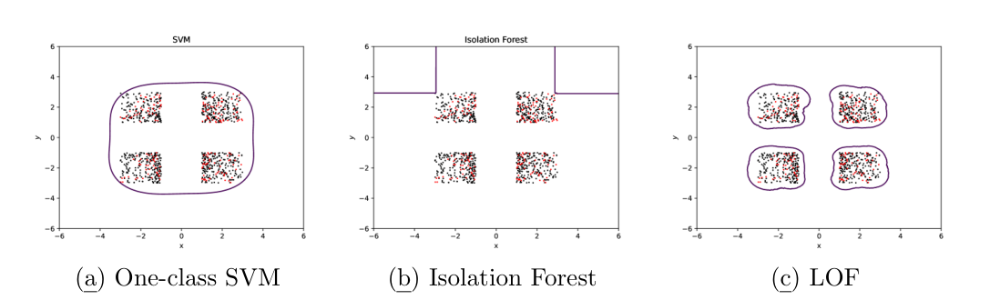

(a) One-class SVM (b) Isolation Forest (c) LOF

Figure 6: Reach set approximations (purple outline) of Example 1 using one-class SVM, Isolation Forest, and Local Outlier Factor (LOF) as nonconformity functions, for a common training set of size 800 (black dots) and calibration set of size 200 (red dots).

in the training set. We generated a training set of size 1,200 containing 200 outliers and a calibration set of size 200, all belonging to the reachable set. The second experiment was similar to the first one, with a star-shaped region as the reachable set. We generated a training set of size 900 containing 100 outliers and a calibration set of size 200. Figure 9 il

<!-- PDF page 17 -->

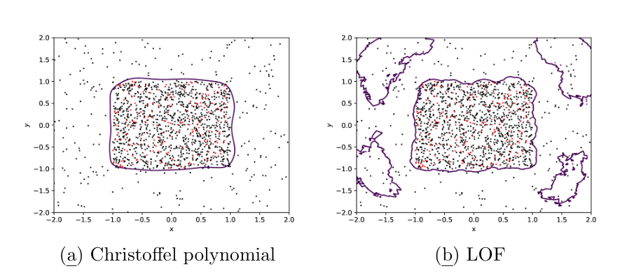

(a) Christoffel polynomial (b) LOF

Figure 7: Comparison of reachable set approximations for the empirical Christoffel polynomial (degree 10) and LOF in the first experiment, with the region $[-1,1]^2$ as the target. The training set, containing outliers, is represented by black dots, while the calibration set is shown in red. The plot highlights the performance differences and robustness of both methods in the presence of outliers, demonstrating how the empirical Christoffel polynomial is far more robust.

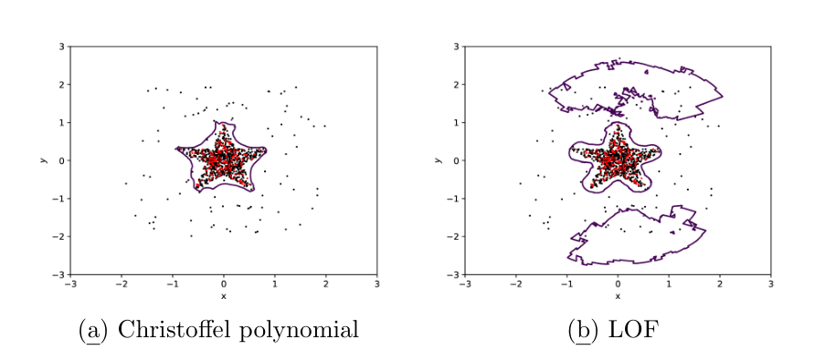

(a) Christoffel polynomial (b) LOF

Figure 8: A comparison of reach set approximation (purple outline) using the Christoffel polynomial with degree 15 and LOF for the second experiment, which targets a star-shaped region. Training set samples are in black and calibration set in red. This plot highlights the performance and robustness of both methods when encountering outliers in a complex geometric scenario, illustrating the effectiveness of the empirical Christoffel polynomial under the presence of outliers.

lustrates how the empirical Christoffel polynomial and LOF approximate the true reachable set in the presence of outliers.

Figures 7 and 8 display the performance of both the empirical Christoffel polynomial and LOF in handling outliers within the training set across distinct and complex geometric situ

<!-- PDF page 18 -->

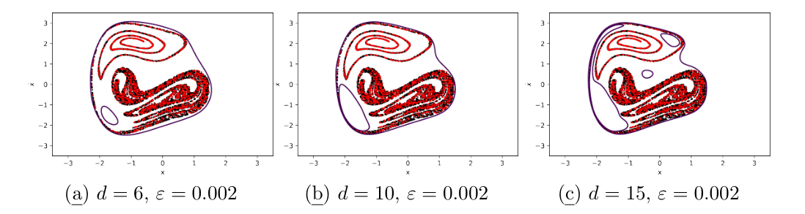

(a) $d = 6$, $\varepsilon = 0.002$ (b) $d = 10$, $\varepsilon = 0.002$ (c) $d = 15$, $\varepsilon = 0.002$

Figure 9: Reach set approximation (purple outline) of the duffing oscillator using the Christoffel polynomial with the data set split into training (black) and calibration set (red), for different degrees $d$ of the Christoffel function, with corresponding coverage error $\varepsilon$ for confidence $1-\delta = 0.99$.

ations. When employed as a non-conformity function, the empirical Christoffel polynomial demonstrated greater robustness in the presence of outliers across both experiments.

### 5.2. Duffing oscillator

The Duffing oscillator is a nonlinear mathematical model that captures the behavior of a system that oscillates when subject to an external force. It has been used in a variety of physical systems, from mechanical vibrations to biological dynamics. The Duffing oscillator is described by the following nonlinear second-order differential equation:

$$
\ddot{x} = -\delta \dot{x} + \alpha x - \beta x^3 + \gamma cos(\omega t)
$$

Similar to Devonport et al. (2021), we take $\alpha = 1$, $\beta = 1, \delta = 0.05, \gamma = 0.4$ and $\omega = 1.3$. We choose the initial set to be $\mathcal{I} = [-0.95, 1.05] \times [-0.05, 0.05]$. Figure 9 shows an approximation of the reach set, computed with the Christoffel function as nonconformity function for different degrees. We observe that for increasing degrees, the approximation is more precise and is able to recover holes. The results are comparable to those reported by Devonport et al. (2021), where no split into training and calibration sets was carried out.

## 6. Conclusion

In this paper, we studied the mathematical reach set approximation in the analysis of dynamical systems based on conformal prediction. We consider for the first time the use of the Christoffel function as a nonconformity function, thanks to its attractive properties in set and density approximation. Our conformal prediction approach provides stronger and more sample-efficient guarantees on reach set approximation and proposed a version of reach set approximation that is robust to outliers, compared that the most relevant approaches in the literature. We exploited an incremental form of the Christoffel function for transductive conformal prediction that avoids splitting the data into training and calibration sets. Extensive illustrative numerical experiments show the effectiveness and the performance of our proposed approach and its associated algorithms.

<!-- PDF page 19 -->

The theoretical results that we presented here in the context of reach set approximation are equally valid to approximate compact sets, or the support of probability distributions, in other application domains. Naturally, the computation of the Christoffel function is subject to numerical errors. The impact of such numerical issues will be studied in future work.

## Acknowledgments

This work has been supported by the French government under the “France 2030” program as part of the SystemX Technological Research Institute. This work was conducted as part of the Confiance.AI program, which aims to develop innovative solutions for enhancing the reliability and trustworthiness of AI-based systems.

## References

Amr Alanwar, Anne Koch, Frank Allgower, and Karl Henrik Johansson. Data-driven reachability analysis from noisy data. *IEEE Transactions on Automatic Control*, pages 1–16, 2023. doi: 10.1109/tac.2023.3257167.

Matthias Althoff, Goran Frehse, and Antoine Girard. Set propagation techniques for reachability analysis. *Annual Review of Control, Robotics, and Autonomous Systems*, 4:369–395, 2021.

Rajeev Alur. *Principles of cyber-physical systems*. MIT press, 2015.

Anastasios N. Angelopoulos and Stephen Bates. A gentle introduction to conformal prediction and distribution-free uncertainty quantification. *CoRR*, abs/2107.07511, 2021. URL https://arxiv.org/abs/2107.07511.

Stephen Bates, Emmanuel Candès, Lihua Lei, Yaniv Romano, and Matteo Sesia. Testing for outliers with conformal p-values. *The Annals of Statistics*, 51(1):149–178, 2023.

Martin Berz and Kyoko Makino. Verified integration of odes and flows using differential algebraic methods on high-order taylor models. *Reliable Computing*, 4(4):361–369, 1998. doi: 10.1023/A:1024467732637. URL https://doi.org/10.1023/A:1024467732637.

Alex Devonport, Forest Yang, Laurent El Ghaoui, and Murat Arcak. Data-driven reachability analysis with christoffel functions. In *2021 60th IEEE Conference on Decision and Control (CDC)*, pages 5067–5072, 2021. doi: 10.1109/CDC45484.2021.9682860.

Franck Djeumou, Aditya Zutshi, and Ufuk Topcu. On-the-fly, data-driven reachability analysis and control of unknown systems: An F-16 aircraft case study. In *Proceedings of the 24th International Conference on Hybrid Systems: Computation and Control*, HSCC ’21, New York, NY, USA, 2021. Association for Computing Machinery. doi: 10.1145/3447928.3457355.

L Doyen, G Frehse, GJ Pappas, and A Platzer. *Verification of Hybrid Systems*, chapter 28. Springer, 2018.

<!-- PDF page 20 -->

Kévin Ducharlet, Louise Travé-Massuyès, Jean-Bernard Lasserre, Marie-Véronique Le Lann, and Youssef Miloudi. Leveraging the Christoffel-Darboux kernel for online outlier detection, 2022.

Nicolas Halbwachs, Yann-Eric Proy, and Pascal Raymond. Verification of linear hybrid systems by means of convex approximations. In *International Static Analysis Symposium, SAS’94*, Namur (Belgium), September 1994.

Shuo Han, Ufuk Topcu, and George J. Pappas. A sublinear algorithm for barrier-certificate-based data-driven model validation of dynamical systems. In *2015 54th IEEE Conference on Decision and Control (CDC)*, pages 2049–2054, 2015. doi: 10.1109/CDC.2015.7402508.

Jean-Bernard Lasserre. On the Christoffel function and classification in data analysis. *Comptes Rendus. Mathématique*, 360:919–928, 2022. doi: 10.5802/crmath.358.

Jean-Bernard Lasserre and Edouard Pauwels. The empirical christoffel function with applications in data analysis. *Advances in Computational Mathematics*, 45(3):1439–1468, 2019.

Fei Tony Liu, Kai Ming Ting, and Zhi-Hua Zhou. Isolation forest. In *2008 eighth ieee international conference on data mining*, pages 413–422. IEEE, 2008.

Stephen Prajna. Barrier certificates for nonlinear model validation. *Automatica*, 42(1):117–126, 2006.

Glenn Shafer and Vladimir Vovk. A tutorial on conformal prediction. *Journal of Machine Learning Research*, 9(3), 2008.

Peter Van Overschee and Bart De Moor. *Subspace identification for linear systems: Theory—Implementation—Applications*. Springer Science & Business Media, 2012.

Vladimir Vovk. Transductive conformal predictors. In *Artificial Intelligence Applications and Innovations: 9th IFIP WG 12.5 International Conference, AIAI 2013, Paphos, Cyprus, September 30–October 2, 2013, Proceedings 9*, pages 348–360. Springer, 2013.
